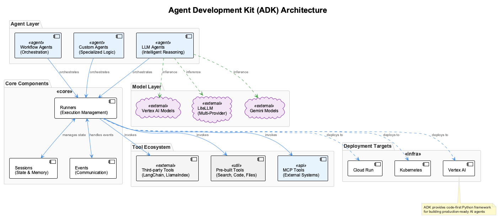

# Agent Development Kit (ADK) - Google's Framework for Building Production AI Agents

## What is ADK (Agent Development Kit)?

### Core Concept

Google's **Agent Development Kit (ADK)** is an open-source, code-first Python framework for building, evaluating, and deploying sophisticated AI agents with flexibility and control. Released in 2025, ADK is the same framework powering agents within Google products like Agentspace and the Google Customer Engagement Suite.



### Philosophy: Making Agent Development Feel Like Software Development

ADK was designed with the principle that **agent development should feel like traditional software development**. This means:

- **Code-first approach**: Define agent logic directly in Python, not configuration files
- **Testability**: Write unit tests for agent behaviors and tool integrations
- **Version control**: Manage agent logic like any other software artifact
- **Modularity**: Compose complex systems from reusable agent components

### Core Architecture Components

ADK's architecture consists of several key components that work together:

1. **Agents**: The central decision-making entities
   - **LLM Agents**: Use Large Language Models for intelligent reasoning
   - **Workflow Agents**: Orchestrate other agents in complex patterns
   - **Custom Agents**: Specialized implementations for unique requirements

2. **Tools**: Functions that agents can use to perform actions
   - Pre-built tools (Search, Code Execution, File Operations)
   - Model Context Protocol (MCP) tools
   - Third-party integrations (LangChain, LlamaIndex)
   - Other agents as tools (hierarchical composition)

3. **Runners**: Components that manage agent execution flow
   - Handle message routing and state management
   - Orchestrate communication between agents
   - Manage event-driven workflows

4. **Sessions**: Maintain conversation context and state
   - Persistent memory across interactions
   - User preference learning
   - Multi-turn conversation management

5. **Events**: Communication mechanism between components
   - Represent steps in agent execution
   - Enable debugging and monitoring
   - Support real-time streaming interactions

### Key Features of ADK

1. **Multi-Agent by Design**: Build modular, scalable applications by composing multiple specialized agents in hierarchical, parallel, or sequential workflows

2. **Model Flexibility**: Works with Gemini (optimized), Vertex AI Model Garden, and LiteLLM integration for providers like Anthropic, Meta, Mistral AI, and AI21 Labs

3. **Built-in Orchestration**: Handle complex workflows with multiple steps, decision points, and error recovery

4. **Rich Tool Ecosystem**: Seamlessly integrate with various APIs, databases, and services using standardized tool interfaces

5. **Streaming Capabilities**: Support real-time interaction including bidirectional audio/video streaming

6. **Agent-to-Agent Communication**: Built-in A2A protocol support for cross-organizational collaboration

7. **Production Ready**: Easy containerization and deployment to Cloud Run, Kubernetes, or Vertex AI

### ADK Agent Structure

```python
from adk import Agent, Tool

class TravelAgent(Agent):
    def __init__(self):
        super().__init__(
            name="travel_planner",
            description="Comprehensive travel planning agent",
            tools=[
                FlightSearchTool(),
                HotelBookingTool(),
                WeatherTool()
            ]
        )
    
    async def plan_trip(self, destination: str, dates: tuple) -> dict:
        # Complex multi-step planning logic
        flights = await self.search_flights(destination, dates)
        hotels = await self.search_hotels(destination, dates)
        weather = await self.get_weather(destination, dates)
        
        return self.create_itinerary(flights, hotels, weather)
```

### ADK vs Traditional AI Frameworks

| Feature | Traditional Frameworks | ADK |
|---------|----------------------|-----|
| Agent Orchestration | Manual implementation | Built-in orchestration engine |
| Error Handling | Custom error handling | Automatic retry and fallback |
| State Management | External state stores | Integrated state management |
| Tool Integration | Framework-specific | Universal tool interface |
| Cross-Framework Support | Limited | Works with multiple frameworks |

## Getting Started with ADK

### Installation

```bash
# Stable release
pip install google-adk

# Development version
pip install git+https://github.com/google/adk-python.git@main
```

### Basic Agent Example

```python
from google.adk import Agent

# Create a simple agent
agent = Agent(
    name="assistant",
    model="gemini-2.0-flash",
    instruction="You are a helpful assistant.",
    tools=[web_search, calculator]
)

# Use the agent
response = await agent.run("What's the weather in San Francisco?")
```

### Multi-Agent System Example

```python
from google.adk import LlmAgent

# Create specialized agents
research_agent = LlmAgent(
    name="researcher",
    model="gemini-2.0-flash",
    instruction="You are a research specialist.",
    tools=[web_search, document_reader]
)

writer_agent = LlmAgent(
    name="writer",
    model="gemini-2.0-flash", 
    instruction="You are a technical writer.",
    tools=[text_formatter, grammar_checker]
)

# Create coordinator agent
coordinator = LlmAgent(
    name="coordinator",
    model="gemini-2.0-flash",
    instruction="You coordinate research and writing tasks.",
    sub_agents=[research_agent, writer_agent]
)

# Execute complex workflow
result = await coordinator.run("Create a report on quantum computing trends")
```

## Integration with MCP

ADK seamlessly integrates with Model Context Protocol (MCP) servers, allowing agents to access external tools and data sources:

```python
from google.adk import Agent
from mcp import MCPClient

# Connect to MCP servers
mcp_client = MCPClient()
mcp_client.connect("database://customer-data")
mcp_client.connect("api://weather-service")

# Create agent with MCP tools
agent = Agent(
    name="data_analyst",
    model="gemini-2.0-flash",
    tools=mcp_client.get_tools()
)
```

## Deployment Options

### Cloud Run Deployment

```dockerfile
FROM python:3.11-slim
WORKDIR /app
COPY requirements.txt .
RUN pip install -r requirements.txt
COPY . .
CMD ["python", "agent_server.py"]
```

### Vertex AI Deployment

```python
from google.cloud import aiplatform

aiplatform.init(project="your-project", location="us-central1")

# Deploy agent as Vertex AI endpoint
endpoint = aiplatform.Endpoint.create(
    display_name="adk-agent-endpoint",
    description="Production ADK agent"
)
```

## Best Practices

1. **Modular Agent Design**: Break complex agents into smaller, specialized sub-agents
2. **Error Handling**: Implement comprehensive error handling and fallback strategies
3. **Testing**: Write unit tests for agent behaviors and integration tests for workflows
4. **Monitoring**: Use built-in events for monitoring and debugging agent execution
5. **Security**: Implement proper authentication and authorization for production deployments

## Resources

- [ADK GitHub Repository](https://github.com/google/adk-python)
- [Official Documentation](https://google.github.io/adk-docs/)
- [Currency Agent Codelab](https://codelabs.developers.google.com/codelabs/currency-agent#0)
- [Google Cloud Integration Guide](https://cloud.google.com/vertex-ai/generative-ai/docs/agent-engine/develop/adk)

## Next Steps

For hands-on experience with ADK, check out:
- **Session6_First_ADK_Agent.md**: Build your first production-ready ADK agent
- **Session6_First_ADK_Agent-solution.md**: Complete implementation examples

ADK represents Google's vision for making agent development as straightforward as traditional software development, providing the tools and abstractions needed to build sophisticated AI systems that can operate at enterprise scale.