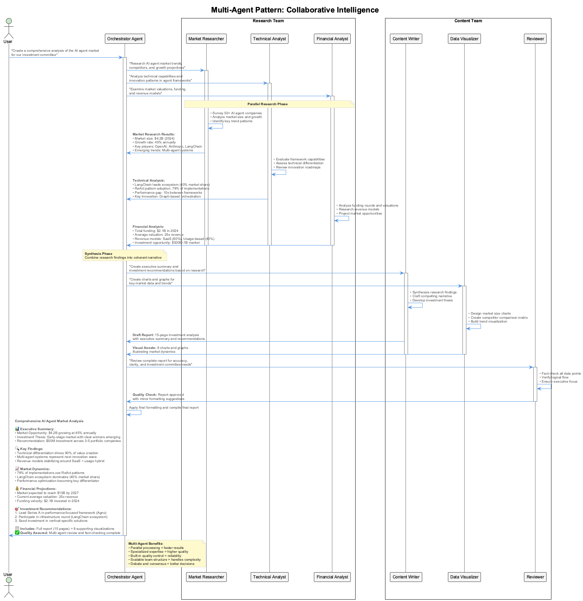

# Session 0: Introduction to Agent Frameworks & Patterns

## Learning Objectives

By the end of this session, you will:

- Understand the five core agentic patterns: Reflection, Tool Use, ReAct, Planning, and Multi-Agent
- Compare major agent frameworks and their architectural approaches including modular/atomic patterns
- Identify when to use each framework based on project requirements
- Recognize the evolution from simple prompts to sophisticated agent systems

---

## Part 1: From Prompts to Agents (20 minutes)

### The Evolution of AI Interaction

The journey from simple prompt-response interactions to sophisticated agent systems represents one of the most significant advances in applied AI. Understanding this evolution helps us appreciate why agent frameworks exist and how they solve real-world problems.

#### Traditional Prompt-Response Model

```python
# Simple prompt-response (limited and fragile)
response = llm.generate("What's the weather today?")
# No context, no tools, no reasoning - just pattern matching
```

**Problems with Simple Prompting:**

- No access to external data or tools
- No memory of previous interactions  
- No ability to plan or reason through complex tasks
- Brittle and inconsistent responses
- Cannot handle multi-step workflows

#### The Agent Paradigm

Agents transform LLMs from static text generators into dynamic, goal-oriented systems that can:

- **Reason** about problems step-by-step
- **Act** by using tools and external resources
- **Plan** multi-step approaches to complex tasks
- **Reflect** on their actions and improve performance
- **Collaborate** with other agents for specialized tasks


### What Makes an Agent "Agentic"?

An agentic system exhibits four key characteristics:

1. **Autonomy**: Operates independently toward goals
2. **Reactivity**: Responds to environment changes
3. **Pro-activeness**: Takes initiative to achieve objectives
4. **Social Ability**: Interacts with other agents and humans

---

## Part 2: The Five Core Agentic Patterns (40 minutes)

Based on recent research and practical implementations, five patterns have emerged as fundamental building blocks for effective agent systems.

### Pattern 1: Reflection - Self-Improvement Through Criticism

**Core Concept**: Agents evaluate and improve their own outputs through iterative self-assessment.


**How It Works:**

1. **Generate**: Agent produces initial response
2. **Reflect**: Agent analyzes its own output for quality, accuracy, completeness
3. **Refine**: Agent revises based on self-criticism
4. **Iterate**: Repeat until satisfactory quality achieved

**When to Use:**

- Content creation requiring high quality (writing, code, analysis)
- Tasks where first attempts are typically insufficient
- Systems that need to build confidence in their outputs

**Example Implementation Pattern:**

```python
class ReflectiveAgent:
    def generate_with_reflection(self, task):
        # Initial attempt
        response = self.generate_initial_response(task)
        
        # Self-reflection loop
        for iteration in range(self.max_iterations):
            critique = self.reflect_on_response(response, task)
            if self.is_satisfactory(critique):
                break
            response = self.refine_response(response, critique, task)
        
        return response
```

### Pattern 2: Tool Use - Extending Agent Capabilities

**Core Concept**: Agents dynamically select and use external tools to access information and perform actions beyond their built-in capabilities.


**Architecture Components:**

- **Tool Registry**: Available tools with descriptions and schemas
- **Tool Selection**: Logic to choose appropriate tools for tasks
- **Execution Engine**: Safe tool execution with error handling
- **Result Integration**: Incorporating tool outputs into reasoning

**Essential Tool Categories:**

- **Information Retrieval**: Web search, databases, APIs
- **Computation**: Calculators, data analysis, mathematical operations
- **Communication**: Email, messaging, notifications
- **File Operations**: Reading, writing, processing documents
- **External Services**: Payment processing, scheduling, integrations

**When to Use:**

- Tasks requiring real-time information
- Operations needing precise calculations
- Integration with existing business systems
- Any scenario where the LLM lacks built-in capabilities

### Pattern 3: ReAct - Reasoning and Acting in Loops

**Core Concept**: Agents alternate between reasoning about their current situation and taking actions, allowing dynamic adaptation to new information.


**The ReAct Cycle:**

1. **Observe**: Analyze current state and available information
2. **Think**: Reason about next steps and potential actions
3. **Act**: Execute chosen action using available tools
4. **Observe**: Evaluate results and update understanding
5. **Repeat**: Continue until goal achieved

**ReAct vs Traditional Planning:**

- **Traditional**: Plan everything upfront, then execute
- **ReAct**: Plan-Act-Observe-Replan in continuous cycles
- **Advantage**: Adapts to unexpected results and new information

**Implementation Structure:**

```python
def react_loop(self, goal):
    observation = self.get_initial_observation()
    
    while not self.goal_achieved(goal):
        # Reasoning phase
        thought = self.think(observation, goal)
        action = self.choose_action(thought)
        
        # Acting phase  
        observation = self.execute_action(action)
        
        # Safety check
        if self.max_steps_exceeded():
            break
    
    return self.format_final_result()
```

### Pattern 4: Planning - Multi-Step Task Decomposition

**Core Concept**: Agents break down complex goals into manageable subtasks, creating executable plans with proper sequencing and dependencies.


**Planning Approaches:**

**Hierarchical Planning:**

- Break large tasks into smaller, manageable subtasks
- Create dependency chains between tasks
- Execute in proper sequence with error handling

**Dynamic Planning:**

- Adjust plans based on execution results
- Handle unexpected obstacles and opportunities
- Balance thorough planning with adaptive execution

**Planning Components:**

- **Goal Analysis**: Understanding requirements and constraints
- **Task Decomposition**: Breaking down into executable steps
- **Resource Assessment**: Identifying needed tools and information
- **Sequencing**: Determining optimal execution order
- **Monitoring**: Tracking progress and adjusting as needed

**When to Use:**

- Complex, multi-step workflows
- Tasks with dependencies between steps
- Long-running processes requiring coordination
- Scenarios where plan visibility aids debugging and monitoring

### Pattern 5: Multi-Agent - Collaborative Intelligence

**Core Concept**: Multiple specialized agents work together, each contributing unique expertise to solve complex problems requiring diverse skills.



**Collaboration Patterns:**

**Sequential Processing:**

- Tasks flow from agent to agent in assembly-line fashion
- Each agent adds specialized value
- Clear handoff points and quality gates

**Parallel Processing:**

- Multiple agents work on different aspects simultaneously
- Results are merged or synthesized
- Faster execution for independent subtasks

**Debate and Consensus:**

- Agents discuss and critique each other's contributions
- Multiple perspectives improve solution quality
- Consensus mechanisms resolve conflicts

**Hierarchical Teams:**

- Manager agents coordinate worker agents
- Clear role definitions and communication protocols
- Scalable structure for complex organizations

**Multi-Agent Coordination Mechanisms:**

- **Message Passing**: Direct communication between agents
- **Shared State**: Common workspace for collaboration
- **Event Systems**: Pub/sub patterns for loose coupling
- **Orchestration**: Central coordinator manages interactions

---

## Part 3: Agent Framework Landscape (30 minutes)

### Framework Classification

Agent frameworks can be categorized based on their primary architectural approach, ranging from bare-metal implementations to enterprise-grade solutions, with atomic/modular approaches providing flexible middle ground:


### Framework Deep Dive

#### **Bare Metal Python (Educational Foundation)**

**Philosophy**: Direct implementation using pure Python and LLM APIs

- **Pros**: Complete control, no hidden abstractions, educational value
- **Cons**: Requires implementing all patterns from scratch
- **Best For**: Learning fundamentals, custom implementations, research

**Basic Agent Structure:**
First, we establish the fundamental components every agent needs - an LLM client for reasoning, tools for actions, and memory for context:

```python
# Bare metal approach - full control, full responsibility
class BareMetalAgent:
    def __init__(self, llm_client, tools):
        self.llm_client = llm_client
        self.tools = tools
        self.conversation_history = []
```

**Message Processing Foundation:**
The core agent behavior starts with message handling and maintaining conversation context:

```python
    def respond(self, message):
        # Manual implementation of all agent logic
        self.conversation_history.append({"role": "user", "content": message})
        
        # Custom tool selection logic
        selected_tool = self.select_tool(message)
```

**LLM Integration and Response Generation:**
Finally, we integrate with the language model and process the response, requiring manual implementation of prompt formatting and response handling:

```python
        # Custom LLM interaction
        response = self.llm_client.generate(
            self.format_prompt_with_tools(message)
        )
        
        return self.process_response(response)
```

#### **LangChain/LangGraph (Industry Standard)**

**Philosophy**: Component-based architecture with extensive ecosystem

- **Approach**: Chain composition with graph-based orchestration
- **Strengths**: Mature ecosystem, extensive documentation, community support
- **Architecture**: Nodes (operations) connected by edges (data flow)

**Graph Structure Initialization:**
LangGraph starts with creating a state graph and defining the operational nodes that represent different agent capabilities:

```python
# LangGraph example - graph-based control flow
from langgraph import StateGraph

def create_agent_graph():
    graph = StateGraph()
    
    # Define nodes (agent operations)  
    graph.add_node("planner", planning_node)
    graph.add_node("executor", execution_node)
    graph.add_node("validator", validation_node)
```

**Control Flow Definition:**
Edges define how information flows between nodes, including conditional logic for dynamic routing based on execution results:

```python
    # Define edges (control flow)
    graph.add_edge("planner", "executor")
    graph.add_conditional_edges("executor", should_validate, {
        "validate": "validator",
        "retry": "planner",
        "finish": END
    })
    
    return graph.compile()
```

**When to Use LangChain/LangGraph:**

- Rapid prototyping with proven components
- Complex workflows requiring precise control flow
- Integration with extensive tool ecosystem
- Teams familiar with functional programming patterns

#### **CrewAI (Team Orchestration)**

**Philosophy**: Role-based multi-agent collaboration with human-like team dynamics

- **Approach**: Define agent roles, assign tasks, let them collaborate
- **Strengths**: Intuitive team metaphors, built-in collaboration patterns
- **Architecture**: Crews (teams) contain Agents (roles) executing Tasks (work)

**Setting up the Team Structure:**
CrewAI starts with importing core components and defining specialized agents with distinct roles, goals, and capabilities:

```python
# CrewAI example - role-based collaboration
from crewai import Agent, Task, Crew

# Define specialized agents
researcher = Agent(
    role="Research Analyst",
    goal="Gather comprehensive information",
    backstory="Expert at finding relevant information",
    tools=[search_tool, scrape_tool]
)
```

**Adding Team Members with Complementary Skills:**
Each agent brings unique expertise to the team. The writer agent focuses on content creation, building on the researcher's findings:

```python
writer = Agent(
    role="Content Writer", 
    goal="Create engaging content",
    backstory="Skilled at crafting compelling narratives",
    tools=[writing_tool]
)
```

**Defining Collaborative Tasks:**
Tasks are assigned to specific agents and can have dependencies, creating a natural workflow where outputs from one agent inform another:

```python
# Define collaborative task
research_task = Task(
    description="Research the latest trends in AI frameworks",
    agent=researcher
)

writing_task = Task(
    description="Write an article based on research findings",
    agent=writer,
    depends_on=[research_task]
)
```

**Orchestrating Team Execution:**
Finally, we create the crew (team) and execute the workflow. CrewAI handles the coordination and data flow between agents automatically:

```python
# Create and run crew
crew = Crew(
    agents=[researcher, writer],
    tasks=[research_task, writing_task]
)

result = crew.kickoff()
```

**When to Use CrewAI:**

- Multi-step workflows requiring specialized expertise
- Teams comfortable with role-based thinking
- Projects needing natural collaboration patterns
- Scenarios where agent personality/backstory matters

#### **PydanticAI (Type-Safe Agents)**

**Philosophy**: Type safety and structured outputs through strong schemas

- **Approach**: Pydantic models define all agent inputs/outputs
- **Strengths**: IDE support, validation, predictable behavior
- **Architecture**: Schema-first development with runtime validation

**Defining Type-Safe Data Structures:**
PydanticAI begins with strict schema definitions. We define input and output models that enforce data validation and provide IDE support:

```python
# PydanticAI example - type-safe agent development
from pydantic import BaseModel
from pydantic_ai import Agent

class ResearchQuery(BaseModel):
    topic: str
    depth: Literal["basic", "detailed", "comprehensive"]
    sources: List[str]
```

**Structured Output Models:**
Output schemas ensure predictable, well-structured responses with clear field types and validation rules:

```python
class ResearchResult(BaseModel):
    summary: str
    key_findings: List[str]
    sources_used: List[str]
    confidence_score: float
```

**Type-Safe Agent Creation:**
The agent is created with explicit input/output types, providing compile-time safety and runtime validation:

```python
research_agent = Agent[ResearchQuery, ResearchResult](
    model='gpt-4',
    system_message="You are a research assistant who provides structured analysis."
)

@research_agent.tool
def search_academic_papers(query: str) -> List[dict]:
    # Type-safe tool implementation
    return perform_academic_search(query)
```

**Runtime Type Validation:**
Usage demonstrates full type safety from input creation to result handling, with automatic validation at each step:

```python
# Usage with full type safety
query = ResearchQuery(
    topic="AI agent frameworks",
    depth="detailed", 
    sources=["academic", "industry"]
)

result: ResearchResult = research_agent.run_sync(query)
```

**When to Use PydanticAI:**

- Enterprise applications requiring predictable behavior
- Teams prioritizing code quality and maintainability
- Integration with existing Pydantic-based systems
- Scenarios where structured outputs are critical

#### **Atomic Agents (Modular Architecture)**

**Philosophy**: Composable, atomic components for maximum flexibility and reusability

- **Approach**: Small, independent agent modules that can be combined
- **Strengths**: Lightweight, modular design, easy to test and maintain
- **Architecture**: Atomic components with clear interfaces and minimal dependencies


**Atomic Component Design:**
Atomic Agents emphasizes breaking down agent functionality into small, composable pieces that can be mixed and matched:

```python
# Atomic Agents example - modular component architecture
from atomic_agents import AtomicAgent, ToolAtom, MemoryAtom

# Define atomic components
search_atom = ToolAtom(
    name="web_search",
    function=search_web,
    schema=SearchSchema
)

memory_atom = MemoryAtom(
    storage_type="in_memory",
    retention_policy="session"
)
```

**Component Composition:**
Components are combined into functional agents through composition rather than inheritance:

```python
# Compose atomic components into a functional agent
research_agent = AtomicAgent(
    atoms=[search_atom, memory_atom],
    coordination_strategy="sequential",
    validation_level="strict"
)
```

**Dynamic Assembly:**
Agents can be dynamically assembled and reconfigured at runtime based on task requirements:

```python
# Dynamic agent assembly based on task needs
def create_specialized_agent(task_type: str) -> AtomicAgent:
    base_atoms = [memory_atom, logging_atom]
    
    if task_type == "research":
        base_atoms.extend([search_atom, analysis_atom])
    elif task_type == "writing":
        base_atoms.extend([writing_atom, grammar_atom])
    
    return AtomicAgent(atoms=base_atoms)

# Create task-specific agents on demand
researcher = create_specialized_agent("research")
writer = create_specialized_agent("writing")
```

**When to Use Atomic Agents:**

- Projects requiring maximum modularity and component reuse
- Teams building diverse agent applications with shared components
- Applications needing dynamic agent assembly and reconfiguration
- Systems where testing and maintenance of individual components is critical

#### **Agno (Performance-Optimized)**

**Philosophy**: Lightweight, high-performance agent development

- **Approach**: Minimal abstractions, maximum efficiency
- **Strengths**: Low memory usage, fast instantiation, multimodal support
- **Architecture**: Direct integration with 23+ model providers

**Lightweight Agent Creation:**
Agno focuses on minimal overhead with direct, efficient agent instantiation:

```python
# Agno example - performance-focused implementation
from agno import Agent, Workflow

# Lightweight agent with minimal overhead
agent = Agent(
    name="efficient_analyzer",
    model="gpt-4o",
    instructions="Analyze data efficiently and return structured results",
    response_model=AnalysisResult,
    tools=[data_processing_tool]
)
```

**High-Performance Workflow Configuration:**
Workflows are optimized for speed and resource efficiency, supporting async execution and minimal memory strategies:

```python
# High-performance workflow
workflow = Workflow(
    agents=[agent],
    memory_strategy="minimal",
    execution_model="async"
)

# Optimized for scale - handles 50x more concurrent agents
results = await workflow.run_parallel(tasks)
```

**When to Use Agno:**

- High-throughput applications (serverless, microservices)
- Resource-constrained environments
- Applications requiring multimodal capabilities
- Performance-critical production systems

#### **ADK (Enterprise Integration)**

**Philosophy**: Enterprise-grade agent development with Google Cloud integration

- **Approach**: Production-ready patterns with built-in observability
- **Strengths**: Enterprise security, monitoring, scalability
- **Architecture**: Cloud-native with comprehensive tooling

**When to Use ADK:**

- Enterprise applications requiring compliance and security
- Google Cloud ecosystem integration
- Production systems needing comprehensive monitoring
- Organizations requiring vendor support

---

## Part 4: Framework Selection Guide (20 minutes)

### Decision Matrix

| **Use Case** | **Recommended Framework** | **Rationale** |
|--------------|---------------------------|---------------|
| **Learning/Research** | Bare Metal Python | Complete understanding of underlying mechanisms |
| **Rapid Prototyping** | LangChain | Extensive components and community resources |
| **Complex Workflows** | LangGraph | Precise control over multi-step processes |
| **Team Collaboration** | CrewAI | Natural role-based patterns and built-in coordination |
| **Type Safety Priority** | PydanticAI | Strong schemas and validation throughout |
| **Modular Architecture** | Atomic Agents | Composable components and dynamic assembly |
| **High Performance** | Agno | Optimized for speed and resource efficiency |
| **Enterprise Production** | ADK | Security, compliance, and monitoring built-in |

### Architectural Considerations

**Complexity vs Control Trade-off:**

- **High Control**: Bare Metal → PydanticAI → LangGraph
- **High Abstraction**: CrewAI → LangChain → Agno
- **Modular Balance**: Atomic Agents → ADK

**Performance vs Features Trade-off:**

- **Performance**: Agno → Bare Metal → Atomic Agents
- **Features**: LangChain → CrewAI → LangGraph

**Learning Curve:**

- **Easiest**: CrewAI → Atomic Agents → LangChain → Agno  
- **Steepest**: Bare Metal → LangGraph → PydanticAI

---

## Part 5: Implementation Patterns Preview (15 minutes)

### Pattern Implementation Across Frameworks

Throughout this module, you'll implement all five agentic patterns using different frameworks to understand:

1. **How each framework approaches the same patterns**
2. **Trade-offs in implementation complexity vs functionality**
3. **When framework abstractions help vs hinder**
4. **Migration paths between frameworks as needs evolve**

### Learning Progression

**Week 1: Foundation & Popular Frameworks**

- Session 1: Pure Python implementation (all patterns from scratch)
- Session 2-3: LangChain/LangGraph (industry standard approaches)
- Session 4-5: CrewAI/PydanticAI (collaboration and type safety)
- Session 6: Atomic Agents (modular architecture bridging individual and enterprise)

**Week 2: Production & Advanced Patterns**

- Session 7: ADK (enterprise-grade implementation)  
- Session 8: Agno (performance optimization)
- Session 9-10: Advanced patterns and production deployment

---

## Self-Assessment Quiz

Test your understanding of agent frameworks and patterns:

### 1. Which agentic pattern involves an agent evaluating and improving its own outputs?

a) Tool Use
b) Reflection
c) Planning  
d) Multi-Agent

### 2. The ReAct pattern combines which two key capabilities?

a) Reading and Acting
b) Reasoning and Acting
c) Reflecting and Acting
d) Retrieving and Acting

### 3. Which framework is best suited for high-performance applications with minimal resource usage?

a) LangChain
b) CrewAI
c) Agno
d) PydanticAI

### 4. What is the primary advantage of the Multi-Agent pattern?

a) Faster execution
b) Specialized expertise collaboration
c) Reduced complexity
d) Lower resource usage

### 5. Which framework emphasizes type safety through schema validation?

a) LangChain
b) CrewAI
c) Agno
d) PydanticAI

### 6. The Planning pattern is most useful for

a) Simple query-response interactions
b) Complex multi-step workflows
c) Real-time data processing
d) Static content generation

### 7. In the Tool Use pattern, what determines which tool an agent selects?

a) Random selection
b) Tool availability
c) Task requirements and tool descriptions
d) Execution speed

### 8. Which framework uses a graph-based architecture for precise control flow?

a) CrewAI
b) LangGraph
c) PydanticAI  
d) Agno

### 9. The primary benefit of using agent frameworks over bare metal implementation is

a) Better performance
b) Lower costs
c) Pre-built components and patterns
d) Simpler deployment

### 10. Which collaboration pattern involves agents working on different aspects simultaneously?

a) Sequential Processing
b) Parallel Processing
c) Debate and Consensus
d) Hierarchical Teams

### 11. When would you choose bare metal Python implementation over frameworks?

a) Production applications
b) Learning fundamentals and custom research
c) Team collaboration projects
d) Enterprise integration

### 12. The reflection pattern typically involves how many phases?

a) 2 phases: Generate and Reflect
b) 3 phases: Generate, Reflect, Refine
c) 4 phases: Generate, Reflect, Refine, Validate
d) 5 phases: Generate, Reflect, Refine, Test, Deploy

### 13. What makes ADK particularly suitable for enterprise applications?

a) Open source licensing
b) Built-in security, monitoring, and Google Cloud integration
c) Fastest execution speed
d) Simplest learning curve

### 14. In multi-agent systems, what is the role of a "Manager Agent"?

a) Execute all tasks directly
b) Store data and state
c) Coordinate worker agents and manage interactions
d) Provide user interface

### 15. Which pattern would be most appropriate for a task requiring real-time stock price analysis?

a) Reflection (for self-improvement)
b) Tool Use (for accessing live data APIs)
c) Planning (for multi-step workflows)  
d) Multi-Agent (for collaboration)

---

## Answer Key

1. **b) Reflection** - The reflection pattern specifically involves agents evaluating and improving their own outputs through iterative self-assessment.

2. **b) Reasoning and Acting** - ReAct stands for Reasoning and Acting, combining these capabilities in iterative loops.

3. **c) Agno** - Agno is optimized for performance with claims of 50x more memory efficiency and 10,000x faster agent instantiation.

4. **b) Specialized expertise collaboration** - Multi-Agent patterns allow different agents with specialized skills to collaborate on complex problems.

5. **d) PydanticAI** - PydanticAI is built around Pydantic models for strong type safety and schema validation.

6. **b) Complex multi-step workflows** - Planning patterns excel at breaking down complex tasks into manageable, sequenced subtasks.

7. **c) Task requirements and tool descriptions** - Agents analyze task needs against available tool capabilities and descriptions to make selection decisions.

8. **b) LangGraph** - LangGraph extends LangChain with graph-based architecture using nodes and edges for precise control flow.

9. **c) Pre-built components and patterns** - Frameworks provide tested implementations of common patterns, reducing development time and complexity.

10. **b) Parallel Processing** - Parallel processing involves multiple agents working simultaneously on different aspects of a problem.

11. **b) Learning fundamentals and custom research** - Bare metal implementation provides complete control and understanding of underlying mechanisms.

12. **b) 3 phases: Generate, Reflect, Refine** - The core reflection pattern involves generating initial output, reflecting on quality, then refining based on critique.

13. **b) Built-in security, monitoring, and Google Cloud integration** - ADK provides enterprise features like security, compliance, monitoring, and cloud-native integration.

14. **c) Coordinate worker agents and manage interactions** - Manager agents orchestrate team activities and handle inter-agent communication.

15. **b) Tool Use (for accessing live data APIs)** - Real-time stock analysis requires accessing external APIs for current market data, making Tool Use the most appropriate pattern.

---

## Next Session Preview

In **Session 1: Bare Metal Agents**, you'll implement all five agentic patterns from scratch using pure Python. This foundation will help you understand what frameworks are actually doing under the hood and appreciate the abstractions they provide.

**Coming Up:**

- Build a complete agent system without any frameworks
- Implement each pattern step-by-step with detailed explanations
- Create your own tool system and reasoning loops
- Understand the complexity that frameworks abstract away

This foundational knowledge will make you more effective with any framework you choose later!
