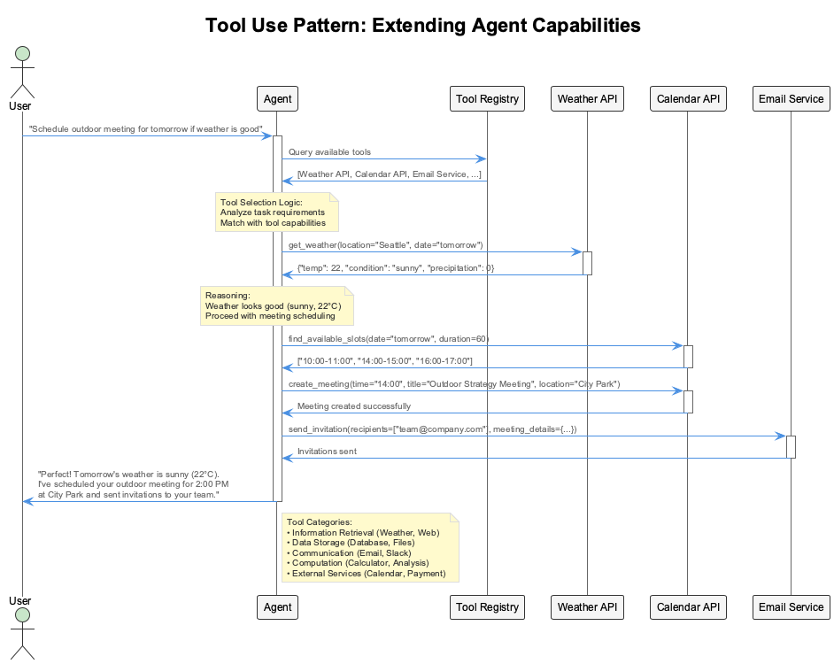

# Session 1: Bare Metal Agents (Pure Python Implementation)

## 🎯 Learning Outcomes

By the end of this session, you will be able to:

- **Understand** the fundamental architecture of intelligent agents
- **Build** agents from scratch using pure Python (no frameworks)
- **Implement** the five core agentic patterns: Reflection, Tool Use, ReAct, Planning, and Multi-Agent
- **Create** reusable agent components with clean object-oriented design
- **Orchestrate** multiple specialized agents working together

## 📚 Chapter Overview

Building agents from first principles gives you deep understanding of how they work internally. Before using high-level frameworks, understanding the core mechanics helps you make better design decisions, debug issues, and extend functionality.

In this session, we'll implement intelligent agents using pure Python, starting with a foundation class and progressively adding sophisticated behaviors through the five agentic patterns.


---

## Part 1: Understanding Agent Fundamentals (20 minutes)

### What Makes an Agent "Intelligent"?

Traditional programs follow predetermined paths:

```text
User Input → Fixed Logic → Predetermined Output
```

Intelligent agents adapt their behavior:

```text
Goal → Reasoning → Action → Observation → Adapt → Repeat
```

### Core Agent Components

Every intelligent agent needs five essential components:

1. **Memory**: Context from previous interactions
2. **Reasoning**: Decision-making capabilities
3. **Tools**: Ways to interact with the external world
4. **Communication**: Structured message handling
5. **Learning**: Ability to improve over time

---

## Part 2: Building the Foundation (25 minutes)

### Step 2.1: Message Structure

First, let's define how agents communicate. Every message needs structure:

```python
# From src/session1/base_agent.py
from dataclasses import dataclass
from datetime import datetime
from typing import Dict, Any

@dataclass
class AgentMessage:
    """Standard message format for agent communication"""
    id: str                    # Unique message identifier
    sender: str               # Who sent this message
    recipient: str            # Who should receive it
    content: str              # The actual message content
    message_type: str         # "request", "response", "notification"
    timestamp: datetime       # When it was sent
    metadata: Dict[str, Any]  # Additional context
```

**Why This Structure?** Standard message formats enable agents to understand each other, track conversations, and handle different types of interactions.

### Step 2.2: Tool Abstraction

Agents need to use external tools, so let's create a consistent interface:

Let's build the tool system step by step:

**Step 1: Define the abstract tool interface**

```python
# From src/session1/base_agent.py
from abc import ABC, abstractmethod

class Tool(ABC):
    """Abstract base class for agent tools"""
    
    def __init__(self, name: str, description: str):
        self.name = name
        self.description = description
```

This establishes the foundation for all tools. Each tool needs a name (for identification) and description (for the agent to understand its purpose).

**Step 2: Define the tool execution contract**

```python
    @abstractmethod
    async def execute(self, **kwargs) -> Dict[str, Any]:
        """Execute the tool with given parameters"""
        pass
```

Every tool must implement `execute()`. It's async to handle I/O operations (API calls, file operations) and returns a dictionary for structured results.

**Step 3: Add tool discovery capabilities**

```python
    def get_schema(self) -> Dict[str, Any]:
        """Return tool schema for agent discovery"""
        return {
            "name": self.name,
            "description": self.description,
            "parameters": self._get_parameters()
        }
    
    @abstractmethod
    def _get_parameters(self) -> Dict[str, Any]:
        """Return parameter schema for this tool"""
        pass
```

The schema system allows agents to discover available tools and understand what parameters each tool expects - essential for dynamic tool selection.

**Key Design Decisions:**

- **Abstract base class**: Ensures all tools have consistent interfaces
- **Schema method**: Allows agents to discover what tools can do
- **Async execution**: Supports tools that make network calls or I/O operations

### Step 2.3: Base Agent Architecture

Now let's build the foundation that all agents will inherit from:

**Core Imports and Dependencies:**

```python
# From src/session1/base_agent.py
import uuid
import logging
from typing import List, Optional, Any
```

**Agent Class Foundation:**

```python
class BaseAgent:
    """Foundation class for all agent implementations"""
    
    def __init__(
        self, 
        name: str, 
        description: str,
        llm_client: Optional[Any] = None,
        tools: Optional[List[Tool]] = None,
        memory: Optional[Dict[str, Any]] = None
    ):
```

**Agent Identity and Core Attributes:**

```python
        self.id = str(uuid.uuid4())           # Unique agent ID
        self.name = name                      # Human-readable name
        self.description = description        # What this agent does
        self.llm_client = llm_client         # Connection to language model
```

**Tool Management and State:**

This section initializes the agent's core operational components. The tools dictionary enables fast tool lookup by name, the memory system provides persistence across conversations, and the conversation history maintains context for improved interactions.

```python
        self.tools = {tool.name: tool for tool in (tools or [])}  # Available tools
        self.memory = memory or {}            # Persistent memory
        self.conversation_history = []        # Message history
        self.logger = logging.getLogger(f"agent.{self.name}")
```

**Why This Design?**

- **Unique ID**: Enables tracking and routing in multi-agent systems
- **Tool dictionary**: Fast lookup by tool name
- **Conversation history**: Maintains context across interactions
- **Logger**: Essential for debugging and monitoring

### Step 2.4: Message Processing Pipeline

Every agent needs to process messages consistently. Let's build this step by step:

**Core Message Processing Method:**

```python
# From src/session1/base_agent.py (continued)
async def process_message(self, message: str, context: Optional[Dict] = None) -> str:
    """Process a message and return response"""
    self.logger.info(f"Processing message: {message[:100]}...")
    
    # Three-step pipeline
    self._store_user_message(message, context)
    response = await self._generate_response(message, context)  
    self._store_agent_response(response)
    
    return response
```

**Why Break Into Steps?** Each step has a single responsibility, making the code easier to test and debug.

**Step 1 - Store User Message:**

```python
def _store_user_message(self, message: str, context: Optional[Dict]):
    """Store incoming user message with timestamp"""
    self.conversation_history.append({
        "role": "user",
        "content": message,
        "timestamp": datetime.now(),
        "context": context
    })
```

**Step 2 - Abstract Response Generation:**

```python
@abstractmethod
async def _generate_response(self, message: str, context: Optional[Dict] = None) -> str:
    """Generate response - implemented by specific agent types"""
    pass
```

**Step 3 - Store Agent Response:**

```python
def _store_agent_response(self, response: str):
    """Store agent response with timestamp"""
    self.conversation_history.append({
        "role": "assistant", 
        "content": response,
        "timestamp": datetime.now()
    })
```

**The Template Method Pattern:** `process_message()` defines the structure, while `_generate_response()` is customized by each agent type.

### Step 2.5: Tool Management

Agents need to dynamically manage their tools:

**Tool Management Methods:**

```python
# From src/session1/base_agent.py (continued)
def add_tool(self, tool: Tool):
    """Add a tool to the agent's toolkit"""
    self.tools[tool.name] = tool
    self.logger.info(f"Added tool: {tool.name}")

def get_available_tools(self) -> List[Dict[str, Any]]:
    """Return list of available tool schemas"""
    return [tool.get_schema() for tool in self.tools.values()]
```

**Tool Addition and Discovery:** These methods let agents dynamically manage their capabilities. The `add_tool()` method registers new tools, while `get_available_tools()` provides a catalog of what the agent can do.

**Tool Execution with Error Handling:**

```python
async def execute_tool(self, tool_name: str, **kwargs) -> Dict[str, Any]:
    """Execute a tool by name with parameters"""
    if tool_name not in self.tools:
        raise ValueError(f"Tool '{tool_name}' not available")
    
    self.logger.info(f"Executing tool: {tool_name} with args: {kwargs}")
    
    try:
        result = await self.tools[tool_name].execute(**kwargs)
        self.logger.info(f"Tool {tool_name} executed successfully")
        return {"success": True, "result": result}
    except Exception as e:
        self.logger.error(f"Tool {tool_name} execution failed: {str(e)}")
        return {"success": False, "error": str(e)}
```

**Error Handling Strategy:** Tools can fail, so we always return success/failure status rather than throwing exceptions that would crash the agent.

**Core Imports and Data Structures:**

```python
# src/session1/base_agent.py
import json
import logging
from abc import ABC, abstractmethod
from dataclasses import dataclass, asdict
from typing import Any, Dict, List, Optional, Callable
from datetime import datetime
import uuid
```

**Standard Message Format:**

```python
@dataclass
class AgentMessage:
    """Standard message format for agent communication"""
    id: str
    sender: str
    recipient: str
    content: str
    message_type: str
    timestamp: datetime
    metadata: Dict[str, Any]
```

**Message Design:** This dataclass defines how agents communicate. Each message has an ID for tracking, sender/recipient for routing, content for the actual data, and metadata for additional context.

**Abstract Tool Interface:**

This abstract base class defines the standard interface for all agent tools. It ensures consistent tool behavior across different implementations and provides the foundation for tool discovery and execution. Every tool must implement the execute method with their specific functionality.

```python
class Tool(ABC):
    """Abstract base class for agent tools"""
    
    def __init__(self, name: str, description: str):
        self.name = name
        self.description = description
    
    @abstractmethod
    async def execute(self, **kwargs) -> Dict[str, Any]:
        """Execute the tool with given parameters"""
        pass
```

**Tool Discovery Schema:**

```python
    def get_schema(self) -> Dict[str, Any]:
        """Return tool schema for agent discovery"""
        return {
            "name": self.name,
            "description": self.description,
            "parameters": self._get_parameters()
        }
    
    @abstractmethod
    def _get_parameters(self) -> Dict[str, Any]:
        """Return parameter schema for this tool"""
        pass
```

**Schema Pattern:** Tools self-describe their capabilities through JSON schemas, enabling dynamic discovery and validation.

**BaseAgent Foundation:**

```python
class BaseAgent:
    """Foundation class for all agent implementations"""
    
    def __init__(
        self, 
        name: str, 
        description: str,
        llm_client: Optional[Any] = None,
        tools: Optional[List[Tool]] = None,
        memory: Optional[Dict[str, Any]] = None
    ):
        self.id = str(uuid.uuid4())
        self.name = name
        self.description = description
        self.llm_client = llm_client
        self.tools = {tool.name: tool for tool in (tools or [])}
        self.memory = memory or {}
        self.conversation_history = []
        self.logger = logging.getLogger(f"agent.{self.name}")
```

**Message Processing Methods:**

**Main Message Processing Method:**

```python
    async def process_message(self, message: str, context: Optional[Dict] = None) -> str:
        """Process a message and return response"""
        self.logger.info(f"Processing message: {message[:100]}...")
        
        # Three-step pipeline
        self._store_user_message(message, context)
        response = await self._generate_response(message, context)  
        self._store_agent_response(response)
        
        return response
```

**Step 1 - Store User Message:**

```python
    def _store_user_message(self, message: str, context: Optional[Dict]):
        """Store user message in conversation history"""
        self.conversation_history.append({
            "role": "user",
            "content": message,
            "timestamp": datetime.now(),
            "context": context
        })
```

**Step 3 - Store Agent Response:**

```python
    def _store_agent_response(self, response: str):
        """Store agent response in conversation history"""
        self.conversation_history.append({
            "role": "assistant", 
            "content": response,
            "timestamp": datetime.now()
        })
```

**Abstract Response Generation:**

```python
    @abstractmethod
    async def _generate_response(self, message: str, context: Optional[Dict] = None) -> str:
        """Generate response - implemented by specific agent types"""
        pass
```

---

## Part 3: The Reflection Pattern (30 minutes)

### What Is Reflection?

The Reflection pattern enables agents to critique and improve their own responses through iterative self-evaluation.

**Traditional Approach:**

```text
Question → Generate Answer → Return Answer
```

**Reflection Approach:**

```text
Question → Initial Answer → Critique → Improve → Critique → Improve → Final Answer
```

### Step 3.1: Reflection Agent Structure

Let's build a reflection agent step by step:

```python
# From src/session1/reflection_agent.py
from base_agent import BaseAgent
from typing import Dict

class ReflectionAgent(BaseAgent):
    """Agent that reflects on and improves its own outputs"""
    
    def __init__(self, name: str, llm_client, max_iterations: int = 3):
        super().__init__(name, "Agent with reflection capabilities", llm_client)
        self.max_iterations = max_iterations  # Prevent infinite loops
        self.reflection_history = []          # Track improvement process
```

**Why Limit Iterations?** Without a maximum, the agent could get stuck in endless self-improvement loops.

### Step 3.2: The Reflection Loop

The core reflection process works like this:

**Reflection Loop Structure:**

**Reflection Main Method Setup:**

```python
# From src/session1/reflection_agent.py (continued)
async def _generate_response(self, message: str, context: Dict = None) -> str:
    """Generate response with reflection and improvement"""
    current_response = await self._initial_response(message, context)
    
    for iteration in range(self.max_iterations):
```

**Reflection and Evaluation Steps:**

```python
        # Step 1: Reflect on current response
        critique = await self._reflect_on_response(message, current_response)
        
        # Step 2: If response is good enough, return it
        if self._is_response_satisfactory(critique):
            self.logger.info(f"Response satisfactory after {iteration + 1} iterations")
            break
```

**Iterative Improvement Process:**

```python
        # Step 3: Improve response based on critique
        improved_response = await self._improve_response(
            message, current_response, critique
        )
        
        # Step 4: Track the improvement process
        self._track_reflection(iteration, current_response, critique, improved_response)
        
        current_response = improved_response
    
    return current_response
```

**The Reflection Cycle:** Initial → Critique → Improve → Evaluate → Repeat (if needed)

### Step 3.3: Initial Response Generation

Start with a basic response that can be improved:

```python
# From src/session1/reflection_agent.py (continued)
async def _initial_response(self, message: str, context: Dict = None) -> str:
    """Generate initial response without reflection"""
    system_prompt = f"""
    You are {self.name}, {self.description}.
    Provide a helpful response to the user's message.
    This is your initial response - focus on being accurate and comprehensive.
    """
    
    prompt = f"{system_prompt}\n\nUser message: {message}"
    response = await self._call_llm(prompt)
    return response
```

**Design Choice:** Keep the initial response focused on accuracy rather than perfection.

### Step 3.4: Self-Critique Process

Now teach the agent to critique its own work:

**Self-Critique Method:**

**Self-Critique Method Setup:**

```python
# From src/session1/reflection_agent.py (continued)
async def _reflect_on_response(self, original_message: str, response: str) -> str:
    """Critically evaluate the response"""
    reflection_prompt = f"""
    Please critique the following response to determine if it can be improved:
    
    Original Question: {original_message}
    Response: {response}
```

**Evaluation Criteria Definition:**

```python
    Evaluate the response on these criteria:
    1. Accuracy and correctness
    2. Completeness and thoroughness  
    3. Clarity and organization
    4. Relevance to the question
    5. Actionability (if applicable)
```

**Critique Completion and Processing:**

```python
    Provide specific, constructive feedback on what could be improved.
    If the response is already excellent, say "SATISFACTORY".
    """
    
    critique = await self._call_llm(reflection_prompt)
    return critique
```

**Why These Five Criteria?** They cover the most important aspects of response quality that can be objectively evaluated.

### Step 3.5: Response Improvement

Use the critique to generate a better response:

**Response Improvement:**

This method implements the core improvement phase of the reflection pattern. It takes the original question, current response, and critique to generate an enhanced version that addresses identified weaknesses while preserving strengths. The improvement prompt is carefully crafted to ensure focused enhancements without unnecessary verbosity.

```python
# From src/session1/reflection_agent.py (continued)
async def _improve_response(self, message: str, current_response: str, critique: str) -> str:
    """Improve response based on critique"""
    improvement_prompt = f"""
    Original Question: {message}
    Current Response: {current_response}
    Critique: {critique}
    
    Based on the critique, provide an improved version of the response.
    Address the specific issues mentioned while maintaining the strengths.
    Make the response better without making it unnecessarily longer.
    """
    
    improved = await self._call_llm(improvement_prompt)
    return improved
```

**Satisfaction Check:**

```python
def _is_response_satisfactory(self, critique: str) -> bool:
    """Determine if response is satisfactory based on critique"""
    return "SATISFACTORY" in critique.upper()
```

**Stopping Condition:** When the critique says "SATISFACTORY", the agent knows it's done improving.

### Step 3.6: Tracking Reflection History

For debugging and analysis, track each improvement:

**Reflection Tracking:**

This method captures the complete reflection journey for analysis and debugging purposes. By recording each iteration of the improvement process, developers can understand how the agent's reasoning evolves and identify patterns that could guide further optimization of the reflection process.

```python
# From src/session1/reflection_agent.py (continued)
def _track_reflection(self, iteration: int, original: str, critique: str, improved: str):
    """Track reflection history for analysis"""
    self.reflection_history.append({
        "iteration": iteration + 1,
        "original": original,
        "critique": critique,
        "improved": improved,
        "timestamp": datetime.now()
    })
```

**Reflection Analytics:**

```python
def get_reflection_summary(self) -> Dict:
    """Get summary of reflection process"""
    if not self.reflection_history:
        return {"total_reflections": 0}
    
    return {
        "total_reflections": len(self.reflection_history),
        "average_iterations": sum(
            r["iteration"] for r in self.reflection_history
        ) / len(self.reflection_history),
        "recent_reflections": self.reflection_history[-5:]  # Last 5
    }
```

**Why Track History?** Understanding how often and why the agent improves its responses helps optimize the reflection process.

### Step 3.7: LLM Client Integration

Finally, we need to connect with an actual language model:

```python
# From src/session1/reflection_agent.py (continued)
async def _call_llm(self, prompt: str) -> str:
    """Call LLM with prompt - implement based on your LLM client"""
    if hasattr(self.llm_client, 'chat'):
        response = await self.llm_client.chat(prompt)
        return response
    else:
        # Fallback simulation for testing
        return f"Simulated response to: {prompt[:50]}..."
```

**Flexible Design:** The agent works with any LLM client that has a `chat()` method, and provides fallback for testing.

**Real-World Example:**
When you ask "What's the capital of France?", a reflection agent might:

1. **Initial response:** "Paris is the capital of France."
2. **Critique:** "Response is accurate but could include more context."
3. **Improved response:** "Paris is the capital and largest city of France, located in the north-central part of the country."
4. **Final critique:** "SATISFACTORY - Response is accurate and informative."


---

## Part 4: The Tool Use Pattern (35 minutes)

### Understanding Tool Use

The Tool Use pattern enables agents to extend their capabilities by integrating with external systems, APIs, and functions.

**Without Tools:**

```text
User: "What's the weather in London?"
Agent: "I don't have access to current weather data."
```

**With Tools:**

This example demonstrates how tool access transforms agent capabilities, enabling them to provide real-time, accurate information by integrating with external APIs:

```text
User: "What's the weather in London?"
Agent: [Uses weather API] "It's currently 15°C and cloudy in London."
```

### Step 4.1: Creating Useful Tools

Let's implement concrete tools that agents can use:

**Calculator Tool - Safe Mathematical Operations:**

**Calculator Tool Implementation:**

**Calculator Tool Dependencies:**

```python
# From src/session1/tools.py
import math
from base_agent import Tool
```

**Calculator Tool Class Definition:**

```python
class CalculatorTool(Tool):
    """Mathematical calculation tool with safe evaluation"""
    
    def __init__(self):
        super().__init__("calculator", "Perform mathematical calculations")
```

**Safe Evaluation Environment Setup:**

```python
    async def execute(self, expression: str) -> Dict[str, Any]:
        """Execute mathematical calculation safely"""
        try:
            # Create safe evaluation environment
            allowed_names = {
                k: v for k, v in math.__dict__.items() if not k.startswith("__")
            }
            allowed_names.update({"abs": abs, "round": round})
```

**Expression Evaluation and Result Handling:**

```python
            # Evaluate with restricted environment
            result = eval(expression, {"__builtins__": {}}, allowed_names)
            return {"expression": expression, "result": result}
        except Exception as e:
            return {"expression": expression, "error": str(e)}
```

**Why Safe Evaluation?** Using `eval()` with restricted builtins prevents code injection while allowing mathematical operations.

**Web Search Tool - External API Integration:**

**Web Search Tool Structure:**

```python
# From src/session1/tools.py (continued)
class WebSearchTool(Tool):
    """Tool for web search using a search API"""
    
    def __init__(self, api_key: str = None):
        super().__init__("web_search", "Search the web for information")
        self.api_key = api_key
```

**Search Execution (Simulated):**

```python
    async def execute(self, query: str, num_results: int = 5) -> Dict[str, Any]:
        """Execute web search"""
        # In production, this would call a real search API
        # For demo purposes, we simulate the response
        return {
            "query": query,
            "results": [{
                "title": f"Search result for '{query}'",
                "url": f"https://example.com/search/{query.replace(' ', '-')}",
                "snippet": f"Relevant information about {query} found online."
            }]
        }
```

**Parameter Schema:**

```python
    def _get_parameters(self) -> Dict[str, Any]:
        return {
            "query": {"type": "string", "description": "Search query"},
            "num_results": {"type": "integer", "description": "Number of results", "default": 5}
        }
```

**File Operations Tool - Secure File Access:**

**File Operations Tool Structure:**

```python
# From src/session1/tools.py (continued)
class FileOperationTool(Tool):
    """File system operations with security restrictions"""
    
    def __init__(self, allowed_paths: List[str] = None):
        super().__init__("file_ops", "Read and write files")
        self.allowed_paths = allowed_paths or ["./data/"]  # Security: restrict paths
```

**Secure File Operations:**

```python
    async def execute(self, operation: str, path: str, content: str = None) -> Dict[str, Any]:
        """Execute file operation with security checks"""
        # Security check: only allow operations in specified directories
        if not any(path.startswith(allowed) for allowed in self.allowed_paths):
            return {"error": f"Path not allowed: {path}"}
        
        try:
            if operation == "read":
                with open(path, 'r') as f:
                    return {"operation": "read", "path": path, "content": f.read()}
            elif operation == "write":
                with open(path, 'w') as f:
                    f.write(content)
                return {"operation": "write", "path": path, "status": "success"}
            else:
                return {"error": f"Unknown operation: {operation}"}
        except Exception as e:
            return {"error": str(e)}
```

**Security First:** The tool restricts file access to allowed directories, preventing agents from accessing sensitive system files.

### Step 4.2: Tool Use Agent Architecture

Now let's build an agent that can intelligently select and use tools:

**Tool Use Agent Structure:**

This specialized agent extends the base agent with intelligent tool discovery and usage capabilities. It can analyze available tools, select the most appropriate tool for each task, and track tool usage patterns to improve future decisions. The tool usage history enables analysis of tool effectiveness and optimization opportunities.

```python
# From src/session1/tool_use_agent.py
from base_agent import BaseAgent, Tool
from typing import Dict, List, Any
import json

class ToolUseAgent(BaseAgent):
    """Agent capable of discovering, selecting, and using tools"""
    
    def __init__(self, name: str, llm_client, tools: List[Tool] = None):
        super().__init__(
            name, 
            "Agent with advanced tool use capabilities",
            llm_client,
            tools
        )
        self.tool_usage_history = []  # Track tool usage for analysis
```

### Step 4.3: The Tool Use Decision Process

The agent follows a four-step process for tool use:

**Tool Use Decision Process:**

**Tool Use Main Method and Analysis:**

```python
# From src/session1/tool_use_agent.py (continued)
async def _generate_response(self, message: str, context: Dict = None) -> str:
    """Generate response with intelligent tool use"""
    
    # Step 1: Analyze if tools are needed
    tool_analysis = await self._analyze_tool_needs(message)
    
    # Step 2: Simple response if no tools needed
    if not tool_analysis.get("needs_tools", False):
        return await self._simple_response(message)
```

**Tool Planning and Execution:**

```python
    # Step 3: Plan which tools to use and how
    tool_plan = await self._plan_tool_usage(message, tool_analysis)
    
    # Step 4: Execute the plan and synthesize response
    response = await self._execute_tool_plan(message, tool_plan)
    
    return response
```

**The Four-Step Process:**

1. **Analyze**: Does this question need tools?
2. **Decide**: If not, respond directly
3. **Plan**: Which tools, in what order?
4. **Execute**: Run the plan and synthesize results

### Step 4.4: Tool Need Analysis

Teach the agent to recognize when tools are needed:

**Tool Analysis Method and Setup:**

```python
# From src/session1/tool_use_agent.py (continued)
async def _analyze_tool_needs(self, message: str) -> Dict[str, Any]:
    """Analyze if message requires tool use"""
    available_tools = self.get_available_tools()
    tools_desc = "\n".join([
        f"- {tool['name']}: {tool['description']}"
        for tool in available_tools
    ])
```

**Analysis Prompt Construction:**

```python
    analysis_prompt = f"""
    Analyze if the following user message requires any tools to answer properly.
    
    User message: {message}
    
    Available tools:
    {tools_desc}
```

**JSON Response Format Definition:**

```python
    Respond with JSON:
    {{
        "needs_tools": true/false,
        "reasoning": "explanation of why tools are/aren't needed",
        "relevant_tools": ["list", "of", "relevant", "tool", "names"]
    }}
    """
```

**Response Processing and Error Handling:**

```python
    response = await self._call_llm(analysis_prompt)
    
    try:
        return json.loads(self._extract_json(response))
    except Exception:
        return {"needs_tools": False, "reasoning": "Failed to parse analysis"}
```

**Smart Decision Making:** The agent considers both the question and available tools before deciding to use them.

### Step 4.5: Tool Usage Planning

Once tools are needed, create a step-by-step execution plan:

**Tool Planning Setup:**

```python
# From src/session1/tool_use_agent.py (continued)
async def _plan_tool_usage(self, message: str, analysis: Dict) -> List[Dict]:
    """Create a step-by-step plan for tool usage"""
    relevant_tools = analysis.get("relevant_tools", [])
    tool_schemas = {
        tool["name"]: tool for tool in self.get_available_tools()
        if tool["name"] in relevant_tools
    }
```

**Plan Generation Prompt:**

**Step 1: Set up the planning prompt structure**

```python
    planning_prompt = f"""
    Create a plan to use tools to answer this message:
    
    User message: {message}
    Reasoning: {analysis.get('reasoning', '')}
    
    Available relevant tools:
    {json.dumps(tool_schemas, indent=2)}
```

This section provides context to the LLM about what the user wants and what tools are available for the task.

**Step 2: Define the expected output format**

```python
    Create a step-by-step plan in JSON format:
    {{
        "steps": [
            {{
                "step": 1,
                "tool": "tool_name",
                "parameters": {{"param1": "value1"}},
                "purpose": "why this step is needed"
            }}
        ]
    }}
    """
```

By specifying the exact JSON structure, we ensure the agent returns a structured plan we can programmatically parse and execute.

**Plan Processing:**

```python
    response = await self._call_llm(planning_prompt)
    
    try:
        plan = json.loads(self._extract_json(response))
        return plan.get("steps", [])
    except Exception:
        return []  # Fallback to no tools
```

**Why Plan First?** Complex tasks might need multiple tools in sequence, and planning prevents inefficient tool usage.

### Step 4.6: Plan Execution and Response Synthesis

Execute the plan and combine results into a coherent response:

**Plan Execution Loop:**

**Plan Execution Method Setup:**

```python
# From src/session1/tool_use_agent.py (continued)
async def _execute_tool_plan(self, message: str, plan: List[Dict]) -> str:
    """Execute the tool plan and generate final response"""
    tool_results = []
    
    # Execute each step in the plan
    for step in plan:
        tool_name = step.get("tool")
        parameters = step.get("parameters", {})
        purpose = step.get("purpose", "")
```

**Step Execution and Logging:**

```python
        self.logger.info(f"Executing step {step.get('step')}: {purpose}")
        
        # Execute the tool
        result = await self.execute_tool(tool_name, **parameters)
```

**Result Tracking and History Management:**

```python
        # Track the execution
        step_result = {
            "step": step.get("step"),
            "tool": tool_name,
            "parameters": parameters,
            "purpose": purpose,
            "result": result
        }
        tool_results.append(step_result)
```

**Usage History and Response Generation:**

```python
        # Add to usage history
        self.tool_usage_history.append({
            "message": message,
            "tool": tool_name,
            "parameters": parameters,
            "result": result,
            "timestamp": datetime.now()
        })
    
    # Generate final response using all results
    return await self._synthesize_response(message, tool_results)
```

### Step 4.7: Response Synthesis

Combine tool results into a natural, helpful response:

**Response Synthesis:**

```python
# From src/session1/tool_use_agent.py (continued)
async def _synthesize_response(self, message: str, tool_results: List[Dict]) -> str:
    """Create final response from tool results"""
    results_summary = "\n".join([
        f"Step {r['step']} - {r['tool']}: {r['result']}"
        for r in tool_results
    ])
```

This synthesis prompt combines all tool results into a coherent, user-friendly response. It instructs the LLM to integrate information naturally while hiding technical execution details, ensuring the final response appears seamless to the user.

```python
    synthesis_prompt = f"""
    User asked: {message}
    
    I used tools to gather information:
    {results_summary}
    
    Based on these tool results, provide a comprehensive and helpful response to the user.
    Integrate the information naturally and cite the sources when relevant.
    Don't mention the internal tool execution details.
    """
    
    return await self._call_llm(synthesis_prompt)
```

**Utility Methods:**

These utility methods provide essential support functions for text processing and fallback response generation when tools aren't needed:

```python
# Utility methods
def _extract_json(self, text: str) -> str:
    """Extract JSON from text response"""
    import re
    json_match = re.search(r'\{.*\}', text, re.DOTALL)
    if json_match:
        return json_match.group()
    return "{}"

async def _simple_response(self, message: str) -> str:
    """Generate simple response without tools"""
    prompt = f"Respond to the following message: {message}"
    return await self._call_llm(prompt)
```

**Natural Integration:** The final response hides the tool execution complexity and presents information as if the agent naturally knew it.



### Step 4.8: Usage Analytics

Track tool usage patterns for optimization:

**Usage Statistics:**

```python
# From src/session1/tool_use_agent.py (continued)
def get_tool_usage_stats(self) -> Dict:
    """Get statistics about tool usage for optimization"""
    if not self.tool_usage_history:
        return {"total_uses": 0}
    
    # Count usage by tool
    tool_counts = {}
    for usage in self.tool_usage_history:
        tool = usage["tool"]
        tool_counts[tool] = tool_counts.get(tool, 0) + 1
```

```python
    return {
        "total_uses": len(self.tool_usage_history),
        "tool_counts": tool_counts,
        "most_used_tool": max(tool_counts, key=tool_counts.get) if tool_counts else None,
        "recent_usage": self.tool_usage_history[-5:]  # Last 5 uses
    }
```

**LLM Integration:**

This method provides a flexible interface for LLM communication, with fallback simulation for testing and development environments:

```python
# LLM client integration
async def _call_llm(self, prompt: str) -> str:
    """Call LLM - flexible integration"""
    if hasattr(self.llm_client, 'chat'):
        return await self.llm_client.chat(prompt)
    return f"Simulated response to: {prompt[:50]}..."
```

**Usage Analytics Help:** Understanding which tools are used most helps optimize tool selection and identify missing capabilities.

**Real-World Example:**
When you ask "What's 15% of $1,200?", the tool use agent:

1. **Analyzes:** "This needs mathematical calculation"
2. **Plans:** "Use calculator tool with expression '1200 * 0.15'"
3. **Executes:** Calculator returns `{"result": 180}`
4. **Synthesizes:** "15% of $1,200 is $180."

---

## Part 5: The ReAct Pattern (30 minutes)

### Understanding ReAct (Reasoning + Acting)

ReAct combines reasoning and acting in a transparent loop, showing its thought process while solving problems.

**Traditional Problem Solving:**

In traditional problem-solving approaches, the reasoning process remains hidden from users and developers:

```text
Question → Think Internally → Answer
```

**ReAct Approach:**

ReAct makes the reasoning process transparent and iterative, enabling better debugging and understanding:

```text
Question → Think (visible) → Act → Observe → Think → Act → ... → Answer
```

### Step 5.1: ReAct Step Structure

Each ReAct cycle contains three components:

```python
# From src/session1/react_agent.py
from dataclasses import dataclass
from typing import Optional, Dict

@dataclass
class ReActStep:
    """Represents a single ReAct step"""
    step_number: int
    thought: str                           # What the agent thinks
    action: Optional[str] = None          # What action it takes (if any)
    action_input: Optional[Dict] = None   # Parameters for the action
    observation: Optional[str] = None     # What it observes after acting
```

**The ReAct Triple:** Thought → Action → Observation

### Step 5.2: ReAct Agent Architecture

```python
# From src/session1/react_agent.py (continued)
from base_agent import BaseAgent, Tool
from typing import List

class ReActAgent(BaseAgent):
    """Agent implementing ReAct (Reasoning and Acting) pattern"""
    
    def __init__(self, name: str, llm_client, tools: List[Tool] = None, max_steps: int = 10):
        super().__init__(
            name,
            "Agent using ReAct pattern for transparent reasoning",
            llm_client,
            tools
        )
        self.max_steps = max_steps    # Prevent infinite reasoning loops
        self.react_history = []       # Store all reasoning sessions
```

**Safety First:** Max steps prevent the agent from getting stuck in endless reasoning loops.

### Step 5.3: The ReAct Main Loop

**ReAct Main Loop Setup:**

**ReAct Method Setup and Initialization:**

```python
# From src/session1/react_agent.py (continued)
async def _generate_response(self, message: str, context: Dict = None) -> str:
    """Generate response using ReAct pattern"""
    steps = []
    step_number = 1
    
    # Start with initial thought
    current_thought = await self._initial_thought(message)
```

**Main ReAct Loop and Action Decision:**

```python
    # ReAct loop: Think → Act → Observe → Repeat
    while step_number <= self.max_steps:
        step = ReActStep(step_number=step_number, thought=current_thought)
        
        # Decide what action to take based on current thought
        action_decision = await self._decide_action(message, steps, current_thought)
```

**Final Answer Check and Action Execution:**

```python
        # Check if ready to give final answer
        if action_decision.get("action") == "ANSWER":
            final_answer = await self._generate_final_answer(message, steps)
            step.observation = f"Final Answer: {final_answer}"
            steps.append(step)
            break
        
        # Execute the decided action
        if action_decision.get("action"):
            step.action = action_decision["action"]
            step.action_input = action_decision.get("action_input", {})
```

**Observation and Next Thought Generation:**

```python
            # Perform action and observe result
            observation = await self._execute_action(step.action, step.action_input)
            step.observation = observation
            
            # Generate next thought based on observation
            current_thought = await self._next_thought(message, steps + [step], observation)
```

**Loop Completion and Response Formatting:**

```python
        steps.append(step)
        step_number += 1
    
    # Store reasoning session for analysis
    self._store_reasoning_session(message, steps)
    
    # Format and return response
    return self._format_react_response(steps)
```

**The ReAct Loop:** Each iteration contains reasoning (thought), action selection, action execution, and observation.

### Step 5.4: Generating Initial Thoughts

Start each ReAct session with a clear initial thought:

**Initial Thought Generation Setup:**

```python
# From src/session1/react_agent.py (continued)
async def _initial_thought(self, message: str) -> str:
    """Generate initial thought about the problem"""
    tools_desc = "\n".join([
        f"- {tool['name']}: {tool['description']}"
        for tool in self.get_available_tools()
    ])
```

This method builds a catalog of available tools so the agent understands what capabilities it has access to.

**Structured Prompt Construction:**

```python
    prompt = f"""
    You need to answer this question: {message}
    
    Available tools:
    {tools_desc}
    
    Think about how to approach this problem. What information do you need?
    What steps might be required? Start with a clear thought about your approach.
    
    Respond with just your thought, starting with "I need to..."
    """
    
    return await self._call_llm(prompt)
```

### Step 5.5: Action Decision Making

Decide what action to take based on the current thought:

**Action Decision Method Setup:**

```python
# From src/session1/react_agent.py (continued)
async def _decide_action(self, message: str, steps: List[ReActStep], thought: str) -> Dict:
    """Decide next action based on current thought and history"""
    steps_summary = self._format_steps_for_prompt(steps)
    tools_desc = "\n".join([
        f"- {tool['name']}: {tool['description']}"
        for tool in self.get_available_tools()
    ])
```

**Decision Prompt Context Building:**

```python
    prompt = f"""
    Question: {message}
    
    Previous steps:
    {steps_summary}
    
    Current thought: {thought}
    
    Available tools:
    {tools_desc}
```

**Action Options and Response Format:**

```python
    Based on your current thought, decide what action to take next.
    You can either:
    1. Use a tool (provide tool name and parameters)
    2. Answer the question directly if you have enough information
    
    Respond with JSON:
    {{
        "action": "tool_name" or "ANSWER",
        "action_input": {{"param": "value"}} or null,
        "reasoning": "why you chose this action"
    }}
    """
```

**Response Processing and Error Handling:**

```python
    response = await self._call_llm(prompt)
    
    try:
        return json.loads(self._extract_json(response))
    except Exception:
        return {"action": "ANSWER", "reasoning": "Failed to parse action decision"}
```

**Decision Points:** The agent can either use a tool to gather information or provide a final answer if it has enough information.

### Step 5.6: Action Execution and Observation

**Action Execution and Result Processing:**

```python
# From src/session1/react_agent.py (continued)
async def _execute_action(self, action: str, action_input: Dict) -> str:
    """Execute an action and return observation"""
    if action == "ANSWER":
        return "Ready to provide final answer"
    
    # Execute the tool and format observation
    result = await self.execute_tool(action, **action_input)
    
    if result["success"]:
        return f"Successfully executed {action}. Result: {result['result']}"
    else:
        return f"Failed to execute {action}. Error: {result['error']}"
```

The action execution provides clear success/failure feedback, which becomes the agent's "observation" for the next reasoning step.

**Next Thought Generation Based on Observations:**

```python
async def _next_thought(self, message: str, steps: List[ReActStep], observation: str) -> str:
    """Generate next thought based on observation"""
    steps_summary = self._format_steps_for_prompt(steps)
    
    prompt = f"""
    Question: {message}
    
    Steps so far:
    {steps_summary}
    
    Latest observation: {observation}
    
    Based on this observation, what should you think about next?
    Do you have enough information to answer the question?
    What additional information might you need?
    
    Provide your next thought:
    """
    
    return await self._call_llm(prompt)
```

**Continuous Learning:** Each observation informs the next thought, creating a learning loop.

### Step 5.7: Response Formatting and Analysis

Make the ReAct process visible to users:

**Step 1: Format user-facing response with reasoning transparency**

**User-Friendly Response Formatting:**

```python
# From src/session1/react_agent.py (continued)
def _format_react_response(self, steps: List[ReActStep]) -> str:
    """Format final response showing ReAct reasoning process"""
    response = ["## ReAct Reasoning Process\n"]
    
    for step in steps:
        response.append(f"**Step {step.step_number}:**")
        response.append(f"*Thought:* {step.thought}")
```

The formatting method creates a markdown-formatted display of the reasoning process, making it easy for users to follow the agent's thinking.

**Action and Observation Display:**

```python
        if step.action and step.action != "ANSWER":
            response.append(f"*Action:* {step.action} with {step.action_input}")
        
        if step.observation:
            if "Final Answer:" in step.observation:
                response.append(f"*{step.observation}*")
            else:
                response.append(f"*Observation:* {step.observation}")
        
        response.append("")  # Empty line for readability
    
    return "\n".join(response)
```

This method creates a user-friendly display of the reasoning process, making the agent's thought process transparent and educational.

**Step 2: Store reasoning sessions for analysis and improvement**

```python
def _store_reasoning_session(self, message: str, steps: List[ReActStep]):
    """Store reasoning session for later analysis"""
    self.react_history.append({
        "message": message,
        "steps": steps,
        "timestamp": datetime.now()
    })
```

Storing reasoning sessions enables pattern analysis - understanding when agents succeed or fail, and optimizing prompts accordingly.

**Step 3: Format steps for LLM prompt inclusion**

```python
def _format_steps_for_prompt(self, steps: List[ReActStep]) -> str:
    """Format steps for inclusion in prompts"""
    formatted = []
    for step in steps:
        formatted.append(f"Step {step.step_number}:")
        formatted.append(f"  Thought: {step.thought}")
        if step.action:
            formatted.append(f"  Action: {step.action} {step.action_input}")
        if step.observation:
            formatted.append(f"  Observation: {step.observation}")
    return "\n".join(formatted)
```

This utility formats the reasoning chain for inclusion in subsequent LLM prompts, maintaining context across conversation turns.

**Transparency Benefit:** Users can follow the agent's reasoning process, building trust and enabling debugging.

**Real-World Example:**
When asked "What's the square root of 144 plus 5?", a ReAct agent might show:

**Step 1:**
*Thought:* I need to calculate the square root of 144 and then add 5.
*Action:* calculator with {"expression": "sqrt(144) + 5"}
*Observation:* Successfully executed calculator. Result: 17

**Step 2:**
*Thought:* I have the answer from the calculation.
*Final Answer:* The square root of 144 plus 5 equals 17.


### Step 5.8: Final Answer Generation and Analysis

**Step 1: Generate final answer from reasoning chain**

```python
# From src/session1/react_agent.py (continued)
async def _generate_final_answer(self, message: str, steps: List[ReActStep]) -> str:
    """Generate final answer based on reasoning process"""
    steps_summary = self._format_steps_for_prompt(steps)
    
    prompt = f"""
    Question: {message}
    
    Reasoning process:
    {steps_summary}
    
    Based on your reasoning and the information gathered, provide a comprehensive
    final answer to the question. Be specific and cite the information you used.
    """
    
    return await self._call_llm(prompt)
```

This method synthesizes all the reasoning steps into a final, comprehensive answer. The prompt includes the full reasoning chain so the LLM can cite specific information sources.

**Step 2: Performance analysis and optimization tracking**

**Performance Analysis and Optimization Tracking:**

```python
def get_react_analysis(self) -> Dict:
    """Analyze ReAct performance for optimization"""
    if not self.react_history:
        return {"total_conversations": 0}
    
    total_steps = sum(len(h["steps"]) for h in self.react_history)
    avg_steps = total_steps / len(self.react_history)
```

The analysis method calculates key performance metrics to help optimize the reasoning process.

**Action Usage Pattern Analysis:**

```python
    # Analyze action usage patterns
    action_counts = {}
    for history in self.react_history:
        for step in history["steps"]:
            if step.action:
                action = step.action
                action_counts[action] = action_counts.get(action, 0) + 1
    
    return {
        "total_conversations": len(self.react_history),
        "average_steps": avg_steps,
        "total_steps": total_steps,
        "action_distribution": action_counts,
        "most_recent": self.react_history[-1] if self.react_history else None
    }
```

This analysis function tracks key metrics: how many steps agents typically take, which actions are used most frequently, and overall conversation patterns. This data helps optimize the agent's reasoning efficiency.

**Step 3: Utility methods for text processing and LLM integration**

```python
# Utility methods
def _extract_json(self, text: str) -> str:
    """Extract JSON from text response"""
    import re
    json_match = re.search(r'\{.*\}', text, re.DOTALL)
    return json_match.group() if json_match else "{}"

async def _call_llm(self, prompt: str) -> str:
    """Call LLM - flexible integration"""
    if hasattr(self.llm_client, 'chat'):
        return await self.llm_client.chat(prompt)
    return f"Simulated response to: {prompt[:50]}..."
```

These utility methods handle common operations: extracting JSON from unstructured LLM responses and providing a flexible interface for different LLM providers.

**Performance Analysis:** Tracking step counts and action patterns helps optimize the reasoning process and identify bottlenecks.

---

## Part 6: Multi-Agent Orchestration (25 minutes)

### The Power of Specialized Agents

Instead of building one super-agent that does everything, we can create specialized agents that excel at specific tasks and coordinate them.

**Monolithic Agent:**

```text
General Agent: Does math, writes text, searches web, manages files
→ Jack of all trades, master of none
```

**Multi-Agent System:**

```text
Math Agent + Writer Agent + Search Agent + File Agent + Coordinator
→ Each agent specializes and excels at its domain
```

### Step 6.1: Agent Coordinator Architecture

**Coordinator Structure:**

```python
# From src/session1/multi_agent_system.py
from typing import Dict, List, Any
from base_agent import BaseAgent, AgentMessage
from datetime import datetime

class AgentCoordinator:
    """Coordinates multiple specialized agents in a system"""
    
    def __init__(self):
        self.agents: Dict[str, BaseAgent] = {}  # Registered agents
        self.message_history = []               # All inter-agent messages
        self.communication_patterns = {}       # Track who talks to whom
```

**Agent Registration:**

```python
    def register_agent(self, agent: BaseAgent):
        """Register a specialized agent with the coordinator"""
        self.agents[agent.name] = agent
        self.communication_patterns[agent.name] = []
        print(f"✓ Registered agent: {agent.name} ({agent.description})")
```

### Step 6.2: Message Routing System

**Message Routing:**

```python
# From src/session1/multi_agent_system.py (continued)
async def route_message(self, message: str, to_agent: str, from_agent: str = "user") -> str:
    """Route message to specific agent and track communication"""
    if to_agent not in self.agents:
        return f"Error: Agent '{to_agent}' not found"
    
    # Log communication pattern
    self.communication_patterns[to_agent].append({
        "from": from_agent,
        "message": message[:50] + "..." if len(message) > 50 else message,
        "timestamp": datetime.now()
    })
```

**Message Processing and History:**

```python
    # Process message with target agent
    agent = self.agents[to_agent]
    response = await agent.process_message(message)
    
    # Store complete conversation
    self.message_history.append({
        "from": from_agent,
        "to": to_agent,
        "message": message,
        "response": response,
        "timestamp": datetime.now()
    })
    
    return response
```

### Step 6.3: Collaborative Task Management

**Collaborative Task Coordination:**

```python
# From src/session1/multi_agent_system.py (continued)
async def collaborative_task(self, task: str, agent_roles: Dict[str, str]) -> str:
    """Coordinate multiple agents on a collaborative task"""
    results = {}
    
    # Assign roles and execute in parallel or sequence
    for agent_name, role_instruction in agent_roles.items():
        if agent_name in self.agents:
            full_instruction = f"Role: {role_instruction}\n\nTask: {task}"
            
            print(f"🔄 Delegating to {agent_name}: {role_instruction}")
            response = await self.route_message(full_instruction, agent_name, "coordinator")
            results[agent_name] = response
            print(f"✓ Completed by {agent_name}")
```

The coordinator delegates specific roles to specialized agents, combining their individual expertise for complex tasks.

**Result Synthesis and Integration:**

```python
    # Synthesize collaborative results
    synthesis = await self._synthesize_collaborative_results(task, results)
    return synthesis

async def _synthesize_collaborative_results(self, task: str, results: Dict[str, str]) -> str:
    """Combine results from multiple agents into coherent response"""
    synthesis = [f"# Collaborative Task Results\n**Task:** {task}\n"]
    
    for agent_name, result in results.items():
        synthesis.append(f"## Contribution from {agent_name}")
        synthesis.append(result)
        synthesis.append("")  # Empty line
    
    synthesis.append("## Summary")
    synthesis.append("All specialized agents have contributed their expertise to complete this collaborative task.")
    
    return "\n".join(synthesis)
```

### Step 6.4: System Monitoring and Analytics

**System Statistics and Monitoring:**

```python
# From src/session1/multi_agent_system.py (continued)
def get_system_stats(self) -> Dict:
    """Get comprehensive statistics about the multi-agent system"""
    # Calculate communication patterns
    total_messages = len(self.message_history)
    agent_activity = {}
    
    for msg in self.message_history:
        agent = msg["to"]
        if agent not in agent_activity:
            agent_activity[agent] = 0
        agent_activity[agent] += 1
```

This method analyzes system performance by tracking message patterns and agent activity levels.

**Comprehensive Statistics Collection:**

```python
    return {
        "total_agents": len(self.agents),
        "agent_names": list(self.agents.keys()),
        "total_messages": total_messages,
        "agent_activity": agent_activity,
        "most_active_agent": max(agent_activity, key=agent_activity.get) if agent_activity else None,
        "communication_patterns": self.communication_patterns,
        "recent_activity": self.message_history[-5:]  # Last 5 messages
    }
```


---

## Part 7: Testing Your Bare Metal Agents (15 minutes)

### Step 7.1: Comprehensive Test Suite

Create tests to verify each agent pattern works correctly:

**Test Dependencies and Setup:**

```python
# From src/session1/test_agents.py
import asyncio
from reflection_agent import ReflectionAgent
from tool_use_agent import ToolUseAgent
from react_agent import ReActAgent
from tools import CalculatorTool, WebSearchTool
from multi_agent_system import AgentCoordinator
```

**Mock LLM Client for Testing:**

```python
class MockLLMClient:
    """Mock LLM client for testing without real API calls"""
    
    def __init__(self):
        self.call_count = 0
    
    async def chat(self, prompt: str) -> str:
        self.call_count += 1
        
        # Return contextually appropriate responses
        if "critique" in prompt.lower():
            return "SATISFACTORY - The response is clear and accurate."
        elif "json" in prompt.lower() and "needs_tools" in prompt:
            return '{"needs_tools": true, "reasoning": "Math calculation needed", "relevant_tools": ["calculator"]}'
        elif "json" in prompt.lower() and "action" in prompt:
            return '{"action": "calculator", "action_input": {"expression": "15 + 25"}, "reasoning": "Need to calculate"}'
        elif "thought" in prompt.lower():
            return "I need to calculate this mathematical expression using the calculator tool."
        else:
            return "This is a test response demonstrating agent functionality."
```

**Reflection Agent Test:**

```python
# Test individual agent patterns
async def test_reflection_agent():
    """Test reflection agent with self-improvement"""
    print("\n🔄 Testing Reflection Agent...")
    llm_client = MockLLMClient()
    agent = ReflectionAgent("TestReflection", llm_client, max_iterations=2)
    
    response = await agent.process_message("Explain the benefits of renewable energy.")
    
    assert isinstance(response, str) and len(response) > 0
    assert hasattr(agent, 'reflection_history')
    print(f"  ✓ Reflection agent working correctly")
```

**Tool Use Agent Test:**

```python
async def test_tool_use_agent():
    """Test tool use agent with calculator"""
    print("\n🔧 Testing Tool Use Agent...")
    llm_client = MockLLMClient()
    calculator = CalculatorTool()
    agent = ToolUseAgent("TestToolUse", llm_client, tools=[calculator])
    
    response = await agent.process_message("What is 25 * 4?")
    
    assert isinstance(response, str) and len(response) > 0
    stats = agent.get_tool_usage_stats()
    print(f"  ✓ Tool use agent executed {stats.get('total_uses', 0)} tool operations")
```

**ReAct Agent Test:**

```python
async def test_react_agent():
    """Test ReAct agent with visible reasoning"""
    print("\n🧐 Testing ReAct Agent...")
    llm_client = MockLLMClient()
    calculator = CalculatorTool()
    agent = ReActAgent("TestReAct", llm_client, tools=[calculator], max_steps=3)
    
    response = await agent.process_message("Calculate the square of 12")
    
    assert "Step" in response  # Should show reasoning steps
    analysis = agent.get_react_analysis()
    print(f"  ✓ ReAct agent completed reasoning in {analysis.get('average_steps', 0):.1f} average steps")
```

**Multi-Agent System Test Setup:**

```python
async def test_multi_agent_system():
    """Test multi-agent coordination"""
    print("\n🔗 Testing Multi-Agent System...")
    coordinator = AgentCoordinator()
    llm_client = MockLLMClient()
    
    # Create specialized agents
    calculator_agent = ToolUseAgent("Calculator", llm_client, [CalculatorTool()])
    reflection_agent = ReflectionAgent("Reviewer", llm_client)
    
    # Register agents
    coordinator.register_agent(calculator_agent)
    coordinator.register_agent(reflection_agent)
```

**Multi-Agent Collaborative Test:**

```python
    # Test collaborative task
    task = "Calculate 15% tip on $80 and review the calculation"
    roles = {
        "Calculator": "Calculate 15% of $80",
        "Reviewer": "Review the calculation for accuracy"
    }
    
    result = await coordinator.collaborative_task(task, roles)
    stats = coordinator.get_system_stats()
    
    assert stats["total_agents"] == 2
    print(f"  ✓ Multi-agent system coordinated {stats['total_agents']} agents")
    print(f"  ✓ Processed {stats['total_messages']} inter-agent messages")
```

**Main Test Runner:**

```python
# Main test runner
async def run_comprehensive_tests():
    """Run all bare metal agent tests"""
    print("=== Bare Metal Agent Test Suite ===")
    
    await test_reflection_agent()
    await test_tool_use_agent()
    await test_react_agent()
    await test_multi_agent_system()
    
    print("\n✓ All tests passed! Your bare metal agents are working correctly.\n")

if __name__ == "__main__":
    asyncio.run(run_comprehensive_tests())
```

### Step 7.2: Demo Runner

Create a demonstration showing all patterns working together:

**Demo Dependencies and Setup:**

```python
# From src/session1/demo_runner.py
import asyncio
from multi_agent_system import AgentCoordinator
from reflection_agent import ReflectionAgent
from tool_use_agent import ToolUseAgent
from react_agent import ReActAgent
from tools import CalculatorTool, WebSearchTool, FileOperationTool
from test_agents import MockLLMClient
```

**Demo Initialization and Tool Setup:**

```python
async def demo_bare_metal_agents():
    """Comprehensive demonstration of all agent patterns"""
    print("=== Bare Metal Agent Framework Demo ===")
    print("Demonstrating the five core agentic patterns\n")
    
    # Setup
    llm_client = MockLLMClient()
    coordinator = AgentCoordinator()
    
    # Create specialized agents
    calculator_tool = CalculatorTool()
    search_tool = WebSearchTool()
    file_tool = FileOperationTool(["./demo_data/"])
```

**Agent Creation and Registration:**

```python
    # 1. Reflection Agent - Self-improving responses
    print("🔄 Creating Reflection Agent (self-improvement)")
    reflection_agent = ReflectionAgent("SelfImprover", llm_client, max_iterations=2)
    coordinator.register_agent(reflection_agent)
    
    # 2. Tool Use Agent - Smart tool selection
    print("🔧 Creating Tool Use Agent (smart tool selection)")
    tool_agent = ToolUseAgent("ToolExpert", llm_client, [calculator_tool, file_tool])
    coordinator.register_agent(tool_agent)
    
    # 3. ReAct Agent - Transparent reasoning
    print("🧐 Creating ReAct Agent (visible reasoning)")
    react_agent = ReActAgent("Reasoner", llm_client, [calculator_tool, search_tool], max_steps=5)
    coordinator.register_agent(react_agent)
    
    print(f"\n✓ Created {coordinator.get_system_stats()['total_agents']} specialized agents")
```

**Individual Agent Demonstration:**

```python
    # Demonstration scenarios
    print("\n=== Demonstration Scenarios ===")
    
    # Scenario 1: Complex calculation with reasoning
    print("\n1. Complex Mathematical Problem:")
    task1 = "Calculate compound interest: $1000 at 5% annually for 3 years"
    result1 = await coordinator.route_message(task1, "Reasoner")
    print(f"Result: {result1[:200]}...")
```

**Multi-Agent Collaboration Demo:**

```python
    # Scenario 2: Multi-agent collaboration
    print("\n2. Collaborative Analysis:")
    task2 = "Analyze the cost-benefit of solar panels for a home"
    roles = {
        "ToolExpert": "Calculate potential energy savings and costs",
        "SelfImprover": "Create a comprehensive recommendation report",
        "Reasoner": "Research and reason through the decision factors"
    }
    result2 = await coordinator.collaborative_task(task2, roles)
    print(f"Collaborative result completed with {len(roles)} agents")
```

**Final Statistics and Cleanup:**

After completing all demonstrations, we gather system statistics to show the overall activity and successfully conclude the demo:

```python
    # System statistics
    stats = coordinator.get_system_stats()
    print(f"\n=== Final Statistics ===")
    print(f"Total agents: {stats['total_agents']}")
    print(f"Messages processed: {stats['total_messages']}")
    print(f"Most active agent: {stats.get('most_active_agent', 'N/A')}")
    
    print("\n✓ Demo completed successfully!")

if __name__ == "__main__":
    asyncio.run(demo_bare_metal_agents())
```

**To Run the Demo:**

```bash
cd src/session1
pip install -r requirements.txt
python demo_runner.py
```

**Expected Output:**

- Agent creation and registration
- Individual pattern demonstrations
- Multi-agent collaboration example
- Performance statistics and analytics

---

## Key Takeaways

1. **Foundation Understanding**: Building agents from scratch teaches you the core mechanics that all frameworks abstract away

2. **Pattern Recognition**: The five agentic patterns (Reflection, Tool Use, ReAct, Planning, Multi-Agent) are fundamental building blocks

3. **Object-Oriented Design**: Clean architecture with base classes, inheritance, and composition enables extensible agent systems

4. **Tool Abstraction**: Consistent tool interfaces allow agents to integrate with any external system or API

5. **Multi-Agent Coordination**: Specialized agents working together often outperform monolithic general-purpose agents

6. **Transparency and Debugging**: Bare metal implementation makes it easier to understand, debug, and optimize agent behavior

## What's Next?

In Session 2, we'll explore how LangChain provides high-level abstractions for these same patterns, understanding the trade-offs between control and convenience. You'll see how the concepts you've learned here map to framework components.

---

## 📝 Test Your Knowledge

Ready to test your understanding of bare metal agent implementations? Take the comprehensive assessment to evaluate your mastery of foundational agent patterns, tool integration, and multi-agent architectures.

**[View Test Solutions](Session1_Test_Solutions.md)**

---

[← Back to Session 0](Session0_Introduction_to_Agent_Frameworks_Patterns.md) | [Next: Session 2 →](Session2_LangChain_Foundations.md)
