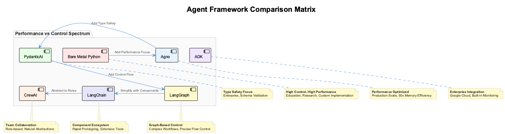

# Session 2: LangChain Foundations & Tool Integration

## 🎯 Learning Outcomes

By the end of this session, you will be able to:
- **Understand** LangChain's architecture and core components (LLMs, Tools, Agents, Memory)
- **Implement** the five agentic patterns using LangChain's built-in abstractions
- **Create** custom tools and integrate them with LangChain agents
- **Compare** LangChain vs bare metal approaches for different use cases
- **Design** production-ready agent systems with proper error handling

## 📚 Chapter Overview

LangChain is one of the most popular agent frameworks, providing high-level abstractions that simplify agent development. While Session 1 taught you the fundamentals by building from scratch, this session shows how frameworks can accelerate development while maintaining flexibility.

We'll implement the same five patterns from Session 1, but using LangChain's built-in components, then compare the trade-offs between approaches.



---

## Part 1: Understanding LangChain Architecture (20 minutes)

### The LangChain Philosophy

LangChain follows a **modular, composable architecture** where components can be mixed and matched:

**Traditional Programming:**
```

Input → Fixed Logic → Output
```


**LangChain Approach:**
```

Input → LLM + Tools + Memory + Agent → Dynamic Output
```


### Step 1.1: Core Components Overview

LangChain has four essential building blocks:

```python
# From src/session2/langchain_basics.py - Core imports
from langchain.chat_models import ChatOpenAI
from langchain.agents import Tool, initialize_agent
from langchain.memory import ConversationBufferMemory
from langchain.callbacks import StdOutCallbackHandler
```


**Why These Four?**
- **LLMs**: The "brain" that makes decisions
- **Tools**: The "hands" that interact with the world
- **Memory**: The "context" that maintains conversation state
- **Agents**: The "orchestrator" that coordinates everything

#### **1. Language Models (LLMs)**
LangChain provides unified interfaces for different LLM providers:

**LLM Factory Setup:**

The factory pattern allows us to create different LLM instances through a unified interface. This is particularly valuable when you need to switch between providers without changing your agent code.

```python
# src/session2/llm_setup.py
from langchain.chat_models import ChatOpenAI, ChatAnthropic
from langchain.llms import OpenAI
import os

class LLMFactory:
    """Factory for creating LLM instances"""
    
    @staticmethod
    def create_llm(provider: str, **kwargs):
        """Create LLM instance based on provider"""
```

**OpenAI Provider Configuration:**

The OpenAI integration is the most commonly used option, supporting GPT-3.5 and GPT-4 models with flexible configuration:

```python
        if provider == "openai":
            return ChatOpenAI(
                model="gpt-4",
                temperature=kwargs.get("temperature", 0.7),
                openai_api_key=os.getenv("OPENAI_API_KEY")
            )
```

**Anthropic Provider Configuration:**

Anthropic's Claude models offer strong reasoning capabilities and are configured similarly to OpenAI:

```python
        elif provider == "anthropic":
            return ChatAnthropic(
                model="claude-3-sonnet-20240229",
                temperature=kwargs.get("temperature", 0.7),
                anthropic_api_key=os.getenv("ANTHROPIC_API_KEY")
            )
```

**Error Handling and Usage:**

The factory includes validation and provides a simple interface for creating LLM instances:

```python
        else:
            raise ValueError(f"Unsupported provider: {provider}")

# Usage example - easy switching between providers
llm = LLMFactory.create_llm("openai", temperature=0.1)
```


#### **2. Tools and Tool Integration**
LangChain's tool system provides standardized interfaces:

**Tool Integration Imports:**

LangChain provides multiple approaches for creating tools. Here are the essential imports for tool development:

```python
# src/session2/langchain_tools.py
from langchain.tools import BaseTool, StructuredTool, tool
from langchain.tools.file_management import ReadFileTool, WriteFileTool
from langchain.tools import DuckDuckGoSearchResults
from typing import Optional, Type
from pydantic import BaseModel, Field
import requests
import json
import math
```

**Method 1: Inheriting from BaseTool**

This is the traditional approach for creating custom tools, offering maximum control and flexibility:

```python
class CalculatorTool(BaseTool):
    """Enhanced calculator tool for LangChain"""
    name = "calculator"
    description = "Perform mathematical calculations and expressions"
```

**Tool Execution Logic:**

The `_run` method contains the core functionality. Note the safe evaluation approach to prevent security issues:

```python
    def _run(self, expression: str) -> str:
        """Execute the tool"""
        try:
            # Safe evaluation of mathematical expressions
            allowed_names = {
                k: v for k, v in math.__dict__.items() if not k.startswith("__")
            }
            allowed_names.update({"abs": abs, "round": round})
            
            result = eval(expression, {"__builtins__": {}}, allowed_names)
            return f"Result: {result}"
        except Exception as e:
            return f"Error: {str(e)}"
```

**Async Support:**

For tools that may need asynchronous execution, implement the `_arun` method:

```python
    def _arun(self, expression: str):
        """Async version (if needed)"""
        raise NotImplementedError("Calculator doesn't support async")
```

**Method 2: Using @tool Decorator**

The decorator approach is simpler for straightforward functions and requires less boilerplate:

```python
@tool
def weather_tool(city: str) -> str:
    """Get current weather for a city"""
    # Simulate weather API call
    try:
        # In real implementation, call actual weather API
        weather_data = {
            "temperature": 72,
            "condition": "sunny",
            "humidity": 45
        }
        return f"Weather in {city}: {weather_data['temperature']}°F, {weather_data['condition']}, {weather_data['humidity']}% humidity"
    except Exception as e:
        return f"Error getting weather for {city}: {str(e)}"
```

**Method 3: StructuredTool with Pydantic Models**

For tools requiring complex, validated inputs, combine StructuredTool with Pydantic schemas:

```python
class EmailInput(BaseModel):
    """Input schema for email tool"""
    recipient: str = Field(description="Email recipient address")
    subject: str = Field(description="Email subject line")
    body: str = Field(description="Email body content")

def send_email(recipient: str, subject: str, body: str) -> str:
    """Send an email"""
    # Simulate email sending
    return f"Email sent to {recipient} with subject '{subject}'"
```

**Structured Tool Creation:**

The structured approach provides automatic input validation and better error messages:

```python
email_tool = StructuredTool.from_function(
    func=send_email,
    name="send_email",
    description="Send an email to specified recipient",
    args_schema=EmailInput
)
```

**Custom API Integration Tool**

For external API integrations, the BaseTool approach offers the most flexibility:

```python
class NewsAPITool(BaseTool):
    """Tool for fetching news from NewsAPI"""
    name = "news_search"
    description = "Search for recent news articles on a given topic"
    
    def __init__(self, api_key: str):
        super().__init__()
        self.api_key = api_key
```

**API Implementation Details:**

The tool implementation handles API calls, data processing, and error management:

```python
    def _run(self, query: str, num_articles: int = 5) -> str:
        """Fetch news articles"""
        try:
            # Simulate news API call
            articles = [
                {
                    "title": f"Article about {query} #{i+1}",
                    "url": f"https://news.example.com/article-{i+1}",
                    "description": f"This is a news article about {query}"
                }
                for i in range(num_articles)
            ]
```

**Result Formatting:**

Proper formatting ensures agents can effectively use the tool output:

```python
            result = f"Found {len(articles)} articles about '{query}':\n"
            for article in articles:
                result += f"- {article['title']}\n  {article['description']}\n  {article['url']}\n\n"
            
            return result
        except Exception as e:
            return f"Error fetching news: {str(e)}"
```


---

## **Implementing Agentic Patterns with LangChain**

### **Pattern 1: Reflection with LangChain**

The reflection pattern allows agents to critique and improve their own responses iteratively. LangChain's framework makes this pattern easier to implement with built-in memory and agent capabilities.

**Core Imports and Setup:**

```python
# src/session2/langchain_reflection.py
from langchain.agents import Tool, AgentType, initialize_agent
from langchain.memory import ConversationBufferMemory
from langchain.callbacks import StdOutCallbackHandler
from langchain.schema import SystemMessage
from typing import List, Dict
import asyncio
```

**Reflection Agent Class Definition:**

The agent maintains history and uses tools to facilitate the reflection process:

```python
class LangChainReflectionAgent:
    """Reflection agent using LangChain framework"""
    
    def __init__(self, llm, max_iterations: int = 3):
        self.llm = llm
        self.max_iterations = max_iterations
        self.reflection_history = []
        
        # Create reflection tool
        self.reflection_tool = Tool(
            name="reflect_on_response",
            description="Critically evaluate and improve a response",
            func=self._reflect_on_response
        )
```

**Agent Initialization:**

The agent combines tools, memory, and LLM into a cohesive reflection system:

```python
        # Initialize agent with reflection capability
        self.agent = initialize_agent(
            tools=[self.reflection_tool],
            llm=llm,
            agent=AgentType.STRUCTURED_CHAT_ZERO_SHOT_REACT_DESCRIPTION,
            verbose=True,
            memory=ConversationBufferMemory(memory_key="chat_history", return_messages=True)
        )
```

**Reflection Logic:**

The core reflection method evaluates responses against multiple criteria:

```python
    def _reflect_on_response(self, response: str) -> str:
        """Reflect on and potentially improve a response"""
        reflection_prompt = f"""
        Critically evaluate this response and determine if it can be improved:
        
        Response: {response}
        
        Consider:
        1. Accuracy and correctness
        2. Completeness and depth
        3. Clarity and organization
        4. Relevance and usefulness
        
        If the response is already excellent, return "SATISFACTORY: [brief explanation]"
        If it needs improvement, return "IMPROVE: [specific suggestions]"
        """
        
        critique = self.llm.invoke(reflection_prompt).content
        return critique
```

**Reflection Processing Loop:**

The main processing method orchestrates the reflection iterations:

```python
    async def process_with_reflection(self, message: str) -> str:
        """Process message with reflection pattern"""
        current_response = await self._initial_response(message)
        
        for iteration in range(self.max_iterations):
            # Reflect on current response
            critique = self._reflect_on_response(current_response)
            
            # Check if satisfactory
            if "SATISFACTORY" in critique:
                self.reflection_history.append({
                    "message": message,
                    "iterations": iteration + 1,
                    "final_response": current_response,
                    "final_critique": critique
                })
                break
```

**Response Improvement:**

When reflection identifies issues, the agent generates an improved response:

```python
            # Improve response
            improvement_prompt = f"""
            Original question: {message}
            Current response: {current_response}
            Critique: {critique}
            
            Based on the critique, provide an improved version of the response.
            Focus on addressing the specific issues mentioned.
            """
            
            improved_response = self.llm.invoke(improvement_prompt).content
            current_response = improved_response
        
        return current_response
```

**Initial Response Generation:**

The initial response provides a baseline for the reflection process:

```python
    async def _initial_response(self, message: str) -> str:
        """Generate initial response"""
        initial_prompt = f"""
        Provide a helpful and comprehensive response to: {message}
        
        Focus on being accurate, complete, and well-organized.
        """
        
        response = self.llm.invoke(initial_prompt).content
        return response
```

**Usage Example:**

```python
# Example usage
async def demo_langchain_reflection():
    from llm_setup import LLMFactory
    
    llm = LLMFactory.create_llm("openai")
    reflection_agent = LangChainReflectionAgent(llm)
    
    response = await reflection_agent.process_with_reflection(
        "Explain the benefits and drawbacks of renewable energy"
    )
    
    print("Final Response:", response)
```


### **Pattern 2: Tool Use with LangChain Agents**

LangChain's agent framework excels at orchestrating multiple tools to solve complex problems. The tool use pattern shows how agents can dynamically select and use appropriate tools based on the task.

**Core Imports and Dependencies:**

```python
# src/session2/langchain_tool_use.py
from langchain.agents import Tool, AgentType, initialize_agent, AgentExecutor
from langchain.agents.tools import InvalidTool
from langchain.memory import ConversationBufferMemory
from langchain_tools import CalculatorTool, weather_tool, email_tool, NewsAPITool
```

**Tool Agent Class Definition:**

The agent class provides a robust framework for managing multiple tools with memory and error handling:

```python
class LangChainToolAgent:
    """Advanced tool use agent with LangChain"""
    
    def __init__(self, llm, tools: List[Tool] = None):
        self.llm = llm
        self.tools = tools or self._default_tools()
        
        # Create memory for conversation context
        self.memory = ConversationBufferMemory(
            memory_key="chat_history",
            return_messages=True
        )
```

**Agent Initialization:**

The agent initialization configures behavior, timeouts, and error handling:

```python
        # Initialize agent with tools
        self.agent = initialize_agent(
            tools=self.tools,
            llm=llm,
            agent=AgentType.STRUCTURED_CHAT_ZERO_SHOT_REACT_DESCRIPTION,
            verbose=True,
            memory=self.memory,
            handle_parsing_errors=True,
            max_execution_time=30,
            max_iterations=10
        )
```

**Default Tool Setup:**

The agent comes with a sensible default set of tools for common operations:

```python
    def _default_tools(self) -> List[Tool]:
        """Create default tool set"""
        tools = [
            CalculatorTool(),
            weather_tool,
            email_tool
        ]
        
        # Add search tool if available
        try:
            search_tool = DuckDuckGoSearchResults(num_results=5)
            tools.append(search_tool)
        except Exception:
            print("Search tool not available")
        
        return tools
```

**Message Processing:**

The core processing method handles tool selection and execution with error recovery:

```python
    async def process_message(self, message: str) -> str:
        """Process message using available tools"""
        try:
            response = await self.agent.arun(message)
            return response
        except Exception as e:
            return f"Error processing message: {str(e)}"
```

**Dynamic Tool Management:**

Tools can be added dynamically to extend agent capabilities:

```python
    def add_tool(self, tool: Tool):
        """Add a new tool to the agent"""
        self.tools.append(tool)
        # Reinitialize agent with new tools
        self.agent = initialize_agent(
            tools=self.tools,
            llm=self.llm,
            agent=AgentType.STRUCTURED_CHAT_ZERO_SHOT_REACT_DESCRIPTION,
            verbose=True,
            memory=self.memory,
            handle_parsing_errors=True
        )
```

**Tool Information Access:**

The agent provides introspection capabilities to understand available tools:

```python
    def get_tool_info(self) -> Dict:
        """Get information about available tools"""
        return {
            "total_tools": len(self.tools),
            "tool_names": [tool.name for tool in self.tools],
            "tool_descriptions": {
                tool.name: tool.description for tool in self.tools
            }
        }
```

**Custom Domain-Specific Tool:**

Here's an example of creating specialized tools for specific domains:

```python
# Custom domain-specific tool
class DatabaseQueryTool(BaseTool):
    """Tool for querying a database"""
    name = "database_query"
    description = "Query database for information about customers, orders, or products"
    
    def _run(self, query: str, table: str) -> str:
        """Execute database query (simulated)"""
        # Simulate database query
        if table.lower() == "customers":
            return f"Found 15 customers matching query: {query}"
        elif table.lower() == "orders":
            return f"Found 8 orders matching query: {query}"
        elif table.lower() == "products":
            return f"Found 23 products matching query: {query}"
        else:
            return f"Table '{table}' not found"
```

**Advanced Usage Example:**

```python
# Example usage with custom tools
async def demo_advanced_tool_use():
    from llm_setup import LLMFactory
    
    llm = LLMFactory.create_llm("openai")
    
    # Create agent with custom tools
    custom_tools = [
        CalculatorTool(),
        DatabaseQueryTool(),
        weather_tool
    ]
    
    agent = LangChainToolAgent(llm, custom_tools)
    
    # Test complex tool usage
    response = await agent.process_message(
        "Check the weather in San Francisco, then calculate what our Q4 revenue would be if we had 15% more customers than our current customer count."
    )
    
    print("Agent Response:", response)
    print("Tool Info:", agent.get_tool_info())
```


### **Pattern 3: ReAct with LangChain**

The ReAct (Reasoning + Acting) pattern combines reasoning and action in iterative cycles. LangChain provides both built-in implementations and the flexibility to create custom ReAct agents.

**Core Imports and Setup:**

```python
# src/session2/langchain_react.py
from langchain.agents import Tool, AgentType, initialize_agent
from langchain.agents.react.base import ReActTextWorldAgent
from langchain.memory import ConversationBufferMemory
from typing import List, Dict
```

### **Built-in LangChain ReAct Agent**

LangChain provides a ready-to-use ReAct implementation that handles the reasoning-action cycle automatically:

**Agent Initialization:**

```python
class LangChainReActAgent:
    """ReAct agent using LangChain's built-in implementation"""
    
    def __init__(self, llm, tools: List[Tool], max_iterations: int = 10):
        self.llm = llm
        self.tools = tools
        self.max_iterations = max_iterations
        
        # Create ReAct agent
        self.agent = initialize_agent(
            tools=tools,
            llm=llm,
            agent=AgentType.REACT_DOCSTORE,  # ReAct pattern
            verbose=True,
            max_iterations=max_iterations,
            handle_parsing_errors=True
        )
        
        self.execution_history = []
```

**Problem Solving Method:**

The solve_problem method orchestrates the ReAct process and handles execution tracking:

```python
    async def solve_problem(self, problem: str) -> str:
        """Solve problem using ReAct pattern"""
        print(f"🔍 Starting ReAct process for: {problem}")
        
        try:
            response = await self.agent.arun(problem)
            
            # Store execution info
            self.execution_history.append({
                "problem": problem,
                "response": response,
                "timestamp": datetime.now()
            })
            
            return response
            
        except Exception as e:
            return f"ReAct process failed: {str(e)}"
```

**Reasoning Chain Access:**

The built-in agent provides access to intermediate reasoning steps:

```python
    def get_reasoning_chain(self) -> List[Dict]:
        """Get the reasoning chain from last execution"""
        # Access agent's intermediate steps
        if hasattr(self.agent, 'agent') and hasattr(self.agent.agent, 'get_intermediate_steps'):
            return self.agent.agent.get_intermediate_steps()
        return []
```

### **Custom ReAct Implementation**

For maximum control over the reasoning process, you can implement custom ReAct logic:

**Custom Agent Setup:**

```python
class CustomReActAgent:
    """Custom ReAct implementation with detailed step tracking"""
    
    def __init__(self, llm, tools: List[Tool]):
        self.llm = llm
        self.tools = {tool.name: tool for tool in tools}
        self.reasoning_steps = []
```

**Core ReAct Loop:**

The main solving method implements the think-act-observe cycle:

```python
    async def solve_problem(self, problem: str, max_steps: int = 10) -> str:
        """Solve problem with custom ReAct implementation"""
        self.reasoning_steps = []
        
        current_step = 1
        current_thought = f"I need to solve: {problem}"
        
        while current_step <= max_steps:
            # Record thought
            step_info = {
                "step": current_step,
                "thought": current_thought,
                "action": None,
                "action_input": None,
                "observation": None
            }
            
            # Decide action based on thought
            action_decision = await self._decide_action(problem, current_thought)
            
            if action_decision["action"] == "ANSWER":
                step_info["observation"] = f"Final Answer: {action_decision['answer']}"
                self.reasoning_steps.append(step_info)
                return action_decision["answer"]
```

**Action Decision Logic:**

The agent decides what action to take based on its current reasoning:

```python
    async def _decide_action(self, problem: str, thought: str) -> Dict:
        """Decide next action based on current thought"""
        tools_desc = "\n".join([
            f"- {name}: {tool.description}"
            for name, tool in self.tools.items()
        ])
        
        prompt = f"""
        Problem: {problem}
        Current thought: {thought}
        
        Available tools:
        {tools_desc}
        
        Based on your thought, decide what to do next.
        
        Respond with JSON:
        {{
            "action": "tool_name" or "ANSWER",
            "action_input": "input for tool" or null,
            "answer": "final answer if action is ANSWER" or null,
            "reasoning": "why you chose this action"
        }}
        """
        
        response = await self.llm.ainvoke(prompt)
        
        try:
            import json
            return json.loads(response.content)
        except Exception:
            return {"action": "ANSWER", "answer": "Failed to parse action decision"}
```

**Action Execution and Observation:**

The agent executes selected actions and processes observations:

```python
    async def _execute_action(self, action: str, action_input: str) -> str:
        """Execute action and return observation"""
        if action not in self.tools:
            return f"Tool '{action}' not available"
        
        tool = self.tools[action]
        try:
            result = tool._run(action_input)
            return f"Tool {action} executed successfully. Result: {result}"
        except Exception as e:
            return f"Tool {action} failed: {str(e)}"
```

**Next Thought Generation:**

After observing action results, the agent generates the next reasoning step:

```python
    async def _next_thought(self, problem: str, step_info: Dict, observation: str) -> str:
        """Generate next thought based on observation"""
        steps_summary = self._format_steps()
        
        prompt = f"""
        Problem: {problem}
        
        Previous steps:
        {steps_summary}
        
        Latest observation: {observation}
        
        Based on this observation, what should you think about next?
        Do you have enough information to solve the problem?
        """
        
        response = await self.llm.ainvoke(prompt)
        return response.content
```

**Step Formatting and Analysis:**

The agent provides tools for analyzing its reasoning process:

```python
    def _format_steps(self) -> str:
        """Format reasoning steps for display"""
        formatted = []
        for step in self.reasoning_steps:
            formatted.append(f"Step {step['step']}:")
            formatted.append(f"  Thought: {step['thought']}")
            if step['action']:
                formatted.append(f"  Action: {step['action']} - {step['action_input']}")
            if step['observation']:
                formatted.append(f"  Observation: {step['observation']}")
        return "\n".join(formatted)
    
    def get_reasoning_summary(self) -> Dict:
        """Get summary of reasoning process"""
        return {
            "total_steps": len(self.reasoning_steps),
            "steps": self.reasoning_steps,
            "formatted_reasoning": self._format_steps()
        }
```

**Usage Example:**

```python
# Example usage
async def demo_react_agents():
    from llm_setup import LLMFactory
    from langchain_tools import CalculatorTool, weather_tool
    
    llm = LLMFactory.create_llm("openai")
    tools = [CalculatorTool(), weather_tool]
    
    # Built-in ReAct agent
    builtin_agent = LangChainReActAgent(llm, tools)
    response1 = await builtin_agent.solve_problem(
        "What's the weather in New York and what would be 15% of the temperature?"
    )
    
    # Custom ReAct agent  
    custom_agent = CustomReActAgent(llm, tools)
    response2 = await custom_agent.solve_problem(
        "What's the weather in London and calculate the temperature in Celsius if it's currently 75°F?"
    )
    
    print("Built-in ReAct Response:", response1)
    print("Custom ReAct Response:", response2)
    print("Reasoning Summary:", custom_agent.get_reasoning_summary())
```


---

## **Pattern 4: Planning with LangChain**

The planning pattern separates high-level strategic thinking from tactical execution. LangChain offers both built-in planning frameworks and the ability to create sophisticated hierarchical planning systems.

**Core Imports and Dependencies:**

```python
# src/session2/langchain_planning.py
from langchain.agents import Tool, AgentType, initialize_agent
from langchain.experimental.plan_and_execute import PlanAndExecuteAgentExecutor, load_agent_executor, load_chat_planner
from langchain.memory import ConversationBufferMemory
from typing import List, Dict
import json
```

### **Built-in LangChain Planning Agent**

LangChain's Plan-and-Execute framework provides a ready-to-use planning system that separates planning from execution:

**Agent Initialization:**

```python
class LangChainPlanningAgent:
    """Planning agent using LangChain's Plan-and-Execute framework"""
    
    def __init__(self, llm, tools: List[Tool]):
        self.llm = llm
        self.tools = tools
        
        # Create planner
        self.planner = load_chat_planner(llm)
        
        # Create executor
        self.executor = load_agent_executor(llm, tools, verbose=True)
        
        # Create plan-and-execute agent
        self.agent = PlanAndExecuteAgentExecutor(
            planner=self.planner,
            executor=self.executor,
            verbose=True
        )
        
        self.execution_history = []
```

**Task Execution:**

The built-in agent handles complex multi-step tasks through automatic planning and execution:

```python
    async def execute_complex_task(self, task: str) -> str:
        """Execute complex multi-step task with planning"""
        print(f"📋 Planning and executing: {task}")
        
        try:
            result = await self.agent.arun(task)
            
            # Store execution history
            self.execution_history.append({
                "task": task,
                "result": result,
                "timestamp": datetime.now()
            })
            
            return result
            
        except Exception as e:
            return f"Planning and execution failed: {str(e)}"
    
    def get_last_plan(self) -> Dict:
        """Get details of the last execution plan"""
        if hasattr(self.agent, 'planner') and hasattr(self.agent.planner, 'last_plan'):
            return self.agent.planner.last_plan
        return {}
```

### **Custom Hierarchical Planning Agent**

For more sophisticated planning scenarios, you can implement hierarchical task decomposition:

**Hierarchical Agent Setup:**

```python
class HierarchicalPlanningAgent:
    """Custom planning agent with hierarchical task decomposition"""
    
    def __init__(self, llm, tools: List[Tool]):
        self.llm = llm
        self.tools = {tool.name: tool for tool in tools}
        self.planning_history = []
```

**Planning Workflow:**

The hierarchical approach breaks complex goals into manageable steps through multiple planning phases:

```python
    async def execute_with_planning(self, goal: str) -> str:
        """Execute goal with hierarchical planning"""
        # Step 1: Create high-level plan
        high_level_plan = await self._create_high_level_plan(goal)
        
        # Step 2: Decompose into detailed steps
        detailed_plan = await self._create_detailed_plan(goal, high_level_plan)
        
        # Step 3: Execute plan
        execution_result = await self._execute_plan(detailed_plan)
        
        # Store planning history
        self.planning_history.append({
            "goal": goal,
            "high_level_plan": high_level_plan,
            "detailed_plan": detailed_plan,
            "execution_result": execution_result,
            "timestamp": datetime.now()
        })
        
        return execution_result
```

**High-Level Planning:**

The first phase creates strategic, high-level steps:

```python
    async def _create_high_level_plan(self, goal: str) -> List[str]:
        """Create high-level plan steps"""
        tools_desc = "\n".join([
            f"- {name}: {tool.description}"
            for name, tool in self.tools.items()
        ])
        
        prompt = f"""
        Goal: {goal}
        
        Available tools:
        {tools_desc}
        
        Create a high-level plan to achieve this goal. Break it down into 3-7 major steps.
        
        Respond with JSON:
        {{
            "steps": [
                "Step 1 description",
                "Step 2 description",
                ...
            ]
        }}
        """
        
        response = await self.llm.ainvoke(prompt)
        
        try:
            plan_data = json.loads(response.content)
            return plan_data.get("steps", [])
        except Exception:
            return ["Failed to create high-level plan"]
```

**Detailed Planning:**

The second phase decomposes high-level steps into specific, executable actions:

```python
    async def _create_detailed_plan(self, goal: str, high_level_plan: List[str]) -> List[Dict]:
        """Create detailed execution plan"""
        detailed_steps = []
        
        for i, high_level_step in enumerate(high_level_plan):
            prompt = f"""
            Goal: {goal}
            High-level step {i+1}: {high_level_step}
            
            Available tools: {list(self.tools.keys())}
            
            Break this high-level step into specific actions.
            
            Respond with JSON:
            {{
                "actions": [
                    {{
                        "action": "tool_name or direct_response",
                        "input": "input for tool or response text",
                        "expected_output": "what this action should produce"
                    }}
                ]
            }}
            """
            
            response = await self.llm.ainvoke(prompt)
            
            try:
                step_data = json.loads(response.content)
                for action in step_data.get("actions", []):
                    action["high_level_step"] = i + 1
                    action["high_level_description"] = high_level_step
                    detailed_steps.append(action)
            except Exception:
                detailed_steps.append({
                    "action": "direct_response",
                    "input": f"Failed to detail step: {high_level_step}",
                    "high_level_step": i + 1,
                    "high_level_description": high_level_step
                })
        
        return detailed_steps
```

**Plan Execution:**

The execution phase processes each detailed step and handles tool interactions:

```python
    async def _execute_plan(self, detailed_plan: List[Dict]) -> str:
        """Execute the detailed plan"""
        results = []
        
        for i, step in enumerate(detailed_plan):
            print(f"Executing step {i+1}: {step['action']}")
            
            if step["action"] in self.tools:
                # Execute tool
                tool = self.tools[step["action"]]
                try:
                    result = tool._run(step["input"])
                    results.append(f"Step {i+1}: {result}")
                except Exception as e:
                    results.append(f"Step {i+1} failed: {str(e)}")
            
            elif step["action"] == "direct_response":
                # Direct response without tool
                results.append(f"Step {i+1}: {step['input']}")
            
            else:
                results.append(f"Step {i+1}: Unknown action {step['action']}")
        
        # Synthesize final result
        return await self._synthesize_results(detailed_plan, results)
```

**Result Synthesis:**

The final phase combines execution results into a comprehensive response:

```python
    async def _synthesize_results(self, plan: List[Dict], results: List[str]) -> str:
        """Synthesize execution results into final response"""
        plan_summary = "\n".join([
            f"Step {i+1}: {step['action']} - {step['expected_output']}"
            for i, step in enumerate(plan)
        ])
        
        results_summary = "\n".join(results)
        
        prompt = f"""
        Planned steps:
        {plan_summary}
        
        Execution results:
        {results_summary}
        
        Synthesize these results into a comprehensive final response.
        Highlight key findings and ensure the original goal is addressed.
        """
        
        response = await self.llm.ainvoke(prompt)
        return response.content
```

**Planning Analytics:**

The agent provides insights into planning performance and complexity:

```python
    def get_planning_analysis(self) -> Dict:
        """Analyze planning performance"""
        if not self.planning_history:
            return {"total_plans": 0}
        
        avg_steps = sum(
            len(p["detailed_plan"]) for p in self.planning_history
        ) / len(self.planning_history)
        
        return {
            "total_plans": len(self.planning_history),
            "average_steps_per_plan": avg_steps,
            "recent_plans": self.planning_history[-3:],  # Last 3 plans
            "most_complex_plan": max(
                self.planning_history,
                key=lambda p: len(p["detailed_plan"])
            )
        }
```

**Usage Example:**

```python
# Example usage
async def demo_planning_agents():
    from llm_setup import LLMFactory
    from langchain_tools import CalculatorTool, weather_tool, email_tool
    
    llm = LLMFactory.create_llm("openai")
    tools = [CalculatorTool(), weather_tool, email_tool]
    
    # Built-in planning agent
    builtin_agent = LangChainPlanningAgent(llm, tools)
    response1 = await builtin_agent.execute_complex_task(
        "Research the weather in 3 different cities, calculate the average temperature, and send a summary email"
    )
    
    # Custom hierarchical planning agent
    custom_agent = HierarchicalPlanningAgent(llm, tools)
    response2 = await custom_agent.execute_with_planning(
        "Plan a data analysis workflow: get weather data for 5 cities, calculate statistics, and create a summary report"
    )
    
    print("Built-in Planning Response:", response1)
    print("Custom Planning Response:", response2)
    print("Planning Analysis:", custom_agent.get_planning_analysis())
```


---

## **Pattern 5: Multi-Agent with LangChain**

Let's build a sophisticated multi-agent system using LangChain's orchestration capabilities:

**Step 1: Set up the multi-agent system foundation**

```python
# src/session2/langchain_multi_agent.py
from langchain.agents import Tool, AgentType, initialize_agent
from langchain.memory import ConversationBufferMemory
from langchain.schema import HumanMessage, AIMessage
from typing import Dict, List, Any
import asyncio

class LangChainMultiAgentSystem:
    """Multi-agent system using LangChain"""
    
    def __init__(self, llm):
        self.llm = llm
        self.agents = {}
        self.communication_history = []
```

This initializes our multi-agent system with an LLM and storage for agent instances and their communication history.

**Step 2: Agent creation and specialization**

```python        
    def create_specialized_agent(
        self, 
        name: str, 
        role: str, 
        tools: List[Tool], 
        system_message: str = ""
    ):
        """Create a specialized agent with specific role and tools"""
        
        # Create memory for this agent
        memory = ConversationBufferMemory(
            memory_key="chat_history",
            return_messages=True
        )
        
        # Add role-specific system message to memory
        if system_message:
            memory.chat_memory.add_message(
                HumanMessage(content=f"You are {name}. {system_message}")
            )
        
        # Create agent
        agent = initialize_agent(
            tools=tools,
            llm=self.llm,
            agent=AgentType.STRUCTURED_CHAT_ZERO_SHOT_REACT_DESCRIPTION,
            verbose=True,
            memory=memory
        )
        
        self.agents[name] = {
            "agent": agent,
            "role": role,
            "tools": [tool.name for tool in tools],
            "system_message": system_message
        }
        
        print(f"Created agent '{name}' with role: {role}")
```

This method creates specialized agents with their own memory, role definitions, and tool sets. Each agent maintains conversation history and can be configured for specific tasks.

**Step 3: Inter-agent communication system**

```python
    
    async def send_message_to_agent(
        self, 
        agent_name: str, 
        message: str, 
        from_agent: str = "user"
    ) -> str:
        """Send message to specific agent"""
        if agent_name not in self.agents:
            return f"Agent '{agent_name}' not found"
        
        agent_info = self.agents[agent_name]
        
        try:
            response = await agent_info["agent"].arun(message)
            
            # Log communication
            self.communication_history.append({
                "from": from_agent,
                "to": agent_name,
                "message": message,
                "response": response,
                "timestamp": datetime.now()
            })
            
            return response
            
        except Exception as e:
            return f"Error communicating with {agent_name}: {str(e)}"
```

This communication system enables agents to send messages to each other while maintaining a complete audit log of inter-agent conversations.

**Step 4: Collaborative workflow orchestration**

```python
    
    async def collaborative_workflow(
        self, 
        task: str, 
        workflow_steps: List[Dict[str, Any]]
    ) -> str:
        """Execute collaborative workflow between multiple agents"""
        
        workflow_results = []
        context = {"original_task": task}
        
        for step in workflow_steps:
            agent_name = step["agent"]
            step_instruction = step["instruction"]
            
            # Add context from previous steps
            if workflow_results:
                context_info = "\n".join([
                    f"{r['agent']}: {r['result'][:100]}..." 
                    for r in workflow_results[-2:]  # Last 2 results
                ])
                full_instruction = f"""
                Original task: {task}
                
                Previous results:
                {context_info}
                
                Your task: {step_instruction}
                """
            else:
                full_instruction = f"Original task: {task}\n\nYour task: {step_instruction}"
            
            # Execute step
            result = await self.send_message_to_agent(
                agent_name, 
                full_instruction, 
                "workflow_coordinator"
            )
            
            workflow_results.append({
                "step": len(workflow_results) + 1,
                "agent": agent_name,
                "instruction": step_instruction,
                "result": result
            })
            
            # Update context
            context[f"step_{len(workflow_results)}"] = result
        
        # Synthesize final result
        final_result = await self._synthesize_workflow_results(task, workflow_results)
        return final_result
    
    async def _synthesize_workflow_results(
        self, 
        original_task: str, 
        results: List[Dict]
    ) -> str:
        """Synthesize results from collaborative workflow"""
        
        results_summary = "\n\n".join([
            f"Step {r['step']} - {r['agent']}:\n{r['result']}"
            for r in results
        ])
        
        synthesis_prompt = f"""
        Original Task: {original_task}
        
        Collaborative Results:
        {results_summary}
        
        Synthesize these results into a comprehensive final response.
        Highlight key insights and ensure the original task is fully addressed.
        """
        
        response = await self.llm.ainvoke(synthesis_prompt)
        return response.content
    
    async def agent_conversation(
        self, 
        agent1: str, 
        agent2: str, 
        topic: str, 
        max_turns: int = 5
    ) -> List[Dict]:
        """Facilitate conversation between two agents"""
        
        conversation = []
        current_speaker = agent1
        current_message = f"Let's discuss: {topic}"
        
        for turn in range(max_turns):
            # Send message to current speaker
            response = await self.send_message_to_agent(
                current_speaker, 
                current_message,
                "conversation_facilitator"
            )
            
            conversation.append({
                "turn": turn + 1,
                "speaker": current_speaker,
                "message": current_message,
                "response": response
            })
            
            # Switch speakers
            current_speaker = agent2 if current_speaker == agent1 else agent1
            current_message = response  # Response becomes next message
        
        return conversation
    
    def get_system_status(self) -> Dict:
        """Get status of multi-agent system"""
        return {
            "total_agents": len(self.agents),
            "agent_info": {
                name: {
                    "role": info["role"],
                    "tools": info["tools"]
                }
                for name, info in self.agents.items()
            },
            "total_communications": len(self.communication_history),
            "recent_communications": self.communication_history[-5:]
        }

# Example specialized agents
async def demo_multi_agent_system():
    from llm_setup import LLMFactory
    from langchain_tools import CalculatorTool, weather_tool, email_tool
    
    llm = LLMFactory.create_llm("openai")
    
    # Create multi-agent system
    system = LangChainMultiAgentSystem(llm)
    
    # Create specialized agents
    system.create_specialized_agent(
        name="data_analyst",
        role="Data Analysis Specialist",
        tools=[CalculatorTool()],
        system_message="You specialize in data analysis and mathematical calculations. Provide precise, well-reasoned analysis."
    )
    
    system.create_specialized_agent(
        name="researcher",
        role="Research Specialist", 
        tools=[weather_tool],
        system_message="You specialize in gathering and synthesizing information from various sources."
    )
    
    system.create_specialized_agent(
        name="communicator",
        role="Communication Specialist",
        tools=[email_tool],
        system_message="You specialize in clear, professional communication and report writing."
    )
    
    # Execute collaborative workflow
    workflow = [
        {
            "agent": "researcher",
            "instruction": "Research current weather conditions in New York, London, and Tokyo"
        },
        {
            "agent": "data_analyst", 
            "instruction": "Analyze the weather data and calculate average temperatures and temperature ranges"
        },
        {
            "agent": "communicator",
            "instruction": "Create a professional summary report of the weather analysis"
        }
    ]
    
    result = await system.collaborative_workflow(
        "Create a global weather analysis report for our executive team",
        workflow
    )
    
    print("Collaborative Workflow Result:")
    print(result)
    
    # Agent conversation example
    conversation = await system.agent_conversation(
        "data_analyst",
        "researcher", 
        "Best practices for weather data analysis",
        max_turns=3
    )
    
    print("\nAgent Conversation:")
    for turn in conversation:
        print(f"Turn {turn['turn']} - {turn['speaker']}: {turn['response'][:100]}...")
    
    print("\nSystem Status:", system.get_system_status())
```


---

## **Framework Comparison: LangChain vs Bare Metal**

### **Comparison Analysis**

```python
# src/session2/framework_comparison.py
import time
import asyncio
from typing import Dict, Any

class FrameworkComparison:
    """Compare LangChain vs Bare Metal implementations"""
    
    def __init__(self):
        self.comparison_results = {}
    
    async def compare_implementations(self, test_message: str) -> Dict[str, Any]:
        """Compare different implementation approaches"""
        
        # Test bare metal implementation (from Session 1)
        bare_metal_result = await self._test_bare_metal(test_message)
        
        # Test LangChain implementation
        langchain_result = await self._test_langchain(test_message)
        
        comparison = {
            "test_message": test_message,
            "bare_metal": bare_metal_result,
            "langchain": langchain_result,
            "analysis": self._analyze_results(bare_metal_result, langchain_result)
        }
        
        self.comparison_results[test_message] = comparison
        return comparison
    
    async def _test_bare_metal(self, message: str) -> Dict[str, Any]:
        """Test bare metal implementation"""
        from session1.tool_use_agent import ToolUseAgent
        from session1.tools import CalculatorTool
        
        start_time = time.time()
        
        try:
            # Simulate bare metal agent
            tools = [CalculatorTool()]
            agent = ToolUseAgent("bare_metal_test", None, tools)  # Mock LLM
            response = "Simulated bare metal response"  # Simplified for demo
            
            execution_time = time.time() - start_time
            
            return {
                "response": response,
                "execution_time": execution_time,
                "success": True,
                "code_complexity": "High - Custom implementation required",
                "flexibility": "Maximum",
                "maintenance_effort": "High"
            }
            
        except Exception as e:
            return {
                "response": str(e),
                "execution_time": time.time() - start_time,
                "success": False,
                "error": str(e)
            }
    
    async def _test_langchain(self, message: str) -> Dict[str, Any]:
        """Test LangChain implementation"""
        from langchain_tools import CalculatorTool
        
        start_time = time.time()
        
        try:
            # Simulate LangChain agent
            tools = [CalculatorTool()]
            # agent = LangChainToolAgent(llm, tools)  # Would need real LLM
            response = "Simulated LangChain response"  # Simplified for demo
            
            execution_time = time.time() - start_time
            
            return {
                "response": response,
                "execution_time": execution_time,
                "success": True,
                "code_complexity": "Medium - Framework abstractions",
                "flexibility": "High within framework constraints",
                "maintenance_effort": "Medium"
            }
            
        except Exception as e:
            return {
                "response": str(e),
                "execution_time": time.time() - start_time,
                "success": False,
                "error": str(e)
            }
    
    def _analyze_results(self, bare_metal: Dict, langchain: Dict) -> Dict:
        """Analyze comparison results"""
        return {
            "speed_comparison": {
                "bare_metal": bare_metal.get("execution_time", 0),
                "langchain": langchain.get("execution_time", 0),
                "winner": "bare_metal" if bare_metal.get("execution_time", 0) < langchain.get("execution_time", 0) else "langchain"
            },
            "development_effort": {
                "bare_metal": "High initial effort, maximum control",
                "langchain": "Lower initial effort, framework dependency",
                "recommendation": "LangChain for rapid prototyping, bare metal for specialized requirements"
            },
            "maintenance": {
                "bare_metal": "Full responsibility for updates and bug fixes",
                "langchain": "Benefits from community updates, but framework changes may break code",
                "recommendation": "Consider team expertise and long-term maintenance capacity"
            },
            "ecosystem": {
                "bare_metal": "Custom integrations required",
                "langchain": "Rich ecosystem of pre-built integrations",
                "winner": "langchain"
            }
        }

# Trade-offs summary
def print_framework_tradeoffs():
    """Print comprehensive framework trade-offs"""
    
    tradeoffs = {
        "Bare Metal Implementation": {
            "Pros": [
                "Maximum control and customization",
                "No external dependencies",
                "Optimized for specific use cases", 
                "Deep understanding of agent mechanics",
                "No framework vendor lock-in"
            ],
            "Cons": [
                "High development time",
                "Need to solve common problems from scratch",
                "More code to maintain",
                "Steeper learning curve",
                "Limited ecosystem"
            ],
            "Best For": [
                "Specialized requirements",
                "Performance-critical applications",
                "Educational purposes",
                "Unique agent architectures"
            ]
        },
        "LangChain Implementation": {
            "Pros": [
                "Rapid development and prototyping",
                "Rich ecosystem of tools and integrations",
                "Community support and documentation",
                "Pre-built agent patterns",
                "Regular updates and improvements"
            ],
            "Cons": [
                "Framework dependency and lock-in",
                "Less control over internal mechanisms",
                "Potential overhead and complexity",
                "Breaking changes in updates",
                "Learning framework-specific patterns"
            ],
            "Best For": [
                "Rapid prototyping",
                "Standard agent use cases",
                "Teams new to agent development",
                "Applications requiring many integrations"
            ]
        }
    }
    
    for approach, details in tradeoffs.items():
        print(f"\n{'='*50}")
        print(f"{approach}")
        print(f"{'='*50}")
        
        for category, items in details.items():
            print(f"\n{category}:")
            for item in items:
                print(f"  • {item}")
    
    print(f"\n{'='*50}")
    print("DECISION FRAMEWORK")
    print(f"{'='*50}")
    print("""
    Choose Bare Metal When:
    • You need maximum performance
    • You have unique requirements
    • You want deep understanding
    • You have experienced team
    • You need specific optimizations
    
    Choose LangChain When:  
    • You need rapid development
    • You want rich integrations
    • You have standard use cases
    • You prefer community support
    • You want to focus on business logic
    """)

if __name__ == "__main__":
    print_framework_tradeoffs()
```


---

## **Self-Assessment Questions**

### **LangChain Architecture (Questions 1-5)**

1. What is the primary benefit of LangChain's unified LLM interface?
   a) Better performance
   b) Consistent API across different LLM providers
   c) Lower cost
   d) Faster response times

2. Which LangChain component is responsible for managing conversation context?
   a) Tools
   b) Agents  
   c) Memory
   d) Chains

3. How many ways can you create tools in LangChain?
   a) One - inheriting from BaseTool
   b) Two - BaseTool and @tool decorator
   c) Three - BaseTool, @tool decorator, and StructuredTool
   d) Four - including custom implementations

4. What is the purpose of the `handle_parsing_errors` parameter in LangChain agents?
   a) To improve performance
   b) To gracefully handle malformed LLM responses
   c) To reduce costs
   d) To enable debugging

5. Which LangChain agent type is specifically designed for the ReAct pattern?
   a) STRUCTURED_CHAT_ZERO_SHOT_REACT_DESCRIPTION
   b) REACT_DOCSTORE
   c) ZERO_SHOT_REACT_DESCRIPTION
   d) All of the above

### **Pattern Implementation (Questions 6-10)**

6. In the LangChain reflection implementation, what determines when the reflection loop stops?
   a) Fixed number of iterations
   b) When critique contains "SATISFACTORY"
   c) When response quality score exceeds threshold
   d) When no changes are detected

7. How does LangChain's built-in ReAct agent differ from the custom implementation?
   a) Built-in agent is faster
   b) Built-in agent has more abstraction, custom has more control
   c) Built-in agent is more accurate
   d) No significant difference

8. What is the main advantage of LangChain's Plan-and-Execute framework?
   a) Faster execution
   b) Better tool integration
   c) Separation of planning and execution phases
   d) Lower computational cost

9. In the multi-agent system, how do agents share context between workflow steps?
   a) Shared memory objects
   b) Previous step results are included in subsequent instructions
   c) Global state variables
   d) Database storage

10. Which tool creation method provides the most type safety in LangChain?
    a) Inheriting from BaseTool
    b) Using @tool decorator
    c) Using StructuredTool with Pydantic models
    d) All provide equal type safety

### **Framework Comparison (Questions 11-15)**

11. What is the primary trade-off when choosing LangChain over bare metal implementation?
    a) Performance vs. ease of development
    b) Cost vs. features
    c) Speed vs. accuracy
    d) Security vs. functionality

12. When would you choose bare metal implementation over LangChain?
    a) For rapid prototyping
    b) When you need maximum customization and control
    c) When you want rich ecosystem integration
    d) For standard use cases

13. What is a potential disadvantage of using LangChain?
    a) Poor documentation
    b) Limited tool ecosystem
    c) Framework dependency and potential lock-in
    d) Slow development

14. Which approach typically requires more initial development time?
    a) LangChain
    b) Bare metal
    c) Both require equal time
    d) Depends on the use case

15. For a team new to agent development, which approach is generally recommended?
    a) Bare metal for learning purposes
    b) LangChain for faster results and community support
    c) Both approaches simultaneously
    d) Neither - use different frameworks

---

## **Answer Key**
1. b) Consistent API across different LLM providers
2. c) Memory
3. c) Three - BaseTool, @tool decorator, and StructuredTool
4. b) To gracefully handle malformed LLM responses
5. d) All of the above
6. b) When critique contains "SATISFACTORY"
7. b) Built-in agent has more abstraction, custom has more control
8. c) Separation of planning and execution phases
9. b) Previous step results are included in subsequent instructions
10. c) Using StructuredTool with Pydantic models
11. a) Performance vs. ease of development
12. b) When you need maximum customization and control
13. c) Framework dependency and potential lock-in
14. b) Bare metal
15. b) LangChain for faster results and community support

---

## **Key Takeaways**

1. **LangChain provides powerful abstractions** that simplify agent development while maintaining flexibility
2. **Multiple tool creation methods** offer different levels of type safety and complexity
3. **Built-in agent patterns** implement sophisticated behaviors with minimal code
4. **Framework trade-offs** must be carefully considered based on requirements and team expertise
5. **LangChain excels** in rapid prototyping and rich ecosystem integration

## **Next Steps**

In Session 3, we'll explore LangGraph, LangChain's workflow orchestration framework that provides even more sophisticated multi-agent patterns and state management capabilities.

---

This session demonstrated how LangChain's abstractions can significantly accelerate agent development while providing access to a rich ecosystem of tools and integrations.