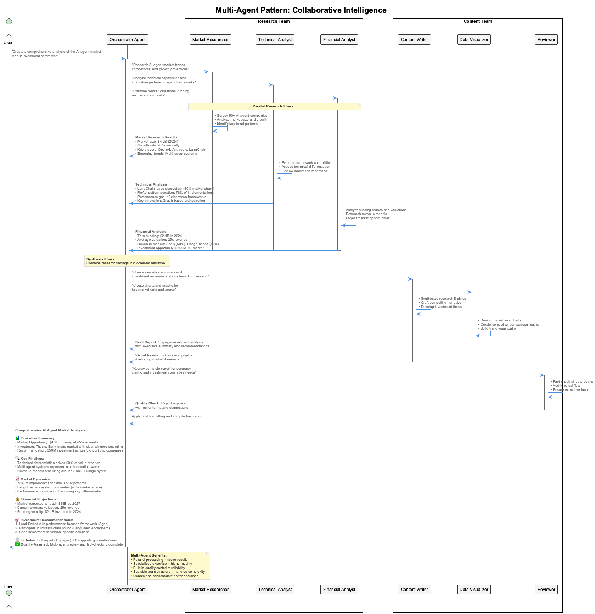

# Session 3: LangGraph Multi-Agent Workflows

## 🎯 Learning Outcomes

By the end of this session, you will be able to:
- **Understand** LangGraph's graph-based architecture and state management
- **Build** complex workflows with conditional routing and parallel execution
- **Implement** sophisticated multi-agent patterns with stateful coordination
- **Design** fault-tolerant workflows with proper error handling
- **Compare** LangGraph's capabilities with basic LangChain agents

## 📚 Chapter Overview

LangGraph is LangChain's workflow orchestration framework that brings the power of graph-based execution to multi-agent systems. Unlike the sequential patterns we've seen, LangGraph enables complex workflows with branching logic, parallel execution, and sophisticated state management.

Think of LangGraph as the "conductor" of an agent orchestra, coordinating multiple specialized agents in complex, dynamic workflows.



---

## Part 1: Understanding LangGraph Architecture (25 minutes)

### The Graph-Based Approach

Traditional agent systems execute linearly:
```

Input → Agent 1 → Agent 2 → Agent 3 → Output
```


LangGraph enables complex flows:
```

          ┌─→ Agent A ─┐
Input ─→ Decision ─→ Agent B ─→ Synthesis ─→ Output
          └─→ Agent C ─┘
```


### Step 1.1: Core LangGraph Concepts

LangGraph has four key components. Let's start by understanding the essential imports and state definition:

```python
# From src/session3/langgraph_basics.py
from langgraph.graph import StateGraph, END
from typing import TypedDict, Annotated, Sequence
import operator
```

The first step is importing the necessary components. `StateGraph` is the main graph builder, `END` marks workflow termination, and we use typing annotations for robust state management.

Now, let's define our state structure - this is the data container that flows between all nodes in our workflow:

```python
# 1. State Definition - What data flows between nodes
class AgentState(TypedDict):
    messages: Annotated[Sequence[BaseMessage], operator.add]
    current_task: str
    results: dict
    iteration_count: int
```


**State Explained:**
- **messages**: Conversation history that gets accumulated
- **current_task**: What the workflow is currently working on
- **results**: Data collected from different agents
- **iteration_count**: Track workflow iterations

### Step 1.2: Building Your First Graph

```python
# From src/session3/simple_workflow.py
def create_basic_workflow():
    """Create a simple three-node workflow"""
    
    # Create the graph with our state schema
    workflow = StateGraph(AgentState)
    
    # Add nodes (the work units)
    workflow.add_node("researcher", research_node)
    workflow.add_node("analyzer", analyze_node)
    workflow.add_node("reporter", report_node)
    
    return workflow
```


### Step 1.3: Adding Edges - The Flow Control

```python
# From src/session3/simple_workflow.py (continued)
def configure_workflow_edges(workflow):
    """Configure how nodes connect to each other"""
    
    # Simple sequential edge
    workflow.add_edge("researcher", "analyzer")
    
    # Conditional edge with decision logic
    workflow.add_conditional_edges(
        "analyzer",                    # From this node
        should_continue_analysis,      # Decision function
        {
            "continue": "reporter",    # If continue, go to reporter
            "retry": "researcher",     # If retry, go back to researcher
            "end": END                 # If done, end workflow
        }
    )
    
    # Set starting point
    workflow.set_entry_point("researcher")
```


**Edge Types Explained:**
- **add_edge()**: Always go from A to B
- **add_conditional_edges()**: Go to different nodes based on logic
- **set_entry_point()**: Where the workflow starts

### Step 1.4: Node Implementation

Nodes are functions that process state and return updates. Let's start with a research node that gathers information:

```python
# From src/session3/workflow_nodes.py
def research_node(state: AgentState) -> AgentState:
    """Research node - gathers information"""
    current_task = state["current_task"]
    
    # Simulate research (in practice, call LLM or tools)
    research_result = f"Researched information about: {current_task}"
    
    # Update state
    updated_results = state["results"].copy()
    updated_results["research"] = research_result
    
    return {
        "results": updated_results,
        "messages": state["messages"] + [HumanMessage(content=research_result)]
    }
```

Notice how the research node extracts the current task, performs work, and returns state updates. The key pattern is copying existing state and adding new data rather than replacing everything.

Now let's implement an analysis node that processes the research data:

```python
def analyze_node(state: AgentState) -> AgentState:
    """Analysis node - processes research data"""
    research_data = state["results"].get("research", "")
    
    # Simulate analysis
    analysis_result = f"Analysis of: {research_data}"
    
    # Update state
    updated_results = state["results"].copy()
    updated_results["analysis"] = analysis_result
    
    return {
        "results": updated_results,
        "messages": state["messages"] + [AIMessage(content=analysis_result)]
    }
```


**Node Best Practices:**
- Always return state updates, not full state replacement
- Include error handling for robust workflows
- Keep nodes focused on single responsibilities

---

## Part 2: Conditional Logic and Decision Making (20 minutes)

### Step 2.1: Decision Functions

Conditional edges rely on decision functions that examine state and return routing decisions. Let's start with a function that evaluates analysis quality:

```python
# From src/session3/decision_logic.py
def should_continue_analysis(state: AgentState) -> str:
    """Decide whether to continue, retry, or end"""
    
    analysis_result = state["results"].get("analysis", "")
    iteration_count = state.get("iteration_count", 0)
    
    # Check quality of analysis
    if "insufficient data" in analysis_result.lower():
        if iteration_count < 3:  # Max 3 retries
            return "retry"
        else:
            return "end"  # Give up after 3 tries
    
    # Check if analysis is complete
    if len(analysis_result) < 50:  # Too brief
        return "continue"
    
    # Analysis looks good
    return "end"
```

This decision function implements quality control with retry logic. It examines both the content quality and iteration count to prevent infinite loops while ensuring quality results.

Here's another common pattern - routing based on task characteristics:

```python
def route_by_task_type(state: AgentState) -> str:
    """Route to different agents based on task type"""
    current_task = state["current_task"]
    
    if "math" in current_task.lower():
        return "math_specialist"
    elif "research" in current_task.lower():
        return "research_specialist"
    elif "creative" in current_task.lower():
        return "creative_specialist"
    else:
        return "general_agent"
```


### Step 2.2: Advanced Routing Patterns

Let's build a more sophisticated workflow that intelligently routes tasks to specialized agents. First, we'll set up the graph structure:

```python
# From src/session3/advanced_routing.py
def create_intelligent_routing_workflow():
    """Workflow with intelligent task routing"""
    
    workflow = StateGraph(AgentState)
    
    # Add specialized agent nodes
    workflow.add_node("task_analyzer", analyze_task_requirements)
    workflow.add_node("math_specialist", handle_math_tasks)
    workflow.add_node("research_specialist", handle_research_tasks)
    workflow.add_node("creative_specialist", handle_creative_tasks)
    workflow.add_node("quality_checker", check_output_quality)
```

This creates our graph with specialized agents for different types of work. The task_analyzer acts as a dispatcher, examining incoming tasks to determine the best specialist.

Now let's configure the routing logic:

```python
    # Start with task analysis
    workflow.set_entry_point("task_analyzer")
    
    # Route based on task type
    workflow.add_conditional_edges(
        "task_analyzer",
        route_by_task_type,
        {
            "math_specialist": "math_specialist",
            "research_specialist": "research_specialist", 
            "creative_specialist": "creative_specialist"
        }
    )
    
    # All specialists go to quality check
    workflow.add_edge("math_specialist", "quality_checker")
    workflow.add_edge("research_specialist", "quality_checker")
    workflow.add_edge("creative_specialist", "quality_checker")
    
    return workflow.compile()
```


### Step 2.3: Quality Control Loops

Quality control is essential for reliable workflows. Let's implement a quality checking node that evaluates work and provides feedback:

```python
# From src/session3/quality_control.py
def check_output_quality(state: AgentState) -> AgentState:
    """Quality control node with feedback loop"""
    
    # Get the latest result
    results = state["results"]
    latest_result = list(results.values())[-1] if results else ""
    
    # Simple quality metrics
    quality_score = calculate_quality_score(latest_result)
    
    # Update state with quality assessment
    updated_results = results.copy()
    updated_results["quality_score"] = quality_score
    updated_results["needs_revision"] = quality_score < 0.7
    
    return {
        "results": updated_results,
        "iteration_count": state.get("iteration_count", 0) + 1
    }
```

This node evaluates the quality of work and marks whether revision is needed. It also tracks iteration count to prevent infinite revision loops.

Now we need a decision function to determine the next step based on quality assessment:

```python
def quality_decision(state: AgentState) -> str:
    """Decide if work needs revision"""
    quality_score = state["results"].get("quality_score", 0)
    iteration_count = state.get("iteration_count", 0)
    
    if quality_score >= 0.8:
        return "approved"
    elif iteration_count < 3:
        return "needs_revision"
    else:
        return "max_iterations_reached"
```


---

## Part 3: Parallel Execution and State Merging (25 minutes)

### The Power of Parallel Processing

Instead of sequential processing:
```

Task → Agent A → Agent B → Agent C → Result (3x time)
```


LangGraph enables parallel execution:
```

     ┌─→ Agent A ─┐
Task ├─→ Agent B ─┤→ Merge → Result (1x time)
     └─→ Agent C ─┘
```


### Step 3.1: Creating Parallel Nodes

Parallel execution is one of LangGraph's most powerful features. Let's create a workflow that executes multiple research branches simultaneously:

```python
# From src/session3/parallel_workflow.py
def create_parallel_research_workflow():
    """Workflow with parallel research branches"""
    
    workflow = StateGraph(AgentState)
    
    # Add parallel research nodes
    workflow.add_node("technical_research", research_technical_aspects)
    workflow.add_node("market_research", research_market_aspects)
    workflow.add_node("competitive_research", research_competitors)
    workflow.add_node("merge_research", merge_parallel_results)
    workflow.add_node("final_analysis", create_final_analysis)
```

These nodes represent different research specializations that can work simultaneously. Each focuses on a specific aspect: technical details, market conditions, and competitive landscape.

Now let's configure the parallel execution and synchronization:

```python
    # All research nodes run in parallel from start
    workflow.set_entry_point("technical_research")
    workflow.set_entry_point("market_research") 
    workflow.set_entry_point("competitive_research")
    
    # All parallel nodes feed into merger
    workflow.add_edge("technical_research", "merge_research")
    workflow.add_edge("market_research", "merge_research")
    workflow.add_edge("competitive_research", "merge_research")
    
    # Final analysis after merge
    workflow.add_edge("merge_research", "final_analysis")
    
    return workflow.compile()
```


### Step 3.2: State Merging Strategies

When parallel branches complete, we need to merge their results intelligently. Here's how to collect and combine parallel execution results:

```python
# From src/session3/state_merging.py
def merge_parallel_results(state: AgentState) -> AgentState:
    """Merge results from parallel execution branches"""
    
    results = state["results"]
    
    # Collect results from different research branches
    technical_data = results.get("technical_research", {})
    market_data = results.get("market_research", {})
    competitive_data = results.get("competitive_research", {})
```

This first step extracts the individual results from each parallel branch. Each branch stores its findings in the shared state under its own key.

Now we create a comprehensive merged dataset that combines all insights:

```python
    # Create comprehensive merged result
    merged_research = {
        "technical_insights": technical_data,
        "market_insights": market_data,
        "competitive_insights": competitive_data,
        "merge_timestamp": datetime.now().isoformat(),
        "data_sources": len([d for d in [technical_data, market_data, competitive_data] if d])
    }
    
    # Update state with merged data
    updated_results = results.copy()
    updated_results["comprehensive_research"] = merged_research
    
    return {
        "results": updated_results,
        "current_task": "analysis_phase"
    }
```


### Step 3.3: Handling Parallel Timing Issues

Sometimes you need explicit synchronization control for parallel workflows. Let's define an enhanced state that tracks completion:

```python
# From src/session3/synchronization.py
class SynchronizedState(TypedDict):
    """State with synchronization tracking"""
    messages: Annotated[Sequence[BaseMessage], operator.add]
    results: dict
    completion_status: dict  # Track which branches are complete
    required_branches: list  # Which branches must complete
```

This enhanced state includes completion tracking fields. The `completion_status` tracks which branches have finished, while `required_branches` defines which ones must complete before proceeding.

Here's a decision function that implements synchronization logic:

```python
def wait_for_all_branches(state: SynchronizedState) -> str:
    """Decision function that waits for all parallel branches"""
    
    completion_status = state["completion_status"]
    required_branches = state["required_branches"]
    
    # Check if all required branches are complete
    all_complete = all(
        completion_status.get(branch, False) 
        for branch in required_branches
    )
    
    if all_complete:
        return "proceed_to_next_phase"
    else:
        incomplete = [
            branch for branch in required_branches 
            if not completion_status.get(branch, False)
        ]
        print(f"Waiting for branches: {incomplete}")
        return "wait_for_completion"
```


---

## Part 4: Advanced Multi-Agent Patterns (30 minutes)

### Step 4.1: The Debate Pattern

Create agents that can debate and reach consensus. First, let's set up the debate workflow structure:

```python
# From src/session3/debate_pattern.py
def create_debate_workflow():
    """Multi-agent debate with consensus building"""
    
    workflow = StateGraph(AgentState)
    
    # Add debate participants
    workflow.add_node("proposer", propose_solution)
    workflow.add_node("critic", critique_proposal)
    workflow.add_node("mediator", mediate_debate)
    workflow.add_node("consensus_checker", check_consensus)
```

This creates our debate participants: a proposer who suggests solutions, a critic who challenges them, a mediator who facilitates discussion, and a consensus checker who evaluates agreement.

Now let's configure the debate flow with conditional loops:

```python
    # Debate flow
    workflow.set_entry_point("proposer")
    workflow.add_edge("proposer", "critic")
    workflow.add_edge("critic", "mediator")
    workflow.add_edge("mediator", "consensus_checker")
    
    # Conditional: continue debate or reach conclusion
    workflow.add_conditional_edges(
        "consensus_checker",
        check_debate_completion,
        {
            "continue_debate": "proposer",  # Loop back for another round
            "consensus_reached": END,        # End with agreement
            "impasse": END                   # End without agreement
        }
    )
    
    return workflow.compile()
```

The key insight here is the conditional loop that can send the debate back to the proposer for another round if consensus hasn't been reached.

Here's the decision logic that determines when to end the debate:

```python
def check_debate_completion(state: AgentState) -> str:
    """Determine if debate should continue"""
    iteration_count = state.get("iteration_count", 0)
    consensus_score = state["results"].get("consensus_score", 0)
    
    if consensus_score >= 0.8:
        return "consensus_reached"
    elif iteration_count >= 5:  # Max 5 debate rounds
        return "impasse"
    else:
        return "continue_debate"
```


### Step 4.2: The Review Chain Pattern

Implement a peer review system with multiple reviewers and revision cycles. First, let's set up the review workflow:

```python
# From src/session3/review_chain.py
def create_review_chain_workflow():
    """Multi-stage peer review workflow"""
    
    workflow = StateGraph(AgentState)
    
    # Review stages
    workflow.add_node("initial_draft", create_initial_work)
    workflow.add_node("peer_review_1", first_reviewer)
    workflow.add_node("peer_review_2", second_reviewer)
    workflow.add_node("author_revision", handle_revisions)
    workflow.add_node("final_approval", final_review)
```

This creates a comprehensive review pipeline with initial drafting, two peer reviewers, author revision, and final approval stages.

Now let's configure the review process flow with conditional branching:

```python
    # Sequential review process
    workflow.set_entry_point("initial_draft")
    workflow.add_edge("initial_draft", "peer_review_1")
    workflow.add_edge("peer_review_1", "peer_review_2")
    workflow.add_edge("peer_review_2", "author_revision")
    
    # Decision point after revision
    workflow.add_conditional_edges(
        "author_revision",
        revision_quality_check,
        {
            "needs_more_review": "peer_review_1",  # Another review cycle
            "ready_for_approval": "final_approval", # Final approval
            "major_revision_needed": "initial_draft" # Start over
        }
    )
    
    return workflow.compile()
```


### Step 4.3: The Hierarchical Team Pattern

Create supervisor-worker relationships where a supervisor coordinates specialized workers. Let's start with the team structure:

```python
# From src/session3/hierarchical_team.py
def create_hierarchical_workflow():
    """Supervisor coordinates specialized workers"""
    
    workflow = StateGraph(AgentState)
    
    # Team structure
    workflow.add_node("supervisor", supervise_team)
    workflow.add_node("data_worker", handle_data_tasks)
    workflow.add_node("analysis_worker", handle_analysis_tasks)
    workflow.add_node("report_worker", handle_reporting_tasks)
    workflow.add_node("quality_assurance", qa_check)
```

This creates a hierarchical structure with one supervisor coordinating three specialized workers, plus a quality assurance step.

Now let's configure the supervision and reporting relationships:

```python
    # Supervisor routes work to appropriate workers
    workflow.set_entry_point("supervisor")
    
    # Conditional routing from supervisor
    workflow.add_conditional_edges(
        "supervisor",
        route_to_worker,
        {
            "data_task": "data_worker",
            "analysis_task": "analysis_worker",
            "report_task": "report_worker",
            "all_complete": "quality_assurance"
        }
    )
    
    # Workers report back to supervisor
    workflow.add_edge("data_worker", "supervisor")
    workflow.add_edge("analysis_worker", "supervisor")
    workflow.add_edge("report_worker", "supervisor")
    
    return workflow.compile()
```

The key pattern here is that all workers report back to the supervisor, creating a central coordination point.

Here's the supervisor node implementation that manages the team:

```python
def supervise_team(state: AgentState) -> AgentState:
    """Supervisor node that coordinates team work"""
    current_task = state["current_task"]
    completed_tasks = state["results"].get("completed_tasks", [])
    
    # Determine what work needs to be done
    remaining_work = analyze_remaining_work(current_task, completed_tasks)
    
    # Update state with supervision decisions
    updated_results = state["results"].copy()
    updated_results["supervision_plan"] = remaining_work
    updated_results["next_worker"] = determine_next_worker(remaining_work)
    
    return {
        "results": updated_results,
        "current_task": f"Supervising: {current_task}"
    }
```


---

## Part 5: Error Handling and Fault Tolerance (15 minutes)

### Step 5.1: Graceful Error Recovery

Robust workflows need comprehensive error handling. Let's build a fault-tolerant workflow structure:

```python
# From src/session3/error_handling.py
def create_fault_tolerant_workflow():
    """Workflow with comprehensive error handling"""
    
    workflow = StateGraph(AgentState)
    
    # Main workflow nodes
    workflow.add_node("main_processor", main_processing_node)
    workflow.add_node("error_handler", handle_errors)
    workflow.add_node("retry_logic", retry_failed_operation)
    workflow.add_node("fallback_processor", fallback_processing)
```

This creates specialized nodes for different aspects of error handling: main processing, error handling, retry logic, and fallback processing.

Now let's configure the error handling flow with conditional routing:

```python
    # Normal flow
    workflow.set_entry_point("main_processor")
    
    # Error handling flow
    workflow.add_conditional_edges(
        "main_processor",
        check_for_errors,
        {
            "success": END,
            "recoverable_error": "retry_logic",
            "critical_error": "error_handler",
            "use_fallback": "fallback_processor"
        }
    )
    
    return workflow.compile()
```

This routing logic evaluates the success or failure of the main processor and routes to appropriate error handling strategies.

Here's the centralized error handling node that logs and processes errors:

```python
def handle_errors(state: AgentState) -> AgentState:
    """Centralized error handling node"""
    error_info = state["results"].get("error", {})
    error_count = state.get("error_count", 0)
    
    # Log error details
    error_log = {
        "error_type": error_info.get("type", "unknown"),
        "error_message": error_info.get("message", ""),
        "error_count": error_count + 1,
        "timestamp": datetime.now().isoformat(),
        "recovery_attempted": True
    }
    
    # Update state with error information
    updated_results = state["results"].copy()
    updated_results["error_log"] = error_log
    
    return {
        "results": updated_results,
        "error_count": error_count + 1,
        "current_task": "error_recovery"
    }
```


### Step 5.2: Circuit Breaker Pattern

```python
# From src/session3/circuit_breaker.py
def circuit_breaker_decision(state: AgentState) -> str:
    """Implement circuit breaker pattern for failing services"""
    error_count = state.get("error_count", 0)
    recent_errors = state["results"].get("recent_error_timestamps", [])
    
    # Circuit breaker logic
    if error_count >= 5:  # Too many errors
        return "circuit_open"
    
    # Check error frequency
    now = datetime.now()
    recent_errors_count = len([
        ts for ts in recent_errors 
        if (now - datetime.fromisoformat(ts)).seconds < 300  # Last 5 minutes
    ])
    
    if recent_errors_count >= 3:
        return "circuit_half_open"  # Test with limited traffic
    
    return "circuit_closed"  # Normal operation
```


---

## Key Takeaways

1. **Graph-based architecture** enables complex, non-linear workflows with conditional routing
2. **State management** allows sophisticated data flow and coordination between agents
3. **Parallel execution** dramatically improves performance for independent tasks
4. **Advanced patterns** (debate, review chains, hierarchical teams) solve real-world coordination challenges
5. **Error handling** and fault tolerance are essential for production workflows

## What's Next?

In Session 4, we'll explore CrewAI's role-based approach to multi-agent systems, which provides a different paradigm focused on team roles and hierarchical coordination.

---

## Knowledge Check: Multiple Choice Quiz

### LangGraph Architecture (Questions 1-5)

1. What is the primary advantage of LangGraph over sequential LangChain agents?
   a) Better performance
   b) Graph-based workflows with conditional routing and parallel execution
   c) Lower cost
   d) Simpler implementation

2. In LangGraph, what component defines the data that flows between nodes?
   a) Edges
   b) State (TypedDict)
   c) Tools
   d) Memory

3. What determines the flow between nodes in a LangGraph workflow?
   a) Sequential execution only
   b) Conditional edges and decision functions
   c) Random selection
   d) User input

4. How does LangGraph handle parallel agent execution?
   a) It doesn't support parallel execution
   b) Through parallel nodes with state merging
   c) Using threading only
   d) Through external orchestration

5. What happens when a LangGraph node updates state?
   a) The entire state is replaced
   b) Only specified fields are updated/merged
   c) State is reset to default
   d) Previous state is archived

### Workflow Patterns (Questions 6-10)

6. In the debate pattern, what determines when the debate ends?
   a) Fixed number of rounds
   b) Consensus score and maximum iterations
   c) User intervention
   d) Random timing

7. What is the purpose of a decision function in conditional edges?
   a) To process user input
   b) To examine state and determine next node
   c) To handle errors
   d) To manage memory

8. How does the hierarchical team pattern coordinate work?
   a) All agents work independently
   b) A supervisor routes tasks to specialized workers
   c) Workers communicate directly
   d) Random task assignment

9. What is the circuit breaker pattern used for?
   a) Stopping workflows manually
   b) Preventing cascade failures from unreliable services
   c) Optimizing performance
   d) Managing memory usage

10. In parallel execution, when should branches be synchronized?
    a) Never - they should be independent
    b) When downstream nodes need data from multiple branches
    c) At random intervals
    d) Only at the end of the workflow

---

## Answer Key
1. b) Graph-based workflows with conditional routing and parallel execution
2. b) State (TypedDict)
3. b) Conditional edges and decision functions
4. b) Through parallel nodes with state merging
5. b) Only specified fields are updated/merged
6. b) Consensus score and maximum iterations
7. b) To examine state and determine next node
8. b) A supervisor routes tasks to specialized workers
9. b) Preventing cascade failures from unreliable services
10. b) When downstream nodes need data from multiple branches

---

This session demonstrated how LangGraph's graph-based architecture enables sophisticated multi-agent workflows with advanced coordination patterns, parallel execution, and robust error handling.