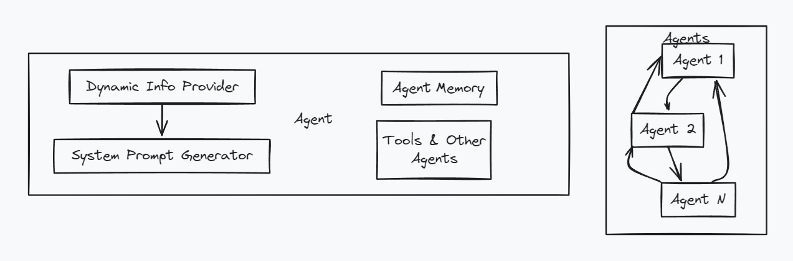
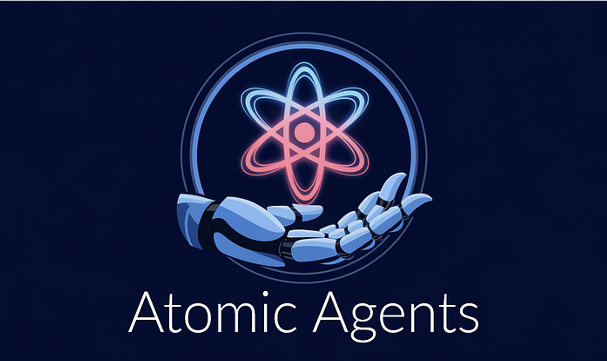

# Session 6: Atomic Agents Modular Architecture

## 🎯 Learning Navigation Hub
**Total Time Investment**: 70 minutes (Core) + 30-65 minutes (Optional)
**Your Learning Path**: Choose your engagement level

### Quick Start Guide
- **👀 Observer (40 min)**: Read concepts + examine modular patterns
- **🙋‍♂️ Participant (70 min)**: Follow exercises + build atomic systems
- **🛠️ Implementer (100 min)**: Create custom architectures + explore enterprise patterns

---

## 📋 SESSION OVERVIEW DASHBOARD

### Core Learning Track (70 minutes) - REQUIRED
| Section | Concept Load | Time | Skills |
|---------|--------------|------|--------|
| 🏗️ Atomic Architecture | 3 concepts | 20 min | Understanding |
| 🧩 Building Components | 4 concepts | 25 min | Implementation |
| 🔗 System Assembly | 3 concepts | 20 min | Integration |
| 🚀 Deployment & Scaling | 2 concepts | 5 min | Production |

### Optional Deep Dive Modules (Choose Your Adventure)
- 🔬 **Module A: Advanced Composition Patterns** (35 min) - Sophisticated component architectures
- 🏭 **Module B: Enterprise Modular Systems** (30 min) - Production-scale atomic systems

**🗂️ Code Files**: All examples use files in `src/session6/`
**🚀 Quick Start**: Run `cd src/session6 && python example_usage.py` to see atomic agents in action

---

## 🧭 CORE SECTION (Required - 70 minutes)

### Part 1: Atomic Architecture Principles (20 minutes)
**Cognitive Load**: 3 new concepts
**Learning Mode**: Conceptual Understanding

#### Modular Design Philosophy (8 minutes)
Atomic Agents emphasize composable, lightweight components:


*This diagram illustrates the core atomic agent structure with individual, focused components that can be composed together. Each agent is designed with single responsibility and minimal dependencies, making them lightweight and highly reusable building blocks.*

🗂️ **File**: `src/session6/atomic_foundation.py` - Core atomic patterns

```python
from atomic_agents.agents import BaseAgent
from atomic_agents.lib.components.chat_memory import ChatMemory
from atomic_agents.lib.tools.web_scraper import WebScraperTool

# Atomic agent - minimal, focused functionality
class AtomicTextAgent(BaseAgent):
    def __init__(self, name: str):
        super().__init__(
            agent_name=name,
            system_prompt="You are a specialized text processing agent",
            memory=ChatMemory(),
            tools=[],  # Tools added as needed
            max_tokens=500  # Lightweight by default
        )
    
    def process_text(self, text: str) -> str:
        """Single, focused responsibility"""
        return self.run(f"Process this text: {text}")
```

**Key Concepts:**
1. **Single Responsibility**: Each component has one clear purpose
2. **Composition over Inheritance**: Build systems by combining components
3. **Lightweight by Design**: Minimal resource footprint per component

#### Component Composition (7 minutes)
Building systems through component assembly:


*This visualization shows how multiple atomic agents work together in a coordinated system. Each agent maintains its specialized role while contributing to the overall workflow, demonstrating the composition-over-inheritance principle.*

🗂️ **File**: `src/session6/composition_engine.py` - Component composition patterns

```python
from atomic_agents.lib.components import ToolsComponent, MemoryComponent
from atomic_agents.lib.models import OpenAIModel

class ComponentComposer:
    """Compose agents from reusable components"""
    
    @staticmethod
    def create_research_agent():
        """Compose a research-focused agent"""
        return BaseAgent(
            agent_name="research_specialist",
            model=OpenAIModel(model_name="gpt-4"),
            system_prompt="Expert researcher and analyst",
            memory=ChatMemory(max_messages=20),
            tools=[
                WebScraperTool(),
                # Add more tools as needed
            ]
        )
    
    @staticmethod 
    def create_writing_agent():
        """Compose a writing-focused agent"""
        return BaseAgent(
            agent_name="content_writer",
            model=OpenAIModel(model_name="gpt-4"),
            system_prompt="Professional content writer and editor",
            memory=ChatMemory(max_messages=10),
            tools=[]  # Writing agents typically don't need external tools
        )
```

#### Lightweight Patterns (5 minutes)
Optimizing for efficiency and modularity:

```python
# Minimal agent configuration
minimal_agent = BaseAgent(
    agent_name="minimal_processor",
    system_prompt="Process inputs efficiently",
    memory=None,  # No memory for stateless processing
    tools=[],     # No tools for pure text processing
    max_tokens=200  # Limit token usage
)

# Composable tool sets
research_tools = [WebScraperTool()]
analysis_tools = []  # Add analysis tools as needed
writing_tools = []   # Writing agents work with pure text

def create_specialized_agent(role: str, tools: list = None):
    """Factory for creating specialized agents"""
    return BaseAgent(
        agent_name=f"{role}_specialist",
        system_prompt=f"You are a {role} specialist",
        tools=tools or [],
        max_tokens=300
    )
```

---

### Part 2: Building Atomic Components (25 minutes)
**Cognitive Load**: 4 new concepts
**Learning Mode**: Implementation & Practice

#### Component Creation (8 minutes)
Building reusable atomic components:

🗂️ **File**: `src/session6/text_agent.py` - Specialized text processing agent

```python
from atomic_agents.agents import BaseAgent
from atomic_agents.lib.components.chat_memory import ChatMemory

class TextProcessorAgent(BaseAgent):
    """Atomic agent for text processing tasks"""
    
    def __init__(self):
        super().__init__(
            agent_name="text_processor",
            system_prompt="""You are a text processing specialist. 
            Focus on: summarization, analysis, and formatting.""",
            memory=ChatMemory(max_messages=5),
            tools=[],
            max_tokens=400
        )
    
    def summarize(self, text: str) -> str:
        """Specialized summarization method"""
        prompt = f"Summarize this text concisely:\n\n{text}"
        return self.run(prompt)
    
    def analyze_sentiment(self, text: str) -> str:
        """Specialized sentiment analysis"""
        prompt = f"Analyze the sentiment of this text:\n\n{text}"
        return self.run(prompt)
    
    def format_content(self, text: str, format_type: str) -> str:
        """Format content for different uses"""
        prompt = f"Format this text as {format_type}:\n\n{text}"
        return self.run(prompt)

# Usage
text_agent = TextProcessorAgent()
summary = text_agent.summarize("Long article text here...")
```

#### Interface Design (6 minutes)
Creating clean, composable interfaces:

🗂️ **File**: `src/session6/data_agent.py` - Data processing specialist

```python
from abc import ABC, abstractmethod
from typing import Dict, Any, List

class DataProcessor(ABC):
    """Abstract interface for data processing components"""
    
    @abstractmethod
    def process_data(self, data: Dict[str, Any]) -> Dict[str, Any]:
        """Process input data and return results"""
        pass

class AtomicDataAgent(BaseAgent, DataProcessor):
    """Atomic agent implementing data processing interface"""
    
    def __init__(self):
        super().__init__(
            agent_name="data_processor", 
            system_prompt="You process and analyze structured data",
            memory=None,  # Stateless for data processing
            tools=[],
            max_tokens=600
        )
    
    def process_data(self, data: Dict[str, Any]) -> Dict[str, Any]:
        """Implement the data processing interface"""
        data_str = str(data)
        analysis = self.run(f"Analyze this data and provide insights: {data_str}")
        
        return {
            "original_data": data,
            "analysis": analysis,
            "processed_at": "timestamp_here"
        }
    
    def aggregate_data(self, data_list: List[Dict]) -> Dict:
        """Aggregate multiple data points"""
        combined = {"items": data_list, "count": len(data_list)}
        return self.process_data(combined)
```

#### Basic Composition (6 minutes)
Combining components into systems:

🗂️ **File**: `src/session6/coordinator_agent.py` - Component coordination

```python
class AtomicCoordinator:
    """Coordinate multiple atomic agents"""
    
    def __init__(self):
        # Initialize specialized agents
        self.text_agent = TextProcessorAgent()
        self.data_agent = AtomicDataAgent()
        
    def process_mixed_content(self, text: str, data: Dict) -> Dict:
        """Coordinate processing of mixed content types"""
        
        # Process text component
        text_summary = self.text_agent.summarize(text)
        text_sentiment = self.text_agent.analyze_sentiment(text)
        
        # Process data component  
        data_analysis = self.data_agent.process_data(data)
        
        # Combine results
        return {
            "text_processing": {
                "summary": text_summary,
                "sentiment": text_sentiment
            },
            "data_processing": data_analysis,
            "coordination_complete": True
        }
    
    def sequential_processing(self, items: List[str]) -> List[str]:
        """Process items sequentially through atomic agents"""
        results = []
        
        for item in items:
            if isinstance(item, str):
                result = self.text_agent.summarize(item)
                results.append(result)
            
        return results

# Usage
coordinator = AtomicCoordinator()
result = coordinator.process_mixed_content(
    text="Article content here...",
    data={"metrics": [1, 2, 3], "category": "analysis"}
)
```

#### Testing Strategies (5 minutes)
Validating atomic components:

🗂️ **File**: `src/session6/test_client.py` - Testing atomic systems

```python
def test_atomic_components():
    """Test individual atomic components"""
    
    # Test text processing
    text_agent = TextProcessorAgent()
    test_text = "This is a test document for processing."
    
    summary = text_agent.summarize(test_text)
    assert len(summary) > 0
    assert len(summary) < len(test_text)  # Should be shorter
    
    # Test data processing
    data_agent = AtomicDataAgent() 
    test_data = {"value": 42, "category": "test"}
    
    result = data_agent.process_data(test_data)
    assert "analysis" in result
    assert "original_data" in result
    
    print("✅ Atomic component tests passed!")

def test_coordination():
    """Test component coordination"""
    coordinator = AtomicCoordinator()
    
    result = coordinator.process_mixed_content(
        text="Sample text",
        data={"test": True}
    )
    
    assert "text_processing" in result
    assert "data_processing" in result
    assert result["coordination_complete"] is True
    
    print("✅ Coordination tests passed!")
```

---

### Part 3: System Assembly & Integration (20 minutes)
**Cognitive Load**: 3 new concepts
**Learning Mode**: Integration & Orchestration

#### Component Integration (8 minutes)
Assembling components into complete systems:


*The Atomic Assembler helps you integrate Atomic Agents.*

🗂️ **File**: `src/session6/production_orchestrator.py` - Production integration patterns

```python
from typing import Dict, List, Any, Optional
import asyncio

class AtomicOrchestrator:
    """Orchestrate multiple atomic agents for complex workflows"""
    
    def __init__(self):
        self.agents = {
            "text": TextProcessorAgent(),
            "data": AtomicDataAgent(),
            "coordinator": AtomicCoordinator()
        }
        
    async def parallel_processing(self, tasks: List[Dict[str, Any]]) -> List[Any]:
        """Process multiple tasks in parallel"""
        
        async def process_task(task):
            task_type = task.get("type")
            content = task.get("content")
            
            if task_type == "text":
                return self.agents["text"].summarize(content)
            elif task_type == "data":
                return self.agents["data"].process_data(content)
            else:
                return f"Unknown task type: {task_type}"
        
        # Process all tasks concurrently
        results = await asyncio.gather(*[process_task(task) for task in tasks])
        return results
    
    def sequential_workflow(self, input_data: Dict) -> Dict:
        """Execute a sequential workflow across agents"""
        
        workflow_state = {"input": input_data, "results": []}
        
        # Step 1: Text processing
        if "text" in input_data:
            text_result = self.agents["text"].process_text(input_data["text"])
            workflow_state["results"].append({"step": "text", "result": text_result})
        
        # Step 2: Data processing
        if "data" in input_data:
            data_result = self.agents["data"].process_data(input_data["data"])
            workflow_state["results"].append({"step": "data", "result": data_result})
        
        # Step 3: Coordination
        final_result = self.agents["coordinator"].process_mixed_content(
            text=input_data.get("text", ""),
            data=input_data.get("data", {})
        )
        workflow_state["final_result"] = final_result
        
        return workflow_state
```

#### System Coordination (7 minutes)
Managing complex multi-agent systems:

```python
class SystemCoordinator:
    """High-level coordination of atomic agent systems"""
    
    def __init__(self):
        self.orchestrator = AtomicOrchestrator()
        self.active_workflows = {}
        
    def start_workflow(self, workflow_id: str, config: Dict) -> str:
        """Start a new workflow with given configuration"""
        
        self.active_workflows[workflow_id] = {
            "config": config,
            "status": "running",
            "start_time": "timestamp_here"
        }
        
        return f"Workflow {workflow_id} started"
    
    def get_workflow_status(self, workflow_id: str) -> Dict:
        """Get status of running workflow"""
        return self.active_workflows.get(workflow_id, {"status": "not_found"})
    
    def orchestrate_complex_task(self, task_description: str) -> Dict:
        """Orchestrate a complex task across multiple atomic agents"""
        
        # Break down complex task into atomic operations
        subtasks = self._decompose_task(task_description)
        
        # Execute subtasks through appropriate agents
        results = []
        for subtask in subtasks:
            if subtask["type"] == "text":
                result = self.orchestrator.agents["text"].process_text(subtask["content"])
            elif subtask["type"] == "data":
                result = self.orchestrator.agents["data"].process_data(subtask["content"])
            
            results.append(result)
        
        return {
            "task": task_description,
            "subtasks": subtasks,
            "results": results,
            "status": "completed"
        }
    
    def _decompose_task(self, task: str) -> List[Dict]:
        """Decompose complex task into atomic operations"""
        # Simplified decomposition logic
        return [
            {"type": "text", "content": task},
            {"type": "data", "content": {"task": task}}
        ]
```

#### Testing Integration (5 minutes)
Validating integrated systems:

```python
def test_system_integration():
    """Test complete system integration"""
    
    # Test orchestrator
    orchestrator = AtomicOrchestrator()
    
    # Test sequential workflow
    workflow_input = {
        "text": "Test document for processing",
        "data": {"metrics": [1, 2, 3]}
    }
    
    result = orchestrator.sequential_workflow(workflow_input)
    assert "final_result" in result
    assert "results" in result
    assert len(result["results"]) > 0
    
    # Test system coordinator
    coordinator = SystemCoordinator()
    complex_result = coordinator.orchestrate_complex_task("Analyze customer feedback")
    
    assert "results" in complex_result
    assert complex_result["status"] == "completed"
    
    print("✅ System integration tests passed!")
```

---

### Part 4: Deployment & Scaling (5 minutes)
**Cognitive Load**: 2 new concepts
**Learning Mode**: Production Readiness

#### Deployment Patterns (3 minutes)
🗂️ **File**: `src/session6/bootstrap.py` - Deployment configuration

```python
def deploy_atomic_system():
    """Deploy atomic agent system"""
    
    # Initialize system components
    orchestrator = AtomicOrchestrator()
    coordinator = SystemCoordinator()
    
    print("🚀 Atomic agent system deployed")
    print(f"Available agents: {list(orchestrator.agents.keys())}")
    
    return {"orchestrator": orchestrator, "coordinator": coordinator}

# Quick deployment
system = deploy_atomic_system()
```

#### Scaling Considerations (2 minutes)
```python
# Scaling patterns for atomic agents
scaling_config = {
    "horizontal_scaling": "Add more agent instances",
    "vertical_scaling": "Increase agent capabilities",
    "load_balancing": "Distribute requests across agents",
    "caching": "Cache frequent operations"
}
```

---

## ✅ Core Section Validation (5 minutes)

### Quick Implementation Exercise
🗂️ **Exercise Files**: 
- `src/session6/example_usage.py` - Complete working example
- `src/session6/test_client.py` - Test your understanding

```bash
# Try the examples:
cd src/session6
python example_usage.py           # See atomic agents in action
python bootstrap.py               # Deploy atomic system
python -m pytest test_client.py  # Validate your understanding
```

### Self-Assessment Checklist
- [ ] I understand atomic agent architecture principles
- [ ] I can build modular, composable components
- [ ] I can assemble components into integrated systems
- [ ] I understand deployment and scaling patterns
- [ ] I'm ready for advanced modules or next session

**Next Session Prerequisites**: ✅ Core Section Complete
**Ready for**: Session 7: ADK Enterprise Agent Development

---

# 🎛️ OPTIONAL MODULES (Choose Your Adventure)

## 🔬 Module A: Advanced Composition Patterns (35 minutes)
**Prerequisites**: Core Section Complete
**Target Audience**: Advanced system architects
**Cognitive Load**: 5 advanced concepts

### A1: Complex Component Architectures (20 minutes)
🗂️ **Files**: Advanced composition examples in `src/session6/`

Sophisticated component patterns including dynamic composition, plugin architectures, and micro-service patterns.

### A2: Component Lifecycle Management (15 minutes)
Managing component creation, destruction, and resource allocation in complex systems.

---

## 🏭 Module B: Enterprise Modular Systems (30 minutes)
**Prerequisites**: Core Section Complete
**Target Audience**: Enterprise developers
**Cognitive Load**: 4 enterprise concepts

### B1: Production Scaling Patterns (20 minutes)
Scaling atomic agent systems for enterprise workloads, including load balancing and resource management.

### B2: Integration with Enterprise Systems (10 minutes)
Connecting atomic agents with existing enterprise infrastructure and workflows.

---

## 📊 Progress Tracking

### Completion Status
- [ ] Core Section (70 min) - Essential for next session
- [ ] Module A: Advanced Composition (35 min)
- [ ] Module B: Enterprise Systems (30 min)

**🗂️ All Code Examples**: Available in `src/session6/` - 13 Python files with complete modular implementations!

---

## 📝 Multiple Choice Test - Session 6 (15 minutes)

Test your understanding of atomic agent architecture and modular composition.

### Question 1
**What is the core principle behind Atomic Agents architecture?**

A) Maximum performance optimization  
B) Single-purpose, composable components with clear interfaces  
C) Minimal resource usage  
D) Complex integrated systems  

### Question 2
**How do atomic agents communicate with each other?**

A) Direct method calls  
B) Standardized message protocols and context providers  
C) Shared global variables  
D) Database transactions  

### Question 3
**What makes an agent "atomic" in this architecture?**

A) Small code size  
B) Fast execution  
C) Single, focused responsibility with well-defined interfaces  
D) Low memory usage  

### Question 4
**What is the role of Context Providers in atomic agent systems?**

A) Execute agent logic  
B) Manage shared state and coordination between agents  
C) Handle user interface  
D) Store persistent data  

### Question 5
**How does the Composition Engine work in atomic systems?**

A) Compiles agents into single executable  
B) Dynamically assembles agents based on requirements  
C) Optimizes agent performance  
D) Manages agent memory  

### Question 6
**What is the primary benefit of modular agent composition?**

A) Faster execution  
B) Flexibility to assemble different workflows from same components  
C) Lower development costs  
D) Better user interface  

### Question 7
**How do atomic agents handle failure isolation?**

A) Global error handling  
B) Individual agent failures don't cascade to others  
C) Automatic restart mechanisms  
D) Backup agent systems  

### Question 8
**What makes atomic agents suitable for microservices architectures?**

A) Built-in API gateways  
B) Single-responsibility principle and loose coupling  
C) Automatic scaling features  
D) Built-in monitoring  

### Question 9
**How do you scale atomic agent systems?**

A) Vertical scaling only  
B) Horizontal scaling by replicating individual agents  
C) Cloud deployment only  
D) Container orchestration required  

### Question 10
**What is the main advantage of the Coordinator Agent pattern?**

A) Centralized control of agent interactions and workflow orchestration  
B) Faster agent execution  
C) Lower resource usage  
D) Better error handling  

---

**🗂️ View Test Solutions**: [Complete answers and explanations available in Session6_Test_Solutions.md](Session6_Test_Solutions.md)

**Success Criteria**: Score 8+ out of 10 to demonstrate mastery of atomic agent architecture.

---

[← Back to Session 5](Session5_PydanticAI_Type_Safe_Agents.md) | [Next: Session 7 →](Session7_First_ADK_Agent.md)