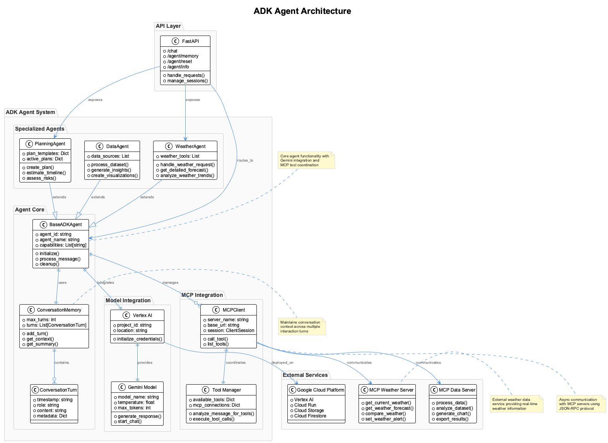
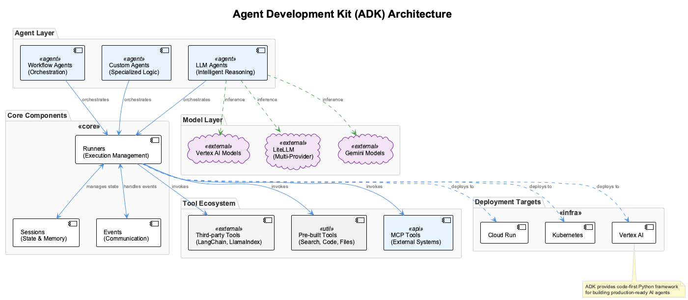

# Session 6: Building Your First ADK Agent

## 🎯 Learning Outcomes

By the end of this session, you will be able to:
- **Understand** the Agent Development Kit (ADK) architecture and its integration with Google Cloud
- **Create** production-ready ADK agents with Gemini integration and advanced capabilities
- **Connect** ADK agents to MCP servers for expanded functionality
- **Implement** persistent agent memory and stateful conversation management
- **Deploy** agents to Google Cloud Platform with proper scaling and monitoring

## 📚 Chapter Overview

The Agent Development Kit (ADK) provides a comprehensive framework for building, deploying, and managing AI agents at scale. In this session, we'll create intelligent agents that can interact with MCP servers while maintaining conversation context and memory.



The architecture above shows how ADK agents integrate with:
- **Gemini Models**: For natural language understanding and generation
- **MCP Servers**: For specialized tool access and data operations
- **Cloud Services**: For deployment, scaling, and monitoring
- **Memory Systems**: For persistent conversation state and learning

---

### Companion code for this session

Hands-on code for this session lives in `01_frameworks/src/session6`. It demonstrates multi-agent orchestration you can adapt for ADK-based systems.

Run locally:

```bash
cd 01_frameworks/src/session6
pip install -r requirements.txt

# Start the mini agent network (3 services)
python bootstrap.py

# In a separate terminal, run the test client
python test_client.py
```

Services when running:
- Coordinator: `http://localhost:8000`
- Data agent: `http://localhost:8001`
- Text agent: `http://localhost:8002`

Key files in `01_frameworks/src/session6`:
- `acp_agent.py`: Minimal agent base and REST endpoints
- `data_agent.py`: CSV processing capabilities
- `text_agent.py`: Text summarization and keyword extraction
- `coordinator_agent.py`: Orchestrates a simple workflow
- `bootstrap.py`: Spins up the network
- `test_client.py`: End-to-end verification


## Part 1: ADK Environment and Foundation (15 minutes)

### Understanding ADK Architecture

The Agent Development Kit follows a modular architecture:

1. **Agent Core**: Handles conversation management and decision making
2. **Tool Integration**: Connects to MCP servers and external APIs
3. **Memory Management**: Maintains conversation history and learned preferences
4. **Deployment Layer**: Manages scaling, monitoring, and cloud integration

### Step 1.1: Project Structure Setup

Let's create a well-organized project structure:

```bash
# Create project directory
mkdir adk-agent-tutorial
cd adk-agent-tutorial

# Create virtual environment
python -m venv venv
source venv/bin/activate  # On Windows: venv\Scripts\activate

# Install dependencies
pip install google-cloud-aiplatform google-cloud-vertexai \
            fastapi uvicorn pydantic google-auth \
            requests python-dotenv aiohttp
```


**Project structure:**

```

adk-agent-tutorial/
├── agents/
│   ├── __init__.py
│   ├── base_agent.py          # Base agent functionality
│   ├── weather_agent.py       # Specialized weather agent
│   └── data_agent.py          # Data processing agent
├── mcp_integration/
│   ├── __init__.py
│   ├── client.py              # MCP client wrapper
│   └── tools.py               # Tool management
├── memory/
│   ├── __init__.py
│   ├── conversation.py        # Conversation memory
│   └── storage.py             # Persistent storage
├── config/
│   ├── __init__.py
│   └── settings.py            # Configuration management
├── main.py
├── requirements.txt
└── .env
```


### Step 1.2: Configuration Management

Create centralized configuration for easy deployment:

```python
# config/settings.py
import os
from typing import Dict, Any, List
from pydantic import BaseSettings
from dotenv import load_dotenv

load_dotenv()

class ADKSettings(BaseSettings):
    """Configuration for ADK agents with environment-based settings."""
    
    # Google Cloud Configuration
    PROJECT_ID: str = os.getenv("GOOGLE_CLOUD_PROJECT", "your-project-id")
    LOCATION: str = os.getenv("GOOGLE_CLOUD_LOCATION", "us-central1")
    
    # Gemini Configuration
    GEMINI_MODEL: str = "gemini-2.0-flash-exp"
    GEMINI_TEMPERATURE: float = 0.7
    GEMINI_MAX_TOKENS: int = 2048
    
    # MCP Server Configuration
    MCP_SERVERS: Dict[str, Dict[str, Any]] = {
        "weather": {
            "url": "http://localhost:8080",
            "description": "Weather information and forecasts"
        },
        "data": {
            "url": "http://localhost:8081", 
            "description": "Data processing and analysis"
        }
    }
    
    # Agent Configuration
    AGENT_MEMORY_SIZE: int = 1000
    MAX_CONVERSATION_LENGTH: int = 20
    
    class Config:
        env_file = ".env"

# Global settings instance
settings = ADKSettings()
```


### Step 1.3: MCP Client Integration

Create a robust MCP client for agent-server communication:

Let's implement a robust MCP client step by step:

**Step 1: Set up the client foundation**

```python
# mcp_integration/client.py
import aiohttp
import json
from typing import Dict, Any, List, Optional
import logging
from config.settings import settings

logger = logging.getLogger(__name__)

class MCPClient:
    """Async client for MCP server communication."""
    
    def __init__(self, server_name: str, base_url: str):
        self.server_name = server_name
        self.base_url = base_url
        self.session: Optional[aiohttp.ClientSession] = None
```

**Step 2: Implement context manager for connection handling**

```python
    async def __aenter__(self):
        """Async context manager entry."""
        self.session = aiohttp.ClientSession()
        return self
    
    async def __aexit__(self, exc_type, exc_val, exc_tb):
        """Async context manager exit."""
        if self.session:
            await self.session.close()
```

This async context manager ensures proper connection lifecycle management.

**Step 3: Implement tool calling functionality**

```python
    async def call_tool(self, tool_name: str, parameters: Dict[str, Any]) -> Dict[str, Any]:
        """Call a tool on the MCP server."""
        if not self.session:
            raise RuntimeError("MCP client not initialized. Use async context manager.")
        
        request_data = {
            "jsonrpc": "2.0",
            "method": "tools/call",
            "params": {
                "name": tool_name,
                "arguments": parameters
            },
            "id": f"{self.server_name}_{tool_name}"
        }
        
        try:
            async with self.session.post(
                f"{self.base_url}/mcp",
                json=request_data,
                headers={"Content-Type": "application/json"}
            ) as response:
                if response.status == 200:
                    result = await response.json()
                    return result.get("result", {})
                else:
                    error_text = await response.text()
                    logger.error(f"MCP call failed: {response.status} - {error_text}")
                    return {"error": f"Server error: {response.status}"}
                    
        except Exception as e:
            logger.error(f"MCP client error: {str(e)}")
            return {"error": f"Connection error: {str(e)}"}
```

This method implements the MCP JSON-RPC protocol for tool calling with comprehensive error handling.

**Step 4: Add tool discovery functionality**

```python
    async def list_tools(self) -> List[Dict[str, Any]]:
        """List available tools on the MCP server."""
        request_data = {
            "jsonrpc": "2.0",
            "method": "tools/list",
            "params": {},
            "id": f"{self.server_name}_list_tools"
        }
        
        try:
            async with self.session.post(
                f"{self.base_url}/mcp",
                json=request_data
            ) as response:
                if response.status == 200:
                    result = await response.json()
                    return result.get("result", {}).get("tools", [])
                else:
                    return []
                    
        except Exception as e:
            logger.error(f"Error listing tools: {str(e)}")
            return []
```


---

## Part 2: Building the Base Agent (20 minutes)

### Step 2.1: Agent Memory System

First, let's create a sophisticated memory system:

```python
# memory/conversation.py
from typing import List, Dict, Any, Optional
from datetime import datetime
import json
from dataclasses import dataclass, asdict

@dataclass
class ConversationTurn:
    """Represents a single turn in the conversation."""
    timestamp: str
    role: str  # 'user', 'agent', 'system'
    content: str
    metadata: Dict[str, Any] = None
    
    def to_dict(self) -> Dict[str, Any]:
        return asdict(self)

class ConversationMemory:
    """Manages conversation history and context."""
    
    def __init__(self, max_turns: int = 20):
        self.max_turns = max_turns
        self.turns: List[ConversationTurn] = []
        self.session_metadata: Dict[str, Any] = {}
    
    def add_turn(self, role: str, content: str, metadata: Dict[str, Any] = None):
        """Add a new conversation turn."""
        turn = ConversationTurn(
            timestamp=datetime.now().isoformat(),
            role=role,
            content=content,
            metadata=metadata or {}
        )
        
        self.turns.append(turn)
        
        # Keep only the most recent turns
        if len(self.turns) > self.max_turns:
            self.turns = self.turns[-self.max_turns:]
    
    def get_context(self, include_system: bool = True) -> List[Dict[str, Any]]:
        """Get conversation context for the model."""
        context = []
        
        for turn in self.turns:
            if not include_system and turn.role == 'system':
                continue
                
            context.append({
                "role": turn.role,
                "content": turn.content
            })
        
        return context
    
    def get_summary(self) -> str:
        """Generate a summary of the conversation."""
        if not self.turns:
            return "No conversation history."
        
        user_turns = [t for t in self.turns if t.role == 'user']
        agent_turns = [t for t in self.turns if t.role == 'agent']
        
        return f"Conversation with {len(user_turns)} user messages and {len(agent_turns)} agent responses. " \
               f"Started at {self.turns[0].timestamp if self.turns else 'unknown'}."
```


### Step 2.2: Base Agent Implementation

Now let's create the foundation agent class:

The base agent implementation requires careful architecture. Let's build it step by step:

**Step 1: Set up imports and dependencies**

```python
# agents/base_agent.py
import asyncio
from typing import Dict, Any, List, Optional
from abc import ABC, abstractmethod
import logging
from google.cloud import aiplatform
from vertexai.generative_models import GenerativeModel

from memory.conversation import ConversationMemory
from mcp_integration.client import MCPClient
from config.settings import settings

logger = logging.getLogger(__name__)
```

**Step 2: Define the base agent class structure**

```python
class BaseADKAgent(ABC):
    """Base class for ADK agents with Gemini integration."""
    
    def __init__(self, name: str, description: str):
        self.name = name
        self.description = description
        self.memory = ConversationMemory(max_turns=settings.MAX_CONVERSATION_LENGTH)
        self.mcp_clients: Dict[str, MCPClient] = {}
        self.model: Optional[GenerativeModel] = None
        
        # Initialize Google Cloud AI Platform
        aiplatform.init(
            project=settings.PROJECT_ID,
            location=settings.LOCATION
        )
        
        self._initialize_model()
        self._setup_mcp_clients()
```

This establishes the base class with essential components: conversation memory, MCP client management, and model initialization.

**Step 3: Implement model initialization**

```python
    
    def _initialize_model(self):
        """Initialize the Gemini model."""
        try:
            self.model = GenerativeModel(
                model_name=settings.GEMINI_MODEL,
                generation_config={
                    "temperature": settings.GEMINI_TEMPERATURE,
                    "max_output_tokens": settings.GEMINI_MAX_TOKENS,
                }
            )
            logger.info(f"Initialized Gemini model: {settings.GEMINI_MODEL}")
            
        except Exception as e:
            logger.error(f"Failed to initialize Gemini model: {e}")
            raise
```

**Step 4: Set up MCP client connections**

```python
    def _setup_mcp_clients(self):
        """Initialize MCP clients for available servers."""
        for server_name, config in settings.MCP_SERVERS.items():
            self.mcp_clients[server_name] = MCPClient(
                server_name=server_name,
                base_url=config["url"]
            )
            logger.info(f"Configured MCP client for {server_name}")
```

This method dynamically configures MCP clients based on the server settings, allowing the agent to access multiple data sources and tools.

**Step 5: Implement core message processing**

```python
    async def process_message(self, user_message: str, context: Dict[str, Any] = None) -> str:
        """Process a user message and generate a response."""
        # Add user message to memory
        self.memory.add_turn("user", user_message, context)
        
        # Generate system prompt with available tools
        system_prompt = await self._generate_system_prompt()
        
        # Prepare conversation context
        conversation_context = self.memory.get_context()
        
        # Add system prompt at the beginning
        full_context = [{"role": "system", "content": system_prompt}] + conversation_context
        
        try:
            # Generate response using Gemini
            response = await self._generate_response(full_context)
            
            # Check if response requires tool usage
            if self._requires_tool_usage(response):
                response = await self._handle_tool_usage(response, user_message)
            
            # Add agent response to memory
            self.memory.add_turn("agent", response)
            
            return response
            
        except Exception as e:
            logger.error(f"Error processing message: {e}")
            error_response = "I apologize, but I encountered an error processing your request. Please try again."
            self.memory.add_turn("agent", error_response)
            return error_response
```

This method orchestrates the complete message processing pipeline: memory management, system prompt generation, response generation, and error handling.

**Step 6: Dynamic system prompt generation**

```python
    async def _generate_system_prompt(self) -> str:
        """Generate system prompt with available tools."""
        base_prompt = f"""You are {self.name}, {self.description}

You have access to the following tools through MCP servers:
"""
        
        # Add available tools from MCP servers
        tools_info = []
        for server_name, client in self.mcp_clients.items():
            async with client:
                tools = await client.list_tools()
                for tool in tools:
                    tools_info.append(f"- {tool.get('name', 'unknown')}: {tool.get('description', 'No description')}")
        
        if tools_info:
            base_prompt += "\n".join(tools_info)
        else:
            base_prompt += "No tools currently available."
        
        base_prompt += """

When you need to use a tool, clearly indicate which tool you want to use and what parameters you need.
Always provide helpful, accurate responses based on the information available to you."""
        
        return base_prompt
```

This system prompt dynamically includes available MCP tools, enabling the agent to understand its current capabilities.

**Step 7: Implement response generation with Gemini**

```python
    async def _generate_response(self, context: List[Dict[str, str]]) -> str:
        """Generate response using Gemini model."""
        # Convert context to Gemini format
        formatted_context = []
        
        for message in context:
            role = message["role"]
            content = message["content"]
            
            # Map roles to Gemini format
            if role == "system":
                formatted_context.append({"role": "user", "parts": [content]})
            elif role == "user":
                formatted_context.append({"role": "user", "parts": [content]})
            elif role == "agent":
                formatted_context.append({"role": "model", "parts": [content]})
        
        # Generate response
        response = await self.model.generate_content_async(formatted_context)
        return response.text
```

This method handles the Gemini API format conversion and response generation.

**Step 8: Add tool usage detection and handling**

```python
    def _requires_tool_usage(self, response: str) -> bool:
        """Check if the response indicates tool usage is needed."""
        # Simple heuristic - look for tool usage indicators
        tool_indicators = ["use tool", "call tool", "get weather", "process data"]
        return any(indicator in response.lower() for indicator in tool_indicators)
    
    async def _handle_tool_usage(self, response: str, original_request: str) -> str:
        """Handle tool usage based on agent response."""
        # This is a simplified implementation
        # In production, you'd use more sophisticated parsing
        
        if "weather" in response.lower():
            return await self._handle_weather_request(original_request)
        elif "data" in response.lower():
            return await self._handle_data_request(original_request)
        
        return response
```

**Step 9: Implement specific tool handlers**

```python
    async def _handle_weather_request(self, request: str) -> str:
        """Handle weather-related requests."""
        weather_client = self.mcp_clients.get("weather")
        if not weather_client:
            return "Weather service is not available."
        
        # Extract city from request (simplified)
        words = request.lower().split()
        city = "London"  # Default city
        
        for i, word in enumerate(words):
            if word in ["in", "for", "at"] and i + 1 < len(words):
                city = words[i + 1].title()
                break
        
        async with weather_client:
            weather_data = await weather_client.call_tool("get_current_weather", {"city": city})
        
        if "error" in weather_data:
            return f"I couldn't get weather information: {weather_data['error']}"
        
        return f"The weather in {city} is {weather_data.get('condition', 'unknown')} with a temperature of {weather_data.get('temperature', 'N/A')}°C."
    
    @abstractmethod
    async def _handle_data_request(self, request: str) -> str:
        """Handle data-related requests. To be implemented by subclasses."""
        pass
```


---

## Part 3: Specialized Agent Implementation (15 minutes)

### Step 3.1: Weather Agent

Let's create a specialized weather agent:

```python
# agents/weather_agent.py
from typing import Dict, Any
from agents.base_agent import BaseADKAgent

class WeatherAgent(BaseADKAgent):
    """Specialized agent for weather-related queries and analysis."""
    
    def __init__(self):
        super().__init__(
            name="WeatherBot",
            description="a helpful weather assistant that provides current conditions, forecasts, and weather-related advice"
        )
    
    async def _handle_data_request(self, request: str) -> str:
        """Handle data requests (delegated to weather-specific logic)."""
        return await self._handle_weather_request(request)
    
    async def get_detailed_forecast(self, city: str, days: int = 3) -> Dict[str, Any]:
        """Get detailed weather forecast for a city."""
        weather_client = self.mcp_clients.get("weather")
        if not weather_client:
            return {"error": "Weather service not available"}
        
        async with weather_client:
            forecast_data = await weather_client.call_tool(
                "get_weather_forecast", 
                {"city": city, "days": days}
            )
        
        return forecast_data
    
    async def analyze_weather_trends(self, cities: list, period: str = "week") -> str:
        """Analyze weather trends across multiple cities."""
        weather_client = self.mcp_clients.get("weather")
        if not weather_client:
            return "Weather analysis service is not available."
        
        city_data = {}
        
        async with weather_client:
            for city in cities:
                data = await weather_client.call_tool("compare_weather", {"cities": [city]})
                city_data[city] = data
        
        # Generate analysis summary
        analysis = f"Weather Analysis for {', '.join(cities)}:\n\n"
        
        for city, data in city_data.items():
            if "error" not in data:
                cities_info = data.get("cities", {})
                if city in cities_info:
                    info = cities_info[city]
                    analysis += f"• {city}: {info.get('condition', 'Unknown')} - {info.get('temperature', 'N/A')}°C\n"
        
        return analysis
```


### Step 3.2: FastAPI Integration

Create a web interface for the agent:

```python
# main.py
from fastapi import FastAPI, HTTPException
from pydantic import BaseModel
from typing import Dict, Any, Optional
import asyncio
import logging

from agents.weather_agent import WeatherAgent
from config.settings import settings

# Configure logging
logging.basicConfig(level=logging.INFO)
logger = logging.getLogger(__name__)

app = FastAPI(
    title="ADK Agent API",
    description="API for interacting with ADK agents",
    version="1.0.0"
)

# Global agent instance
weather_agent = WeatherAgent()

class ChatRequest(BaseModel):
    message: str
    context: Optional[Dict[str, Any]] = None

class ChatResponse(BaseModel):
    response: str
    agent_name: str
    timestamp: str

@app.post("/chat", response_model=ChatResponse)
async def chat_with_agent(request: ChatRequest):
    """Chat with the weather agent."""
    try:
        response = await weather_agent.process_message(
            request.message,
            request.context
        )
        
        return ChatResponse(
            response=response,
            agent_name=weather_agent.name,
            timestamp=datetime.now().isoformat()
        )
        
    except Exception as e:
        logger.error(f"Chat error: {e}")
        raise HTTPException(status_code=500, detail=str(e))

@app.get("/agent/memory")
async def get_agent_memory():
    """Get current agent memory/conversation history."""
    return {
        "conversation_summary": weather_agent.memory.get_summary(),
        "turn_count": len(weather_agent.memory.turns),
        "last_turns": [turn.to_dict() for turn in weather_agent.memory.turns[-5:]]
    }

@app.post("/agent/reset")
async def reset_agent_memory():
    """Reset agent conversation memory."""
    weather_agent.memory = ConversationMemory(max_turns=settings.MAX_CONVERSATION_LENGTH)
    return {"message": "Agent memory reset successfully"}

if __name__ == "__main__":
    import uvicorn
    uvicorn.run(app, host="0.0.0.0", port=8000)
```


---

## 📝 Chapter Summary

Congratulations! You've built a sophisticated ADK agent with the following capabilities:

### Agent Features Implemented

#### 🤖 **Core Agent Architecture**

- ✅ **Base agent framework** with Gemini integration
- ✅ **Conversation memory** with persistent state management
- ✅ **MCP server integration** for expanded tool access
- ✅ **Modular design** supporting specialized agent types

#### 🧠 **Advanced Capabilities**

- ✅ **Context-aware responses** using conversation history
- ✅ **Tool usage detection** and automatic delegation
- ✅ **Error handling** with graceful degradation
- ✅ **Async processing** for better performance

#### 🌐 **Integration & Deployment**

- ✅ **FastAPI interface** for web-based interactions
- ✅ **Google Cloud integration** with Vertex AI
- ✅ **Configuration management** for different environments
- ✅ **Logging and monitoring** for production readiness

---

## 🧪 Testing Your Understanding

### Quick Check Questions

1. **What is the primary role of the ConversationMemory class?**
   - A) Store user preferences
   - B) Maintain conversation context and history
   - C) Handle tool integration
   - D) Manage cloud deployment

2. **How does the ADK agent determine when to use MCP tools?**
   - A) Random selection
   - B) User explicitly requests tools
   - C) Response analysis and pattern matching
   - D) Fixed rule-based system

3. **What advantage does async processing provide in agent implementations?**
   - A) Simpler code structure
   - B) Better error handling
   - C) Non-blocking operations and improved performance
   - D) Easier debugging

4. **How does the agent maintain context across conversation turns?**
   - A) Static variables
   - B) ConversationMemory with turn tracking
   - C) External database
   - D) Cloud storage

5. **What is the purpose of the system prompt in agent responses?**
   - A) User identification
   - B) Provide context about available tools and agent capabilities
   - C) Error handling
   - D) Performance optimization

### Practical Exercise

Extend the agent with a planning capability:

```python
class PlanningAgent(BaseADKAgent):
    """Agent that can create and manage plans."""
    
    async def create_plan(self, goal: str, constraints: Dict[str, Any] = None) -> Dict[str, Any]:
        """
        Create a detailed plan to achieve a goal.
        
        TODO: Implement planning logic that:
        1. Breaks down the goal into actionable steps
        2. Identifies required resources and tools
        3. Estimates timeline and dependencies
        4. Considers constraints and risks
        
        Args:
            goal: The goal to achieve
            constraints: Any constraints or limitations
            
        Returns:
            Detailed plan with steps, timeline, and resources
        """
        # Your implementation here
        pass
```


---

## Next Session Preview

In Session 7, we'll explore **Agent-to-Agent Communication (A2A)** including:
- Multi-agent coordination and communication protocols
- Distributed agent systems with message passing
- Agent discovery and service registration
- Collaborative problem solving with agent teams

### Homework

1. **Add persistent storage** to agent memory using a database
2. **Implement agent specialization** for different domains (finance, travel, etc.)
3. **Create agent metrics** tracking performance and conversation quality
4. **Build agent templates** for rapid deployment of new agent types

**💡 Hint:** Check the [`Session6_First_ADK_Agent-solution.md`](Session6_First_ADK_Agent-solution.md) file for complete implementations and advanced patterns.

---

## Additional Resources

- [Google Cloud Vertex AI Documentation](https://cloud.google.com/vertex-ai/docs)
- [ADK Agent Best Practices](https://cloud.google.com/vertex-ai/generative-ai/docs/agent-development-kit)
- [Gemini API Reference](https://ai.google.dev/gemini-api/docs)
- [FastAPI Documentation](https://fastapi.tiangolo.com/)
- [Async Python Programming](https://docs.python.org/3/library/asyncio.html)

---

## Appendix: ADK Overview and Reference

The following consolidates the ADK overview into this session so everything is in one place.

### What is ADK (Agent Development Kit)?

#### Core Concept

Google's ADK is an open-source, code-first Python framework for building, evaluating, and deploying sophisticated AI agents with flexibility and control. It powers agents within Google products like Agentspace and the Google Customer Engagement Suite.



#### Philosophy: Making Agent Development Feel Like Software Development

- Code-first approach
- Testability
- Version control
- Modularity

#### Core Architecture Components

1. Agents (LLM, workflow, custom)
2. Tools (pre-built, MCP, third-party, other agents)
3. Runners (execution flow, routing, orchestration)
4. Sessions (persistent context, memory)
5. Events (execution steps, debugging, streaming)

### Key Features of ADK

1. Multi-agent by design
2. Model flexibility (Gemini, Model Garden, LiteLLM providers)
3. Built-in orchestration
4. Rich tool ecosystem
5. Streaming capabilities
6. Agent-to-Agent communication (A2A)
7. Production-ready deployment

### Getting Started

Install:

```bash
pip install google-adk
# or
pip install git+https://github.com/google/adk-python.git@main
```

Basic agent:

```python
from google.adk import Agent

agent = Agent(
    name="assistant",
    model="gemini-2.0-flash",
    instruction="You are a helpful assistant.",
    tools=[web_search, calculator]
)

response = await agent.run("What's the weather in San Francisco?")
```

Multi-agent example:

```python
from google.adk import LlmAgent

research_agent = LlmAgent(name="researcher", model="gemini-2.0-flash", tools=[web_search])
writer_agent = LlmAgent(name="writer", model="gemini-2.0-flash", tools=[text_formatter])
coordinator = LlmAgent(name="coordinator", model="gemini-2.0-flash", sub_agents=[research_agent, writer_agent])

result = await coordinator.run("Create a report on quantum computing trends")
```

MCP integration:

```python
from google.adk import Agent
from mcp import MCPClient

mcp_client = MCPClient()
mcp_client.connect("database://customer-data")
mcp_client.connect("api://weather-service")

agent = Agent(name="data_analyst", model="gemini-2.0-flash", tools=mcp_client.get_tools())
```

Deploy to Cloud Run:

```dockerfile
FROM python:3.11-slim
WORKDIR /app
COPY requirements.txt .
RUN pip install -r requirements.txt
COPY . .
CMD ["python", "agent_server.py"]
```

Vertex AI endpoint:

```python
from google.cloud import aiplatform

aiplatform.init(project="your-project", location="us-central1")
endpoint = aiplatform.Endpoint.create(display_name="adk-agent-endpoint")
```

### ADK Agent Structure

```python
from adk import Agent, Tool

class TravelAgent(Agent):
    def __init__(self):
        super().__init__(
            name="travel_planner",
            description="Comprehensive travel planning agent",
            tools=[
                FlightSearchTool(),
                HotelBookingTool(),
                WeatherTool()
            ]
        )
    
    async def plan_trip(self, destination: str, dates: tuple) -> dict:
        flights = await self.search_flights(destination, dates)
        hotels = await self.search_hotels(destination, dates)
        weather = await self.get_weather(destination, dates)
        return self.create_itinerary(flights, hotels, weather)
```

### ADK vs Traditional AI Frameworks

| Feature | Traditional Frameworks | ADK |
|---------|------------------------|-----|
| Agent Orchestration | Manual implementation | Built-in orchestration engine |
| Error Handling | Custom error handling | Automatic retry and fallback |
| State Management | External state stores | Integrated state management |
| Tool Integration | Framework-specific | Universal tool interface |
| Cross-Framework Support | Limited | Works with multiple frameworks |

### Best Practices

1. Modular agent design with specialized sub-agents
2. Comprehensive error handling and fallbacks
3. Unit and integration testing for agents and workflows
4. Monitoring via events for debugging/observability
5. Security with proper authn/authz in production

Resources:
- ADK GitHub: https://github.com/google/adk-python
- Docs: https://google.github.io/adk-docs/
- Codelab: https://codelabs.developers.google.com/codelabs/currency-agent#0
- Cloud guide: https://cloud.google.com/vertex-ai/generative-ai/docs/agent-engine/develop/adk

Remember: Great agents combine powerful language models with thoughtful architecture and robust integration patterns! 🤖✨