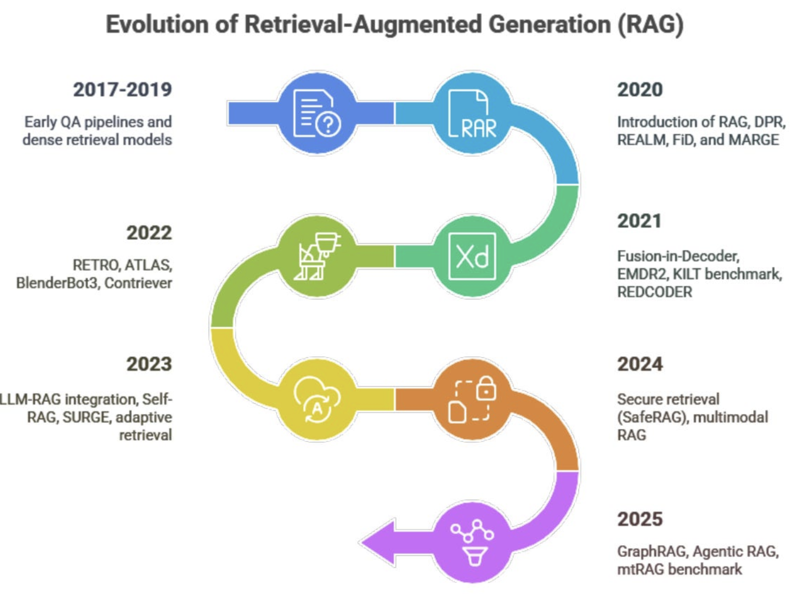

# Retrieval-Augmented Generation (RAG)
## 2-Week Nanodegree Module

### 🎯 **Module Overview**
This self-paced 2-week module provides comprehensive instruction on building sophisticated Retrieval-Augmented Generation (RAG) systems, from basic document retrieval to advanced agentic and graph-based approaches. Through hands-on tutorials and progressive implementation, you'll develop skills to create intelligent, context-aware systems that combine retrieval with generation for enhanced AI applications.

### 📋 **Prerequisites**
- Python programming experience (intermediate level)
- Basic understanding of LLMs and embeddings
- Familiarity with vector databases and similarity search
- Experience with API development and JSON processing
- Understanding of machine learning fundamentals

---

## **Week 1: RAG Fundamentals & Core Patterns**

### **Session 0: Introduction to RAG Architecture & Evolution (Self-Study)**
**Content:** Understanding RAG architecture, evolution from 2017-2025, core components, and common problems
**Materials:** Session0_Introduction_to_RAG_Architecture.md
**Self-Check:** 15-question multiple choice quiz covering RAG fundamentals and evolution
**Key Topics:**
- RAG architecture components (indexing, retrieval, generation)
- Evolution timeline: Early QA → Modern GraphRAG & Agentic RAG
- Common problems: ineffective chunking, semantic gaps, relevance issues
- Vector databases and embedding models

### **Session 1: Basic RAG Implementation**
**Content:** Building foundational RAG systems with document indexing and vector search
**Materials:** Session1_Basic_RAG_Implementation.md + Session1_Basic_RAG_Implementation-solution.md
**Self-Check:** Multiple choice quiz covering document processing and vector search
**Key Topics:**
- Document parsing and preprocessing
- Chunking strategies and text splitting
- Vector embeddings and similarity search
- Basic retrieval and generation pipeline

### **Session 2: Advanced Chunking & Preprocessing**
**Content:** Sophisticated document processing, metadata extraction, and chunk optimization
**Materials:** Session2_Advanced_Chunking_Preprocessing.md + Session2_Advanced_Chunking_Preprocessing-solution.md
**Self-Check:** Multiple choice quiz covering preprocessing techniques and optimization
**Key Topics:**
- Hierarchical chunking strategies
- Metadata extraction and enrichment
- Document structure preservation
- Multi-modal content processing

### **Session 3: Vector Databases & Search Optimization**
**Content:** Advanced vector search, hybrid retrieval, and database optimization
**Materials:** Session3_Vector_Databases_Search_Optimization.md + Session3_Vector_Databases_Search_Optimization-solution.md
**Self-Check:** Multiple choice quiz covering vector databases and search strategies
**Key Topics:**
- Vector database architectures (Pinecone, Chroma, Qdrant)
- Hybrid search combining semantic and keyword
- Index optimization and performance tuning
- Retrieval evaluation metrics

### **Session 4: Query Enhancement & Context Augmentation**
**Content:** Query expansion, hypothetical document embeddings (HyDE), and multi-query retrieval
**Materials:** Session4_Query_Enhancement_Context_Augmentation.md + Session4_Query_Enhancement_Context_Augmentation-solution.md
**Self-Check:** Multiple choice quiz covering query enhancement techniques
**Key Topics:**
- HyDE (Hypothetical Document Embeddings)
- Query expansion and reformulation
- Multi-query and sub-query generation
- Context window optimization

### **Session 5: RAG Evaluation & Quality Assessment**
**Content:** Comprehensive RAG evaluation frameworks, metrics, and quality benchmarks
**Materials:** Session5_RAG_Evaluation_Quality_Assessment.md + Session5_RAG_Evaluation_Quality_Assessment-solution.md
**Self-Check:** Multiple choice quiz covering evaluation methodologies and metrics
**Key Topics:**
- RAG evaluation frameworks (RAGAS, LLamaIndex)
- Faithfulness, answer relevance, and context precision
- A/B testing and performance benchmarking
- Quality assurance and monitoring

---

## **Week 2: Advanced RAG Patterns & Production Systems**

### **Session 6: Graph-Based RAG (GraphRAG)**
**Content:** Knowledge graph integration, entity extraction, and graph-enhanced retrieval
**Materials:** Session6_Graph_Based_RAG.md + Session6_Graph_Based_RAG-solution.md
**Self-Check:** Multiple choice quiz covering graph-based retrieval and knowledge graphs
**Key Topics:**
- Knowledge graph construction and maintenance
- Entity extraction and relationship mapping
- Graph traversal for enhanced context
- Code GraphRAG and knowledge graph RAG patterns

### **Session 7: Agentic RAG Systems**
**Content:** Agent-driven RAG with iterative refinement, planning, and adaptive retrieval
**Materials:** Session7_Agentic_RAG_Systems.md + Session7_Agentic_RAG_Systems-solution.md
**Self-Check:** Multiple choice quiz covering agentic patterns and adaptive systems
**Key Topics:**
- Agent-driven query refinement and planning
- Iterative retrieval with relevance checking
- Tool integration for enhanced capabilities
- Self-correcting and adaptive RAG systems

### **Session 8: Multi-Modal & Advanced RAG Variants**
**Content:** Multi-modal RAG, image+text retrieval, and specialized RAG architectures
**Materials:** Session8_MultiModal_Advanced_RAG.md + Session8_MultiModal_Advanced_RAG-solution.md
**Self-Check:** Multiple choice quiz covering multi-modal systems and advanced variants
**Key Topics:**
- Multi-modal embeddings and retrieval
- Image+text RAG systems
- RAG-Fusion and ensemble approaches
- Domain-specific RAG optimization

### **Session 9: Production RAG & Enterprise Integration**
**Content:** Scalable RAG deployment, monitoring, security, and enterprise integration
**Materials:** Session9_Production_RAG_Enterprise.md + Session9_Production_RAG_Enterprise-solution.md
**Self-Check:** Multiple choice quiz covering production deployment and enterprise concerns
**Key Topics:**
- Containerized RAG deployment
- Real-time indexing and incremental updates
- Security, privacy, and compliance
- Enterprise integration patterns and monitoring

## **Capstone Project: Comprehensive RAG Ecosystem**

**Project Overview:** Build a sophisticated RAG system demonstrating multiple retrieval patterns and production readiness

**Requirements:**
- Implement basic RAG with optimized chunking and retrieval
- Build GraphRAG system with knowledge graph integration
- Create Agentic RAG with iterative refinement
- Deploy multi-modal RAG supporting image+text
- Integrate evaluation framework with comprehensive metrics
- Deploy to production with monitoring and scalability

**Deliverables:**
- Complete RAG system with multiple retrieval strategies
- Knowledge graph construction and maintenance pipeline
- Agentic RAG with planning and self-correction
- Production deployment with monitoring and evaluation
- Performance benchmarks and quality assessment
- Enterprise integration documentation

---

## **📚 Comprehensive Resource Library**

### **Core Documentation**
- [LangChain RAG Tutorial](https://python.langchain.com/docs/tutorials/rag/)
- [LlamaIndex RAG Guide](https://docs.llamaindex.ai/en/stable/)
- [Vector Database Comparison](https://benchmark.vectorview.ai/)
- [RAG Evaluation Frameworks](https://github.com/explodinggradients/ragas)

### **Advanced Research Papers**
- [Retrieval-Augmented Generation for Knowledge-Intensive NLP Tasks](https://arxiv.org/abs/2005.11401)
- [From Local to Global: A Graph RAG Approach](https://arxiv.org/abs/2404.16130)
- [HyDE: Precise Zero-Shot Dense Retrieval](https://arxiv.org/abs/2212.10496)
- [RAG-Fusion: A New Take on Retrieval-Augmented Generation](https://github.com/Raudaschl/rag-fusion)

### **Implementation Frameworks**
- **LangChain:** Comprehensive RAG implementations with agent integration
- **LlamaIndex:** Specialized RAG framework with advanced indexing strategies
- **Haystack:** Production-ready NLP pipelines with RAG support
- **Chroma:** Open-source vector database for embedding storage
- **Pinecone:** Managed vector database service for production RAG

### **GitHub Repositories**
- [Code GraphRAG](https://github.com/vitali87/code-graph-rag) - Specialized GraphRAG for code understanding
- [AI Knowledge Graph](https://github.com/robert-mcdermott/ai-knowledge-graph) - Knowledge graph construction for RAG
- [Advanced RAG Techniques](https://github.com/NirDiamant/RAG_Techniques) - Collection of state-of-the-art RAG implementations

### **Vector Databases & Tools**
- **Chroma:** `pip install chromadb` - Open-source vector database
- **Qdrant:** `pip install qdrant-client` - High-performance vector search
- **FAISS:** `pip install faiss-cpu` - Facebook AI Similarity Search
- **Pinecone:** `pip install pinecone-client` - Managed vector database service

### **Evaluation & Monitoring**
- **RAGAS:** `pip install ragas` - RAG evaluation framework
- **LangSmith:** RAG performance monitoring and evaluation
- **Weights & Biases:** Experiment tracking for RAG optimization
- **Arize Phoenix:** RAG observability and performance monitoring

---

## **🎓 Learning Outcomes**

Upon completion of this module, students will be able to:

### **Technical Skills**
- Design and implement comprehensive RAG architectures from basic to advanced
- Optimize document processing, chunking, and embedding strategies
- Deploy and manage vector databases for production RAG systems
- Build Graph-based RAG systems with knowledge graph integration
- Implement Agentic RAG with planning and adaptive retrieval
- Create multi-modal RAG systems handling diverse content types

### **Production Capabilities**
- Evaluate RAG system quality using comprehensive metrics and frameworks
- Deploy scalable RAG systems with real-time indexing and updates
- Implement security, privacy, and compliance measures for enterprise RAG
- Monitor and optimize RAG performance in production environments
- Integrate RAG systems with existing enterprise data and workflows

### **Advanced Patterns**
- Implement HyDE, RAG-Fusion, and other state-of-the-art techniques
- Build self-correcting and adaptive RAG systems
- Create domain-specific RAG optimizations for specialized use cases
- Develop custom evaluation metrics and quality assurance frameworks

---

## **💡 Module Highlight: Evolution of RAG (2017-2025)**

This module traces the complete evolution of RAG systems:

**2017-2019:** Early QA pipelines and dense retrieval models
**2020:** Introduction of RAG, DPR, REALM, FiD, and MARGE
**2021:** Fusion-in-Decoder, FiD2, KiLT benchmarks, RETRO, and others
**2022:** RETRO, BlenderBot3, and Contriever improvements
**2023:** LLM-RAG integration, Self-RAG, SURGE, and adaptive retrieval
**2024:** Secure retrieval (SafeRAG), multimodal RAG advancement
**2025:** GraphRAG, Agentic RAG, and mrRAG benchmark establishment

Each session builds upon this evolution, ensuring students understand both historical context and cutting-edge developments in the RAG ecosystem.