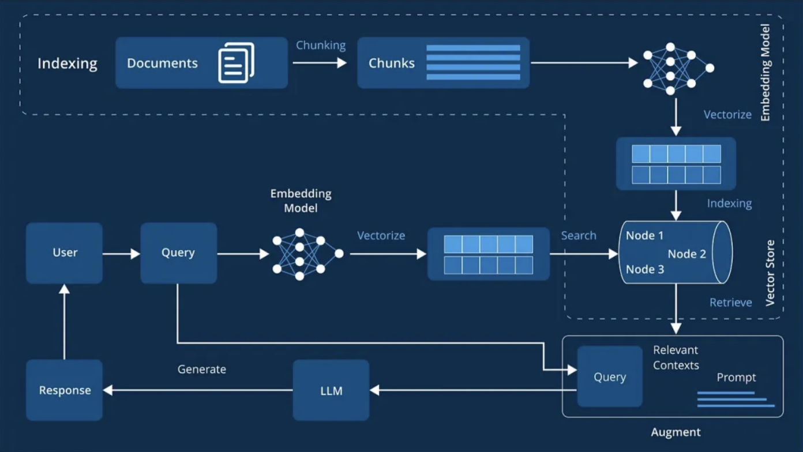

# Session 0: Introduction to RAG Architecture & Evolution

## 🎯 Learning Outcomes

By the end of this session, you will be able to:
- **Understand** the fundamental architecture and components of RAG systems
- **Analyze** the evolution of RAG from 2017 to 2025 and key technological advances
- **Identify** common problems in RAG implementations and their solutions
- **Compare** different RAG variants and their use cases
- **Evaluate** when to use RAG versus other AI approaches

## 📚 Chapter Introduction

### **What is RAG and Why Does it Matter?**

Retrieval-Augmented Generation (RAG) represents a paradigm shift in how we build AI systems that need access to external knowledge. Traditional large language models, while powerful, suffer from knowledge cutoffs, hallucinations, and inability to access real-time information. RAG solves these problems by combining the reasoning capabilities of LLMs with the precision of information retrieval systems.



### **The RAG Revolution: From Static to Dynamic Knowledge**

The image above illustrates the fundamental RAG architecture that has revolutionized how AI systems access and utilize knowledge. Unlike traditional approaches where knowledge is "baked into" model parameters during training, RAG creates a dynamic bridge between language models and external knowledge sources.

**Why RAG Matters:**
- **Accuracy**: Reduces hallucinations by grounding responses in retrieved facts
- **Currency**: Enables access to up-to-date information without retraining
- **Transparency**: Provides source attribution and explainable reasoning
- **Efficiency**: Updates knowledge base without expensive model retraining
- **Scalability**: Handles vast knowledge repositories that exceed model capacity


### **RAG Evolution: A Brief Timeline**

The evolution diagram above shows how RAG has progressed from simple question-answering systems to sophisticated agentic architectures:

- **2017-2019**: Early dense retrieval and QA pipelines
- **2020**: RAG foundation with DPR, REALM, and FiD
- **2021-2022**: Enhanced fusion techniques and LLM integration
- **2023**: Adaptive and self-reflective RAG systems
- **2024-2025**: Graph-based and agentic RAG architectures

This session will take you through the core architectural components that make RAG systems work, from basic indexing through advanced problem-solving approaches.

---

## **Part 1: RAG Architecture Fundamentals (20 minutes)**

### **Core RAG Components**

Every RAG system consists of three fundamental stages:

#### **1. Indexing Stage**
The offline preparation phase where knowledge is processed and stored:

```python
# Basic indexing pipeline concept
class RAGIndexer:
    def __init__(self, embedding_model, vector_store):
        self.embedding_model = embedding_model
        self.vector_store = vector_store
    
    def index_documents(self, documents):
        # 1. Parse and preprocess documents
        processed_docs = self.preprocess_documents(documents)
        
        # 2. Split into chunks
        chunks = self.chunk_documents(processed_docs)
        
        # 3. Generate embeddings
        embeddings = self.embedding_model.embed(chunks)
        
        # 4. Store in vector database
        self.vector_store.add(chunks, embeddings)
```

**Key Processes:**
- **Document Parsing**: Extract text from various formats (PDF, HTML, Word, etc.)
- **Preprocessing**: Clean text, remove noise, normalize formatting
- **Chunking**: Split documents into retrievable segments
- **Embedding**: Convert text chunks into dense vector representations
- **Storage**: Index vectors in databases optimized for similarity search

#### **2. Retrieval Stage**
The real-time phase where relevant information is retrieved:

```python
class RAGRetriever:
    def __init__(self, embedding_model, vector_store, top_k=5):
        self.embedding_model = embedding_model
        self.vector_store = vector_store
        self.top_k = top_k
    
    def retrieve_context(self, query):
        # 1. Embed the query
        query_embedding = self.embedding_model.embed(query)
        
        # 2. Search for similar chunks
        similar_chunks = self.vector_store.similarity_search(
            query_embedding, k=self.top_k
        )
        
        # 3. Return ranked results
        return self.rank_and_filter(similar_chunks)
```

**Key Operations:**
- **Query Processing**: Clean and normalize user queries
- **Embedding**: Convert queries to vector representations
- **Similarity Search**: Find most relevant chunks using vector similarity
- **Ranking**: Order results by relevance scores
- **Filtering**: Remove low-quality or irrelevant results

#### **3. Generation Stage**
The synthesis phase where retrieved context enhances LLM responses:

```python
class RAGGenerator:
    def __init__(self, llm_model):
        self.llm_model = llm_model
    
    def generate_response(self, query, context_chunks):
        # 1. Build augmented prompt
        prompt = self.build_rag_prompt(query, context_chunks)
        
        # 2. Generate response with context
        response = self.llm_model.generate(prompt)
        
        # 3. Post-process and validate
        return self.validate_response(response, context_chunks)
    
    def build_rag_prompt(self, query, context):
        return f"""
        Based on the following context, answer the user's question.
        
        Context:
        {self.format_context(context)}
        
        Question: {query}
        
        Answer based on the provided context:
        """
```

**Key Functions:**
- **Context Integration**: Combine retrieved information into coherent context
- **Prompt Engineering**: Design prompts that effectively use retrieved information
- **Response Generation**: Use LLM to synthesize context-aware answers
- **Validation**: Ensure responses are grounded in retrieved context

---

## **Part 2: RAG Evolution Timeline (2017-2025) (25 minutes)**


### **Phase 1: Early Dense Retrieval (2017-2019)**
**Key Developments:**
- Early question-answering pipelines
- Dense retrieval models emergence
- Focus on Wikipedia-based QA systems

**Characteristics:**
- Simple two-stage pipelines (retrieve → read)
- Limited to structured datasets
- Basic similarity matching

### **Phase 2: RAG Foundation (2020)**
**Breakthrough Papers:**
- **RAG (Retrieval-Augmented Generation)**: The foundational paper
- **DPR (Dense Passage Retrieval)**: Improved dense retrieval
- **REALM**: Retrieval-augmented language model pretraining
- **FiD (Fusion-in-Decoder)**: Advanced context fusion
- **MARGE**: Multilingual autoregressive generation

**Key Innovations:**
```python
# Conceptual RAG architecture from 2020
class OriginalRAG:
    def __init__(self, retriever, generator):
        self.retriever = retriever  # DPR-style dense retriever
        self.generator = generator  # BART/T5-style generator
    
    def generate(self, query):
        # Retrieve relevant passages
        passages = self.retriever.retrieve(query, k=5)
        
        # Generate with retrieved context
        return self.generator.generate(query, passages)
```

### **Phase 3: Enhanced Retrieval (2021)**
**Major Advances:**
- **Fusion-in-Decoder improvements**
- **FiD2**: Enhanced fusion techniques
- **KiLT benchmark**: Knowledge-intensive task evaluation
- **RETRO**: Retrieval-enhanced transformer

**Focus Areas:**
- Better context fusion mechanisms
- Standardized evaluation benchmarks
- Improved training procedures

### **Phase 4: LLM Integration Era (2022)**
**Key Developments:**
- **RETRO scaling**: Large-scale retrieval integration
- **BlenderBot3**: Conversational AI with web search
- **Contriever**: Unsupervised dense retrieval

**Architectural Shifts:**
```python
# LLM-era RAG with better integration
class ModernRAG:
    def __init__(self, llm, vector_store):
        self.llm = llm  # GPT-3.5/4 or similar
        self.vector_store = vector_store
    
    def enhanced_generate(self, query):
        # Multi-step retrieval and reasoning
        context = self.retrieve_with_expansion(query)
        
        # Advanced prompt engineering
        prompt = self.build_contextual_prompt(query, context)
        
        return self.llm.generate(prompt)
```

### **Phase 5: Adaptive & Intelligent RAG (2023)**
**Breakthrough Concepts:**
- **Self-RAG**: Self-reflective retrieval-augmented generation
- **SURGE**: Synthetic retrieval data generation
- **LLM-RAG integration**: Seamless LLM and retrieval fusion
- **Adaptive retrieval**: Context-aware retrieval decisions

**Key Features:**
- Self-correcting retrieval mechanisms
- Adaptive retrieval triggering
- Better handling of knowledge conflicts

### **Phase 6: Specialized RAG Variants (2024)**
**Advanced Developments:**
- **SafeRAG**: Secure and private retrieval
- **Multimodal RAG**: Image, audio, and video integration
- **Domain-specific optimizations**
- **Real-time knowledge updates**

**Emerging Patterns:**
```python
# 2024-style specialized RAG
class SpecializedRAG:
    def __init__(self, retriever, llm, safety_filter):
        self.retriever = retriever
        self.llm = llm
        self.safety_filter = safety_filter
    
    def secure_generate(self, query, user_context):
        # Privacy-preserving retrieval
        safe_context = self.safety_filter.filter_context(
            self.retriever.retrieve(query)
        )
        
        # Context-aware generation
        return self.llm.generate_with_safety(query, safe_context)
```

### **Phase 7: Next-Generation RAG (2025)**
**Current State-of-the-Art:**
- **GraphRAG**: Knowledge graph-enhanced retrieval
- **Agentic RAG**: Agent-driven adaptive systems
- **mrRAG benchmark**: Comprehensive evaluation framework

**Cutting-Edge Features:**
- Graph-based knowledge representation
- Agentic planning and self-correction
- Multi-hop reasoning capabilities
- Advanced evaluation methodologies

---

## **Part 3: Common RAG Problems & Solutions (20 minutes)**


### **Problem 1: Ineffective Chunking**
**Issues:**
- Information not fully extracted during parsing
- Ineffective chunking strategies
- Loss of document structure

**Solutions:**

### **Intelligent Chunking Framework**

**Step 1: Initialize the Chunker**
```python
# Advanced chunking strategies - Setup
class IntelligentChunker:
    def __init__(self, chunk_size=512, overlap=50):
        self.chunk_size = chunk_size
        self.overlap = overlap
```

*This initializes our chunker with configurable chunk size and overlap parameters. The overlap ensures context continuity between chunks.*

**Step 2: Hierarchical Document Processing**
```python
    def hierarchical_chunk(self, document):
        # Preserve document structure
        sections = self.extract_sections(document)
        
        chunks = []
        for section in sections:
            # Create hierarchical chunks
            section_chunks = self.semantic_split(section)
            chunks.extend(section_chunks)
        
        return self.add_metadata(chunks)
```

*This method maintains document structure by processing sections separately. Each section is semantically split and then enriched with metadata for better retrieval.*

**Step 3: Semantic Text Splitting**
```python
    def semantic_split(self, text):
        # Use sentence boundaries and semantic similarity
        sentences = self.split_sentences(text)
        return self.group_semantically_similar(sentences)
```

*Instead of splitting at arbitrary character counts, this groups semantically related sentences together, creating more coherent chunks.*

### **Problem 2: Weak Semantic Expression Ability**
**Issues:**
- Embedding models lack domain-specific understanding
- Query-document semantic gap
- Poor handling of implicit queries

**Solutions:**

### **Query Enhancement Pipeline**

**Step 1: Initialize Query Enhancer**
```python
# Query enhancement and expansion - Setup
class QueryEnhancer:
    def __init__(self, llm, domain_embeddings):
        self.llm = llm
        self.domain_embeddings = domain_embeddings
```

*This sets up the query enhancer with an LLM for generating hypothetical documents and domain-specific embeddings for better semantic understanding.*

**Step 2: Multi-Strategy Query Enhancement**
```python
    def enhance_query(self, original_query):
        # Generate hypothetical documents (HyDE)
        hypothetical_doc = self.llm.generate(
            f"Write a detailed document that would answer: {original_query}"
        )
        
        # Expand query with synonyms and related terms
        expanded_query = self.expand_with_synonyms(original_query)
```

*HyDE (Hypothetical Document Embeddings) generates what an ideal answer document would look like, improving retrieval by matching against document-like content rather than just queries.*

**Step 3: Create Multi-Representation Query**
```python
        # Create multi-representation query
        return {
            'original': original_query,
            'hypothetical': hypothetical_doc,
            'expanded': expanded_query
        }
```

*Returns multiple query representations that can be used together or separately to improve retrieval recall and precision.*

### **Problem 3: Query Meaning Not Clear**
**Issues:**
- Ambiguous or vague queries
- Lack of context understanding
- Poor query formulation

**Solutions:**
```python
# Query clarification and refinement
class QueryClarifier:
    def __init__(self, llm):
        self.llm = llm
    
    def clarify_query(self, query, conversation_history):
        clarification_prompt = f"""
        Given the conversation history and current query, 
        generate clarifying questions if the query is ambiguous:
        
        History: {conversation_history}
        Query: {query}
        
        If the query is clear, return "CLEAR".
        If ambiguous, ask clarifying questions.
        """
        
        return self.llm.generate(clarification_prompt)
```

### **Problem 4: Suboptimal Index Structure**
**Issues:**
- Poor index organization
- Inefficient search algorithms
- Limited metadata utilization

**Solutions:**

### **Hierarchical Index Architecture**

**Step 1: Initialize Optimized Index**
```python
# Advanced indexing with metadata - Setup
class OptimizedIndex:
    def __init__(self, vector_store):
        self.vector_store = vector_store
        self.metadata_filters = {}
```

*Sets up the index with vector storage and metadata filtering capabilities for more precise retrieval.*

**Step 2: Multi-Level Index Construction**
```python
    def build_hierarchical_index(self, documents):
        for doc in documents:
            # Extract rich metadata
            metadata = self.extract_metadata(doc)
            
            # Create multiple index levels
            self.index_document_level(doc, metadata)
            self.index_section_level(doc, metadata)
            self.index_chunk_level(doc, metadata)
```

*Creates multiple indexing levels (document, section, chunk) to enable both broad and specific searches. Rich metadata extraction improves search accuracy.*

**Step 3: Filtered Search Implementation**
```python
    def search_with_filters(self, query, filters=None):
        # Apply metadata filtering
        if filters:
            candidates = self.filter_by_metadata(filters)
        else:
            candidates = self.vector_store.get_all()
        
        # Semantic search within filtered candidates
        return self.semantic_search(query, candidates)
```

*Combines metadata filtering with semantic search for more precise results. Filters first narrow down candidates before expensive semantic search.*

### **Problem 5: Retrieved Context Low Accuracy**
**Issues:**
- Low relevance of retrieved chunks
- Redundant information
- Missing critical context

**Solutions:**

### **Context Quality Optimization Pipeline**

**Step 1: Initialize Context Optimizer**
```python
# Context quality improvement - Setup
class ContextOptimizer:
    def __init__(self, reranker, diversity_filter):
        self.reranker = reranker
        self.diversity_filter = diversity_filter
```

*Sets up the optimizer with reranking and diversity filtering components for improving context quality.*

**Step 2: Multi-Stage Context Optimization**
```python
    def optimize_context(self, query, retrieved_chunks):
        # Rerank by relevance
        reranked = self.reranker.rerank(query, retrieved_chunks)
        
        # Remove redundancy
        diverse_chunks = self.diversity_filter.filter(reranked)
        
        # Validate context quality
        validated = self.validate_context_quality(query, diverse_chunks)
        
        return validated
```

*Three-stage pipeline: First reranks by relevance, then removes redundant information, and finally validates overall context quality.*

**Step 3: LLM-Based Quality Assessment**
```python
    def validate_context_quality(self, query, chunks):
        # Use LLM to assess context relevance
        quality_scores = []
        for chunk in chunks:
            score = self.assess_relevance(query, chunk)
            quality_scores.append(score)
        
        # Filter low-quality chunks
        return [chunk for chunk, score in zip(chunks, quality_scores) 
                if score > self.quality_threshold]
```

*Uses LLM judgment to score chunk relevance, filtering out low-quality content that might confuse the generation stage.*

---

## **Part 4: RAG vs. Alternative Approaches (15 minutes)**

### **When to Use RAG**

**Best Use Cases:**
- **Knowledge-intensive applications**: QA systems, research assistance
- **Dynamic information needs**: Current events, frequently updated data
- **Domain-specific expertise**: Legal, medical, technical documentation
- **Transparency requirements**: Need to cite sources and explain reasoning

**RAG Advantages:**
```python
# RAG benefits in practice
class RAGBenefits:
    def demonstrate_benefits(self):
        return {
            'accuracy': 'Reduces hallucinations with factual grounding',
            'freshness': 'Incorporates up-to-date information',
            'transparency': 'Provides source citations and explanations',
            'efficiency': 'No need to retrain models for new knowledge',
            'scalability': 'Can handle large knowledge bases efficiently'
        }
```

### **Alternative Approaches**

#### **Fine-tuning vs. RAG**
```python
# Comparison framework
class ApproachComparison:
    def compare_approaches(self, use_case):
        if use_case.requires_frequent_updates:
            return "RAG - No retraining needed"
        elif use_case.has_static_domain_knowledge:
            return "Fine-tuning - Better task specialization"
        elif use_case.needs_source_attribution:
            return "RAG - Provides transparent sourcing"
        else:
            return "Hybrid - Combine both approaches"
```

#### **Function Calling vs. RAG**
```python
# When to use function calling instead
class FunctionCallApproach:
    def determine_approach(self, task):
        if task.requires_real_time_data:
            return "Function calling - Live API access"
        elif task.involves_static_knowledge:
            return "RAG - Efficient document retrieval"
        elif task.needs_computation:
            return "Function calling - Execute calculations"
        else:
            return "RAG - Knowledge synthesis"
```

### **Hybrid Approaches**
Modern systems often combine multiple techniques:

```python
# Hybrid RAG + Function Calling
class HybridSystem:
    def __init__(self, rag_system, function_registry):
        self.rag_system = rag_system
        self.function_registry = function_registry
    
    def intelligent_routing(self, query):
        # Determine best approach for query
        if self.needs_computation(query):
            return self.function_registry.execute(query)
        elif self.needs_knowledge_retrieval(query):
            return self.rag_system.retrieve_and_generate(query)
        else:
            # Combine both approaches
            knowledge = self.rag_system.retrieve(query)
            computation = self.function_registry.compute(query)
            return self.synthesize(knowledge, computation)
```

---

## **🧪 Interactive Exercise: RAG Architecture Design**

Design a RAG system for a specific use case:

### **Scenario: Legal Document Assistant**
You're building a RAG system to help lawyers find relevant case law and statutes.

**Requirements:**
- Handle complex legal queries
- Provide accurate citations
- Support multi-jurisdictional search
- Ensure high precision (legal accuracy is critical)

### **Your Task:**
1. **Design the indexing strategy** for legal documents
2. **Choose appropriate chunking method** for legal texts
3. **Select embedding model** for legal domain
4. **Design the retrieval pipeline** with precision focus
5. **Plan the evaluation approach** for legal accuracy

**Solution Framework:**

### **Legal RAG System Architecture**

**Step 1: Initialize Specialized Components**
```python
# Legal RAG system design - Setup
class LegalRAGSystem:
    def __init__(self):
        # Specialized legal embedding model
        self.embedder = LegalBERTEmbedder()
        
        # Hierarchical index for legal documents
        self.index = HierarchicalLegalIndex()
        
        # Citation-aware retriever
        self.retriever = CitationAwareRetriever()
        
        # Legal-specialized generator
        self.generator = LegalResponseGenerator()
```

*Uses domain-specific components: LegalBERT for understanding legal language, hierarchical indexing for legal document structure, and citation-aware processing.*

**Step 2: Legal Query Processing Pipeline**
```python
    def process_legal_query(self, query, jurisdiction=None):
        # Enhanced query processing for legal context
        enhanced_query = self.enhance_legal_query(query, jurisdiction)
        
        # Retrieve relevant legal precedents
        precedents = self.retriever.retrieve_precedents(enhanced_query)
        
        # Generate response with proper citations
        return self.generator.generate_with_citations(
            query, precedents, jurisdiction
        )
```

*Three-stage legal pipeline: Enhances queries with legal context and jurisdiction, retrieves relevant precedents, and generates responses with proper legal citations.*

---

## **📝 Chapter Summary**

### **Key Takeaways**
1. **RAG Architecture**: Three-stage pipeline (Index → Retrieve → Generate) with each stage having specific optimizations
2. **Evolution**: RAG has evolved from simple QA systems to sophisticated agentic and graph-based approaches
3. **Problem-Solution Mapping**: Common issues have well-established solutions through better chunking, query enhancement, and context optimization
4. **Use Case Selection**: RAG excels for knowledge-intensive, dynamic, and transparency-requiring applications

### **Critical Success Factors**
- **Quality Indexing**: Proper document processing and chunking strategies
- **Relevant Retrieval**: Effective similarity search and context ranking
- **Coherent Generation**: Well-designed prompts and context integration
- **Continuous Evaluation**: Ongoing quality assessment and system optimization

---

## **🧪 Knowledge Check**

Test your understanding of RAG architecture fundamentals with our comprehensive assessment.

### **Multiple Choice Questions**

**1. What are the three main stages of a RAG system?**
   - A) Parse, Search, Respond
   - B) Index, Retrieve, Generate
   - C) Chunk, Embed, Query
   - D) Store, Find, Answer

**2. Which RAG evolution phase introduced self-correcting mechanisms?**
   - A) 2020 - RAG Foundation
   - B) 2022 - LLM Integration
   - C) 2023 - Adaptive RAG
   - D) 2025 - Next-Gen RAG

**3. What is the primary advantage of HyDE (Hypothetical Document Embeddings)?**
   - A) Reduces computational cost
   - B) Improves query-document semantic alignment
   - C) Eliminates need for vector databases
   - D) Simplifies system architecture

**4. When should you choose RAG over fine-tuning?**
   - A) When the domain knowledge is static
   - B) When you need frequent knowledge updates
   - C) When computational resources are unlimited
   - D) When source attribution is not needed

**5. What is the key benefit of Agentic RAG systems?**
   - A) Faster retrieval speed
   - B) Lower computational requirements
   - C) Iterative query refinement and self-correction
   - D) Simpler system architecture

---

**📋 [View Solutions](Session0_Test_Solutions.md)**

*Complete the test above, then check your answers and review the detailed explanations in the solutions.*

---

## **Next Session Preview**

In Session 1, we'll dive hands-on into **Basic RAG Implementation**, where you'll:
- Build a complete RAG pipeline from scratch
- Implement document processing and chunking
- Set up vector search with embeddings
- Create your first retrieval-augmented responses
- Evaluate and optimize basic RAG performance

### **Preparation**
1. **Install required packages**: `pip install langchain chromadb openai sentence-transformers`
2. **Review embedding concepts**: Understanding of vector similarity and cosine distance
3. **Prepare test documents**: Gather 10-15 documents in your domain of interest
4. **Set up OpenAI API**: For embeddings and generation (or use open-source alternatives)

The journey from basic to sophisticated RAG starts with solid fundamentals – let's build them together! 🚀