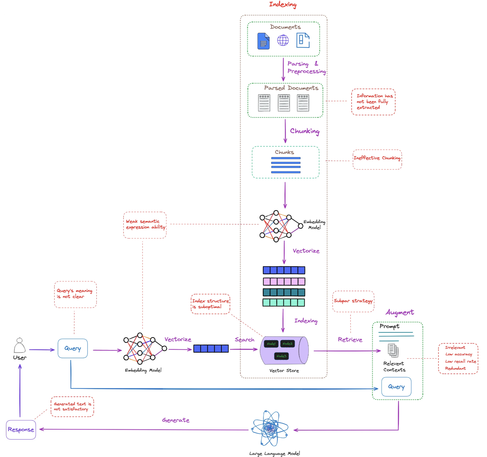

# Session 5: RAG Evaluation & Quality Assessment - Proving Enhancement Value

## 🎯 Learning Outcomes

By the end of this session, you will be able to:
- **Implement** comprehensive RAG evaluation frameworks (RAGAS, custom metrics)
- **Design** automated quality assessment pipelines for production RAG systems
- **Execute** A/B testing strategies for RAG optimization and component comparison
- **Build** continuous monitoring systems for RAG performance tracking
- **Create** domain-specific benchmarks and evaluation methodologies

## 📚 Chapter Introduction

### **The Critical Question: Do Your Enhancements Actually Work?**



You've built an impressive RAG system through Sessions 2-4: sophisticated chunking, optimized vector search, and intelligent query enhancement. But here's the crucial question every production system must answer: **Do these enhancements actually improve user experience?**

**The Enhancement Validation Challenge:**
- **Session 4's HyDE**: Does hypothetical document generation improve retrieval quality?
- **Query Expansion**: Do expanded queries find better context than original queries?
- **Context Optimization**: Does intelligent windowing create better responses?
- **Combined Systems**: How do these enhancements perform together vs. individually?

**Why Traditional Metrics Fail RAG:**
Unlike traditional ML where accuracy on test sets suffices, RAG systems have multiple interconnected failure modes:
- **Retrieval Failures**: Perfect search that finds irrelevant context
- **Generation Hallucination**: Accurate retrieval with fabricated responses  
- **Semantic Drift**: Contextually correct but intent-misaligned answers
- **User Experience Gaps**: Technically correct but practically unhelpful responses

### **Comprehensive Solutions You'll Master**

**Building on Your Enhancement Foundation:**
- **Baseline Comparisons**: Measure Session 4 enhancements against vanilla RAG
- **Multi-Dimensional Assessment**: Retrieval, generation, and user experience scoring
- **Scientific A/B Testing**: Rigorous comparison of enhancement strategies
- **Production-Grade Monitoring**: Real-time quality tracking and degradation detection

### **From Enhancement to Excellence**

This session transforms your sophisticated RAG system from "feature-rich" to "proven-effective":

**Your Journey So Far:**
- **Sessions 2-3**: Built high-performance retrieval infrastructure
- **Session 4**: Added intelligent query understanding
- **Session 5 Goal**: Prove these enhancements create measurable value
- **Sessions 6-9 Preview**: Apply proven techniques to advanced RAG patterns

By session's end, you'll know exactly which enhancements work, when they work, and how to measure their ongoing success in production.

Let's transform RAG quality from assumption to scientific measurement! 📊

---

## **Part 1: RAG Evaluation Framework Design (30 minutes)**

### **Multi-Dimensional RAG Evaluation: Measuring Enhancement Impact**

**Why RAG Evaluation Differs from Traditional ML Metrics**

Your Session 4 enhancements - HyDE, query expansion, context optimization - add complexity to RAG systems. Traditional accuracy metrics can't capture whether this complexity improves user experience. RAG evaluation must assess multiple interconnected dimensions:

**The RAG Quality Matrix:**
1. **Retrieval Quality**: Do enhancements find better documents?
2. **Generation Quality**: Do improved contexts create better responses?
3. **End-to-End Utility**: Does the complete enhanced system serve users better?
4. **Enhancement Attribution**: Which specific improvements drive quality gains?

This framework enables scientific comparison between your baseline RAG and enhanced systems:

```python
# Comprehensive RAG evaluation framework
from typing import List, Dict, Any, Optional, Tuple
import numpy as np
from dataclasses import dataclass
from abc import ABC, abstractmethod
import json
import time
from collections import defaultdict

@dataclass
class RAGEvaluationResult:
    """Structured result for RAG evaluation."""
    query: str
    retrieved_contexts: List[str]
    generated_answer: str
    reference_answer: Optional[str] = None
    retrieval_scores: Dict[str, float] = None
    generation_scores: Dict[str, float] = None
    end_to_end_scores: Dict[str, float] = None
    metadata: Dict[str, Any] = None

class RAGEvaluationFramework:
    """Comprehensive evaluation framework for RAG systems."""
    
    def __init__(self, llm_judge, embedding_model):
        self.llm_judge = llm_judge
        self.embedding_model = embedding_model
        
        # Initialize evaluators for different dimensions
        self.evaluators = {
            'retrieval': RetrievalEvaluator(embedding_model),
            'generation': GenerationEvaluator(llm_judge),
            'end_to_end': EndToEndEvaluator(llm_judge),
            'factual': FactualConsistencyEvaluator(llm_judge),
            'relevance': RelevanceEvaluator(llm_judge)
        }
        
        # Evaluation metrics registry
        self.metrics_registry = {
            'precision_at_k': self._precision_at_k,
            'recall_at_k': self._recall_at_k,
            'mrr': self._mean_reciprocal_rank,
            'ndcg': self._normalized_dcg,
            'semantic_similarity': self._semantic_similarity,
            'answer_relevance': self._answer_relevance,
            'faithfulness': self._faithfulness,
            'context_precision': self._context_precision,
            'context_recall': self._context_recall
        }
    
    def evaluate_rag_system(self, test_dataset: List[Dict],
                           rag_system,
                           evaluation_config: Dict) -> Dict[str, Any]:
        """Comprehensive evaluation of RAG system."""
        
        print(f"Evaluating RAG system on {len(test_dataset)} examples...")
        
        evaluation_results = []
        performance_metrics = defaultdict(list)
        
        for i, test_case in enumerate(test_dataset):
            if i % 10 == 0:
                print(f"Evaluating example {i+1}/{len(test_dataset)}")
            
            # Run RAG system
            rag_result = self._run_rag_system(rag_system, test_case)
            
            # Evaluate across all dimensions
            eval_result = self._evaluate_single_case(
                test_case, rag_result, evaluation_config
            )
            
            evaluation_results.append(eval_result)
            
            # Aggregate metrics
            self._aggregate_metrics(eval_result, performance_metrics)
        
        # Compute final metrics
        final_metrics = self._compute_final_metrics(performance_metrics)
        
        return {
            'individual_results': evaluation_results,
            'aggregate_metrics': final_metrics,
            'evaluation_config': evaluation_config,
            'dataset_size': len(test_dataset),
            'evaluation_timestamp': time.time()
        }
```

### **RAGAS Integration**

RAGAS (RAG Assessment) provides standardized evaluation metrics:

```python
# RAGAS integration for standardized evaluation
from ragas import evaluate
from ragas.metrics import (
    faithfulness,
    answer_relevancy,
    context_precision,
    context_recall,
    context_relevancy,
    answer_correctness,
    answer_similarity
)
from datasets import Dataset

class RAGASEvaluator:
    """RAGAS-based evaluation system."""
    
    def __init__(self, llm_model, embedding_model):
        self.llm_model = llm_model
        self.embedding_model = embedding_model
        
        # Configure RAGAS metrics
        self.metrics = [
            faithfulness,           # Factual consistency
            answer_relevancy,       # Answer relevance to question
            context_precision,      # Precision of retrieved context
            context_recall,         # Recall of retrieved context
            context_relevancy,      # Relevance of context to question
            answer_correctness,     # Correctness compared to ground truth
            answer_similarity       # Semantic similarity to ground truth
        ]
        
        # Initialize with models
        for metric in self.metrics:
            if hasattr(metric, 'init'):
                metric.init(self.llm_model, self.embedding_model)
    
    def evaluate_with_ragas(self, rag_results: List[Dict],
                           include_ground_truth: bool = True) -> Dict[str, Any]:
        """Evaluate using RAGAS framework."""
        
        # Prepare dataset in RAGAS format
        dataset_dict = self._prepare_ragas_dataset(rag_results, include_ground_truth)
        dataset = Dataset.from_dict(dataset_dict)
        
        # Select metrics based on available data
        selected_metrics = self._select_metrics(include_ground_truth)
        
        print(f"Running RAGAS evaluation with {len(selected_metrics)} metrics...")
        
        # Run evaluation
        ragas_results = evaluate(
            dataset=dataset,
            metrics=selected_metrics
        )
        
        return {
            'ragas_scores': ragas_results,
            'metric_descriptions': self._get_metric_descriptions(),
            'dataset_size': len(rag_results),
            'evaluation_summary': self._summarize_ragas_results(ragas_results)
        }
```

**Step 1: RAGAS Dataset Preparation**
```python
    def _prepare_ragas_dataset(self, rag_results: List[Dict], 
                              include_ground_truth: bool) -> Dict[str, List]:
        """Prepare dataset in RAGAS format."""
        
        dataset_dict = {
            'question': [],
            'answer': [],
            'contexts': [],
            'ground_truths': [] if include_ground_truth else None
        }
        
        for result in rag_results:
            dataset_dict['question'].append(result['query'])
            dataset_dict['answer'].append(result['generated_answer'])
            
            # Format contexts as list of strings
            contexts = []
            if 'retrieved_contexts' in result:
                contexts = [
                    ctx if isinstance(ctx, str) else ctx['content']
                    for ctx in result['retrieved_contexts']
                ]
            dataset_dict['contexts'].append(contexts)
            
            # Add ground truth if available
            if include_ground_truth and 'ground_truth' in result:
                if dataset_dict['ground_truths'] is not None:
                    # Ground truth should be a list
                    gt = result['ground_truth']
                    if isinstance(gt, str):
                        gt = [gt]
                    dataset_dict['ground_truths'].append(gt)
        
        # Remove ground_truths if not using
        if not include_ground_truth:
            del dataset_dict['ground_truths']
        
        return dataset_dict
```

### **Custom Evaluation Metrics**

Implement domain-specific and advanced evaluation metrics:

```python
# Custom evaluation metrics
class CustomRAGMetrics:
    """Custom evaluation metrics for specialized RAG applications."""
    
    def __init__(self, llm_judge, domain_knowledge: Optional[Dict] = None):
        self.llm_judge = llm_judge
        self.domain_knowledge = domain_knowledge or {}
        
    def evaluate_answer_completeness(self, query: str, answer: str, 
                                   contexts: List[str]) -> float:
        """Evaluate how completely the answer addresses the query."""
        
        completeness_prompt = f"""
        Evaluate how completely this answer addresses the given question based on the provided contexts.
        
        Question: {query}
        
        Answer: {answer}
        
        Available Contexts: {' '.join(contexts[:3])}
        
        Rate completeness on a scale of 0.0 to 1.0:
        - 1.0: Answer fully and comprehensively addresses all aspects of the question
        - 0.7: Answer addresses most important aspects but misses some details
        - 0.4: Answer partially addresses the question but lacks important information
        - 0.1: Answer barely addresses the question or contains mostly irrelevant information
        - 0.0: Answer completely fails to address the question
        
        Consider:
        1. Does the answer cover all aspects of the question?
        2. Are important details included?
        3. Is the scope of the answer appropriate?
        4. Does the answer use information from the contexts effectively?
        
        Return only a number between 0.0 and 1.0:
        """
        
        try:
            response = self.llm_judge.predict(completeness_prompt).strip()
            score = float(response)
            return max(0.0, min(1.0, score))
        except:
            return 0.5
    
    def evaluate_citation_quality(self, answer: str, contexts: List[str]) -> float:
        """Evaluate quality of citations and source attribution."""
        
        # Count citations in answer
        citation_patterns = ['[Source:', '(Source:', 'According to', 'As stated in']
        citation_count = sum(
            answer.lower().count(pattern.lower()) for pattern in citation_patterns
        )
        
        # Check if citations match available contexts
        valid_citations = 0
        for context in contexts:
            # Simple check if context information appears in answer
            context_words = set(context.lower().split())
            answer_words = set(answer.lower().split())
            overlap = len(context_words.intersection(answer_words))
            
            if overlap > 5:  # Threshold for meaningful overlap
                valid_citations += 1
        
        # Calculate citation quality score
        if len(contexts) == 0:
            return 0.0
        
        citation_coverage = valid_citations / len(contexts)
        citation_frequency = min(citation_count / 3, 1.0)  # Normalize to max 1
        
        # Weighted average
        citation_quality = 0.7 * citation_coverage + 0.3 * citation_frequency
        
        return citation_quality
```

**Step 2: Retrieval Quality Assessment**
```python
class RetrievalEvaluator:
    """Specialized evaluator for retrieval quality."""
    
    def __init__(self, embedding_model):
        self.embedding_model = embedding_model
        
    def evaluate_retrieval_quality(self, query: str, retrieved_contexts: List[str],
                                 ground_truth_contexts: List[str] = None) -> Dict[str, float]:
        """Comprehensive retrieval quality evaluation."""
        
        metrics = {}
        
        # Semantic relevance of retrieved contexts
        metrics['semantic_relevance'] = self._calculate_semantic_relevance(
            query, retrieved_contexts
        )
        
        # Diversity of retrieved contexts
        metrics['context_diversity'] = self._calculate_context_diversity(
            retrieved_contexts
        )
        
        # Coverage of information needs
        metrics['information_coverage'] = self._assess_information_coverage(
            query, retrieved_contexts
        )
        
        # If ground truth available, calculate precision/recall
        if ground_truth_contexts:
            precision_recall = self._calculate_precision_recall(
                retrieved_contexts, ground_truth_contexts
            )
            metrics.update(precision_recall)
        
        return metrics
    
    def _calculate_semantic_relevance(self, query: str, 
                                    contexts: List[str]) -> float:
        """Calculate average semantic relevance of contexts to query."""
        
        if not contexts:
            return 0.0
        
        query_embedding = self.embedding_model.encode([query])[0]
        context_embeddings = self.embedding_model.encode(contexts)
        
        # Calculate similarities
        similarities = []
        for ctx_emb in context_embeddings:
            similarity = np.dot(query_embedding, ctx_emb) / (
                np.linalg.norm(query_embedding) * np.linalg.norm(ctx_emb)
            )
            similarities.append(similarity)
        
        return float(np.mean(similarities))
    
    def _calculate_context_diversity(self, contexts: List[str]) -> float:
        """Calculate diversity among retrieved contexts."""
        
        if len(contexts) < 2:
            return 1.0  # Single context is maximally diverse
        
        context_embeddings = self.embedding_model.encode(contexts)
        
        # Calculate pairwise similarities
        similarities = []
        for i in range(len(context_embeddings)):
            for j in range(i+1, len(context_embeddings)):
                similarity = np.dot(context_embeddings[i], context_embeddings[j]) / (
                    np.linalg.norm(context_embeddings[i]) * np.linalg.norm(context_embeddings[j])
                )
                similarities.append(similarity)
        
        # Diversity is inverse of average similarity
        avg_similarity = np.mean(similarities)
        diversity = 1.0 - avg_similarity
        
        return max(0.0, diversity)
```

---

## **Part 2: Automated Quality Assessment (25 minutes)**

### **LLM-as-a-Judge Evaluation**

Use LLMs to evaluate response quality automatically:

```python
# LLM-as-a-Judge evaluation system
class LLMJudgeEvaluator:
    """Use LLM as a judge for RAG response evaluation."""
    
    def __init__(self, judge_llm, temperature: float = 0.1):
        self.judge_llm = judge_llm
        self.temperature = temperature
        
        # Evaluation prompts for different aspects
        self.evaluation_prompts = {
            'relevance': self._relevance_evaluation_prompt,
            'accuracy': self._accuracy_evaluation_prompt,
            'completeness': self._completeness_evaluation_prompt,
            'coherence': self._coherence_evaluation_prompt,
            'helpfulness': self._helpfulness_evaluation_prompt
        }
    
    def evaluate_response_quality(self, query: str, response: str,
                                contexts: List[str],
                                aspects: List[str] = None) -> Dict[str, Any]:
        """Evaluate response quality using LLM judge."""
        
        if aspects is None:
            aspects = ['relevance', 'accuracy', 'completeness', 'coherence']
        
        evaluation_results = {}
        detailed_feedback = {}
        
        for aspect in aspects:
            if aspect in self.evaluation_prompts:
                score, feedback = self._evaluate_aspect(
                    aspect, query, response, contexts
                )
                evaluation_results[aspect] = score
                detailed_feedback[aspect] = feedback
        
        # Calculate overall score
        overall_score = np.mean(list(evaluation_results.values()))
        
        return {
            'aspect_scores': evaluation_results,
            'overall_score': overall_score,
            'detailed_feedback': detailed_feedback,
            'evaluation_summary': self._generate_evaluation_summary(
                evaluation_results, detailed_feedback
            )
        }
```

**Step 3: Aspect-Specific Evaluation Prompts**
```python
    def _relevance_evaluation_prompt(self, query: str, response: str, 
                                   contexts: List[str]) -> str:
        """Generate prompt for relevance evaluation."""
        
        return f"""You are an expert evaluator assessing the relevance of AI-generated responses.

TASK: Evaluate how well the response addresses the given query.

QUERY: {query}

RESPONSE: {response}

EVALUATION CRITERIA:
1. Direct Address: Does the response directly answer what was asked?
2. Scope Alignment: Is the response appropriately scoped to the query?
3. Focus: Does the response stay focused on the main question?
4. Completeness: Does it address all parts of multi-part questions?

SCORING SCALE:
5 - Excellent: Response perfectly addresses the query with complete relevance
4 - Good: Response addresses the query well with minor irrelevant content
3 - Average: Response partially addresses the query but has some irrelevant parts
2 - Poor: Response marginally addresses the query with significant irrelevant content  
1 - Very Poor: Response barely addresses or completely misses the query

Provide your evaluation in this format:
SCORE: [1-5]
REASONING: [Detailed explanation of your scoring decision]
SUGGESTIONS: [How the response could be improved]
"""
    
    def _accuracy_evaluation_prompt(self, query: str, response: str,
                                  contexts: List[str]) -> str:
        """Generate prompt for accuracy evaluation."""
        
        contexts_text = '\n\n'.join([f"Context {i+1}: {ctx}" for i, ctx in enumerate(contexts[:3])])
        
        return f"""You are an expert fact-checker evaluating the accuracy of AI responses.

TASK: Evaluate the factual accuracy of the response based on the provided contexts.

QUERY: {query}

RESPONSE: {response}

AVAILABLE CONTEXTS:
{contexts_text}

EVALUATION CRITERIA:
1. Factual Correctness: Are the facts stated in the response accurate?
2. Source Consistency: Does the response align with the provided contexts?
3. No Hallucinations: Does the response avoid making up information not in the contexts?
4. Proper Attribution: Are claims properly supported by the available information?

SCORING SCALE:
5 - Excellent: All information is accurate and well-supported by contexts
4 - Good: Mostly accurate with minor unsupported details
3 - Average: Generally accurate but contains some questionable claims
2 - Poor: Contains several inaccuracies or unsupported claims
1 - Very Poor: Contains significant inaccuracies or fabricated information

Provide your evaluation in this format:
SCORE: [1-5]
REASONING: [Detailed explanation focusing on specific factual claims]
INACCURACIES: [List any factual errors or unsupported claims]
SUGGESTIONS: [How accuracy could be improved]
"""
```

### **Automated Benchmark Testing**

Create automated pipelines for continuous evaluation:

```python
# Automated benchmark testing system
class AutomatedRAGBenchmark:
    """Automated benchmark testing for RAG systems."""
    
    def __init__(self, evaluation_framework, test_datasets: Dict[str, List]):
        self.evaluation_framework = evaluation_framework
        self.test_datasets = test_datasets
        self.benchmark_history = []
        
    def run_comprehensive_benchmark(self, rag_system,
                                   benchmark_config: Dict) -> Dict[str, Any]:
        """Run comprehensive benchmark across multiple test datasets."""
        
        benchmark_results = {
            'timestamp': time.time(),
            'config': benchmark_config,
            'dataset_results': {},
            'aggregate_performance': {}
        }
        
        print("Starting comprehensive RAG benchmark...")
        
        # Run evaluation on each test dataset
        for dataset_name, dataset in self.test_datasets.items():
            print(f"\nEvaluating on {dataset_name} dataset ({len(dataset)} examples)")
            
            dataset_result = self.evaluation_framework.evaluate_rag_system(
                dataset, rag_system, benchmark_config
            )
            
            benchmark_results['dataset_results'][dataset_name] = dataset_result
            
            # Extract key metrics for aggregation
            self._extract_key_metrics(dataset_name, dataset_result, benchmark_results)
        
        # Calculate cross-dataset aggregates
        benchmark_results['aggregate_performance'] = self._calculate_aggregate_performance(
            benchmark_results['dataset_results']
        )
        
        # Store in benchmark history
        self.benchmark_history.append(benchmark_results)
        
        # Generate performance report
        performance_report = self._generate_performance_report(benchmark_results)
        benchmark_results['performance_report'] = performance_report
        
        return benchmark_results
```

**Step 4: Performance Tracking and Regression Detection**
```python
    def detect_performance_regression(self, current_results: Dict,
                                    threshold: float = 0.05) -> Dict[str, Any]:
        """Detect performance regression compared to previous benchmarks."""
        
        if len(self.benchmark_history) < 2:
            return {'regression_detected': False, 'message': 'Insufficient history for comparison'}
        
        previous_results = self.benchmark_history[-2]  # Previous benchmark
        
        regression_analysis = {
            'regression_detected': False,
            'declining_metrics': [],
            'improving_metrics': [],
            'stable_metrics': [],
            'overall_change': 0.0
        }
        
        # Compare key metrics across datasets
        for dataset_name in current_results['dataset_results']:
            if dataset_name in previous_results['dataset_results']:
                current_metrics = current_results['dataset_results'][dataset_name]['aggregate_metrics']
                previous_metrics = previous_results['dataset_results'][dataset_name]['aggregate_metrics']
                
                for metric_name in current_metrics:
                    if metric_name in previous_metrics:
                        current_score = current_metrics[metric_name]
                        previous_score = previous_metrics[metric_name]
                        change = current_score - previous_score
                        
                        if change < -threshold:  # Significant decline
                            regression_analysis['declining_metrics'].append({
                                'dataset': dataset_name,
                                'metric': metric_name,
                                'change': change,
                                'current': current_score,
                                'previous': previous_score
                            })
                            regression_analysis['regression_detected'] = True
                        elif change > threshold:  # Significant improvement
                            regression_analysis['improving_metrics'].append({
                                'dataset': dataset_name,
                                'metric': metric_name,
                                'change': change,
                                'current': current_score,
                                'previous': previous_score
                            })
                        else:  # Stable performance
                            regression_analysis['stable_metrics'].append({
                                'dataset': dataset_name,
                                'metric': metric_name,
                                'change': change
                            })
        
        # Calculate overall performance change
        if regression_analysis['declining_metrics'] or regression_analysis['improving_metrics']:
            all_changes = [m['change'] for m in regression_analysis['declining_metrics']] + \
                         [m['change'] for m in regression_analysis['improving_metrics']]
            regression_analysis['overall_change'] = np.mean(all_changes)
        
        return regression_analysis
```

---

## **Part 3: A/B Testing for RAG Optimization (20 minutes)**

### **Scientific Enhancement Comparison: Proving What Works**

**The Enhancement Testing Challenge**

You've implemented multiple Session 4 enhancements, but which ones actually improve RAG quality? A/B testing provides the scientific rigor to answer:

- **HyDE vs. Original Queries**: Does hypothetical document generation improve retrieval?
- **Query Expansion Strategies**: Which expansion techniques (semantic, contextual, domain-specific) work best?
- **Context Window Optimization**: Do intelligent window sizes improve generation quality?
- **Combined Enhancement Strategies**: How do enhancements perform together vs. individually?

**A/B Testing for Enhancement Validation:**

```python
# A/B testing framework for RAG systems
class RAGABTestFramework:
    """A/B testing framework for RAG system optimization."""
    
    def __init__(self, evaluation_framework):
        self.evaluation_framework = evaluation_framework
        self.active_tests = {}
        self.test_history = []
        
    def setup_ab_test(self, test_name: str, 
                     component_variants: Dict[str, Any],
                     test_dataset: List[Dict],
                     test_config: Dict) -> Dict[str, Any]:
        """Setup A/B test for RAG component comparison."""
        
        test_setup = {
            'test_name': test_name,
            'variants': component_variants,
            'dataset': test_dataset,
            'config': test_config,
            'start_time': time.time(),
            'status': 'setup'
        }
        
        # Validate test setup
        validation_result = self._validate_test_setup(test_setup)
        if not validation_result['valid']:
            raise ValueError(f"Invalid test setup: {validation_result['errors']}")
        
        self.active_tests[test_name] = test_setup
        
        print(f"A/B test '{test_name}' setup complete with {len(component_variants)} variants")
        return test_setup
    
    def run_ab_test(self, test_name: str) -> Dict[str, Any]:
        """Execute A/B test and collect results."""
        
        if test_name not in self.active_tests:
            raise ValueError(f"Test '{test_name}' not found in active tests")
        
        test_setup = self.active_tests[test_name]
        test_setup['status'] = 'running'
        
        print(f"Running A/B test: {test_name}")
        
        variant_results = {}
        
        # Test each variant
        for variant_name, variant_config in test_setup['variants'].items():
            print(f"  Testing variant: {variant_name}")
            
            # Create RAG system with variant configuration
            rag_system = self._create_rag_variant(variant_config)
            
            # Evaluate variant
            variant_result = self.evaluation_framework.evaluate_rag_system(
                test_setup['dataset'], 
                rag_system, 
                test_setup['config']
            )
            
            variant_results[variant_name] = variant_result
        
        # Analyze results
        analysis_result = self._analyze_ab_results(variant_results, test_setup)
        
        # Complete test
        test_result = {
            'test_name': test_name,
            'test_setup': test_setup,
            'variant_results': variant_results,
            'analysis': analysis_result,
            'completion_time': time.time(),
            'duration': time.time() - test_setup['start_time']
        }
        
        # Update test status
        test_setup['status'] = 'completed'
        self.test_history.append(test_result)
        
        return test_result
```

**Step 5: Statistical Significance Testing**
```python
    def _analyze_ab_results(self, variant_results: Dict, 
                          test_setup: Dict) -> Dict[str, Any]:
        """Analyze A/B test results with statistical significance testing."""
        
        from scipy import stats
        
        analysis = {
            'winner': None,
            'statistical_significance': {},
            'effect_sizes': {},
            'recommendations': [],
            'detailed_comparison': {}
        }
        
        # Extract key metrics for comparison
        metric_comparisons = defaultdict(dict)
        
        for variant_name, result in variant_results.items():
            for metric_name, metric_value in result['aggregate_metrics'].items():
                metric_comparisons[metric_name][variant_name] = metric_value
        
        # Perform pairwise comparisons
        variant_names = list(variant_results.keys())
        
        for metric_name, metric_data in metric_comparisons.items():
            analysis['detailed_comparison'][metric_name] = {}
            
            for i, variant_a in enumerate(variant_names):
                for variant_b in variant_names[i+1:]:
                    
                    score_a = metric_data[variant_a]
                    score_b = metric_data[variant_b]
                    
                    # Calculate effect size (Cohen's d approximation)
                    effect_size = abs(score_a - score_b) / max(
                        np.std([score_a, score_b]), 0.01
                    )
                    
                    # Simple significance test (would need individual scores for proper test)
                    difference = abs(score_a - score_b)
                    is_significant = difference > 0.05  # Simple threshold
                    
                    comparison_key = f"{variant_a}_vs_{variant_b}"
                    analysis['detailed_comparison'][metric_name][comparison_key] = {
                        'variant_a_score': score_a,
                        'variant_b_score': score_b,
                        'difference': score_a - score_b,
                        'effect_size': effect_size,
                        'is_significant': is_significant,
                        'better_variant': variant_a if score_a > score_b else variant_b
                    }
        
        # Determine overall winner
        analysis['winner'] = self._determine_overall_winner(
            variant_results, analysis['detailed_comparison']
        )
        
        # Generate recommendations
        analysis['recommendations'] = self._generate_test_recommendations(analysis)
        
        return analysis
```

### **Multi-Armed Bandit Testing**

Implement adaptive testing strategies:

```python
# Multi-armed bandit for RAG optimization
class RAGMultiArmedBandit:
    """Multi-armed bandit for adaptive RAG system optimization."""
    
    def __init__(self, variants: List[str], exploration_rate: float = 0.1):
        self.variants = variants
        self.exploration_rate = exploration_rate
        
        # Initialize bandit arms
        self.arm_counts = {variant: 0 for variant in variants}
        self.arm_rewards = {variant: 0.0 for variant in variants}
        self.arm_avg_rewards = {variant: 0.0 for variant in variants}
        
        self.total_trials = 0
        self.trial_history = []
    
    def select_variant(self) -> str:
        """Select variant using epsilon-greedy strategy."""
        
        # Exploration: random selection
        if np.random.random() < self.exploration_rate:
            selected_variant = np.random.choice(self.variants)
            selection_reason = "exploration"
        else:
            # Exploitation: select best performing variant
            if self.total_trials == 0:
                selected_variant = np.random.choice(self.variants)
                selection_reason = "random_initial"
            else:
                best_variant = max(self.arm_avg_rewards.items(), key=lambda x: x[1])[0]
                selected_variant = best_variant
                selection_reason = "exploitation"
        
        return selected_variant
    
    def update_reward(self, variant: str, reward: float):
        """Update reward for selected variant."""
        
        self.arm_counts[variant] += 1
        self.arm_rewards[variant] += reward
        self.arm_avg_rewards[variant] = self.arm_rewards[variant] / self.arm_counts[variant]
        
        self.total_trials += 1
        
        # Record trial
        self.trial_history.append({
            'trial': self.total_trials,
            'variant': variant,
            'reward': reward,
            'avg_reward': self.arm_avg_rewards[variant],
            'timestamp': time.time()
        })
    
    def get_performance_summary(self) -> Dict[str, Any]:
        """Get current performance summary."""
        
        return {
            'total_trials': self.total_trials,
            'variant_performance': {
                variant: {
                    'trials': self.arm_counts[variant],
                    'total_reward': self.arm_rewards[variant],
                    'average_reward': self.arm_avg_rewards[variant],
                    'selection_rate': self.arm_counts[variant] / max(self.total_trials, 1)
                }
                for variant in self.variants
            },
            'best_variant': max(self.arm_avg_rewards.items(), key=lambda x: x[1])[0] if self.total_trials > 0 else None,
            'exploration_rate': self.exploration_rate
        }
```

---

## **Part 4: Continuous Monitoring and Quality Assurance (25 minutes)**

### **Production RAG Monitoring**

Monitor RAG system performance in production:

```python
# Production monitoring system
class RAGProductionMonitor:
    """Continuous monitoring system for production RAG deployments."""
    
    def __init__(self, evaluation_framework, alert_thresholds: Dict):
        self.evaluation_framework = evaluation_framework
        self.alert_thresholds = alert_thresholds
        
        # Monitoring components
        self.performance_tracker = PerformanceTracker()
        self.quality_monitor = QualityMonitor()
        self.anomaly_detector = AnomalyDetector()
        
        # Monitoring data storage
        self.monitoring_data = {
            'performance_metrics': [],
            'quality_samples': [],
            'alerts': [],
            'system_health': []
        }
    
    def monitor_rag_interaction(self, query: str, response: str,
                              contexts: List[str], metadata: Dict) -> Dict[str, Any]:
        """Monitor individual RAG interaction."""
        
        monitoring_result = {
            'timestamp': time.time(),
            'query': query,
            'response': response,
            'contexts': contexts,
            'metadata': metadata
        }
        
        # Performance monitoring
        performance_metrics = self.performance_tracker.track_performance(
            query, response, contexts, metadata
        )
        monitoring_result['performance'] = performance_metrics
        
        # Quality assessment
        quality_scores = self.quality_monitor.assess_quality(
            query, response, contexts
        )
        monitoring_result['quality'] = quality_scores
        
        # Anomaly detection
        anomaly_flags = self.anomaly_detector.detect_anomalies(
            performance_metrics, quality_scores
        )
        monitoring_result['anomalies'] = anomaly_flags
        
        # Store monitoring data
        self._store_monitoring_data(monitoring_result)
        
        # Check alert conditions
        alerts = self._check_alert_conditions(monitoring_result)
        if alerts:
            self._trigger_alerts(alerts)
        
        return monitoring_result
```

**Step 6: Quality Monitoring Implementation**
```python
class QualityMonitor:
    """Real-time quality monitoring for RAG responses."""
    
    def __init__(self, llm_judge=None):
        self.llm_judge = llm_judge
        
        # Quality assessment strategies
        self.quality_assessments = {
            'response_length': self._assess_response_length,
            'context_utilization': self._assess_context_utilization,
            'factual_consistency': self._assess_factual_consistency,
            'relevance_score': self._assess_relevance,
            'citation_quality': self._assess_citation_quality
        }
        
        # Quality baselines (would be learned from data)
        self.quality_baselines = {
            'response_length': {'min': 50, 'max': 500, 'optimal': 200},
            'context_utilization': {'min': 0.3, 'optimal': 0.7},
            'relevance_score': {'min': 0.6, 'optimal': 0.8},
            'citation_quality': {'min': 0.4, 'optimal': 0.7}
        }
    
    def assess_quality(self, query: str, response: str, 
                      contexts: List[str]) -> Dict[str, Any]:
        """Assess quality of RAG response."""
        
        quality_scores = {}
        quality_flags = []
        
        # Run all quality assessments
        for assessment_name, assessment_func in self.quality_assessments.items():
            try:
                score = assessment_func(query, response, contexts)
                quality_scores[assessment_name] = score
                
                # Check against baselines
                baseline = self.quality_baselines.get(assessment_name)
                if baseline and 'min' in baseline:
                    if score < baseline['min']:
                        quality_flags.append({
                            'type': 'quality_below_threshold',
                            'assessment': assessment_name,
                            'score': score,
                            'threshold': baseline['min']
                        })
                        
            except Exception as e:
                print(f"Quality assessment error for {assessment_name}: {e}")
                quality_scores[assessment_name] = None
        
        # Calculate overall quality score
        valid_scores = [score for score in quality_scores.values() if score is not None]
        overall_quality = np.mean(valid_scores) if valid_scores else 0.0
        
        return {
            'individual_scores': quality_scores,
            'overall_quality': overall_quality,
            'quality_flags': quality_flags,
            'assessment_timestamp': time.time()
        }
    
    def _assess_response_length(self, query: str, response: str, 
                              contexts: List[str]) -> float:
        """Assess if response length is appropriate."""
        
        response_length = len(response.split())
        baseline = self.quality_baselines['response_length']
        
        if response_length < baseline['min']:
            return response_length / baseline['min']  # Penalize too short
        elif response_length > baseline['max']:
            return baseline['max'] / response_length  # Penalize too long
        else:
            # Optimal range - score based on proximity to optimal
            distance_from_optimal = abs(response_length - baseline['optimal'])
            max_distance = max(baseline['optimal'] - baseline['min'], 
                             baseline['max'] - baseline['optimal'])
            return 1.0 - (distance_from_optimal / max_distance)
    
    def _assess_context_utilization(self, query: str, response: str,
                                  contexts: List[str]) -> float:
        """Assess how well the response utilizes provided contexts."""
        
        if not contexts:
            return 0.0
        
        # Simple word overlap assessment
        response_words = set(response.lower().split())
        
        utilization_scores = []
        for context in contexts:
            context_words = set(context.lower().split())
            overlap = len(response_words.intersection(context_words))
            context_utilization = overlap / len(context_words) if context_words else 0
            utilization_scores.append(context_utilization)
        
        # Return average utilization across all contexts
        return np.mean(utilization_scores) if utilization_scores else 0.0
```

### **Alerting and Incident Response**

Implement alerting for quality degradation:

```python
# Alerting system for RAG monitoring
class RAGAlertingSystem:
    """Alerting system for RAG quality degradation and anomalies."""
    
    def __init__(self, alert_config: Dict):
        self.alert_config = alert_config
        self.alert_history = []
        self.active_alerts = {}
        
        # Alert severity levels
        self.severity_levels = {
            'low': {'threshold_multiplier': 1.2, 'cooldown': 300},
            'medium': {'threshold_multiplier': 1.5, 'cooldown': 180}, 
            'high': {'threshold_multiplier': 2.0, 'cooldown': 60},
            'critical': {'threshold_multiplier': 3.0, 'cooldown': 0}
        }
    
    def evaluate_alert_conditions(self, monitoring_data: Dict) -> List[Dict]:
        """Evaluate if any alert conditions are met."""
        
        alerts_to_trigger = []
        current_time = time.time()
        
        # Check quality degradation alerts
        quality_alerts = self._check_quality_alerts(monitoring_data)
        alerts_to_trigger.extend(quality_alerts)
        
        # Check performance alerts
        performance_alerts = self._check_performance_alerts(monitoring_data)
        alerts_to_trigger.extend(performance_alerts)
        
        # Check anomaly alerts
        anomaly_alerts = self._check_anomaly_alerts(monitoring_data)
        alerts_to_trigger.extend(anomaly_alerts)
        
        # Filter out alerts in cooldown
        filtered_alerts = []
        for alert in alerts_to_trigger:
            alert_key = f"{alert['type']}_{alert['metric']}"
            
            if alert_key in self.active_alerts:
                last_triggered = self.active_alerts[alert_key]['last_triggered']
                cooldown = self.severity_levels[alert['severity']]['cooldown']
                
                if current_time - last_triggered < cooldown:
                    continue  # Skip alert in cooldown
            
            filtered_alerts.append(alert)
            
            # Update active alerts
            self.active_alerts[alert_key] = {
                'alert': alert,
                'last_triggered': current_time,
                'trigger_count': self.active_alerts.get(alert_key, {}).get('trigger_count', 0) + 1
            }
        
        return filtered_alerts
    
    def _check_quality_alerts(self, monitoring_data: Dict) -> List[Dict]:
        """Check for quality degradation alerts."""
        
        alerts = []
        
        if 'quality' in monitoring_data:
            quality_data = monitoring_data['quality']
            
            # Overall quality threshold
            if 'overall_quality' in quality_data:
                overall_score = quality_data['overall_quality']
                
                if overall_score < self.alert_config.get('min_quality_score', 0.6):
                    alerts.append({
                        'type': 'quality_degradation',
                        'metric': 'overall_quality',
                        'severity': self._determine_severity('quality', overall_score),
                        'current_value': overall_score,
                        'threshold': self.alert_config.get('min_quality_score', 0.6),
                        'message': f"Overall quality score {overall_score:.3f} below threshold",
                        'timestamp': time.time()
                    })
            
            # Individual quality metric alerts
            individual_scores = quality_data.get('individual_scores', {})
            for metric, score in individual_scores.items():
                if score is not None:
                    threshold_key = f'min_{metric}_score'
                    if threshold_key in self.alert_config:
                        if score < self.alert_config[threshold_key]:
                            alerts.append({
                                'type': 'quality_metric_low',
                                'metric': metric,
                                'severity': self._determine_severity(metric, score),
                                'current_value': score,
                                'threshold': self.alert_config[threshold_key],
                                'message': f"{metric} score {score:.3f} below threshold",
                                'timestamp': time.time()
                            })
        
        return alerts
```

---

## **🧪 Hands-On Exercise: Build Comprehensive RAG Evaluation System**

### **Your Mission**
Create a production-ready RAG evaluation and monitoring system.

### **Requirements:**
1. **Multi-Dimensional Evaluation**: Implement RAGAS integration plus custom metrics
2. **Automated Benchmarking**: Create benchmark pipelines with regression detection
3. **A/B Testing Framework**: Build component testing with statistical analysis
4. **Production Monitoring**: Real-time quality monitoring with alerting
5. **Quality Assurance**: Continuous quality assessment and improvement recommendations

### **Implementation Framework:**
```python
# Complete RAG evaluation ecosystem
class RAGEvaluationEcosystem:
    """Comprehensive RAG evaluation and monitoring ecosystem."""
    
    def __init__(self, llm_judge, embedding_model, config: Dict):
        # Initialize all evaluation components
        self.evaluation_framework = RAGEvaluationFramework(llm_judge, embedding_model)
        self.ragas_evaluator = RAGASEvaluator(llm_judge, embedding_model)
        self.benchmark_system = AutomatedRAGBenchmark(
            self.evaluation_framework, config['test_datasets']
        )
        self.ab_testing = RAGABTestFramework(self.evaluation_framework)
        self.production_monitor = RAGProductionMonitor(
            self.evaluation_framework, config['alert_thresholds']
        )
        
        # Evaluation dashboard data
        self.dashboard_data = {
            'current_performance': {},
            'historical_trends': [],
            'active_tests': {},
            'quality_metrics': {}
        }
    
    def run_comprehensive_evaluation(self, rag_system, 
                                   evaluation_suite: str = 'full') -> Dict[str, Any]:
        """Run comprehensive evaluation suite."""
        
        results = {
            'evaluation_suite': evaluation_suite,
            'timestamp': time.time(),
            'components': {}
        }
        
        if evaluation_suite in ['full', 'benchmark']:
            # Run automated benchmark
            benchmark_results = self.benchmark_system.run_comprehensive_benchmark(
                rag_system, {'include_ragas': True, 'include_custom': True}
            )
            results['components']['benchmark'] = benchmark_results
        
        if evaluation_suite in ['full', 'quality']:
            # Quality assessment on sample data
            quality_results = self._run_quality_assessment(rag_system)
            results['components']['quality_assessment'] = quality_results
        
        if evaluation_suite in ['full', 'monitoring']:
            # Setup production monitoring
            monitoring_setup = self._setup_production_monitoring(rag_system)
            results['components']['monitoring_setup'] = monitoring_setup
        
        # Generate evaluation report
        evaluation_report = self._generate_comprehensive_report(results)
        results['evaluation_report'] = evaluation_report
        
        return results
```

---

## **📝 Chapter Summary**

### **What You've Built**
- ✅ Comprehensive RAG evaluation framework with RAGAS integration
- ✅ Automated benchmarking system with regression detection
- ✅ A/B testing framework for component optimization
- ✅ Production monitoring with real-time quality assessment
- ✅ Alerting system for quality degradation and anomaly detection

### **Key Technical Skills Learned**
1. **Multi-Dimensional Evaluation**: Retrieval quality, generation accuracy, end-to-end performance
2. **Automated Assessment**: LLM-as-a-judge, statistical testing, benchmark automation
3. **Experimental Design**: A/B testing, multi-armed bandits, significance testing
4. **Production Monitoring**: Real-time quality tracking, alerting, incident response
5. **Quality Assurance**: Continuous improvement, regression detection, performance optimization

### **Evaluation Metrics Mastered**
- **Retrieval**: Precision@K, Recall@K, MRR, NDCG, semantic relevance
- **Generation**: Faithfulness, relevance, completeness, coherence, citation quality
- **End-to-End**: Answer correctness, user satisfaction, task completion rate
- **Production**: Response time, throughput, error rates, quality consistency

---

## **🧪 Knowledge Check**

Test your understanding of RAG evaluation and quality assessment techniques with our comprehensive assessment.

### **Multiple Choice Questions**

**1. Which metric is most important for evaluating retrieval quality in RAG systems?**
   - A) Response time
   - B) Recall@K (how many relevant documents are in top-K results)
   - C) Token count
   - D) Database size

**2. What does the RAGAS faithfulness metric measure?**
   - A) How fast the system responds
   - B) How well retrieved documents match the query
   - C) How factually accurate the generated response is relative to retrieved context
   - D) How many sources are cited

**3. In A/B testing for RAG systems, what is the most reliable success metric?**
   - A) System latency
   - B) Cost per query
   - C) User satisfaction and task completion rates
   - D) Number of retrieved documents

**4. When should you use automated LLM-as-a-judge evaluation over human evaluation?**
   - A) When you need perfect accuracy
   - B) When you need to evaluate at scale with consistent criteria
   - C) When the stakes are very high
   - D) Never, human evaluation is always better

**5. What is the primary purpose of regression testing in RAG evaluation?**
   - A) To test system speed
   - B) To ensure new changes don't decrease quality on established benchmarks
   - C) To measure user satisfaction
   - D) To optimize costs

**6. Which RAG component failure mode is hardest to detect with automated metrics?**
   - A) Slow retrieval speed
   - B) Empty results from vector search
   - C) Subtle hallucinations in generated responses
   - D) Database connection errors

**7. What is the key advantage of multi-dimensional RAG evaluation over single-metric assessment?**
   - A) Faster evaluation
   - B) Lower computational cost
   - C) Captures different failure modes that single metrics might miss
   - D) Easier to implement

**8. In production RAG monitoring, what threshold approach is most effective for quality alerts?**
   - A) Fixed absolute thresholds for all metrics
   - B) Adaptive thresholds based on historical performance patterns
   - C) No thresholds, manual monitoring only
   - D) Random threshold selection

---

**📋 [View Solutions](Session5_Test_Solutions.md)**

*Complete the test above, then check your answers and review the detailed explanations in the solutions.*

---

---

## **🎯 Session 5 Mastery Summary**

**What You've Proven:**
You've transformed RAG evaluation from guesswork to science by mastering:

✅ **Multi-Dimensional Assessment**: Comprehensive retrieval, generation, and end-to-end quality measurement  
✅ **Enhancement Validation**: Scientific comparison of Session 4 improvements vs. baseline systems  
✅ **Production Monitoring**: Real-time quality tracking and degradation detection  
✅ **A/B Testing Mastery**: Rigorous experimental design for RAG optimization  
✅ **Domain-Specific Benchmarks**: Custom evaluation frameworks tailored to your use case  

**Your Evidence-Based RAG Journey:**
- **Sessions 2-4**: Built sophisticated RAG enhancements (chunking, search, query intelligence)
- **Session 5**: Proved these enhancements create measurable value ✅
- **Sessions 6-9 Next**: Apply proven techniques to advanced RAG architectures

## **🔗 Stepping Beyond Traditional RAG: The Graph Intelligence Frontier**

**The Next Evolution Challenge:**
Your proven RAG system excels at finding similar content and generating contextual responses. But what happens when users need multi-hop reasoning, relationship understanding, or complex entity connections?

**Session 6 GraphRAG Preview: Moving Beyond Similarity to Relationships**

Traditional vector RAG: *"Find documents similar to this query"*  
GraphRAG: *"Find entities, follow relationships, understand complex connections"*

**Why GraphRAG Represents the Next Frontier:**
- **Multi-Hop Reasoning**: Questions requiring multiple relationship traversals
- **Entity Understanding**: Queries about connections between people, companies, concepts
- **Structural Intelligence**: Leveraging document hierarchies and dependencies
- **Comprehensive Context**: Finding related information through graph traversal

**Your Evaluation Foundation Enables GraphRAG Excellence:**
The metrics and testing frameworks you've mastered will prove whether graph-based enhancements improve upon your optimized vector system, maintaining the scientific rigor you've established.

### **Preparation for Graph Intelligence**
1. **Establish GraphRAG Baselines**: Use your evaluation framework to measure graph enhancement impact
2. **Design Relationship-Aware Test Cases**: Create queries requiring multi-hop reasoning
3. **Plan Hybrid Evaluation**: Compare pure vector vs. pure graph vs. hybrid approaches
4. **Document Current Performance**: Baseline metrics for entity/relationship queries

**The Next Challenge:** Transform your proven RAG system into a graph-intelligent architecture that understands relationships and enables complex reasoning.

Ready to build RAG systems that reason about connections, not just similarities? Let's master GraphRAG! 🕸️