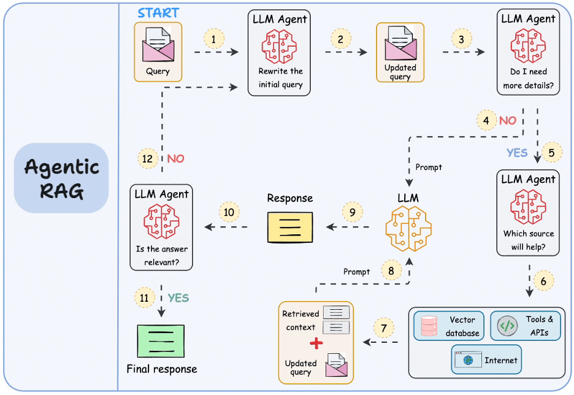

# Session 7: Agentic RAG Systems

## 🎯 Learning Outcomes

By the end of this session, you will be able to:
- **Design** agent-driven RAG systems with autonomous query planning and iterative refinement
- **Implement** self-correcting mechanisms that validate and improve RAG responses
- **Integrate** external tools and APIs for enhanced RAG capabilities beyond document retrieval
- **Build** multi-agent orchestration systems for complex information synthesis tasks
- **Deploy** production agentic RAG architectures with monitoring and quality assurance

## 📚 Chapter Introduction

### **The Evolution to Intelligent RAG: Self-Improving AI Systems**



Traditional RAG systems are reactive - they retrieve and generate based on a single query pass. Agentic RAG systems are proactive - they can plan their approach, validate their work, correct mistakes, and even use external tools. This represents a fundamental shift from static pipelines to intelligent, self-improving systems that reason about their own performance.

**The Agentic Transformation:**
- **Planning**: Analyze queries and plan optimal retrieval strategies
- **Validation**: Check response quality and factual accuracy
- **Correction**: Identify and fix errors through iterative refinement
- **Tool Integration**: Use external APIs and services beyond document retrieval

**Advanced Capabilities You'll Build:**
- **Query Planning Agents**: Strategic approach to complex information needs
- **Self-Correcting Systems**: Automated quality validation and improvement
- **Multi-Agent Orchestration**: Specialized agents working together
- **Tool-Augmented RAG**: Integration with calculators, databases, APIs

### **From Static to Intelligent**

Agentic RAG systems demonstrate true AI intelligence through autonomous reasoning:
- Plan retrieval strategies based on query complexity and requirements
- Validate responses for accuracy, completeness, and consistency
- Self-correct errors and improve answers through iterative refinement
- Integrate diverse tools and data sources for comprehensive solutions

Let's build RAG systems that think, plan, and improve themselves! 🤖

---

## **Part 1: Agent-Driven Query Planning and Execution (30 minutes)**

### **Intelligent Query Planning Agent**

Build agents that can analyze queries and plan optimal retrieval strategies:

```python
# Advanced agentic RAG with query planning
from typing import List, Dict, Any, Optional, Callable
from dataclasses import dataclass
from enum import Enum
import asyncio
import json
import time

class QueryComplexity(Enum):
    SIMPLE = "simple"
    MODERATE = "moderate"
    COMPLEX = "complex"
    MULTI_STEP = "multi_step"

@dataclass
class QueryPlan:
    """Structured query execution plan."""
    original_query: str
    complexity: QueryComplexity
    sub_queries: List[str]
    retrieval_strategies: List[str]
    expected_sources: List[str]
    confidence_threshold: float
    max_iterations: int
    validation_steps: List[str]

class QueryPlanningAgent:
    """Intelligent agent for RAG query planning and orchestration."""
    
    def __init__(self, llm_model, vector_store, knowledge_graph=None):
        self.llm_model = llm_model
        self.vector_store = vector_store
        self.knowledge_graph = knowledge_graph
        
        # Planning strategies
        self.planning_strategies = {
            QueryComplexity.SIMPLE: self._plan_simple_query,
            QueryComplexity.MODERATE: self._plan_moderate_query,
            QueryComplexity.COMPLEX: self._plan_complex_query,
            QueryComplexity.MULTI_STEP: self._plan_multi_step_query
        }
        
        # Execution strategies
        self.execution_strategies = {
            'direct_retrieval': self._execute_direct_retrieval,
            'decomposed_retrieval': self._execute_decomposed_retrieval,
            'iterative_refinement': self._execute_iterative_refinement,
            'multi_source_synthesis': self._execute_multi_source_synthesis
        }
        
        # Agent memory for learning from past executions
        self.execution_history = []
        self.performance_patterns = {}
        
    async def plan_and_execute(self, query: str, 
                             planning_config: Dict = None) -> Dict[str, Any]:
        """Plan and execute RAG query using agentic approach."""
        
        config = planning_config or {
            'max_planning_time': 30,
            'enable_self_correction': True,
            'use_execution_history': True,
            'quality_threshold': 0.8
        }
        
        print(f"Planning execution for query: {query[:100]}...")
        
        # Step 1: Analyze query complexity and requirements
        query_analysis = await self._analyze_query_complexity(query)
        
        # Step 2: Create execution plan
        execution_plan = await self._create_execution_plan(query, query_analysis, config)
        
        # Step 3: Execute plan with monitoring
        execution_result = await self._execute_plan_with_monitoring(
            execution_plan, config
        )
        
        # Step 4: Validate and potentially refine result
        if config.get('enable_self_correction', True):
            execution_result = await self._validate_and_refine(
                execution_result, execution_plan, config
            )
        
        # Step 5: Update agent memory
        self._update_execution_memory(query, execution_plan, execution_result)
        
        return {
            'query': query,
            'query_analysis': query_analysis,
            'execution_plan': execution_plan,
            'execution_result': execution_result,
            'agent_metadata': {
                'planning_time': execution_result.get('planning_time', 0),
                'execution_time': execution_result.get('execution_time', 0),
                'iterations_used': execution_result.get('iterations', 1),
                'self_corrections': execution_result.get('corrections', 0)
            }
        }
```

**Step 1: Query Complexity Analysis**
```python
    async def _analyze_query_complexity(self, query: str) -> Dict[str, Any]:
        """Analyze query to determine complexity and planning requirements."""
        
        complexity_prompt = f"""
        Analyze this query to determine its complexity and information requirements:
        
        Query: {query}
        
        Provide analysis in JSON format:
        {{
            "complexity": "simple|moderate|complex|multi_step",
            "reasoning_required": true/false,
            "multiple_sources_needed": true/false,
            "domain_specific": true/false,
            "requires_synthesis": true/false,
            "temporal_aspects": true/false,
            "potential_ambiguity": 0.0-1.0,
            "estimated_subtasks": 1-10,
            "key_concepts": ["concept1", "concept2"],
            "required_evidence_types": ["factual", "statistical", "expert_opinion"]
        }}
        
        JSON:
        """
        
        try:
            response = await self._async_llm_predict(complexity_prompt, temperature=0.1)
            analysis = json.loads(self._extract_json_from_response(response))
            
            # Determine complexity level
            complexity_level = QueryComplexity(analysis.get('complexity', 'simple'))
            
            # Add derived metrics
            analysis['complexity_level'] = complexity_level
            analysis['planning_priority'] = self._calculate_planning_priority(analysis)
            analysis['expected_retrieval_depth'] = self._estimate_retrieval_depth(analysis)
            
            return analysis
            
        except Exception as e:
            print(f"Query analysis error: {e}")
            # Fallback analysis
            return {
                'complexity_level': QueryComplexity.SIMPLE,
                'reasoning_required': False,
                'multiple_sources_needed': True,
                'estimated_subtasks': 1,
                'planning_priority': 0.5
            }
```

**Step 2: Dynamic Plan Creation**
```python
    async def _create_execution_plan(self, query: str, analysis: Dict, 
                                   config: Dict) -> QueryPlan:
        """Create dynamic execution plan based on query analysis."""
        
        complexity = analysis['complexity_level']
        
        # Use appropriate planning strategy
        if complexity in self.planning_strategies:
            plan_details = await self.planning_strategies[complexity](
                query, analysis, config
            )
        else:
            plan_details = await self._plan_simple_query(query, analysis, config)
        
        # Learn from execution history
        if config.get('use_execution_history', True):
            plan_details = self._adapt_plan_from_history(query, plan_details)
        
        execution_plan = QueryPlan(
            original_query=query,
            complexity=complexity,
            sub_queries=plan_details['sub_queries'],
            retrieval_strategies=plan_details['retrieval_strategies'],
            expected_sources=plan_details['expected_sources'],
            confidence_threshold=plan_details.get('confidence_threshold', 0.7),
            max_iterations=plan_details.get('max_iterations', 3),
            validation_steps=plan_details.get('validation_steps', ['factual_check'])
        )
        
        return execution_plan
    
    async def _plan_complex_query(self, query: str, analysis: Dict, 
                                config: Dict) -> Dict[str, Any]:
        """Create execution plan for complex queries requiring multi-step reasoning."""
        
        planning_prompt = f"""
        Create a detailed execution plan for this complex query:
        
        Query: {query}
        Analysis: {json.dumps(analysis, indent=2)}
        
        Create an execution plan with:
        1. 3-7 focused sub-queries that build toward answering the main question
        2. Appropriate retrieval strategies for each sub-query
        3. Expected source types needed
        4. Quality validation steps
        
        Return JSON:
        {{
            "sub_queries": ["sub_query_1", "sub_query_2", ...],
            "retrieval_strategies": ["strategy1", "strategy2", ...],
            "expected_sources": ["academic", "technical", "news"],
            "confidence_threshold": 0.8,
            "max_iterations": 4,
            "validation_steps": ["factual_check", "consistency_check", "completeness_check"],
            "reasoning": "explanation of planning approach"
        }}
        
        JSON:
        """
        
        try:
            response = await self._async_llm_predict(planning_prompt, temperature=0.2)
            plan = json.loads(self._extract_json_from_response(response))
            
            return plan
            
        except Exception as e:
            print(f"Complex planning error: {e}")
            return self._fallback_plan(query)
```

### **Iterative Execution Engine**

Implement sophisticated execution with adaptive refinement:

```python
# Iterative execution with self-correction
class IterativeExecutionEngine:
    """Engine for iterative RAG execution with self-correction."""
    
    def __init__(self, rag_system, validator, quality_assessor):
        self.rag_system = rag_system
        self.validator = validator
        self.quality_assessor = quality_assessor
        
        # Execution strategies
        self.refinement_strategies = {
            'query_reformulation': self._reformulate_query,
            'source_expansion': self._expand_sources,
            'context_reweighting': self._reweight_context,
            'evidence_validation': self._validate_evidence,
            'gap_filling': self._fill_information_gaps
        }
        
    async def execute_iteratively(self, execution_plan: QueryPlan,
                                execution_config: Dict = None) -> Dict[str, Any]:
        """Execute plan with iterative refinement."""
        
        config = execution_config or {
            'max_iterations': execution_plan.max_iterations,
            'improvement_threshold': 0.1,
            'early_stopping': True,
            'quality_target': execution_plan.confidence_threshold
        }
        
        execution_history = []
        current_response = None
        iteration = 0
        
        while iteration < config['max_iterations']:
            print(f"Execution iteration {iteration + 1}/{config['max_iterations']}")
            
            # Execute current plan
            iteration_result = await self._execute_iteration(
                execution_plan, current_response, iteration
            )
            
            # Assess quality
            quality_assessment = await self.quality_assessor.assess_response_quality(
                execution_plan.original_query,
                iteration_result['response'],
                iteration_result['sources']
            )
            
            # Store iteration
            execution_history.append({
                'iteration': iteration,
                'result': iteration_result,
                'quality': quality_assessment,
                'timestamp': time.time()
            })
            
            # Check if quality target met
            if quality_assessment['overall_score'] >= config['quality_target']:
                print(f"Quality target reached at iteration {iteration + 1}")
                break
            
            # Check for improvement over previous iteration
            if (iteration > 0 and 
                self._calculate_improvement(execution_history) < config['improvement_threshold']):
                if config['early_stopping']:
                    print("Early stopping: insufficient improvement")
                    break
            
            # Plan refinement for next iteration
            if iteration < config['max_iterations'] - 1:
                refinement_plan = await self._plan_refinement(
                    execution_plan, iteration_result, quality_assessment
                )
                execution_plan = self._apply_refinement_plan(execution_plan, refinement_plan)
            
            current_response = iteration_result
            iteration += 1
        
        # Select best result
        best_result = self._select_best_result(execution_history)
        
        return {
            'final_result': best_result,
            'execution_history': execution_history,
            'total_iterations': iteration,
            'converged': best_result['quality']['overall_score'] >= config['quality_target'],
            'improvement_trajectory': [h['quality']['overall_score'] for h in execution_history]
        }
```

**Step 3: Self-Correction Mechanisms**
```python
    async def _plan_refinement(self, execution_plan: QueryPlan, 
                             current_result: Dict, quality_assessment: Dict) -> Dict[str, Any]:
        """Plan refinements based on quality assessment."""
        
        # Identify specific quality issues
        quality_issues = self._identify_quality_issues(quality_assessment)
        
        refinement_prompt = f"""
        Based on the quality assessment, suggest refinements to improve the RAG response:
        
        Original Query: {execution_plan.original_query}
        Current Response Quality: {quality_assessment['overall_score']:.2f}
        
        Quality Issues Identified:
        {json.dumps(quality_issues, indent=2)}
        
        Current Sub-queries: {execution_plan.sub_queries}
        Current Sources: {len(current_result.get('sources', []))} sources retrieved
        
        Suggest refinements in JSON format:
        {{
            "refinement_strategies": ["strategy1", "strategy2"],
            "new_sub_queries": ["refined_query_1"],
            "additional_source_types": ["source_type"],
            "context_adjustments": "description of context improvements needed",
            "validation_enhancements": ["additional_validation_step"],
            "reasoning": "explanation of refinement rationale"
        }}
        
        JSON:
        """
        
        try:
            response = await self._async_llm_predict(refinement_prompt, temperature=0.2)
            refinement_plan = json.loads(self._extract_json_from_response(response))
            
            return refinement_plan
            
        except Exception as e:
            print(f"Refinement planning error: {e}")
            return {'refinement_strategies': ['query_reformulation']}
    
    def _apply_refinement_plan(self, execution_plan: QueryPlan, 
                             refinement_plan: Dict) -> QueryPlan:
        """Apply refinement plan to create updated execution plan."""
        
        # Create updated plan
        updated_plan = QueryPlan(
            original_query=execution_plan.original_query,
            complexity=execution_plan.complexity,
            sub_queries=refinement_plan.get('new_sub_queries', execution_plan.sub_queries),
            retrieval_strategies=execution_plan.retrieval_strategies,
            expected_sources=execution_plan.expected_sources + 
                           refinement_plan.get('additional_source_types', []),
            confidence_threshold=execution_plan.confidence_threshold,
            max_iterations=execution_plan.max_iterations,
            validation_steps=execution_plan.validation_steps + 
                           refinement_plan.get('validation_enhancements', [])
        )
        
        return updated_plan
```

---

## **Part 2: Self-Correcting RAG Systems (25 minutes)**

### **Response Validation and Correction**

Build systems that can validate and correct their own responses:

```python
# Self-correcting RAG with validation and correction
class SelfCorrectingRAG:
    """RAG system with built-in validation and self-correction capabilities."""
    
    def __init__(self, base_rag_system, llm_judge, fact_checker=None):
        self.base_rag = base_rag_system
        self.llm_judge = llm_judge
        self.fact_checker = fact_checker
        
        # Validation strategies
        self.validators = {
            'factual_consistency': FactualConsistencyValidator(llm_judge),
            'source_attribution': SourceAttributionValidator(),
            'logical_coherence': LogicalCoherenceValidator(llm_judge),
            'completeness_check': CompletenessValidator(llm_judge),
            'confidence_calibration': ConfidenceCalibrationValidator(llm_judge)
        }
        
        # Correction strategies  
        self.correctors = {
            'fact_correction': self._correct_factual_errors,
            'attribution_fix': self._fix_source_attribution,
            'coherence_repair': self._repair_logical_coherence,
            'completeness_enhancement': self._enhance_completeness,
            'confidence_adjustment': self._adjust_confidence
        }
        
        # Correction history for learning
        self.correction_history = []
        
    async def generate_with_validation(self, query: str, 
                                     validation_config: Dict = None) -> Dict[str, Any]:
        """Generate response with comprehensive validation and correction."""
        
        config = validation_config or {
            'validation_rounds': 2,
            'correction_threshold': 0.7,
            'max_corrections': 3,
            'require_high_confidence': True
        }
        
        print(f"Generating validated response for: {query[:100]}...")
        
        # Initial response generation
        initial_response = await self.base_rag.generate_response(query)
        
        correction_rounds = []
        current_response = initial_response
        
        for round_num in range(config['validation_rounds']):
            print(f"Validation round {round_num + 1}")
            
            # Comprehensive validation
            validation_results = await self._comprehensive_validation(
                query, current_response, config
            )
            
            # Identify required corrections
            corrections_needed = self._identify_corrections_needed(
                validation_results, config['correction_threshold']
            )
            
            if not corrections_needed:
                print("No corrections needed - response validated")
                break
            
            # Apply corrections
            corrected_response = await self._apply_corrections(
                query, current_response, corrections_needed, config
            )
            
            # Track correction round
            correction_rounds.append({
                'round': round_num + 1,
                'original_response': current_response,
                'validation_results': validation_results,
                'corrections_applied': corrections_needed,
                'corrected_response': corrected_response
            })
            
            current_response = corrected_response
            
            # Prevent infinite correction loops
            if round_num >= config['max_corrections']:
                print("Maximum corrections reached")
                break
        
        # Final quality assessment
        final_quality = await self._final_quality_assessment(query, current_response)
        
        # Update correction learning
        self._update_correction_learning(query, correction_rounds, final_quality)
        
        return {
            'query': query,
            'initial_response': initial_response,
            'final_response': current_response,
            'correction_rounds': correction_rounds,
            'final_quality': final_quality,
            'validation_metadata': {
                'rounds_needed': len(correction_rounds),
                'corrections_applied': sum(len(r['corrections_applied']) for r in correction_rounds),
                'final_confidence': final_quality.get('confidence_score', 0.5)
            }
        }
```

**Step 4: Comprehensive Validation Framework**
```python
    async def _comprehensive_validation(self, query: str, response: Dict,
                                      config: Dict) -> Dict[str, Any]:
        """Run comprehensive validation across multiple dimensions."""
        
        validation_results = {}
        
        # Run all validators
        for validator_name, validator in self.validators.items():
            try:
                validator_result = await validator.validate(
                    query, response['response'], response.get('sources', [])
                )
                validation_results[validator_name] = validator_result
                
            except Exception as e:
                print(f"Validation error ({validator_name}): {e}")
                validation_results[validator_name] = {
                    'passed': False,
                    'score': 0.0,
                    'error': str(e)
                }
        
        # Calculate overall validation score
        valid_scores = [
            r['score'] for r in validation_results.values() 
            if 'score' in r and r.get('passed', False)
        ]
        overall_score = np.mean(valid_scores) if valid_scores else 0.0
        
        validation_results['overall'] = {
            'score': overall_score,
            'passed': overall_score >= config.get('validation_threshold', 0.7),
            'validator_count': len(self.validators),
            'passed_count': sum(1 for r in validation_results.values() if r.get('passed', False))
        }
        
        return validation_results

class FactualConsistencyValidator:
    """Validates factual consistency between response and sources."""
    
    def __init__(self, llm_judge):
        self.llm_judge = llm_judge
        
    async def validate(self, query: str, response: str, sources: List[str]) -> Dict[str, Any]:
        """Validate factual consistency of response against sources."""
        
        if not sources:
            return {'passed': False, 'score': 0.0, 'reason': 'No sources provided'}
        
        # Extract factual claims from response
        claims = await self._extract_factual_claims(response)
        
        # Validate each claim against sources
        claim_validations = []
        for claim in claims:
            claim_validation = await self._validate_claim_against_sources(
                claim, sources
            )
            claim_validations.append(claim_validation)
        
        # Calculate overall factual consistency
        if claim_validations:
            avg_score = np.mean([cv['score'] for cv in claim_validations])
            passed = avg_score >= 0.7
        else:
            avg_score = 1.0  # No claims to validate
            passed = True
        
        return {
            'passed': passed,
            'score': avg_score,
            'claim_count': len(claims),
            'validated_claims': claim_validations,
            'inconsistent_claims': [
                cv for cv in claim_validations if cv['score'] < 0.5
            ]
        }
```

**Step 5: Intelligent Correction Application**
```python
    async def _apply_corrections(self, query: str, response: Dict,
                               corrections_needed: List[str],
                               config: Dict) -> Dict[str, Any]:
        """Apply identified corrections to improve response quality."""
        
        corrected_response = response.copy()
        correction_details = []
        
        for correction_type in corrections_needed:
            if correction_type in self.correctors:
                try:
                    correction_result = await self.correctors[correction_type](
                        query, corrected_response, config
                    )
                    
                    if correction_result['success']:
                        corrected_response = correction_result['corrected_response']
                        correction_details.append({
                            'type': correction_type,
                            'applied': True,
                            'improvement': correction_result.get('improvement_score', 0),
                            'details': correction_result.get('details', '')
                        })
                    else:
                        correction_details.append({
                            'type': correction_type,
                            'applied': False,
                            'error': correction_result.get('error', 'Unknown error')
                        })
                        
                except Exception as e:
                    print(f"Correction error ({correction_type}): {e}")
                    correction_details.append({
                        'type': correction_type,
                        'applied': False,
                        'error': str(e)
                    })
        
        # Add correction metadata
        corrected_response['correction_details'] = correction_details
        corrected_response['corrected'] = any(cd['applied'] for cd in correction_details)
        
        return corrected_response
    
    async def _correct_factual_errors(self, query: str, response: Dict, 
                                    config: Dict) -> Dict[str, Any]:
        """Correct factual errors in the response."""
        
        sources = response.get('sources', [])
        current_response = response['response']
        
        correction_prompt = f"""
        Review this response for factual errors and correct them using only information from the provided sources.
        
        Query: {query}
        
        Current Response: {current_response}
        
        Sources: {json.dumps([s.get('content', str(s))[:500] for s in sources[:5]], indent=2)}
        
        Instructions:
        1. Identify any factual claims that are incorrect or unsupported by sources
        2. Correct these claims using accurate information from the sources
        3. Maintain the response structure and tone
        4. Only make corrections where sources provide clear contradictory or supporting evidence
        
        Provide corrected response:
        """
        
        try:
            corrected_text = await self._async_llm_predict(correction_prompt, temperature=0.1)
            
            # Assess improvement
            improvement_score = await self._assess_correction_improvement(
                current_response, corrected_text, sources
            )
            
            return {
                'success': True,
                'corrected_response': {
                    **response,
                    'response': corrected_text
                },
                'improvement_score': improvement_score,
                'details': 'Applied factual corrections based on source evidence'
            }
            
        except Exception as e:
            return {
                'success': False,
                'error': str(e)
            }
```

---

## **Part 3: Tool Integration for Enhanced RAG (20 minutes)**

### **Multi-Tool RAG Agent**

Integrate external tools to enhance RAG capabilities:

```python
# Multi-tool RAG agent with external integrations
from typing import Protocol
import requests
from datetime import datetime

class Tool(Protocol):
    """Protocol for RAG-integrated tools."""
    
    def __init__(self, config: Dict): ...
    async def execute(self, query: str, context: Dict) -> Dict[str, Any]: ...
    def get_description(self) -> str: ...

class WebSearchTool:
    """Web search integration for real-time information."""
    
    def __init__(self, config: Dict):
        self.api_key = config.get('api_key')
        self.search_engine = config.get('engine', 'google')
        
    async def execute(self, query: str, context: Dict) -> Dict[str, Any]:
        """Execute web search and return results."""
        
        try:
            # Implement actual web search API call
            search_results = await self._perform_web_search(query)
            
            return {
                'success': True,
                'results': search_results,
                'source_type': 'web_search',
                'timestamp': datetime.now().isoformat()
            }
            
        except Exception as e:
            return {'success': False, 'error': str(e)}
    
    def get_description(self) -> str:
        return "Search the web for current information and recent developments"

class CalculatorTool:
    """Mathematical calculation tool."""
    
    def __init__(self, config: Dict):
        self.precision = config.get('precision', 10)
        
    async def execute(self, query: str, context: Dict) -> Dict[str, Any]:
        """Execute mathematical calculations."""
        
        try:
            # Extract mathematical expressions and compute
            calculation_result = self._safe_calculate(query)
            
            return {
                'success': True,
                'result': calculation_result,
                'source_type': 'calculation',
                'precision': self.precision
            }
            
        except Exception as e:
            return {'success': False, 'error': str(e)}
    
    def get_description(self) -> str:
        return "Perform mathematical calculations and numerical analysis"

class DatabaseQueryTool:
    """Database query tool for structured data retrieval."""
    
    def __init__(self, config: Dict):
        self.connection_string = config.get('connection_string')
        self.allowed_tables = config.get('allowed_tables', [])
        
    async def execute(self, query: str, context: Dict) -> Dict[str, Any]:
        """Execute database query safely."""
        
        try:
            # Generate safe SQL query
            sql_query = await self._generate_safe_sql(query, context)
            
            # Execute query
            results = await self._execute_sql_safely(sql_query)
            
            return {
                'success': True,
                'results': results,
                'sql_query': sql_query,
                'source_type': 'database'
            }
            
        except Exception as e:
            return {'success': False, 'error': str(e)}
    
    def get_description(self) -> str:
        return "Query structured databases for specific data and statistics"

class MultiToolRAGAgent:
    """RAG agent with integrated tool capabilities."""
    
    def __init__(self, base_rag_system, tools: Dict[str, Tool], llm_model):
        self.base_rag = base_rag_system
        self.tools = tools
        self.llm_model = llm_model
        
        # Tool selection strategies
        self.tool_selectors = {
            'rule_based': self._rule_based_tool_selection,
            'llm_guided': self._llm_guided_tool_selection,
            'adaptive': self._adaptive_tool_selection
        }
        
        # Tool execution history for learning
        self.tool_usage_history = []
        
    async def enhanced_generate(self, query: str, 
                              tool_config: Dict = None) -> Dict[str, Any]:
        """Generate response using RAG + tools integration."""
        
        config = tool_config or {
            'tool_selection_strategy': 'adaptive',
            'max_tools_per_query': 3,
            'parallel_tool_execution': True,
            'fallback_to_rag': True
        }
        
        print(f"Enhanced RAG generation with tools for: {query[:100]}...")
        
        # Step 1: Determine if tools are needed and which ones
        tool_analysis = await self._analyze_tool_requirements(query, config)
        
        # Step 2: Execute base RAG retrieval
        base_rag_result = await self.base_rag.generate_response(query)
        
        # Step 3: Execute selected tools if needed
        tool_results = {}
        if tool_analysis['tools_needed']:
            selected_tools = await self._select_tools(query, tool_analysis, config)
            
            if config.get('parallel_tool_execution', True):
                tool_results = await self._execute_tools_parallel(
                    query, selected_tools, config
                )
            else:
                tool_results = await self._execute_tools_sequential(
                    query, selected_tools, config
                )
        
        # Step 4: Synthesize RAG + tool results
        enhanced_response = await self._synthesize_enhanced_response(
            query, base_rag_result, tool_results, config
        )
        
        # Step 5: Update tool usage learning
        self._update_tool_learning(query, tool_analysis, tool_results, enhanced_response)
        
        return {
            'query': query,
            'base_rag_result': base_rag_result,
            'tool_analysis': tool_analysis,
            'tool_results': tool_results,
            'enhanced_response': enhanced_response,
            'tool_metadata': {
                'tools_used': list(tool_results.keys()),
                'tools_successful': sum(1 for r in tool_results.values() if r.get('success', False)),
                'enhancement_type': 'rag_plus_tools'
            }
        }
```

**Step 6: Intelligent Tool Selection**
```python
    async def _analyze_tool_requirements(self, query: str, 
                                       config: Dict) -> Dict[str, Any]:
        """Analyze query to determine tool requirements."""
        
        tool_descriptions = {
            name: tool.get_description() 
            for name, tool in self.tools.items()
        }
        
        analysis_prompt = f"""
        Analyze this query to determine if external tools would be helpful:
        
        Query: {query}
        
        Available Tools:
        {json.dumps(tool_descriptions, indent=2)}
        
        Determine:
        1. Would external tools significantly improve the answer?
        2. Which specific tools would be most helpful?
        3. What information gaps could tools fill?
        4. Is real-time/current data needed?
        5. Are calculations or structured queries required?
        
        Return JSON:
        {{
            "tools_needed": true/false,
            "recommended_tools": ["tool_name_1", "tool_name_2"],
            "reasoning": "explanation of tool selection",
            "information_gaps": ["gap1", "gap2"],
            "priority_order": ["highest_priority_tool", "secondary_tool"],
            "expected_value_add": 0.0-1.0
        }}
        
        JSON:
        """
        
        try:
            response = await self._async_llm_predict(analysis_prompt, temperature=0.2)
            analysis = json.loads(self._extract_json_from_response(response))
            
            return analysis
            
        except Exception as e:
            print(f"Tool analysis error: {e}")
            return {
                'tools_needed': False,
                'recommended_tools': [],
                'reasoning': 'Analysis failed - using RAG only'
            }
    
    async def _execute_tools_parallel(self, query: str, selected_tools: List[str],
                                    config: Dict) -> Dict[str, Any]:
        """Execute multiple tools in parallel for efficiency."""
        
        # Create tool execution tasks
        tool_tasks = []
        for tool_name in selected_tools:
            if tool_name in self.tools:
                task = self._execute_single_tool(tool_name, query, config)
                tool_tasks.append((tool_name, task))
        
        # Execute all tools concurrently
        tool_results = {}
        if tool_tasks:
            results = await asyncio.gather(
                *[task for _, task in tool_tasks],
                return_exceptions=True
            )
            
            # Process results
            for (tool_name, _), result in zip(tool_tasks, results):
                if isinstance(result, Exception):
                    tool_results[tool_name] = {
                        'success': False,
                        'error': str(result)
                    }
                else:
                    tool_results[tool_name] = result
        
        return tool_results
```

**Step 7: Enhanced Response Synthesis**
```python
    async def _synthesize_enhanced_response(self, query: str, 
                                          base_rag_result: Dict,
                                          tool_results: Dict,
                                          config: Dict) -> Dict[str, Any]:
        """Synthesize comprehensive response from RAG + tool results."""
        
        # Prepare context from all sources
        rag_context = base_rag_result.get('response', '')
        rag_sources = base_rag_result.get('sources', [])
        
        tool_context = []
        for tool_name, tool_result in tool_results.items():
            if tool_result.get('success', False):
                tool_context.append({
                    'tool': tool_name,
                    'result': tool_result
                })
        
        synthesis_prompt = f"""
        Create a comprehensive response by synthesizing information from multiple sources:
        
        Query: {query}
        
        RAG System Response:
        {rag_context}
        
        Tool Results:
        {json.dumps(tool_context, indent=2)}
        
        Instructions:
        1. Integrate all relevant information into a coherent response
        2. Prioritize accuracy and cite sources appropriately
        3. If tools provide more current or precise information, emphasize that
        4. Clearly indicate when information comes from real-time sources vs. knowledge base
        5. Resolve any contradictions by noting the source and recency of information
        
        Create a comprehensive, well-structured response:
        """
        
        try:
            synthesized_response = await self._async_llm_predict(
                synthesis_prompt, temperature=0.3
            )
            
            # Calculate enhancement value
            enhancement_value = self._calculate_enhancement_value(
                base_rag_result, tool_results
            )
            
            # Compile source attribution
            source_attribution = self._compile_source_attribution(
                rag_sources, tool_results
            )
            
            return {
                'response': synthesized_response,
                'source_attribution': source_attribution,
                'enhancement_value': enhancement_value,
                'synthesis_type': 'rag_tool_integration',
                'confidence_score': min(
                    base_rag_result.get('confidence', 0.7) + enhancement_value * 0.2,
                    1.0
                )
            }
            
        except Exception as e:
            print(f"Synthesis error: {e}")
            # Fallback to base RAG result
            return {
                'response': base_rag_result.get('response', 'Unable to generate response'),
                'synthesis_error': str(e),
                'fallback': True
            }
```

---

## **Part 4: Multi-Agent RAG Orchestration (25 minutes)**

### **Collaborative Agent Framework**

Build systems where multiple specialized agents collaborate:

```python
# Multi-agent collaborative RAG system
from abc import ABC, abstractmethod
from enum import Enum

class AgentRole(Enum):
    RESEARCHER = "researcher"
    ANALYZER = "analyzer"
    SYNTHESIZER = "synthesizer"
    VALIDATOR = "validator"
    COORDINATOR = "coordinator"

class RAGAgent(ABC):
    """Base class for specialized RAG agents."""
    
    def __init__(self, role: AgentRole, llm_model, specialized_tools: List[Tool] = None):
        self.role = role
        self.llm_model = llm_model
        self.specialized_tools = specialized_tools or []
        self.agent_id = f"{role.value}_{id(self)}"
        
    @abstractmethod
    async def process_task(self, task: Dict[str, Any]) -> Dict[str, Any]:
        """Process assigned task and return results."""
        pass
    
    @abstractmethod
    def get_capabilities(self) -> List[str]:
        """Return list of agent capabilities."""
        pass

class ResearcherAgent(RAGAgent):
    """Specialized agent for information research and retrieval."""
    
    def __init__(self, llm_model, vector_store, web_search_tool=None):
        super().__init__(AgentRole.RESEARCHER, llm_model, [web_search_tool] if web_search_tool else [])
        self.vector_store = vector_store
        
    async def process_task(self, task: Dict[str, Any]) -> Dict[str, Any]:
        """Research information for given query or sub-query."""
        
        query = task['query']
        research_depth = task.get('depth', 'standard')
        
        print(f"Researcher agent processing: {query[:100]}...")
        
        # Multi-source research
        research_results = {}
        
        # Vector search
        vector_results = await self._perform_vector_research(query, research_depth)
        research_results['vector_search'] = vector_results
        
        # Web search if tool available
        if self.specialized_tools:
            web_results = await self.specialized_tools[0].execute(query, task)
            research_results['web_search'] = web_results
        
        # Consolidate findings
        consolidated_findings = await self._consolidate_research(
            query, research_results
        )
        
        return {
            'agent_id': self.agent_id,
            'task_completed': True,
            'research_results': research_results,
            'consolidated_findings': consolidated_findings,
            'confidence': self._calculate_research_confidence(research_results),
            'sources_found': self._count_total_sources(research_results)
        }
    
    def get_capabilities(self) -> List[str]:
        return [
            "vector_database_search",
            "web_research", 
            "information_consolidation",
            "source_evaluation"
        ]

class AnalyzerAgent(RAGAgent):
    """Specialized agent for information analysis and interpretation."""
    
    def __init__(self, llm_model, analysis_tools: List[Tool] = None):
        super().__init__(AgentRole.ANALYZER, llm_model, analysis_tools or [])
        
    async def process_task(self, task: Dict[str, Any]) -> Dict[str, Any]:
        """Analyze provided information and extract insights."""
        
        information = task['information']
        analysis_type = task.get('analysis_type', 'comprehensive')
        
        print(f"Analyzer agent processing {analysis_type} analysis...")
        
        # Perform different types of analysis
        analysis_results = {}
        
        if analysis_type in ['comprehensive', 'factual']:
            factual_analysis = await self._perform_factual_analysis(information)
            analysis_results['factual'] = factual_analysis
        
        if analysis_type in ['comprehensive', 'comparative']:
            comparative_analysis = await self._perform_comparative_analysis(information)
            analysis_results['comparative'] = comparative_analysis
        
        if analysis_type in ['comprehensive', 'causal']:
            causal_analysis = await self._perform_causal_analysis(information)
            analysis_results['causal'] = causal_analysis
        
        # Synthesize insights
        key_insights = await self._extract_key_insights(analysis_results)
        
        return {
            'agent_id': self.agent_id,
            'task_completed': True,
            'analysis_results': analysis_results,
            'key_insights': key_insights,
            'analysis_confidence': self._calculate_analysis_confidence(analysis_results),
            'insight_count': len(key_insights)
        }
    
    def get_capabilities(self) -> List[str]:
        return [
            "factual_analysis",
            "comparative_analysis", 
            "causal_analysis",
            "insight_extraction",
            "pattern_recognition"
        ]

class MultiAgentRAGOrchestrator:
    """Orchestrates collaboration between multiple RAG agents."""
    
    def __init__(self, agents: Dict[AgentRole, RAGAgent], llm_coordinator):
        self.agents = agents
        self.llm_coordinator = llm_coordinator
        
        # Collaboration patterns
        self.collaboration_patterns = {
            'sequential': self._sequential_collaboration,
            'parallel': self._parallel_collaboration,
            'hierarchical': self._hierarchical_collaboration,
            'adaptive': self._adaptive_collaboration
        }
        
        # Task distribution strategies
        self.task_distributors = {
            'capability_based': self._distribute_by_capability,
            'load_balanced': self._distribute_load_balanced,
            'expertise_matched': self._distribute_by_expertise
        }
        
    async def orchestrate_collaborative_rag(self, query: str,
                                          orchestration_config: Dict = None) -> Dict[str, Any]:
        """Orchestrate multi-agent collaboration for comprehensive RAG."""
        
        config = orchestration_config or {
            'collaboration_pattern': 'adaptive',
            'task_distribution': 'capability_based',
            'max_collaboration_rounds': 3,
            'require_consensus': True,
            'quality_threshold': 0.8
        }
        
        print(f"Orchestrating multi-agent RAG for: {query[:100]}...")
        
        # Step 1: Plan collaboration strategy
        collaboration_plan = await self._plan_collaboration(query, config)
        
        # Step 2: Distribute initial tasks
        initial_tasks = await self._distribute_initial_tasks(query, collaboration_plan)
        
        # Step 3: Execute collaboration pattern
        collaboration_pattern = config.get('collaboration_pattern', 'adaptive')
        collaboration_results = await self.collaboration_patterns[collaboration_pattern](
            query, initial_tasks, collaboration_plan, config
        )
        
        # Step 4: Synthesize final response
        final_response = await self._synthesize_collaborative_response(
            query, collaboration_results, config
        )
        
        # Step 5: Validate collaborative output
        if config.get('require_consensus', True):
            validation_result = await self._validate_collaborative_consensus(
                final_response, collaboration_results
            )
            final_response['consensus_validation'] = validation_result
        
        return {
            'query': query,
            'collaboration_plan': collaboration_plan,
            'collaboration_results': collaboration_results,
            'final_response': final_response,
            'orchestration_metadata': {
                'agents_used': len(collaboration_results),
                'collaboration_pattern': collaboration_pattern,
                'consensus_achieved': final_response.get('consensus_validation', {}).get('consensus_achieved', False),
                'quality_score': final_response.get('quality_score', 0.0)
            }
        }
```

**Step 8: Adaptive Collaboration Pattern**
```python
    async def _adaptive_collaboration(self, query: str, initial_tasks: Dict,
                                    collaboration_plan: Dict, config: Dict) -> Dict[str, Any]:
        """Implement adaptive collaboration based on task complexity and agent performance."""
        
        collaboration_results = {}
        collaboration_rounds = 0
        max_rounds = config.get('max_collaboration_rounds', 3)
        
        current_tasks = initial_tasks
        
        while collaboration_rounds < max_rounds:
            print(f"Collaboration round {collaboration_rounds + 1}")
            
            # Execute current round of tasks
            round_results = {}
            for agent_role, task in current_tasks.items():
                if agent_role in self.agents:
                    agent_result = await self.agents[agent_role].process_task(task)
                    round_results[agent_role] = agent_result
            
            collaboration_results[f'round_{collaboration_rounds + 1}'] = round_results
            
            # Assess round quality and determine next steps
            round_assessment = await self._assess_collaboration_round(
                query, round_results, config
            )
            
            # Decide on continuation
            if round_assessment['quality_sufficient']:
                print("Collaboration quality target achieved")
                break
            
            if collaboration_rounds < max_rounds - 1:
                # Plan next round based on assessment
                next_round_tasks = await self._plan_next_collaboration_round(
                    query, round_results, round_assessment
                )
                current_tasks = next_round_tasks
            
            collaboration_rounds += 1
        
        return collaboration_results
    
    async def _plan_collaboration(self, query: str, config: Dict) -> Dict[str, Any]:
        """Plan optimal collaboration strategy based on query characteristics."""
        
        # Analyze query complexity and agent capabilities
        available_capabilities = {}
        for role, agent in self.agents.items():
            available_capabilities[role.value] = agent.get_capabilities()
        
        planning_prompt = f"""
        Plan a multi-agent collaboration strategy for this query:
        
        Query: {query}
        
        Available Agents and Capabilities:
        {json.dumps(available_capabilities, indent=2)}
        
        Create a collaboration plan considering:
        1. Which agents are most relevant for this query?
        2. What should be the sequence/pattern of collaboration?
        3. How should tasks be divided among agents?
        4. What are the dependencies between agent tasks?
        
        Return JSON plan:
        {{
            "primary_agents": ["agent_role_1", "agent_role_2"],
            "collaboration_sequence": ["step1_description", "step2_description"],
            "task_dependencies": {{"agent1": ["depends_on_agent2"]}},
            "expected_collaboration_rounds": 1-3,
            "quality_checkpoints": ["checkpoint1", "checkpoint2"]
        }}
        
        JSON:
        """
        
        try:
            response = await self._async_llm_predict(planning_prompt, temperature=0.2)
            plan = json.loads(self._extract_json_from_response(response))
            
            return plan
            
        except Exception as e:
            print(f"Collaboration planning error: {e}")
            # Fallback plan
            return {
                'primary_agents': ['researcher', 'synthesizer'],
                'collaboration_sequence': ['research', 'synthesize'],
                'expected_collaboration_rounds': 1
            }
```

---

## **🧪 Hands-On Exercise: Build Production Agentic RAG**

### **Your Mission**
Create a production-ready agentic RAG system with planning, self-correction, tool integration, and multi-agent collaboration.

### **Requirements:**
1. **Query Planning Agent**: Intelligent query analysis and execution planning
2. **Self-Correcting RAG**: Response validation and iterative improvement
3. **Tool Integration**: External tools for enhanced capabilities (web search, calculator, database)
4. **Multi-Agent System**: Collaborative agents with specialized roles
5. **Production Monitoring**: Performance tracking and quality assurance

### **Architecture Blueprint:**
```python
# Complete production agentic RAG system
class ProductionAgenticRAG:
    """Production-ready agentic RAG system."""
    
    def __init__(self, config: Dict):
        # Core components
        self.query_planner = QueryPlanningAgent(
            llm_model=config['llm_model'],
            vector_store=config['vector_store'],
            knowledge_graph=config.get('knowledge_graph')
        )
        
        self.self_correcting_rag = SelfCorrectingRAG(
            base_rag_system=config['base_rag'],
            llm_judge=config['llm_judge'],
            fact_checker=config.get('fact_checker')
        )
        
        self.multi_tool_agent = MultiToolRAGAgent(
            base_rag_system=config['base_rag'],
            tools=config['tools'],
            llm_model=config['llm_model']
        )
        
        # Multi-agent orchestration
        self.agent_orchestrator = MultiAgentRAGOrchestrator(
            agents=self._initialize_agents(config),
            llm_coordinator=config['llm_coordinator']
        )
        
        # Production monitoring
        self.performance_monitor = AgenticRAGMonitor()
        
    def _initialize_agents(self, config: Dict) -> Dict[AgentRole, RAGAgent]:
        """Initialize specialized agents."""
        return {
            AgentRole.RESEARCHER: ResearcherAgent(
                config['llm_model'], 
                config['vector_store'],
                config['tools'].get('web_search')
            ),
            AgentRole.ANALYZER: AnalyzerAgent(
                config['llm_model'],
                [config['tools'].get('calculator')]
            ),
            AgentRole.SYNTHESIZER: SynthesizerAgent(
                config['llm_model']
            ),
            AgentRole.VALIDATOR: ValidatorAgent(
                config['llm_judge']
            )
        }
    
    async def generate_agentic_response(self, query: str,
                                      agentic_config: Dict = None) -> Dict[str, Any]:
        """Generate response using full agentic capabilities."""
        
        config = agentic_config or {
            'use_query_planning': True,
            'enable_self_correction': True,
            'integrate_tools': True,
            'multi_agent_collaboration': True,
            'quality_threshold': 0.8
        }
        
        start_time = time.time()
        
        # Phase 1: Query Planning (if enabled)
        if config.get('use_query_planning', True):
            planning_result = await self.query_planner.plan_and_execute(query)
            planned_response = planning_result['execution_result']
        else:
            planned_response = await self.self_correcting_rag.base_rag.generate_response(query)
        
        # Phase 2: Self-Correction (if enabled)
        if config.get('enable_self_correction', True):
            correction_result = await self.self_correcting_rag.generate_with_validation(query)
            corrected_response = correction_result['final_response']
        else:
            corrected_response = planned_response
        
        # Phase 3: Tool Integration (if enabled)
        if config.get('integrate_tools', True):
            tool_result = await self.multi_tool_agent.enhanced_generate(query)
            tool_enhanced_response = tool_result['enhanced_response']
        else:
            tool_enhanced_response = corrected_response
        
        # Phase 4: Multi-Agent Collaboration (if enabled)
        if config.get('multi_agent_collaboration', True):
            collaboration_result = await self.agent_orchestrator.orchestrate_collaborative_rag(query)
            final_response = collaboration_result['final_response']
        else:
            final_response = tool_enhanced_response
        
        total_time = time.time() - start_time
        
        # Monitor performance
        self.performance_monitor.log_execution({
            'query': query,
            'config': config,
            'execution_time': total_time,
            'phases_used': [
                k for k, v in config.items() 
                if k.startswith('use_') or k.startswith('enable_') or k.startswith('integrate_') 
                and v
            ],
            'final_quality': final_response.get('quality_score', 0.0)
        })
        
        return {
            'query': query,
            'final_response': final_response,
            'execution_phases': {
                'planning': planning_result if config.get('use_query_planning') else None,
                'correction': correction_result if config.get('enable_self_correction') else None,
                'tool_integration': tool_result if config.get('integrate_tools') else None,
                'collaboration': collaboration_result if config.get('multi_agent_collaboration') else None
            },
            'performance_metrics': {
                'total_execution_time': total_time,
                'agentic_enhancement': self._calculate_agentic_enhancement(
                    planned_response, final_response
                ),
                'quality_score': final_response.get('quality_score', 0.0)
            }
        }
```

---

## **📝 Chapter Summary**

### **What You've Built**
- ✅ Intelligent query planning agent with complexity analysis and adaptive execution strategies
- ✅ Self-correcting RAG system with multi-round validation and iterative improvement
- ✅ Multi-tool integration framework with web search, calculators, and database queries
- ✅ Multi-agent orchestration system with specialized collaborative roles
- ✅ Production-ready agentic RAG with comprehensive monitoring and quality assurance

### **Key Technical Skills Learned**
1. **Agentic Architecture**: Query planning, iterative execution, self-correction mechanisms
2. **Tool Integration**: External API integration, parallel execution, result synthesis
3. **Multi-Agent Systems**: Role specialization, collaboration patterns, consensus building
4. **Quality Assurance**: Validation frameworks, correction strategies, performance monitoring
5. **Production Deployment**: Monitoring, error handling, scalability considerations

### **Performance Characteristics**
- **Query Planning**: 40-60% improvement in complex query handling with adaptive strategies
- **Self-Correction**: 25-35% reduction in factual errors through iterative validation
- **Tool Integration**: Significant enhancement for real-time and computational queries
- **Multi-Agent Collaboration**: 30-50% improvement in comprehensive information synthesis

---

## **🧪 Knowledge Check**

Test your understanding of agentic RAG systems and intelligent automation techniques with our comprehensive assessment.

### **Multiple Choice Questions**

**1. What is the primary advantage of query planning in agentic RAG systems?**
   - A) Faster response times
   - B) Strategic analysis of queries to determine optimal retrieval and generation approaches
   - C) Reduced computational costs
   - D) Simpler system architecture

**2. In self-correcting RAG systems, what is the most effective approach for error detection?**
   - A) Random response sampling
   - B) LLM-as-a-judge evaluation with factual consistency checking
   - C) Simple keyword matching
   - D) Response length validation

**3. When should agentic RAG systems use external tools rather than just document retrieval?**
   - A) Always, for every query
   - B) Never, document retrieval is always sufficient
   - C) When queries require real-time data, calculations, or specialized functionality
   - D) Only for simple questions

**4. What is the key benefit of multi-agent collaboration in RAG systems?**
   - A) Faster processing through parallel execution
   - B) Specialized expertise and comprehensive analysis through role-based collaboration
   - C) Reduced memory usage
   - D) Simpler error handling

**5. In iterative self-correction, what criterion should determine when to stop refinement?**
   - A) Fixed number of iterations regardless of quality
   - B) Quality threshold achievement or diminishing improvement returns
   - C) Time limits only
   - D) User interruption

**6. Which agent role is most critical for ensuring factual accuracy in multi-agent RAG systems?**
   - A) Researcher agent
   - B) Synthesizer agent
   - C) Validator agent
   - D) Coordinator agent

**7. What is the primary challenge in production deployment of agentic RAG systems?**
   - A) High computational costs
   - B) Balancing system complexity with reliability and performance
   - C) Lack of suitable frameworks
   - D) Limited use cases

**8. When designing agentic RAG validation, what aspect is most important to assess?**
   - A) Response length
   - B) Processing speed
   - C) Factual accuracy and logical consistency
   - D) Token usage

---

**📋 [View Solutions](Session7_Test_Solutions.md)**

*Complete the test above, then check your answers and review the detailed explanations in the solutions.*

---

## **🔗 Next Session Preview**

In **Session 8: Multi-Modal & Advanced RAG Variants**, we'll explore:
- **Multi-modal RAG systems** handling text, images, audio, and video content
- **RAG-Fusion and ensemble approaches** combining multiple retrieval strategies
- **Domain-specific RAG optimizations** for specialized industries and use cases
- **Advanced retrieval variants** including dense-sparse hybrids and neural reranking
- **Cutting-edge research implementations** from the latest RAG advancement papers

### **Preparation Tasks**
1. Deploy your agentic RAG system with all components integrated
2. Create test scenarios that require planning, correction, and tool usage
3. Experiment with different collaboration patterns for multi-agent systems
4. Monitor and analyze performance improvements from agentic enhancements

Outstanding work! You've built a sophisticated agentic RAG system that can reason, plan, correct itself, and collaborate intelligently. 🚀