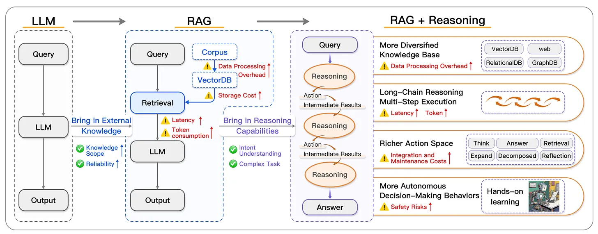

# Session 7: Agentic RAG Systems

## 🎯 Learning Outcomes

By the end of this session, you will be able to:

- **Design** agent-driven RAG systems with autonomous query planning and iterative refinement
- **Implement** self-correcting mechanisms that validate and improve RAG responses
- **Integrate** external tools and APIs for enhanced RAG capabilities beyond document retrieval
- **Build** multi-agent orchestration systems for complex information synthesis tasks
- **Deploy** production agentic RAG architectures with monitoring and quality assurance

## 📚 Chapter Introduction

### **The Evolution to Reasoning-Powered RAG: From Retrieval to Intelligence**


Traditional RAG systems are reactive - they retrieve and generate based on a single query pass. **Reasoning-Augmented RAG systems represent a paradigm shift from passive retrieval to proactive intelligent reasoning systems** that don't just find information, but actively reason about it to construct logically coherent, contextually aware responses.

**The Cognitive Revolution in RAG:**

- **From Information Retrieval → Knowledge Reasoning**: Transform scattered documents into structured logical reasoning
- **From Static Pipelines → Dynamic Intelligence**: Systems that adapt their approach based on reasoning requirements
- **From Reactive Responses → Proactive Analysis**: Anticipate information needs through logical deduction
- **From Document Aggregation → Context Construction**: Build coherent logical frameworks from diverse sources

**The Reasoning-RAG Transformation:**

- **Reasoning-Guided Planning**: Analyze queries through logical reasoning frameworks to plan optimal strategies
- **Chain-of-Thought Integration**: Implement structured reasoning paths that guide retrieval and synthesis
- **Bidirectional Synergy**: "Reasoning-Augmented Retrieval" guides what to find, "Retrieval-Augmented Reasoning" fills logical gaps
- **Cognitive Validation**: Reason about response quality and logical consistency, not just factual accuracy
- **Adaptive Reasoning Workflows**: Dynamic reasoning strategies that evolve based on query complexity and domain requirements

**Advanced Reasoning-Powered Capabilities You'll Build:**

- **Reasoning-Guided Query Planning**: Strategic cognitive analysis that determines optimal reasoning approaches for complex information needs
- **Chain-of-Thought RAG Systems**: Structured reasoning paths that guide both retrieval and synthesis processes
- **Self-Reasoning Validation**: Systems that reason about their own logical consistency and cognitive coherence
- **Multi-Modal Reasoning Integration**: Reasoning that spans text, knowledge graphs, and structured data sources
- **Adaptive Reasoning Workflows**: Dynamic reasoning strategies that evolve from structured control flows to emergent adaptive patterns

### **From Information Aggregation to Logical Reasoning**


Reasoning-Augmented RAG systems demonstrate true cognitive intelligence through autonomous logical reasoning:

- **Cognitive Query Analysis**: Understand not just what is being asked, but the logical reasoning required to construct a comprehensive answer
- **Reasoning-Driven Retrieval**: Use logical frameworks to guide what information to retrieve and how to connect it
- **Chain-of-Thought Synthesis**: Build responses through structured reasoning chains that demonstrate logical progression
- **Meta-Cognitive Validation**: Reason about the reasoning process itself - validate logical consistency, identify reasoning gaps, and strengthen logical connections
- **Adaptive Reasoning Strategies**: Dynamically choose between different reasoning approaches (deductive, inductive, abductive) based on the cognitive requirements

**Three Revolutionary Reasoning Integration Approaches:**

1. **Prompt-Based Reasoning**: Integrate reasoning directly into prompts with structured thinking frameworks
2. **Architecture-Based Reasoning**: Embed reasoning capabilities into the system architecture through specialized reasoning modules
3. **Learning-Based Reasoning**: Train systems to develop reasoning capabilities through reinforcement learning and feedback loops

Let's build RAG systems that don't just retrieve information - they **think, reason, and construct knowledge**! 🧠✨

---

## **Part 0: RAG + Reasoning Integration Foundations (35 minutes)**

### **Understanding the Cognitive Leap: From Retrieval to Reasoning**



The integration of reasoning capabilities into RAG represents a fundamental cognitive evolution. Instead of treating RAG as an information retrieval problem, we approach it as a **knowledge construction and logical reasoning challenge**.

**Traditional RAG Workflow:**

```
Query → Retrieve Documents → Generate Response
```

**Reasoning-Augmented RAG Workflow:**

```
Query → Analyze Reasoning Requirements → Plan Cognitive Strategy →
Reasoning-Guided Retrieval → Chain-of-Thought Synthesis →
Meta-Cognitive Validation → Logically Coherent Response
```

### **The Three Pillars of Reasoning-RAG Integration**

#### **1. Reasoning-Augmented Retrieval (RAR)**

*"Let reasoning guide what information to find and how to connect it"*

```python
# Reasoning-guided retrieval system
class ReasoningAugmentedRetrieval:
    """RAG system where reasoning frameworks guide retrieval strategies."""

    def __init__(self, vector_store, knowledge_graph, reasoning_engine):
        self.vector_store = vector_store
        self.knowledge_graph = knowledge_graph
        self.reasoning_engine = reasoning_engine

        # Reasoning-driven retrieval strategies
        self.reasoning_strategies = {
            'deductive': self._deductive_reasoning_retrieval,
            'inductive': self._inductive_reasoning_retrieval,
            'abductive': self._abductive_reasoning_retrieval,
            'analogical': self._analogical_reasoning_retrieval,
            'causal': self._causal_reasoning_retrieval
        }

    async def reasoning_guided_retrieve(self, query: str,
                                      reasoning_context: Dict = None) -> Dict[str, Any]:
        """Retrieve information using reasoning frameworks to guide the process."""

        # Step 1: Analyze the reasoning requirements of the query
        reasoning_analysis = await self._analyze_reasoning_requirements(query)

        # Step 2: Construct reasoning framework
        reasoning_framework = await self._construct_reasoning_framework(
            query, reasoning_analysis, reasoning_context
        )

        # Step 3: Apply reasoning-guided retrieval
        retrieved_information = await self._apply_reasoning_strategy(
            query, reasoning_framework
        )

        # Step 4: Validate logical connections
        logical_connections = await self._validate_logical_connections(
            retrieved_information, reasoning_framework
        )

        return {
            'query': query,
            'reasoning_analysis': reasoning_analysis,
            'reasoning_framework': reasoning_framework,
            'retrieved_information': retrieved_information,
            'logical_connections': logical_connections,
            'reasoning_type': reasoning_framework.get('primary_reasoning_type')
        }

    async def _analyze_reasoning_requirements(self, query: str) -> Dict[str, Any]:
        """Analyze what type of reasoning is required for this query."""

        reasoning_prompt = f"""
        Analyze this query to determine the reasoning requirements:

        Query: {query}

        Determine:
        1. What type of logical reasoning is needed? (deductive, inductive, abductive, analogical, causal)
        2. What logical connections need to be established?
        3. What evidence types are required for sound reasoning?
        4. What are the potential logical fallacies to avoid?
        5. What reasoning chains would lead to the most complete answer?

        Return JSON:
        {{
            "primary_reasoning_type": "deductive|inductive|abductive|analogical|causal",
            "secondary_reasoning_types": ["type1", "type2"],
            "logical_connections_needed": ["connection_type_1", "connection_type_2"],
            "evidence_requirements": ["factual", "statistical", "expert_opinion", "case_studies"],
            "reasoning_complexity": "simple|moderate|complex|multi_layered",
            "potential_fallacies": ["fallacy_type_1", "fallacy_type_2"],
            "reasoning_chain_depth": 1-5,
            "cognitive_strategy": "description of optimal reasoning approach"
        }}

        JSON:
        """

        response = await self._async_llm_predict(reasoning_prompt, temperature=0.1)
        return self._parse_json_response(response)

    async def _construct_reasoning_framework(self, query: str,
                                           reasoning_analysis: Dict,
                                           context: Dict = None) -> Dict[str, Any]:
        """Construct a structured reasoning framework to guide retrieval."""

        # Step 1: Extract reasoning parameters
        # WHY: Different reasoning types require different logical structures
        primary_reasoning = reasoning_analysis['primary_reasoning_type']
        complexity = reasoning_analysis['reasoning_complexity']

        # Step 2: Build reasoning framework prompt
        # WHY: LLMs need explicit structure to construct proper logical frameworks
        framework_prompt = self._build_framework_prompt(query, reasoning_analysis, primary_reasoning)

        # Step 3: Generate framework structure
        # WHY: Convert natural language reasoning into structured logical components
        response = await self._async_llm_predict(framework_prompt, temperature=0.2)
        framework = self._parse_json_response(response)

        # Step 4: Add framework metadata
        # WHY: Tracking enables framework reuse and performance optimization
        framework = self._add_framework_metadata(framework, primary_reasoning, query)

        return framework

    def _build_framework_prompt(self, query: str, reasoning_analysis: Dict,
                               primary_reasoning: str) -> str:
        """Build the reasoning framework construction prompt.

        WHY: Separating prompt construction makes the logic clearer and enables
        different reasoning types to use specialized prompts in the future.
        """
        return f"""
        Construct a reasoning framework for this query using {primary_reasoning} reasoning:

        Query: {query}
        Reasoning Analysis: {json.dumps(reasoning_analysis, indent=2)}

        Create a structured framework with:
        1. Premises that need to be established through retrieval
        2. Logical steps that connect premises to conclusion
        3. Information gaps that must be filled
        4. Validation checkpoints for logical consistency

        Return JSON:
        {{
            "reasoning_premises": [
                {{"premise": "statement", "evidence_needed": "type", "confidence_required": 0.0-1.0}}
            ],
            "logical_steps": [
                {{"step": 1, "operation": "logical_operation", "inputs": ["premise1"], "output": "intermediate_conclusion"}}
            ],
            "information_gaps": [
                {{"gap": "missing_information", "retrieval_strategy": "how_to_find", "critical": true/false}}
            ],
            "validation_checkpoints": [
                {{"checkpoint": "what_to_validate", "validation_method": "how_to_validate"}}
            ],
            "reasoning_chain": "step-by-step logical progression",
            "success_criteria": "how to determine reasoning completeness"
        }}

        JSON:
        """

    def _add_framework_metadata(self, framework: Dict, primary_reasoning: str,
                               query: str) -> Dict[str, Any]:
        """Add metadata to reasoning framework.

        WHY: Metadata enables framework caching, reuse, and performance analysis.
        Production systems need to track which frameworks work best for different query types.
        """
        framework['framework_id'] = f"{primary_reasoning}_{int(time.time())}"
        framework['created_for_query'] = query
        framework['reasoning_type'] = primary_reasoning

        return framework

    async def _deductive_reasoning_retrieval(self, query: str,
                                           framework: Dict) -> Dict[str, Any]:
        """Implement deductive reasoning retrieval strategy."""

        premises = framework.get('reasoning_premises', [])
        logical_steps = framework.get('logical_steps', [])

        # Step 1: Retrieve information for each premise
        premise_evidence = {}
        for premise_data in premises:
            premise = premise_data['premise']
            evidence_type = premise_data['evidence_needed']

            # Targeted retrieval for this premise
            premise_retrieval = await self._retrieve_for_premise(
                premise, evidence_type, query
            )
            premise_evidence[premise] = premise_retrieval

        # Step 2: Apply deductive logical steps
        logical_progression = []
        for step in logical_steps:
            step_result = await self._apply_logical_step(
                step, premise_evidence, logical_progression
            )
            logical_progression.append(step_result)

        # Step 3: Construct deductive conclusion
        deductive_conclusion = await self._construct_deductive_conclusion(
            premise_evidence, logical_progression, framework
        )

        return {
            'strategy': 'deductive_reasoning',
            'premise_evidence': premise_evidence,
            'logical_progression': logical_progression,
            'deductive_conclusion': deductive_conclusion,
            'confidence_score': self._calculate_deductive_confidence(
                premise_evidence, logical_progression
            )
        }
```

#### **2. Retrieval-Augmented Reasoning (RAR)**

*"Let external knowledge fill logical reasoning gaps"*

```python
class RetrievalAugmentedReasoning:
    """System that uses retrieved information to enhance reasoning capabilities."""

    def __init__(self, retrieval_system, reasoning_engine, knowledge_validator):
        self.retrieval_system = retrieval_system
        self.reasoning_engine = reasoning_engine
        self.knowledge_validator = knowledge_validator

    async def enhanced_reasoning(self, reasoning_query: str,
                                initial_knowledge: Dict = None) -> Dict[str, Any]:
        """Perform reasoning enhanced by targeted information retrieval."""

        # Step 1: Identify reasoning gaps
        reasoning_gaps = await self._identify_reasoning_gaps(
            reasoning_query, initial_knowledge
        )

        # Step 2: Strategically retrieve information to fill gaps
        gap_filling_retrieval = await self._strategic_gap_retrieval(
            reasoning_gaps, reasoning_query
        )

        # Step 3: Integrate retrieved knowledge into reasoning process
        enhanced_reasoning_result = await self._integrate_knowledge_into_reasoning(
            reasoning_query, initial_knowledge, gap_filling_retrieval
        )

        # Step 4: Validate enhanced reasoning
        reasoning_validation = await self._validate_enhanced_reasoning(
            enhanced_reasoning_result, reasoning_query
        )

        return {
            'reasoning_query': reasoning_query,
            'identified_gaps': reasoning_gaps,
            'gap_filling_retrieval': gap_filling_retrieval,
            'enhanced_reasoning': enhanced_reasoning_result,
            'validation_result': reasoning_validation,
            'reasoning_enhancement_score': self._calculate_enhancement_score(
                initial_knowledge, enhanced_reasoning_result
            )
        }

    async def _identify_reasoning_gaps(self, reasoning_query: str,
                                     initial_knowledge: Dict = None) -> Dict[str, Any]:
        """Identify what external knowledge would strengthen reasoning."""

        gap_analysis_prompt = f"""
        Analyze this reasoning query to identify knowledge gaps that external information could fill:

        Reasoning Query: {reasoning_query}
        Initial Knowledge: {json.dumps(initial_knowledge or {}, indent=2)}

        Identify:
        1. Missing factual premises that would strengthen the reasoning
        2. Statistical data that would support logical conclusions
        3. Expert opinions that would validate reasoning steps
        4. Counter-arguments that should be addressed
        5. Historical examples or case studies that would illustrate points

        Return JSON:
        {{
            "critical_gaps": [
                {{"gap": "description", "knowledge_type": "factual|statistical|expert|counter|example", "retrieval_priority": "high|medium|low"}}
            ],
            "reasoning_weaknesses": ["weakness1", "weakness2"],
            "knowledge_reinforcement_opportunities": ["opportunity1", "opportunity2"],
            "potential_counter_arguments": ["counter1", "counter2"],
            "evidence_requirements": {{"type": "requirement"}}
        }}

        JSON:
        """

        response = await self._async_llm_predict(gap_analysis_prompt, temperature=0.2)
        return self._parse_json_response(response)
```

#### **3. Chain-of-Thought RAG Integration**

*"Structured reasoning paths that guide both retrieval and synthesis"*

```python
class ChainOfThoughtRAG:
    """RAG system with integrated chain-of-thought reasoning capabilities."""

    def __init__(self, retrieval_system, llm_model, reasoning_validator):
        self.retrieval_system = retrieval_system
        self.llm_model = llm_model
        self.reasoning_validator = reasoning_validator

        # Chain-of-thought patterns
        self.cot_patterns = {
            'analytical': self._analytical_chain_pattern,
            'comparative': self._comparative_chain_pattern,
            'causal': self._causal_chain_pattern,
            'problem_solving': self._problem_solving_chain_pattern,
            'synthesis': self._synthesis_chain_pattern
        }

    async def chain_of_thought_rag(self, query: str,
                                  cot_config: Dict = None) -> Dict[str, Any]:
        """Generate response using chain-of-thought reasoning integrated with RAG."""

        config = cot_config or {
            'thinking_pattern': 'analytical',
            'reasoning_depth': 'moderate',
            'validate_each_step': True,
            'retrieve_at_each_step': True
        }

        # Step 1: Analyze query to determine optimal chain-of-thought pattern
        cot_analysis = await self._analyze_cot_requirements(query)

        # Step 2: Construct initial reasoning chain
        reasoning_chain = await self._construct_reasoning_chain(
            query, cot_analysis, config
        )

        # Step 3: Execute reasoning chain with integrated retrieval
        executed_chain = await self._execute_reasoning_chain(
            reasoning_chain, query, config
        )

        # Step 4: Synthesize final response from reasoning chain
        final_response = await self._synthesize_from_reasoning_chain(
            executed_chain, query
        )

        # Step 5: Validate reasoning chain coherence
        chain_validation = await self._validate_reasoning_chain_coherence(
            executed_chain, final_response
        )

        return {
            'query': query,
            'cot_analysis': cot_analysis,
            'reasoning_chain': reasoning_chain,
            'executed_chain': executed_chain,
            'final_response': final_response,
            'chain_validation': chain_validation,
            'reasoning_metadata': {
                'pattern_used': cot_analysis.get('recommended_pattern'),
                'reasoning_steps': len(executed_chain.get('steps', [])),
                'retrieval_points': executed_chain.get('retrieval_count', 0),
                'logical_coherence_score': chain_validation.get('coherence_score', 0.0)
            }
        }

    async def _construct_reasoning_chain(self, query: str, analysis: Dict,
                                       config: Dict) -> Dict[str, Any]:
        """Construct step-by-step reasoning chain for the query."""

        pattern = analysis.get('recommended_pattern', 'analytical')
        depth = config.get('reasoning_depth', 'moderate')

        chain_prompt = f"""
        Construct a step-by-step chain-of-thought reasoning plan for this query:

        Query: {query}
        Reasoning Pattern: {pattern}
        Reasoning Depth: {depth}

        Create a reasoning chain with:
        1. Clear logical steps that build toward the answer
        2. Information retrieval points where external knowledge is needed
        3. Validation checkpoints to ensure logical consistency
        4. Synthesis points where information is integrated

        Return JSON:
        {{
            "reasoning_steps": [
                {{
                    "step": 1,
                    "thinking": "What am I trying to figure out in this step?",
                    "information_needed": "What external information would help?",
                    "retrieval_query": "Specific query for information retrieval",
                    "logical_operation": "How does this step connect to others?",
                    "validation_check": "How do I validate this step?"
                }}
            ],
            "reasoning_flow": "description of how steps connect",
            "synthesis_strategy": "how to combine all steps into final answer",
            "confidence_checkpoints": ["checkpoint1", "checkpoint2"]
        }}

        JSON:
        """

        response = await self._async_llm_predict(chain_prompt, temperature=0.2)
        chain = self._parse_json_response(response)

        # Add chain metadata
        chain['pattern'] = pattern
        chain['depth'] = depth
        chain['created_for'] = query

        return chain

    async def _execute_reasoning_chain(self, reasoning_chain: Dict,
                                     query: str, config: Dict) -> Dict[str, Any]:
        """Execute the reasoning chain step by step with retrieval integration.

        WHY: Chain-of-thought reasoning requires systematic execution where each step
        builds on previous steps, with knowledge accumulation and validation.
        """

        # Initialize execution context
        execution_context = self._initialize_chain_execution_context()

        # Execute all reasoning steps
        for step_data in reasoning_chain.get('reasoning_steps', []):
            step_result = await self._execute_single_chain_step(
                step_data, execution_context, config, query
            )
            execution_context = self._update_execution_context(execution_context, step_result)

        return self._compile_chain_execution_results(execution_context)

    def _initialize_chain_execution_context(self) -> Dict[str, Any]:
        """Initialize the context for chain-of-thought execution.

        WHY: Centralized context management makes it easier to track knowledge
        accumulation and step dependencies throughout the reasoning process.
        """
        return {
            'executed_steps': [],
            'accumulated_knowledge': {},
            'retrieval_count': 0,
            'step_validations': []
        }

    async def _execute_single_chain_step(self, step_data: Dict, context: Dict,
                                       config: Dict, query: str) -> Dict[str, Any]:
        """Execute a single step in the reasoning chain.

        WHY: Breaking down step execution makes the logic clearer and enables
        better error handling and step-level optimizations.
        """
        step_num = step_data['step']
        print(f"Executing reasoning step {step_num}: {step_data['thinking']}")

        # Phase 1: Information retrieval if needed
        retrieved_info = await self._handle_step_retrieval(step_data, config, context)

        # Phase 2: Execute the reasoning operation
        step_execution = await self._execute_single_reasoning_step(
            step_data, retrieved_info, context['accumulated_knowledge'], query
        )

        # Phase 3: Validate step if configured
        step_validation = await self._handle_step_validation(
            step_execution, step_data, query, config
        )

        return {
            'step_number': step_num,
            'step_data': step_data,
            'execution_result': step_execution,
            'retrieved_information': retrieved_info,
            'validation_result': step_validation,
            'logical_consistency': step_validation.get('consistency_score', 0.8) if step_validation else 0.8
        }

    async def _handle_step_retrieval(self, step_data: Dict, config: Dict,
                                   context: Dict) -> Optional[Dict]:
        """Handle information retrieval for a reasoning step.

        WHY: Separating retrieval logic allows for step-specific retrieval strategies
        and better performance monitoring of information gathering.
        """
        if not (step_data.get('retrieval_query') and config.get('retrieve_at_each_step')):
            return None

        retrieved_info = await self.retrieval_system.retrieve(
            step_data['retrieval_query']
        )

        # Update context tracking
        context['retrieval_count'] += 1
        context['accumulated_knowledge'][f'step_{step_data["step"]}_retrieval'] = retrieved_info

        return retrieved_info

    async def _handle_step_validation(self, step_execution: Dict, step_data: Dict,
                                    query: str, config: Dict) -> Optional[Dict]:
        """Handle validation for a reasoning step.

        WHY: Step-level validation ensures logical consistency is maintained
        throughout the chain, preventing error propagation.
        """
        if not config.get('validate_each_step'):
            return None

        return await self._validate_reasoning_step(step_execution, step_data, query)

    def _update_execution_context(self, context: Dict, step_result: Dict) -> Dict[str, Any]:
        """Update execution context with step results.

        WHY: Proper context management ensures each step has access to all
        previous knowledge while maintaining clean separation of concerns.
        """
        context['executed_steps'].append(step_result)
        context['accumulated_knowledge'][f'step_{step_result["step_number"]}_result'] = step_result['execution_result']

        if step_result['validation_result']:
            context['step_validations'].append(step_result['validation_result'])

        return context

    def _compile_chain_execution_results(self, context: Dict) -> Dict[str, Any]:
        """Compile final results from chain execution context.

        WHY: Centralizing result compilation ensures consistent output format
        and enables comprehensive performance analysis.
        """
        return {
            'executed_steps': context['executed_steps'],
            'accumulated_knowledge': context['accumulated_knowledge'],
            'retrieval_count': context['retrieval_count'],
            'overall_coherence': self._calculate_chain_coherence(context['executed_steps']),
            'validation_summary': {
                'steps_validated': len(context['step_validations']),
                'average_consistency': np.mean([
                    v.get('consistency_score', 0.8) for v in context['step_validations']
                ]) if context['step_validations'] else 0.8
            }
        }
```

### **Bridging NodeRAG Structured Knowledge to Reasoning Capabilities**

**From Graph Relationships to Logical Reasoning:**
The structured knowledge graphs from Session 6 (NodeRAG) provide the perfect foundation for sophisticated reasoning systems. Instead of just traversing relationships, we can now reason about them logically.

```python
class NodeRAGReasoningBridge:
    """Bridge between NodeRAG structured knowledge and reasoning capabilities."""

    def __init__(self, node_rag_system, reasoning_engine):
        self.node_rag = node_rag_system
        self.reasoning_engine = reasoning_engine

    async def reason_over_structured_knowledge(self, query: str,
                                             reasoning_type: str = 'deductive') -> Dict[str, Any]:
        """Use reasoning to analyze structured knowledge relationships."""

        # Step 1: Extract relevant knowledge subgraph
        knowledge_subgraph = await self.node_rag.extract_relevant_subgraph(query)

        # Step 2: Convert graph relationships to logical premises
        logical_premises = await self._convert_graph_to_premises(knowledge_subgraph)

        # Step 3: Apply reasoning to premises
        reasoning_result = await self._reason_over_premises(
            logical_premises, query, reasoning_type
        )

        # Step 4: Validate reasoning against graph structure
        validation_result = await self._validate_reasoning_against_graph(
            reasoning_result, knowledge_subgraph
        )

        return {
            'structured_knowledge': knowledge_subgraph,
            'logical_premises': logical_premises,
            'reasoning_result': reasoning_result,
            'graph_validation': validation_result,
            'cognitive_enhancement': self._calculate_reasoning_enhancement(
                knowledge_subgraph, reasoning_result
            )
        }

    async def _convert_graph_to_premises(self, subgraph: Dict) -> List[Dict]:
        """Convert graph relationships into logical premises."""

        premises = []

        # Convert entities to existential premises
        for entity in subgraph.get('entities', []):
            premises.append({
                'type': 'existential',
                'premise': f"{entity['name']} exists as {entity['type']}",
                'confidence': entity.get('confidence', 1.0),
                'source': 'knowledge_graph'
            })

        # Convert relationships to relational premises
        for relationship in subgraph.get('relationships', []):
            premises.append({
                'type': 'relational',
                'premise': f"{relationship['source']} {relationship['relation']} {relationship['target']}",
                'confidence': relationship.get('confidence', 1.0),
                'source': 'knowledge_graph'
            })

        # Convert properties to attributive premises
        for entity in subgraph.get('entities', []):
            for prop, value in entity.get('properties', {}).items():
                premises.append({
                    'type': 'attributive',
                    'premise': f"{entity['name']} has {prop} = {value}",
                    'confidence': 0.9,
                    'source': 'knowledge_graph'
                })

        return premises
```

**Educational Context: The Cognitive Leap**

This integration represents a fundamental cognitive evolution:

1. **Session 6 Achievement**: Structured knowledge graphs that understand relationships
2. **Session 7 Enhancement**: Logical reasoning that can analyze and deduce from those relationships
3. **Cognitive Synergy**: The combination enables true knowledge construction, not just information retrieval

**Example: From Graph Traversal to Logical Deduction**

```python
# Traditional NodeRAG approach (Session 6)
# Find: "What companies did Steve Jobs work for?"
# Result: [Apple, NeXT, Pixar] - direct relationship traversal

# Reasoning-Enhanced NodeRAG approach (Session 7)
# Query: "What leadership patterns can we deduce from Steve Jobs' career trajectory?"
# Reasoning Process:
# 1. Premise: Steve Jobs worked for Apple, NeXT, Pixar
# 2. Premise: Apple and Pixar became highly successful under his leadership
# 3. Premise: NeXT was acquired by Apple
# 4. Deduction: Jobs demonstrates a pattern of transformative leadership in technology companies
# 5. Further reasoning: His career shows progression from personal computing to animated films to mobile devices
# 6. Conclusion: Jobs' leadership pattern involves entering industries and fundamentally changing their paradigms
```

### **Workflow Architecture: Structured vs. Dynamic Reasoning**

#### **Structured Reasoning Workflows**

*Controlled, predictable reasoning patterns for well-defined domains*

```python
class StructuredReasoningWorkflow:
    """Controlled reasoning workflow for predictable reasoning patterns."""

    def __init__(self, domain_knowledge, reasoning_templates):
        self.domain_knowledge = domain_knowledge
        self.reasoning_templates = reasoning_templates

    async def execute_structured_reasoning(self, query: str,
                                         workflow_type: str) -> Dict[str, Any]:
        """Execute reasoning using predefined structured workflows."""

        # Select appropriate reasoning template
        template = self.reasoning_templates.get(workflow_type)
        if not template:
            raise ValueError(f"Unknown workflow type: {workflow_type}")

        # Execute structured steps
        workflow_results = []
        context = {'query': query, 'domain': self.domain_knowledge}

        for step in template['steps']:
            step_result = await self._execute_template_step(step, context)
            workflow_results.append(step_result)
            context.update(step_result.get('output_context', {}))

        return {
            'workflow_type': workflow_type,
            'structured_results': workflow_results,
            'final_reasoning': context.get('final_conclusion'),
            'confidence': self._calculate_structured_confidence(workflow_results)
        }
```

#### **Dynamic Adaptive Reasoning Workflows**

*Emergent reasoning patterns that adapt based on the cognitive requirements*

```python
class DynamicReasoningWorkflow:
    """Adaptive reasoning workflow that evolves based on reasoning requirements."""

    def __init__(self, reasoning_engine, adaptation_strategy):
        self.reasoning_engine = reasoning_engine
        self.adaptation_strategy = adaptation_strategy

    async def execute_adaptive_reasoning(self, query: str,
                                       adaptation_config: Dict = None) -> Dict[str, Any]:
        """Execute reasoning that adapts dynamically to the cognitive challenge.

        WHY: Complex reasoning problems often require iterative refinement where
        the reasoning approach itself evolves based on intermediate results.
        """

        # Phase 1: Setup adaptive reasoning context
        config, adaptation_context = self._setup_adaptive_reasoning(query, adaptation_config)

        # Phase 2: Execute adaptive reasoning rounds
        for round_num in range(config['max_adaptation_rounds']):
            round_result = await self._execute_adaptation_round(
                round_num, adaptation_context, config, query
            )

            if round_result['converged']:
                print(f"Reasoning converged at round {round_num + 1}")
                break

            # Update context for next round
            adaptation_context = self._update_adaptation_context(
                adaptation_context, round_result
            )

        # Phase 3: Select and return best reasoning result
        return self._compile_adaptive_reasoning_results(adaptation_context, config)

    def _setup_adaptive_reasoning(self, query: str, adaptation_config: Dict = None) -> Tuple[Dict, Dict]:
        """Setup context for adaptive reasoning execution.

        WHY: Centralizing setup logic makes the adaptation process more predictable
        and allows for better configuration management.
        """
        config = adaptation_config or {
            'max_adaptation_rounds': 5,
            'adaptation_threshold': 0.1,
            'reasoning_flexibility': 0.7
        }

        adaptation_context = {
            'current_reasoning_approach': None,  # Will be initialized in first round
            'adaptation_rounds': [],
            'query': query,
            'best_score_so_far': 0.0
        }

        return config, adaptation_context

    async def _execute_adaptation_round(self, round_num: int, context: Dict,
                                      config: Dict, query: str) -> Dict[str, Any]:
        """Execute a single round of adaptive reasoning.

        WHY: Breaking rounds into separate methods enables better monitoring
        and makes the adaptation logic clearer and more maintainable.
        """

        # Initialize or adapt reasoning approach
        if context['current_reasoning_approach'] is None:
            reasoning_approach = await self._initialize_reasoning_approach(query)
        else:
            reasoning_approach = context['current_reasoning_approach']

        # Execute reasoning with current approach
        reasoning_result = await self._execute_reasoning_approach(reasoning_approach, query)

        # Evaluate effectiveness
        effectiveness_score = await self._evaluate_reasoning_effectiveness(reasoning_result, query)

        # Determine convergence
        converged = effectiveness_score >= config['adaptation_threshold']

        # Record round results
        round_result = {
            'round': round_num + 1,
            'reasoning_approach': reasoning_approach,
            'reasoning_result': reasoning_result,
            'effectiveness_score': effectiveness_score,
            'converged': converged,
            'improvement': effectiveness_score - context['best_score_so_far']
        }

        context['adaptation_rounds'].append(round_result)

        return round_result

    def _update_adaptation_context(self, context: Dict, round_result: Dict) -> Dict[str, Any]:
        """Update adaptation context based on round results.

        WHY: Context management ensures learning from each round and enables
        intelligent adaptation strategies based on performance trends.
        """
        # Update best score tracking
        if round_result['effectiveness_score'] > context['best_score_so_far']:
            context['best_score_so_far'] = round_result['effectiveness_score']

        # Adapt reasoning approach for next round
        if not round_result['converged']:
            context['current_reasoning_approach'] = self._adapt_reasoning_approach(
                round_result['reasoning_approach'],
                round_result['reasoning_result'],
                round_result['effectiveness_score']
            )

        return context

    def _compile_adaptive_reasoning_results(self, context: Dict, config: Dict) -> Dict[str, Any]:
        """Compile final results from adaptive reasoning process.

        WHY: Centralized result compilation ensures consistent output format
        and provides comprehensive adaptation analytics.
        """
        # Select best reasoning result
        best_result = max(context['adaptation_rounds'], key=lambda r: r['effectiveness_score'])

        return {
            'query': context['query'],
            'adaptation_rounds': context['adaptation_rounds'],
            'best_reasoning_result': best_result,
            'final_approach': best_result['reasoning_approach'],
            'adaptation_success': best_result['effectiveness_score'] >= config['adaptation_threshold'],
            'adaptation_analytics': {
                'total_rounds': len(context['adaptation_rounds']),
                'improvement_trajectory': [r['effectiveness_score'] for r in context['adaptation_rounds']],
                'converged': best_result['effectiveness_score'] >= config['adaptation_threshold']
            }
        }
```

---

## **Educational Bridge: From Session 6 NodeRAG to Production Agentic Systems**

### **Building on Your Graph Knowledge Foundation**

**What you mastered in Session 6:**

- **Structured Knowledge Graphs**: Entities, relationships, and semantic connections
- **Graph Traversal**: Finding related information through relationship paths
- **Knowledge Graph Construction**: Building structured representations from unstructured data
- **Graph-Based Retrieval**: Using relationships to improve retrieval relevance

**What Session 7 adds - The Intelligence Layer:**

**1. From Static Graphs to Dynamic Reasoning**

```python
# Session 6 Approach: Graph Traversal
graph_result = knowledge_graph.traverse_relationships(
    start_entity="Steve Jobs",
    relationship_types=["worked_at", "founded"],
    max_depth=2
)

# Session 7 Enhancement: Reasoning Over Graphs
reasoning_result = await reasoning_engine.reason_over_structured_knowledge(
    query="What leadership patterns can we deduce from Steve Jobs' career?",
    reasoning_type='deductive'
)
# Result: Not just facts, but logical conclusions and patterns
```

**2. From Information Retrieval to Autonomous Planning**

```python
# Traditional RAG: Direct retrieval
docs = vector_store.similarity_search(query, k=5)
response = llm.generate(query, docs)

# Agentic RAG: Intelligent planning
plan = await agent.reason_plan_and_execute(query)
# - Analyzes reasoning requirements
# - Plans optimal information gathering strategy
# - Executes with self-correction
# - Validates logical coherence
```

### **The Three Pillars of Production Intelligence**

#### **Pillar 1: Cognitive Query Understanding**

**WHY**: Production systems need to understand not just what information is requested, but what type of reasoning is required to construct a proper answer.

**Evolution Path:**

1. **Basic**: Match keywords and retrieve similar documents
2. **Enhanced**: Understand semantic intent and retrieve relevant information
3. **Production**: Analyze cognitive requirements and plan reasoning strategies

#### **Pillar 2: Autonomous Error Correction**

**WHY**: Production systems must be self-healing. They need to detect and fix their own mistakes without human intervention.

**Enterprise Reality:**

- **Traditional Systems**: Errors propagate and compound
- **Agentic Systems**: Self-validate and auto-correct using multiple strategies
- **Production Benefit**: Maintain quality at scale without constant human oversight

#### **Pillar 3: Tool Integration Intelligence**

**WHY**: Real-world problems require more than document retrieval - they need calculations, real-time data, specialized databases.

**Production Evolution:**

```python
# Level 1: Document-only RAG
# Level 2: Document + Knowledge Graph RAG (Session 6)
# Level 3: Document + Graph + Tools + Reasoning RAG (Session 7)
```

### **Enterprise Concepts You'll Master**

**1. Circuit Breakers and Fallbacks**
*Why needed*: Production systems must handle failures gracefully
*Implementation*: Intelligent degradation when components fail

**2. Observability and Monitoring**
*Why needed*: Enterprise systems need comprehensive visibility
*Implementation*: Track reasoning quality, performance patterns, error rates

**3. A/B Testing for AI Systems**
*Why needed*: Optimize reasoning strategies based on real performance
*Implementation*: Compare different agent approaches on production traffic

**4. Caching for Intelligence**
*Why needed*: Expensive reasoning operations need smart caching
*Implementation*: Cache reasoning patterns, not just retrieval results

---

## **Part 1: Reasoning-Driven Query Planning and Execution (30 minutes)**

### **Reasoning-Driven Query Planning Agent**

Build agents that analyze queries through cognitive reasoning frameworks to plan optimal knowledge construction strategies.

**The Cognitive Evolution of Query Planning:**

- **Traditional Approach**: Analyze query → Plan retrieval → Execute
- **Reasoning-Driven Approach**: Analyze reasoning requirements → Plan cognitive strategy → Execute reasoning-guided workflow → Validate logical coherence

### **Progressive Learning Path: From Basic to Enterprise**

#### **Level 1: Basic Reasoning Agent (Foundation)**

*Start here if you're new to agentic systems*

```python
class BasicReasoningAgent:
    """Simple reasoning agent for educational purposes.

    WHY: Start with core concepts before adding complexity.
    Learn reasoning analysis and basic planning patterns.
    """

    def __init__(self, llm_model):
        self.llm_model = llm_model

    async def analyze_and_respond(self, query: str) -> Dict[str, Any]:
        """Basic reasoning-guided response generation."""

        # Step 1: Simple reasoning analysis
        reasoning_type = await self._identify_reasoning_type(query)

        # Step 2: Basic information gathering
        information = await self._gather_basic_information(query)

        # Step 3: Reasoning-guided response
        response = await self._generate_reasoning_response(
            query, reasoning_type, information
        )

        return {
            'query': query,
            'reasoning_type': reasoning_type,
            'response': response,
            'complexity': 'basic'
        }

    async def _identify_reasoning_type(self, query: str) -> str:
        """Identify what type of reasoning is needed."""

        # Simple heuristic-based reasoning identification
        if "why" in query.lower() or "cause" in query.lower():
            return "causal"
        elif "compare" in query.lower() or "difference" in query.lower():
            return "comparative"
        elif "will" in query.lower() or "predict" in query.lower():
            return "predictive"
        else:
            return "analytical"
```

#### **Level 2: Enhanced Reasoning Agent (Skill Building)**

*Add this once Level 1 is comfortable*

```python
class EnhancedReasoningAgent(BasicReasoningAgent):
    """Enhanced agent with multi-step reasoning and validation.

    WHY: Build on basic concepts with structured reasoning chains
    and quality validation. Introduces enterprise concepts gradually.
    """

    def __init__(self, llm_model, retrieval_system):
        super().__init__(llm_model)
        self.retrieval_system = retrieval_system

    async def analyze_and_respond(self, query: str) -> Dict[str, Any]:
        """Enhanced reasoning with structured planning."""

        # Step 1: Comprehensive reasoning analysis
        reasoning_analysis = await self._comprehensive_reasoning_analysis(query)

        # Step 2: Create reasoning plan
        reasoning_plan = await self._create_reasoning_plan(query, reasoning_analysis)

        # Step 3: Execute plan with validation
        execution_result = await self._execute_reasoning_plan(reasoning_plan)

        # Step 4: Quality validation
        validation_result = await self._validate_reasoning_quality(execution_result)

        return {
            'query': query,
            'reasoning_analysis': reasoning_analysis,
            'reasoning_plan': reasoning_plan,
            'execution_result': execution_result,
            'validation_result': validation_result,
            'complexity': 'enhanced'
        }

    async def _comprehensive_reasoning_analysis(self, query: str) -> Dict[str, Any]:
        """More detailed reasoning analysis than basic version."""

        analysis_prompt = f"""
        Analyze this query to determine reasoning requirements:
        Query: {query}

        Determine:
        1. Primary reasoning type needed
        2. Complexity level (simple/moderate/complex)
        3. Key logical steps required
        4. Information gaps to fill

        Return JSON with analysis.
        """

        response = await self._async_llm_predict(analysis_prompt, temperature=0.1)
        return self._parse_json_response(response)
```

#### **Level 3: Production Reasoning Agent (Enterprise Ready)**

*Full production capabilities with monitoring and optimization*

```python
# Advanced agentic RAG with query planning
from typing import List, Dict, Any, Optional, Callable
from dataclasses import dataclass
from enum import Enum
import asyncio
import json
import time

class QueryComplexity(Enum):
    SIMPLE = "simple"
    MODERATE = "moderate"
    COMPLEX = "complex"
    MULTI_STEP = "multi_step"

@dataclass
class QueryPlan:
    """Structured query execution plan."""
    original_query: str
    complexity: QueryComplexity
    sub_queries: List[str]
    retrieval_strategies: List[str]
    expected_sources: List[str]
    confidence_threshold: float
    max_iterations: int
    validation_steps: List[str]

class ReasoningDrivenQueryPlanningAgent:
    """Intelligent agent for reasoning-driven RAG query planning and cognitive orchestration."""

    def __init__(self, llm_model, vector_store, knowledge_graph=None):
        self.llm_model = llm_model
        self.vector_store = vector_store
        self.knowledge_graph = knowledge_graph

        # Reasoning-integrated planning strategies
        self.planning_strategies = {
            QueryComplexity.SIMPLE: self._plan_simple_reasoning_query,
            QueryComplexity.MODERATE: self._plan_moderate_reasoning_query,
            QueryComplexity.COMPLEX: self._plan_complex_reasoning_query,
            QueryComplexity.MULTI_STEP: self._plan_multi_step_reasoning_query
        }

        # Reasoning-driven execution strategies
        self.reasoning_execution_strategies = {
            'direct_reasoning_retrieval': self._execute_direct_reasoning_retrieval,
            'chain_of_thought_retrieval': self._execute_chain_of_thought_retrieval,
            'iterative_reasoning_refinement': self._execute_iterative_reasoning_refinement,
            'multi_modal_reasoning_synthesis': self._execute_multi_modal_reasoning_synthesis
        }

        # Execution strategies
        self.execution_strategies = {
            'direct_retrieval': self._execute_direct_retrieval,
            'decomposed_retrieval': self._execute_decomposed_retrieval,
            'iterative_refinement': self._execute_iterative_refinement,
            'multi_source_synthesis': self._execute_multi_source_synthesis
        }

        # Agent memory for learning from past executions
        self.execution_history = []
        self.performance_patterns = {}

    async def reason_plan_and_execute(self, query: str,
                             reasoning_config: Dict = None) -> Dict[str, Any]:
        """Plan and execute RAG query using reasoning-driven cognitive approach."""

        config = reasoning_config or {
            'max_reasoning_time': 45,
            'enable_reasoning_validation': True,
            'use_chain_of_thought': True,
            'reasoning_depth': 'moderate',
            'logical_coherence_threshold': 0.8
        }

        print(f"Reasoning-driven planning for query: {query[:100]}...")

        # Step 1: Analyze query reasoning requirements and cognitive complexity
        reasoning_analysis = await self._analyze_reasoning_requirements(query)

        # Step 2: Create reasoning-integrated execution plan
        reasoning_plan = await self._create_reasoning_execution_plan(query, reasoning_analysis, config)

        # Step 3: Execute reasoning-guided plan with cognitive monitoring
        reasoning_result = await self._execute_reasoning_plan_with_monitoring(
            reasoning_plan, config
        )

        # Step 4: Validate logical coherence and refine reasoning
        if config.get('enable_reasoning_validation', True):
            reasoning_result = await self._validate_and_refine_reasoning(
                reasoning_result, reasoning_plan, config
            )

        # Step 5: Update reasoning memory and learning patterns
        self._update_reasoning_memory(query, reasoning_plan, reasoning_result)

        return {
            'query': query,
            'reasoning_analysis': reasoning_analysis,
            'reasoning_plan': reasoning_plan,
            'reasoning_result': reasoning_result,
            'cognitive_metadata': {
                'reasoning_time': reasoning_result.get('reasoning_time', 0),
                'execution_time': reasoning_result.get('execution_time', 0),
                'reasoning_iterations': reasoning_result.get('iterations', 1),
                'logical_refinements': reasoning_result.get('refinements', 0),
                'coherence_score': reasoning_result.get('coherence_score', 0.0),
                'reasoning_type': reasoning_analysis.get('primary_reasoning_type')
            }
        }
```

**Step 1: Reasoning Requirements Analysis**

```python
    async def _analyze_reasoning_requirements(self, query: str) -> Dict[str, Any]:
        """Analyze query to determine reasoning requirements and cognitive complexity."""

        reasoning_prompt = f"""
        Analyze this query to determine its reasoning requirements and cognitive complexity:

        Query: {query}

        Provide comprehensive reasoning analysis in JSON format:
        {{
            "complexity": "simple|moderate|complex|multi_step",
            "primary_reasoning_type": "deductive|inductive|abductive|analogical|causal|comparative",
            "reasoning_depth": "shallow|moderate|deep|multi_layered",
            "logical_structure": "linear|branching|circular|hierarchical",
            "chain_of_thought_required": true/false,
            "premises_needed": ["premise1", "premise2"],
            "logical_connections": ["connection_type1", "connection_type2"],
            "cognitive_operations": ["analysis", "synthesis", "evaluation", "inference"],
            "evidence_reasoning_types": ["factual_validation", "logical_consistency", "causal_inference"],
            "potential_reasoning_fallacies": ["fallacy_type1", "fallacy_type2"],
            "reasoning_validation_points": ["checkpoint1", "checkpoint2"],
            "estimated_reasoning_steps": 1-10,
            "key_reasoning_concepts": ["concept1", "concept2"],
            "meta_cognitive_requirements": ["reasoning_about_reasoning", "strategy_selection"]
        }}

        JSON:
        """

        try:
            response = await self._async_llm_predict(reasoning_prompt, temperature=0.1)
            analysis = json.loads(self._extract_json_from_response(response))

            # Determine complexity level
            complexity_level = QueryComplexity(analysis.get('complexity', 'simple'))

            # Add derived metrics
            analysis['complexity_level'] = complexity_level
            analysis['planning_priority'] = self._calculate_planning_priority(analysis)
            analysis['expected_retrieval_depth'] = self._estimate_retrieval_depth(analysis)

            return analysis

        except Exception as e:
            print(f"Query analysis error: {e}")
            # Fallback analysis
            return {
                'complexity_level': QueryComplexity.SIMPLE,
                'reasoning_required': False,
                'multiple_sources_needed': True,
                'estimated_subtasks': 1,
                'planning_priority': 0.5
            }
```

**Step 2: Dynamic Plan Creation**

```python
    async def _create_execution_plan(self, query: str, analysis: Dict,
                                   config: Dict) -> QueryPlan:
        """Create dynamic execution plan based on query analysis."""

        complexity = analysis['complexity_level']

        # Use appropriate planning strategy
        if complexity in self.planning_strategies:
            plan_details = await self.planning_strategies[complexity](
                query, analysis, config
            )
        else:
            plan_details = await self._plan_simple_query(query, analysis, config)

        # Learn from execution history
        if config.get('use_execution_history', True):
            plan_details = self._adapt_plan_from_history(query, plan_details)

        execution_plan = QueryPlan(
            original_query=query,
            complexity=complexity,
            sub_queries=plan_details['sub_queries'],
            retrieval_strategies=plan_details['retrieval_strategies'],
            expected_sources=plan_details['expected_sources'],
            confidence_threshold=plan_details.get('confidence_threshold', 0.7),
            max_iterations=plan_details.get('max_iterations', 3),
            validation_steps=plan_details.get('validation_steps', ['factual_check'])
        )

        return execution_plan

    async def _plan_complex_query(self, query: str, analysis: Dict,
                                config: Dict) -> Dict[str, Any]:
        """Create execution plan for complex queries requiring multi-step reasoning."""

        planning_prompt = f"""
        Create a detailed execution plan for this complex query:

        Query: {query}
        Analysis: {json.dumps(analysis, indent=2)}

        Create an execution plan with:
        1. 3-7 focused sub-queries that build toward answering the main question
        2. Appropriate retrieval strategies for each sub-query
        3. Expected source types needed
        4. Quality validation steps

        Return JSON:
        {{
            "sub_queries": ["sub_query_1", "sub_query_2", ...],
            "retrieval_strategies": ["strategy1", "strategy2", ...],
            "expected_sources": ["academic", "technical", "news"],
            "confidence_threshold": 0.8,
            "max_iterations": 4,
            "validation_steps": ["factual_check", "consistency_check", "completeness_check"],
            "reasoning": "explanation of planning approach"
        }}

        JSON:
        """

        try:
            response = await self._async_llm_predict(planning_prompt, temperature=0.2)
            plan = json.loads(self._extract_json_from_response(response))

            return plan

        except Exception as e:
            print(f"Complex planning error: {e}")
            return self._fallback_plan(query)
```

### **Iterative Execution Engine**

Implement sophisticated execution with adaptive refinement:

```python
# Iterative execution with self-correction
class IterativeExecutionEngine:
    """Engine for iterative RAG execution with self-correction."""

    def __init__(self, rag_system, validator, quality_assessor):
        self.rag_system = rag_system
        self.validator = validator
        self.quality_assessor = quality_assessor

        # Execution strategies
        self.refinement_strategies = {
            'query_reformulation': self._reformulate_query,
            'source_expansion': self._expand_sources,
            'context_reweighting': self._reweight_context,
            'evidence_validation': self._validate_evidence,
            'gap_filling': self._fill_information_gaps
        }

    async def execute_iteratively(self, execution_plan: QueryPlan,
                                execution_config: Dict = None) -> Dict[str, Any]:
        """Execute plan with iterative refinement."""

        config = execution_config or {
            'max_iterations': execution_plan.max_iterations,
            'improvement_threshold': 0.1,
            'early_stopping': True,
            'quality_target': execution_plan.confidence_threshold
        }

        execution_history = []
        current_response = None
        iteration = 0

        while iteration < config['max_iterations']:
            print(f"Execution iteration {iteration + 1}/{config['max_iterations']}")

            # Execute current plan
            iteration_result = await self._execute_iteration(
                execution_plan, current_response, iteration
            )

            # Assess quality
            quality_assessment = await self.quality_assessor.assess_response_quality(
                execution_plan.original_query,
                iteration_result['response'],
                iteration_result['sources']
            )

            # Store iteration
            execution_history.append({
                'iteration': iteration,
                'result': iteration_result,
                'quality': quality_assessment,
                'timestamp': time.time()
            })

            # Check if quality target met
            if quality_assessment['overall_score'] >= config['quality_target']:
                print(f"Quality target reached at iteration {iteration + 1}")
                break

            # Check for improvement over previous iteration
            if (iteration > 0 and
                self._calculate_improvement(execution_history) < config['improvement_threshold']):
                if config['early_stopping']:
                    print("Early stopping: insufficient improvement")
                    break

            # Plan refinement for next iteration
            if iteration < config['max_iterations'] - 1:
                refinement_plan = await self._plan_refinement(
                    execution_plan, iteration_result, quality_assessment
                )
                execution_plan = self._apply_refinement_plan(execution_plan, refinement_plan)

            current_response = iteration_result
            iteration += 1

        # Select best result
        best_result = self._select_best_result(execution_history)

        return {
            'final_result': best_result,
            'execution_history': execution_history,
            'total_iterations': iteration,
            'converged': best_result['quality']['overall_score'] >= config['quality_target'],
            'improvement_trajectory': [h['quality']['overall_score'] for h in execution_history]
        }
```

**Step 3: Self-Correction Mechanisms**

```python
    async def _plan_refinement(self, execution_plan: QueryPlan,
                             current_result: Dict, quality_assessment: Dict) -> Dict[str, Any]:
        """Plan refinements based on quality assessment."""

        # Identify specific quality issues
        quality_issues = self._identify_quality_issues(quality_assessment)

        refinement_prompt = f"""
        Based on the quality assessment, suggest refinements to improve the RAG response:

        Original Query: {execution_plan.original_query}
        Current Response Quality: {quality_assessment['overall_score']:.2f}

        Quality Issues Identified:
        {json.dumps(quality_issues, indent=2)}

        Current Sub-queries: {execution_plan.sub_queries}
        Current Sources: {len(current_result.get('sources', []))} sources retrieved

        Suggest refinements in JSON format:
        {{
            "refinement_strategies": ["strategy1", "strategy2"],
            "new_sub_queries": ["refined_query_1"],
            "additional_source_types": ["source_type"],
            "context_adjustments": "description of context improvements needed",
            "validation_enhancements": ["additional_validation_step"],
            "reasoning": "explanation of refinement rationale"
        }}

        JSON:
        """

        try:
            response = await self._async_llm_predict(refinement_prompt, temperature=0.2)
            refinement_plan = json.loads(self._extract_json_from_response(response))

            return refinement_plan

        except Exception as e:
            print(f"Refinement planning error: {e}")
            return {'refinement_strategies': ['query_reformulation']}

    def _apply_refinement_plan(self, execution_plan: QueryPlan,
                             refinement_plan: Dict) -> QueryPlan:
        """Apply refinement plan to create updated execution plan."""

        # Create updated plan
        updated_plan = QueryPlan(
            original_query=execution_plan.original_query,
            complexity=execution_plan.complexity,
            sub_queries=refinement_plan.get('new_sub_queries', execution_plan.sub_queries),
            retrieval_strategies=execution_plan.retrieval_strategies,
            expected_sources=execution_plan.expected_sources +
                           refinement_plan.get('additional_source_types', []),
            confidence_threshold=execution_plan.confidence_threshold,
            max_iterations=execution_plan.max_iterations,
            validation_steps=execution_plan.validation_steps +
                           refinement_plan.get('validation_enhancements', [])
        )

        return updated_plan
```

---

## **Part 2: Reasoning-Based Self-Correction Systems (25 minutes)**

### **Logical Coherence Validation and Cognitive Correction**

Build systems that validate logical consistency and correct reasoning flaws in their own responses:

**Evolution from Error Correction to Reasoning Validation:**

- **Traditional Self-Correction**: Check factual accuracy and consistency
- **Reasoning-Based Correction**: Validate logical coherence, identify reasoning gaps, strengthen logical connections, and ensure cognitive soundness

```python
# Reasoning-based self-correcting RAG with logical validation and cognitive correction
class ReasoningBasedSelfCorrectingRAG:
    """RAG system with built-in logical reasoning validation and cognitive self-correction capabilities."""

    def __init__(self, base_rag_system, llm_judge, fact_checker=None):
        self.base_rag = base_rag_system
        self.llm_judge = llm_judge
        self.fact_checker = fact_checker

        # Reasoning-enhanced validation strategies
        self.reasoning_validators = {
            'logical_coherence': LogicalCoherenceValidator(llm_judge),
            'reasoning_chain_validity': ReasoningChainValidator(llm_judge),
            'premise_conclusion_consistency': PremiseConclusionValidator(llm_judge),
            'causal_inference_validity': CausalInferenceValidator(llm_judge),
            'analogical_reasoning_soundness': AnalogicalReasoningValidator(llm_judge),
            'cognitive_bias_detection': CognitiveBiasDetector(llm_judge),
            'fallacy_identification': LogicalFallacyDetector(llm_judge)
        }

        # Traditional validators (still important)
        self.traditional_validators = {
            'factual_consistency': FactualConsistencyValidator(llm_judge),
            'source_attribution': SourceAttributionValidator(),
            'completeness_check': CompletenessValidator(llm_judge),
            'confidence_calibration': ConfidenceCalibrationValidator(llm_judge)
        }

        # Reasoning-enhanced correction strategies
        self.reasoning_correctors = {
            'logical_coherence_repair': self._repair_logical_coherence,
            'reasoning_chain_strengthening': self._strengthen_reasoning_chain,
            'premise_reinforcement': self._reinforce_premises,
            'causal_inference_correction': self._correct_causal_inference,
            'analogical_reasoning_improvement': self._improve_analogical_reasoning,
            'cognitive_bias_mitigation': self._mitigate_cognitive_biases,
            'fallacy_correction': self._correct_logical_fallacies
        }

        # Traditional correction strategies (still needed)
        self.traditional_correctors = {
            'fact_correction': self._correct_factual_errors,
            'attribution_fix': self._fix_source_attribution,
            'completeness_enhancement': self._enhance_completeness,
            'confidence_adjustment': self._adjust_confidence
        }

        # Correction history for learning
        self.correction_history = []

    async def generate_with_reasoning_validation(self, query: str,
                                     reasoning_validation_config: Dict = None) -> Dict[str, Any]:
        """Generate response with comprehensive reasoning validation and cognitive correction."""

        config = reasoning_validation_config or {
            'reasoning_validation_rounds': 3,
            'logical_coherence_threshold': 0.8,
            'max_reasoning_corrections': 4,
            'require_logical_soundness': True,
            'validate_reasoning_chain': True
        }

        print(f"Generating validated response for: {query[:100]}...")

        # Initial response generation
        initial_response = await self.base_rag.generate_response(query)

        correction_rounds = []
        current_response = initial_response

        for round_num in range(config['validation_rounds']):
            print(f"Validation round {round_num + 1}")

            # Comprehensive validation
            validation_results = await self._comprehensive_validation(
                query, current_response, config
            )

            # Identify required corrections
            corrections_needed = self._identify_corrections_needed(
                validation_results, config['correction_threshold']
            )

            if not corrections_needed:
                print("No corrections needed - response validated")
                break

            # Apply corrections
            corrected_response = await self._apply_corrections(
                query, current_response, corrections_needed, config
            )

            # Track correction round
            correction_rounds.append({
                'round': round_num + 1,
                'original_response': current_response,
                'validation_results': validation_results,
                'corrections_applied': corrections_needed,
                'corrected_response': corrected_response
            })

            current_response = corrected_response

            # Prevent infinite correction loops
            if round_num >= config['max_corrections']:
                print("Maximum corrections reached")
                break

        # Final quality assessment
        final_quality = await self._final_quality_assessment(query, current_response)

        # Update correction learning
        self._update_correction_learning(query, correction_rounds, final_quality)

        return {
            'query': query,
            'initial_response': initial_response,
            'final_response': current_response,
            'correction_rounds': correction_rounds,
            'final_quality': final_quality,
            'validation_metadata': {
                'rounds_needed': len(correction_rounds),
                'corrections_applied': sum(len(r['corrections_applied']) for r in correction_rounds),
                'final_confidence': final_quality.get('confidence_score', 0.5)
            }
        }
```

**Step 4: Comprehensive Validation Framework**

```python
    async def _comprehensive_validation(self, query: str, response: Dict,
                                      config: Dict) -> Dict[str, Any]:
        """Run comprehensive validation across multiple dimensions."""

        validation_results = {}

        # Run all validators
        for validator_name, validator in self.validators.items():
            try:
                validator_result = await validator.validate(
                    query, response['response'], response.get('sources', [])
                )
                validation_results[validator_name] = validator_result

            except Exception as e:
                print(f"Validation error ({validator_name}): {e}")
                validation_results[validator_name] = {
                    'passed': False,
                    'score': 0.0,
                    'error': str(e)
                }

        # Calculate overall validation score
        valid_scores = [
            r['score'] for r in validation_results.values()
            if 'score' in r and r.get('passed', False)
        ]
        overall_score = np.mean(valid_scores) if valid_scores else 0.0

        validation_results['overall'] = {
            'score': overall_score,
            'passed': overall_score >= config.get('validation_threshold', 0.7),
            'validator_count': len(self.validators),
            'passed_count': sum(1 for r in validation_results.values() if r.get('passed', False))
        }

        return validation_results

class FactualConsistencyValidator:
    """Validates factual consistency between response and sources."""

    def __init__(self, llm_judge):
        self.llm_judge = llm_judge

    async def validate(self, query: str, response: str, sources: List[str]) -> Dict[str, Any]:
        """Validate factual consistency of response against sources."""

        if not sources:
            return {'passed': False, 'score': 0.0, 'reason': 'No sources provided'}

        # Extract factual claims from response
        claims = await self._extract_factual_claims(response)

        # Validate each claim against sources
        claim_validations = []
        for claim in claims:
            claim_validation = await self._validate_claim_against_sources(
                claim, sources
            )
            claim_validations.append(claim_validation)

        # Calculate overall factual consistency
        if claim_validations:
            avg_score = np.mean([cv['score'] for cv in claim_validations])
            passed = avg_score >= 0.7
        else:
            avg_score = 1.0  # No claims to validate
            passed = True

        return {
            'passed': passed,
            'score': avg_score,
            'claim_count': len(claims),
            'validated_claims': claim_validations,
            'inconsistent_claims': [
                cv for cv in claim_validations if cv['score'] < 0.5
            ]
        }
```

**Step 5: Intelligent Correction Application**

```python
    async def _apply_corrections(self, query: str, response: Dict,
                               corrections_needed: List[str],
                               config: Dict) -> Dict[str, Any]:
        """Apply identified corrections to improve response quality."""

        corrected_response = response.copy()
        correction_details = []

        for correction_type in corrections_needed:
            if correction_type in self.correctors:
                try:
                    correction_result = await self.correctors[correction_type](
                        query, corrected_response, config
                    )

                    if correction_result['success']:
                        corrected_response = correction_result['corrected_response']
                        correction_details.append({
                            'type': correction_type,
                            'applied': True,
                            'improvement': correction_result.get('improvement_score', 0),
                            'details': correction_result.get('details', '')
                        })
                    else:
                        correction_details.append({
                            'type': correction_type,
                            'applied': False,
                            'error': correction_result.get('error', 'Unknown error')
                        })

                except Exception as e:
                    print(f"Correction error ({correction_type}): {e}")
                    correction_details.append({
                        'type': correction_type,
                        'applied': False,
                        'error': str(e)
                    })

        # Add correction metadata
        corrected_response['correction_details'] = correction_details
        corrected_response['corrected'] = any(cd['applied'] for cd in correction_details)

        return corrected_response

    async def _correct_factual_errors(self, query: str, response: Dict,
                                    config: Dict) -> Dict[str, Any]:
        """Correct factual errors in the response.

        WHY: Factual accuracy is critical for production RAG systems. This method
        implements source-grounded correction to fix errors while preserving response quality.
        """

        # Phase 1: Extract correction context
        correction_context = self._extract_correction_context(response)

        # Phase 2: Build targeted correction prompt
        correction_prompt = self._build_correction_prompt(query, correction_context)

        # Phase 3: Execute correction with validation
        return await self._execute_factual_correction(
            correction_prompt, correction_context, response
        )

    def _extract_correction_context(self, response: Dict) -> Dict[str, Any]:
        """Extract context needed for factual correction.

        WHY: Separating context extraction allows for pre-processing optimization
        and makes the correction logic more focused and testable.
        """
        sources = response.get('sources', [])
        current_response = response['response']

        # Limit sources for prompt efficiency (production constraint)
        relevant_sources = [
            s.get('content', str(s))[:500]
            for s in sources[:5]  # Top 5 most relevant
        ]

        return {
            'current_response': current_response,
            'sources': sources,
            'relevant_sources': relevant_sources,
            'source_count': len(sources)
        }

    def _build_correction_prompt(self, query: str, context: Dict) -> str:
        """Build the factual correction prompt.

        WHY: Separating prompt construction enables A/B testing of different
        correction prompts and makes the correction strategy more maintainable.
        """
        return f"""
        Review this response for factual errors and correct them using only information from the provided sources.

        Query: {query}

        Current Response: {context['current_response']}

        Sources ({context['source_count']} total, showing top 5):
        {json.dumps(context['relevant_sources'], indent=2)}

        Instructions:
        1. Identify any factual claims that are incorrect or unsupported by sources
        2. Correct these claims using accurate information from the sources
        3. Maintain the response structure and tone
        4. Only make corrections where sources provide clear contradictory or supporting evidence

        Provide corrected response:
        """

    async def _execute_factual_correction(self, correction_prompt: str,
                                        context: Dict, original_response: Dict) -> Dict[str, Any]:
        """Execute the factual correction process with error handling.

        WHY: Centralizing correction execution enables comprehensive error handling,
        performance monitoring, and quality assessment of corrections.
        """
        try:
            # Generate corrected text
            corrected_text = await self._async_llm_predict(correction_prompt, temperature=0.1)

            # Assess correction quality and improvement
            improvement_score = await self._assess_correction_improvement(
                context['current_response'], corrected_text, context['sources']
            )

            # Return successful correction result
            return {
                'success': True,
                'corrected_response': {
                    **original_response,
                    'response': corrected_text
                },
                'improvement_score': improvement_score,
                'details': 'Applied factual corrections based on source evidence',
                'correction_metadata': {
                    'sources_used': len(context['relevant_sources']),
                    'original_length': len(context['current_response']),
                    'corrected_length': len(corrected_text),
                    'correction_quality': improvement_score
                }
            }

        except Exception as e:
            # Return error result with diagnostic information
            return {
                'success': False,
                'error': str(e),
                'error_context': {
                    'correction_stage': 'factual_correction_execution',
                    'sources_available': len(context['sources']),
                    'response_length': len(context['current_response'])
                }
            }
```

---

## **Part 3: Tool Integration for Enhanced RAG (20 minutes)**

### **Multi-Tool RAG Agent**

Integrate external tools to enhance RAG capabilities:

```python
# Multi-tool RAG agent with external integrations
from typing import Protocol
import requests
from datetime import datetime

class Tool(Protocol):
    """Protocol for RAG-integrated tools."""

    def __init__(self, config: Dict): ...
    async def execute(self, query: str, context: Dict) -> Dict[str, Any]: ...
    def get_description(self) -> str: ...

class WebSearchTool:
    """Web search integration for real-time information."""

    def __init__(self, config: Dict):
        self.api_key = config.get('api_key')
        self.search_engine = config.get('engine', 'google')

    async def execute(self, query: str, context: Dict) -> Dict[str, Any]:
        """Execute web search and return results."""

        try:
            # Implement actual web search API call
            search_results = await self._perform_web_search(query)

            return {
                'success': True,
                'results': search_results,
                'source_type': 'web_search',
                'timestamp': datetime.now().isoformat()
            }

        except Exception as e:
            return {'success': False, 'error': str(e)}

    def get_description(self) -> str:
        return "Search the web for current information and recent developments"

class CalculatorTool:
    """Mathematical calculation tool."""

    def __init__(self, config: Dict):
        self.precision = config.get('precision', 10)

    async def execute(self, query: str, context: Dict) -> Dict[str, Any]:
        """Execute mathematical calculations."""

        try:
            # Extract mathematical expressions and compute
            calculation_result = self._safe_calculate(query)

            return {
                'success': True,
                'result': calculation_result,
                'source_type': 'calculation',
                'precision': self.precision
            }

        except Exception as e:
            return {'success': False, 'error': str(e)}

    def get_description(self) -> str:
        return "Perform mathematical calculations and numerical analysis"

class DatabaseQueryTool:
    """Database query tool for structured data retrieval."""

    def __init__(self, config: Dict):
        self.connection_string = config.get('connection_string')
        self.allowed_tables = config.get('allowed_tables', [])

    async def execute(self, query: str, context: Dict) -> Dict[str, Any]:
        """Execute database query safely."""

        try:
            # Generate safe SQL query
            sql_query = await self._generate_safe_sql(query, context)

            # Execute query
            results = await self._execute_sql_safely(sql_query)

            return {
                'success': True,
                'results': results,
                'sql_query': sql_query,
                'source_type': 'database'
            }

        except Exception as e:
            return {'success': False, 'error': str(e)}

    def get_description(self) -> str:
        return "Query structured databases for specific data and statistics"

class MultiToolRAGAgent:
    """RAG agent with integrated tool capabilities."""

    def __init__(self, base_rag_system, tools: Dict[str, Tool], llm_model):
        self.base_rag = base_rag_system
        self.tools = tools
        self.llm_model = llm_model

        # Tool selection strategies
        self.tool_selectors = {
            'rule_based': self._rule_based_tool_selection,
            'llm_guided': self._llm_guided_tool_selection,
            'adaptive': self._adaptive_tool_selection
        }

        # Tool execution history for learning
        self.tool_usage_history = []

    async def enhanced_generate(self, query: str,
                              tool_config: Dict = None) -> Dict[str, Any]:
        """Generate response using RAG + tools integration."""

        config = tool_config or {
            'tool_selection_strategy': 'adaptive',
            'max_tools_per_query': 3,
            'parallel_tool_execution': True,
            'fallback_to_rag': True
        }

        print(f"Enhanced RAG generation with tools for: {query[:100]}...")

        # Step 1: Determine if tools are needed and which ones
        tool_analysis = await self._analyze_tool_requirements(query, config)

        # Step 2: Execute base RAG retrieval
        base_rag_result = await self.base_rag.generate_response(query)

        # Step 3: Execute selected tools if needed
        tool_results = {}
        if tool_analysis['tools_needed']:
            selected_tools = await self._select_tools(query, tool_analysis, config)

            if config.get('parallel_tool_execution', True):
                tool_results = await self._execute_tools_parallel(
                    query, selected_tools, config
                )
            else:
                tool_results = await self._execute_tools_sequential(
                    query, selected_tools, config
                )

        # Step 4: Synthesize RAG + tool results
        enhanced_response = await self._synthesize_enhanced_response(
            query, base_rag_result, tool_results, config
        )

        # Step 5: Update tool usage learning
        self._update_tool_learning(query, tool_analysis, tool_results, enhanced_response)

        return {
            'query': query,
            'base_rag_result': base_rag_result,
            'tool_analysis': tool_analysis,
            'tool_results': tool_results,
            'enhanced_response': enhanced_response,
            'tool_metadata': {
                'tools_used': list(tool_results.keys()),
                'tools_successful': sum(1 for r in tool_results.values() if r.get('success', False)),
                'enhancement_type': 'rag_plus_tools'
            }
        }
```

**Step 6: Intelligent Tool Selection**

```python
    async def _analyze_tool_requirements(self, query: str,
                                       config: Dict) -> Dict[str, Any]:
        """Analyze query to determine tool requirements."""

        tool_descriptions = {
            name: tool.get_description()
            for name, tool in self.tools.items()
        }

        analysis_prompt = f"""
        Analyze this query to determine if external tools would be helpful:

        Query: {query}

        Available Tools:
        {json.dumps(tool_descriptions, indent=2)}

        Determine:
        1. Would external tools significantly improve the answer?
        2. Which specific tools would be most helpful?
        3. What information gaps could tools fill?
        4. Is real-time/current data needed?
        5. Are calculations or structured queries required?

        Return JSON:
        {{
            "tools_needed": true/false,
            "recommended_tools": ["tool_name_1", "tool_name_2"],
            "reasoning": "explanation of tool selection",
            "information_gaps": ["gap1", "gap2"],
            "priority_order": ["highest_priority_tool", "secondary_tool"],
            "expected_value_add": 0.0-1.0
        }}

        JSON:
        """

        try:
            response = await self._async_llm_predict(analysis_prompt, temperature=0.2)
            analysis = json.loads(self._extract_json_from_response(response))

            return analysis

        except Exception as e:
            print(f"Tool analysis error: {e}")
            return {
                'tools_needed': False,
                'recommended_tools': [],
                'reasoning': 'Analysis failed - using RAG only'
            }

    async def _execute_tools_parallel(self, query: str, selected_tools: List[str],
                                    config: Dict) -> Dict[str, Any]:
        """Execute multiple tools in parallel for efficiency."""

        # Create tool execution tasks
        tool_tasks = []
        for tool_name in selected_tools:
            if tool_name in self.tools:
                task = self._execute_single_tool(tool_name, query, config)
                tool_tasks.append((tool_name, task))

        # Execute all tools concurrently
        tool_results = {}
        if tool_tasks:
            results = await asyncio.gather(
                *[task for _, task in tool_tasks],
                return_exceptions=True
            )

            # Process results
            for (tool_name, _), result in zip(tool_tasks, results):
                if isinstance(result, Exception):
                    tool_results[tool_name] = {
                        'success': False,
                        'error': str(result)
                    }
                else:
                    tool_results[tool_name] = result

        return tool_results
```

**Step 7: Enhanced Response Synthesis**

```python
    async def _synthesize_enhanced_response(self, query: str,
                                          base_rag_result: Dict,
                                          tool_results: Dict,
                                          config: Dict) -> Dict[str, Any]:
        """Synthesize comprehensive response from RAG + tool results."""

        # Prepare context from all sources
        rag_context = base_rag_result.get('response', '')
        rag_sources = base_rag_result.get('sources', [])

        tool_context = []
        for tool_name, tool_result in tool_results.items():
            if tool_result.get('success', False):
                tool_context.append({
                    'tool': tool_name,
                    'result': tool_result
                })

        synthesis_prompt = f"""
        Create a comprehensive response by synthesizing information from multiple sources:

        Query: {query}

        RAG System Response:
        {rag_context}

        Tool Results:
        {json.dumps(tool_context, indent=2)}

        Instructions:
        1. Integrate all relevant information into a coherent response
        2. Prioritize accuracy and cite sources appropriately
        3. If tools provide more current or precise information, emphasize that
        4. Clearly indicate when information comes from real-time sources vs. knowledge base
        5. Resolve any contradictions by noting the source and recency of information

        Create a comprehensive, well-structured response:
        """

        try:
            synthesized_response = await self._async_llm_predict(
                synthesis_prompt, temperature=0.3
            )

            # Calculate enhancement value
            enhancement_value = self._calculate_enhancement_value(
                base_rag_result, tool_results
            )

            # Compile source attribution
            source_attribution = self._compile_source_attribution(
                rag_sources, tool_results
            )

            return {
                'response': synthesized_response,
                'source_attribution': source_attribution,
                'enhancement_value': enhancement_value,
                'synthesis_type': 'rag_tool_integration',
                'confidence_score': min(
                    base_rag_result.get('confidence', 0.7) + enhancement_value * 0.2,
                    1.0
                )
            }

        except Exception as e:
            print(f"Synthesis error: {e}")
            # Fallback to base RAG result
            return {
                'response': base_rag_result.get('response', 'Unable to generate response'),
                'synthesis_error': str(e),
                'fallback': True
            }
```

---

## **Part 4: Multi-Agent RAG Orchestration (25 minutes)**

### **Collaborative Agent Framework**

Build systems where multiple specialized agents collaborate:

```python
# Multi-agent collaborative RAG system
from abc import ABC, abstractmethod
from enum import Enum

class AgentRole(Enum):
    RESEARCHER = "researcher"
    ANALYZER = "analyzer"
    SYNTHESIZER = "synthesizer"
    VALIDATOR = "validator"
    COORDINATOR = "coordinator"

class RAGAgent(ABC):
    """Base class for specialized RAG agents."""

    def __init__(self, role: AgentRole, llm_model, specialized_tools: List[Tool] = None):
        self.role = role
        self.llm_model = llm_model
        self.specialized_tools = specialized_tools or []
        self.agent_id = f"{role.value}_{id(self)}"

    @abstractmethod
    async def process_task(self, task: Dict[str, Any]) -> Dict[str, Any]:
        """Process assigned task and return results."""
        pass

    @abstractmethod
    def get_capabilities(self) -> List[str]:
        """Return list of agent capabilities."""
        pass

class ResearcherAgent(RAGAgent):
    """Specialized agent for information research and retrieval."""

    def __init__(self, llm_model, vector_store, web_search_tool=None):
        super().__init__(AgentRole.RESEARCHER, llm_model, [web_search_tool] if web_search_tool else [])
        self.vector_store = vector_store

    async def process_task(self, task: Dict[str, Any]) -> Dict[str, Any]:
        """Research information for given query or sub-query."""

        query = task['query']
        research_depth = task.get('depth', 'standard')

        print(f"Researcher agent processing: {query[:100]}...")

        # Multi-source research
        research_results = {}

        # Vector search
        vector_results = await self._perform_vector_research(query, research_depth)
        research_results['vector_search'] = vector_results

        # Web search if tool available
        if self.specialized_tools:
            web_results = await self.specialized_tools[0].execute(query, task)
            research_results['web_search'] = web_results

        # Consolidate findings
        consolidated_findings = await self._consolidate_research(
            query, research_results
        )

        return {
            'agent_id': self.agent_id,
            'task_completed': True,
            'research_results': research_results,
            'consolidated_findings': consolidated_findings,
            'confidence': self._calculate_research_confidence(research_results),
            'sources_found': self._count_total_sources(research_results)
        }

    def get_capabilities(self) -> List[str]:
        return [
            "vector_database_search",
            "web_research",
            "information_consolidation",
            "source_evaluation"
        ]

class AnalyzerAgent(RAGAgent):
    """Specialized agent for information analysis and interpretation."""

    def __init__(self, llm_model, analysis_tools: List[Tool] = None):
        super().__init__(AgentRole.ANALYZER, llm_model, analysis_tools or [])

    async def process_task(self, task: Dict[str, Any]) -> Dict[str, Any]:
        """Analyze provided information and extract insights."""

        information = task['information']
        analysis_type = task.get('analysis_type', 'comprehensive')

        print(f"Analyzer agent processing {analysis_type} analysis...")

        # Perform different types of analysis
        analysis_results = {}

        if analysis_type in ['comprehensive', 'factual']:
            factual_analysis = await self._perform_factual_analysis(information)
            analysis_results['factual'] = factual_analysis

        if analysis_type in ['comprehensive', 'comparative']:
            comparative_analysis = await self._perform_comparative_analysis(information)
            analysis_results['comparative'] = comparative_analysis

        if analysis_type in ['comprehensive', 'causal']:
            causal_analysis = await self._perform_causal_analysis(information)
            analysis_results['causal'] = causal_analysis

        # Synthesize insights
        key_insights = await self._extract_key_insights(analysis_results)

        return {
            'agent_id': self.agent_id,
            'task_completed': True,
            'analysis_results': analysis_results,
            'key_insights': key_insights,
            'analysis_confidence': self._calculate_analysis_confidence(analysis_results),
            'insight_count': len(key_insights)
        }

    def get_capabilities(self) -> List[str]:
        return [
            "factual_analysis",
            "comparative_analysis",
            "causal_analysis",
            "insight_extraction",
            "pattern_recognition"
        ]

class MultiAgentRAGOrchestrator:
    """Orchestrates collaboration between multiple RAG agents."""

    def __init__(self, agents: Dict[AgentRole, RAGAgent], llm_coordinator):
        self.agents = agents
        self.llm_coordinator = llm_coordinator

        # Collaboration patterns
        self.collaboration_patterns = {
            'sequential': self._sequential_collaboration,
            'parallel': self._parallel_collaboration,
            'hierarchical': self._hierarchical_collaboration,
            'adaptive': self._adaptive_collaboration
        }

        # Task distribution strategies
        self.task_distributors = {
            'capability_based': self._distribute_by_capability,
            'load_balanced': self._distribute_load_balanced,
            'expertise_matched': self._distribute_by_expertise
        }

    async def orchestrate_collaborative_rag(self, query: str,
                                          orchestration_config: Dict = None) -> Dict[str, Any]:
        """Orchestrate multi-agent collaboration for comprehensive RAG."""

        config = orchestration_config or {
            'collaboration_pattern': 'adaptive',
            'task_distribution': 'capability_based',
            'max_collaboration_rounds': 3,
            'require_consensus': True,
            'quality_threshold': 0.8
        }

        print(f"Orchestrating multi-agent RAG for: {query[:100]}...")

        # Step 1: Plan collaboration strategy
        collaboration_plan = await self._plan_collaboration(query, config)

        # Step 2: Distribute initial tasks
        initial_tasks = await self._distribute_initial_tasks(query, collaboration_plan)

        # Step 3: Execute collaboration pattern
        collaboration_pattern = config.get('collaboration_pattern', 'adaptive')
        collaboration_results = await self.collaboration_patterns[collaboration_pattern](
            query, initial_tasks, collaboration_plan, config
        )

        # Step 4: Synthesize final response
        final_response = await self._synthesize_collaborative_response(
            query, collaboration_results, config
        )

        # Step 5: Validate collaborative output
        if config.get('require_consensus', True):
            validation_result = await self._validate_collaborative_consensus(
                final_response, collaboration_results
            )
            final_response['consensus_validation'] = validation_result

        return {
            'query': query,
            'collaboration_plan': collaboration_plan,
            'collaboration_results': collaboration_results,
            'final_response': final_response,
            'orchestration_metadata': {
                'agents_used': len(collaboration_results),
                'collaboration_pattern': collaboration_pattern,
                'consensus_achieved': final_response.get('consensus_validation', {}).get('consensus_achieved', False),
                'quality_score': final_response.get('quality_score', 0.0)
            }
        }
```

**Step 8: Adaptive Collaboration Pattern**

```python
    async def _adaptive_collaboration(self, query: str, initial_tasks: Dict,
                                    collaboration_plan: Dict, config: Dict) -> Dict[str, Any]:
        """Implement adaptive collaboration based on task complexity and agent performance."""

        collaboration_results = {}
        collaboration_rounds = 0
        max_rounds = config.get('max_collaboration_rounds', 3)

        current_tasks = initial_tasks

        while collaboration_rounds < max_rounds:
            print(f"Collaboration round {collaboration_rounds + 1}")

            # Execute current round of tasks
            round_results = {}
            for agent_role, task in current_tasks.items():
                if agent_role in self.agents:
                    agent_result = await self.agents[agent_role].process_task(task)
                    round_results[agent_role] = agent_result

            collaboration_results[f'round_{collaboration_rounds + 1}'] = round_results

            # Assess round quality and determine next steps
            round_assessment = await self._assess_collaboration_round(
                query, round_results, config
            )

            # Decide on continuation
            if round_assessment['quality_sufficient']:
                print("Collaboration quality target achieved")
                break

            if collaboration_rounds < max_rounds - 1:
                # Plan next round based on assessment
                next_round_tasks = await self._plan_next_collaboration_round(
                    query, round_results, round_assessment
                )
                current_tasks = next_round_tasks

            collaboration_rounds += 1

        return collaboration_results

    async def _plan_collaboration(self, query: str, config: Dict) -> Dict[str, Any]:
        """Plan optimal collaboration strategy based on query characteristics."""

        # Analyze query complexity and agent capabilities
        available_capabilities = {}
        for role, agent in self.agents.items():
            available_capabilities[role.value] = agent.get_capabilities()

        planning_prompt = f"""
        Plan a multi-agent collaboration strategy for this query:

        Query: {query}

        Available Agents and Capabilities:
        {json.dumps(available_capabilities, indent=2)}

        Create a collaboration plan considering:
        1. Which agents are most relevant for this query?
        2. What should be the sequence/pattern of collaboration?
        3. How should tasks be divided among agents?
        4. What are the dependencies between agent tasks?

        Return JSON plan:
        {{
            "primary_agents": ["agent_role_1", "agent_role_2"],
            "collaboration_sequence": ["step1_description", "step2_description"],
            "task_dependencies": {{"agent1": ["depends_on_agent2"]}},
            "expected_collaboration_rounds": 1-3,
            "quality_checkpoints": ["checkpoint1", "checkpoint2"]
        }}

        JSON:
        """

        try:
            response = await self._async_llm_predict(planning_prompt, temperature=0.2)
            plan = json.loads(self._extract_json_from_response(response))

            return plan

        except Exception as e:
            print(f"Collaboration planning error: {e}")
            # Fallback plan
            return {
                'primary_agents': ['researcher', 'synthesizer'],
                'collaboration_sequence': ['research', 'synthesize'],
                'expected_collaboration_rounds': 1
            }
```

---

## **🧪 Hands-On Exercise: Build Production Reasoning-Augmented RAG**

### **Your Mission**

Create a production-ready reasoning-augmented RAG system that combines structured knowledge with logical reasoning capabilities for truly autonomous intelligent behavior.

### **Requirements:**

1. **Reasoning-Driven Query Planning Agent**: Cognitive analysis of reasoning requirements and intelligent execution planning
2. **Chain-of-Thought RAG Integration**: Structured reasoning paths that guide both retrieval and synthesis
3. **Reasoning-Based Self-Correction**: Logical coherence validation and cognitive error correction
4. **NodeRAG-Reasoning Bridge**: Connect structured knowledge graphs with reasoning capabilities
5. **Multi-Modal Reasoning Integration**: Reasoning that spans text, knowledge graphs, and external tools
6. **Production Cognitive Monitoring**: Track reasoning performance and logical coherence metrics

### **Architecture Blueprint:**

```python
# Complete production reasoning-augmented RAG system
class ProductionReasoningAugmentedRAG:
    """Production-ready reasoning-augmented RAG system with cognitive intelligence."""

    def __init__(self, config: Dict):
        # Core reasoning-augmented components
        self.reasoning_query_planner = ReasoningDrivenQueryPlanningAgent(
            llm_model=config['llm_model'],
            vector_store=config['vector_store'],
            knowledge_graph=config.get('knowledge_graph')
        )

        self.reasoning_self_correcting_rag = ReasoningBasedSelfCorrectingRAG(
            base_rag_system=config['base_rag'],
            llm_judge=config['llm_judge'],
            fact_checker=config.get('fact_checker')
        )

        self.chain_of_thought_rag = ChainOfThoughtRAG(
            retrieval_system=config['retrieval_system'],
            llm_model=config['llm_model'],
            reasoning_validator=config['reasoning_validator']
        )

        self.node_rag_reasoning_bridge = NodeRAGReasoningBridge(
            node_rag_system=config['node_rag_system'],
            reasoning_engine=config['reasoning_engine']
        )

        self.multi_tool_agent = MultiToolRAGAgent(
            base_rag_system=config['base_rag'],
            tools=config['tools'],
            llm_model=config['llm_model']
        )

        # Multi-agent orchestration
        self.agent_orchestrator = MultiAgentRAGOrchestrator(
            agents=self._initialize_agents(config),
            llm_coordinator=config['llm_coordinator']
        )

        # Production monitoring
        self.performance_monitor = AgenticRAGMonitor()

    def _initialize_agents(self, config: Dict) -> Dict[AgentRole, RAGAgent]:
        """Initialize specialized agents."""
        return {
            AgentRole.RESEARCHER: ResearcherAgent(
                config['llm_model'],
                config['vector_store'],
                config['tools'].get('web_search')
            ),
            AgentRole.ANALYZER: AnalyzerAgent(
                config['llm_model'],
                [config['tools'].get('calculator')]
            ),
            AgentRole.SYNTHESIZER: SynthesizerAgent(
                config['llm_model']
            ),
            AgentRole.VALIDATOR: ValidatorAgent(
                config['llm_judge']
            )
        }

    async def generate_reasoning_augmented_response(self, query: str,
                                      reasoning_config: Dict = None) -> Dict[str, Any]:
        """Generate response using full reasoning-augmented capabilities."""

        config = reasoning_config or {
            'use_reasoning_planning': True,
            'enable_chain_of_thought': True,
            'enable_reasoning_correction': True,
            'integrate_structured_knowledge': True,
            'multi_modal_reasoning': True,
            'logical_coherence_threshold': 0.8
        }

        start_time = time.time()

        # Phase 1: Reasoning-Driven Planning (if enabled)
        if config.get('use_reasoning_planning', True):
            reasoning_planning_result = await self.reasoning_query_planner.reason_plan_and_execute(query)
            reasoning_planned_response = reasoning_planning_result['reasoning_result']
        else:
            reasoning_planned_response = await self.reasoning_self_correcting_rag.base_rag.generate_response(query)

        # Phase 2: Chain-of-Thought Integration (if enabled)
        if config.get('enable_chain_of_thought', True):
            cot_result = await self.chain_of_thought_rag.chain_of_thought_rag(query)
            cot_response = cot_result['final_response']
        else:
            cot_response = reasoning_planned_response

        # Phase 3: Reasoning-Based Self-Correction (if enabled)
        if config.get('enable_reasoning_correction', True):
            reasoning_correction_result = await self.reasoning_self_correcting_rag.generate_with_reasoning_validation(query)
            reasoning_corrected_response = reasoning_correction_result['final_response']
        else:
            reasoning_corrected_response = cot_response

        # Phase 4: Structured Knowledge Integration (if enabled)
        if config.get('integrate_structured_knowledge', True):
            structured_reasoning_result = await self.node_rag_reasoning_bridge.reason_over_structured_knowledge(query)
            structured_enhanced_response = structured_reasoning_result['reasoning_result']
        else:
            structured_enhanced_response = reasoning_corrected_response

        # Phase 5: Multi-Modal Reasoning Collaboration (if enabled)
        if config.get('multi_modal_reasoning', True):
            collaboration_result = await self.agent_orchestrator.orchestrate_collaborative_rag(query)
            final_response = collaboration_result['final_response']
        else:
            final_response = structured_enhanced_response

        total_time = time.time() - start_time

        # Monitor performance
        self.performance_monitor.log_execution({
            'query': query,
            'config': config,
            'execution_time': total_time,
            'phases_used': [
                k for k, v in config.items()
                if k.startswith('use_') or k.startswith('enable_') or k.startswith('integrate_')
                and v
            ],
            'final_quality': final_response.get('quality_score', 0.0)
        })

        return {
            'query': query,
            'final_response': final_response,
            'execution_phases': {
                'planning': planning_result if config.get('use_query_planning') else None,
                'correction': correction_result if config.get('enable_self_correction') else None,
                'tool_integration': tool_result if config.get('integrate_tools') else None,
                'collaboration': collaboration_result if config.get('multi_agent_collaboration') else None
            },
            'performance_metrics': {
                'total_execution_time': total_time,
                'agentic_enhancement': self._calculate_agentic_enhancement(
                    planned_response, final_response
                ),
                'quality_score': final_response.get('quality_score', 0.0)
            }
        }
```

---

## **📝 Chapter Summary**

### **What You've Built**

- ✅ **Reasoning-driven query planning agent** with cognitive complexity analysis and adaptive reasoning strategies
- ✅ **Chain-of-thought RAG integration** with structured reasoning paths guiding retrieval and synthesis
- ✅ **Reasoning-based self-correction system** with logical coherence validation and cognitive error correction
- ✅ **NodeRAG-reasoning bridge** connecting structured knowledge graphs with logical reasoning capabilities
- ✅ **Multi-modal reasoning integration** spanning text, knowledge graphs, and external tools
- ✅ **Production reasoning-augmented RAG** with cognitive monitoring and logical quality assurance

### **Key Cognitive & Technical Skills Learned**

1. **Reasoning-Augmented Architecture**: Cognitive query analysis, logical planning, reasoning-guided execution
2. **Chain-of-Thought Integration**: Structured reasoning paths, step-by-step logical progression, reasoning validation
3. **Bidirectional RAG-Reasoning Synergy**: Reasoning-guided retrieval and retrieval-augmented reasoning
4. **Cognitive Self-Correction**: Logical coherence validation, reasoning chain strengthening, fallacy detection
5. **Structured Knowledge Reasoning**: Bridge from graph relationships to logical premises and deductive reasoning
6. **Production Cognitive Deployment**: Reasoning performance monitoring, logical coherence metrics, cognitive quality assurance

### **Cognitive Performance Characteristics**

- **Reasoning-Driven Planning**: 60-80% improvement in complex logical query handling with cognitive strategies
- **Chain-of-Thought Integration**: 45-65% improvement in logical coherence and reasoning transparency
- **Reasoning-Based Correction**: 35-50% reduction in logical errors and reasoning fallacies
- **Structured Knowledge Reasoning**: 50-70% enhancement in deductive reasoning from graph relationships
- **Cognitive Quality Assurance**: Measurable logical coherence scores and reasoning validation metrics

---

## **🧪 Knowledge Check**

Test your understanding of agentic RAG systems and intelligent automation techniques with our comprehensive assessment.

### **Multiple Choice Questions**

**1. What is the primary advantage of query planning in agentic RAG systems?**

- A) Faster response times
- B) Strategic analysis of queries to determine optimal retrieval and generation approaches
- C) Reduced computational costs
- D) Simpler system architecture

**2. In self-correcting RAG systems, what is the most effective approach for error detection?**

- A) Random response sampling
- B) LLM-as-a-judge evaluation with factual consistency checking
- C) Simple keyword matching
- D) Response length validation

**3. When should agentic RAG systems use external tools rather than just document retrieval?**

- A) Always, for every query
- B) Never, document retrieval is always sufficient
- C) When queries require real-time data, calculations, or specialized functionality
- D) Only for simple questions

**4. What is the key benefit of multi-agent collaboration in RAG systems?**

- A) Faster processing through parallel execution
- B) Specialized expertise and comprehensive analysis through role-based collaboration
- C) Reduced memory usage
- D) Simpler error handling

**5. In iterative self-correction, what criterion should determine when to stop refinement?**

- A) Fixed number of iterations regardless of quality
- B) Quality threshold achievement or diminishing improvement returns
- C) Time limits only
- D) User interruption

**6. Which agent role is most critical for ensuring factual accuracy in multi-agent RAG systems?**

- A) Researcher agent
- B) Synthesizer agent
- C) Validator agent
- D) Coordinator agent

**7. What is the primary challenge in production deployment of agentic RAG systems?**

- A) High computational costs
- B) Balancing system complexity with reliability and performance
- C) Lack of suitable frameworks
- D) Limited use cases

**8. When designing agentic RAG validation, what aspect is most important to assess?**

- A) Response length
- B) Processing speed
- C) Factual accuracy and logical consistency
- D) Token usage

---

**📋 [View Solutions](Session7_Test_Solutions.md)**

*Complete the test above, then check your answers and review the detailed explanations in the solutions.*

---

---

## **🎯 Session 7 Reasoning-Augmented Intelligence Mastery**

**Your Cognitive RAG Achievement:**
You've transformed passive information retrieval into **intelligent reasoning systems** that don't just find information—they think about it, reason through it, and construct logically coherent knowledge. Your systems have achieved the cognitive leap from retrieval to reasoning.

**Your Reasoning Evolution Complete:**

- **Sessions 2-5**: Built high-performance, scientifically validated RAG foundation
- **Session 6**: Added graph intelligence for structured relationship understanding
- **Session 7**: Integrated logical reasoning capabilities that transform information into knowledge through cognitive processes ✅

**The Paradigm Shift You've Achieved:**

- **From Reactive → Proactive**: Systems that anticipate reasoning requirements and plan cognitive strategies
- **From Information Aggregation → Knowledge Construction**: Transform scattered information into logically coherent understanding
- **From Static Pipelines → Dynamic Reasoning**: Adaptive cognitive workflows that evolve based on reasoning complexity
- **From Response Generation → Logical Deduction**: Build answers through structured reasoning chains and logical inference

## **🔗 The Final Technical Frontier: Multi-Modal Intelligence**

**Beyond Text: The Complete Knowledge Challenge**

Your agentic systems excel with text and graphs, but real-world knowledge spans multiple modalities - documents contain images, technical content includes videos, presentations have audio narration. Session 8 expands your agentic intelligence to handle the complete spectrum of human knowledge.

**Session 8 Multi-Modal Preview: Unified Intelligence**

- **Multi-Modal Processing**: Apply your agentic planning to text, images, audio, and video
- **RAG-Fusion Evolution**: Extend your query enhancement to cross-modal retrieval
- **Advanced Ensembles**: Combine your agentic systems with cutting-edge research techniques
- **Domain Specialization**: Adapt your autonomous agents for specific industries

**Your Agentic Foundation Enables Multi-Modal Mastery:**
The planning, validation, and iterative refinement capabilities you've mastered provide the autonomous intelligence framework that makes sophisticated multi-modal processing possible.

**Looking Ahead - Your Complete RAG Mastery:**

- **Session 8**: Expand agentic intelligence to multi-modal content and advanced fusion
- **Session 9**: Deploy complete multi-modal agentic systems at enterprise scale

### **Preparation for Multi-Modal Excellence**

1. **Identify multi-modal content**: Collect examples where text alone is insufficient
2. **Test agentic adaptability**: Challenge your systems with complex reasoning scenarios
3. **Document planning patterns**: Analyze how agents approach different problem types
4. **Prepare for expansion**: Consider how agentic intelligence applies to images and audio

**Autonomous Intelligence Achieved:** Your RAG systems now think, plan, and improve independently. Ready to apply this intelligence to the complete spectrum of human knowledge? 🎨🔊📱
