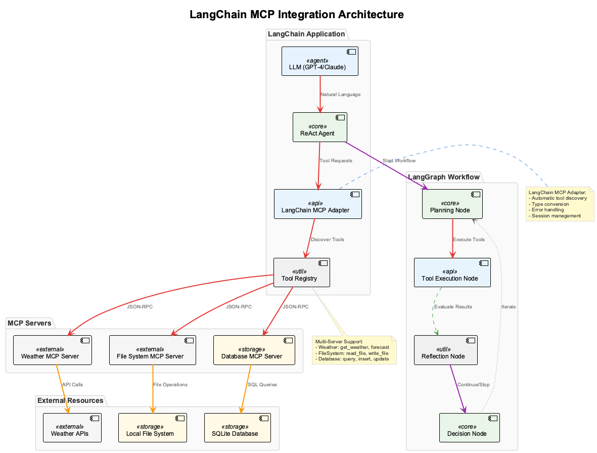

# Session 3: LangChain MCP Integration - Building Intelligent Multi-Tool Agents

## 🎯 Learning Outcomes

By the end of this session, you will be able to:
- **Integrate** multiple MCP servers with LangChain to create powerful multi-tool agents
- **Build** ReAct agents that can reason about and use various tools dynamically
- **Implement** robust error handling and fallback strategies for production agents
- **Design** complex workflows using LangGraph for multi-step agent tasks
- **Create** conversational agents that maintain context across multiple tool interactions

## 📚 Chapter Overview

In this session, we'll bridge the gap between our MCP servers and LangChain's powerful agent framework. This integration allows us to build AI agents that can intelligently select and use multiple tools to accomplish complex tasks.



The diagram shows how LangChain agents can seamlessly integrate with multiple MCP servers, providing a unified interface for complex reasoning and tool execution workflows.

### Key Concepts We'll Cover:

- **LangChain MCP Adapters**: Automatic tool discovery and integration
- **ReAct Pattern**: Reasoning and Acting in iterative loops
- **Multi-Server Management**: Coordinating multiple MCP servers
- **Error Handling**: Graceful degradation when tools fail
- **LangGraph Workflows**: Complex multi-step agent processes

---

## Part 1: Environment Setup and Architecture (15 minutes)

### Understanding the Integration Challenge

When we built our MCP servers in previous sessions, they worked well independently. But real-world AI applications need to:
- Use multiple tools together (weather + file system + database)
- Make intelligent decisions about which tools to use
- Handle failures gracefully
- Maintain conversation context across tool calls

LangChain's MCP adapter solves these challenges by providing a unified interface.

### Step 1.1: Install Dependencies

Let's set up our development environment with all necessary packages:

```bash
# Create project directory
mkdir langchain-mcp-integration
cd langchain-mcp-integration

# Create virtual environment
python -m venv venv
source venv/bin/activate  # On Windows: venv\Scripts\activate

# Install core dependencies
pip install langchain-mcp-adapters langgraph langchain-openai \
            langchain-anthropic python-dotenv colorama rich
```

**New dependencies explained:**
- `langchain-mcp-adapters`: Official LangChain integration for MCP servers
- `langgraph`: Advanced workflow and graph-based agent execution
- `langchain-openai/anthropic`: LLM providers for our agents
- `rich`: Enhanced console output for better debugging

### Step 1.2: Project Structure

We'll organize our code into logical modules for maintainability. This structure separates concerns and makes the codebase easier to navigate:

```
langchain-mcp-integration/
├── mcp_servers/           # Our MCP server implementations
│   ├── weather_server.py
│   ├── filesystem_server.py
│   └── database_server.py
├── agents/                # Agent implementations
│   ├── __init__.py
│   ├── basic_agent.py     # Simple single-tool agent
│   ├── multi_tool_agent.py # Multi-server ReAct agent
│   └── workflow_agent.py  # LangGraph workflow agent
├── workflows/             # LangGraph workflow definitions
│   ├── __init__.py
│   ├── research_workflow.py
│   └── data_analysis_workflow.py
├── utils/                 # Utility functions
│   ├── __init__.py
│   ├── mcp_manager.py     # MCP server management
│   └── logging_config.py  # Structured logging
├── config.py              # Configuration management
├── main.py               # Main application entry point
└── .env                  # Environment variables
```

**Project organization benefits:**
- **Separation of concerns**: Each directory has a specific purpose
- **Scalability**: Easy to add new agents, servers, or workflows
- **Maintainability**: Clear structure makes debugging and updates easier
- **Reusability**: Components can be imported and reused across the project

### Step 1.3: Configuration Management

First, let's create a robust configuration system that can manage multiple MCP servers. We'll break this into logical components:

**Step 1.3.1: Configuration Imports and Setup**

```python
# config.py
import os
from typing import Dict, Any, List
from dataclasses import dataclass
from dotenv import load_dotenv

load_dotenv()
```

**Step 1.3.2: MCP Server Configuration Class**

```python
@dataclass
class MCPServerConfig:
    """Configuration for a single MCP server."""
    name: str
    command: str
    args: List[str]
    transport: str = "stdio"
    description: str = ""
    timeout: int = 30
    retry_attempts: int = 3
```

**Step 1.3.3: Language Model Configuration Class**

```python
@dataclass 
class LLMConfig:
    """Configuration for language models."""
    provider: str = "openai"
    model: str = "gpt-4"
    temperature: float = 0.7
    max_tokens: int = 2000
    timeout: int = 60
```

**Why dataclasses?**
- Type hints improve code reliability and IDE support
- Default values reduce configuration complexity
- Immutable configurations prevent accidental changes

**Step 1.3.2: Environment-Based Configuration**

```python
class Config:
    """Main configuration class for LangChain MCP integration."""
    
    # API Keys from environment variables
    OPENAI_API_KEY = os.getenv("OPENAI_API_KEY")
    ANTHROPIC_API_KEY = os.getenv("ANTHROPIC_API_KEY")
    
    # LLM Configuration with environment overrides
    LLM = LLMConfig(
        provider=os.getenv("LLM_PROVIDER", "openai"),
        model=os.getenv("LLM_MODEL", "gpt-4"),
        temperature=float(os.getenv("LLM_TEMPERATURE", "0.7")),
    )
```

**Step 1.3.4: MCP Server Registry**

```python
    # MCP Server Configurations
    MCP_SERVERS = [
        MCPServerConfig(
            name="weather",
            command="python",
            args=["mcp_servers/weather_server.py"],
            description="Weather information and forecasts"
        ),
        MCPServerConfig(
            name="filesystem", 
            command="python",
            args=["mcp_servers/filesystem_server.py"],
            description="Secure file system operations"
        ),
        MCPServerConfig(
            name="database",
            command="python", 
            args=["mcp_servers/database_server.py"],
            description="Database query and manipulation"
        )
    ]
```

**Step 1.3.5: Agent and Logging Configuration**

```python
    # Agent Configuration
    AGENT_CONFIG = {
        "max_iterations": int(os.getenv("MAX_ITERATIONS", "10")),
        "verbose": os.getenv("VERBOSE", "true").lower() == "true",
        "temperature": float(os.getenv("AGENT_TEMPERATURE", "0.7")),
        "timeout": int(os.getenv("AGENT_TIMEOUT", "300"))  # 5 minutes
    }
    
    # Logging Configuration
    LOG_LEVEL = os.getenv("LOG_LEVEL", "INFO")
    LOG_FORMAT = "%(asctime)s - %(name)s - %(levelname)s - %(message)s"
```

**Configuration best practices:**
- **Environment variables** enable different settings per deployment
- **Type safety** with dataclasses prevents configuration errors
- **Sensible defaults** make development setup easier
- **Timeout configuration** prevents hanging processes
- **Structured logging** helps debug complex agent workflows

---

## Part 2: MCP Server Management (20 minutes)

### Step 2.1: MCP Manager Utility

Before building agents, we need a robust system to manage multiple MCP servers. Let's understand the core concepts by building it step by step:

**Step 2.1.1: Basic Manager Structure**

```python
# utils/mcp_manager.py
import asyncio
import logging
from typing import Dict, List, Optional
from contextlib import asynccontextmanager
from langchain_mcp_adapters import MCPAdapter
from config import Config, MCPServerConfig

logger = logging.getLogger(__name__)

class MCPServerManager:
    """Manages multiple MCP servers with health checking and recovery."""
    
    def __init__(self, server_configs: List[MCPServerConfig]):
        self.server_configs = {config.name: config for config in server_configs}
        self.adapters: Dict[str, MCPAdapter] = {}
        self.health_status: Dict[str, bool] = {}
        self._health_check_task: Optional[asyncio.Task] = None
```

**Key design decisions:**
- **Dictionary lookups** for fast server access by name
- **Health tracking** to know which servers are operational
- **Background tasks** for continuous health monitoring

**Step 2.1.2: Server Startup Logic**

This segment shows how to start individual MCP servers with proper error handling:

```python
    async def start_all_servers(self) -> Dict[str, bool]:
        """Start all configured MCP servers."""
        results = {}
        
        for name, config in self.server_configs.items():
            result = await self._start_single_server(name, config)
            results[name] = result
        
        return results
    
    async def _start_single_server(self, name: str, config: MCPServerConfig) -> bool:
        """Start a single MCP server and test its connection."""
        try:
            logger.info(f"Starting MCP server: {name}")
            adapter = MCPAdapter(
                command=config.command,
                args=config.args,
                timeout=config.timeout
            )
```

**Step 2.1.3: Server Connection Testing**

This segment handles connection verification and tool discovery:

```python
            # Test the connection and discover tools
            await adapter.start()
            tools = await adapter.list_tools()
            
            # Store the adapter and update status
            self.adapters[name] = adapter
            self.health_status[name] = True
            
            logger.info(f"MCP server '{name}' started successfully with {len(tools)} tools")
            return True
            
        except Exception as e:
            logger.error(f"Failed to start MCP server '{name}': {e}")
            self.health_status[name] = False
            return False
```

**Step 2.1.4: Health Monitoring and Recovery**

```python
    async def get_adapter(self, server_name: str) -> Optional[MCPAdapter]:
        """Get an adapter for a specific server, with health check."""
        if server_name not in self.adapters:
            logger.warning(f"Server '{server_name}' not found")
            return None
        
        if not self.health_status.get(server_name, False):
            logger.warning(f"Server '{server_name}' is unhealthy")
            # Try to restart the server
            await self._restart_server(server_name)
        
        return self.adapters.get(server_name)
```

**Complete implementation:** See `src/session3/complete_examples/mcp_manager_complete.py` for the full implementation with advanced features including:
- Continuous health monitoring
- Automatic server restart
- Context manager for resource cleanup
- Comprehensive error handling

**Key features of our MCP manager:**
- **Health Monitoring**: Continuous health checks with automatic restart
- **Error Recovery**: Graceful handling of server failures
- **Context Management**: Automatic cleanup of resources
- **Logging**: Comprehensive logging for debugging
- **Async Support**: Non-blocking operations for better performance

**Production benefits:**
- **Resilience**: Automatically handles server failures
- **Observability**: Detailed logging for troubleshooting
- **Resource management**: Proper cleanup prevents memory leaks
- **Scalability**: Easily add new servers to the configuration

### Step 2.2: Creating Simplified MCP Servers

Let's create lightweight versions of our MCP servers for this integration. We'll start with a simple weather server:

**Step 2.2.1: Server Setup and Data**

```python
# mcp_servers/weather_server.py
from mcp.server.fastmcp import FastMCP
from datetime import datetime
from typing import Dict, List

mcp = FastMCP("Weather Server")

# Simulated weather data for demonstration
WEATHER_DATA = {
    "London": {"temp": 15, "condition": "Cloudy", "humidity": 75},
    "New York": {"temp": 22, "condition": "Sunny", "humidity": 60},
    "Tokyo": {"temp": 18, "condition": "Rainy", "humidity": 85},
    "Sydney": {"temp": 25, "condition": "Clear", "humidity": 55},
}
```

**Step 2.2.2: Current Weather Tool**

```python
@mcp.tool()
def get_current_weather(city: str, units: str = "celsius") -> Dict:
    """Get current weather for a city."""
    if city not in WEATHER_DATA:
        return {"error": f"Weather data not available for {city}"}
    
    data = WEATHER_DATA[city].copy()
    if units == "fahrenheit":
        data["temp"] = (data["temp"] * 9/5) + 32
        data["units"] = "°F"
    else:
        data["units"] = "°C"
    
    data["city"] = city
    data["timestamp"] = datetime.now().isoformat()
    return data
```

**Step 2.2.3: Weather Forecast Input Validation**

This segment handles input validation for the forecast tool:

```python
@mcp.tool()
def get_weather_forecast(city: str, days: int = 3) -> List[Dict]:
    """Get weather forecast for multiple days."""
    # Validate input parameters
    if days < 1 or days > 7:
        return [{"error": "Days must be between 1 and 7"}]
    
    if city not in WEATHER_DATA:
        return [{"error": f"Forecast not available for {city}"}]
    
    # Generate forecast based on current weather
    return _generate_forecast_data(city, days)
```

**Step 2.2.4: Forecast Data Generation**

This segment creates realistic forecast data for demonstration:

```python
def _generate_forecast_data(city: str, days: int) -> List[Dict]:
    """Generate realistic forecast data for demonstration."""
    base_temp = WEATHER_DATA[city]["temp"]
    conditions = ["Sunny", "Cloudy", "Rainy", "Partly Cloudy"]
    
    forecast = []
    for i in range(days):
        forecast.append({
            "day": i + 1,
            "city": city,
            "high": base_temp + (i * 2),
            "low": base_temp - 5 + i,
            "condition": conditions[i % len(conditions)],
            "precipitation_chance": (i * 10) % 80
        })
    
    return forecast

if __name__ == "__main__":
    mcp.run()
```

**Key design elements:**
- **Simple data structure** for easy demonstration
- **Error handling** for invalid inputs
- **Unit conversion** to support different temperature scales
- **Realistic forecast simulation** with varying conditions

---

## Part 3: Building ReAct Agents (25 minutes)

### Step 3.1: Basic Single-Tool Agent

Let's start with a simple agent that uses one MCP server to understand the integration pattern. We'll build this incrementally:

**Step 3.1.1: Agent Foundation**

```python
# agents/basic_agent.py
import asyncio
import logging
from typing import Optional
from langchain.agents import create_react_agent, AgentExecutor
from langchain_core.prompts import PromptTemplate
from langchain_openai import ChatOpenAI
from langchain_core.tools import Tool

from utils.mcp_manager import MCPServerManager
from config import Config

logger = logging.getLogger(__name__)

class BasicMCPAgent:
    """A basic ReAct agent that uses a single MCP server."""
    
    def __init__(self, server_name: str, mcp_manager: MCPServerManager):
        self.server_name = server_name
        self.mcp_manager = mcp_manager
        self.llm = None
        self.agent_executor = None
```

**Step 3.1.2: LLM and Tool Setup**

```python
    async def initialize(self) -> bool:
        """Initialize the agent with LLM and tools."""
        try:
            # Initialize LLM
            self.llm = ChatOpenAI(
                model=Config.LLM.model,
                temperature=Config.LLM.temperature,
                api_key=Config.OPENAI_API_KEY
            )
            
            # Get MCP adapter and tools
            adapter = await self.mcp_manager.get_adapter(self.server_name)
            if not adapter:
                logger.error(f"Failed to get adapter for server: {self.server_name}")
                return False
            
            # Convert MCP tools to LangChain tools
            mcp_tools = await adapter.list_tools()
            langchain_tools = self._create_langchain_tools(mcp_tools, adapter)
            
            # Create the agent executor
            self.agent_executor = self._create_agent_executor(langchain_tools)
            
            logger.info(f"Initialized basic agent with {len(langchain_tools)} tools from {self.server_name}")
            return True
            
        except Exception as e:
            logger.error(f"Failed to initialize basic agent: {e}")
            return False
```

**Step 3.1.3: Tool Wrapping Logic**

```python
    def _create_langchain_tools(self, mcp_tools, adapter):
        """Convert MCP tools to LangChain tools."""
        langchain_tools = []
        
        for mcp_tool in mcp_tools:
            # Create a LangChain tool wrapper
            async def tool_wrapper(tool_input: str, tool_name=mcp_tool.name):
                """Wrapper to call MCP tool from LangChain."""
                try:
                    result = await adapter.call_tool(tool_name, {"input": tool_input})
                    return str(result)
                except Exception as e:
                    return f"Error calling tool {tool_name}: {str(e)}"
            
            langchain_tool = Tool(
                name=mcp_tool.name,
                description=mcp_tool.description or f"Tool from {self.server_name} server",
                func=lambda x, tn=mcp_tool.name: asyncio.create_task(tool_wrapper(x, tn))
            )
            langchain_tools.append(langchain_tool)
        
        return langchain_tools
```

**Step 3.1.4: ReAct Agent Creation**

```python
    def _create_agent_executor(self, langchain_tools):
        """Create the ReAct agent executor with basic prompting."""
        react_prompt = PromptTemplate.from_template("""
You are a helpful AI assistant with access to external tools.

Available tools:
{tools}

Use the following format:

Question: the input question you must answer
Thought: you should always think about what to do
Action: the action to take, should be one of [{tool_names}]
Action Input: the input to the action
Observation: the result of the action
... (this Thought/Action/Action Input/Observation can repeat N times)
Thought: I now know the final answer
Final Answer: the final answer to the original input question

Question: {input}
{agent_scratchpad}
""")
        
        return self._build_executor(langchain_tools, react_prompt)
    
    def _build_executor(self, langchain_tools, react_prompt):
        """Build the agent executor with configuration."""
        agent = create_react_agent(
            llm=self.llm,
            tools=langchain_tools,
            prompt=react_prompt
        )
        
        return AgentExecutor(
            agent=agent,
            tools=langchain_tools,
            verbose=Config.AGENT_CONFIG["verbose"],
            max_iterations=Config.AGENT_CONFIG["max_iterations"],
            handle_parsing_errors=True
        )
```

**Step 3.1.5: Query Execution**

```python
    async def run(self, query: str) -> str:
        """Run the agent with a query."""
        if not self.agent_executor:
            return "Agent not initialized. Call initialize() first."
        
        try:
            logger.info(f"Running agent with query: {query}")
            result = await self.agent_executor.ainvoke({"input": query})
            return result["output"]
        
        except Exception as e:
            logger.error(f"Agent execution failed: {e}")
            return f"I encountered an error while processing your request: {str(e)}"
```

**Key concepts in our basic agent:**
- **Tool Wrapping**: Converting MCP tools to LangChain-compatible tools
- **ReAct Pattern**: The agent reasons (Thought) then acts (Action) iteratively
- **Error Handling**: Graceful degradation when tools fail
- **Async Support**: Non-blocking execution for better performance

**Learning progression:**
- **Single server focus** helps understand the integration pattern
- **Clear separation** between initialization and execution
- **Modular design** makes it easy to extend to multiple servers
- **Comprehensive logging** aids in debugging and monitoring

### Step 3.2: Multi-Tool Agent with Advanced Reasoning

Now let's build a more sophisticated agent that can use multiple MCP servers intelligently. This involves several advanced concepts:

**Step 3.2.1: Agent Architecture**

```python
# agents/multi_tool_agent.py
import asyncio
import logging
from typing import Dict, List, Any, Optional
from langchain.agents import create_react_agent, AgentExecutor
from langchain_core.prompts import PromptTemplate
from langchain_openai import ChatOpenAI
from langchain_core.tools import Tool
from langchain.memory import ConversationBufferWindowMemory

from utils.mcp_manager import MCPServerManager
from config import Config

logger = logging.getLogger(__name__)

class MultiToolMCPAgent:
    """Advanced ReAct agent that intelligently uses multiple MCP servers."""
    
    def __init__(self, mcp_manager: MCPServerManager):
        self.mcp_manager = mcp_manager
        self.llm = None
        self.agent_executor = None
        self.memory = None
        self.available_tools = {}
```

**Step 3.2.2: Memory and Tool Collection**

```python
    async def initialize(self) -> bool:
        """Initialize the agent with LLM, tools, and memory."""
        try:
            # Initialize LLM with function calling
            self.llm = ChatOpenAI(
                model=Config.LLM.model,
                temperature=Config.LLM.temperature,
                api_key=Config.OPENAI_API_KEY
            )
            
            # Initialize conversation memory
            self.memory = ConversationBufferWindowMemory(
                k=10,  # Remember last 10 exchanges
                memory_key="chat_history",
                return_messages=True
            )
            
            # Collect tools from all available servers
            langchain_tools = await self._collect_all_tools()
            
            if not langchain_tools:
                logger.error("No tools available from MCP servers")
                return False
            
            # Create the agent executor with enhanced prompting
            self.agent_executor = self._create_enhanced_agent(langchain_tools)
            
            tool_count = len(langchain_tools)
            server_count = len(self.available_tools)
            logger.info(f"Initialized multi-tool agent with {tool_count} tools from {server_count} servers")
            
            return True
            
        except Exception as e:
            logger.error(f"Failed to initialize multi-tool agent: {e}")
            return False
```

**Step 3.2.3: Enhanced Agent Prompting Foundation**

This segment creates the enhanced prompt template with clear instructions:

```python
    def _create_enhanced_agent(self, langchain_tools):
        """Create an enhanced ReAct agent with better prompting."""
        react_prompt = PromptTemplate.from_template("""
You are an intelligent AI assistant with access to multiple specialized tools.
You can use weather information, file system operations, and database queries to help users.

INSTRUCTIONS:
1. Analyze the user's request carefully
2. Identify which tools might be helpful
3. Use tools in logical sequence
4. Provide comprehensive, helpful responses
5. If a tool fails, try alternative approaches

Available tools:
{tools}
""")
```

**Step 3.2.4: ReAct Pattern Template**

This segment defines the reasoning format for the agent:

```python
        # Complete the prompt template with ReAct format
        react_prompt = PromptTemplate.from_template("""
You are an intelligent AI assistant with access to multiple specialized tools.
You can use weather information, file system operations, and database queries to help users.

INSTRUCTIONS:
1. Analyze the user's request carefully
2. Identify which tools might be helpful
3. Use tools in logical sequence
4. Provide comprehensive, helpful responses
5. If a tool fails, try alternative approaches

Available tools:
{tools}

CONVERSATION HISTORY:
{chat_history}

Use this format for your reasoning:

Question: {input}
Thought: Let me analyze what the user needs and which tools I should use
Action: [choose from {tool_names}]
Action Input: [provide the appropriate input]
Observation: [result from the tool]
... (repeat Thought/Action/Action Input/Observation as needed)
Thought: Now I have enough information to provide a comprehensive answer
Final Answer: [provide detailed, helpful response]

Question: {input}
{agent_scratchpad}
""")
```

**Step 3.2.5: Agent Creation and Executor Setup**

This segment creates the agent and configures the executor:

```python
        # Create the ReAct agent with our enhanced prompt
        agent = create_react_agent(
            llm=self.llm,
            tools=langchain_tools,
            prompt=react_prompt
        )
        
        # Configure the agent executor with enhanced features
        return AgentExecutor(
            agent=agent,
            tools=langchain_tools,
            memory=self.memory,
            verbose=Config.AGENT_CONFIG["verbose"],
            max_iterations=Config.AGENT_CONFIG["max_iterations"],
            handle_parsing_errors=True,
            return_intermediate_steps=True
        )
```

**Enhanced prompting benefits:**
- **Clear instructions**: Step-by-step guidance for tool usage
- **Context awareness**: Includes conversation history
- **Error recovery**: Instructions for handling tool failures
- **Structured reasoning**: ReAct format ensures logical thinking
- **Flexible execution**: Configurable iterations and error handling

**Complete implementation:** See `src/session3/complete_examples/multi_tool_agent_complete.py` for the full implementation with advanced features including:
- Tool collection from multiple servers
- Enhanced tool descriptions with use case context
- Conversation memory and history management
- Comprehensive error handling and recovery
- Interactive console interface with rich formatting

**Key advances over basic agent:**
- **Multi-server support**: Uses tools from all available MCP servers
- **Conversation memory**: Maintains context across interactions
- **Enhanced prompting**: Better instructions for tool selection
- **Rich descriptions**: Tools include contextual use case information
- **Error recovery**: Graceful handling of server failures

---

## Part 4: Advanced Workflows with LangGraph (20 minutes)

### Step 4.1: Creating a Research Workflow

LangGraph allows us to create complex, stateful workflows. Let's build a research workflow that combines multiple tools systematically. We'll break this down into logical segments to understand each component.

**Step 4.1.1: Workflow Imports and State Definition**

This segment sets up the foundation for our LangGraph workflow, including the state management:

```python
# workflows/research_workflow.py
import asyncio
from typing import Dict, Any, List
from langchain_core.messages import HumanMessage, AIMessage
from langgraph.graph import StateGraph, END
from langgraph.prebuilt import ToolExecutor
from dataclasses import dataclass

from utils.mcp_manager import MCPServerManager
from config import Config

@dataclass
class ResearchState:
    """State for the research workflow - tracks data through each step."""
    query: str
    messages: List[Any] 
    research_plan: str = ""
    weather_data: Dict = None
    file_data: Dict = None
    database_data: Dict = None
    final_report: str = ""
    step_count: int = 0
```

**Why this structure?**
- **Dataclass**: Provides type hints and automatic equality/repr methods
- **State persistence**: Each node can access and modify shared state
- **Clear data flow**: Separate fields for each research domain
- **Progress tracking**: Step count helps monitor workflow execution

**Step 4.1.2: Workflow Class Foundation**

This segment establishes the main workflow class and graph setup:

```python
class ResearchWorkflow:
    """Advanced research workflow using LangGraph and multiple MCP servers."""
    
    def __init__(self, mcp_manager: MCPServerManager):
        self.mcp_manager = mcp_manager
        self.workflow = None
    
    async def build_workflow(self) -> StateGraph:
        """Build the LangGraph workflow graph."""
        # Define the workflow graph
        workflow = StateGraph(ResearchState)
        
        # Add processing nodes
        workflow.add_node("planner", self._planning_node)
        workflow.add_node("weather_researcher", self._weather_research_node)
        workflow.add_node("file_researcher", self._file_research_node)
        workflow.add_node("database_researcher", self._database_research_node)
        workflow.add_node("synthesizer", self._synthesis_node)
        
        return workflow
```

**Step 4.1.3: Workflow Orchestration and Flow**

This segment defines how the workflow steps connect and execute:

```python
        # Add edges (workflow execution flow)
        workflow.set_entry_point("planner")
        workflow.add_edge("planner", "weather_researcher")
        workflow.add_edge("weather_researcher", "file_researcher")
        workflow.add_edge("file_researcher", "database_researcher")
        workflow.add_edge("database_researcher", "synthesizer")
        workflow.add_edge("synthesizer", END)
        
        # Compile the workflow for execution
        self.workflow = workflow.compile()
        return self.workflow
```

**Key workflow design principles:**
- **Sequential processing**: Each step builds on the previous one
- **Modular nodes**: Each research domain has its own processing node
- **Clear flow**: Linear progression from planning to synthesis
- **Compiled execution**: Optimized for performance

**Step 4.1.4: Planning Node Implementation**

This segment handles intelligent planning based on query analysis:

```python
    async def _planning_node(self, state: ResearchState) -> ResearchState:
        """Plan the research approach based on query keywords."""
        query_lower = state.query.lower()
        plan_elements = []
        
        # Analyze query for different research domains
        if any(word in query_lower for word in ["weather", "climate", "temperature", "forecast"]):
            plan_elements.append("- Gather weather information from weather server")
        
        if any(word in query_lower for word in ["file", "document", "read", "data"]):
            plan_elements.append("- Search for relevant files and documents")
        
        if any(word in query_lower for word in ["database", "record", "history", "log"]):
            plan_elements.append("- Query database for historical information")
        
        # Build research plan
        state.research_plan = "Research Plan:\n" + "\n".join(plan_elements) if plan_elements else "General research approach"
        state.step_count += 1
        return state
```

**Planning logic benefits:**
- **Keyword analysis**: Determines which tools to use
- **Dynamic planning**: Adapts to different query types
- **Documentation**: Creates clear plan for transparency
- **Extensible**: Easy to add new research domains

**Step 4.1.5: Weather Research Node**

This segment handles weather-specific research with proper error handling:

```python
    async def _weather_research_node(self, state: ResearchState) -> ResearchState:
        """Research weather-related information if relevant."""
        if "weather" not in state.query.lower():
            state.weather_data = {"skipped": True, "reason": "No weather terms in query"}
            return state
        
        try:
            adapter = await self.mcp_manager.get_adapter("weather")
            if adapter:
                # Extract potential city names from query
                cities = self._extract_cities_from_query(state.query)
                
                weather_results = {}
                for city in cities:
                    try:
                        result = await adapter.call_tool("get_current_weather", {"city": city})
                        weather_results[city] = result
                    except:
                        pass  # Continue with other cities if one fails
                
                state.weather_data = weather_results if weather_results else {"error": "No weather data found"}
            else:
                state.weather_data = {"error": "Weather server not available"}
        
        except Exception as e:
            state.weather_data = {"error": str(e)}
        
        state.step_count += 1
        return state
```

**Step 4.1.6: File System Research Node**

This segment handles file system searches with term extraction:

```python
    async def _file_research_node(self, state: ResearchState) -> ResearchState:
        """Research file-based information using extracted search terms."""
        try:
            adapter = await self.mcp_manager.get_adapter("filesystem")
            if adapter:
                # Extract search terms from the original query
                search_terms = self._extract_search_terms(state.query)
                
                file_results = {}
                for term in search_terms:
                    try:
                        # Search for files matching the term
                        result = await adapter.call_tool("search_files", {
                            "pattern": f"*{term}*",
                            "search_type": "name"
                        })
                        if result:
                            file_results[f"files_matching_{term}"] = result
                    except:
                        pass  # Continue with other terms if one fails
                
                state.file_data = file_results if file_results else {"info": "No relevant files found"}
            else:
                state.file_data = {"error": "File system server not available"}
        
        except Exception as e:
            state.file_data = {"error": str(e)}
        
        state.step_count += 1
        return state
```

**Step 4.1.7: Database Research and Synthesis Nodes**

This segment handles database queries and final report synthesis:

```python
    async def _database_research_node(self, state: ResearchState) -> ResearchState:
        """Research database information (placeholder for future implementation)."""
        try:
            adapter = await self.mcp_manager.get_adapter("database")
            if adapter:
                # Placeholder for actual database integration
                state.database_data = {
                    "info": "Database research completed",
                    "note": "Database server integration would go here"
                }
            else:
                state.database_data = {"error": "Database server not available"}
        
        except Exception as e:
            state.database_data = {"error": str(e)}
        
        state.step_count += 1
        return state
```

**Step 4.1.8: Report Synthesis Logic**

This segment combines all research results into a comprehensive report:

```python
    async def _synthesis_node(self, state: ResearchState) -> ResearchState:
        """Synthesize all research into a comprehensive final report."""
        report_sections = []
        
        # Add header and research plan
        report_sections.append(f"# Research Report\n\n**Query:** {state.query}\n")
        report_sections.append(f"**Research Plan:**\n{state.research_plan}\n")
        
        # Add weather findings if available
        if state.weather_data and not state.weather_data.get("skipped"):
            report_sections.append("## Weather Information")
            if "error" in state.weather_data:
                report_sections.append(f"Weather research failed: {state.weather_data['error']}")
            else:
                for city, data in state.weather_data.items():
                    if isinstance(data, dict) and "temp" in data:
                        report_sections.append(f"- **{city}**: {data['temp']}{data.get('units', '°C')}, {data.get('condition', 'N/A')}")
        
        return self._finalize_report(state, report_sections)
```

**Step 4.1.9: Report Finalization and Helper Methods**

This segment completes the report and provides utility functions:

```python
    def _finalize_report(self, state: ResearchState, report_sections: List[str]) -> ResearchState:
        """Complete the report with file and database findings."""
        # Add file findings
        if state.file_data:
            report_sections.append("\n## File System Research")
            if "error" in state.file_data:
                report_sections.append(f"File research failed: {state.file_data['error']}")
            else:
                report_sections.append("File system data collected successfully")
        
        # Add database findings
        if state.database_data:
            report_sections.append("\n## Database Research")
            if "error" in state.database_data:
                report_sections.append(f"Database research failed: {state.database_data['error']}")
            else:
                report_sections.append("Database research completed")
        
        # Add summary
        report_sections.append(f"\n## Summary")
        report_sections.append(f"Research completed in {state.step_count} steps using multiple MCP servers.")
        
        state.final_report = "\n".join(report_sections)
        state.step_count += 1
        return state
```

**Step 4.1.10: Utility Methods and Workflow Execution**

This segment provides text processing and workflow execution methods:

```python
    def _extract_cities_from_query(self, query: str) -> List[str]:
        """Extract potential city names from query (simple implementation)."""
        common_cities = ["London", "New York", "Tokyo", "Sydney", "Paris", "Berlin", "Moscow"]
        found_cities = [city for city in common_cities if city.lower() in query.lower()]
        return found_cities or ["London"]  # Default to London
    
    def _extract_search_terms(self, query: str) -> List[str]:
        """Extract meaningful search terms from query."""
        stop_words = {"the", "a", "an", "and", "or", "but", "in", "on", "at", "to", "for", "of", "with", "by"}
        words = [word for word in query.lower().split() if len(word) > 3 and word not in stop_words]
        return words[:3]  # Limit to 3 terms for efficiency
    
    async def run_research(self, query: str) -> Dict[str, Any]:
        """Execute the complete research workflow."""
        if not self.workflow:
            await self.build_workflow()
        
        # Initialize state with the user query
        initial_state = ResearchState(query=query, messages=[HumanMessage(content=query)])
        
        try:
            final_state = await self.workflow.ainvoke(initial_state)
            return {
                "success": True, "query": query, "report": final_state.final_report,
                "steps": final_state.step_count, "research_plan": final_state.research_plan
            }
        except Exception as e:
            return {"success": False, "query": query, "error": str(e), "report": f"Research workflow failed: {str(e)}"}
```

**Complete implementation:** See `src/session3/complete_examples/research_workflow_complete.py` for the full implementation with:
- Advanced error recovery and retry logic
- Parallel research execution for better performance
- Rich console interface for interactive use
- Comprehensive logging and debugging features

---

## 📝 Chapter Summary

Congratulations! You've mastered LangChain MCP integration and built sophisticated multi-tool AI agents. Let's review what you've accomplished:

### Key Concepts Mastered:

1. **MCP Server Management**: Built a robust manager for multiple MCP servers with health monitoring and automatic recovery
2. **Tool Integration**: Seamlessly converted MCP tools to LangChain-compatible tools with proper error handling
3. **ReAct Agents**: Created intelligent agents that reason about tool usage and execute multi-step workflows
4. **Conversation Memory**: Implemented persistent memory for context-aware conversations
5. **LangGraph Workflows**: Built complex, stateful workflows for advanced research and analysis tasks

### Your Enhanced Agent Can Now:

- ✅ **Use Multiple Tools Simultaneously**: Weather, file system, and database operations in one conversation
- ✅ **Reason Intelligently**: Understand which tools to use based on user queries
- ✅ **Handle Failures Gracefully**: Automatic recovery when tools fail or servers are unavailable
- ✅ **Maintain Context**: Remember previous interactions and build on them
- ✅ **Execute Complex Workflows**: Multi-step research processes with LangGraph
- ✅ **Provide Rich Responses**: Comprehensive answers combining multiple data sources

### Production Considerations:

- **Scalability**: The architecture supports adding new MCP servers easily
- **Reliability**: Health monitoring and automatic restart capabilities
- **Security**: Proper error handling prevents sensitive information leakage
- **Observability**: Comprehensive logging for debugging and monitoring
- **Performance**: Async operations for non-blocking execution

---

## 🧪 Testing Your Understanding

### Quick Check Questions

1. **What is the primary advantage of using LangChain MCP adapters?**
   - A) Better performance
   - B) Automatic tool discovery and integration
   - C) Reduced memory usage  
   - D) Simplified configuration

2. **In the ReAct pattern, what does the agent do after each Action?**
   - A) Plan the next action
   - B) Wait for user input
   - C) Observe the result
   - D) Generate a final answer

3. **What is the purpose of the health monitoring in MCPServerManager?**
   - A) Improve performance
   - B) Automatically restart failed servers
   - C) Monitor memory usage
   - D) Log user interactions

4. **What advantage does LangGraph provide over simple ReAct agents?**
   - A) Faster execution
   - B) Complex stateful workflows
   - C) Better error handling
   - D) Simpler configuration

5. **How does our multi-tool agent decide which tools to use?**
   - A) Random selection
   - B) Pre-configured rules
   - C) LLM reasoning about tool descriptions
   - D) User specification

### Practical Exercise

Create a travel planning agent that:
1. Gets weather information for multiple destinations
2. Searches for travel documents in the file system
3. Stores trip preferences in the database
4. Creates a comprehensive travel report

**💡 Hint:** Check the [`Session3_LangChain_MCP_Integration-solution.md`](Session3_LangChain_MCP_Integration-solution.md) file for answers and detailed explanations.

---

## Next Session Preview

In Session 4, we'll focus on **Production MCP Deployment** including:
- Docker containerization of MCP servers
- Cloud deployment strategies (AWS Lambda, Google Cloud Run)
- Load balancing and scaling
- Monitoring and observability
- CI/CD pipelines for MCP servers

### Homework

1. **Extend the multi-tool agent** to handle more complex queries requiring all three servers
2. **Build a custom workflow** using LangGraph for a specific use case
3. **Add error recovery** that tries alternative tools when the primary tool fails
4. **Implement rate limiting** to prevent overwhelming MCP servers

---

## 📋 Test Your Knowledge

Ready to test your understanding of LangChain MCP Integration? Take our comprehensive multiple-choice test to verify your mastery of the concepts.

### Multiple Choice Test
Test your knowledge with 10 carefully crafted questions covering:
- LangChain MCP integration concepts
- ReAct pattern implementation
- Multi-server management strategies
- Error handling and fault tolerance
- LangGraph workflow orchestration

**[📝 Take the Test - Session 3 Test Solutions](Session3_Test_Solutions.md)**

*The test includes detailed explanations for each answer and a scoring guide to help you identify areas for further study.*

---

## Additional Resources

- [LangChain MCP Adapters Documentation](https://python.langchain.com/docs/integrations/providers/mcp)
- [LangGraph Tutorial](https://langchain-ai.github.io/langgraph/)
- [ReAct Paper](https://arxiv.org/abs/2210.03629) - Original research on reasoning and acting
- [MCP Specification](https://modelcontextprotocol.io/specification) - Official protocol documentation

You've now built the foundation for production-ready AI agents that can intelligently use multiple tools. The next step is deploying these systems at scale! 🚀