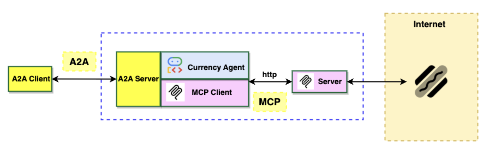

# Agentic AI Protocols: MCP, ADK & A2A
## 2-Week Nanodegree Segment

### 🎯 **Course Overview**
This intensive 2-week module teaches students to build production-ready agent communication systems using the Model Context Protocol (MCP), Agent Development Kit (ADK), and Agent-to-Agent (A2A) protocols. Students emerge with practical skills to create interoperable, distributed agent architectures.




### 📋 **Prerequisites**
- Completed Agent Frameworks module (Week -4 to -3)
- Completed RAG module (Week -2 to -1) 
- Python programming experience
- Basic understanding of HTTP/REST APIs
- Familiarity with LLM APIs

---

## **Week 1: MCP Fundamentals & Implementation**

### **Day 1-2: MCP Foundation & Architecture**

#### **Learning Objectives:**
- Understand the MCP ecosystem and solve the M×N integration problem
- Master the three core MCP primitives: Tools, Resources, and Prompts
- Set up development environment with MCP SDKs

#### **Session 1: MCP Introduction & Setup (2 hours)**
**Theory (45 min):**
- The M×N problem in AI integrations
- MCP architecture: Client, Server, Host relationship
- Transport mechanisms: stdio vs HTTP
- Official MCP specification walkthrough

**Hands-on Lab 1 (75 min): Basic MCP Server**
```python
# First MCP server using FastMCP
from mcp.server.fastmcp import FastMCP

mcp = FastMCP("Hello World")

@mcp.tool()
def greet(name: str) -> str:
    """Greet a person by name"""
    return f"Hello, {name}!"

@mcp.resource("greeting://template")
def greeting_template() -> str:
    """Get greeting template"""
    return "Use this format: Hello, [NAME]!"
```

**Resources:**
- [MCP Official Docs](https://modelcontextprotocol.io/)
- [DataCamp MCP Tutorial](https://www.datacamp.com/tutorial/mcp-model-context-protocol)

#### **Session 2: Advanced MCP Server Development (2 hours)**
**Theory (30 min):**
- Resource management and lifecycle
- Error handling and validation
- Security considerations

**Hands-on Lab 2 (90 min): File System MCP Server**
Build a server that exposes file operations as MCP tools and resources.

### **Day 3-4: MCP Client Integration**

#### **Session 3: MCP Client Development (2 hours)**
**Theory (30 min):**
- Client connection patterns
- Tool discovery and invocation
- Resource subscription

**Hands-on Lab 3 (90 min): LangChain MCP Integration**
```python
from langchain_mcp_adapters.client import MultiServerMCPClient
from langgraph.prebuilt import create_react_agent

# Connect to multiple MCP servers
client = MultiServerMCPClient({
    "filesystem": {"command": "python", "args": ["fs_server.py"]},
    "weather": {"url": "http://weather-server:8080"}
})

tools = await client.get_tools()
agent = create_react_agent("openai:gpt-4", tools)
```

**Resources:**
- [LangChain MCP Adapters](https://github.com/langchain-ai/langchain-mcp-adapters)

#### **Session 4: Production MCP Deployment (2 hours)**
**Hands-on Lab 4 (120 min): Deploy MCP Server to Cloud**
- Containerize MCP server
- Deploy to Cloud Run/AWS Lambda
- Configure authentication and monitoring

### **Day 5: MCP Security & Best Practices**

#### **Session 5: Securing MCP Communications (2 hours)**
**Theory (45 min):**
- Authentication strategies
- Input validation and sanitization
- Rate limiting and resource protection

**Hands-on Lab 5 (75 min): Secure MCP Server**
Implement JWT authentication and input validation for MCP servers.

**Resources:**
- [MCP Security Considerations](https://medium.com/data-science-collective/mcp-is-a-security-nightmare-heres-how-the-agent-security-framework-fixes-it-fd419fdfaf4e)

---

## **Week 2: ADK & A2A Distributed Systems**

### **Day 6-7: Agent Development Kit (ADK)**

#### **Session 6: ADK Fundamentals (2 hours)**
**Theory (45 min):**
- ADK architecture and components
- Agent lifecycle management
- Integration with MCP servers

**Hands-on Lab 6 (75 min): First ADK Agent**
```python
# Currency conversion agent using ADK
from google.cloud import adk

agent = adk.Agent(
    name="currency-agent",
    model="gemini-2.0-flash",
    system_instruction="You are a currency conversion expert."
)

# Connect to MCP server
agent.add_mcp_server("currency", "http://currency-mcp:8080")
```

**Resources:**
- [Currency Agent Codelab](https://codelabs.developers.google.com/codelabs/currency-agent#0)

#### **Session 7: Advanced ADK Patterns (2 hours)**
**Hands-on Lab 7 (120 min): Multi-Tool Agent System**
Build an agent that coordinates multiple MCP servers for complex workflows.

### **Day 8-9: Agent-to-Agent (A2A) Protocol**

#### **Session 8: A2A Protocol Foundation (2 hours)**
**Theory (45 min):**
- A2A vs MCP: Agent collaboration vs tool integration
- Agent discovery through Agent Cards
- Communication patterns: sync/async, streaming

**Hands-on Lab 8 (75 min): Basic A2A Server**
```python
from a2a import A2AServer

# Expose agent via A2A protocol
server = A2AServer(
    agent_id="currency-agent",
    capabilities=["currency_conversion", "financial_data"]
)

@server.handle_request
async def process_request(request):
    # Handle A2A communication
    return await agent.process(request)
```

**Resources:**
- [A2A Protocol Specification](https://a2aprotocol.ai/)
- [Google A2A Blog Post](https://developers.googleblog.com/en/a2a-a-new-era-of-agent-interoperability/)

#### **Session 9: Multi-Agent Orchestration (2 hours)**
**Hands-on Lab 9 (120 min): Agent Network**
Create a network of specialized agents communicating via A2A protocol.

### **Day 10: Capstone Project**

#### **Final Project: Distributed Agent Ecosystem (4 hours)**
**Project Requirements:**
Build a multi-agent system with:
1. **Data Agent** (MCP server): Provides database/API access
2. **Analysis Agent** (ADK): Processes and analyzes data
3. **Reporting Agent** (A2A): Generates and distributes reports
4. **Orchestrator Agent** (A2A): Coordinates the workflow

**Technical Specifications:**
- Minimum 2 MCP servers with 3+ tools each
- 3+ agents communicating via A2A protocol
- Authentication and error handling
- Deployed to cloud platform
- Monitoring and logging

**Deliverables:**
- Complete source code repository
- Deployment configuration
- API documentation
- Demo video (5 minutes)
- Architecture diagram

---

## **📚 Comprehensive Resource Library**

### **Core Documentation**
- [MCP Official Specification](https://modelcontextprotocol.io/)
- [A2A Protocol Documentation](https://a2aprotocol.ai/)
- [Anthropic MCP Guide](https://www.anthropic.com/news/model-context-protocol)

### **Video Tutorials**
- [MCP Introduction Video](https://www.youtube.com/watch?v=FLpS7OfD5-s)
- [Building Your First MCP Server](https://www.youtube.com/results?search_query=MCP+server+tutorial)

### **Hands-on Tutorials**
- [Currency Agent Codelab](https://codelabs.developers.google.com/codelabs/currency-agent#0)
- [DataCamp MCP Tutorial](https://www.datacamp.com/tutorial/mcp-model-context-protocol)
- [TowardsDataScience MCP Guide](https://towardsdatascience.com/model-context-protocol-mcp-tutorial-build-your-first-mcp-server-in-6-steps/)

### **Advanced Reading**
- [Agent Interoperability Survey](https://arxiv.org/html/2505.02279v1)
- [RAG + MCP Integration](https://medium.com/@bravekjh/rag-mcp-supercharging-ai-agents-with-retrieval-augmented-generation-and-model-context-protocol-775ff5a7206f)
- [MCP Security Analysis](https://medium.com/data-science-collective/mcp-is-a-security-nightmare-heres-how-the-agent-security-framework-fixes-it-fd419fdfaf4e)

### **Code Repositories**
- [LangChain MCP Adapters](https://github.com/langchain-ai/langchain-mcp-adapters)
- [FastAPI MCP Server](https://github.com/tadata-org/fastapi_mcp)
- [A2A Python SDK](https://github.com/a2aproject/A2A)

---

## **🎯 Learning Outcomes**

By completion, students will be able to:

### **Technical Skills**
1. **Design and implement MCP servers** with tools, resources, and prompts
2. **Create MCP clients** that integrate with multiple servers
3. **Build agents using ADK** with proper lifecycle management  
4. **Implement A2A protocol** for agent-to-agent communication
5. **Deploy distributed agent systems** to cloud platforms
6. **Secure agent communications** with authentication and validation

### **Architectural Understanding**
1. **Differentiate between MCP, ADK, and A2A** use cases
2. **Design interoperable agent ecosystems** 
3. **Implement proper separation of concerns** between agents and tools
4. **Plan for scalability and fault tolerance** in distributed systems

### **Industry Readiness**
1. **Follow protocol specifications** and best practices
2. **Debug multi-agent communication** issues
3. **Monitor and maintain** production agent systems
4. **Evaluate trade-offs** between different architectural approaches

---

## **📊 Assessment Structure**

### **Continuous Assessment (60%)**
- **Lab Exercises** (30%): 9 hands-on labs with code submissions
- **Mini-Projects** (20%): 3 intermediate projects throughout the course
- **Participation** (10%): Code reviews, discussion forums, peer feedback

### **Final Assessment (40%)**
- **Capstone Project** (35%): Complete distributed agent system
- **Technical Presentation** (5%): 10-minute demo and Q&A

### **Grading Rubric**
- **Exceeds Expectations (A)**: Implements advanced features, excellent documentation, innovative approaches
- **Meets Expectations (B)**: Functional implementation, good documentation, follows specifications
- **Below Expectations (C)**: Basic functionality, minimal documentation, some specification gaps
- **Unsatisfactory (F)**: Non-functional or incomplete implementation

---

## **🛠️ Development Environment Setup**

### **Required Software**
```bash
# Python environment
python3.11+
pip install fastmcp langchain-mcp-adapters a2a-python-sdk

# Node.js (for TypeScript MCP development)
node18+
npm install @modelcontextprotocol/sdk

# Cloud tools
gcloud CLI
docker
```

### **Recommended Tools**
- **IDE**: VS Code with MCP extension
- **API Testing**: Postman or curl
- **Monitoring**: Prometheus + Grafana
- **Version Control**: Git with GitHub/GitLab

### **Development Workflow**
1. **Local Development**: Use stdio transport for rapid iteration
2. **Integration Testing**: Deploy to local containers
3. **Production Deployment**: Cloud platforms with proper monitoring

---

## **🎓 Certificate Requirements**

To earn the certificate, students must:
1. Complete all 9 lab exercises with passing grades (70%+)
2. Submit functional capstone project meeting all requirements
3. Participate in peer code reviews and discussions
4. Pass technical interview demonstrating understanding

**Certificate Title:** "Certified in Agentic AI Protocols: MCP, ADK & A2A"

---

## **👥 Learning Community**

### **Support Channels**
- **Discord Server**: Real-time Q&A and peer support
- **GitHub Organization**: Code sharing and collaboration
- **Office Hours**: Twice weekly with instructors
- **Study Groups**: Peer-organized technical discussions

### **Industry Connections**
- **Guest Speakers**: Engineers from Anthropic, Google, LangChain
- **Project Mentors**: Industry professionals providing guidance
- **Career Services**: Portfolio reviews and interview preparation

This curriculum provides a comprehensive, hands-on introduction to the cutting-edge protocols shaping the future of agentic AI systems. Students gain practical experience building the interoperable, distributed agent architectures that will power next-generation AI applications.