# Session 0: Introduction to MCP, ACP, and A2A - Building the Future of AI Agent Ecosystems

## Overview

Welcome to the world of next-generation AI agent systems! In this introductory session, we'll explore three revolutionary protocols that are reshaping how AI agents communicate, operate, and collaborate: **Model Context Protocol (MCP)**, **Agent Communication Protocol (ACP)**, and **Agent-to-Agent (A2A) protocol**.

These technologies form the backbone of modern multi-agent AI systems, enabling seamless communication, standardized interactions, and scalable agent ecosystems that can work across organizational and technical boundaries.

## What is MCP (Model Context Protocol)?

### Core Concept

The **Model Context Protocol (MCP)** is an open standard that transforms how Large Language Models (LLMs) interact with external data sources and tools. Think of MCP as the universal translator that makes enterprise APIs tool-agnostic and LLM-friendly.

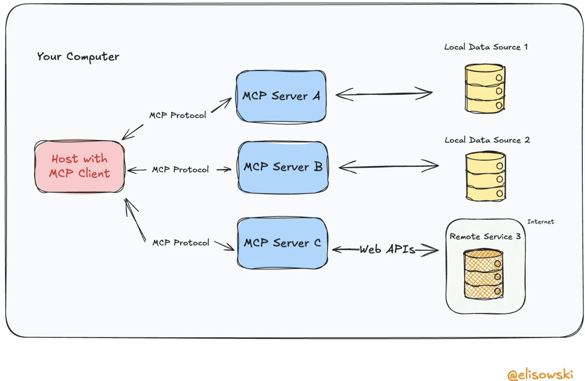

### The M×N Integration Problem

Imagine a world where:
- **M = 5 different AI applications** (Claude, ChatGPT, Gemini, GitHub Copilot, Custom agents)
- **N = 10 different data sources** (PostgreSQL, Salesforce, GitHub, Google Drive, Slack, etc.)

Without MCP, you would need to build **50 custom integrations** (M × N = 5 × 10). Each AI application would need its own connector for each data source, leading to:

- **Exponential complexity**: Adding one new AI app requires N new integrations
- **Maintenance nightmare**: Changes to one data source require updates across M integrations
- **Inconsistent implementations**: Each integration might handle the same data source differently
- **Developer overhead**: Teams spend more time on integration plumbing than AI functionality

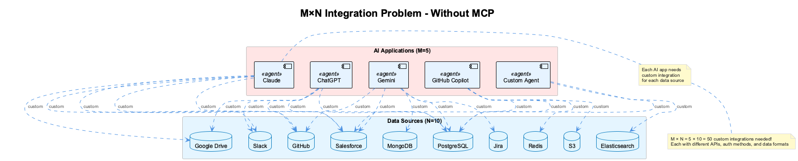

### The MCP Solution

MCP solves this integration explosion by providing a universal protocol that acts as a bridge between AI applications and data sources:

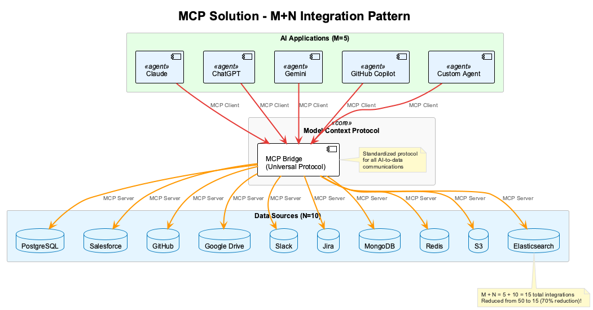

### Key Problems MCP Solves

1. **Integration Explosion**: Reduces M×N integrations to M+N by providing a standard protocol
2. **API Complexity**: Enterprise APIs often have complex authentication, data formats, and interaction patterns that are difficult for LLMs to navigate
3. **Context Management**: LLMs need structured ways to access and understand external data sources
4. **Tool Integration**: Different AI frameworks require different approaches to integrate the same tools
5. **Scalability**: Manual integration of each API with each AI system doesn't scale

### How MCP Works

MCP acts as a standardized bridge between LLMs and external systems:

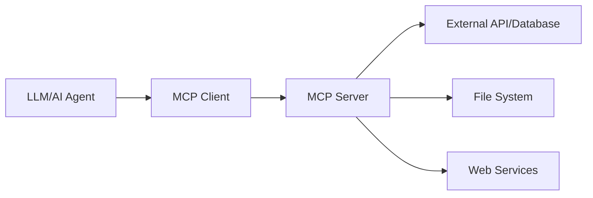

### MCP Architecture Components

1. **MCP Server**: Exposes capabilities (tools, resources, prompts) to clients
2. **MCP Client**: Connects to servers and makes capabilities available to LLMs
3. **Tools**: Functions that agents can call (e.g., database queries, API calls)
4. **Resources**: Data sources that agents can read (e.g., files, databases)
5. **Prompts**: Reusable prompt templates for common tasks

### Real-World Example

Instead of manually coding database queries for each AI agent, you create an MCP server that exposes standardized database operations:

```python
# MCP Server exposing database operations
@server.call_tool()
async def query_customers(query: str) -> list[dict]:
    """Query customer database with natural language"""
    # Convert natural language to SQL
    # Execute query safely
    # Return structured results
    return results
```

Any MCP-compatible AI system can now use this database functionality without custom integration code.

## What is ACP (Agent Communication Protocol)?

### Core Concept

The **Agent Communication Protocol (ACP)** is an open standard for agent interoperability that solves the growing challenge of connecting AI agents, applications, and humans. Originally developed by BeeAI and IBM, ACP is now maintained under the Linux Foundation as a community-driven standard for enabling structured communication, discovery, and coordination between AI agents.

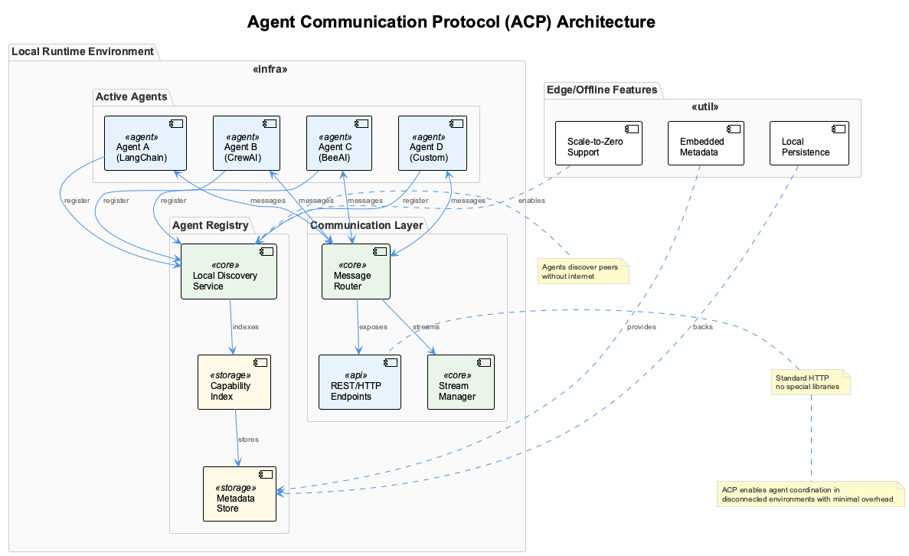

### Philosophy: Local-First, Minimal Overhead Agent Communication

ACP was designed with the principle that **agent communication should be simple, efficient, and work everywhere** - from cloud environments to edge devices without internet connectivity. Key principles include:

- **REST-native design**: Uses standard HTTP conventions requiring no specialized libraries
- **Local-first architecture**: Agents can discover and communicate within shared runtimes without cloud dependencies
- **Minimal specifications**: Focuses on essential compatibility rather than prescriptive implementations
- **Multimodal support**: Handles text, audio, video, and other data types seamlessly

### Key Problems ACP Solves

1. **Local Agent Discovery**: How do agents find each other in disconnected or edge environments?
2. **Efficient Communication**: How to minimize overhead in resource-constrained environments?
3. **Framework Agnosticism**: How can agents built with different frameworks communicate?
4. **Offline Operation**: How do agents collaborate without internet connectivity?
5. **Scale-to-Zero**: How to support dynamic resource allocation where agents aren't always online?

### ACP Architecture Components

1. **Agent Registry**: Local or distributed registry for agent discovery
   - Embedded metadata in agent packages
   - Dynamic registration and deregistration
   - Capability-based discovery

2. **Communication Layer**: REST-based messaging system
   - Multi-part HTTP messages for complex data
   - Asynchronous streaming support
   - Standard MIME types for content negotiation

3. **Discovery Mechanism**: Multiple discovery patterns
   - Local runtime discovery (same process/container)
   - Network discovery (LAN/edge networks)
   - Registry-based discovery (centralized or federated)

4. **Message Protocol**: Flexible message structure
   - Synchronous request-response
   - Asynchronous task delegation
   - Streaming for long-running operations
   - Stateful and stateless communication modes

### ACP Communication Patterns

```python
# ACP Agent Registration
class LocalAgent:
    def __init__(self, name, capabilities):
        self.metadata = {
            "name": name,
            "version": "1.0",
            "capabilities": capabilities,
            "endpoints": {
                "communicate": "/agent/communicate",
                "status": "/agent/status",
                "discover": "/agent/discover"
            },
            "protocols": ["http", "websocket"],
            "modalities": ["text", "audio", "video"]
        }
    
    async def register_local(self, registry):
        # Register with local runtime registry
        await registry.register(self.metadata)
    
    async def discover_peers(self, capability_filter=None):
        # Discover other agents in the local environment
        peers = await self.registry.discover(capability_filter)
        return peers
```

### ACP vs Other Protocols

| Aspect | MCP | ACP | A2A |
|--------|-----|-----|-----|
| **Focus** | LLM-to-tools connection | Local agent coordination | Cross-platform agent collaboration |
| **Environment** | Cloud/server-based | Edge/local-first | Web/enterprise |
| **Discovery** | Static configuration | Dynamic local discovery | Web-based discovery |
| **Protocol** | JSON-RPC | REST/HTTP | HTTP with Agent Cards |
| **Overhead** | Medium | Minimal | Higher |
| **Offline Support** | Limited | Excellent | Limited |
| **Primary Use Case** | Tool integration | Edge orchestration | Enterprise workflows |

### Real-World ACP Use Cases

1. **Factory Floor Automation**: Agents controlling robots and sensors communicate locally without internet
2. **Edge AI Orchestration**: Multiple AI models on edge devices coordinate processing tasks
3. **Offline Mobile Agents**: Apps with embedded agents that work in airplane mode
4. **IoT Device Coordination**: Smart home devices with agent-based intelligence
5. **Disconnected Military/Emergency Systems**: Critical systems that can't rely on cloud connectivity

## What is A2A (Agent-to-Agent) Protocol?

### Core Concept

**Agent-to-Agent (A2A)** is an open communication standard that enables AI agents to discover, communicate, and collaborate with each other across organizational and technical boundaries. A2A solves the critical problem of agent interoperability in distributed AI systems.

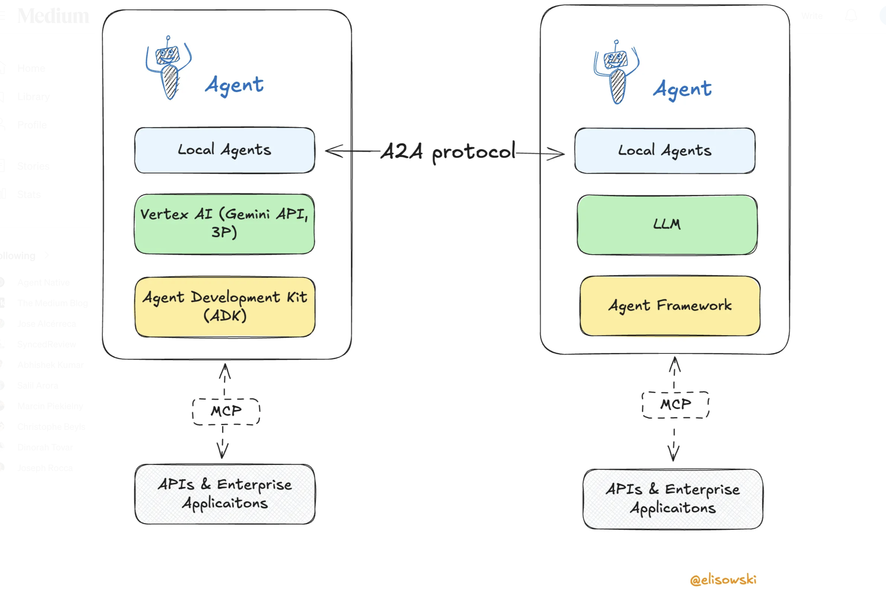

### Key Problems A2A Solves

1. **Agent Discovery**: How do agents find and connect with other relevant agents?
2. **Communication Standards**: How do agents exchange information and requests?
3. **Trust and Security**: How do agents verify identity and establish secure communication?
4. **Cross-Organization Collaboration**: How do agents work together across company boundaries?

### A2A Architecture

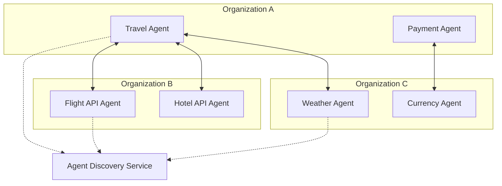

### A2A Communication Flow

1. **Agent Discovery**: Agents register their capabilities in a discovery service
2. **Capability Matching**: Requesting agents find suitable service agents
3. **Handshake**: Agents establish secure communication channels
4. **Task Delegation**: Agents exchange tasks and results using standardized protocols
5. **Result Integration**: Requesting agents integrate responses into their workflows

### A2A Discovery Mechanism

Agents advertise their capabilities through `.well-known/agent.json` files:

```json
{
  "agent": {
    "name": "flight_search_agent",
    "version": "1.0",
    "capabilities": [
      {
        "name": "search_flights",
        "description": "Search for available flights",
        "input_schema": {
          "origin": "string",
          "destination": "string", 
          "departure_date": "date"
        }
      }
    ],
    "communication": {
      "protocols": ["https", "websocket"],
      "authentication": ["oauth2", "api_key"]
    }
  }
}
```

## The Integration: How MCP, ACP, and A2A Work Together

### The Complete Agent Ecosystem

When combined, MCP, ACP, and A2A create a comprehensive ecosystem for agent communication at different levels:

1. **MCP** provides standardized access to external data and tools (agent-to-tool communication)
2. **ACP** enables efficient local agent coordination (agent-to-agent in same environment)
3. **A2A** facilitates cross-platform agent collaboration (agent-to-agent across organizations)

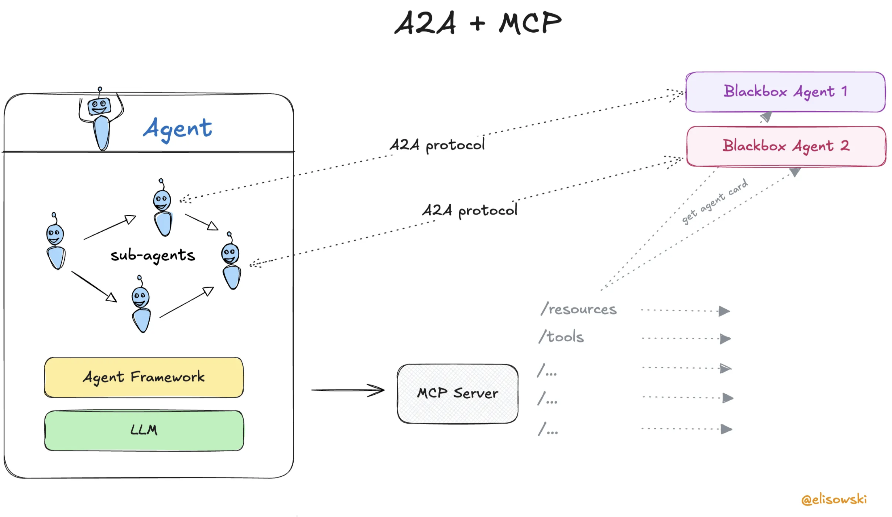

### Multi-Agent Travel Planning Example

Let's see how all three protocols work together in a real-world scenario:

```python
# Agent with MCP integration, ACP local coordination, and A2A communication
class TravelPlannerAgent(Agent):
    def __init__(self):
        super().__init__(name="travel_planner")
        
        # MCP integrations for tool access
        self.mcp_client = MCPClient()
        self.mcp_client.connect_to_server("database://customer-preferences")
        self.mcp_client.connect_to_server("file://travel-templates")
        
        # ACP for local agent coordination
        self.acp_registry = ACPRegistry()
        
        # A2A client for cross-platform agent communication
        self.a2a_client = A2AClient()
    
    async def plan_comprehensive_trip(self, user_request: str):
        # Step 1: Use MCP to access customer preferences
        preferences = await self.mcp_client.call_tool(
            "query_preferences", 
            {"user_id": user_request.user_id}
        )
        
        # Step 2: Use ACP to coordinate with local agents for quick tasks
        local_agents = await self.acp_registry.discover("data_processing")
        processed_data = await local_agents[0].process(preferences)
        
        # Step 3: Use A2A to find and communicate with external flight agents
        flight_agents = await self.a2a_client.discover_agents(
            capability="flight_search"
        )
        
        flights = []
        for agent in flight_agents:
            flight_options = await self.a2a_client.request_task(
                agent_id=agent.id,
                task="search_flights",
                parameters={
                    "origin": user_request.origin,
                    "destination": user_request.destination,
                    "dates": user_request.dates,
                    "preferences": preferences
                }
            )
            flights.extend(flight_options)
        
        # Step 4: Use A2A to find hotel agents
        hotel_agents = await self.a2a_client.discover_agents(
            capability="hotel_search"
        )
        
        hotels = await self.a2a_client.request_task(
            agent_id=hotel_agents[0].id,
            task="search_hotels", 
            parameters={
                "destination": user_request.destination,
                "check_in": user_request.check_in,
                "check_out": user_request.check_out,
                "preferences": preferences
            }
        )
        
        # Step 5: Use MCP to generate itinerary using templates
        itinerary = await self.mcp_client.call_tool(
            "generate_itinerary",
            {
                "flights": flights,
                "hotels": hotels,
                "template": "comprehensive_trip"
            }
        )
        
        return itinerary
```

### Benefits of the Integrated Approach

1. **Modularity**: Each component handles its specific concern
2. **Scalability**: Easy to add new capabilities and agents
3. **Interoperability**: Agents can work across different organizations and platforms
4. **Maintainability**: Standardized protocols reduce integration complexity
5. **Flexibility**: Agents can be developed using different frameworks while maintaining compatibility

### When to use what?

The following overview illustrated when to use which agent communication protocol (also introducing the [Agent Communication Protocol](https://agentcommunicationprotocol.dev/introduction/welcome), ACP):

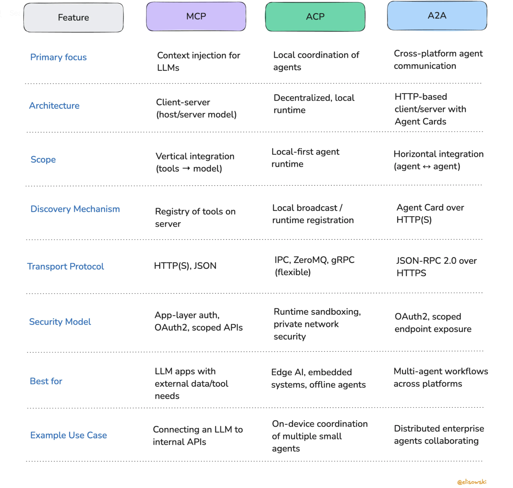

## MCP Inspector: Your Essential Development Tool

### What is MCP Inspector?

**MCP Inspector** is a powerful developer tool for testing, debugging, and validating MCP servers. Think of it as the Postman for MCP - it provides an interactive interface to explore MCP server capabilities and test functionality.

### Key Features

1. **Server Connection Testing**: Verify that your MCP server is running and accessible
2. **Capability Exploration**: Browse available tools, resources, and prompts
3. **Interactive Testing**: Execute tools and view results in real-time
4. **Debug Information**: View detailed logs and error messages
5. **Schema Validation**: Ensure your MCP server follows the protocol correctly

### Installing MCP Inspector

```bash
# Install via npm
npm install -g @modelcontextprotocol/inspector

# Or install via pip for Python environments
pip install mcp-inspector

# Or use npx for one-time usage
npx @modelcontextprotocol/inspector
```

### Using MCP Inspector

#### 1. Starting the Inspector

```bash
# Install and start inspector
npx @modelcontextprotocol/inspector

# Alternative: install globally first
npm install -g @modelcontextprotocol/inspector
mcp-inspector

# Start with specific configuration
mcp-inspector --config mcp-config.json
```

The inspector will start on `http://localhost:6274` and display a connection interface.

#### 2. Connecting to MCP Servers

Once the inspector is running, you'll see the main interface:

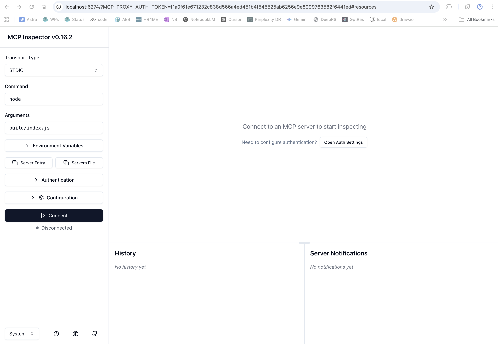

**Connection Interface:**

Behind the scenes, the connection interface of the MCP inspector is structured as follows:

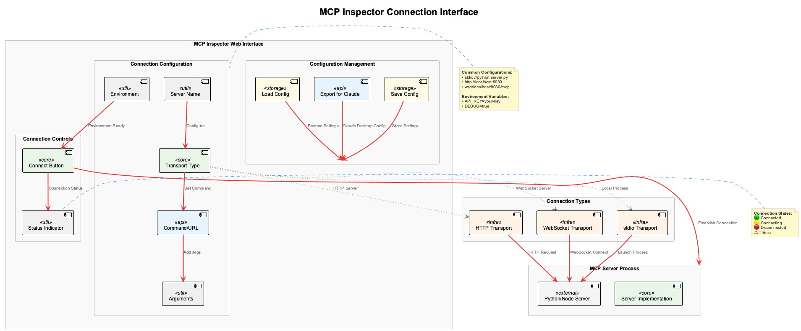

**Step-by-step connection:**
1. Open `http://localhost:6274` in your browser
2. Enter your MCP server configuration:
   - `stdio://python weather_server.py` (for local Python servers)
   - `http://localhost:8080` (for HTTP servers)
   - Or select from saved configurations
3. Click "Connect" to establish connection
4. Wait for the green "Connected" indicator

#### 3. Exploring Server Capabilities

Once connected, the inspector displays three main tabs with your server's capabilities:

**Main Interface After Connection:**

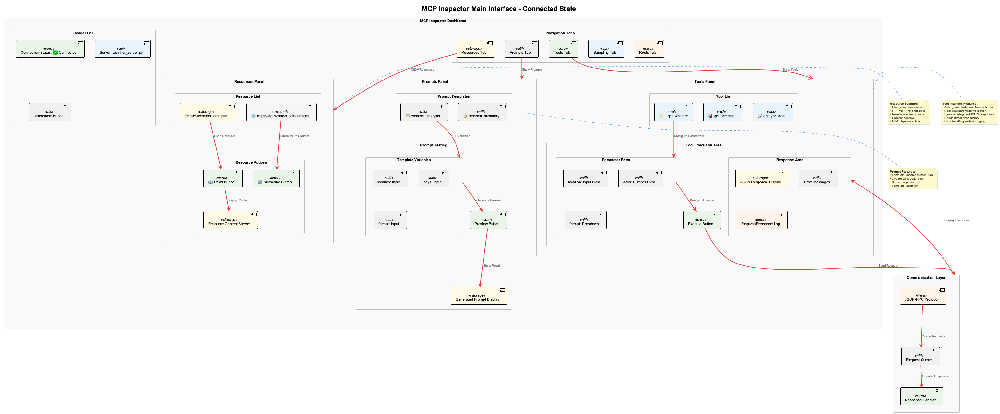

**Tools Tab Interface**: Interactive testing with auto-generated forms
- Each tool shows its name, description, and input parameters
- Input fields are automatically generated based on the tool's schema
- "Execute" button sends requests and displays responses in real-time
- Response area shows JSON results with syntax highlighting

**Example Tool Definition:**
```json
{
  "name": "get_weather",
  "description": "Get current weather for a location",
  "inputSchema": {
    "type": "object",
    "properties": {
      "location": {
        "type": "string",
        "description": "City name or coordinates"
      }
    },
    "required": ["location"]
  }
}
```

**Resources Tab Interface** (shown in main interface diagram above):

**Resources Tab Features:**
- Browse all available resources (files, URLs, data sources)
- View resource metadata (MIME types, descriptions)
- Read resource content directly in the browser
- Subscribe to dynamic resources for real-time updates

**Prompts Tab Interface** (shown in main interface diagram above):

**Prompt Template Definition:**
```json
{
  "name": "weather_analysis", 
  "description": "Generate weather analysis report",
  "arguments": [
    {
      "name": "location",
      "description": "City or region to analyze",
      "required": true
    },
    {
      "name": "days",
      "description": "Number of days to analyze", 
      "required": false
    }
  ]
}
```

#### 4. Testing Tools Interactively

The Tools tab provides a user-friendly way to test your MCP tools with real-time feedback:

**Interactive Testing Workflow:**

The complete tool testing workflow is shown in the following diagram, which illustrates the step-by-step process from tool selection to result display:

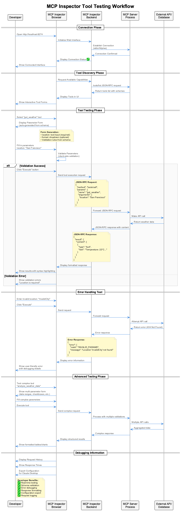

The workflow includes:
- **Tool Selection**: Choose from available tools with auto-generated forms
- **Parameter Input**: Fill in required and optional parameters with validation
- **Execution**: Send requests and receive real-time responses
- **Error Handling**: Display user-friendly error messages with debugging details
- **Result Display**: Show formatted responses with syntax highlighting

#### 5. Debugging Common Issues

The inspector helps identify common MCP server issues:

**Connection Problems**: 
- Server not responding on specified transport
- Incorrect server path or configuration
- Missing dependencies

**Protocol Violations**:
- Invalid JSON-RPC messages
- Missing required fields in tool definitions
- Incorrect schema formats

**Tool Execution Errors**:
- Runtime exceptions in tool implementations
- Invalid parameter types
- Missing error handling

### MCP Inspector Configuration

Create a configuration file to manage multiple server connections:

```json
{
  "servers": {
    "weather": {
      "command": "python",
      "args": ["weather_server.py"],
      "transport": "stdio"
    },
    "database": {
      "command": "node",
      "args": ["db_server.js"],
      "transport": "stdio",
      "env": {
        "DB_CONNECTION": "postgresql://localhost:5432/mydb"
      }
    },
    "file_system": {
      "command": "python", 
      "args": ["-m", "filesystem_server"],
      "transport": "stdio",
      "cwd": "/path/to/server"
    }
  }
}
```

### Complete MCP Inspector Workflow

Here's a practical example of using MCP Inspector to develop and test a weather MCP server:

#### **Development Workflow Example**

**Step 1: Start Your MCP Server**
```bash
# Terminal 1: Start your weather server
cd weather-mcp-server
python server.py
```

**Step 2: Launch MCP Inspector**
```bash
# Terminal 2: Start inspector
npx @modelcontextprotocol/inspector
```

**Step 3: Connect and Explore**

Use the MCP Inspector connection interface (shown in the diagram above) to configure your server connection with the appropriate transport type and parameters.

**Step 4: Test Each Capability**

Once connected, use the main inspector interface to systematically test each tool with different parameters and observe the results. The interface provides real-time feedback and detailed request/response information.

**Export Configuration:**
After testing, export your server configuration for use with AI clients:

```json
{
  "mcpServers": {
    "weather": {
      "command": "python",
      "args": ["server.py"],
      "env": {
        "API_KEY": "your-weather-api-key"
      }
    }
  }
}
```

### Best Practices for Using MCP Inspector

#### **Development Best Practices**

1. **Test-Driven MCP Development**: 
   - Write tool schemas first
   - Test with inspector before implementing logic
   - Validate error handling with invalid inputs

2. **Real-Time Feedback Loop**:
   ```
   Code → Save → Inspector Auto-Refresh → Test → Iterate
   ```

3. **Documentation Generation**:
   - Use inspector screenshots for documentation
   - Export tool schemas for API documentation
   - Test examples become usage documentation

#### **Production Validation**

**Pre-Deployment Checklist using MCP Inspector:**
```
☑ All tools execute without errors
☑ Resource subscriptions work properly  
☑ Prompt templates render correctly
☑ Error messages are user-friendly
☑ Input validation catches edge cases
☑ Response formats match schemas
☑ Performance is acceptable (<2s response time)
```

#### **Advanced Inspector Features**

**Export to AI Clients:**
- **Claude Desktop**: One-click export to `claude_desktop_config.json`
- **Cursor**: Export configuration for Cursor IDE
- **Custom Clients**: Generic JSON-RPC configuration

**Real-Time Monitoring:**

The MCP Inspector provides comprehensive real-time monitoring capabilities including:
- **Connection Status**: Live connection health monitoring
- **Request Metrics**: Track request counts, success rates, and response times
- **Activity Logs**: Recent request history with detailed timing information  
- **Performance Analytics**: Average response times and error rate analysis
- **Message History**: Complete JSON-RPC message logs for debugging

For detailed request/response flow analysis, refer to the following diagram:

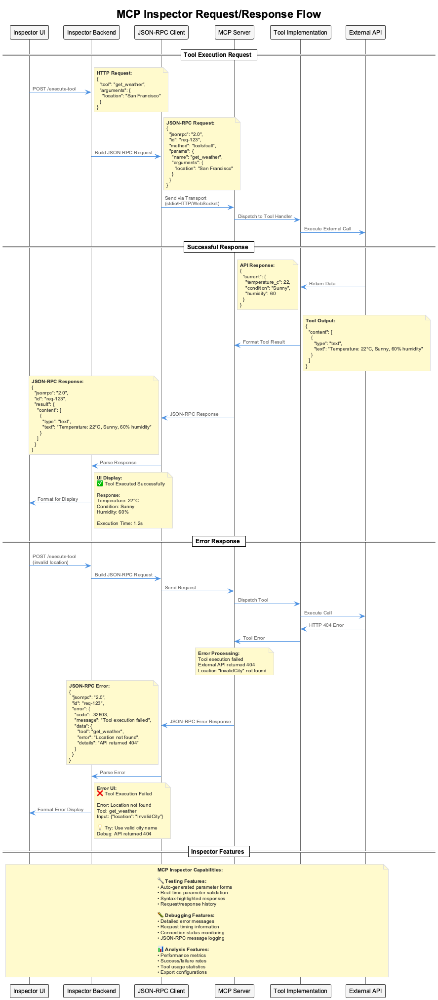

## Practical Applications and Use Cases

### 1. Enterprise Data Integration

**Scenario**: A company wants to make their customer database, inventory system, and analytics platform accessible to AI agents.

**Solution**: Create MCP servers for each system, use ACP for efficient local agent coordination, and enable A2A communication for cross-departmental agent collaboration.

### 2. Multi-Vendor Service Integration  

**Scenario**: A travel platform needs to integrate flight APIs from multiple airlines, hotel booking systems, and local activity providers.

**Solution**: Each vendor provides A2A-compatible agents, the platform uses ACP for local workflow coordination, and MCP servers handle the complex API integrations.

### 3. Research and Development Networks

**Scenario**: Research institutions want to share specialized AI capabilities (data analysis, simulation, modeling) across organizations.

**Solution**: Each institution deploys A2A-enabled agents with their specialized capabilities, researchers use ACP for efficient local agent orchestration, and MCP provides standardized access to research datasets and tools.

## Getting Started: Your Development Path

### Phase 1: Understanding MCP (Sessions 1-5)
- Build basic MCP servers and clients
- Integrate with file systems and databases  
- Add security and production deployment
- Master LangChain integration

### Phase 2: Mastering Agent Communication (Sessions 6-7)
- Understanding ACP for local agent coordination
- Implementing A2A for cross-platform collaboration
- Building multi-agent orchestration patterns

### Phase 3: Implementing A2A (Sessions 7-9)
- Build agent-to-agent communication
- Create advanced multi-agent workflows
- Deploy production agent systems

## Key Takeaways

1. **MCP** standardizes how AI agents access external data and tools, making integration simpler and more maintainable
2. **ACP** enables efficient local agent coordination with minimal overhead, perfect for edge and offline scenarios
3. **A2A** enables agents to discover and collaborate with each other across organizational boundaries
4. **Together**, these technologies create a powerful ecosystem for building scalable, interoperable AI agent systems
5. **MCP Inspector** is an essential tool for developing and debugging MCP servers effectively

## What's Next?

In the following sessions, you'll get hands-on experience building each component of this ecosystem. You'll start with basic MCP servers, progress through advanced agent architectures, and finish by deploying production-ready multi-agent systems that can operate at enterprise scale.

The future of AI is not single agents working in isolation, but collaborative networks of specialized agents that can work together to solve complex problems. MCP, ACP, and A2A are the foundational protocols that make this vision possible.

## Knowledge Check: Multiple Choice Quiz

Test your understanding of MCP, ACP, and A2A concepts with this comprehensive quiz.

### Question 1
What is the primary purpose of the Model Context Protocol (MCP)?

A) To enable direct communication between AI agents
B) To standardize how LLMs interact with external data sources and tools
C) To provide a framework for building AI agents
D) To manage agent discovery across organizations

### Question 2
Which component of MCP is responsible for exposing capabilities to clients?

A) MCP Client
B) MCP Tools
C) MCP Server
D) MCP Resources

### Question 3
What are the three main types of capabilities that MCP servers can expose?

A) Agents, Models, and Protocols
B) Tools, Resources, and Prompts
C) Servers, Clients, and Bridges
D) APIs, Databases, and Files

### Question 4
Which protocol is designed for local-first agent coordination with minimal overhead?

A) A2A (Agent-to-Agent)
B) MCP (Model Context Protocol)
C) ADK (Agent Development Kit)
D) ACP (Agent Communication Protocol)

### Question 5
What is a key advantage of ACP compared to other agent protocols?

A) It only works with cloud services
B) It enables offline operation and local discovery
C) It requires specialized SDK libraries
D) It doesn't support multimodal communication

### Question 6
How do agents discover each other in the A2A protocol?

A) Through manual configuration files
B) Using centralized agent registries only
C) Via `.well-known/agent.json` files and discovery services
D) Through direct IP address connections

### Question 7
What format does A2A use for agent capability advertisement?

A) XML configuration files
B) YAML metadata files
C) JSON capability descriptors
D) Protocol buffer definitions

### Question 8
In the travel planning example, which protocol handles local agent coordination for data processing?

A) A2A protocol
B) ACP registry
C) MCP client/server
D) Direct API calls

### Question 9
What is the primary function of MCP Inspector?

A) To deploy MCP servers to production
B) To test, debug, and validate MCP servers
C) To create new MCP protocols
D) To monitor agent-to-agent communication

### Question 10
Which command is used to install MCP Inspector via npm?

A) `npm install mcp-inspector`
B) `npm install -g @modelcontextprotocol/inspector`
C) `npm install @mcp/inspector`
D) `npm install -g mcp-protocol-inspector`

### Question 11
When should you use A2A protocol instead of MCP?

A) When you need to access local databases
B) When you need agents to communicate across organizational boundaries
C) When you need to expose tools to LLMs
D) When you need to manage prompt templates

### Question 12
What transport mechanism does MCP typically use for communication?

A) HTTP REST only
B) WebSocket only
C) stdio (standard input/output) and other transports
D) gRPC only

### Question 13
In ACP, how do agents discover each other in offline environments?

A) Through cloud-based registries only
B) Using local runtime discovery and embedded metadata
C) They cannot discover each other offline
D) Through manual configuration files

### Question 14
Which of the following is NOT a key problem that A2A solves?

A) Agent discovery
B) Communication standards
C) Model training optimization
D) Cross-organization collaboration

### Question 15
What is the recommended development path for mastering these protocols?

A) Start with A2A, then ACP, then MCP
B) Start with ACP, then MCP, then A2A
C) Start with MCP, then ACP, then A2A
D) Learn all three simultaneously

---

*Ready to build the future of AI agent systems? Let's start with Session 1: Building Your First MCP Server!*