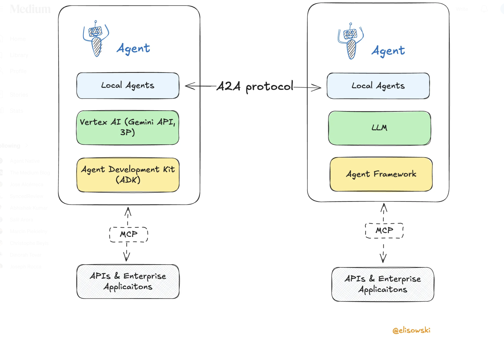

# Session 0: Introduction to MCP, ADK, and A2A - Building the Future of AI Agent Ecosystems

## Overview

Welcome to the world of next-generation AI agent systems! In this introductory session, we'll explore three revolutionary technologies that are reshaping how AI agents communicate, operate, and collaborate: **Model Context Protocol (MCP)**, **Agent Development Kit (ADK)**, and **Agent-to-Agent (A2A) protocol**.

These technologies form the backbone of modern multi-agent AI systems, enabling seamless communication, standardized interactions, and scalable agent ecosystems that can work across organizational and technical boundaries.

## What is MCP (Model Context Protocol)?

### Core Concept

The **Model Context Protocol (MCP)** is an open standard that transforms how Large Language Models (LLMs) interact with external data sources and tools. Think of MCP as the universal translator that makes enterprise APIs tool-agnostic and LLM-friendly.


### The M×N Integration Problem

Imagine a world where:
- **M = 5 different AI applications** (Claude, ChatGPT, Gemini, GitHub Copilot, Custom agents)
- **N = 10 different data sources** (PostgreSQL, Salesforce, GitHub, Google Drive, Slack, etc.)

Without MCP, you would need to build **50 custom integrations** (M × N = 5 × 10). Each AI application would need its own connector for each data source, leading to:

- **Exponential complexity**: Adding one new AI app requires N new integrations
- **Maintenance nightmare**: Changes to one data source require updates across M integrations
- **Inconsistent implementations**: Each integration might handle the same data source differently
- **Developer overhead**: Teams spend more time on integration plumbing than AI functionality


### Key Problems MCP Solves

1. **Integration Explosion**: Reduces M×N integrations to M+N by providing a standard protocol
2. **API Complexity**: Enterprise APIs often have complex authentication, data formats, and interaction patterns that are difficult for LLMs to navigate
3. **Context Management**: LLMs need structured ways to access and understand external data sources
4. **Tool Integration**: Different AI frameworks require different approaches to integrate the same tools
5. **Scalability**: Manual integration of each API with each AI system doesn't scale

### How MCP Works

MCP acts as a standardized bridge between LLMs and external systems:


### MCP Architecture Components

1. **MCP Server**: Exposes capabilities (tools, resources, prompts) to clients
2. **MCP Client**: Connects to servers and makes capabilities available to LLMs
3. **Tools**: Functions that agents can call (e.g., database queries, API calls)
4. **Resources**: Data sources that agents can read (e.g., files, databases)
5. **Prompts**: Reusable prompt templates for common tasks

### Real-World Example

Instead of manually coding database queries for each AI agent, you create an MCP server that exposes standardized database operations:

```python
# MCP Server exposing database operations
@server.call_tool()
async def query_customers(query: str) -> list[dict]:
    """Query customer database with natural language"""
    # Convert natural language to SQL
    # Execute query safely
    # Return structured results
    return results
```

Any MCP-compatible AI system can now use this database functionality without custom integration code.

## What is ADK (Agent Development Kit)?

### Core Concept

Google's **Agent Development Kit (ADK)** is an open-source, code-first Python framework for building, evaluating, and deploying sophisticated AI agents with flexibility and control. Released in 2025, ADK is the same framework powering agents within Google products like Agentspace and the Google Customer Engagement Suite.


### Philosophy: Making Agent Development Feel Like Software Development

ADK was designed with the principle that **agent development should feel like traditional software development**. This means:

- **Code-first approach**: Define agent logic directly in Python, not configuration files
- **Testability**: Write unit tests for agent behaviors and tool integrations
- **Version control**: Manage agent logic like any other software artifact
- **Modularity**: Compose complex systems from reusable agent components

### Core Architecture Components

ADK's architecture consists of several key components that work together:

1. **Agents**: The central decision-making entities
   - **LLM Agents**: Use Large Language Models for intelligent reasoning
   - **Workflow Agents**: Orchestrate other agents in complex patterns
   - **Custom Agents**: Specialized implementations for unique requirements

2. **Tools**: Functions that agents can use to perform actions
   - Pre-built tools (Search, Code Execution, File Operations)
   - Model Context Protocol (MCP) tools
   - Third-party integrations (LangChain, LlamaIndex)
   - Other agents as tools (hierarchical composition)

3. **Runners**: Components that manage agent execution flow
   - Handle message routing and state management
   - Orchestrate communication between agents
   - Manage event-driven workflows

4. **Sessions**: Maintain conversation context and state
   - Persistent memory across interactions
   - User preference learning
   - Multi-turn conversation management

5. **Events**: Communication mechanism between components
   - Represent steps in agent execution
   - Enable debugging and monitoring
   - Support real-time streaming interactions

### Key Features of ADK

1. **Multi-Agent by Design**: Build modular, scalable applications by composing multiple specialized agents in hierarchical, parallel, or sequential workflows

2. **Model Flexibility**: Works with Gemini (optimized), Vertex AI Model Garden, and LiteLLM integration for providers like Anthropic, Meta, Mistral AI, and AI21 Labs

3. **Built-in Orchestration**: Handle complex workflows with multiple steps, decision points, and error recovery

4. **Rich Tool Ecosystem**: Seamlessly integrate with various APIs, databases, and services using standardized tool interfaces

5. **Streaming Capabilities**: Support real-time interaction including bidirectional audio/video streaming

6. **Agent-to-Agent Communication**: Built-in A2A protocol support for cross-organizational collaboration

7. **Production Ready**: Easy containerization and deployment to Cloud Run, Kubernetes, or Vertex AI

### ADK Agent Structure

```python
from adk import Agent, Tool

class TravelAgent(Agent):
    def __init__(self):
        super().__init__(
            name="travel_planner",
            description="Comprehensive travel planning agent",
            tools=[
                FlightSearchTool(),
                HotelBookingTool(),
                WeatherTool()
            ]
        )
    
    async def plan_trip(self, destination: str, dates: tuple) -> dict:
        # Complex multi-step planning logic
        flights = await self.search_flights(destination, dates)
        hotels = await self.search_hotels(destination, dates)
        weather = await self.get_weather(destination, dates)
        
        return self.create_itinerary(flights, hotels, weather)
```

### ADK vs Traditional AI Frameworks

| Feature | Traditional Frameworks | ADK |
|---------|----------------------|-----|
| Agent Orchestration | Manual implementation | Built-in orchestration engine |
| Error Handling | Custom error handling | Automatic retry and fallback |
| State Management | External state stores | Integrated state management |
| Tool Integration | Framework-specific | Universal tool interface |
| Cross-Framework Support | Limited | Works with multiple frameworks |

## What is A2A (Agent-to-Agent) Protocol?

### Core Concept

**Agent-to-Agent (A2A)** is an open communication standard that enables AI agents to discover, communicate, and collaborate with each other across organizational and technical boundaries. A2A solves the critical problem of agent interoperability in distributed AI systems.



### Key Problems A2A Solves

1. **Agent Discovery**: How do agents find and connect with other relevant agents?
2. **Communication Standards**: How do agents exchange information and requests?
3. **Trust and Security**: How do agents verify identity and establish secure communication?
4. **Cross-Organization Collaboration**: How do agents work together across company boundaries?

### A2A Architecture


### A2A Communication Flow

1. **Agent Discovery**: Agents register their capabilities in a discovery service
2. **Capability Matching**: Requesting agents find suitable service agents
3. **Handshake**: Agents establish secure communication channels
4. **Task Delegation**: Agents exchange tasks and results using standardized protocols
5. **Result Integration**: Requesting agents integrate responses into their workflows

### A2A Discovery Mechanism

Agents advertise their capabilities through `.well-known/agent.json` files:

```json
{
  "agent": {
    "name": "flight_search_agent",
    "version": "1.0",
    "capabilities": [
      {
        "name": "search_flights",
        "description": "Search for available flights",
        "input_schema": {
          "origin": "string",
          "destination": "string", 
          "departure_date": "date"
        }
      }
    ],
    "communication": {
      "protocols": ["https", "websocket"],
      "authentication": ["oauth2", "api_key"]
    }
  }
}
```

## The Integration: How MCP, ADK, and A2A Work Together

### The Complete Agent Ecosystem

When combined, MCP, ADK, and A2A create a powerful ecosystem for building and orchestrating AI agents:

1. **MCP** provides standardized access to external data and tools
2. **ADK** provides the framework for building sophisticated agent behaviors
3. **A2A** enables agents to discover and collaborate with other agents


### Multi-Agent Travel Planning Example

Let's see how all three technologies work together in a real-world scenario:

```python
# ADK Agent with MCP integration and A2A communication
class TravelPlannerAgent(Agent):
    def __init__(self):
        super().__init__(name="travel_planner")
        
        # MCP integrations for local capabilities
        self.mcp_client = MCPClient()
        self.mcp_client.connect_to_server("database://customer-preferences")
        self.mcp_client.connect_to_server("file://travel-templates")
        
        # A2A client for external agent communication
        self.a2a_client = A2AClient()
    
    async def plan_comprehensive_trip(self, user_request: str):
        # Step 1: Use MCP to access customer preferences
        preferences = await self.mcp_client.call_tool(
            "query_preferences", 
            {"user_id": user_request.user_id}
        )
        
        # Step 2: Use A2A to find and communicate with flight agents
        flight_agents = await self.a2a_client.discover_agents(
            capability="flight_search"
        )
        
        flights = []
        for agent in flight_agents:
            flight_options = await self.a2a_client.request_task(
                agent_id=agent.id,
                task="search_flights",
                parameters={
                    "origin": user_request.origin,
                    "destination": user_request.destination,
                    "dates": user_request.dates,
                    "preferences": preferences
                }
            )
            flights.extend(flight_options)
        
        # Step 3: Use A2A to find hotel agents
        hotel_agents = await self.a2a_client.discover_agents(
            capability="hotel_search"
        )
        
        hotels = await self.a2a_client.request_task(
            agent_id=hotel_agents[0].id,
            task="search_hotels", 
            parameters={
                "destination": user_request.destination,
                "check_in": user_request.check_in,
                "check_out": user_request.check_out,
                "preferences": preferences
            }
        )
        
        # Step 4: Use MCP to generate itinerary using templates
        itinerary = await self.mcp_client.call_tool(
            "generate_itinerary",
            {
                "flights": flights,
                "hotels": hotels,
                "template": "comprehensive_trip"
            }
        )
        
        return itinerary
```

### Benefits of the Integrated Approach

1. **Modularity**: Each component handles its specific concern
2. **Scalability**: Easy to add new capabilities and agents
3. **Interoperability**: Agents can work across different organizations and platforms
4. **Maintainability**: Standardized protocols reduce integration complexity
5. **Flexibility**: Agents can be developed using different frameworks while maintaining compatibility

### When to use what?

The following overview illustrated when to use which agent communication protocol (also introducing the [Agent Communication Protocol](https://agentcommunicationprotocol.dev/introduction/welcome), ACP):


## MCP Inspector: Your Essential Development Tool

### What is MCP Inspector?

**MCP Inspector** is a powerful developer tool for testing, debugging, and validating MCP servers. Think of it as the Postman for MCP - it provides an interactive interface to explore MCP server capabilities and test functionality.

### Key Features

1. **Server Connection Testing**: Verify that your MCP server is running and accessible
2. **Capability Exploration**: Browse available tools, resources, and prompts
3. **Interactive Testing**: Execute tools and view results in real-time
4. **Debug Information**: View detailed logs and error messages
5. **Schema Validation**: Ensure your MCP server follows the protocol correctly

### Installing MCP Inspector

```bash
# Install via npm
npm install -g @modelcontextprotocol/inspector

# Or install via pip for Python environments
pip install mcp-inspector

# Or use npx for one-time usage
npx @modelcontextprotocol/inspector
```

### Using MCP Inspector

#### 1. Starting the Inspector

```bash
# Start inspector with default settings
mcp-inspector

# Start with specific server configuration
mcp-inspector --config mcp-config.json

# Start on specific port
mcp-inspector --port 3000
```

#### 2. Connecting to MCP Servers

Once the inspector is running, you can connect to MCP servers through the web interface:

1. Open `http://localhost:3000` in your browser
2. Enter your MCP server URL (e.g., `stdio://python weather_server.py`)
3. Click "Connect" to establish connection

#### 3. Exploring Server Capabilities

The inspector provides several tabs for exploring your MCP server:

**Tools Tab**: View and test all available tools
```json
{
  "name": "get_weather",
  "description": "Get current weather for a location",
  "inputSchema": {
    "type": "object",
    "properties": {
      "location": {
        "type": "string",
        "description": "City name or coordinates"
      }
    },
    "required": ["location"]
  }
}
```

**Resources Tab**: Browse available data resources
```json
{
  "uri": "file://customer_data.json",
  "name": "Customer Database",
  "description": "Customer information and preferences",
  "mimeType": "application/json"
}
```

**Prompts Tab**: Test prompt templates
```json
{
  "name": "analyze_data",
  "description": "Template for data analysis tasks",
  "arguments": [
    {
      "name": "dataset",
      "description": "The dataset to analyze",
      "required": true
    }
  ]
}
```

#### 4. Testing Tools Interactively

In the Tools tab, you can:

1. Select a tool from the list
2. Fill in the required parameters
3. Click "Execute" to run the tool
4. View the response and any error messages

Example tool execution:
```json
// Input
{
  "location": "San Francisco, CA"
}

// Output
{
  "temperature": 22,
  "condition": "Sunny",
  "humidity": 60,
  "wind_speed": 8
}
```

#### 5. Debugging Common Issues

The inspector helps identify common MCP server issues:

**Connection Problems**: 
- Server not responding on specified transport
- Incorrect server path or configuration
- Missing dependencies

**Protocol Violations**:
- Invalid JSON-RPC messages
- Missing required fields in tool definitions
- Incorrect schema formats

**Tool Execution Errors**:
- Runtime exceptions in tool implementations
- Invalid parameter types
- Missing error handling

### MCP Inspector Configuration

Create a configuration file to manage multiple server connections:

```json
{
  "servers": {
    "weather": {
      "command": "python",
      "args": ["weather_server.py"],
      "transport": "stdio"
    },
    "database": {
      "command": "node",
      "args": ["db_server.js"],
      "transport": "stdio",
      "env": {
        "DB_CONNECTION": "postgresql://localhost:5432/mydb"
      }
    },
    "file_system": {
      "command": "python", 
      "args": ["-m", "filesystem_server"],
      "transport": "stdio",
      "cwd": "/path/to/server"
    }
  }
}
```

### Best Practices for Using MCP Inspector

1. **Development Workflow**: Use inspector during development to test each tool as you implement it
2. **Integration Testing**: Validate that all tools work correctly before integrating with AI agents
3. **Documentation**: Use inspector output to document your MCP server's capabilities
4. **Debugging**: Use detailed logs to troubleshoot issues in production servers
5. **Schema Validation**: Ensure your tool schemas are correctly defined and documented

## Practical Applications and Use Cases

### 1. Enterprise Data Integration

**Scenario**: A company wants to make their customer database, inventory system, and analytics platform accessible to AI agents.

**Solution**: Create MCP servers for each system, use ADK to build specialized agents for different business functions, and enable A2A communication for cross-departmental agent collaboration.

### 2. Multi-Vendor Service Integration  

**Scenario**: A travel platform needs to integrate flight APIs from multiple airlines, hotel booking systems, and local activity providers.

**Solution**: Each vendor provides A2A-compatible agents, the platform uses ADK to orchestrate booking workflows, and MCP servers handle the complex API integrations.

### 3. Research and Development Networks

**Scenario**: Research institutions want to share specialized AI capabilities (data analysis, simulation, modeling) across organizations.

**Solution**: Each institution deploys A2A-enabled agents with their specialized capabilities, researchers use ADK-built orchestration agents to compose complex research workflows, and MCP provides standardized access to research datasets and tools.

## Getting Started: Your Development Path

### Phase 1: Understanding MCP (Sessions 1-5)
- Build basic MCP servers and clients
- Integrate with file systems and databases  
- Add security and production deployment
- Master LangChain integration

### Phase 2: Mastering ADK (Session 6)
- Create your first ADK agent
- Understand agent orchestration patterns
- Implement complex agent behaviors

### Phase 3: Implementing A2A (Sessions 7-9)
- Build agent-to-agent communication
- Create advanced multi-agent workflows
- Deploy production agent systems

## Key Takeaways

1. **MCP** standardizes how AI agents access external data and tools, making integration simpler and more maintainable
2. **ADK** provides the framework for building sophisticated agents with complex behaviors and error handling
3. **A2A** enables agents to discover and collaborate with each other across organizational boundaries
4. **Together**, these technologies create a powerful ecosystem for building scalable, interoperable AI agent systems
5. **MCP Inspector** is an essential tool for developing and debugging MCP servers effectively

## What's Next?

In the following sessions, you'll get hands-on experience building each component of this ecosystem. You'll start with basic MCP servers, progress through advanced agent architectures, and finish by deploying production-ready multi-agent systems that can operate at enterprise scale.

The future of AI is not single agents working in isolation, but collaborative networks of specialized agents that can work together to solve complex problems. MCP, ADK, and A2A are the foundational technologies that make this vision possible.

## Knowledge Check: Multiple Choice Quiz

Test your understanding of MCP, ADK, and A2A concepts with this comprehensive quiz.

### Question 1
What is the primary purpose of the Model Context Protocol (MCP)?

A) To enable direct communication between AI agents
B) To standardize how LLMs interact with external data sources and tools
C) To provide a framework for building AI agents
D) To manage agent discovery across organizations

### Question 2
Which component of MCP is responsible for exposing capabilities to clients?

A) MCP Client
B) MCP Tools
C) MCP Server
D) MCP Resources

### Question 3
What are the three main types of capabilities that MCP servers can expose?

A) Agents, Models, and Protocols
B) Tools, Resources, and Prompts
C) Servers, Clients, and Bridges
D) APIs, Databases, and Files

### Question 4
Which Google technology provides a flexible orchestration framework for developing AI agents?

A) A2A (Agent-to-Agent)
B) MCP (Model Context Protocol)
C) ADK (Agent Development Kit)
D) ACP (Agent Communication Protocol)

### Question 5
What is a key advantage of ADK compared to traditional AI frameworks?

A) It only works with Google's models
B) It has built-in orchestration and error handling
C) It requires less computational resources
D) It doesn't support external tool integration

### Question 6
How do agents discover each other in the A2A protocol?

A) Through manual configuration files
B) Using centralized agent registries only
C) Via `.well-known/agent.json` files and discovery services
D) Through direct IP address connections

### Question 7
What format does A2A use for agent capability advertisement?

A) XML configuration files
B) YAML metadata files
C) JSON capability descriptors
D) Protocol buffer definitions

### Question 8
In the travel planning example, which technology handles access to customer preferences stored in a database?

A) A2A protocol
B) ADK orchestration
C) MCP client/server
D) Direct API calls

### Question 9
What is the primary function of MCP Inspector?

A) To deploy MCP servers to production
B) To test, debug, and validate MCP servers
C) To create new MCP protocols
D) To monitor agent-to-agent communication

### Question 10
Which command is used to install MCP Inspector via npm?

A) `npm install mcp-inspector`
B) `npm install -g @modelcontextprotocol/inspector`
C) `npm install @mcp/inspector`
D) `npm install -g mcp-protocol-inspector`

### Question 11
When should you use A2A protocol instead of MCP?

A) When you need to access local databases
B) When you need agents to communicate across organizational boundaries
C) When you need to expose tools to LLMs
D) When you need to manage prompt templates

### Question 12
What transport mechanism does MCP typically use for communication?

A) HTTP REST only
B) WebSocket only
C) stdio (standard input/output) and other transports
D) gRPC only

### Question 13
In ADK, what happens when an agent encounters an error during task execution?

A) The agent stops and returns an error immediately
B) The agent has built-in retry and fallback mechanisms
C) The agent requires manual intervention to continue
D) The agent restarts from the beginning

### Question 14
Which of the following is NOT a key problem that A2A solves?

A) Agent discovery
B) Communication standards
C) Model training optimization
D) Cross-organization collaboration

### Question 15
What is the recommended development path for mastering this technology stack?

A) Start with A2A, then ADK, then MCP
B) Start with ADK, then MCP, then A2A
C) Start with MCP, then ADK, then A2A
D) Learn all three simultaneously

---

*Ready to build the future of AI agent systems? Let's start with Session 1: Building Your First MCP Server!*