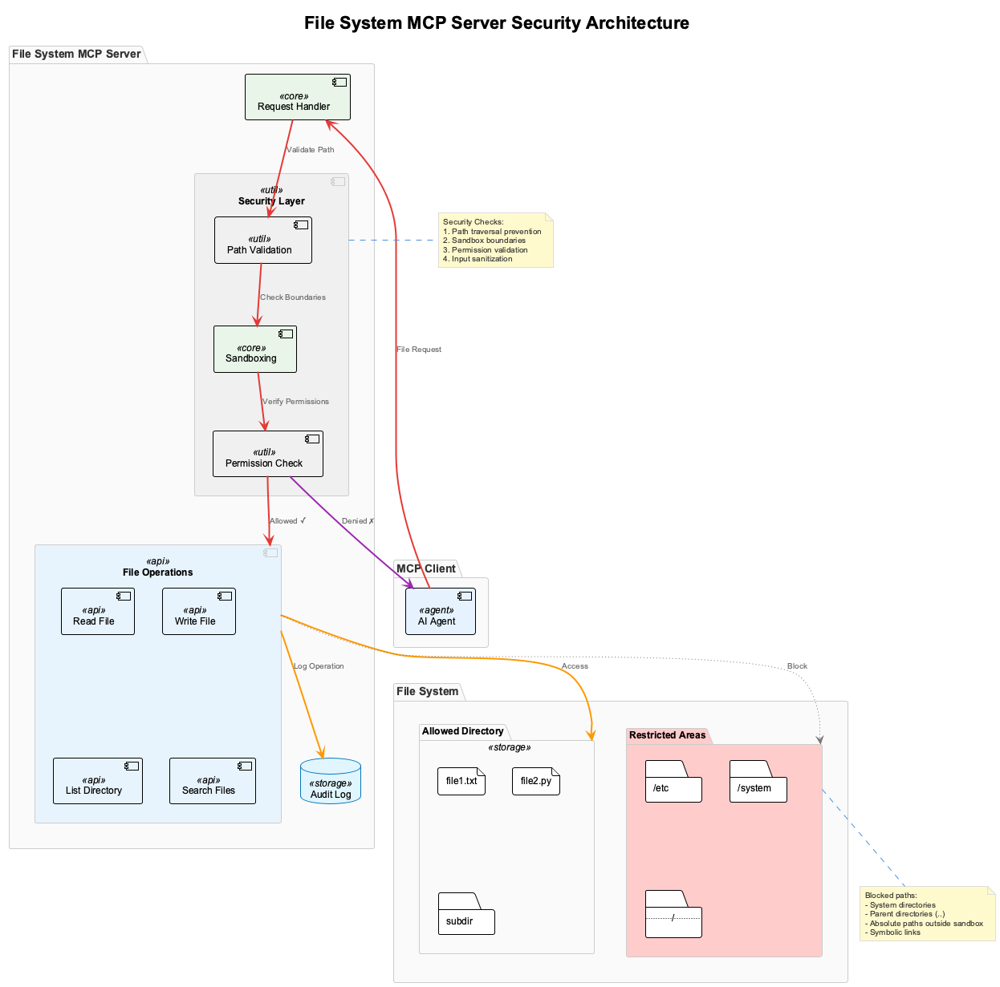

# Session 2: Building a Secure File System MCP Server

## 🎯 Learning Outcomes

By the end of this session, you will be able to:
- **Build** a production-grade file system MCP server with comprehensive security features
- **Implement** sandboxing to prevent unauthorized file access and path traversal attacks
- **Handle** both text and binary files with proper encoding and streaming
- **Create** advanced search capabilities for finding files by content or metadata
- **Apply** security best practices including input validation, audit logging, and permission checks

## 📚 Chapter Overview

In this session, we'll build a file system MCP server that safely exposes file operations to AI agents. This is a critical use case - allowing AI to read documentation, analyze code, and manage files while maintaining strict security boundaries.



The diagram above illustrates our multi-layered security approach:
- **Path Validation**: Prevents directory traversal attacks
- **Sandboxing**: Restricts access to a specific directory tree
- **Permission Checks**: Validates operations before execution
- **Audit Logging**: Tracks all file operations for security monitoring

---

## Part 1: Project Setup and Configuration (10 minutes)

### Understanding the Security Challenge

Before we start coding, let's understand why file system access is dangerous. Without proper security:
- Users could read sensitive system files (`/etc/passwd`, `C:\Windows\System32`)
- Path traversal attacks (`../../../etc/passwd`) could escape intended directories
- Malicious files could be written to critical locations
- Large files could cause denial of service

Our server will implement defense-in-depth to prevent these attacks.

### Step 1.1: Create Enhanced Project Structure

Let's set up a well-organized project with proper separation of concerns:

```bash
# Create project directory
mkdir mcp-filesystem-server
cd mcp-filesystem-server

# Create virtual environment
python -m venv venv
source venv/bin/activate  # On Windows: venv\Scripts\activate

# Install dependencies
pip install fastmcp aiofiles watchdog python-magic-bin
```

**New dependencies explained:**
- `aiofiles`: Asynchronous file I/O for better performance
- `watchdog`: Monitor file system changes in real-time
- `python-magic-bin`: Detect file types securely (includes libmagic binaries)

### Step 1.2: Project Structure

Our production-ready structure separates concerns into modules:

```
mcp-filesystem-server/
├── filesystem_server.py    # Main server implementation
├── file_watcher.py        # Real-time file monitoring
├── config.py              # Configuration and settings
├── utils/                 # Utility modules
│   ├── __init__.py
│   ├── validators.py      # File validation logic
│   └── sandbox.py         # Security sandboxing
├── tests/                 # Unit tests
│   └── test_filesystem.py
└── requirements.txt       # Dependencies
```

### Step 1.3: Configuration Module

First, let's create a configuration module that centralizes all settings. This makes the server easily customizable without changing code:

```python
# config.py
import os
from pathlib import Path
from typing import List, Set

class FileSystemConfig:
    """Configuration for the file system MCP server."""
    
    def __init__(self, base_path: str = None):
        # Set base path (sandbox root) - this is the ONLY directory we can access
        self.base_path = Path(base_path or os.getcwd()) / "sandbox"
        self.base_path.mkdir(exist_ok=True)
        
        # Security settings
        self.max_file_size = 10 * 1024 * 1024  # 10MB limit prevents DoS
        
        # Only allow safe file extensions (whitelist approach)
        self.allowed_extensions: Set[str] = {
            '.txt', '.md', '.json', '.yaml', '.yml',
            '.py', '.js', '.ts', '.html', '.css',
            '.csv', '.log', '.conf', '.ini'
        }
        
        # Forbidden patterns that might indicate path traversal
        self.forbidden_patterns: List[str] = [
            '..', '~/', '/etc/', '/usr/', '/var/',
            'C:\\Windows', 'C:\\Program Files'
        ]
        
        # Performance settings
        self.chunk_size = 8192  # For streaming large files
        self.search_limit = 1000  # Max search results to prevent overload
```

**Security decisions explained:**
- **Whitelist extensions**: Only allow known safe file types
- **Size limits**: Prevent memory exhaustion attacks
- **Forbidden patterns**: Block obvious path traversal attempts

---

## Part 2: Security and Validation (20 minutes)

### Step 2.1: Path Validation and Sandboxing

The sandbox is our primary security boundary. Every file path must be validated to ensure it stays within the allowed directory:

```python
# utils/sandbox.py
from pathlib import Path
from typing import Optional
import os

class SandboxError(Exception):
    """Raised when attempting to access files outside sandbox."""
    pass

class FileSystemSandbox:
    """Ensures all file operations stay within allowed directories."""
    
    def __init__(self, base_path: Path):
        # Resolve to absolute path to prevent tricks with relative paths
        self.base_path = base_path.resolve()
    
    def validate_path(self, path: str) -> Path:
        """
        Validate and resolve a path within the sandbox.
        
        This is our critical security function - it prevents directory traversal
        attacks by ensuring all paths resolve within our sandbox.
        
        Args:
            path: Requested file path (can be relative or absolute)
            
        Returns:
            Resolved safe path within sandbox
            
        Raises:
            SandboxError: If path escapes sandbox
        """
        try:
            # Convert string to Path and resolve all symlinks and '..' components
            requested_path = (self.base_path / path).resolve()
            
            # Critical check: ensure resolved path is within sandbox
            # This prevents attacks like "../../etc/passwd"
            if not str(requested_path).startswith(str(self.base_path)):
                raise SandboxError(f"Path '{path}' escapes sandbox")
            
            return requested_path
            
        except Exception as e:
            # Any path resolution errors are security errors
            raise SandboxError(f"Invalid path '{path}': {str(e)}")
    
    def is_safe_filename(self, filename: str) -> bool:
        """
        Check if filename is safe (no directory separators or special chars).
        
        This prevents creating files with names like "../evil.sh"
        """
        dangerous_chars = ['/', '\\', '..', '~', '\0']
        return not any(char in filename for char in dangerous_chars)
```

**Security insights:**
- `resolve()` is crucial - it resolves symlinks and normalizes paths
- String prefix check ensures the resolved path stays in sandbox
- Filename validation prevents directory separator injection

### Step 2.2: File Validators

Next, we need validators to check file types and prevent malicious file operations:

```python
# utils/validators.py
from pathlib import Path
from typing import Dict, Any
import magic
import hashlib

class FileValidator:
    """Validates files for safety and compliance."""
    
    def __init__(self, config):
        self.config = config
        # python-magic can detect file types by content, not just extension
        self.mime = magic.Magic(mime=True)
    
    def validate_file_size(self, path: Path) -> bool:
        """Check if file size is within limits to prevent DoS."""
        return path.stat().st_size <= self.config.max_file_size
    
    def validate_file_type(self, path: Path) -> Dict[str, Any]:
        """
        Validate file type and return metadata.
        
        We check both extension AND content to prevent disguised files.
        """
        extension = path.suffix.lower()
        
        # Get MIME type by reading file content (more secure than trusting extension)
        mime_type = self.mime.from_file(str(path))
        
        # Check against allowed extensions
        allowed = extension in self.config.allowed_extensions
        
        # Detect if file is text or binary for proper handling
        is_text = mime_type.startswith('text/') or mime_type in [
            'application/json', 'application/xml', 'application/yaml'
        ]
        
        return {
            "allowed": allowed,
            "extension": extension,
            "mime_type": mime_type,
            "is_text": is_text,
            "is_binary": not is_text
        }
    
    def calculate_checksum(self, path: Path) -> str:
        """
        Calculate SHA256 checksum of file.
        
        Useful for integrity verification and change detection.
        """
        sha256_hash = hashlib.sha256()
        
        # Read in chunks to handle large files efficiently
        with open(path, "rb") as f:
            for byte_block in iter(lambda: f.read(4096), b""):
                sha256_hash.update(byte_block)
                
        return sha256_hash.hexdigest()
```

---

## Part 3: Building the File System MCP Server (30 minutes)

Now let's build the main server with our security layers in place.

### Step 3.1: Server Initialization

We'll start by importing our security modules and initializing the server:

```python
# filesystem_server.py
from mcp.server.fastmcp import FastMCP
import aiofiles
from pathlib import Path
from datetime import datetime
from typing import Dict, List, Optional, AsyncIterator
import json
import base64
import logging

from config import FileSystemConfig
from utils.sandbox import FileSystemSandbox, SandboxError
from utils.validators import FileValidator

# Set up logging for security auditing
logging.basicConfig(
    level=logging.INFO,
    format='%(asctime)s - %(name)s - %(levelname)s - %(message)s'
)
logger = logging.getLogger(__name__)

# Initialize server components
config = FileSystemConfig()
mcp = FastMCP("File System Server")
sandbox = FileSystemSandbox(config.base_path)
validator = FileValidator(config)

# Store for file watchers (for real-time monitoring)
active_watchers = {}

# Log server startup
logger.info(f"File System MCP Server initialized with sandbox at: {config.base_path}")
```

### Step 3.2: File Listing and Navigation Tools

Let's implement tools for safely browsing the file system:

```python
@mcp.tool()
async def list_directory(path: str = ".", pattern: str = "*") -> Dict:
    """
    List files and directories safely within the sandbox.
    
    This tool allows AI agents to explore the file system structure
    while ensuring they cannot access unauthorized locations.
    
    Args:
        path: Directory path relative to sandbox root
        pattern: Glob pattern for filtering (e.g., "*.txt", "test_*")
    
    Returns:
        Directory contents with metadata
    """
    try:
        # First, validate the path is safe
        safe_path = sandbox.validate_path(path)
        
        # Ensure it's actually a directory
        if not safe_path.is_dir():
            return {"error": f"'{path}' is not a directory"}
        
        items = []
        # Use glob to support patterns like "*.py"
        for item in safe_path.glob(pattern):
            # Calculate relative path for display
            relative_path = item.relative_to(config.base_path)
            
            # Gather metadata about each item
            stat = item.stat()
            items.append({
                "name": item.name,
                "path": str(relative_path),
                "type": "directory" if item.is_dir() else "file",
                "size": stat.st_size if item.is_file() else None,
                "modified": datetime.fromtimestamp(stat.st_mtime).isoformat(),
                "permissions": oct(stat.st_mode)[-3:]  # Unix-style permissions
            })
        
        # Sort for consistent output: directories first, then files
        items.sort(key=lambda x: (x["type"] != "directory", x["name"]))
        
        # Log the operation for security auditing
        logger.info(f"Listed directory: {path} (found {len(items)} items)")
        
        return {
            "path": str(safe_path.relative_to(config.base_path)),
            "total_items": len(items),
            "items": items
        }
        
    except SandboxError as e:
        logger.warning(f"Sandbox violation attempt: {e}")
        return {"error": str(e)}
    except Exception as e:
        logger.error(f"Error listing directory: {e}")
        return {"error": f"Failed to list directory: {str(e)}"}

@mcp.tool()
async def get_file_info(path: str) -> Dict:
    """
    Get detailed information about a file.
    
    Provides comprehensive metadata including file type detection,
    size, timestamps, and permissions.
    
    Args:
        path: File path relative to sandbox
    
    Returns:
        Detailed file metadata
    """
    try:
        safe_path = sandbox.validate_path(path)
        
        if not safe_path.exists():
            return {"error": f"File '{path}' not found"}
        
        # Get file statistics
        stat = safe_path.stat()
        
        # Validate file type (checks MIME type, not just extension)
        file_type = validator.validate_file_type(safe_path)
        
        info = {
            "name": safe_path.name,
            "path": str(safe_path.relative_to(config.base_path)),
            "size": stat.st_size,
            "size_human": f"{stat.st_size / 1024:.2f} KB",
            "created": datetime.fromtimestamp(stat.st_ctime).isoformat(),
            "modified": datetime.fromtimestamp(stat.st_mtime).isoformat(),
            "accessed": datetime.fromtimestamp(stat.st_atime).isoformat(),
            "permissions": oct(stat.st_mode)[-3:],
            "is_directory": safe_path.is_dir(),
            "is_file": safe_path.is_file(),
            "is_symlink": safe_path.is_symlink(),
            **file_type  # Include MIME type, extension, etc.
        }
        
        # Add checksum for text files (useful for change detection)
        if safe_path.is_file() and info["is_text"]:
            info["checksum"] = validator.calculate_checksum(safe_path)
        
        logger.info(f"Retrieved info for: {path}")
        return info
        
    except SandboxError as e:
        logger.warning(f"Sandbox violation attempt: {e}")
        return {"error": str(e)}
    except Exception as e:
        logger.error(f"Error getting file info: {e}")
        return {"error": f"Failed to get file info: {str(e)}"}
```

### Step 3.3: File Reading with Binary Support

Now let's implement secure file reading that handles both text and binary files:

```python
@mcp.tool()
async def read_file(path: str, encoding: str = "utf-8", 
                   start_line: Optional[int] = None,
                   end_line: Optional[int] = None) -> Dict:
    """
    Read file contents with support for both text and binary files.
    
    This tool safely reads files within the sandbox, automatically
    detecting file types and handling them appropriately.
    
    Args:
        path: File path relative to sandbox
        encoding: Text file encoding (default: utf-8)
        start_line: Starting line number (1-based) for partial reads
        end_line: Ending line number (inclusive) for partial reads
    
    Returns:
        File contents (text or base64-encoded binary)
    """
    try:
        safe_path = sandbox.validate_path(path)
        
        if not safe_path.is_file():
            return {"error": f"'{path}' is not a file"}
        
        # Check file size to prevent memory exhaustion
        if not validator.validate_file_size(safe_path):
            return {"error": f"File too large (max {config.max_file_size} bytes)"}
        
        # Detect file type to handle binary vs text
        file_type = validator.validate_file_type(safe_path)
        
        # Handle binary files by encoding to base64
        if file_type["is_binary"]:
            async with aiofiles.open(safe_path, 'rb') as f:
                content = await f.read()
                
                logger.info(f"Read binary file: {path} ({len(content)} bytes)")
                
                return {
                    "path": str(safe_path.relative_to(config.base_path)),
                    "content": base64.b64encode(content).decode('ascii'),
                    "encoding": "base64",
                    "mime_type": file_type["mime_type"]
                }
        
        # Handle text files with optional line selection
        async with aiofiles.open(safe_path, 'r', encoding=encoding) as f:
            if start_line or end_line:
                # Read specific lines for large files
                lines = await f.readlines()
                start_idx = (start_line - 1) if start_line else 0
                end_idx = end_line if end_line else len(lines)
                content = ''.join(lines[start_idx:end_idx])
                
                logger.info(f"Read text file: {path} (lines {start_idx+1}-{end_idx})")
            else:
                # Read entire file
                content = await f.read()
                logger.info(f"Read text file: {path} ({len(content)} chars)")
        
        return {
            "path": str(safe_path.relative_to(config.base_path)),
            "content": content,
            "encoding": encoding,
            "lines": content.count('\n') + 1,
            "size": len(content)
        }
        
    except SandboxError as e:
        logger.warning(f"Sandbox violation attempt: {e}")
        return {"error": str(e)}
    except UnicodeDecodeError:
        # Handle encoding errors gracefully
        return {"error": f"Cannot decode file with encoding '{encoding}'. Try 'latin-1' or read as binary."}
    except Exception as e:
        logger.error(f"Error reading file: {e}")
        return {"error": f"Failed to read file: {str(e)}"}
```

### Step 3.4: Secure File Writing

Writing files requires extra security checks to prevent malicious file creation:

```python
@mcp.tool()
async def write_file(path: str, content: str, 
                    encoding: str = "utf-8",
                    create_dirs: bool = False,
                    append: bool = False) -> Dict:
    """
    Write content to a file with comprehensive safety checks.
    
    This tool ensures files can only be written within the sandbox
    and validates filenames for safety.
    
    Args:
        path: File path relative to sandbox
        content: Content to write (text or base64 for binary)
        encoding: Text encoding or "base64" for binary
        create_dirs: Create parent directories if needed
        append: Append to existing file instead of overwriting
    
    Returns:
        Success status with file metadata
    """
    try:
        safe_path = sandbox.validate_path(path)
        
        # Validate the filename doesn't contain directory separators
        if not sandbox.is_safe_filename(safe_path.name):
            return {"error": f"Unsafe filename: {safe_path.name}"}
        
        # Check file extension is allowed
        file_type = {"extension": safe_path.suffix.lower()}
        if file_type["extension"] not in config.allowed_extensions:
            return {"error": f"File type '{file_type['extension']}' not allowed"}
        
        # Create parent directories if requested and safe
        if create_dirs:
            safe_path.parent.mkdir(parents=True, exist_ok=True)
            logger.info(f"Created directories for: {path}")
        
        # Ensure parent directory exists
        if not safe_path.parent.exists():
            return {"error": "Parent directory does not exist"}
        
        # Handle binary content (base64 encoded)
        if encoding == "base64":
            try:
                binary_content = base64.b64decode(content)
                mode = 'ab' if append else 'wb'
                
                async with aiofiles.open(safe_path, mode) as f:
                    await f.write(binary_content)
                    
                logger.info(f"Wrote binary file: {path} ({len(binary_content)} bytes)")
                
            except Exception as e:
                return {"error": f"Invalid base64 content: {str(e)}"}
        else:
            # Handle text content
            mode = 'a' if append else 'w'
            
            async with aiofiles.open(safe_path, mode, encoding=encoding) as f:
                await f.write(content)
                
            logger.info(f"Wrote text file: {path} ({len(content)} chars, append={append})")
        
        # Return success with file info
        stat = safe_path.stat()
        return {
            "success": True,
            "path": str(safe_path.relative_to(config.base_path)),
            "size": stat.st_size,
            "modified": datetime.fromtimestamp(stat.st_mtime).isoformat(),
            "mode": "append" if append else "overwrite"
        }
        
    except SandboxError as e:
        logger.warning(f"Sandbox violation attempt: {e}")
        return {"error": str(e)}
    except Exception as e:
        logger.error(f"Error writing file: {e}")
        return {"error": f"Failed to write file: {str(e)}"}
```

---

## Part 4: Advanced Features - Search and Resources (15 minutes)

### Step 4.1: File Search Capability

Let's add a powerful search tool that can find files by name or content:

```python
@mcp.tool()
async def search_files(
    pattern: str,
    search_type: str = "name",
    path: str = ".",
    max_results: int = 100
) -> Dict:
    """
    Search for files by name or content.
    
    Provides powerful search capabilities while respecting
    sandbox boundaries and performance limits.
    
    Args:
        pattern: Search pattern (glob for names, text for content)
        search_type: "name" or "content"
        path: Starting directory for search
        max_results: Maximum results to return
    
    Returns:
        List of matching files with context
    """
    try:
        safe_path = sandbox.validate_path(path)
        
        if not safe_path.is_dir():
            return {"error": f"'{path}' is not a directory"}
        
        results = []
        count = 0
        
        if search_type == "name":
            # Search by filename using glob patterns
            for file_path in safe_path.rglob(pattern):
                if count >= max_results:
                    break
                    
                if file_path.is_file():
                    relative = file_path.relative_to(config.base_path)
                    results.append({
                        "path": str(relative),
                        "name": file_path.name,
                        "size": file_path.stat().st_size
                    })
                    count += 1
                    
        elif search_type == "content":
            # Search file contents
            for file_path in safe_path.rglob("*"):
                if count >= max_results:
                    break
                    
                if file_path.is_file():
                    # Only search text files
                    file_type = validator.validate_file_type(file_path)
                    
                    if file_type["is_text"] and validator.validate_file_size(file_path):
                        try:
                            async with aiofiles.open(file_path, 'r', encoding='utf-8') as f:
                                content = await f.read()
                                
                            # Case-insensitive search
                            if pattern.lower() in content.lower():
                                # Find matching lines for context
                                lines = content.splitlines()
                                matching_lines = []
                                
                                for i, line in enumerate(lines):
                                    if pattern.lower() in line.lower():
                                        matching_lines.append({
                                            "line_number": i + 1,
                                            "content": line.strip()[:100]  # First 100 chars
                                        })
                                
                                relative = file_path.relative_to(config.base_path)
                                results.append({
                                    "path": str(relative),
                                    "name": file_path.name,
                                    "matches": matching_lines[:5]  # First 5 matches
                                })
                                count += 1
                                
                        except Exception:
                            # Skip files that can't be read
                            pass
        else:
            return {"error": "search_type must be 'name' or 'content'"}
        
        logger.info(f"Search completed: {pattern} in {path} (found {len(results)} results)")
        
        return {
            "query": pattern,
            "type": search_type,
            "total_results": len(results),
            "results": results,
            "truncated": count >= max_results
        }
        
    except SandboxError as e:
        logger.warning(f"Sandbox violation attempt: {e}")
        return {"error": str(e)}
    except Exception as e:
        logger.error(f"Error searching files: {e}")
        return {"error": f"Search failed: {str(e)}"}
```

### Step 4.2: Resources and Prompts

Finally, let's add resources and prompts to guide AI agents:

```python
@mcp.resource("fs://config")
def get_server_config() -> Dict:
    """Expose server configuration as a resource."""
    return {
        "sandbox_path": str(config.base_path),
        "max_file_size": config.max_file_size,
        "allowed_extensions": list(config.allowed_extensions),
        "features": {
            "search": True,
            "binary_support": True,
            "file_watching": False,  # Not implemented in this session
            "compression": False
        }
    }

@mcp.resource("fs://stats")
def get_filesystem_stats() -> Dict:
    """Get statistics about the sandbox filesystem."""
    total_size = 0
    file_count = 0
    dir_count = 0
    
    for item in config.base_path.rglob("*"):
        if item.is_file():
            total_size += item.stat().st_size
            file_count += 1
        elif item.is_dir():
            dir_count += 1
    
    return {
        "total_files": file_count,
        "total_directories": dir_count,
        "total_size_bytes": total_size,
        "total_size_human": f"{total_size / (1024*1024):.2f} MB"
    }

@mcp.prompt()
def analyze_codebase_prompt(language: str = "python") -> str:
    """Generate a prompt for analyzing a codebase."""
    return f"""Please analyze the {language} codebase in the current directory:

1. Use list_directory to explore the project structure
2. Identify key files using search_files with common {language} patterns
3. Read important files like README, configuration, and main modules
4. Provide insights on:
   - Project structure and organization
   - Key dependencies and technologies used
   - Code quality and patterns
   - Potential improvements

Start by listing the root directory and looking for documentation files."""

@mcp.prompt()
def find_and_fix_prompt(issue: str) -> str:
    """Generate a prompt for finding and fixing issues."""
    return f"""Help me find and fix issues related to: {issue}

1. Search for files that might contain the issue using search_files
2. Read the relevant files to understand the current implementation
3. Identify the specific problems
4. Suggest fixes with code examples
5. If approved, write the fixed version back to the files

Please be thorough in your search and analysis."""
```

### Step 4.3: Main Entry Point

Finally, add the server startup code:

```python
if __name__ == "__main__":
    # Create example files in sandbox for testing
    example_dir = config.base_path / "examples"
    example_dir.mkdir(exist_ok=True)
    
    # Create a sample text file
    (example_dir / "hello.txt").write_text("Hello from the secure file system server!")
    
    # Create a sample JSON file
    (example_dir / "data.json").write_text(json.dumps({
        "message": "This is sample data",
        "timestamp": datetime.now().isoformat()
    }, indent=2))
    
    print(f"🔒 Secure File System MCP Server")
    print(f"📁 Sandbox directory: {config.base_path}")
    print(f"✅ Server ready for connections!")
    
    # Run the server
    mcp.run()
```

---

## 📝 Chapter Summary

Congratulations! You've built a production-grade file system MCP server with comprehensive security features. Let's review what you've accomplished:

### Security Features Implemented:
1. **Sandboxing**: All file operations are restricted to a designated directory
2. **Path Validation**: Prevents directory traversal attacks with robust path resolution
3. **File Type Validation**: Checks both extensions and MIME types for safety
4. **Size Limits**: Prevents memory exhaustion from large files
5. **Input Sanitization**: Validates filenames and paths for malicious patterns
6. **Audit Logging**: Tracks all operations for security monitoring

### Capabilities Built:
- ✅ **Directory browsing** with metadata and filtering
- ✅ **File reading** with support for both text and binary files
- ✅ **File writing** with safety checks and directory creation
- ✅ **Content search** across multiple files with context
- ✅ **File information** including checksums and permissions
- ✅ **Resources** exposing configuration and statistics
- ✅ **Prompts** for common file system tasks

### Production Considerations:
- **Performance**: Async I/O for non-blocking operations
- **Scalability**: Limits on search results and file sizes
- **Monitoring**: Comprehensive logging for debugging
- **Extensibility**: Modular design for easy feature additions

---

## 🧪 Testing Your Understanding

### Quick Check Questions

1. **What is the primary purpose of the sandbox in our file system server?**
   - A) To improve performance
   - B) To prevent unauthorized file access
   - C) To compress files
   - D) To cache file contents

2. **Which method do we use to safely resolve file paths?**
   - A) `os.path.join()`
   - B) `Path.resolve()`
   - C) `str.replace()`
   - D) `Path.absolute()`

3. **How do we handle binary files in the read_file tool?**
   - A) Reject them with an error
   - B) Convert to hexadecimal
   - C) Encode as base64
   - D) Read as UTF-8

4. **What type of validation do we perform on file types?**
   - A) Extension only
   - B) MIME type only
   - C) Both extension and MIME type
   - D) File size only

5. **Which logging level do we use for security violations?**
   - A) DEBUG
   - B) INFO
   - C) WARNING
   - D) ERROR

### Practical Exercise

Extend the server with a tool that safely moves/renames files:

```python
@mcp.tool()
async def move_file(source: str, destination: str, overwrite: bool = False) -> Dict:
    """
    Move or rename a file within the sandbox.
    
    Args:
        source: Source file path
        destination: Destination file path
        overwrite: Allow overwriting existing files
    
    Returns:
        Success status or error
    """
    # TODO: Implement this function
    # Hints:
    # 1. Validate both source and destination paths
    # 2. Check source exists and is a file
    # 3. Check destination doesn't exist (unless overwrite=True)
    # 4. Validate destination filename
    # 5. Use Path.rename() for the operation
    # 6. Log the operation
    pass
```

---

## Next Session Preview

In Session 3, we'll integrate MCP servers with **LangChain** to build intelligent agents that can:
- Connect to multiple MCP servers simultaneously
- Use ReAct patterns for complex reasoning
- Implement conversation memory
- Build autonomous file management workflows

### Homework

1. **Add a compression tool** that can create zip archives of directories
2. **Implement file permissions** checking based on the sandbox configuration
3. **Create a file diff tool** that compares two files and shows differences
4. **Add rate limiting** to prevent abuse of search operations

**💡 Hint:** Check the [`Session2_FileSystem_MCP_Server-solution.md`](Session2_FileSystem_MCP_Server-solution.md) file for answers and detailed explanations.

---

## Additional Resources

- [OWASP Path Traversal Prevention](https://owasp.org/www-community/attacks/Path_Traversal)
- [Python AsyncIO Best Practices](https://docs.python.org/3/library/asyncio-best-practices.html)
- [File Type Detection with python-magic](https://github.com/ahupp/python-magic)
- [Secure Coding Guidelines](https://security.berkeley.edu/secure-coding-practice-guidelines)

Remember: Security is not a feature, it's a requirement. Always validate input, limit access, and log operations! 🔒