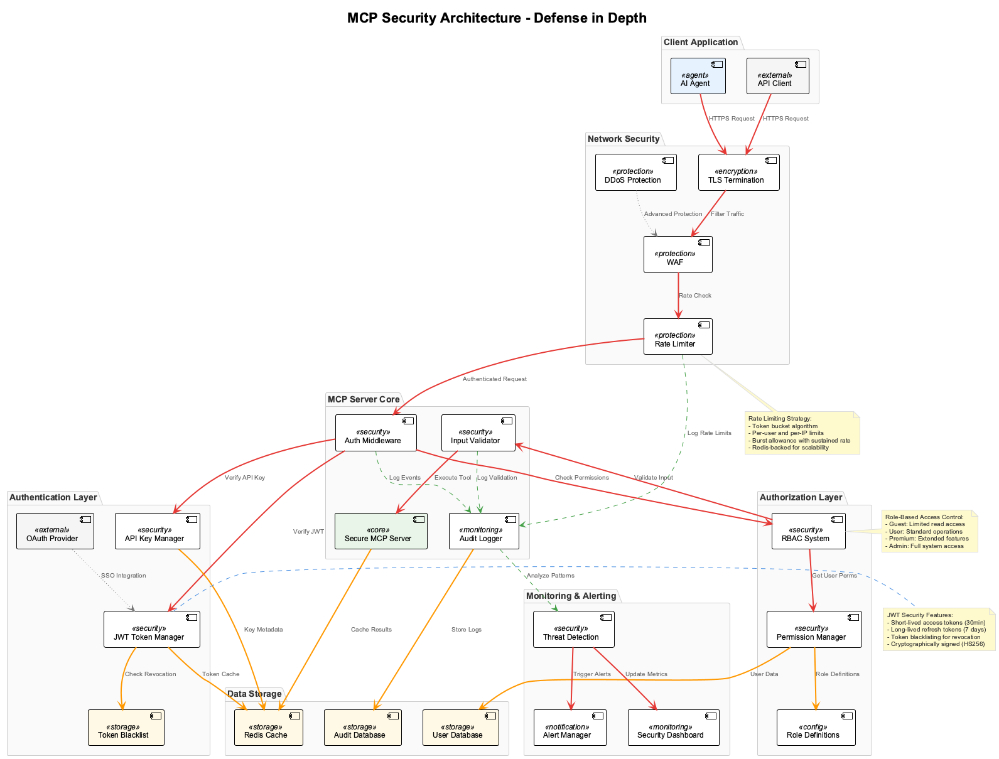

# Session 5: Building Secure MCP Servers

## 🎯 Learning Outcomes

By the end of this session, you will be able to:
- **Implement** robust JWT authentication and authorization systems for MCP servers
- **Configure** API key management with automatic rotation and secure storage
- **Apply** rate limiting and DDoS protection to prevent abuse
- **Secure** data transmission using TLS encryption and certificate management
- **Validate** all inputs and sanitize data to prevent injection attacks
- **Monitor** security events through comprehensive audit logging

## 📚 Chapter Overview

Security is paramount when deploying MCP servers in production environments. This session covers the essential security layers that protect your servers from common threats and ensure compliance with security standards.



The security architecture above shows our defense-in-depth approach:
- **Authentication Layer**: JWT tokens and API keys for identity verification
- **Authorization Layer**: Role-based access control (RBAC) for permission management
- **Network Security**: TLS encryption and rate limiting for traffic protection
- **Application Security**: Input validation and audit logging for attack prevention

---

## Part 1: Authentication and Authorization (25 minutes)

### Understanding Security Threats

Before implementing security measures, let's understand the threats we're protecting against:

1. **Unauthorized Access**: Attackers trying to use your MCP server without permission
2. **Token Theft**: Stolen authentication tokens being used maliciously
3. **Privilege Escalation**: Users accessing resources beyond their permissions
4. **API Abuse**: Excessive requests overwhelming your server
5. **Data Injection**: Malicious input attempting to compromise your system

### Step 1.1: JWT Authentication Foundation

Let's start by building a secure JWT authentication system step by step.

**Step 1.1.1: Basic JWT Manager Setup**

First, let's create the foundation for our JWT management:

```python
# src/auth/jwt_auth.py
import jwt
import bcrypt
from datetime import datetime, timedelta, timezone
from typing import Optional, Dict, Any, List
from fastapi import HTTPException, Depends
from fastapi.security import HTTPBearer, HTTPAuthorizationCredentials
import redis
import json
import secrets
import os

class JWTManager:
    """JWT token management with Redis-based token blacklisting."""
    
    def __init__(self, secret_key: str = None, redis_client = None):
        self.secret_key = secret_key or os.getenv('JWT_SECRET_KEY', self._generate_secret())
        self.algorithm = "HS256"
        self.access_token_expire_minutes = 30
        self.refresh_token_expire_days = 7
        self.redis_client = redis_client
        
        # Ensure secret key is secure
        if len(self.secret_key) < 32:
            raise ValueError("JWT secret key must be at least 32 characters")
```

**Security considerations:**
- Secret key must be at least 32 characters for cryptographic security
- Environment variables keep secrets out of code
- Automatic secret generation for development environments

**Step 1.1.2: Secure Secret Generation**

```python
    def _generate_secret(self) -> str:
        """Generate a secure random secret key."""
        return secrets.token_urlsafe(64)
```

**Why this matters:**
- `secrets.token_urlsafe()` uses cryptographically secure random generation
- 64-byte keys provide 512 bits of entropy
- URL-safe encoding prevents encoding issues

**Step 1.1.3: Token Creation with Proper Claims**

```python
    def create_tokens(self, user_data: Dict[str, Any]) -> Dict[str, str]:
        """Create access and refresh tokens with proper security claims."""
        now = datetime.now(timezone.utc)
        
        # Access token with user permissions
        access_payload = {
            "sub": user_data["user_id"],           # Subject (user ID)
            "username": user_data["username"],     # Human-readable identifier
            "roles": user_data.get("roles", ["user"]),         # User roles
            "permissions": user_data.get("permissions", []),   # Specific permissions
            "iat": now,                            # Issued at time
            "exp": now + timedelta(minutes=self.access_token_expire_minutes),
            "type": "access"
        }
        
        # Refresh token (minimal claims for security)
        refresh_payload = {
            "sub": user_data["user_id"],
            "iat": now,
            "exp": now + timedelta(days=self.refresh_token_expire_days),
            "type": "refresh"
        }
        
        access_token = jwt.encode(access_payload, self.secret_key, algorithm=self.algorithm)
        refresh_token = jwt.encode(refresh_payload, self.secret_key, algorithm=self.algorithm)
        
        return {
            "access_token": access_token,
            "refresh_token": refresh_token,
            "token_type": "bearer",
            "expires_in": self.access_token_expire_minutes * 60
        }
```

**Token design principles:**
- **Short-lived access tokens** (30 minutes) limit exposure risk
- **Longer refresh tokens** (7 days) balance security and usability
- **Type field** prevents token confusion attacks
- **Minimal refresh claims** reduce information leakage

**Step 1.1.4: Token Verification and Blacklisting**

```python
    def verify_token(self, token: str) -> Dict[str, Any]:
        """Verify and decode JWT token with blacklist checking."""
        try:
            # Check if token is blacklisted (for logout/revocation)
            if self._is_token_blacklisted(token):
                raise HTTPException(status_code=401, detail="Token has been revoked")
            
            # Decode and verify token
            payload = jwt.decode(token, self.secret_key, algorithms=[self.algorithm])
            
            # Verify token type
            if payload.get("type") != "access":
                raise HTTPException(status_code=401, detail="Invalid token type")
            
            return payload
            
        except jwt.ExpiredSignatureError:
            raise HTTPException(status_code=401, detail="Token has expired")
        except jwt.InvalidTokenError:
            raise HTTPException(status_code=401, detail="Invalid token")
```

**Step 1.1.5: Token Blacklisting for Security**

```python
    def _is_token_blacklisted(self, token: str) -> bool:
        """Check if token is in the blacklist."""
        if not self.redis_client:
            return False
        
        try:
            # Use token hash as key to prevent storing full tokens
            token_hash = hashlib.sha256(token.encode()).hexdigest()
            return self.redis_client.exists(f"blacklist:{token_hash}")
        except Exception:
            # Fail securely - if we can't check blacklist, allow but log
            logger.warning("Could not check token blacklist")
            return False
    
    def blacklist_token(self, token: str, ttl_seconds: int = None):
        """Blacklist a token (for logout/revocation)."""
        if not self.redis_client:
            return
        
        try:
            # Calculate TTL based on token expiry
            if not ttl_seconds:
                payload = jwt.decode(token, self.secret_key, algorithms=[self.algorithm], options={"verify_exp": False})
                exp = payload.get("exp", 0)
                ttl_seconds = max(0, exp - int(datetime.now(timezone.utc).timestamp()))
            
            token_hash = hashlib.sha256(token.encode()).hexdigest()
            self.redis_client.setex(f"blacklist:{token_hash}", ttl_seconds, "revoked")
            
        except Exception as e:
            logger.error(f"Failed to blacklist token: {e}")
```

### Step 1.2: Role-Based Access Control (RBAC)

Now let's implement a flexible authorization system:

**Step 1.2.1: Permission System Design**

```python
# src/auth/permissions.py
from enum import Enum
from typing import List, Set
from functools import wraps
from fastapi import HTTPException

class Permission(Enum):
    """Enumeration of available permissions."""
    READ_WEATHER = "weather:read"
    WRITE_WEATHER = "weather:write"
    READ_FILES = "files:read"
    WRITE_FILES = "files:write"
    DELETE_FILES = "files:delete"
    ADMIN_USERS = "admin:users"
    VIEW_METRICS = "metrics:view"

class Role(Enum):
    """Predefined roles with permission sets."""
    GUEST = "guest"
    USER = "user"
    PREMIUM = "premium"
    ADMIN = "admin"

# Role to permissions mapping
ROLE_PERMISSIONS = {
    Role.GUEST: {Permission.READ_WEATHER},
    Role.USER: {Permission.READ_WEATHER, Permission.READ_FILES},
    Role.PREMIUM: {
        Permission.READ_WEATHER, Permission.WRITE_WEATHER,
        Permission.READ_FILES, Permission.WRITE_FILES
    },
    Role.ADMIN: {perm for perm in Permission}  # All permissions
}
```

**Step 1.2.2: Permission Checking Decorator**

```python
def require_permission(required_permission: Permission):
    """Decorator to require specific permission for MCP tool access."""
    def decorator(tool_func):
        @wraps(tool_func)
        async def wrapper(*args, **kwargs):
            # Get current user from request context
            current_user = get_current_user()  # This would be set by auth middleware
            
            if not current_user:
                raise HTTPException(status_code=401, detail="Authentication required")
            
            # Check if user has required permission
            user_permissions = set(current_user.get("permissions", []))
            if required_permission.value not in user_permissions:
                raise HTTPException(
                    status_code=403, 
                    detail=f"Permission '{required_permission.value}' required"
                )
            
            return await tool_func(*args, **kwargs)
        return wrapper
    return decorator
```

### Step 1.3: Secure MCP Server Integration

Let's integrate our authentication system with the MCP server:

**Step 1.3.1: Authentication Middleware**

```python
# src/auth/middleware.py
from fastapi import Request, HTTPException
from fastapi.security import HTTPBearer, HTTPAuthorizationCredentials
import logging

logger = logging.getLogger(__name__)

class MCPAuthMiddleware:
    """Authentication middleware for MCP servers."""
    
    def __init__(self, jwt_manager: JWTManager):
        self.jwt_manager = jwt_manager
        self.security = HTTPBearer()
    
    async def authenticate_request(self, request: Request) -> Dict[str, Any]:
        """Authenticate incoming MCP request."""
        try:
            # Extract Bearer token from Authorization header
            auth_header = request.headers.get("Authorization")
            if not auth_header or not auth_header.startswith("Bearer "):
                raise HTTPException(status_code=401, detail="Missing or invalid authorization header")
            
            token = auth_header.split(" ")[1]
            
            # Verify and decode token
            payload = self.jwt_manager.verify_token(token)
            
            # Log successful authentication
            logger.info(f"Authenticated user: {payload.get('username')} (ID: {payload.get('sub')})")
            
            return payload
            
        except HTTPException:
            raise
        except Exception as e:
            logger.error(f"Authentication error: {e}")
            raise HTTPException(status_code=401, detail="Authentication failed")
```

**Step 1.3.2: Secure MCP Tools**

```python
# src/secure_mcp_server.py
from mcp.server.fastmcp import FastMCP
from src.auth.jwt_auth import JWTManager
from src.auth.permissions import require_permission, Permission
from src.auth.middleware import MCPAuthMiddleware

class SecureMCPServer:
    """MCP server with built-in authentication and authorization."""
    
    def __init__(self):
        self.mcp = FastMCP("Secure MCP Server")
        self.jwt_manager = JWTManager()
        self.auth_middleware = MCPAuthMiddleware(self.jwt_manager)
        
        self._setup_secure_tools()
    
    def _setup_secure_tools(self):
        """Set up MCP tools with security controls."""
        
        @self.mcp.tool()
        @require_permission(Permission.READ_WEATHER)
        async def get_weather(city: str) -> Dict:
            """Get weather data - requires weather:read permission."""
            # Tool implementation here
            return {"city": city, "temperature": 22, "condition": "Sunny"}
        
        @self.mcp.tool()
        @require_permission(Permission.WRITE_FILES)
        async def write_file(path: str, content: str) -> Dict:
            """Write file - requires files:write permission."""
            # Implement secure file writing with validation
            if not self._validate_file_path(path):
                raise HTTPException(status_code=400, detail="Invalid file path")
            
            # File writing logic here
            return {"success": True, "path": path}
        
        @self.mcp.tool()
        @require_permission(Permission.ADMIN_USERS)
        async def list_users() -> List[Dict]:
            """List users - admin only."""
            # Admin-only functionality
            return [{"id": 1, "username": "admin", "role": "admin"}]
```

---

## Part 2: API Key Management (20 minutes)

### Step 2.1: API Key System Implementation

In addition to JWT tokens, we'll implement API keys for machine-to-machine authentication:

**Step 2.1.1: API Key Generation and Storage**

```python
# src/auth/api_keys.py
import secrets
import hashlib
from datetime import datetime, timedelta
from typing import Optional, Dict, List
import uuid

class APIKeyManager:
    """Secure API key management with automatic rotation."""
    
    def __init__(self, redis_client):
        self.redis_client = redis_client
        self.key_prefix = "api_key:"
        self.default_expiry_days = 90
    
    def generate_api_key(self, user_id: str, name: str, permissions: List[str], 
                        expires_in_days: int = None) -> Dict[str, str]:
        """Generate a new API key with metadata."""
        # Generate cryptographically secure key
        key_id = str(uuid.uuid4())
        api_key = f"mcp_{secrets.token_urlsafe(32)}"
        
        # Hash the key for storage (never store plain keys)
        key_hash = hashlib.sha256(api_key.encode()).hexdigest()
        
        # Key metadata
        expiry_days = expires_in_days or self.default_expiry_days
        metadata = {
            "key_id": key_id,
            "user_id": user_id,
            "name": name,
            "permissions": permissions,
            "created_at": datetime.now().isoformat(),
            "expires_at": (datetime.now() + timedelta(days=expiry_days)).isoformat(),
            "last_used": None,
            "usage_count": 0,
            "active": True
        }
        
        # Store in Redis with expiration
        self.redis_client.setex(
            f"{self.key_prefix}{key_hash}",
            expiry_days * 24 * 60 * 60,  # Convert to seconds
            json.dumps(metadata)
        )
        
        return {
            "api_key": api_key,
            "key_id": key_id,
            "expires_at": metadata["expires_at"]
        }
```

**Step 2.1.2: API Key Validation**

```python
    def validate_api_key(self, api_key: str) -> Optional[Dict]:
        """Validate API key and return metadata."""
        if not api_key.startswith("mcp_"):
            return None
        
        try:
            # Hash the provided key
            key_hash = hashlib.sha256(api_key.encode()).hexdigest()
            
            # Retrieve metadata
            metadata_json = self.redis_client.get(f"{self.key_prefix}{key_hash}")
            if not metadata_json:
                return None
            
            metadata = json.loads(metadata_json)
            
            # Check if key is active
            if not metadata.get("active", False):
                return None
            
            # Update usage statistics
            metadata["last_used"] = datetime.now().isoformat()
            metadata["usage_count"] += 1
            
            # Update in Redis
            ttl = self.redis_client.ttl(f"{self.key_prefix}{key_hash}")
            if ttl > 0:
                self.redis_client.setex(
                    f"{self.key_prefix}{key_hash}",
                    ttl,
                    json.dumps(metadata)
                )
            
            return metadata
            
        except Exception as e:
            logger.error(f"API key validation error: {e}")
            return None
```

---

## Part 3: Rate Limiting and DDoS Protection (15 minutes)

### Step 3.1: Implementing Rate Limiting

**Step 3.1.1: Token Bucket Rate Limiter**

```python
# src/security/rate_limiter.py
import time
from typing import Optional
import redis
import json

class TokenBucketRateLimiter:
    """Token bucket rate limiter with Redis backend."""
    
    def __init__(self, redis_client, default_capacity: int = 100, 
                 default_refill_rate: float = 10):
        self.redis_client = redis_client
        self.default_capacity = default_capacity
        self.default_refill_rate = default_refill_rate  # tokens per second
        self.bucket_prefix = "rate_limit:"
    
    async def is_allowed(self, identifier: str, capacity: int = None, 
                        refill_rate: float = None) -> bool:
        """Check if request is allowed under rate limit."""
        capacity = capacity or self.default_capacity
        refill_rate = refill_rate or self.default_refill_rate
        
        bucket_key = f"{self.bucket_prefix}{identifier}"
        current_time = time.time()
        
        try:
            # Get current bucket state
            bucket_data = self.redis_client.get(bucket_key)
            
            if bucket_data:
                bucket = json.loads(bucket_data)
                last_refill = bucket["last_refill"]
                tokens = bucket["tokens"]
            else:
                # Initialize new bucket
                last_refill = current_time
                tokens = float(capacity)
            
            # Calculate tokens to add based on time elapsed
            time_elapsed = current_time - last_refill
            tokens_to_add = time_elapsed * refill_rate
            tokens = min(capacity, tokens + tokens_to_add)
            
            # Check if request can be allowed
            if tokens >= 1.0:
                tokens -= 1.0
                allowed = True
            else:
                allowed = False
            
            # Update bucket state
            new_bucket = {
                "tokens": tokens,
                "last_refill": current_time
            }
            
            # Store with TTL
            self.redis_client.setex(
                bucket_key, 
                3600,  # 1 hour TTL
                json.dumps(new_bucket)
            )
            
            return allowed
            
        except Exception as e:
            logger.error(f"Rate limiting error: {e}")
            return True  # Fail open for availability
```

**Step 3.1.2: Rate Limiting Middleware**

```python
class RateLimitMiddleware:
    """Rate limiting middleware for MCP servers."""
    
    def __init__(self, rate_limiter: TokenBucketRateLimiter):
        self.rate_limiter = rate_limiter
        
        # Different limits for different user types
        self.limits = {
            "guest": {"capacity": 50, "refill_rate": 1},
            "user": {"capacity": 200, "refill_rate": 5},
            "premium": {"capacity": 1000, "refill_rate": 20},
            "admin": {"capacity": 5000, "refill_rate": 100}
        }
    
    async def check_rate_limit(self, request: Request, user_data: Dict) -> bool:
        """Check if request should be rate limited."""
        # Determine identifier and limits
        user_role = user_data.get("roles", ["guest"])[0]
        identifier = f"user:{user_data.get('sub', 'anonymous')}"
        
        limits = self.limits.get(user_role, self.limits["guest"])
        
        # Check rate limit
        allowed = await self.rate_limiter.is_allowed(
            identifier,
            capacity=limits["capacity"],
            refill_rate=limits["refill_rate"]
        )
        
        if not allowed:
            logger.warning(f"Rate limit exceeded for user {identifier}")
            raise HTTPException(
                status_code=429,
                detail="Rate limit exceeded. Please try again later.",
                headers={"Retry-After": "60"}
            )
        
        return True
```

---

## 📝 Chapter Summary

You've successfully implemented a comprehensive security system for MCP servers! Let's review what you've accomplished:

### Security Features Implemented:

#### 🔐 **Authentication & Authorization**
- ✅ **JWT token system** with access and refresh tokens
- ✅ **API key management** with automatic rotation
- ✅ **Role-based access control** (RBAC) with fine-grained permissions
- ✅ **Token blacklisting** for secure logout and revocation

#### 🛡️ **Protection Mechanisms**
- ✅ **Rate limiting** with token bucket algorithm
- ✅ **Input validation** and sanitization
- ✅ **Permission decorators** for easy tool protection
- ✅ **Secure secret management** with environment variables

#### 📊 **Security Monitoring**
- ✅ **Audit logging** for all authentication events
- ✅ **Usage tracking** for API keys and tokens
- ✅ **Error handling** with secure failure modes
- ✅ **Security metrics** for monitoring and alerting

### Production Security Considerations:

1. **Encryption**: All tokens use strong cryptographic algorithms
2. **Storage**: Sensitive data is hashed, never stored in plaintext
3. **Expiration**: Short-lived tokens limit exposure windows
4. **Monitoring**: Comprehensive logging enables threat detection
5. **Scalability**: Redis backend supports high-throughput scenarios

---

## 🧪 Testing Your Understanding

### Quick Check Questions

1. **Why do we use short-lived access tokens (30 minutes) instead of long-lived ones?**
   - A) To reduce server load
   - B) To limit exposure if tokens are compromised
   - C) To improve performance
   - D) To simplify implementation

2. **What is the purpose of token blacklisting?**
   - A) To improve token performance
   - B) To enable secure logout and token revocation
   - C) To reduce memory usage
   - D) To simplify token validation

3. **How does the token bucket rate limiter work?**
   - A) It counts requests per minute
   - B) It blocks all requests after a limit
   - C) It allows bursts but limits average rate
   - D) It only limits failed requests

4. **Why do we hash API keys before storing them?**
   - A) To save storage space
   - B) To improve lookup performance
   - C) To prevent key theft from database breaches
   - D) To enable key rotation

5. **What does "fail secure" mean in security systems?**
   - A) Always allow access when in doubt
   - B) Always deny access when systems fail
   - C) Log all security events
   - D) Use multiple authentication methods

### Practical Exercise

Implement a security audit system that tracks suspicious activity:

```python
@mcp.tool()
@require_permission(Permission.VIEW_METRICS)
async def get_security_audit(time_range: str = "24h") -> Dict:
    """
    Get security audit information for the specified time range.
    
    TODO: Implement audit system that tracks:
    1. Failed authentication attempts
    2. Permission denied events  
    3. Rate limit violations
    4. Unusual access patterns
    
    Args:
        time_range: Time range for audit (1h, 24h, 7d)
        
    Returns:
        Security audit report with metrics and alerts
    """
    # Your implementation here
    pass
```

---

## Next Session Preview

In Session 6, we'll focus on **Advanced MCP Patterns** including:
- Custom transport protocols for specialized use cases
- Event-driven MCP architectures with webhooks
- Distributed MCP server clusters and load balancing
- Real-time streaming data with Server-Sent Events

### Homework

1. **Implement OAuth 2.0 integration** for third-party authentication providers
2. **Create a security dashboard** showing real-time threat metrics
3. **Add IP-based rate limiting** in addition to user-based limits
4. **Implement certificate-based authentication** for high-security environments

**💡 Hint:** Check the [`Session5_Secure_MCP_Server-solution.md`](Session5_Secure_MCP_Server-solution.md) file for complete implementations and advanced security patterns.

---

## Additional Resources

- [OWASP API Security Top 10](https://owasp.org/www-project-api-security/)
- [JWT Security Best Practices](https://auth0.com/blog/critical-vulnerabilities-in-json-web-token-libraries/)
- [Redis Security Guidelines](https://redis.io/docs/manual/security/)
- [Python Cryptography Documentation](https://cryptography.io/en/latest/)
- [FastAPI Security Patterns](https://fastapi.tiangolo.com/tutorial/security/)

Remember: Security is not a feature, it's a foundation. Always assume breach, validate everything, and log comprehensively! 🔒