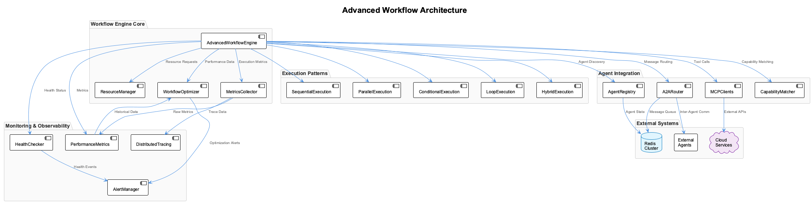

# Session 8: Advanced Agent Workflows

## 🎯 Learning Outcomes

By the end of this session, you will be able to:
- **Design** complex multi-agent workflows with parallel processing and conditional logic
- **Implement** adaptive workflow systems that optimize themselves based on performance data
- **Create** fault-tolerant workflows with comprehensive error handling and recovery mechanisms
- **Build** workflow monitoring and observability systems for production environments
- **Deploy** scalable workflow orchestration platforms with load balancing and resource management

## 📚 Chapter Overview

Advanced agent workflows go beyond simple sequential processing to include sophisticated patterns like parallel execution, conditional branching, dynamic adaptation, and intelligent error recovery. This session explores enterprise-grade workflow patterns that can handle complex, real-world scenarios.



The architecture demonstrates:
- **Parallel Processing**: Concurrent execution of independent workflow branches
- **Conditional Logic**: Dynamic routing based on data and context
- **Adaptive Optimization**: Self-improving workflows based on performance metrics
- **Fault Recovery**: Comprehensive error handling with rollback and retry mechanisms

---

## Part 1: Complex Workflow Patterns (25 minutes)

### Understanding Advanced Workflow Types

Modern agent workflows support multiple execution patterns:

1. **Sequential Workflows**: Linear step-by-step execution
2. **Parallel Workflows**: Concurrent execution with synchronization points  
3. **Conditional Workflows**: Dynamic branching based on data or context
4. **Loop Workflows**: Iterative processing with termination conditions
5. **Hybrid Workflows**: Combinations of the above patterns

### Step 1.1: Workflow Foundation Classes

Let's start by defining the core workflow data structures:

```python
# workflows/advanced_engine.py
import asyncio
import json
from typing import Dict, List, Any, Optional, Callable, Union
from dataclasses import dataclass, field
from datetime import datetime, timedelta
from enum import Enum
import uuid
import logging

from workflows.execution_context import ExecutionContext, WorkflowState
from workflows.step_executor import StepExecutor
from workflows.monitors import WorkflowMonitor

logger = logging.getLogger(__name__)
```

Next, we define the workflow step types and statuses:

```python
class StepType(Enum):
    """Types of workflow steps."""
    ACTION = "action"           # Execute an action
    CONDITION = "condition"     # Conditional branching
    PARALLEL = "parallel"       # Parallel execution container
    LOOP = "loop"              # Loop container  
    WAIT = "wait"              # Wait/delay step
    HUMAN_TASK = "human_task"  # Human intervention required
    WEBHOOK = "webhook"        # External system integration

class StepStatus(Enum):
    """Status of workflow steps."""
    PENDING = "pending"
    RUNNING = "running"
    COMPLETED = "completed"
    FAILED = "failed"
    SKIPPED = "skipped"
    WAITING = "waiting"
    RETRYING = "retrying"
```

Now let's define the enhanced workflow step structure:

```python
@dataclass
class WorkflowStep:
    """Enhanced workflow step with advanced capabilities."""
    
    step_id: str
    name: str
    step_type: StepType
    
    # Execution configuration
    action: Optional[str] = None
    agent_capability: Optional[str] = None
    timeout: int = 300
    
    # Input/Output configuration
    input_mapping: Dict[str, str] = field(default_factory=dict)
    output_mapping: Dict[str, str] = field(default_factory=dict)
    input_validation: Dict[str, Any] = field(default_factory=dict)
```

Continue with control flow and error handling configuration:

```python
    # Control flow
    dependencies: List[str] = field(default_factory=list)
    conditions: List[Dict[str, Any]] = field(default_factory=list)
    next_steps: List[str] = field(default_factory=list)
    error_handlers: List[str] = field(default_factory=list)
    
    # Retry and error handling
    retry_policy: Dict[str, Any] = field(default_factory=dict)
    rollback_actions: List[str] = field(default_factory=list)
    
    # Parallel and loop configuration
    parallel_steps: List['WorkflowStep'] = field(default_factory=list)
    loop_condition: Optional[str] = None
    loop_max_iterations: int = 100
```

Add monitoring and runtime state tracking:

```python
    # Monitoring and observability
    metrics_enabled: bool = True
    custom_metrics: List[str] = field(default_factory=list)
    
    # Runtime state
    status: StepStatus = StepStatus.PENDING
    start_time: Optional[str] = None
    end_time: Optional[str] = None
    execution_data: Dict[str, Any] = field(default_factory=dict)
    error_info: Optional[Dict[str, Any]] = None
    retry_count: int = 0
```

### Step 1.2: Advanced Workflow Definition

Define the complete workflow structure:

```python
@dataclass
class AdvancedWorkflow:
    """Advanced workflow definition with complex patterns."""
    
    workflow_id: str
    name: str
    description: str
    version: str = "1.0"
    
    # Workflow structure
    steps: List[WorkflowStep] = field(default_factory=list)
    global_variables: Dict[str, Any] = field(default_factory=dict)
```

Add configuration and optimization settings:

```python
    # Configuration
    timeout: int = 3600
    max_parallel_steps: int = 10
    retry_policy: Dict[str, Any] = field(default_factory=dict)
    
    # Monitoring and optimization
    sla_targets: Dict[str, Any] = field(default_factory=dict)
    optimization_enabled: bool = True
    adaptive_routing: bool = True
    
    # Metadata
    created_at: str = field(default_factory=lambda: datetime.now().isoformat())
    created_by: Optional[str] = None
    tags: List[str] = field(default_factory=list)
```

### Step 1.3: Workflow Engine Core

Create the advanced workflow engine with initialization:

```python
class AdvancedWorkflowEngine:
    """Advanced workflow engine with sophisticated execution patterns."""
    
    def __init__(self, step_executor: StepExecutor, monitor: WorkflowMonitor):
        self.step_executor = step_executor
        self.monitor = monitor
        self.active_workflows: Dict[str, ExecutionContext] = {}
        self.workflow_templates: Dict[str, AdvancedWorkflow] = {}
        
        # Execution control
        self.max_concurrent_workflows = 100
        self.resource_manager = ResourceManager()
        self.optimizer = WorkflowOptimizer()
```

Implement the main workflow execution method:

```python
    async def execute_workflow(self, workflow: AdvancedWorkflow, 
                             input_data: Dict[str, Any] = None,
                             execution_options: Dict[str, Any] = None) -> Dict[str, Any]:
        """Execute an advanced workflow with full feature support."""
        
        execution_id = str(uuid.uuid4())
        input_data = input_data or {}
        execution_options = execution_options or {}
        
        # Create execution context
        context = ExecutionContext(
            execution_id=execution_id,
            workflow=workflow,
            input_data=input_data,
            options=execution_options
        )
        
        self.active_workflows[execution_id] = context
```

Handle workflow execution with proper error handling:

```python
        try:
            # Start monitoring
            await self.monitor.start_workflow_monitoring(context)
            
            # Initialize workflow state
            context.state = WorkflowState.RUNNING
            context.start_time = datetime.now()
            
            # Execute workflow with timeout
            result = await asyncio.wait_for(
                self._execute_workflow_internal(context),
                timeout=workflow.timeout
            )
            
            # Finalize execution
            context.state = WorkflowState.COMPLETED
            context.end_time = datetime.now()
            context.result = result
            
            return self._create_execution_result(context, "completed", result)
```

Add timeout and error handling:

```python
        except asyncio.TimeoutError:
            context.state = WorkflowState.TIMEOUT
            logger.error(f"Workflow {execution_id} timed out")
            
            return self._create_execution_result(context, "timeout", None)
            
        except Exception as e:
            context.state = WorkflowState.FAILED
            context.error = str(e)
            logger.error(f"Workflow {execution_id} failed: {e}")
            
            # Attempt rollback
            await self._execute_rollback(context)
            
            return self._create_execution_result(context, "failed", None)
            
        finally:
            # Cleanup
            await self.monitor.stop_workflow_monitoring(execution_id)
            self.active_workflows.pop(execution_id, None)
```

### Step 1.4: Internal Workflow Execution

Implement the core workflow execution logic:

```python
    async def _execute_workflow_internal(self, context: ExecutionContext) -> Dict[str, Any]:
        """Internal workflow execution logic."""
        
        workflow = context.workflow
        
        # Build execution graph
        execution_graph = self._build_execution_graph(workflow)
        
        # Execute steps based on dependencies and patterns
        completed_steps = set()
        failed_steps = set()
        
        while len(completed_steps) < len(workflow.steps):
            # Find ready steps (all dependencies satisfied)
            ready_steps = self._find_ready_steps(
                workflow, execution_graph, completed_steps, failed_steps
            )
            
            if not ready_steps:
                # Check for deadlock or completion
                remaining_steps = set(s.step_id for s in workflow.steps) - completed_steps - failed_steps
                if remaining_steps:
                    logger.warning(f"Potential deadlock detected. Remaining steps: {remaining_steps}")
                break
```

Execute steps with different patterns:

```python
            # Execute ready steps with appropriate pattern
            execution_tasks = []
            
            for step in ready_steps:
                if step.step_type == StepType.PARALLEL:
                    task = asyncio.create_task(
                        self._execute_parallel_step(step, context)
                    )
                elif step.step_type == StepType.LOOP:
                    task = asyncio.create_task(
                        self._execute_loop_step(step, context)
                    )
                elif step.step_type == StepType.CONDITION:
                    task = asyncio.create_task(
                        self._execute_conditional_step(step, context)
                    )
                else:
                    task = asyncio.create_task(
                        self._execute_single_step(step, context)
                    )
                
                execution_tasks.append((step, task))
```

Process execution results:

```python
            # Wait for tasks to complete
            for step, task in execution_tasks:
                try:
                    result = await task
                    if result.get("success", False):
                        completed_steps.add(step.step_id)
                        step.status = StepStatus.COMPLETED
                        
                        # Apply output mapping
                        self._apply_output_mapping(step, result, context.data)
                    else:
                        failed_steps.add(step.step_id)
                        step.status = StepStatus.FAILED
                        step.error_info = result.get("error")
                        
                        # Check if failure should stop workflow
                        if not step.retry_policy.get("continue_on_failure", False):
                            raise Exception(f"Step {step.step_id} failed: {result.get('error')}")
                
                except Exception as e:
                    failed_steps.add(step.step_id)
                    step.status = StepStatus.FAILED
                    step.error_info = {"error": str(e), "timestamp": datetime.now().isoformat()}
                    
                    # Attempt error recovery
                    recovery_result = await self._handle_step_error(step, context, e)
                    if not recovery_result.get("recovered", False):
                        raise
        
        return context.data
```

### Step 1.5: Parallel Step Execution

Implement parallel step execution with concurrency control:

```python
    async def _execute_parallel_step(self, step: WorkflowStep, 
                                   context: ExecutionContext) -> Dict[str, Any]:
        """Execute a parallel step container."""
        
        if not step.parallel_steps:
            return {"success": True, "message": "No parallel steps to execute"}
        
        # Limit concurrent execution
        semaphore = asyncio.Semaphore(context.workflow.max_parallel_steps)
        
        async def execute_with_semaphore(parallel_step):
            async with semaphore:
                return await self._execute_single_step(parallel_step, context)
        
        # Execute all parallel steps
        tasks = [
            asyncio.create_task(execute_with_semaphore(parallel_step))
            for parallel_step in step.parallel_steps
        ]
        
        results = await asyncio.gather(*tasks, return_exceptions=True)
```

Analyze parallel execution results:

```python
        # Analyze results
        successful_results = []
        failed_results = []
        
        for i, result in enumerate(results):
            if isinstance(result, Exception):
                failed_results.append({
                    "step_id": step.parallel_steps[i].step_id,
                    "error": str(result)
                })
            elif result.get("success", False):
                successful_results.append(result)
            else:
                failed_results.append({
                    "step_id": step.parallel_steps[i].step_id,
                    "error": result.get("error", "Unknown error")
                })
        
        # Determine overall success
        total_steps = len(step.parallel_steps)
        successful_steps = len(successful_results)
        failure_threshold = step.retry_policy.get("parallel_failure_threshold", 0.5)
        
        success = (successful_steps / total_steps) >= failure_threshold
        
        return {
            "success": success,
            "parallel_results": {
                "total_steps": total_steps,
                "successful_steps": successful_steps,
                "failed_steps": len(failed_results),
                "success_rate": successful_steps / total_steps,
                "results": successful_results,
                "failures": failed_results
            }
        }
```

---

## Part 2: Workflow Optimization and Monitoring (20 minutes)

### Step 2.1: Performance Metrics Collection

Create a performance metrics system for workflow analysis:

```python
# workflows/optimizer.py
import asyncio
from typing import Dict, List, Any, Optional
from dataclasses import dataclass
from datetime import datetime, timedelta
import statistics
import logging

from workflows.advanced_engine import AdvancedWorkflow, WorkflowStep
from workflows.execution_context import ExecutionContext

logger = logging.getLogger(__name__)

@dataclass
class PerformanceMetrics:
    """Performance metrics for workflow optimization."""
    
    execution_time: float
    resource_usage: Dict[str, float]
    success_rate: float
    error_rate: float
    step_performance: Dict[str, Dict[str, float]]
    bottlenecks: List[str]
    optimization_score: float
```

Define optimization recommendations:

```python
@dataclass
class OptimizationRecommendation:
    """Optimization recommendation for workflows."""
    
    recommendation_id: str
    type: str                    # parallelization, caching, routing, etc.
    description: str
    expected_improvement: float  # Expected performance improvement %
    implementation_effort: str   # low, medium, high
    risk_level: str             # low, medium, high
    specific_changes: List[Dict[str, Any]]
```

### Step 2.2: Workflow Optimizer Core

Create the workflow optimizer with initialization:

```python
class WorkflowOptimizer:
    """Intelligent workflow optimizer using performance data."""
    
    def __init__(self):
        self.performance_history: Dict[str, List[PerformanceMetrics]] = {}
        self.optimization_rules: List[Dict[str, Any]] = []
        self.learning_enabled = True
        
        self._initialize_optimization_rules()
    
    def _initialize_optimization_rules(self):
        """Initialize built-in optimization rules."""
        
        self.optimization_rules = [
            {
                "name": "parallel_optimization",
                "condition": lambda metrics: self._detect_parallelization_opportunity(metrics),
                "recommendation": self._create_parallelization_recommendation,
                "priority": 9
            },
            {
                "name": "caching_optimization", 
                "condition": lambda metrics: self._detect_caching_opportunity(metrics),
                "recommendation": self._create_caching_recommendation,
                "priority": 8
            },
            {
                "name": "resource_optimization",
                "condition": lambda metrics: self._detect_resource_waste(metrics),
                "recommendation": self._create_resource_optimization_recommendation,
                "priority": 7
            }
        ]
```

Implement performance analysis:

```python
    async def analyze_workflow_performance(self, workflow: AdvancedWorkflow,
                                         execution_history: List[ExecutionContext]) -> PerformanceMetrics:
        """Analyze workflow performance and identify optimization opportunities."""
        
        if not execution_history:
            return self._create_empty_metrics()
        
        # Calculate execution time statistics
        execution_times = [
            (ctx.end_time - ctx.start_time).total_seconds()
            for ctx in execution_history 
            if ctx.end_time and ctx.start_time
        ]
        
        avg_execution_time = statistics.mean(execution_times) if execution_times else 0
        
        # Calculate success/error rates
        successful_executions = len([ctx for ctx in execution_history if ctx.state.value == "completed"])
        total_executions = len(execution_history)
        success_rate = successful_executions / total_executions if total_executions > 0 else 0
        error_rate = 1 - success_rate
```

Continue with step performance analysis:

```python
        # Analyze step performance
        step_performance = self._analyze_step_performance(workflow, execution_history)
        
        # Identify bottlenecks
        bottlenecks = self._identify_bottlenecks(step_performance)
        
        # Calculate resource usage
        resource_usage = self._calculate_resource_usage(execution_history)
        
        # Calculate optimization score
        optimization_score = self._calculate_optimization_score(
            avg_execution_time, success_rate, step_performance, resource_usage
        )
        
        metrics = PerformanceMetrics(
            execution_time=avg_execution_time,
            resource_usage=resource_usage,
            success_rate=success_rate,
            error_rate=error_rate,
            step_performance=step_performance,
            bottlenecks=bottlenecks,
            optimization_score=optimization_score
        )
        
        # Store metrics for learning
        self._store_performance_metrics(workflow.workflow_id, metrics)
        
        return metrics
```

### Step 2.3: Optimization Recommendations

Generate optimization recommendations based on analysis:

```python
    async def generate_optimization_recommendations(self, 
                                                  workflow: AdvancedWorkflow,
                                                  metrics: PerformanceMetrics) -> List[OptimizationRecommendation]:
        """Generate optimization recommendations based on performance analysis."""
        
        recommendations = []
        
        # Apply optimization rules
        for rule in sorted(self.optimization_rules, key=lambda r: r["priority"], reverse=True):
            try:
                if rule["condition"](metrics):
                    recommendation = rule["recommendation"](workflow, metrics)
                    if recommendation:
                        recommendations.append(recommendation)
                        
            except Exception as e:
                logger.warning(f"Error applying optimization rule {rule['name']}: {e}")
        
        # Sort by expected improvement
        recommendations.sort(key=lambda r: r.expected_improvement, reverse=True)
        
        return recommendations[:5]  # Return top 5 recommendations
```

Create specific optimization recommendations:

```python
    def _create_parallelization_recommendation(self, workflow: AdvancedWorkflow,
                                             metrics: PerformanceMetrics) -> OptimizationRecommendation:
        """Create recommendation for parallelization."""
        
        return OptimizationRecommendation(
            recommendation_id=f"parallel_{workflow.workflow_id}_{int(datetime.now().timestamp())}",
            type="parallelization",
            description="Convert sequential steps to parallel execution to reduce overall execution time",
            expected_improvement=35.0,  # 35% improvement
            implementation_effort="medium",
            risk_level="low",
            specific_changes=[
                {
                    "action": "create_parallel_container",
                    "steps": list(metrics.bottlenecks[:3]),  # Top 3 bottleneck steps
                    "max_concurrent": 3
                }
            ]
        )
```

Add bottleneck detection logic:

```python
    def _identify_bottlenecks(self, step_performance: Dict[str, Dict[str, float]]) -> List[str]:
        """Identify performance bottlenecks in the workflow."""
        
        bottlenecks = []
        
        if not step_performance:
            return bottlenecks
        
        # Find steps with high execution times
        avg_times = [metrics["avg_execution_time"] for metrics in step_performance.values()]
        if avg_times:
            time_threshold = statistics.mean(avg_times) + statistics.stdev(avg_times)
            
            for step_id, metrics in step_performance.items():
                if metrics["avg_execution_time"] > time_threshold:
                    bottlenecks.append(step_id)
        
        # Find steps with high variance (inconsistent performance)
        for step_id, metrics in step_performance.items():
            if metrics["variance"] > metrics["avg_execution_time"] * 0.5:
                if step_id not in bottlenecks:
                    bottlenecks.append(step_id)
        
        return bottlenecks
```

---

## 📝 Chapter Summary

Congratulations! You've built an enterprise-grade advanced workflow system with the following capabilities:

### Advanced Workflow Features Implemented

#### 🔄 **Complex Execution Patterns**

- ✅ **Parallel execution** with concurrent step processing and synchronization
- ✅ **Conditional branching** with dynamic routing based on data and context
- ✅ **Loop processing** with iterative execution and termination conditions
- ✅ **Hybrid workflows** combining multiple execution patterns

#### 🚀 **Performance Optimization**

- ✅ **Intelligent optimization** with automated performance analysis
- ✅ **Resource management** with efficient allocation and monitoring
- ✅ **Bottleneck detection** with automated identification and recommendations
- ✅ **Adaptive routing** based on agent performance and availability

#### 🛡️ **Enterprise Features**

- ✅ **Comprehensive error handling** with retry policies and rollback mechanisms
- ✅ **Workflow monitoring** with real-time metrics and observability
- ✅ **Input validation** with schema-based verification
- ✅ **Resource pooling** for efficient agent utilization

---

## 🧪 Testing Your Understanding

### Quick Check Questions

1. **What is the main advantage of parallel workflow execution?**
   - A) Simpler error handling
   - B) Reduced execution time through concurrency
   - C) Better resource management
   - D) Easier debugging

2. **How does conditional branching work in advanced workflows?**
   - A) Random selection between branches
   - B) User input determines the branch
   - C) Expression evaluation determines execution path
   - D) Time-based routing

3. **What triggers workflow optimization recommendations?**
   - A) Manual requests only
   - B) Performance analysis and pattern detection
   - C) Schedule-based analysis
   - D) Error thresholds

4. **How does the retry mechanism handle different error types?**
   - A) All errors are retried equally
   - B) Only timeout errors are retried
   - C) Retryable vs non-retryable errors are distinguished
   - D) No retry logic is implemented

5. **What is the purpose of workflow rollback mechanisms?**
   - A) Performance optimization
   - B) Undo changes when workflows fail
   - C) Agent load balancing
   - D) Error logging

### Practical Exercise

Create an intelligent document processing workflow:

```python
class DocumentProcessingWorkflow:
    """Advanced workflow for intelligent document processing."""
    
    def __init__(self, workflow_engine: AdvancedWorkflowEngine):
        self.engine = workflow_engine
    
    def create_document_workflow(self) -> AdvancedWorkflow:
        """Create a complex document processing workflow."""
        
        # TODO: Create workflow with:
        # 1. Parallel OCR and metadata extraction
        # 2. Conditional routing based on document type
        # 3. Loop for multi-page processing
        # 4. Error handling with human review fallback
        # 5. Quality validation with retry logic
        
        pass
```

**💡 Hint:** Check the [`Session8_Advanced_Agent_Workflows-solution.md`](Session8_Advanced_Agent_Workflows-solution.md) file for complete implementations and advanced patterns.

---

## Next Session Preview

In Session 9, we'll explore **Production Agent Deployment** including:
- Container orchestration for agent systems
- Scalable deployment architectures with Kubernetes
- Production monitoring and alerting
- Security and compliance in production environments

### Homework

1. **Implement workflow versioning** with backward compatibility
2. **Create dynamic workflow generation** from natural language descriptions
3. **Add machine learning optimization** using historical performance data
4. **Build workflow testing framework** for comprehensive validation

---

## 📋 Test Your Knowledge

Ready to test your understanding of Advanced Agent Workflows? Take our comprehensive multiple-choice test to verify your mastery of the concepts.

### Multiple Choice Test
Test your knowledge with 10 carefully crafted questions covering:
- Complex workflow patterns (parallel, conditional, hybrid)
- Adaptive optimization and performance tuning
- Fault recovery and compensation mechanisms
- Resource management and allocation strategies
- Workflow monitoring and observability

**[📝 Take the Test - Session 8 Test Solutions](Session8_Test_Solutions.md)**

*The test includes detailed explanations for each answer and a scoring guide to help you identify areas for further study.*

---

## Additional Resources

- [Workflow Orchestration Patterns](https://example.com/workflow-patterns)
- [Performance Optimization Techniques](https://example.com/perf-optimization)
- [Enterprise Workflow Architecture](https://example.com/enterprise-workflows)
- [Monitoring and Observability](https://example.com/monitoring)

Remember: Great workflows balance complexity with maintainability, providing powerful capabilities while remaining understandable and debuggable! 🔄⚡🎯