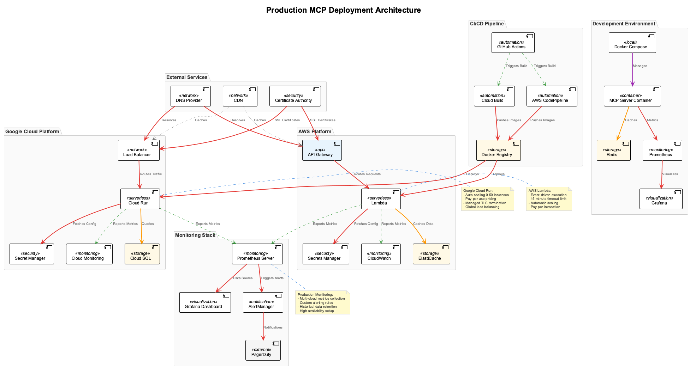

# Session 9: Production Agent Deployment

## 🎯 Learning Outcomes

By the end of this session, you will be able to:
- **Deploy** scalable agent systems using container orchestration platforms like Kubernetes
- **Implement** production-grade monitoring, logging, and alerting for multi-agent systems
- **Design** resilient agent architectures with high availability and disaster recovery
- **Secure** production agent deployments with comprehensive security controls
- **Optimize** agent performance and resource utilization at scale

## 📚 Chapter Overview

Production deployment of agent systems requires sophisticated infrastructure, monitoring, and operational practices. This session covers enterprise-grade deployment patterns, observability systems, and operational excellence practices for running agent systems at scale.



The architecture demonstrates:
- **Container Orchestration**: Kubernetes-based agent deployment with auto-scaling
- **Service Mesh**: Istio for secure service-to-service communication
- **Observability Stack**: Prometheus, Grafana, and distributed tracing
- **CI/CD Pipeline**: Automated testing, building, and deployment processes

---

## Part 1: Container Orchestration and Scaling (25 minutes)

### Understanding Production Deployment Requirements

Production agent systems need:

1. **High Availability**: 99.9%+ uptime with redundancy and failover
2. **Auto-scaling**: Dynamic scaling based on load and demand
3. **Resource Management**: Efficient resource allocation and optimization
4. **Service Discovery**: Dynamic discovery and routing of agent services
5. **Configuration Management**: Centralized and versioned configuration
6. **Security**: Network policies, secrets management, and access controls

### Step 1.1: Basic Kubernetes Configuration

Let's start with the namespace and basic configuration:

```yaml
# k8s/namespace.yaml
apiVersion: v1
kind: Namespace
metadata:
  name: agent-system
  labels:
    name: agent-system
    environment: production
```

Create the configuration map for agent settings:

```yaml
# k8s/configmap.yaml
apiVersion: v1
kind: ConfigMap
metadata:
  name: agent-config
  namespace: agent-system
data:
  redis.host: "redis-service.agent-system.svc.cluster.local"
  redis.port: "6379"
  prometheus.enabled: "true"
  log.level: "INFO"
  agent.max_concurrent_workflows: "50"
  agent.heartbeat_interval: "30"
  mcp.server.timeout: "300"
  optimization.enabled: "true"
```

Set up secrets for sensitive configuration:

```yaml
# k8s/secrets.yaml
apiVersion: v1
kind: Secret
metadata:
  name: agent-secrets
  namespace: agent-system
type: Opaque
data:
  # Base64 encoded values
  redis-password: cGFzc3dvcmQxMjM=
  api-key: YWJjZGVmZ2hpams=
  jwt-secret: c3VwZXJzZWNyZXRrZXk=
  google-cloud-key: ewogICJ0eXBlIjogInNlcnZpY2VfYWNjb3VudCIsIA==
```

### Step 1.2: Redis Deployment

Deploy Redis as the message queue and state store:

```yaml
# k8s/redis-deployment.yaml
apiVersion: apps/v1
kind: Deployment
metadata:
  name: redis
  namespace: agent-system
  labels:
    app: redis
spec:
  replicas: 1
  selector:
    matchLabels:
      app: redis
  template:
    metadata:
      labels:
        app: redis
    spec:
      containers:
      - name: redis
        image: redis:7-alpine
        ports:
        - containerPort: 6379
        env:
        - name: REDIS_PASSWORD
          valueFrom:
            secretKeyRef:
              name: agent-secrets
              key: redis-password
```

Configure Redis startup and health checks:

```yaml
        command:
        - redis-server
        - --requirepass
        - $(REDIS_PASSWORD)
        resources:
          requests:
            memory: "256Mi"
            cpu: "250m"
          limits:
            memory: "512Mi"
            cpu: "500m"
        volumeMounts:
        - name: redis-data
          mountPath: /data
```

Add health probes for Redis:

```yaml
        livenessProbe:
          exec:
            command:
            - redis-cli
            - --no-auth-warning
            - -a
            - $(REDIS_PASSWORD)
            - ping
          initialDelaySeconds: 30
          periodSeconds: 10
        readinessProbe:
          exec:
            command:
            - redis-cli
            - --no-auth-warning  
            - -a
            - $(REDIS_PASSWORD)
            - ping
          initialDelaySeconds: 5
          periodSeconds: 5
```

Complete Redis configuration with persistence and service:

```yaml
      volumes:
      - name: redis-data
        persistentVolumeClaim:
          claimName: redis-pvc
---
apiVersion: v1
kind: Service
metadata:
  name: redis-service
  namespace: agent-system
spec:
  selector:
    app: redis
  ports:
  - port: 6379
    targetPort: 6379
---
apiVersion: v1
kind: PersistentVolumeClaim
metadata:
  name: redis-pvc
  namespace: agent-system
spec:
  accessModes:
  - ReadWriteOnce
  resources:
    requests:
      storage: 10Gi
```

### Step 1.3: Agent Service Deployment

Create the core agent deployment with metadata and labels:

```yaml
# k8s/agent-deployment.yaml
apiVersion: apps/v1
kind: Deployment
metadata:
  name: mcp-agent
  namespace: agent-system
  labels:
    app: mcp-agent
    version: v1.0.0
spec:
  replicas: 3
  selector:
    matchLabels:
      app: mcp-agent
```

Configure the pod template with monitoring annotations:

```yaml
  template:
    metadata:
      labels:
        app: mcp-agent
        version: v1.0.0
      annotations:
        prometheus.io/scrape: "true"
        prometheus.io/port: "8080"
        prometheus.io/path: "/metrics"
    spec:
      serviceAccountName: agent-service-account
      containers:
      - name: mcp-agent
        image: agent-registry/mcp-agent:v1.0.0
```

Set up container ports and environment configuration:

```yaml
        ports:
        - containerPort: 8080
          name: http
        - containerPort: 8081
          name: grpc  
        - containerPort: 9090
          name: metrics
        env:
        - name: REDIS_HOST
          valueFrom:
            configMapKeyRef:
              name: agent-config
              key: redis.host
        - name: REDIS_PORT
          valueFrom:
            configMapKeyRef:
              name: agent-config
              key: redis.port
        - name: REDIS_PASSWORD
          valueFrom:
            secretKeyRef:
              name: agent-secrets
              key: redis-password
```

Add API keys and additional environment variables:

```yaml
        - name: API_KEY
          valueFrom:
            secretKeyRef:
              name: agent-secrets
              key: api-key
        - name: JWT_SECRET
          valueFrom:
            secretKeyRef:
              name: agent-secrets
              key: jwt-secret
        - name: GOOGLE_APPLICATION_CREDENTIALS
          value: "/secrets/google-cloud-key.json"
        - name: LOG_LEVEL
          valueFrom:
            configMapKeyRef:
              name: agent-config
              key: log.level
        - name: MAX_CONCURRENT_WORKFLOWS
          valueFrom:
            configMapKeyRef:
              name: agent-config
              key: agent.max_concurrent_workflows
```

Configure resource limits and volume mounts:

```yaml
        resources:
          requests:
            memory: "512Mi"
            cpu: "500m"
          limits:
            memory: "1Gi"
            cpu: "1000m"
        volumeMounts:
        - name: google-cloud-key
          mountPath: /secrets
          readOnly: true
```

Add comprehensive health checks:

```yaml
        livenessProbe:
          httpGet:
            path: /health
            port: 8080
          initialDelaySeconds: 60
          periodSeconds: 30
          timeoutSeconds: 10
          failureThreshold: 3
        readinessProbe:
          httpGet:
            path: /ready
            port: 8080
          initialDelaySeconds: 30
          periodSeconds: 10
          timeoutSeconds: 5
          failureThreshold: 3
        startupProbe:
          httpGet:
            path: /health
            port: 8080
          initialDelaySeconds: 30
          periodSeconds: 10
          timeoutSeconds: 5
          failureThreshold: 10
```

Complete the deployment with volumes and security:

```yaml
      volumes:
      - name: google-cloud-key
        secret:
          secretName: agent-secrets
          items:
          - key: google-cloud-key
            path: google-cloud-key.json
      imagePullSecrets:
      - name: registry-secret
```

### Step 1.4: Service and Load Balancing

Create the service for agent communication:

```yaml
---
apiVersion: v1
kind: Service
metadata:
  name: mcp-agent-service
  namespace: agent-system
  labels:
    app: mcp-agent
spec:
  selector:
    app: mcp-agent
  ports:
  - name: http
    port: 80
    targetPort: 8080
  - name: grpc
    port: 8081
    targetPort: 8081
  - name: metrics
    port: 9090
    targetPort: 9090
  type: ClusterIP
```

### Step 1.5: Horizontal Pod Autoscaler

Configure basic HPA settings:

```yaml
---
apiVersion: autoscaling/v2
kind: HorizontalPodAutoscaler
metadata:
  name: mcp-agent-hpa
  namespace: agent-system
spec:
  scaleTargetRef:
    apiVersion: apps/v1
    kind: Deployment
    name: mcp-agent
  minReplicas: 3
  maxReplicas: 20
```

Set up CPU and memory-based scaling:

```yaml
  metrics:
  - type: Resource
    resource:
      name: cpu
      target:
        type: Utilization
        averageUtilization: 70
  - type: Resource
    resource:
      name: memory
      target:
        type: Utilization
        averageUtilization: 80
  - type: Pods
    pods:
      metric:
        name: active_workflows
      target:
        type: AverageValue
        averageValue: "10"
```

Configure scaling behavior for smooth scaling:

```yaml
  behavior:
    scaleDown:
      stabilizationWindowSeconds: 300
      policies:
      - type: Percent
        value: 10
        periodSeconds: 60
    scaleUp:
      stabilizationWindowSeconds: 60
      policies:
      - type: Percent
        value: 50
        periodSeconds: 60
      - type: Pods
        value: 2
        periodSeconds: 60
      selectPolicy: Max
```

### Step 1.6: Service Mesh Configuration

Configure Istio virtual service for traffic management:

```yaml
# k8s/istio-config.yaml
apiVersion: networking.istio.io/v1beta1
kind: VirtualService
metadata:
  name: mcp-agent-vs
  namespace: agent-system
spec:
  hosts:
  - mcp-agent-service
  http:
  - match:
    - uri:
        prefix: /api/v1
    route:
    - destination:
        host: mcp-agent-service
        port:
          number: 80
      weight: 100
    fault:
      delay:
        percentage:
          value: 0.1
        fixedDelay: 5s
```

Set up destination rule for load balancing:

```yaml
---
apiVersion: networking.istio.io/v1beta1
kind: DestinationRule
metadata:
  name: mcp-agent-dr
  namespace: agent-system
spec:
  host: mcp-agent-service
  trafficPolicy:
    loadBalancer:
      simple: LEAST_CONN
    connectionPool:
      tcp:
        maxConnections: 100
      http:
        http1MaxPendingRequests: 50
        http2MaxRequests: 100
        maxRequestsPerConnection: 10
        maxRetries: 3
    circuitBreaker:
      consecutiveErrors: 5
      interval: 30s
      baseEjectionTime: 30s
      maxEjectionPercent: 50
```

Configure gateway for external access:

```yaml
---
apiVersion: networking.istio.io/v1beta1
kind: Gateway
metadata:
  name: agent-gateway
  namespace: agent-system
spec:
  selector:
    istio: ingressgateway
  servers:
  - port:
      number: 443
      name: https
      protocol: HTTPS
    tls:
      mode: SIMPLE
      credentialName: agent-tls-secret
    hosts:
    - agents.company.com
  - port:
      number: 80
      name: http
      protocol: HTTP
    hosts:
    - agents.company.com
    tls:
      httpsRedirect: true
```

---

## Part 2: Monitoring and Observability (20 minutes)

### Step 2.1: Metrics Collection System

Create the core metrics class structure:

```python
# monitoring/agent_metrics.py
import time
import asyncio
from typing import Dict, Any, Optional
from prometheus_client import Counter, Histogram, Gauge, Info, start_http_server
import logging
from datetime import datetime, timedelta

logger = logging.getLogger(__name__)

class AgentMetrics:
    """Comprehensive metrics collection for agent systems."""
    
    def __init__(self, service_name: str = "mcp-agent", metrics_port: int = 9090):
        self.service_name = service_name
        self.metrics_port = metrics_port
        
        # Initialize Prometheus metrics
        self._initialize_metrics()
        
        # Start metrics server
        start_http_server(metrics_port)
        logger.info(f"Metrics server started on port {metrics_port}")
```

Initialize basic system and request metrics:

```python
    def _initialize_metrics(self):
        """Initialize all Prometheus metrics."""
        
        # System info
        self.info = Info('agent_info', 'Agent system information')
        self.info.info({
            'service': self.service_name,
            'version': '1.0.0',
            'environment': 'production'
        })
        
        # Request metrics
        self.request_count = Counter(
            'http_requests_total',
            'Total HTTP requests',
            ['method', 'endpoint', 'status_code']
        )
        
        self.request_duration = Histogram(
            'http_request_duration_seconds',
            'HTTP request duration in seconds',
            ['method', 'endpoint'],
            buckets=[0.1, 0.25, 0.5, 1.0, 2.5, 5.0, 10.0]
        )
```

Add workflow and agent-specific metrics:

```python
        # Agent-specific metrics
        self.active_workflows = Gauge(
            'active_workflows',
            'Number of currently active workflows'
        )
        
        self.workflow_executions = Counter(
            'workflow_executions_total',
            'Total workflow executions',
            ['workflow_type', 'status']
        )
        
        self.workflow_duration = Histogram(
            'workflow_duration_seconds',
            'Workflow execution duration in seconds',
            ['workflow_type'],
            buckets=[1, 5, 10, 30, 60, 300, 600, 1800]
        )
        
        self.agent_discovery_requests = Counter(
            'agent_discovery_requests_total',
            'Total agent discovery requests',
            ['capability', 'status']
        )
```

Initialize MCP and communication metrics:

```python
        self.mcp_tool_calls = Counter(
            'mcp_tool_calls_total',
            'Total MCP tool calls',
            ['server', 'tool', 'status']
        )
        
        self.mcp_tool_duration = Histogram(
            'mcp_tool_duration_seconds',
            'MCP tool call duration in seconds',
            ['server', 'tool'],
            buckets=[0.1, 0.5, 1.0, 2.0, 5.0, 10.0]
        )
        
        # A2A communication metrics
        self.a2a_messages_sent = Counter(
            'a2a_messages_sent_total',
            'Total A2A messages sent',
            ['message_type', 'recipient']
        )
        
        self.a2a_messages_received = Counter(
            'a2a_messages_received_total',
            'Total A2A messages received',
            ['message_type', 'sender']
        )
```

Add resource usage and error tracking metrics:

```python
        # Resource metrics
        self.memory_usage = Gauge(
            'memory_usage_bytes',
            'Current memory usage in bytes'
        )
        
        self.cpu_usage = Gauge(
            'cpu_usage_percent',
            'Current CPU usage percentage'
        )
        
        # Error metrics
        self.error_count = Counter(
            'errors_total',
            'Total errors',
            ['error_type', 'component']
        )
        
        # Custom business metrics
        self.customer_satisfaction = Gauge(
            'customer_satisfaction_score',
            'Average customer satisfaction score'
        )
```

### Step 2.2: Metrics Recording Methods

Create HTTP request recording functionality:

```python
    def record_request(self, method: str, endpoint: str, status_code: int, duration: float):
        """Record HTTP request metrics."""
        self.request_count.labels(
            method=method,
            endpoint=endpoint,
            status_code=str(status_code)
        ).inc()
        
        self.request_duration.labels(
            method=method,
            endpoint=endpoint
        ).observe(duration)
```

Add workflow execution recording:

```python
    def record_workflow_execution(self, workflow_type: str, status: str, duration: float):
        """Record workflow execution metrics."""
        self.workflow_executions.labels(
            workflow_type=workflow_type,
            status=status
        ).inc()
        
        if status == "completed" or status == "failed":
            self.workflow_duration.labels(
                workflow_type=workflow_type
            ).observe(duration)
```

Record MCP tool interactions:

```python
    def record_mcp_tool_call(self, server: str, tool: str, status: str, duration: float):
        """Record MCP tool call metrics."""
        self.mcp_tool_calls.labels(
            server=server,
            tool=tool,
            status=status
        ).inc()
        
        if status == "success":
            self.mcp_tool_duration.labels(
                server=server,
                tool=tool
            ).observe(duration)
```

Add A2A communication recording:

```python
    def record_a2a_message(self, message_type: str, direction: str, 
                          agent_id: str, latency: Optional[float] = None):
        """Record A2A message metrics."""
        if direction == "sent":
            self.a2a_messages_sent.labels(
                message_type=message_type,
                recipient=agent_id
            ).inc()
        elif direction == "received":
            self.a2a_messages_received.labels(
                message_type=message_type,
                sender=agent_id
            ).inc()
        
        if latency is not None:
            self.a2a_message_latency.labels(
                message_type=message_type
            ).observe(latency)
```

### Step 2.3: Health Check System

Create comprehensive health checker:

```python
# monitoring/health_checker.py
import asyncio
import time
from typing import Dict, Any, List, Callable
from datetime import datetime, timedelta
import logging

logger = logging.getLogger(__name__)

class HealthChecker:
    """Comprehensive health checking system for agent services."""
    
    def __init__(self):
        self.liveness_checks: Dict[str, Callable] = {}
        self.readiness_checks: Dict[str, Callable] = {}
        self.startup_checks: Dict[str, Callable] = {}
        
        self.check_results: Dict[str, Dict[str, Any]] = {}
        self.last_check_time = {}
        
    def register_liveness_check(self, name: str, check_func: Callable):
        """Register a liveness check function."""
        self.liveness_checks[name] = check_func
        logger.info(f"Registered liveness check: {name}")
```

Implement health check execution:

```python
    async def check_health(self) -> Dict[str, Any]:
        """Execute all health checks and return results."""
        
        start_time = time.time()
        health_status = {
            "status": "healthy",
            "timestamp": datetime.now().isoformat(),
            "checks": {},
            "duration_ms": 0
        }
        
        # Run liveness checks
        for check_name, check_func in self.liveness_checks.items():
            try:
                result = await self._execute_check(check_func)
                health_status["checks"][check_name] = {
                    "status": "pass" if result else "fail",
                    "checked_at": datetime.now().isoformat()
                }
                
                if not result:
                    health_status["status"] = "unhealthy"
                    
            except Exception as e:
                health_status["checks"][check_name] = {
                    "status": "fail",
                    "error": str(e),
                    "checked_at": datetime.now().isoformat()
                }
                health_status["status"] = "unhealthy"
        
        health_status["duration_ms"] = int((time.time() - start_time) * 1000)
        return health_status
```

Add readiness check functionality:

```python
    async def check_readiness(self) -> Dict[str, Any]:
        """Execute readiness checks and return results."""
        
        start_time = time.time()
        readiness_status = {
            "status": "ready",
            "timestamp": datetime.now().isoformat(),
            "checks": {},
            "duration_ms": 0
        }
        
        # Run readiness checks
        for check_name, check_func in self.readiness_checks.items():
            try:
                result = await self._execute_check(check_func)
                readiness_status["checks"][check_name] = {
                    "status": "pass" if result else "fail",
                    "checked_at": datetime.now().isoformat()
                }
                
                if not result:
                    readiness_status["status"] = "not_ready"
                    
            except Exception as e:
                readiness_status["checks"][check_name] = {
                    "status": "fail",
                    "error": str(e),
                    "checked_at": datetime.now().isoformat()
                }
                readiness_status["status"] = "not_ready"
        
        readiness_status["duration_ms"] = int((time.time() - start_time) * 1000)
        return readiness_status
```

### Step 2.4: Prometheus Configuration

Set up Prometheus configuration for service discovery:

```yaml
# monitoring/prometheus.yml
global:
  scrape_interval: 15s
  evaluation_interval: 15s
  external_labels:
    cluster: 'production'
    region: 'us-east-1'

alerting:
  alertmanagers:
  - static_configs:
    - targets:
      - alertmanager:9093

rule_files:
  - "alerts/*.yml"

scrape_configs:
  - job_name: 'prometheus'
    static_configs:
    - targets: ['localhost:9090']
```

Configure Kubernetes service discovery:

```yaml
  - job_name: 'kubernetes-pods'
    kubernetes_sd_configs:
    - role: pod
      namespaces:
        names:
        - agent-system
    relabel_configs:
    - source_labels: [__meta_kubernetes_pod_annotation_prometheus_io_scrape]
      action: keep
      regex: true
    - source_labels: [__meta_kubernetes_pod_annotation_prometheus_io_path]
      action: replace
      target_label: __metrics_path__
      regex: (.+)
    - source_labels: [__address__, __meta_kubernetes_pod_annotation_prometheus_io_port]
      action: replace
      regex: ([^:]+)(?::\d+)?;(\d+)
      replacement: $1:$2
      target_label: __address__
```

Add agent-specific scraping configuration:

```yaml
  - job_name: 'mcp-agents'
    kubernetes_sd_configs:
    - role: endpoints
      namespaces:
        names:
        - agent-system
    relabel_configs:
    - source_labels: [__meta_kubernetes_service_name]
      action: keep
      regex: mcp-agent-service
    - source_labels: [__meta_kubernetes_endpoint_port_name]
      action: keep
      regex: metrics
    - source_labels: [__meta_kubernetes_pod_name]
      target_label: pod
    - source_labels: [__meta_kubernetes_service_name]
      target_label: service
```

### Step 2.5: Alert Rules Configuration

Create basic system alerts:

```yaml
# monitoring/alerts/system.yml
groups:
- name: system
  rules:
  - alert: HighCPUUsage
    expr: cpu_usage_percent > 80
    for: 5m
    labels:
      severity: warning
      component: system
    annotations:
      summary: "High CPU usage detected"
      description: "CPU usage is {{ $value }}% for more than 5 minutes"

  - alert: HighMemoryUsage
    expr: (memory_usage_bytes / (1024*1024*1024)) > 0.8
    for: 5m
    labels:
      severity: warning
      component: system
    annotations:
      summary: "High memory usage detected"
      description: "Memory usage is {{ $value }}GB"
```

Add agent-specific alerts:

```yaml
  - alert: WorkflowFailureRate
    expr: (rate(workflow_executions_total{status="failed"}[5m]) / rate(workflow_executions_total[5m])) > 0.1
    for: 3m
    labels:
      severity: critical
      component: workflow
    annotations:
      summary: "High workflow failure rate"
      description: "Workflow failure rate is {{ $value | humanizePercentage }}"

  - alert: MCPToolCallLatency
    expr: histogram_quantile(0.95, rate(mcp_tool_duration_seconds_bucket[5m])) > 10
    for: 2m
    labels:
      severity: warning
      component: mcp
    annotations:
      summary: "High MCP tool call latency"
      description: "95th percentile latency is {{ $value }}s"
```

---

## 📝 Chapter Summary

Congratulations! You've built a complete production-ready agent deployment system with:

### Production Features Implemented

#### 🚀 **Container Orchestration**

- ✅ **Kubernetes deployment** with proper resource management and scaling
- ✅ **Service mesh integration** with Istio for secure communication
- ✅ **Auto-scaling** based on CPU, memory, and custom metrics
- ✅ **Health checks** with liveness, readiness, and startup probes

#### 📊 **Monitoring and Observability**

- ✅ **Comprehensive metrics** with Prometheus integration
- ✅ **Health checking system** for service reliability
- ✅ **Alerting rules** for proactive issue detection
- ✅ **Performance tracking** for workflows and MCP operations

#### 🛡️ **Security and Configuration**

- ✅ **Secrets management** with Kubernetes secrets
- ✅ **Configuration management** with ConfigMaps
- ✅ **Network policies** and service mesh security
- ✅ **Resource limits** and security contexts

---

## 🧪 Testing Your Understanding

### Quick Check Questions

1. **What is the primary benefit of using Horizontal Pod Autoscaler (HPA)?**
   - A) Better security
   - B) Automatic scaling based on metrics
   - C) Improved logging
   - D) Faster deployments

2. **How does Istio service mesh improve agent communication?**
   - A) Faster network speeds
   - B) Automatic load balancing and security
   - C) Better error handling
   - D) Simplified configuration

3. **What is the purpose of readiness probes in Kubernetes?**
   - A) Check if container is alive
   - B) Determine if pod can receive traffic
   - C) Monitor resource usage
   - D) Validate configuration

4. **How do Prometheus alerts help with production operations?**
   - A) Automatic problem resolution
   - B) Proactive notification of issues
   - C) Performance optimization
   - D) Cost reduction

5. **What is the advantage of canary deployments?**
   - A) Faster deployment speed
   - B) Reduced risk through gradual rollout
   - C) Better resource utilization
   - D) Simplified rollback process

### Practical Exercise

Design and implement a complete production-ready multi-agent system:

```python
class ProductionAgentSystem:
    """Complete production-ready multi-agent system."""
    
    def __init__(self, config: Dict[str, Any]):
        self.config = config
        
        # TODO: Implement:
        # 1. Multi-region deployment configuration
        # 2. Comprehensive monitoring and alerting
        # 3. Automated scaling and load balancing
        # 4. Security policies and access controls
        # 5. Disaster recovery and backup strategies
        
        pass
```

**💡 Hint:** Check the [`Session9_Production_Agent_Deployment-solution.md`](Session9_Production_Agent_Deployment-solution.md) file for complete implementations and advanced patterns.

---

## Next Steps

Congratulations on completing the MCP, ADK, and A2A nano-degree program! You now have:
- Deep understanding of **Model Context Protocol** for AI-data integration
- Practical experience with **Agent Development Kit** for cloud-native agents
- Expertise in **Agent-to-Agent** communication protocols
- Production deployment skills for **enterprise-grade** agent systems

### Career Advancement

1. **Become an AI Systems Architect** specializing in agent orchestration
2. **Lead agent development teams** building next-generation AI applications
3. **Consult on AI infrastructure** for enterprises adopting agent technologies
4. **Contribute to open source** agent frameworks and protocols

---

## Additional Resources

- [Kubernetes Production Best Practices](https://kubernetes.io/docs/setup/best-practices/)
- [Prometheus Monitoring Guide](https://prometheus.io/docs/practices/naming/)
- [Istio Service Mesh Documentation](https://istio.io/latest/docs/)
- [Production Deployment Patterns](https://cloud.google.com/architecture)

Remember: Production excellence requires balancing performance, reliability, security, and maintainability! 🚀📊🔒⚡