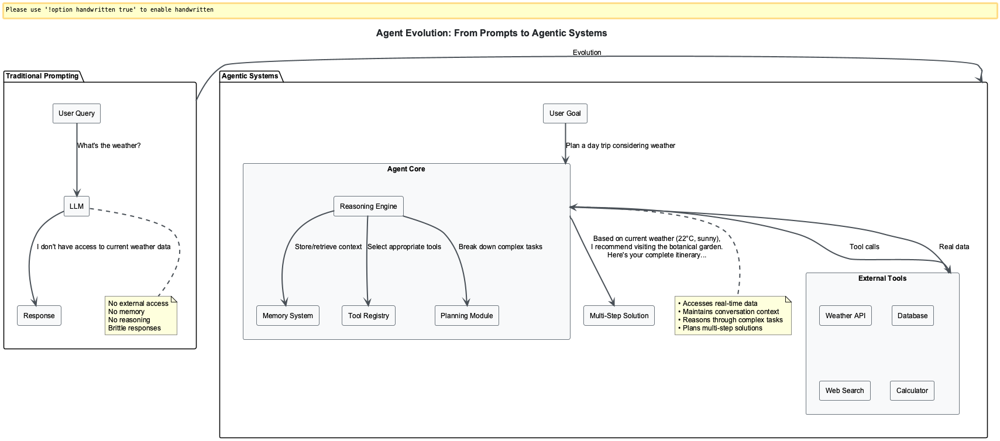

# 🤖 Agentic AI Nanodegree

## **Advanced AI Agent Development & Protocol Integration**

A comprehensive 6-week self-paced nanodegree covering the complete spectrum of modern AI agent development, from foundational patterns through cutting-edge protocols and production deployment strategies.

📖 **[View Complete Documentation Site](http://127.0.0.1:8001)** | 🌐 **[Live Demo](https://fwornle.github.io/agentic-ai-nano)**



---

## 📚 **Course Structure**

This nanodegree consists of **3 specialized modules**, each designed as a 2-week intensive study program:

### 🛠️ **Module 01: Agent Frameworks & Patterns** (10 Sessions)
**Duration:** 2 weeks | **Focus:** Core agent development with modern frameworks

### 🧠 **Module 02: Retrieval-Augmented Generation (RAG)** (10 Sessions)
**Duration:** 2 weeks | **Focus:** Advanced RAG systems and cognitive architectures

### 🌐 **Module 03: MCP, ACP & A2A Communication** (10 Sessions)
**Duration:** 2 weeks | **Focus:** Agent communication protocols and distributed systems

## 🎯 **Three Learning Paths**

Each session offers **three distinct learning paths** to accommodate different learning styles:

- **👀 Observer Path** (30-50 min): Conceptual understanding and high-level overview
- **🙋‍♂️ Participant Path** (60-90 min): Guided implementation with examples
- **🛠️ Implementer Path** (120-180 min): Complete hands-on development and customization

---

## 🎯 **Learning Outcomes**

Upon completion of this nanodegree, you will:

- **Master** the five core agentic patterns: Reflection, Tool Use, ReAct, Planning, and Multi-Agent Collaboration
- **Build** production-ready agents using cutting-edge frameworks (LangChain, CrewAI, PydanticAI, Atomic Agents, Agno)
- **Implement** sophisticated RAG systems with NodeRAG, reasoning-augmented retrieval, and multimodal capabilities
- **Design** distributed agent architectures using MCP, ACP, and A2A protocols
- **Deploy** enterprise-grade agent systems with monitoring, security, and scalability features

---

# 📖 **Module 01: Agent Frameworks & Patterns**

> **2-Week Module** | [📋 Full Curriculum](docs-content/01_frameworks/Agent_Frameworks_Nanodegree_Curriculum.md) | [🌐 Module Hub](docs-content/01_frameworks/index.md)

Master production-ready AI agents using 2025 state-of-the-art frameworks and the five core agentic patterns. Features performance breakthroughs (CrewAI 5.76x faster execution) and enterprise production capabilities.

## **Week 1: Core Agent Patterns & Framework Foundations**

| Session | Topic | Materials | Test |
|---------|-------|-----------|------|
| **Session 0** | [Introduction to Agent Frameworks & Patterns](docs-content/01_frameworks/Session0_Introduction_to_Agent_Frameworks_Patterns.md) | Self-study overview + optional modules | [📝 Test](docs-content/01_frameworks/Session0_Test_Solutions.md) |
| **Session 1** | [Bare Metal Agents](docs-content/01_frameworks/Session1_Bare_Metal_Agents.md) | Pure Python implementation + optional modules | [📝 Test](docs-content/01_frameworks/Session1_Test_Solutions.md) |
| **Session 2** | [LangChain Foundations](docs-content/01_frameworks/Session2_LangChain_Foundations.md) | Tool integration & chains + optional modules | [📝 Test](docs-content/01_frameworks/Session2_Test_Solutions.md) |
| **Session 3** | [LangGraph Multi-Agent Workflows](docs-content/01_frameworks/Session3_LangGraph_Multi_Agent_Workflows.md) | Advanced orchestration + optional modules | [📝 Test](docs-content/01_frameworks/Session3_Test_Solutions.md) |
| **Session 4** | [CrewAI Team Orchestration](docs-content/01_frameworks/Session4_CrewAI_Team_Orchestration.md) | Role-based collaboration + optional modules | [📝 Test](docs-content/01_frameworks/Session4_Test_Solutions.md) |
| **Session 5** | [PydanticAI Type-Safe Agents](docs-content/01_frameworks/Session5_PydanticAI_Type_Safe_Agents.md) | Type safety & validation + optional modules | [📝 Test](docs-content/01_frameworks/Session5_Test_Solutions.md) |

## **Week 2: Advanced Frameworks & Production Deployment**

| Session | Topic | Materials | Test |
|---------|-------|-----------|------|
| **Session 6** | [Atomic Agents Modular Architecture](docs-content/01_frameworks/Session6_Atomic_Agents_Modular_Architecture.md) | LEGO-block approach + optional modules | [📝 Test](docs-content/01_frameworks/Session6_Test_Solutions.md) |
| **Session 7** | [Building Your First ADK Agent](docs-content/01_frameworks/Session7_First_ADK_Agent.md) | Claude integration + optional modules | [📝 Test](docs-content/01_frameworks/Session7_Test_Solutions.md) |
| **Session 8** | [Agno Production-Ready Agents](docs-content/01_frameworks/Session8_Agno_Production_Ready_Agents.md) | Enterprise deployment + optional modules | [📝 Test](docs-content/01_frameworks/Session8_Test_Solutions.md) |
| **Session 9** | [Multi-Agent Patterns](docs-content/01_frameworks/Session9_Multi_Agent_Patterns.md) | Advanced coordination + optional modules | [📝 Test](docs-content/01_frameworks/Session9_Test_Solutions.md) |
| **Session 10** | [Enterprise Integration & Production](docs-content/01_frameworks/Session10_Enterprise_Integration_Production_Deployment.md) | Production deployment + optional modules | [📝 Test](docs-content/01_frameworks/Session10_Test_Solutions.md) |

### 💻 **Source Code & Examples**
- [Session Source Code](docs-content/01_frameworks/src/) - Complete implementation examples
- [Architectural Diagrams](docs-content/01_frameworks/puml/) - PlantUML architecture diagrams
- [Visual Assets](docs-content/01_frameworks/images/) - Supporting images and diagrams

---

# 🧠 **Module 02: Retrieval-Augmented Generation (RAG)**

> **2-Week Module** | [📋 Full Curriculum](docs-content/02_rag/RAG_Nanodegree_Curriculum.md) | [🌐 Module Hub](docs-content/02_rag/index.md)

Build sophisticated RAG systems from basic document retrieval to cutting-edge autonomous intelligent systems. Features latest research integration including NodeRAG, Reasoning-Augmented RAG, and MRAG Evolution.

## **Week 1: RAG Fundamentals & Advanced Techniques**

| Session | Topic | Materials | Test |
|---------|-------|-----------|------|
| **Session 0** | [Introduction to RAG Architecture](docs-content/02_rag/Session0_Introduction_to_RAG_Architecture.md) | RAG fundamentals + optional modules | [📝 Test](docs-content/02_rag/Session0_Test_Solutions.md) |
| **Session 1** | [Basic RAG Implementation](docs-content/02_rag/Session1_Basic_RAG_Implementation.md) | Core RAG pipeline + optional modules | [📝 Test](docs-content/02_rag/Session1_Test_Solutions.md) |
| **Session 2** | [Advanced Chunking & Preprocessing](docs-content/02_rag/Session2_Advanced_Chunking_Preprocessing.md) | Smart document processing + optional modules | [📝 Test](docs-content/02_rag/Session2_Test_Solutions.md) |
| **Session 3** | [Vector Databases & Search Optimization](docs-content/02_rag/Session3_Vector_Databases_Search_Optimization.md) | Search infrastructure + optional modules | [📝 Test](docs-content/02_rag/Session3_Test_Solutions.md) |
| **Session 4** | [Query Enhancement & Context Augmentation](docs-content/02_rag/Session4_Query_Enhancement_Context_Augmentation.md) | Query optimization + optional modules | [📝 Test](docs-content/02_rag/Session4_Test_Solutions.md) |
| **Session 5** | [RAG Evaluation & Quality Assessment](docs-content/02_rag/Session5_RAG_Evaluation_Quality_Assessment.md) | Performance measurement + optional modules | [📝 Test](docs-content/02_rag/Session5_Test_Solutions.md) |

## **Week 2: Advanced RAG & Cognitive Architectures**

| Session | Topic | Materials | Test |
|---------|-------|-----------|------|
| **Session 6** | [Graph-Based RAG](docs-content/02_rag/Session6_Graph_Based_RAG.md) | NodeRAG implementation + optional modules | [📝 Test](docs-content/02_rag/Session6_Test_Solutions.md) |
| **Session 7** | [Agentic RAG Systems](docs-content/02_rag/Session7_Agentic_RAG_Systems.md) | Reasoning-augmented retrieval + optional modules | [📝 Test](docs-content/02_rag/Session7_Test_Solutions.md) |
| **Session 8** | [MultiModal & Advanced RAG](docs-content/02_rag/Session8_MultiModal_Advanced_RAG.md) | MRAG Evolution (1.0→3.0) + optional modules | [📝 Test](docs-content/02_rag/Session8_Test_Solutions.md) |
| **Session 9** | [Production RAG & Enterprise Integration](docs-content/02_rag/Session9_Production_RAG_Enterprise_Integration.md) | Scalable deployment + optional modules | [📝 Test](docs-content/02_rag/Session9_Test_Solutions.md) |

### 💻 **Source Code & Examples**
- [Session Source Code](docs-content/02_rag/src/) - Complete RAG implementations
- [Visual Assets](docs-content/02_rag/images/) - RAG architecture diagrams
- [Documentation](docs-content/02_rag/src/README.md) - Implementation guides

---

# 🌐 **Module 03: Agentic Protocols (MCP, ACP, A2A)**

> **2-Week Module** | [📋 Full Curriculum](docs-content/03_mcp-acp-a2a/MCP_ACP_A2A_Nanodegree_Curriculum.md) | [🌐 Module Hub](docs-content/03_mcp-acp-a2a/index.md)

Build production-ready agent communication systems using Model Context Protocol (MCP), Agent Communication Protocol (ACP), and Agent-to-Agent (A2A) protocols for interoperable, distributed agent architectures.

## **Week 1: MCP Fundamentals & Implementation**

| Session | Topic | Materials | Solutions |
|---------|-------|-----------|-----------|
| **Session 0** | [Introduction to MCP, ACP & A2A](docs-content/03_mcp-acp-a2a/Session0_Introduction_to_MCP_ACP_A2A.md) | Protocol ecosystem overview | [📝 Solutions](docs-content/03_mcp-acp-a2a/Session0_Test_Solutions.md) |
| **Session 1** | [Building Your First MCP Server](docs-content/03_mcp-acp-a2a/Session1_Basic_MCP_Server.md) | Weather server implementation | [💡 Solutions](docs-content/03_mcp-acp-a2a/Session1_Basic_MCP_Server-solution.md) |
| **Session 2** | [FileSystem MCP Server](docs-content/03_mcp-acp-a2a/Session2_FileSystem_MCP_Server.md) | Advanced MCP capabilities | [💡 Solutions](docs-content/03_mcp-acp-a2a/Session2_FileSystem_MCP_Server-solution.md) |
| **Session 3** | [LangChain MCP Integration](docs-content/03_mcp-acp-a2a/Session3_LangChain_MCP_Integration.md) | Framework integration | [💡 Solutions](docs-content/03_mcp-acp-a2a/Session3_LangChain_MCP_Integration-solution.md) |
| **Session 4** | [Production MCP Deployment](docs-content/03_mcp-acp-a2a/Session4_Production_MCP_Deployment.md) | Enterprise deployment | [💡 Solutions](docs-content/03_mcp-acp-a2a/Session4_Production_MCP_Deployment-solution.md) |

## **Week 2: ACP & A2A Advanced Protocols**

| Session | Topic | Materials | Solutions |
|---------|-------|-----------|-----------|
| **Session 5** | [Secure MCP Server](docs-content/03_mcp-acp-a2a/Session5_Secure_MCP_Server.md) | Security & authentication | [💡 Solutions](docs-content/03_mcp-acp-a2a/Session5_Secure_MCP_Server-solution.md) |
| **Session 6** | [ACP Fundamentals](docs-content/03_mcp-acp-a2a/Session6_ACP_Fundamentals.md) | Agent Communication Protocol | [💡 Solutions](docs-content/03_mcp-acp-a2a/Session6_ACP_Fundamentals-solution.md) |
| **Session 7** | [Agent-to-Agent Communication](docs-content/03_mcp-acp-a2a/Session7_Agent_to_Agent_Communication.md) | A2A implementation | [💡 Solutions](docs-content/03_mcp-acp-a2a/Session7_Agent_to_Agent_Communication-solution.md) |
| **Session 8** | [Advanced Agent Workflows](docs-content/03_mcp-acp-a2a/Session8_Advanced_Agent_Workflows.md) | Complex orchestration | [💡 Solutions](docs-content/03_mcp-acp-a2a/Session8_Advanced_Agent_Workflows-solution.md) |
| **Session 9** | [Production Agent Deployment](docs-content/03_mcp-acp-a2a/Session9_Production_Agent_Deployment.md) | Scalable deployment | [💡 Solutions](docs-content/03_mcp-acp-a2a/Session9_Production_Agent_Deployment-solution.md) |

### 💻 **Source Code & Examples**
- [Session Source Code](docs-content/03_mcp-acp-a2a/src/) - Protocol implementations
- [Architectural Diagrams](docs-content/03_mcp-acp-a2a/puml/) - System architecture diagrams
- [Visual Assets](docs-content/03_mcp-acp-a2a/images/) - Protocol flow diagrams

---

## 📋 **Prerequisites**

### **Required Knowledge:**
- **Python Programming**: Intermediate level proficiency
- **API Integration**: Experience with REST APIs and JSON
- **Software Design**: Understanding of OOP and design patterns
- **Development Environment**: Virtual environments and package management

### **Recommended Background:**
- Basic understanding of Large Language Models (LLMs)
- Familiarity with HTTP protocols and web services
- Experience with databases and data processing
- Knowledge of distributed systems concepts

---

## 🚀 **Getting Started**

### **1. Choose Your Learning Path:**
- **Sequential**: Complete modules 01 → 02 → 03 for comprehensive understanding
- **Selective**: Focus on specific modules based on your interests and needs
- **Project-Based**: Use the nanodegree as reference while building your own agent systems

### **2. Setup Your Environment:**
```bash
# Clone the repository
git clone <repository-url>
cd nano-degree

# Create virtual environment
python -m venv venv
source venv/bin/activate  # Linux/Mac
# or
venv\Scripts\activate     # Windows

# Install dependencies (per module)
pip install -r docs-content/01_frameworks/src/session1/requirements.txt

# Or view the documentation site locally
mkdocs serve
```

### **3. Follow the Learning Structure:**
- 📖 Read session materials thoroughly
- 💻 Complete hands-on exercises and implementations  
- 📝 Take self-assessment tests to validate understanding
- 🔄 Review solutions and compare with your implementations

---

## 🎖️ **Certification Path**

### **Module Completion Criteria:**
- Complete all session materials and exercises
- Achieve 80%+ on all self-assessment tests  
- Successfully implement and test all practical exercises
- Build end-to-end projects demonstrating module concepts

### **Nanodegree Completion:**
- Complete all 3 modules
- Build a capstone project integrating concepts from all modules
- Demonstrate production-ready implementation skills

---

## 🤝 **Contributing**

This nanodegree is continuously updated with the latest research and industry best practices. Contributions are welcome:

- 🐛 **Bug Reports**: Issues with code examples or documentation
- 📚 **Content Updates**: New research integration and framework updates
- 💡 **Improvements**: Enhanced explanations, examples, and exercises
- 🔧 **Tools**: Utilities to improve the learning experience

---

## 📄 **License**

This educational content is provided under [appropriate license]. See LICENSE file for details.

---

## 🔗 **Quick Navigation**

### **Module Quick Links:**
- 🛠️ [**Module 01: Agent Frameworks**](docs-content/01_frameworks/) - Core patterns and frameworks
- 🧠 [**Module 02: RAG Systems**](docs-content/02_rag/) - Advanced retrieval and reasoning  
- 🌐 [**Module 03: Agent Protocols**](docs-content/03_mcp-acp-a2a/) - Communication and integration

### **Documentation:**
- 📖 [**Complete Documentation Site**](http://127.0.0.1:8001) - Interactive browsing experience
- 🌐 [**Live Documentation**](https://fwornle.github.io/agentic-ai-nano) - GitHub Pages deployment

### **Resources:**
- 📊 [**Architectural Diagrams**](config/) - System architecture references
- 🐳 [**Docker Setup**](docker/) - Containerized development environment
- 📈 [**Analytics & Logs**](logs/) - Learning progress tracking

---

**Ready to build the future of AI agents?** 🚀  

**Choose Your Path:**
- 📖 [**Browse Documentation Site**](http://127.0.0.1:8001) - Interactive experience with search and navigation
- 🛠️ [**Start with Module 01**](docs-content/01_frameworks/Session0_Introduction_to_Agent_Frameworks_Patterns.md) - Direct access to course materials

Embark on your journey to becoming an expert in agentic AI development!