# Cloud Development Environment with Coder

## Overview: Developing in the Cloud

The Agentic AI Nano-Degree leverages **Coder**, a cloud development environment platform, to provide instant, consistent, and secure development workspaces. This eliminates the traditional friction of local environment setup, dependency conflicts, and corporate network complexity - both technical and procedural - that often delay or derail learning initiatives.

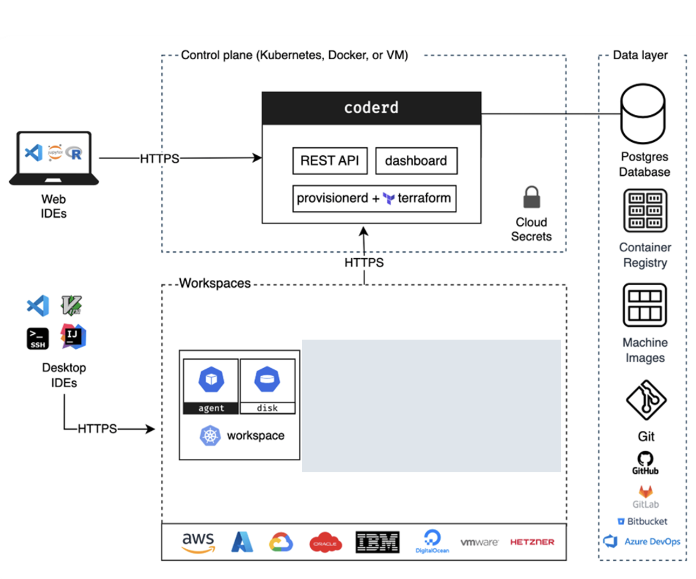
*Figure 1: Coder's architecture enables secure, scalable cloud development environments accessible from any browser or IDE*

Within the context of this nano-degree, an AWS cloud room has been set up (inside the corporate network for easy access to process resources) and controlled access to the Internet (through the corporate network firewall).

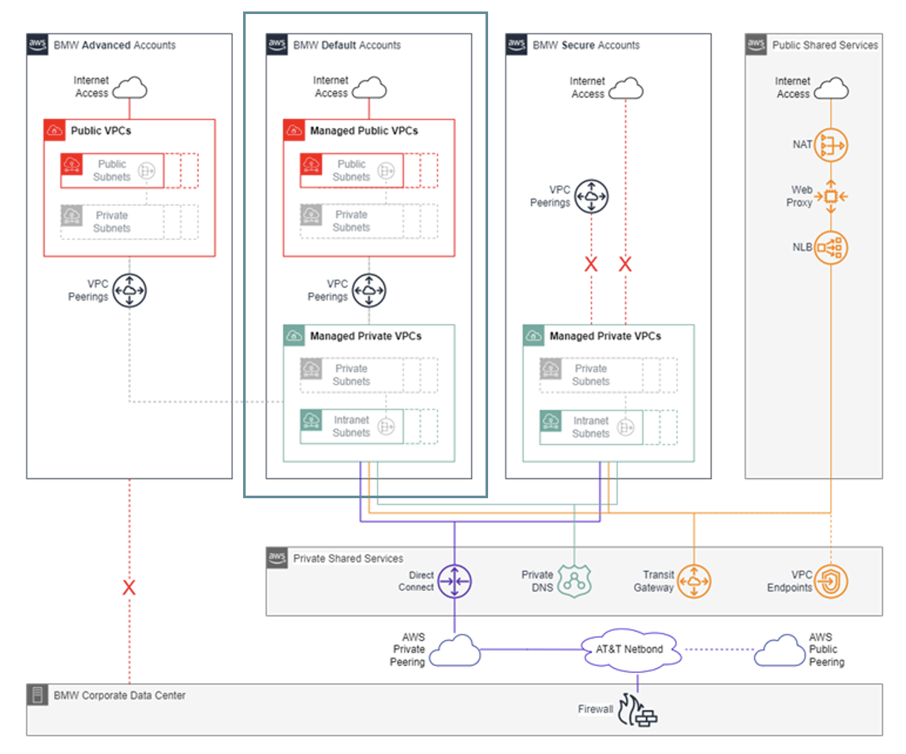
*Figure 2: Standard cloud development room configuration*

All relevant ports have been configured and firewall settings have been chosen to allow you to work with the libraries used by this course. This way, you should experience minimal friction due to the added complexity and limitations of a corporate environment.

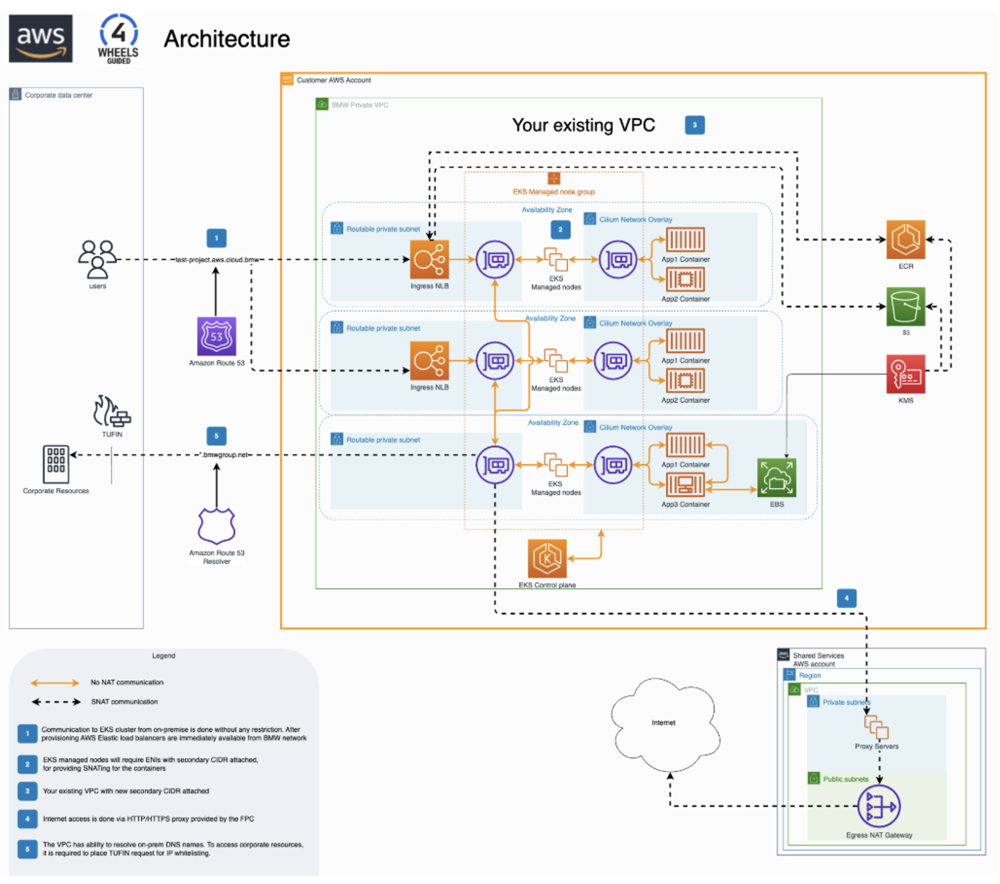
*Figure 3: Coder cluster providing scalable compute resources*

The cloud room runs an AWS Elastic Kubernetes Service (EKS) to deploy workloads. Coder uses this service to run your dev-containers.

### Cluster Resources

The nano-degree infrastructure provides:

- **Elastic Scaling**: Resources adjust to demand
- **GPU Availability**: For training and inference workloads
- **Persistent Storage**: Your work is saved between sessions
- **Network Isolation**: Secure, private development spaces

## Why Cloud Development?

### Traditional Challenges in Corporate Environments

Corporate developers and learners typically face:

- **Tool Installation Restrictions**: IT policies blocking software installations
- **Network Limitations**: Firewalls preventing package downloads
- **Version Conflicts**: Incompatible Python versions, library dependencies
- **Platform Inconsistencies**: Windows vs Mac vs Linux differences
- **Resource Constraints**: Limited local computing power for AI workloads

### The Cloud Development Solution

Cloud development environments solve these challenges by:

- **Pre-configured Environments**: All tools, dependencies, and configurations ready-to-use
- **Browser-Based Access**: Work from any device within the VPN
- **Consistent Experience**: Identical environment for all participants
- **Scalable Resources**: Cloud computing power for intensive AI/ML workloads
- **Zero Local Installation**: No conflicts with corporate IT policies

## How to Work with Coder

Go to [http://10.21.202.14/workspaces](http://10.21.202.14/workspaces) and log in with the provided credentials.

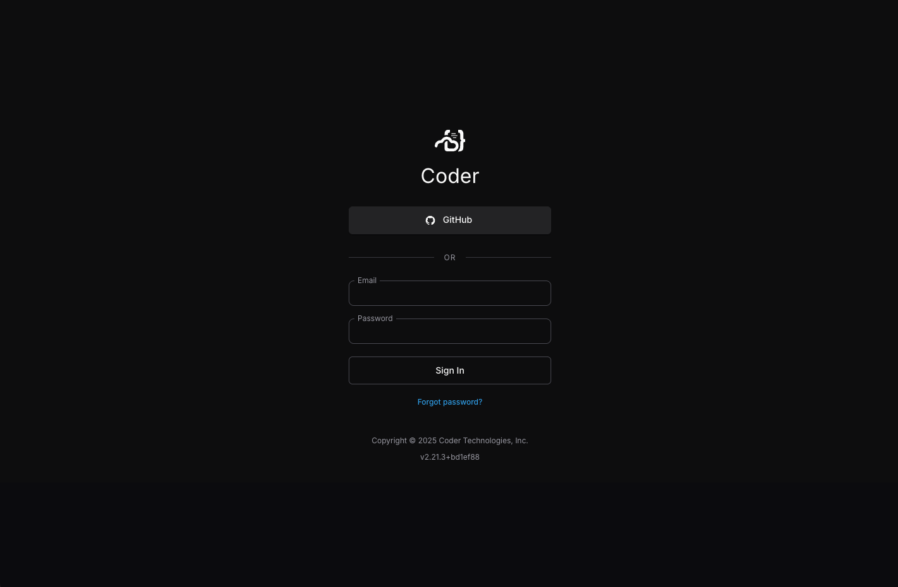
*Figure 4: Coder login screen*

Once logged-in, you get to your workspace from which you can launch into a previously configured workspace or create a new workspace.

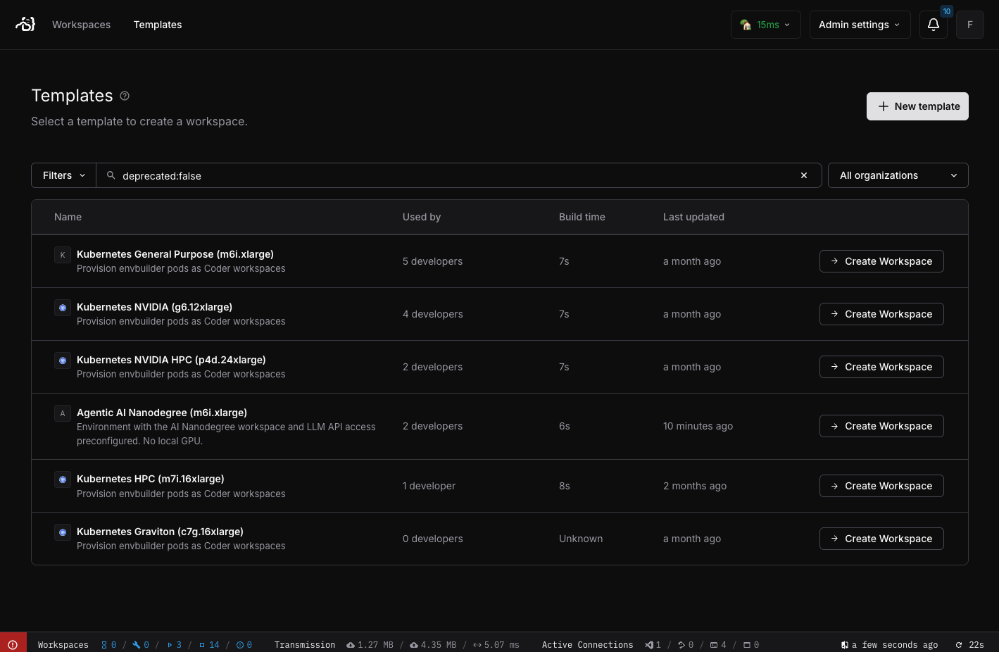
*Figure 5: Coder workspace dashboard showing available development environments*

Coder provides self-hosted development environments that can be:

1. **Deployed** on your infrastructure (cloud, on-premises, or air-gapped)
2. **Configured** using Terraform templates for consistency
3. **Provisioned** instantly by developers or AI coding agents
4. **Accessed** through browsers, VS Code, or other IDEs

### Workspace Lifecycle

For this course, a template has been configured: **Agentic AI Nanodegree (m6i.xlarge)**. Use this template when starting out with the course and creating your first very own workspace.

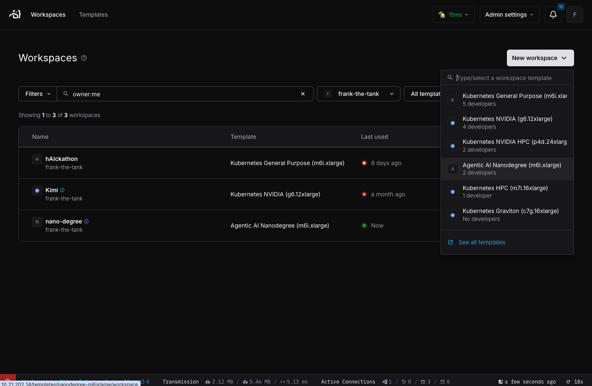
*Figure 6: Creating a new workspace with pre-configured templates*

If, at some stage, you need a larger machine, with GPUs or more RAM, you can easily clone and re-configure one of the existing templates - or create a new template from scratch:

1. **Select Template**: Choose from pre-configured nano-degree environments
2. **Configure Resources**: Adjust CPU, memory, and GPU as needed
3. **Launch Workspace**: Environment provisions in seconds
4. **Start Developing**: All tools and dependencies ready immediately

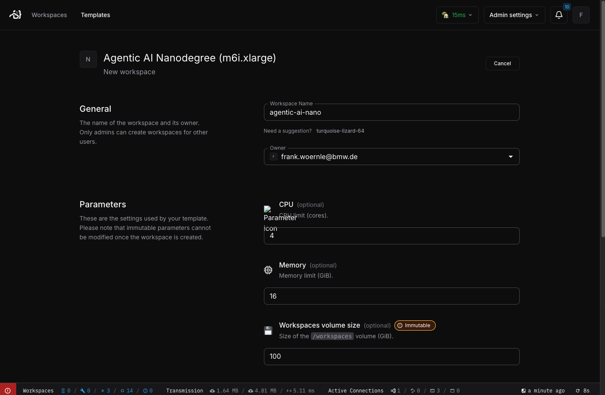
*Figure 7: Workspace configuration options for resource allocation*

## Dev Containers: The Foundation

Once the infrastructure has been configured and the corresponding workspace has been started, you can interact with this workspace through a terminal (SSH) or from within the configured development environment (eg. VSCode - either your desktop version which transparently tunnels into the cloud space, or as browser based instance served from Coder).

Click on VSCode (either desktop or browser-based) to start a new instance of your development environment connected to the workspace instance. A typical set-up of connecting to a remote dev-Container from a local Client (eg. VSCode) is shown below:

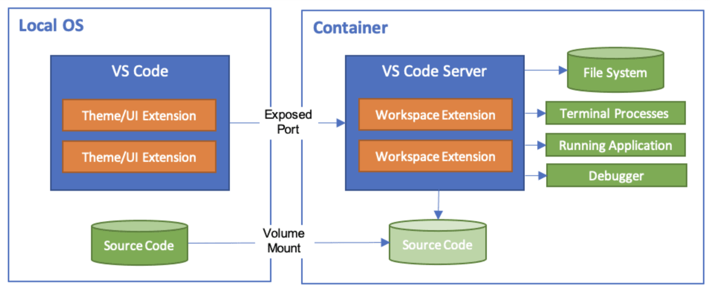
*Figure 8: VS Code seamlessly connecting to a dev container environment*

Dev containers provide:

- **Containerized Environments**: Isolated, reproducible development spaces
- **Full IDE Integration**: Complete IntelliSense, debugging, and extensions
- **Configuration as Code**: `devcontainer.json` defines entire environment
- **Portable Settings**: Personal preferences follow you across workspaces

### Key Benefits for Nano-Degree Participants

1. **Instant Setup**: No installation required - start coding immediately
2. **Consistent Environment**: Everyone uses identical configurations
3. **Pre-installed Tools**: Python, frameworks, libraries all ready
4. **GPU Access**: Cloud GPUs for AI model training and inference
5. **Collaboration Ready**: Share workspaces for pair programming or assistance

## Nano-Degree Specific Setup

Once your configured workspace has successfully been launched, you should be presented with a screen similar to this one:

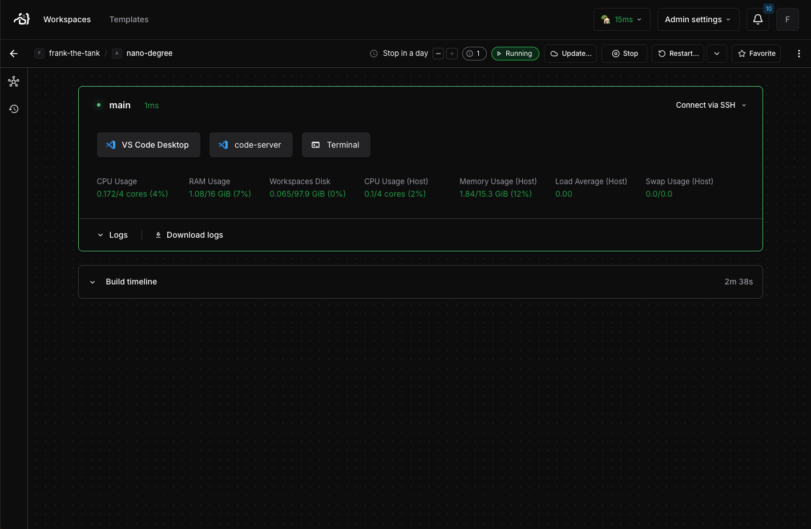
*Figure 9: Active Coder workspace with nano-degree environment*

## Getting Started

### Step 3: Connect Your IDE

Options include:

- **Browser-based VS Code**: No installation needed
- **Local VS Code**: Connect via Remote-SSH extension
- **JetBrains IDEs**: Full support via Gateway
- **Terminal Access**: SSH for command-line users

### Step 4: Start Learning

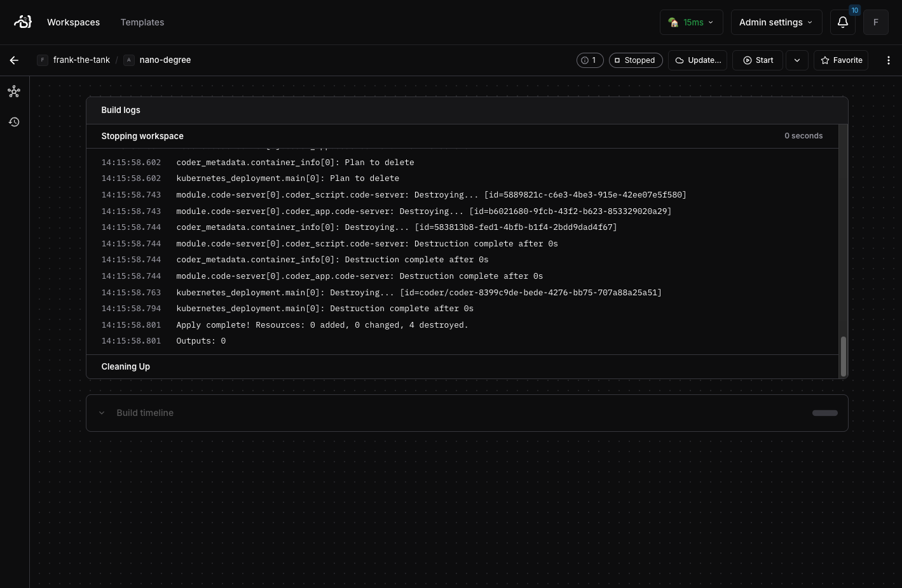
*Figure 10: Workspaces can be stopped to save resources when not in use*

Best practices:

- **Stop workspaces** when not in use to conserve resources
- **Use persistent storage** for important work
- **Leverage pre-built images** for faster startup
- **Customize your dotfiles** for personal preferences

### Pre-configured Environments

Within the context of the nano-degree, each module comes with specialized workspaces:

#### Module 1 - Agent Frameworks

- Python 3.11+
- LangChain, CrewAI, PydanticAI pre-installed
- API keys securely managed
- Sample data and examples loaded

#### Module 2 - RAG Architecture

- Vector databases (Chroma, Pinecone clients)
- Embedding models cached
- Document processing tools
- Performance monitoring dashboards

#### Module 3 - MCP/ACP/A2A

- Protocol servers configured
- Network tools for testing
- Security certificates installed
- Multi-agent simulation environments

## Working with AI Assistants

As a product, Coder workspaces integrate with:

- **Claude**: Anthropic's AI assistant
- **GitHub Copilot**: Code completion and generation
- **OpenAI GPT**: Custom agent development
- **Local LLMs**: Private, secure AI assistance

Inside our corporate network, you have access to **GitHub Copilot** as well as [Coding-Assistant](https://github.com/msc94/coding_assistant?tab=readme-ov-file#readme), a CLI-based open-source coding assistant developed by our very own Marcel Schneider who kindly made his hobby an open-source project. This coding agent can be used from the command line using the preinstalled command *coding-assistant*:

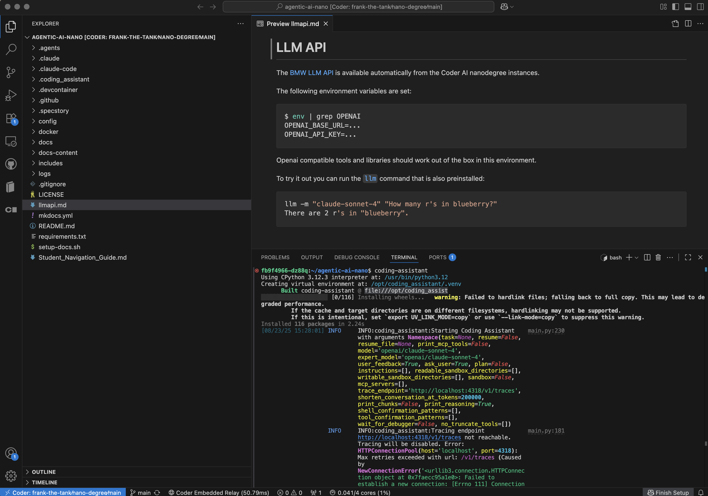
*Figure 11: Pre-installed coding agent "coding-assistant"*

In addition, to facilitate your agentic developments, the [Gaia LLM API has been pre-configured](llmapi.md) by setting the environment variables OPENAI_BASE_URL and OPENAI_API_KEY, as well as the provision of command *llm*. You can try using this from the command line as follows:

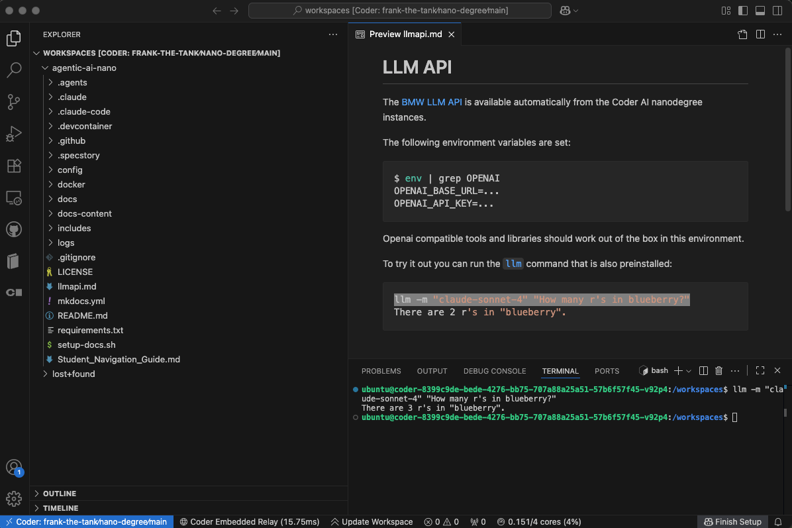
*Figure 12: Coder environments support AI coding assistants*

## Security and Compliance

Coder provides enterprise-grade security:

- **SOC 2 Type II Compliant**: Audited security controls
- **Air-Gap Support**: For classified environments
- **RBAC**: Role-based access control
- **Audit Logging**: Complete activity tracking
- **Encryption**: At-rest and in-transit protection

## Troubleshooting

### Common Issues and Solutions

#### Workspace Won't Start

- Check resource availability in cluster
- Verify network connectivity
- Contact support if persistent

#### Extensions Not Working

- Ensure extensions are installed in container
- Check devcontainer.json configuration
- Rebuild container if necessary

#### Performance Issues

- Upgrade to higher resource tier
- Check network latency
- Optimize code for cloud execution

## Support Resources

- **Documentation**: Comprehensive guides at coder.com/docs
- **Community Forum**: Get help from other users
- **Office Hours**: Weekly support sessions
- **Slack Channel**: Real-time assistance

## Conclusion

The cloud development infrastructure removes traditional barriers to learning and development. With Coder and dev containers, you can:

- **Start immediately** without installation hassles
- **Focus on learning** rather than environment setup
- **Access powerful resources** beyond typical laptops
- **Collaborate seamlessly** with instructors and peers
- **Work from anywhere** with just a browser

This modern approach to development environments ensures every participant can fully engage with the nano-degree content, regardless of their local system constraints or corporate IT policies.

---

**Ready to start?** Access your cloud development environment and begin your journey into Agentic AI development with zero friction and maximum productivity!
