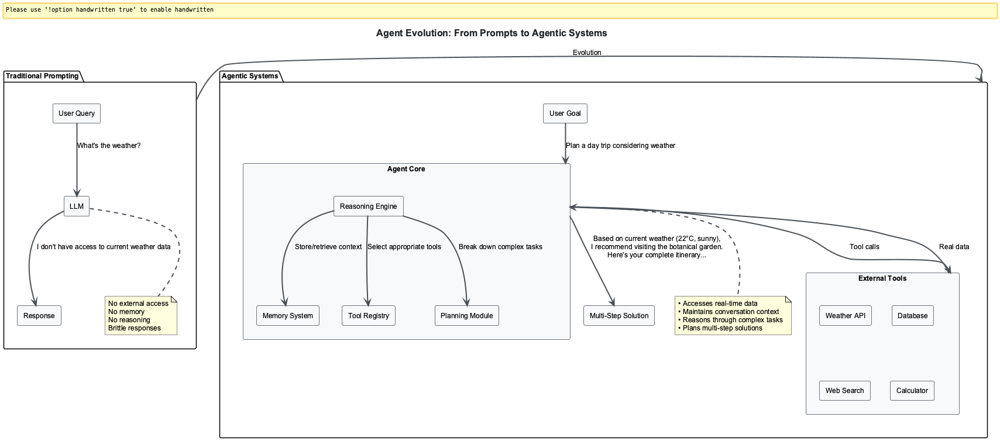
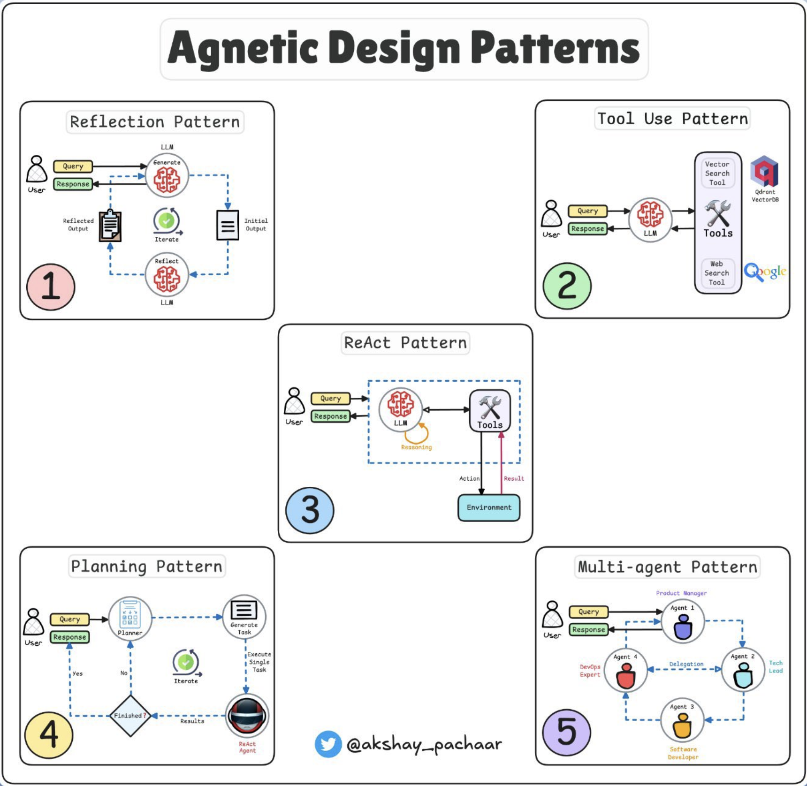
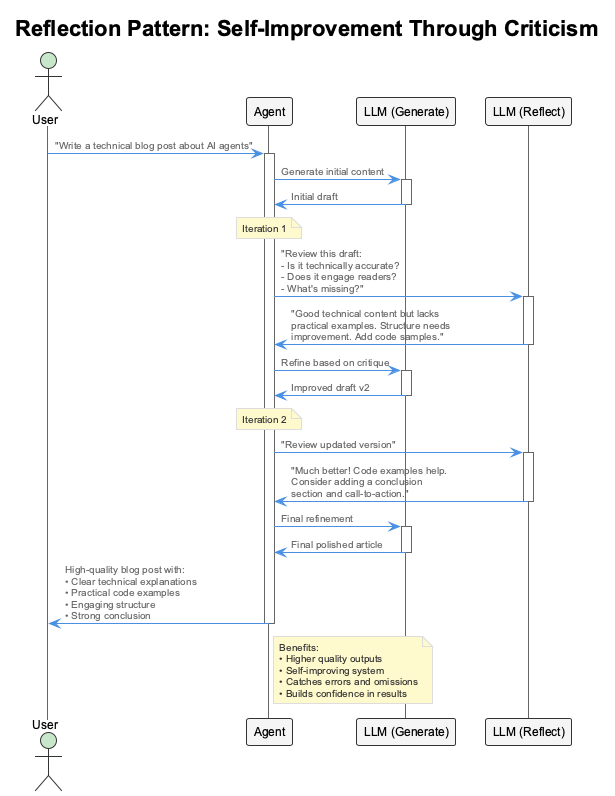
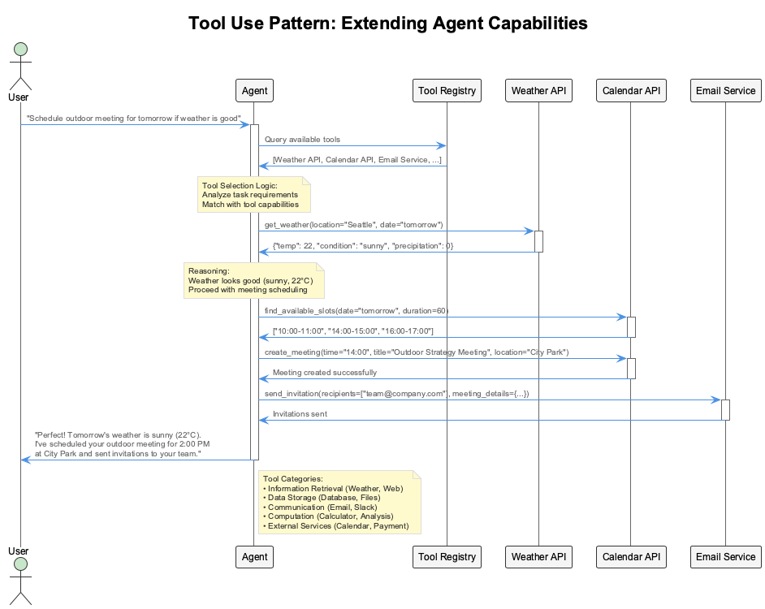
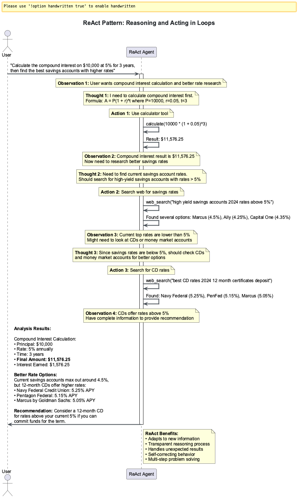
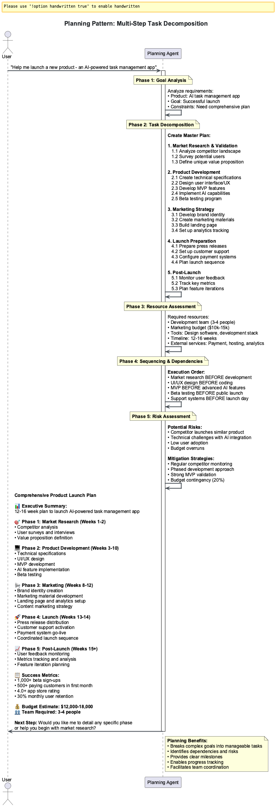
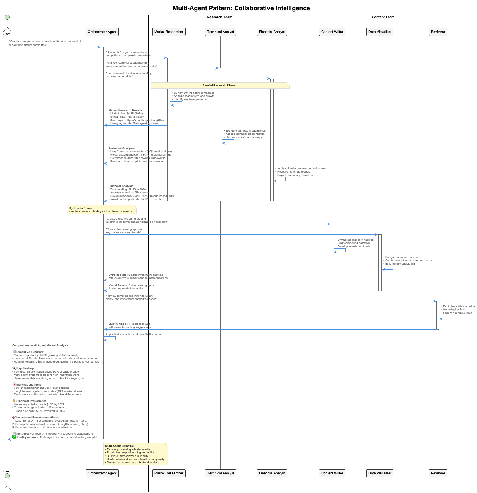

# 🎯 Session 0: Introduction to Agent Frameworks & Patterns - The Revolution That Changes Everything

## Learning Outcomes

By completing this session, you will:  

- Understand the evolution from simple prompts to sophisticated agent systems  
- Master the five core agentic patterns that power production systems  
- Compare modern agent frameworks and select appropriate tools for different use cases  
- Prepare for hands-on agent development in subsequent sessions  

## 🎯 Observer Path: Essential Concepts

Picture the data engineer who spends their days wrestling with pipeline failures at 3 AM, manually triggering reprocessing jobs, and constantly monitoring dashboards for anomalies. Now imagine an intelligent agent that not only detects these issues before they cascade, but automatically implements fixes, optimizes resource allocation, and even predicts future bottlenecks. The difference between reactive fire-fighting and proactive system intelligence - that's the transformation you're about to master.

Remember when ChatGPT first launched and everyone thought AI was just about clever chatbots? That was like discovering fire and thinking it was only good for staying warm. The real revolution happened when engineers realized they could give AI the ability to think, use tools, plan complex operations, and even work in teams.

Today's AI agents are processing terabytes of sensor data, optimizing ML pipeline resource allocation, and coordinating distributed validation workflows across cloud regions. They're not just analyzing data - they're making operational decisions that maintain pipeline efficiency and data quality. The difference between a simple data query and a production agent? It's these five fundamental patterns you're about to master.

Modern AI development has evolved from simple prompt-response interactions to sophisticated agent systems that can reason, use tools, and collaborate. This session covers the five core patterns that power every production agent system and compares the leading frameworks used to implement them.


---

### The Evolution of AI Interaction

The journey from simple prompt-response to sophisticated agent systems mirrors the evolution of data engineering itself - from manual ETL scripts to orchestrated, self-healing data pipelines:  



Think of traditional AI like a data analyst locked in a room with no access to live data streams, Kubernetes metrics, or processing pipelines. They can analyze static datasets from years ago, but that's it. Now imagine giving that analyst access to your entire data infrastructure - S3 buckets, PostgreSQL databases, Kafka streams, and Grafana dashboards - with the ability to trigger processing workflows. That's the leap from prompts to agents.

```python
# Traditional prompt-response (limited)
response = llm.generate("What's the weather today?")
# ❌ No context, no tools, no reasoning
```

This traditional approach treats the LLM like a static reference book. You ask a question, get an answer, and that's it. There's no memory of the conversation, no ability to use external tools, and no reasoning chain to work through complex problems.

```python
# Modern agent approach (powerful)
agent = Agent(tools=[weather_tool, calendar_tool])
response = agent.run("Plan my outdoor activities")
# ✅ Uses tools, plans ahead, considers context
```

The agent approach transforms this limitation into capability. The agent can check current weather conditions using the weather tool, access your calendar to see available time slots, and then create a comprehensive plan that considers both data sources.

### What Makes an Agent "Agentic"?

Four key characteristics define agentic systems - the same traits that separate a junior data engineer who needs constant supervision from a senior architect who proactively designs resilient systems:  

1. **Autonomy**: Makes decisions without constant human input - like a trusted pipeline orchestrator that knows when to scale resources independently  
2. **Reactivity**: Responds to environmental changes - adapts when data volume spikes or service dependencies fail  
3. **Proactivity**: Takes initiative toward goals - doesn't wait for alerts to optimize performance or prevent issues  
4. **Social Ability**: Interacts with other agents/humans - collaborates effectively across distributed data teams and systems  

### The Five Core Agentic Patterns

Every agent framework implements these fundamental patterns - they're like the fundamental forces in data engineering that govern how intelligent systems process, validate, and optimize information flow:  



### Pattern 1: Reflection - The Power of Second Thoughts

**Purpose**: Self-improvement through self-evaluation

Picture a data pipeline that pushes transformations to production without validation, causing downstream systems to fail with corrupted data. Now imagine that same pipeline taking 30 seconds to validate its own output schema, catching data quality issues before they propagate. That's the Reflection pattern - and it's transformative for data reliability.

The Reflection pattern addresses a fundamental challenge: LLMs often produce outputs that "sound good" but may have subtle errors or miss important aspects. By implementing a self-review cycle, agents can catch and correct their own mistakes before finalizing responses.

**How it works - like having an internal data quality control department:**  

- Generate initial response - the first draft  
- Critically evaluate the output ("Was that complete? Anything missing?") - internal review  
- Revise and improve based on self-critique - second draft incorporating feedback  
- No additional models needed - just structured prompting that creates an internal dialogue  

```python
# Reflection pattern - basic flow
response = agent.generate(task)
reflection = agent.reflect_on(response)
improved_response = agent.improve_based_on(reflection)
```

This shows the three-step reflection cycle: generate, reflect, improve. The agent first produces an initial response, then critically analyzes that response, and finally creates an enhanced version based on the self-critique.

```python
# Real-world reflection implementation
initial = agent.answer("Explain database indexing")
critique = agent.evaluate(initial, 
    prompts=["Is this technically accurate?",
             "Are all key concepts covered?",
             "Would a beginner understand this?"])
```

In practice, reflection uses structured evaluation criteria. The agent asks itself specific questions about accuracy, completeness, and clarity.

```python
final = agent.revise(initial, critique)
```

This systematic self-evaluation prevents the superficial improvements you'd get from generic "make it better" prompts and ensures comprehensive quality enhancement.

**Benefits:** Dramatically reduces errors in code generation, summaries, and detail-heavy tasks. Gives the model a "pause button and mirror" to double-check its work - the difference between a rushed data migration and a carefully validated schema change.



---

## 📝 Participant Path: Practical Application

*Prerequisites: Complete Observer Path sections above*  

Now that you understand the essential concepts, let's explore practical implementation details and real-world applications of these patterns.

### Pattern 2: Tool Use - Breaking Free from the Knowledge Prison

**Purpose**: Extending capabilities through external tools

Imagine having the world's smartest data engineer who knows every processing technique ever developed... but they finished learning in 2023 and can't access your live data streams or pipeline metrics. They're brilliant but useless for real-time processing decisions. The Tool Use pattern breaks this limitation.

LLMs have knowledge cutoffs and can't access your databases, files, or real-time data. The Tool Use pattern solves this by connecting models to external resources, transforming them from isolated text generators into systems that can fetch real data and perform actual operations.

**Key insight:** Your LLM doesn't need to know everything - it just needs to know how to fetch what it needs, like a smart data engineer who knows which monitoring dashboard to check for each type of issue.

**Common tool integrations - the agent's utility belt:**  

- Vector databases for semantic search - finding relevant knowledge  
- APIs (Stripe, WolframAlpha, internal endpoints) - accessing live services  
- Code execution environments (REPL, sandboxes) - running actual computations  
- Data lakes and processing databases - reading real sensor data streams  
- Web search and scraping tools - getting current information  

```python
# Tool use pattern - basic setup
tools = [calculator, web_search, file_reader]
agent = Agent(tools=tools)
result = agent.run("Calculate the GDP growth rate")
```

This demonstrates how agents break free from their knowledge limitations. Instead of guessing about recent GDP data (which wouldn't exist in training data), the agent uses web search to find current statistics and calculator to compute growth rates.

```python
# Production tool integration example
tools = [
    {"name": "query_db", "func": database.execute},
    {"name": "search_web", "func": web_api.search},
    {"name": "run_code", "func": sandbox.execute}
]
```

Production systems use function calling to integrate tools seamlessly. The agent can query databases for internal data, search the web for external information, and execute code for calculations.

```python
agent = Agent(tools=tools, function_calling=True)
# Agent stops hallucinating and starts pulling real data
```

This creates a hybrid intelligence system that combines the reasoning capabilities of LLMs with the factual accuracy of external data sources.

**Implementation requirements:** Function-calling capabilities, routing logic, error handling, and often frameworks like LangChain or Semantic Kernel for orchestration.

**Result:** Agents stop guessing and start working with real, verifiable data - the difference between speculation and facts.



### Pattern 3: ReAct (Reasoning + Acting) - Thinking While Doing

**Purpose**: Iterative reasoning and action cycles

Think of a data engineer troubleshooting a pipeline failure. They don't just theorize about all possible causes then implement one massive fix - they check logs, identify a pattern, test a hypothesis, observe the results, and iterate. That's ReAct - the pattern that makes agents adaptive problem solvers in complex data environments.

ReAct combines Reflection and Tool Use into a powerful loop where the agent thinks and acts iteratively. Instead of answering everything in one shot, the model reasons step-by-step and adjusts its actions as it learns more. This transforms agents from reactive responders to navigators that can adapt in real-time.

**The ReAct Loop - like a data pipeline monitoring system recalibrating in real-time:**

1. **Reason** about the current situation - "Where is the bottleneck?"
2. **Act** based on that reasoning - "Scale up processing nodes"
3. **Observe** the results - "Latency decreased but memory usage spiked"
4. **Update** understanding and repeat - "Need to optimize memory allocation..."

**Real-world example - finding data quality issues:**

- Goal: "Find the source of data inconsistencies in our warehouse"
- Step 1: Query data lineage tables - initial investigation
- Step 2: Notice transformation logic changes last week - pattern detected
- Step 3: Check deployment logs for that timeframe - gather context
- Step 4: Identify specific transformation causing issues - root cause found

```python
# ReAct pattern - basic loop structure
while not task_complete:
    thought = agent.think(current_state)
    action = agent.decide_action(thought)  
    observation = agent.execute(action)
    current_state = agent.update_state(observation)
```

This core loop shows how ReAct agents think and act iteratively rather than generating one massive response. Each cycle updates understanding based on real observations, enabling adaptive problem-solving that responds to changing conditions.

```python
# Production ReAct implementation
class ReActAgent:
    def solve(self, task):
        context = {"task": task, "history": []}
        
        while not self.is_complete(context):
            thought = self.reason(context)  # "Need user data from DB"
            action = self.select_tool(thought)  # Choose query_database
            result = self.execute(action)  # Run the query
            context = self.update(context, thought, action, result)
```

In practice, each cycle builds on previous knowledge. The context accumulates both reasoning steps and action results, creating a growing understanding of the problem. This enables sophisticated problem-solving where later actions are informed by earlier discoveries.

```python
            # Agent adapts based on execution results
            if "error" in result:
                thought = "Query failed, trying alternative approach..."
```

The key insight is adaptability - when actions fail, the agent doesn't repeat the same mistake. It reasons about the failure and tries different approaches, making it resilient to errors and changing conditions.

**Requirements for ReAct:**  

- Tools for taking action - hands to work with  
- Memory for keeping context - brain to remember  
- Reasoning loop to track progress - consciousness to guide  

**Why it matters:** ReAct makes agents flexible. Instead of rigid scripts, they think through each step, adapt in real-time, and course-correct when new information arrives - like the difference between a hardcoded ETL script and an intelligent data processing orchestrator.



### Pattern 4: Planning - From Reactive to Strategic

**Purpose**: Breaking complex tasks into manageable steps

Ask someone to "build a real-time data platform" and they'll freeze. Ask them to "set up Kafka message queues for event streaming" and they can start immediately. The Planning pattern transforms overwhelming data engineering requests into executable action plans.

LLMs excel at quick answers but struggle with multi-step tasks. The Planning pattern transforms agents from reactive helpers into proactive problem-solvers by breaking complex goals into structured, manageable steps that can be executed systematically.

**Key insight:** Intelligence isn't just about answers - it's about how those answers are formed. The process matters as much as the outcome, especially in data engineering where order of operations can make or break a migration.

**How Planning works - like a seasoned data architect:**  

1. Analyze the complex goal - understand the data requirements and constraints  
2. Decompose into logical sub-tasks - break it down by data domains and dependencies  
3. Sequence steps appropriately - respect data flow and dependency order  
4. Execute each step methodically - systematic progress with validation gates  
5. Track progress and adjust as needed - stay flexible as requirements evolve  

**Real-world example - data warehouse migration:**  

- Request: "Migrate our data warehouse to the cloud"  
- Agent creates plan:  
  1. Audit current data sources and volumes - baseline assessment  
  2. Design target schema and partitioning strategy - architecture foundation  
  3. Set up data pipeline infrastructure - build the pipes  
  4. Implement incremental data synchronization - minimize downtime  
  5. Validate data quality and performance - ensure reliability  
- Then tackles each part systematically with clear progress tracking  

```python
# Planning pattern - basic decomposition
plan = agent.create_plan("Organize a team meeting")
# Plan: [1. Check calendars, 2. Find time, 3. Book room]

for step in plan:
    agent.execute_step(step)
```

Planning transforms overwhelming tasks into manageable steps. Instead of trying to handle "organize a meeting" all at once, the agent breaks it down into specific, actionable steps that can be executed sequentially.

```python
# Advanced planning with dynamic adaptation
class PlanningAgent:
    def execute_task(self, goal):
        plan = self.decompose(goal)
        self.save_plan(plan)
```

Production planning systems persist plans to disk, enabling recovery from failures and resumption of long-running tasks.

```python
        # Store plan for persistence (can resume later)
        for step in plan:
            result = self.execute_step(step)
```

This is crucial for enterprise systems where tasks may span hours or days and need to survive system restarts.

```python
            # Dynamically adjust plan based on results
            if result.requires_replanning:
                plan = self.revise_plan(plan, result)
        
        return self.summarize_results()
```

The key insight is dynamic replanning - when execution reveals that the original plan won't work, the agent revises the remaining steps rather than failing. This creates robust systems that adapt to changing conditions while maintaining progress toward the goal.

**Implementation approaches:**  

- Embed planning in prompts ("First, break this task into steps...") - simple but effective  
- Let the model generate its own plans dynamically - more flexible  
- Store plans for persistence and resumability - production-ready  
- Use hierarchical planning for complex data processing workflows - distributed scale  

**Result:** Agents move from reactive to proactive, handling workflows and multi-step tasks with systematic precision - the difference between ad-hoc data fixes and strategic data architecture evolution.



### Pattern 5: Multi-Agent Collaboration - The Power of Specialized Teams

**Purpose**: Specialized agents working together

Would you rather have one person who's "pretty good" at data engineering, DevOps, and business analysis, or a team where each member is world-class at their specialty? The Multi-Agent pattern creates AI dream teams where specialists collaborate to solve complex data challenges.

Why rely on one generalist agent when you can have a team of specialists? The Multi-Agent pattern assigns different roles to different agents, each handling their piece of the puzzle. They collaborate, iterate, and sometimes even debate to produce superior results.

**Key insight:** The magic happens when agents disagree - that's when you get sharper insights and deeper thinking. It's creative tension that produces excellence, like when a data engineer and architect debate the trade-offs between processing speed and data consistency.

**Typical multi-agent roles - your data engineering dream team:**  

- **Data Engineer**: Optimizes pipelines and processing workflows - the infrastructure specialist  
- **Data Architect**: Designs schemas and data models - the strategic thinker  
- **Quality Engineer**: Validates data integrity and performance - the reliability guardian  
- **Analytics Engineer**: Transforms data for business insights - the bridge to value  
- **Platform Engineer**: Manages infrastructure and deployment - the scalability expert  

**Collaboration dynamics - how great data teams work:**  

- Agents communicate through a controller or message bus - structured communication  
- Each agent has a specific role and expertise area - clear responsibilities  
- They can critique each other's work - peer review  
- Iterative refinement through discussion - continuous improvement  

```python
# Multi-agent pattern - basic collaboration
research_agent = Agent(role="researcher", tools=[web_search])
writer_agent = Agent(role="writer", tools=[document_tools])
editor_agent = Agent(role="editor", tools=[grammar_check])
```

This shows specialization in action - each agent focuses on what they do best rather than trying to handle everything.

```python
result = orchestrate([research_agent, writer_agent, editor_agent])
```

The researcher gathers information, the writer creates content, and the editor polishes the final product. This division of labor produces higher quality results than any single generalist agent.

```python
# Advanced multi-agent system architecture
class MultiAgentSystem:
    def __init__(self):
        self.agents = {
            "researcher": ResearchAgent(tools=[web_search]),
            "architect": DesignAgent(speciality="system_design"),
            "developer": CodingAgent(languages=["python"]),
```

Production systems create specialized agent teams that mirror real development workflows.

```python
            "tester": QAAgent(tools=[test_runner]),
            "reviewer": ReviewAgent(focus=["security"])
        }
```

Each agent has specific tools and expertise areas, creating a system where complex projects benefit from diverse, specialized intelligence rather than generic problem-solving.

```python
    def execute(self, project):
        research = self.agents["researcher"].investigate(project)
        design = self.agents["architect"].create_design(research)
```

The execution flow mirrors professional development practices - sequential phases for dependent work, parallel execution where possible.

```python
        implementation = self.agents["developer"].build(design)
        tests = self.agents["tester"].create_tests(design)
```

This creates efficient workflows that maximize both speed and quality.

```python
        # Agents review and critique each other's work
        review = self.agents["reviewer"].evaluate(implementation)
        
        if review.has_issues:
            self.refine_with_feedback(review.feedback)
```

The peer review and iteration cycles ensure quality improvement through collaboration.

```python
        return self.compile_results()
```

When issues are found, the system doesn't just flag them - it actively works to resolve them through coordinated agent effort, creating a self-improving development process.

**Implementation approaches:**  

- Simple: Give each agent a name and job description - role playing  
- Intermediate: Let agents message each other through a controller - structured communication  
- Advanced: Implement voting, consensus mechanisms, and conflict resolution - sophisticated coordination  

**Benefits:**  

- Specialized expertise in each domain - depth over breadth  
- Parallel processing of complex tasks - speed through parallelization  
- Higher quality through peer review - multiple perspectives  
- Emergent problem-solving through collaboration - the whole exceeds the parts  



---

## ⚙️ Implementer Path: Advanced Topics

*Prerequisites: Complete Observer and Participant paths*  

For comprehensive mastery of agent frameworks and enterprise deployment:  

- ⚙️ **[Advanced Framework Analysis](Session0_Advanced_Framework_Analysis.md)** - Deep dive into enterprise framework selection, production deployment considerations, security patterns, and performance optimization strategies

---

## Next Steps - Your Journey to Mastery

### Your Learning Journey

This module follows a progressive skill-building path designed to take you from curiosity to competence in building production-ready data agents:  

```text
Week 1: Foundation & Core Patterns
Session 1: Bare Metal → Session 2: LangChain → Session 3: LangGraph 
Session 4: CrewAI → Session 5: PydanticAI → Session 6: Atomic Agents

Week 2: Production & Enterprise  
Session 7: Google ADK → Session 8: Agno → Session 9: Multi-Agent Patterns
Session 10: Enterprise Integration

Capstone: Multi-Framework Agent Ecosystem
```

## Chapter Summary

### Key Takeaways

1. **Agent Evolution**: Modern AI has evolved from simple prompt-response to sophisticated autonomous systems with four key characteristics: autonomy, reactivity, proactivity, and social ability  

2. **Five Core Patterns**: All production agent systems implement these fundamental patterns:  
   - **Reflection**: Self-improvement through self-evaluation  
   - **Tool Use**: Extending capabilities through external tools  
   - **ReAct**: Iterative reasoning and action cycles  
   - **Planning**: Breaking complex tasks into manageable steps  
   - **Multi-Agent Collaboration**: Specialized agents working together  

3. **Framework Selection**: Choose frameworks based on your use case:  
   - **Learning/Prototyping**: LangChain, CrewAI  
   - **Enterprise Production**: PydanticAI, Google ADK  
   - **Complex Workflows**: LangGraph  
   - **Microservices**: Atomic Agents  

### Self-Assessment Checklist

- [ ] I understand the evolution from prompts to agents  
- [ ] I can identify the 5 core agentic patterns in practice  
- [ ] I can compare frameworks and their production strengths  
- [ ] I'm ready to start building agents in Session 1  

### Optional Deep-Dive Modules

**⚠️ OPTIONAL CONTENT - Choose based on your goals:**  

- **[Advanced Framework Analysis](Session0_Advanced_Framework_Analysis.md)** - Enterprise framework selection and production deployment  
- **[Module A: Historical Context & Evolution](Session0_ModuleA_Historical_Context_Evolution.md)** - Evolution from rule-based systems to modern agents  
- **[Module B: Advanced Pattern Theory](Session0_ModuleB_Advanced_Pattern_Theory.md)** - Mathematical foundations of agent behavior  

---

## 📝 Practice Assessment

Ready to test your understanding? Take the practice test to validate your knowledge of agent frameworks and patterns:  

[**📝 Session 0 Practice Test →**](Session0_Practice_Test.md)

---

## 🧭 Navigation

**Previous:** [Module 1: Agent Frameworks](index.md) (Introduction)  
**Next:** [Session 1 - Bare Metal Agents →](Session1_Bare_Metal_Agents.md)

--