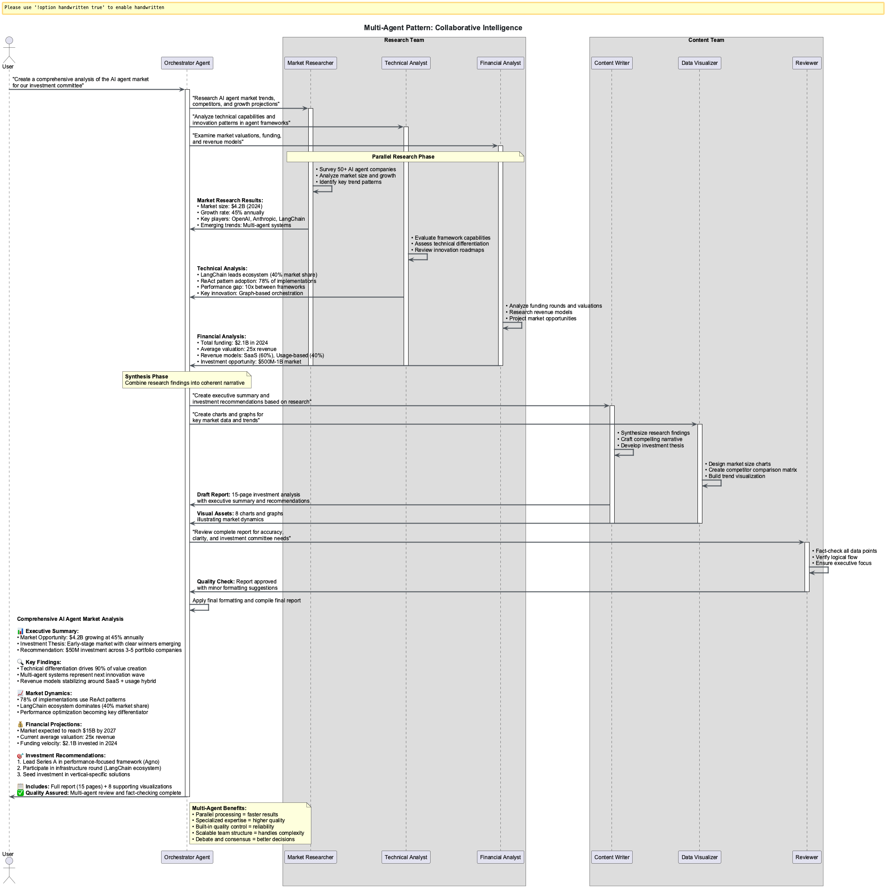

# Session 0: Introduction to Agent Frameworks & Patterns

## Learning Outcomes

By the end of this session, you will be able to:

- **Understand** the evolution from simple prompt-response to sophisticated agent systems
- **Identify** the five core agentic patterns that power all production systems
- **Compare** seven leading frameworks and their enterprise adoption patterns
- **Evaluate** framework selection criteria for different production scenarios
- **Apply** pattern recognition skills to classify agent behaviors and capabilities

## Chapter Overview: The Agent Revolution Transforming Enterprise Software

### Industry Context & Market Significance

The AI agent landscape is experiencing unprecedented growth. Gartner forecasts that by 2028, 33% of enterprise software applications will incorporate agentic AI - a dramatic leap from less than 1% in 2024. This session introduces you to the frameworks driving this transformation and the fundamental patterns that power autonomous AI systems.

### What You'll Learn & Why It Matters

You'll master the five core agentic patterns that every production system implements, compare seven leading frameworks used by companies like Microsoft, Google, and emerging startups, and understand why enterprises are moving from simple prompt-response to sophisticated agent orchestration. This foundation enables you to make informed technology choices and build systems that scale from prototype to production.

### How These Frameworks Stand Out

Modern agent frameworks like LangChain, CrewAI, and PydanticAI represent a paradigm shift from handcrafted logic to framework-driven engineering. Each addresses different production challenges: LangChain excels at modular orchestration, CrewAI specializes in role-based collaboration, and PydanticAI brings type safety to AI development.

### Real-World Applications

These patterns power automated research pipelines, content generation systems, business intelligence platforms, and decision automation tools across industries. You'll see how companies implement these patterns in production environments with monitoring, error handling, and enterprise integration.


### Figure 1: The evolution of agent frameworks from simple tools to sophisticated autonomous systems

### Learning Path Options

**Observer Path (30 minutes)**: Research-backed conceptual understanding of agent evolution and framework landscape

- Focus: Quick insights with industry context and pattern recognition
- Best for: Getting oriented and understanding the business value

**🙋‍♂️ Participant Path (45 minutes)**: Hands-on pattern recognition and framework comparison exercises  

- Focus: Interactive examples and framework evaluation exercises
- Best for: Learning through practical analysis

**🛠️ Implementer Path (65 minutes)**: Deep dive into code examples with optional advanced modules

- Focus: Technical implementation details and enterprise patterns
- Best for: Technical teams planning real-world deployments

---

### Part 1: From Prompts to Agents (10 minutes)

**Cognitive Load**: 2 new concepts
**Learning Mode**: Conceptual Understanding

#### The Evolution of AI Interaction (5 minutes)

The journey from simple prompt-response to sophisticated agent systems:


```python

# Traditional prompt-response (limited)

response = llm.generate("What's the weather today?")

# ❌ No context, no tools, no reasoning

# Modern agent approach (powerful)

agent = Agent(tools=[weather_tool, calendar_tool])
response = agent.run("Plan my outdoor activities for this week")

# ✅ Uses tools, plans ahead, considers context

```

#### What Makes an Agent "Agentic"? (5 minutes)

Four key characteristics define agentic systems:

1. **Autonomy**: Makes decisions without constant human input
2. **Reactivity**: Responds to environmental changes
3. **Proactivity**: Takes initiative toward goals
4. **Social Ability**: Interacts with other agents/humans

---

### Part 2: The Five Core Agentic Patterns (15 minutes)

**Cognitive Load**: 5 new concepts
**Learning Mode**: Pattern Recognition

Every agent framework implements these fundamental patterns:


#### Pattern 1: Reflection (3 minutes)

**Purpose**: Self-improvement through self-evaluation

```python

# Reflection pattern example

response = agent.generate(task)
reflection = agent.reflect_on(response)
improved_response = agent.improve_based_on(reflection)
```


#### Pattern 2: Tool Use (3 minutes)

**Purpose**: Extending capabilities through external tools

```python

# Tool use pattern example

tools = [calculator, web_search, file_reader]
agent = Agent(tools=tools)
result = agent.run("Calculate the GDP growth rate for France in 2023")
```


#### Pattern 3: ReAct (Reasoning + Acting) (3 minutes)

**Purpose**: Iterative reasoning and action cycles

```python

# ReAct pattern: Thought -> Action -> Observation -> Thought

while not task_complete:
    thought = agent.think(current_state)
    action = agent.decide_action(thought)  
    observation = agent.execute(action)
    current_state = agent.update_state(observation)
```


#### Pattern 4: Planning (3 minutes)

**Purpose**: Breaking complex tasks into manageable steps

```python

# Planning pattern example

plan = agent.create_plan("Organize a team meeting")

# Plan: [1. Check calendars, 2. Find common time, 3. Book room, 4. Send invites]

for step in plan:
    agent.execute_step(step)
```


#### Pattern 5: Multi-Agent Collaboration (3 minutes)

**Purpose**: Specialized agents working together

```python

# Multi-agent pattern

research_agent = Agent(role="researcher", tools=[web_search])
writer_agent = Agent(role="writer", tools=[document_tools])
editor_agent = Agent(role="editor", tools=[grammar_check])

result = orchestrate([research_agent, writer_agent, editor_agent], task="Write report")
```



---

### Part 3: Framework Landscape Overview (15 minutes)

**Cognitive Load**: 3 new concepts  
**Learning Mode**: Comparison & Selection


#### Framework Categories (5 minutes)

Modern agent frameworks fall into three main categories:

```python

# 1. Development-Focused (Learning & Prototyping)

frameworks = ["LangChain", "LangGraph"] 

# 2. Production-Focused (Enterprise Deployment)

frameworks = ["PydanticAI", "Agno", "Google ADK"]

# 3. Modular/Atomic (Compositional Architecture)

frameworks = ["Atomic Agents", "CrewAI"]
```

#### Framework Comparison Matrix (10 minutes)


### Enterprise Framework Analysis

| Framework | Production Ready | Enterprise Adoption | Primary Use Case |
|-----------|------------------|-------------------|------------------|
| **LangChain** | ⭐⭐⭐ | Most popular, modular orchestration | Prototyping, educational systems |
| **LangGraph** | ⭐⭐⭐⭐ | Complex state workflows | Advanced automation pipelines |
| **CrewAI** | ⭐⭐⭐⭐ | Role-based multi-agent systems | Content creation, research automation |
| **PydanticAI** | ⭐⭐⭐⭐⭐ | Type-safe, FastAPI-style development | Production APIs, structured outputs |
| **Atomic Agents** | ⭐⭐⭐⭐ | Microservice architectures | Modular enterprise systems |
| **Google ADK** | ⭐⭐⭐⭐⭐ | Google Cloud native | Enterprise Google Workspace integration |
| **Agno** | ⭐⭐⭐⭐ | Production monitoring focus | Deployed agent oversight |

**2025 Industry Selection Guidelines:**

```python

# Framework selection decision tree

if use_case == "learning_prototyping":
    choose(LangChain, CrewAI)  # Fastest onboarding
elif use_case == "enterprise_production":
    choose(PydanticAI, Google_ADK)  # Type safety + monitoring
elif use_case == "complex_workflows":
    choose(LangGraph)  # Advanced state management
elif use_case == "microservice_architecture":
    choose(Atomic_Agents)  # Compositional systems
```

### Production Deployment Considerations

- **Hidden Costs**: LangChain's modularity can create configuration complexity in production
- **Type Safety**: PydanticAI reduces runtime errors through schema validation
- **Monitoring**: Agno and ADK provide built-in observability for production systems
- **Vendor Lock-in**: Consider framework dependencies before committing to enterprise deployment

---

### Part 4: Module Learning Path (5 minutes)

**Cognitive Load**: 1 new concept
**Learning Mode**: Planning

#### Your Learning Journey

This module follows a progressive skill-building path:

```text
Week 1: Foundation & Core Patterns
Session 1: Bare Metal → Session 2: LangChain → Session 3: LangGraph 
Session 4: CrewAI → Session 5: PydanticAI → Session 6: Atomic Agents

Week 2: Production & Enterprise  
Session 7: Google ADK → Session 8: Agno → Session 9: Multi-Agent Patterns
Session 10: Enterprise Integration

Capstone: Multi-Framework Agent Ecosystem
```

### Key Learning Outcomes

- Master all 5 agentic patterns with hands-on implementation
- Build agents using 7+ different frameworks
- Deploy production-ready systems with monitoring
- Create multi-agent systems with enterprise patterns

---

## Chapter Summary

### Key Takeaways

1. **Agent Evolution**: Modern AI has evolved from simple prompt-response to sophisticated autonomous systems with four key characteristics: autonomy, reactivity, proactivity, and social ability

2. **Five Core Patterns**: All production agent systems implement these fundamental patterns:
   - **Reflection**: Self-improvement through self-evaluation
   - **Tool Use**: Extending capabilities through external tools
   - **ReAct**: Iterative reasoning and action cycles
   - **Planning**: Breaking complex tasks into manageable steps
   - **Multi-Agent Collaboration**: Specialized agents working together

3. **Framework Landscape**: Seven leading frameworks address different production needs:
   - **LangChain**: Modular orchestration for prototyping
   - **LangGraph**: Complex state workflows
   - **CrewAI**: Role-based multi-agent systems
   - **PydanticAI**: Type-safe production development
   - **Atomic Agents**: Microservice architectures
   - **Google ADK**: Enterprise Google integration
   - **Agno**: Production monitoring focus

4. **Selection Criteria**: Framework choice depends on use case requirements:
   - Learning/Prototyping → LangChain, CrewAI
   - Enterprise Production → PydanticAI, Google ADK
   - Complex Workflows → LangGraph
   - Microservices → Atomic Agents

### Self-Assessment Checklist

- [ ] I understand the evolution from prompts to agents
- [ ] I can identify the 5 core agentic patterns in practice
- [ ] I can compare frameworks and their production strengths
- [ ] I'm ready to start building agents in Session 1

### Optional Deep-Dive Modules

**⚠️ OPTIONAL CONTENT - Choose based on your goals:**

- **[Module A: Historical Context & Evolution](Session0_ModuleA_Historical_Context_Evolution.md)** - Evolution from rule-based systems to modern agents
- **[Module B: Advanced Pattern Theory](Session0_ModuleB_Advanced_Pattern_Theory.md)** - Mathematical foundations of agent behavior

---

## Multiple Choice Test - Session 0

Test your understanding of agent frameworks and patterns:

**Question 1:** Which agentic pattern involves an agent evaluating and improving its own outputs?  
A) Multi-Agent  
B) Planning  
C) Tool Use  
D) Reflection  

**Question 2:** The ReAct pattern combines which two key capabilities?  
A) Reflecting and Acting  
B) Reading and Acting  
C) Retrieving and Acting  
D) Reasoning and Acting  

**Question 3:** Which framework is best suited for high-performance applications with minimal resource usage?  
A) PydanticAI  
B) LangChain  
C) Agno  
D) CrewAI  

**Question 4:** What is the primary advantage of the Multi-Agent pattern?  
A) Lower resource usage  
B) Reduced complexity  
C) Specialized expertise collaboration  
D) Faster execution  

**Question 5:** Which framework emphasizes type safety through schema validation?  
A) PydanticAI  
B) CrewAI  
C) LangChain  
D) Agno  

[**🗂️ View Test Solutions →**](Session0_Test_Solutions.md)

---

## Navigation

**Previous:** [Module 1: Agent Frameworks](index.md) (Introduction)  
**Next:** [Session 1 - Bare Metal Agents →](Session1_Bare_Metal_Agents.md)

---
