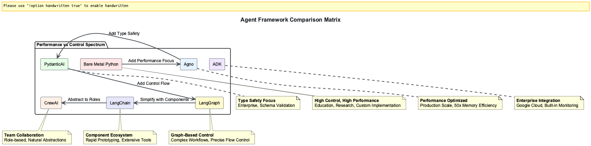

# Session 0: Introduction to Agent Frameworks & Patterns - The Revolution That Changes Everything

Remember when ChatGPT first launched and everyone thought AI was just about clever chatbots? That was like discovering fire and thinking it was only good for staying warm. The real revolution happened when engineers realized they could give AI the ability to think, use tools, plan complex operations, and even work in teams.

Today's AI agents are closing million-dollar deals, debugging production systems at 3 AM, and orchestrating supply chains across continents. They're not just answering questions - they're taking actions that impact real business outcomes. And the difference between a simple chatbot and a production agent? It's these five fundamental patterns you're about to master.

Modern AI development has evolved from simple prompt-response interactions to sophisticated agent systems that can reason, use tools, and collaborate. This session covers the five core patterns that power every production agent system and compares the leading frameworks used to implement them.


---

## Part 1: From Prompts to Agents - The Transformation That Changes Everything

### The Evolution of AI Interaction

The journey from simple prompt-response to sophisticated agent systems mirrors humanity's evolution from reactive survival to proactive civilization-building:


Think of traditional AI like a brilliant consultant locked in a room with no phone, no internet, and no ability to take action. They can give advice based on what they learned years ago, but that's it. Now imagine giving that consultant access to your entire company's systems, real-time data, and the ability to execute decisions. That's the leap from prompts to agents.

```python

# Traditional prompt-response (limited)

response = llm.generate("What's the weather today?")

# ❌ No context, no tools, no reasoning

# Modern agent approach (powerful)

agent = Agent(tools=[weather_tool, calendar_tool])
response = agent.run("Plan my outdoor activities for this week")

# ✅ Uses tools, plans ahead, considers context

```

### What Makes an Agent "Agentic"?

Four key characteristics define agentic systems - the same traits that separate a junior employee who needs constant supervision from a senior executive who drives initiatives independently:

1. **Autonomy**: Makes decisions without constant human input - like a trusted team member who knows when to act independently
2. **Reactivity**: Responds to environmental changes - adapts when situations shift unexpectedly
3. **Proactivity**: Takes initiative toward goals - doesn't wait to be told what to do next
4. **Social Ability**: Interacts with other agents/humans - collaborates effectively in complex environments

---

## Part 2: The Five Core Agentic Patterns - The Building Blocks of Intelligence

Every agent framework implements these fundamental patterns - they're like the fundamental forces in physics that govern how intelligent systems behave:


### Pattern 1: Reflection - The Power of Second Thoughts

**Purpose**: Self-improvement through self-evaluation

Picture a brilliant developer who writes code at lightning speed but never reviews it before pushing to production. Now imagine that same developer taking 30 seconds to review their own code, catching bugs before they cause outages. That's the Reflection pattern - and it's transformative.

The Reflection pattern addresses a fundamental challenge: LLMs often produce outputs that "sound good" but may have subtle errors or miss important aspects. By implementing a self-review cycle, agents can catch and correct their own mistakes before finalizing responses.

**How it works - like having an internal quality control department:**

- Generate initial response - the first draft
- Critically evaluate the output ("Was that complete? Anything missing?") - internal review
- Revise and improve based on self-critique - second draft incorporating feedback
- No additional models needed - just structured prompting that creates an internal dialogue

```python

# Reflection pattern example

response = agent.generate(task)
reflection = agent.reflect_on(response)
improved_response = agent.improve_based_on(reflection)

# Real-world implementation
initial = agent.answer("Explain database indexing")
critique = agent.evaluate(initial, 
    prompts=["Is this technically accurate?",
             "Are all key concepts covered?",
             "Would a beginner understand this?"])
final = agent.revise(initial, critique)
```

**Benefits:** Dramatically reduces errors in code generation, summaries, and detail-heavy tasks. Gives the model a "pause button and mirror" to double-check its work - the difference between a rushed email and a carefully reviewed proposal.


### Pattern 2: Tool Use - Breaking Free from the Knowledge Prison

**Purpose**: Extending capabilities through external tools

Imagine hiring the world's smartest analyst who has memorized every book ever written... but they finished reading in 2023 and can't access your company data. They're brilliant but useless for real-time decisions. The Tool Use pattern breaks this limitation.

LLMs have knowledge cutoffs and can't access your databases, files, or real-time data. The Tool Use pattern solves this by connecting models to external resources, transforming them from isolated text generators into systems that can fetch real data and perform actual operations.

**Key insight:** Your LLM doesn't need to know everything - it just needs to know how to fetch what it needs, like a smart executive who knows which expert to call.

**Common tool integrations - the agent's utility belt:**

- Vector databases for semantic search - finding relevant knowledge
- APIs (Stripe, WolframAlpha, internal endpoints) - accessing live services
- Code execution environments (REPL, sandboxes) - running actual computations
- File systems and databases - reading real company data
- Web search and scraping tools - getting current information

```python

# Tool use pattern example

tools = [calculator, web_search, file_reader]
agent = Agent(tools=tools)
result = agent.run("Calculate the GDP growth rate for France in 2023")

# Production implementation with function calling
tools = [
    {"name": "query_db", "func": database.execute},
    {"name": "search_web", "func": web_api.search},
    {"name": "run_code", "func": sandbox.execute}
]
agent = Agent(tools=tools, function_calling=True)
# Agent stops hallucinating and starts pulling real data
```

**Implementation requirements:** Function-calling capabilities, routing logic, error handling, and often frameworks like LangChain or Semantic Kernel for orchestration.

**Result:** Agents stop guessing and start working with real, verifiable data - the difference between speculation and facts.


### Pattern 3: ReAct (Reasoning + Acting) - Thinking While Doing

**Purpose**: Iterative reasoning and action cycles

Think of a detective solving a case. They don't just think about all possibilities then act once - they gather a clue, think about what it means, pursue a lead, reassess, and repeat. That's ReAct - the pattern that makes agents adaptive problem solvers.

ReAct combines Reflection and Tool Use into a powerful loop where the agent thinks and acts iteratively. Instead of answering everything in one shot, the model reasons step-by-step and adjusts its actions as it learns more. This transforms agents from reactive responders to navigators that can adapt in real-time.

**The ReAct Loop - like GPS recalculating in real-time:**

1. **Reason** about the current situation - "Where am I?"
2. **Act** based on that reasoning - "Turn left here"
3. **Observe** the results - "Road closed ahead"
4. **Update** understanding and repeat - "Recalculating route..."

**Real-world example - finding unpaid invoices:**

- Goal: "Find the user's recent unpaid invoices"
- Step 1: Query payments database - initial attempt
- Step 2: Notice results are outdated - problem detected
- Step 3: Check with user for date range - gather requirements
- Step 4: Adjust query and repeat - refined approach

```python

# ReAct pattern: Thought -> Action -> Observation -> Thought

while not task_complete:
    thought = agent.think(current_state)
    action = agent.decide_action(thought)  
    observation = agent.execute(action)
    current_state = agent.update_state(observation)

# Production implementation
class ReActAgent:
    def solve(self, task):
        context = {"task": task, "history": []}
        
        while not self.is_complete(context):
            thought = self.reason(context)  # "Need user data from DB"
            action = self.select_tool(thought)  # Choose query_database
            result = self.execute(action)  # Run the query
            context = self.update(context, thought, action, result)
            
            # Agent can now course-correct based on results
            if "error" in result:
                thought = "Query failed, trying alternative approach..."
```

**Requirements for ReAct:**

- Tools for taking action - hands to work with
- Memory for keeping context - brain to remember
- Reasoning loop to track progress - consciousness to guide

**Why it matters:** ReAct makes agents flexible. Instead of rigid scripts, they think through each step, adapt in real-time, and course-correct when new information arrives - like the difference between a GPS and printed directions.


### Pattern 4: Planning - From Reactive to Strategic

**Purpose**: Breaking complex tasks into manageable steps

Ask someone to "build a house" and they'll freeze. Ask them to "pour concrete for the foundation" and they can start immediately. The Planning pattern transforms overwhelming requests into executable action plans.

LLMs excel at quick answers but struggle with multi-step tasks. The Planning pattern transforms agents from reactive helpers into proactive problem-solvers by breaking complex goals into structured, manageable steps that can be executed systematically.

**Key insight:** Intelligence isn't just about answers - it's about how those answers are formed. The process matters as much as the outcome.

**How Planning works - like a seasoned project manager:**

1. Analyze the complex goal - understand the big picture
2. Decompose into logical sub-tasks - break it down
3. Sequence steps appropriately - order matters
4. Execute each step methodically - systematic progress
5. Track progress and adjust as needed - stay flexible

**Real-world example - product launch:**

- Request: "Help me launch a product"
- Agent creates plan:
  1. Define target audience - who are we serving?
  2. Design landing page - how do we present?
  3. Set up email campaigns - how do we communicate?
  4. Draft announcement copy - what do we say?
  5. Schedule social media posts - when do we say it?
- Then tackles each part systematically with clear progress tracking

```python

# Planning pattern example

plan = agent.create_plan("Organize a team meeting")

# Plan: [1. Check calendars, 2. Find common time, 3. Book room, 4. Send invites]

for step in plan:
    agent.execute_step(step)

# Advanced implementation with dynamic planning
class PlanningAgent:
    def execute_task(self, goal):
        # Break down the complex goal
        plan = self.decompose(goal)
        
        # Store plan for persistence (can resume later)
        self.save_plan(plan)
        
        for step in plan:
            result = self.execute_step(step)
            
            # Dynamically adjust plan based on results
            if result.requires_replanning:
                plan = self.revise_plan(plan, result)
        
        return self.summarize_results()
```

**Implementation approaches:**

- Embed planning in prompts ("First, break this task into steps...") - simple but effective
- Let the model generate its own plans dynamically - more flexible
- Store plans for persistence and resumability - production-ready
- Use hierarchical planning for complex projects - enterprise scale

**Result:** Agents move from reactive to proactive, handling workflows and multi-step tasks with systematic precision - the difference between a todo list and a project plan.


### Pattern 5: Multi-Agent Collaboration - The Power of Specialized Teams

**Purpose**: Specialized agents working together

Would you rather have one person who's "pretty good" at everything, or a team where each member is world-class at their specialty? The Multi-Agent pattern creates AI dream teams where specialists collaborate to solve complex problems.

Why rely on one generalist agent when you can have a team of specialists? The Multi-Agent pattern assigns different roles to different agents, each handling their piece of the puzzle. They collaborate, iterate, and sometimes even debate to produce superior results.

**Key insight:** The magic happens when agents disagree - that's when you get sharper insights and deeper thinking. It's creative tension that produces excellence.

**Typical multi-agent roles - your AI dream team:**

- **Researcher**: Gathers information and facts - the investigator
- **Planner**: Outlines steps and strategies - the strategist
- **Coder**: Writes implementation code - the builder
- **Reviewer**: Double-checks everything for quality - the quality controller
- **PM**: Keeps the team coordinated and on track - the orchestrator

**Collaboration dynamics - how great teams work:**

- Agents communicate through a controller or message bus - structured communication
- Each agent has a specific role and expertise area - clear responsibilities
- They can critique each other's work - peer review
- Iterative refinement through discussion - continuous improvement

```python

# Multi-agent pattern

research_agent = Agent(role="researcher", tools=[web_search])
writer_agent = Agent(role="writer", tools=[document_tools])
editor_agent = Agent(role="editor", tools=[grammar_check])

result = orchestrate([research_agent, writer_agent, editor_agent], task="Write report")

# Advanced multi-agent implementation
class MultiAgentSystem:
    def __init__(self):
        self.agents = {
            "researcher": ResearchAgent(tools=[web_search, arxiv_api]),
            "architect": DesignAgent(speciality="system_design"),
            "developer": CodingAgent(languages=["python", "javascript"]),
            "tester": QAAgent(tools=[test_runner, coverage_analyzer]),
            "reviewer": ReviewAgent(focus=["security", "performance"])
        }
    
    def execute(self, project):
        # Agents work in coordinated phases
        research = self.agents["researcher"].investigate(project)
        design = self.agents["architect"].create_design(research)
        
        # Multiple agents can work in parallel
        implementation = self.agents["developer"].build(design)
        tests = self.agents["tester"].create_tests(design)
        
        # Agents review and critique each other's work
        review = self.agents["reviewer"].evaluate(implementation, tests)
        
        # Iterate based on feedback
        if review.has_issues:
            self.refine_with_feedback(review.feedback)
        
        return self.compile_results()
```

**Implementation approaches:**

- Simple: Give each agent a name and job description - role playing
- Intermediate: Let agents message each other through a controller - structured communication
- Advanced: Implement voting, consensus mechanisms, and conflict resolution - sophisticated coordination

**Benefits:**

- Specialized expertise in each domain - depth over breadth
- Parallel processing of complex tasks - speed through parallelization
- Higher quality through peer review - multiple perspectives
- Emergent problem-solving through collaboration - the whole exceeds the parts


---

## Part 3: Framework Landscape Overview - Choosing Your Weapons

### Framework Categories

Modern agent frameworks fall into three main categories, each optimized for different stages of the journey from idea to production:

```python

# 1. Development-Focused (Learning & Prototyping)

frameworks = ["LangChain", "LangGraph"] 

# 2. Production-Focused (Enterprise Deployment)

frameworks = ["PydanticAI", "Agno", "Google ADK"]

# 3. Modular/Atomic (Compositional Architecture)

frameworks = ["Atomic Agents", "CrewAI"]
```

### Framework Comparison Matrix



### Enterprise Framework Analysis

Understanding which framework to choose is like selecting the right tool for construction - a hammer is perfect for nails but useless for screws:

| Framework | Production Ready | Enterprise Adoption | Primary Use Case |
|-----------|------------------|-------------------|------------------|
| **LangChain** | ⭐⭐⭐ | Most popular, modular orchestration | Prototyping, educational systems |
| **LangGraph** | ⭐⭐⭐⭐ | Complex state workflows | Advanced automation pipelines |
| **CrewAI** | ⭐⭐⭐⭐ | Role-based multi-agent systems | Content creation, research automation |
| **PydanticAI** | ⭐⭐⭐⭐⭐ | Type-safe, FastAPI-style development | Production APIs, structured outputs |
| **Atomic Agents** | ⭐⭐⭐⭐ | Microservice architectures | Modular enterprise systems |
| **Google ADK** | ⭐⭐⭐⭐⭐ | Google Cloud native | Enterprise Google Workspace integration |
| **Agno** | ⭐⭐⭐⭐ | Production monitoring focus | Deployed agent oversight |

**2025 Industry Selection Guidelines:**

```python

# Framework selection decision tree

if use_case == "learning_prototyping":
    choose(LangChain, CrewAI)  # Fastest onboarding
elif use_case == "enterprise_production":
    choose(PydanticAI, Google_ADK)  # Type safety + monitoring
elif use_case == "complex_workflows":
    choose(LangGraph)  # Advanced state management
elif use_case == "microservice_architecture":
    choose(Atomic_Agents)  # Compositional systems
```

### Production Deployment Considerations

The hidden realities that only emerge when you scale from demo to production:

- **Hidden Costs**: LangChain's modularity can create configuration complexity in production - flexibility has a price
- **Type Safety**: PydanticAI reduces runtime errors through schema validation - catch bugs at compile time
- **Monitoring**: Agno and ADK provide built-in observability for production systems - visibility is critical
- **Vendor Lock-in**: Consider framework dependencies before committing to enterprise deployment - exit strategies matter

---

## Part 4: Next Steps - Your Journey to Mastery

### Your Learning Journey

This module follows a progressive skill-building path designed to take you from curiosity to competence:

```text
Week 1: Foundation & Core Patterns
Session 1: Bare Metal → Session 2: LangChain → Session 3: LangGraph 
Session 4: CrewAI → Session 5: PydanticAI → Session 6: Atomic Agents

Week 2: Production & Enterprise  
Session 7: Google ADK → Session 8: Agno → Session 9: Multi-Agent Patterns
Session 10: Enterprise Integration

Capstone: Multi-Framework Agent Ecosystem
```

## Chapter Summary

### Key Takeaways

1. **Agent Evolution**: Modern AI has evolved from simple prompt-response to sophisticated autonomous systems with four key characteristics: autonomy, reactivity, proactivity, and social ability

2. **Five Core Patterns**: All production agent systems implement these fundamental patterns:
   - **Reflection**: Self-improvement through self-evaluation
   - **Tool Use**: Extending capabilities through external tools
   - **ReAct**: Iterative reasoning and action cycles
   - **Planning**: Breaking complex tasks into manageable steps
   - **Multi-Agent Collaboration**: Specialized agents working together

3. **Framework Landscape**: Seven leading frameworks address different production needs:
   - **LangChain**: Modular orchestration for prototyping
   - **LangGraph**: Complex state workflows
   - **CrewAI**: Role-based multi-agent systems
   - **PydanticAI**: Type-safe production development
   - **Atomic Agents**: Microservice architectures
   - **Google ADK**: Enterprise Google integration
   - **Agno**: Production monitoring focus

4. **Selection Criteria**: Framework choice depends on use case requirements:
   - Learning/Prototyping → LangChain, CrewAI
   - Enterprise Production → PydanticAI, Google ADK
   - Complex Workflows → LangGraph
   - Microservices → Atomic Agents

### Self-Assessment Checklist

- [ ] I understand the evolution from prompts to agents
- [ ] I can identify the 5 core agentic patterns in practice
- [ ] I can compare frameworks and their production strengths
- [ ] I'm ready to start building agents in Session 1

### Optional Deep-Dive Modules

**⚠️ OPTIONAL CONTENT - Choose based on your goals:**

- **[Module A: Historical Context & Evolution](Session0_ModuleA_Historical_Context_Evolution.md)** - Evolution from rule-based systems to modern agents
- **[Module B: Advanced Pattern Theory](Session0_ModuleB_Advanced_Pattern_Theory.md)** - Mathematical foundations of agent behavior

---

## Multiple Choice Test - Session 0

Test your understanding of agent frameworks and patterns:

**Question 1:** Which agentic pattern involves an agent evaluating and improving its own outputs?  
A) Multi-Agent  
B) Planning  
C) Tool Use  
D) Reflection  

**Question 2:** The ReAct pattern combines which two key capabilities?  
A) Reflecting and Acting  
B) Reading and Acting  
C) Retrieving and Acting  
D) Reasoning and Acting  

**Question 3:** Which framework is best suited for high-performance applications with minimal resource usage?  
A) PydanticAI  
B) LangChain  
C) Agno  
D) CrewAI  

**Question 4:** What is the primary advantage of the Multi-Agent pattern?  
A) Lower resource usage  
B) Reduced complexity  
C) Specialized expertise collaboration  
D) Faster execution  

**Question 5:** Which framework emphasizes type safety through schema validation?  
A) PydanticAI  
B) CrewAI  
C) LangChain  
D) Agno  

[**🗂️ View Test Solutions →**](Session0_Test_Solutions.md)

---

## Navigation

**Previous:** [Module 1: Agent Frameworks](index.md) (Introduction)  
**Next:** [Session 1 - Bare Metal Agents →](Session1_Bare_Metal_Agents.md)

--
