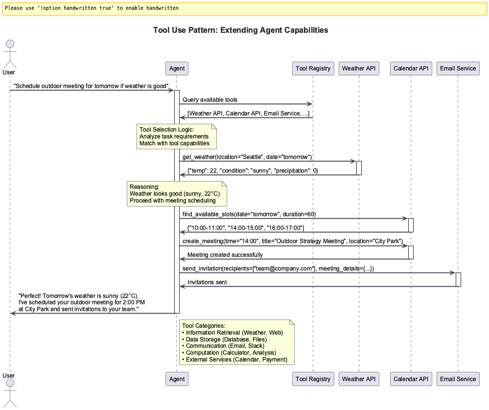

# Session 0: Introduction to Agent Frameworks & Patterns

## Chapter Overview: The Agent Revolution Transforming Enterprise Software

**Industry Context & Market Significance**

The AI agent landscape is experiencing unprecedented growth. Gartner forecasts that by 2028, 33% of enterprise software applications will incorporate agentic AI - a dramatic leap from less than 1% in 2024. This session introduces you to the frameworks driving this transformation and the fundamental patterns that power autonomous AI systems.

**What You'll Learn & Why It Matters**

You'll master the five core agentic patterns that every production system implements, compare seven leading frameworks used by companies like Microsoft, Google, and emerging startups, and understand why enterprises are moving from simple prompt-response to sophisticated agent orchestration. This foundation enables you to make informed technology choices and build systems that scale from prototype to production.

**How These Frameworks Stand Out**

Modern agent frameworks like LangChain, CrewAI, and PydanticAI represent a paradigm shift from handcrafted logic to framework-driven engineering. Each addresses different production challenges: LangChain excels at modular orchestration, CrewAI specializes in role-based collaboration, and PydanticAI brings type safety to AI development.

**Real-World Applications**

These patterns power automated research pipelines, content generation systems, business intelligence platforms, and decision automation tools across industries. You'll see how companies implement these patterns in production environments with monitoring, error handling, and enterprise integration.

## 📊 Learning Navigation Hub
**Total Time Investment**: 45 minutes (Core) + 20-40 minutes (Optional)

### Learning Path Options

- **🔍 Observer (30 min)**: Research-backed conceptual understanding of agent evolution and framework landscape
- **🎓 Participant (45 min)**: Hands-on pattern recognition and framework comparison exercises  
- **⚙️ Implementer (65 min)**: Deep dive into code examples with optional advanced modules

---

## 📋 SESSION OVERVIEW DASHBOARD

### Core Learning Track (45 minutes) - REQUIRED
| Section | Concept Load | Time | Skills |
|---------|--------------|------|--------|
| 🔄 Agent Evolution | 2 concepts | 10 min | Understanding |
| 🧩 Five Core Patterns | 5 concepts | 15 min | Recognition |
| 🏗️ Framework Landscape | 3 concepts | 15 min | Comparison |
| 📚 Module Overview | 1 concept | 5 min | Planning |

### Optional Advanced Modules 

**⚠️ Advanced Content**: These modules contain specialized material for experienced practitioners

- **[📊 Module A: Historical Context & Evolution](Session0_ModuleA_Historical_Context_Evolution.md)** (20 min) - Evolution from rule-based systems to modern agents  
- **[🔬 Module B: Advanced Pattern Theory](Session0_ModuleB_Advanced_Pattern_Theory.md)** (25 min) - Mathematical foundations of agent behavior

---

## 🧭 CORE SECTION (Required - 45 minutes)

### Part 1: From Prompts to Agents (10 minutes)
**Cognitive Load**: 2 new concepts
**Learning Mode**: Conceptual Understanding

#### The Evolution of AI Interaction (5 minutes)
The journey from simple prompt-response to sophisticated agent systems:


```python
# Traditional prompt-response (limited)
response = llm.generate("What's the weather today?")
# ❌ No context, no tools, no reasoning

# Modern agent approach (powerful)
agent = Agent(tools=[weather_tool, calendar_tool])
response = agent.run("Plan my outdoor activities for this week")
# ✅ Uses tools, plans ahead, considers context
```

#### What Makes an Agent "Agentic"? (5 minutes)
Four key characteristics define agentic systems:

1. **Autonomy**: Makes decisions without constant human input
2. **Reactivity**: Responds to environmental changes
3. **Proactivity**: Takes initiative toward goals
4. **Social Ability**: Interacts with other agents/humans

---

### Part 2: The Five Core Agentic Patterns (15 minutes)
**Cognitive Load**: 5 new concepts
**Learning Mode**: Pattern Recognition

Every agent framework implements these fundamental patterns:


#### Pattern 1: Reflection (3 minutes)
**Purpose**: Self-improvement through self-evaluation

```python
# Reflection pattern example
response = agent.generate(task)
reflection = agent.reflect_on(response)
improved_response = agent.improve_based_on(reflection)
```


#### Pattern 2: Tool Use (3 minutes)  
**Purpose**: Extending capabilities through external tools

```python
# Tool use pattern example
tools = [calculator, web_search, file_reader]
agent = Agent(tools=tools)
result = agent.run("Calculate the GDP growth rate for France in 2023")
```



#### Pattern 3: ReAct (Reasoning + Acting) (3 minutes)
**Purpose**: Iterative reasoning and action cycles

```python
# ReAct pattern: Thought -> Action -> Observation -> Thought
while not task_complete:
    thought = agent.think(current_state)
    action = agent.decide_action(thought)  
    observation = agent.execute(action)
    current_state = agent.update_state(observation)
```


#### Pattern 4: Planning (3 minutes)
**Purpose**: Breaking complex tasks into manageable steps

```python
# Planning pattern example
plan = agent.create_plan("Organize a team meeting")
# Plan: [1. Check calendars, 2. Find common time, 3. Book room, 4. Send invites]
for step in plan:
    agent.execute_step(step)
```


#### Pattern 5: Multi-Agent Collaboration (3 minutes)
**Purpose**: Specialized agents working together

```python
# Multi-agent pattern
research_agent = Agent(role="researcher", tools=[web_search])
writer_agent = Agent(role="writer", tools=[document_tools])
editor_agent = Agent(role="editor", tools=[grammar_check])

result = orchestrate([research_agent, writer_agent, editor_agent], task="Write report")
```


---

### Part 3: Framework Landscape Overview (15 minutes)
**Cognitive Load**: 3 new concepts  
**Learning Mode**: Comparison & Selection


#### Framework Categories (5 minutes)
Modern agent frameworks fall into three main categories:

```python
# 1. Development-Focused (Learning & Prototyping)
frameworks = ["LangChain", "LangGraph"] 

# 2. Production-Focused (Enterprise Deployment)  
frameworks = ["PydanticAI", "Agno", "Google ADK"]

# 3. Modular/Atomic (Compositional Architecture)
frameworks = ["Atomic Agents", "CrewAI"]
```

#### Framework Comparison Matrix (10 minutes)


**Enterprise Framework Analysis:**

| Framework | Production Ready | Enterprise Adoption | Primary Use Case |
|-----------|------------------|-------------------|------------------|
| **LangChain** | ⭐⭐⭐ | Most popular, modular orchestration | Prototyping, educational systems |
| **LangGraph** | ⭐⭐⭐⭐ | Complex state workflows | Advanced automation pipelines |
| **CrewAI** | ⭐⭐⭐⭐ | Role-based multi-agent systems | Content creation, research automation |
| **PydanticAI** | ⭐⭐⭐⭐⭐ | Type-safe, FastAPI-style development | Production APIs, structured outputs |
| **Atomic Agents** | ⭐⭐⭐⭐ | Microservice architectures | Modular enterprise systems |
| **Google ADK** | ⭐⭐⭐⭐⭐ | Google Cloud native | Enterprise Google Workspace integration |
| **Agno** | ⭐⭐⭐⭐ | Production monitoring focus | Deployed agent oversight |

**2025 Industry Selection Guidelines:**

```python
# Framework selection decision tree
if use_case == "learning_prototyping":
    choose(LangChain, CrewAI)  # Fastest onboarding
elif use_case == "enterprise_production":
    choose(PydanticAI, Google_ADK)  # Type safety + monitoring
elif use_case == "complex_workflows":
    choose(LangGraph)  # Advanced state management
elif use_case == "microservice_architecture":
    choose(Atomic_Agents)  # Compositional systems
```

**Production Deployment Considerations:**

- **Hidden Costs**: LangChain's modularity can create configuration complexity in production
- **Type Safety**: PydanticAI reduces runtime errors through schema validation
- **Monitoring**: Agno and ADK provide built-in observability for production systems
- **Vendor Lock-in**: Consider framework dependencies before committing to enterprise deployment

---

### Part 4: Module Learning Path (5 minutes)
**Cognitive Load**: 1 new concept
**Learning Mode**: Planning

#### Your Learning Journey
This module follows a progressive skill-building path:

```text
Week 1: Foundation & Core Patterns
Session 1: Bare Metal → Session 2: LangChain → Session 3: LangGraph 
Session 4: CrewAI → Session 5: PydanticAI → Session 6: Atomic Agents

Week 2: Production & Enterprise  
Session 7: Google ADK → Session 8: Agno → Session 9: Multi-Agent Patterns
Session 10: Enterprise Integration

Capstone: Multi-Framework Agent Ecosystem
```

**Key Learning Outcomes:**

- Master all 5 agentic patterns with hands-on implementation
- Build agents using 7+ different frameworks
- Deploy production-ready systems with monitoring
- Create multi-agent systems with enterprise patterns

---

## ✅ Core Section Validation (5 minutes)

### Quick Knowledge Check
Test your understanding of the foundations:

1. **Pattern Recognition**: Can you identify which agentic pattern each scenario uses?
   - "Agent evaluates its own response quality" → Reflection
   - "Agent calls a calculator to solve math" → Tool Use  
   - "Agent breaks project into smaller tasks" → Planning

2. **Framework Selection**: Which framework would you choose for:
   - Learning agent basics? → LangChain or CrewAI
   - Type-safe production system? → PydanticAI
   - Complex multi-step workflows? → LangGraph

### Self-Assessment Checklist

- [ ] I understand the evolution from prompts to agents
- [ ] I can identify the 5 core agentic patterns
- [ ] I can compare major frameworks and their strengths
- [ ] I'm ready to start building agents in Session 1

**Next Session Prerequisites**: ✅ Core Section Complete
**Recommended**: Explore optional modules for specialized knowledge

### 🎯 **Choose Your Next Path:**

- **[📊 Module A: Historical Context & Evolution →](Session0_ModuleA_Historical_Context_Evolution.md)** - ⚠️ Advanced: Evolution from rule-based systems
- **[🔬 Module B: Advanced Pattern Theory →](Session0_ModuleB_Advanced_Pattern_Theory.md)** - ⚠️ Advanced: Mathematical foundations  
- **[📝 Test Your Knowledge →](Session0_Test_Solutions.md)** - Assessment with detailed explanations
- **[📖 Next Session: Bare Metal Agents →](Session1_Bare_Metal_Agents.md)** - Core curriculum continues

**Learning Path Recommendations:**
- **New to AI Agents**: Core → Next Session (skip optional modules initially)
- **Experienced Developers**: Core → Module A → Module B → Next Session  
- **Academic Interest**: Core → Module B (mathematical foundations) → Next Session

---

---

## 📝 Multiple Choice Test - Session 0

Test your understanding of agent frameworks and patterns:

**Question 1:** Which agentic pattern involves an agent evaluating and improving its own outputs?  
A) Multi-Agent  
B) Planning  
C) Tool Use  
D) Reflection  


**Question 2:** The ReAct pattern combines which two key capabilities?  
A) Reflecting and Acting  
B) Reading and Acting  
C) Retrieving and Acting  
D) Reasoning and Acting  


**Question 3:** Which framework is best suited for high-performance applications with minimal resource usage?  
A) PydanticAI  
B) LangChain  
C) Agno  
D) CrewAI  


**Question 4:** What is the primary advantage of the Multi-Agent pattern?  
A) Lower resource usage  
B) Reduced complexity  
C) Specialized expertise collaboration  
D) Faster execution  


**Question 5:** Which framework emphasizes type safety through schema validation?  
A) PydanticAI  
B) CrewAI  
C) LangChain  
D) Agno  


[**🗂️ View Test Solutions →**](Session0_Test_Solutions.md)

## 🧭 Navigation

**Previous:** Introduction (You are here)

**Optional Advanced Modules:**

- **[📊 Module A: Historical Context & Evolution](Session0_ModuleA_Historical_Context_Evolution.md)** - ⚠️ Advanced: Evolution from rule-based systems
- **[🔬 Module B: Advanced Pattern Theory](Session0_ModuleB_Advanced_Pattern_Theory.md)** - ⚠️ Advanced: Mathematical foundations

**Next:** [Session 1 - Bare Metal Agents →](Session1_Bare_Metal_Agents.md)

---