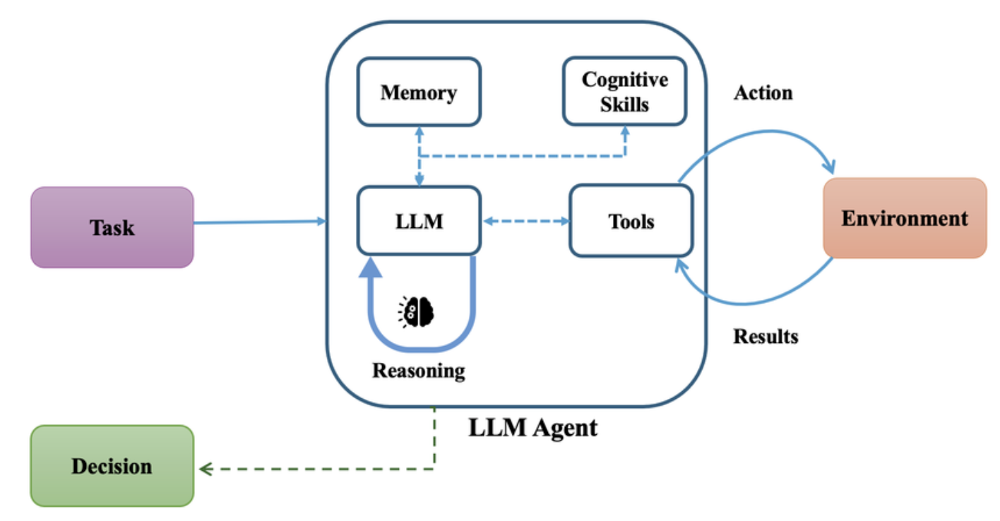

# Session 1: Bare Metal Agents - Building from First Principles

When your data engineering team processes petabyte-scale datasets through cloud-native ETL pipelines, framework abstractions can mask critical bottlenecks that impact both processing costs and pipeline reliability. Modern data platforms handle thousands of concurrent data streams from IoT sensors, application logs, and real-time analytics systems - requiring transparent control over resource allocation, API costs, and execution flow to maintain the SLA requirements that data-driven businesses demand.

This session reveals how to build AI agents from fundamental components - pure Python and direct LLM API calls - providing the precise control essential for production-scale data engineering. You'll learn to construct intelligent systems that can orchestrate complex data workflows, optimize cloud resource utilization, and ensure compliance with data governance standards.

Understanding bare metal implementation becomes your competitive advantage when managing distributed data pipelines that process streaming data lakes, validate data quality across massive datasets, and coordinate complex cloud workloads across multiple availability zones.

## Learning Outcomes

By the end of this session, you will be able to:

- **Implement** core agent architectures using only Python and LLM APIs for maximum control
- **Build** functional agents demonstrating all five agentic patterns (Reflection, Tool Use, ReAct, Planning, Multi-Agent)
- **Understand** the separation between model layer (LLM) and application layer (Python logic)
- **Create** agents that integrate seamlessly with Kubernetes, Apache Airflow, and cloud data services
- **Debug** and optimize agent behavior for cost-effective petabyte-scale processing

## The Bare Metal Approach: Essential for Data Pipeline Control

### Technical Context & Requirements

Consider the challenge facing data engineers today: A single modern application can generate hundreds of gigabytes of log data per day, multiplied by microservices architectures spanning thousands of containers. Add real-time streaming data from IoT devices, user analytics, and business metrics, and you're orchestrating petabyte-scale processing workflows that must maintain strict SLA requirements for business-critical analytics. Framework abstractions often obscure the resource consumption patterns that directly impact your cloud spending and processing latency.

When processing real-time streaming data for fraud detection, or coordinating ETL pipelines across distributed Kubernetes clusters, you need granular visibility into every API call, memory allocation, and processing decision. The bare metal approach eliminates the abstraction layer that can hide critical performance bottlenecks in your data pipeline.

Your production environment demands predictable resource allocation within Kubernetes pods, transparent cost tracking across thousands of LLM API calls, and complete observability through Grafana dashboards. This level of control becomes essential when a single processing error could cascade through dependent systems and impact critical business reporting.

### Core Knowledge & Applications

You'll master the fundamental patterns that enable intelligent orchestration of data engineering workflows. These patterns integrate naturally with your existing infrastructure: Apache Kafka for high-throughput data ingestion, PostgreSQL for metadata management, S3 for petabyte-scale storage, and Elasticsearch for rapid search across billions of records.

This knowledge empowers you to build agents that intelligently route data through appropriate processing pipelines based on schema analysis, optimize batch processing sizes for cost efficiency while maintaining throughput requirements, and automatically coordinate failure recovery across distributed data processing workloads.

### Architectural Separation

The model-application layer separation becomes critical when managing costs across petabyte-scale processing. Your model layer handles intelligent decisions about data routing strategies and resource optimization, while your application layer executes concrete operations through Kubernetes jobs, database transactions, and cloud service APIs. This separation allows you to dynamically switch between different LLM providers based on real-time cost analysis without disrupting your core pipeline logic.

### Real-World Data Processing Applications

Engineering teams leverage bare metal agents for:
- **Pipeline Orchestration**: Agents that analyze incoming data characteristics and route processing through optimal transformation workflows
- **Quality Assurance**: Systems that detect data anomalies in streaming pipelines and trigger automated data cleansing workflows
- **Cost Optimization**: Agents that monitor processing patterns and dynamically adjust resource allocation to meet budget constraints
- **Compliance Monitoring**: Systems ensuring all data handling adheres to GDPR requirements and industry data governance standards

## Core Implementation: Building Intelligence from First Principles

### Part 1: Agent Architecture Fundamentals

#### Basic Agent Structure

Every data processing agent requires these core components, engineered for cloud-native deployment at scale:



**File**: [`src/session1/base_agent.py`](https://github.com/fwornle/agentic-ai-nano/blob/main/docs-content/01_frameworks/src/session1/base_agent.py)

This foundation class defines essential capabilities while operating within cloud resource constraints. The memory management system respects Kubernetes pod limits while maintaining processing context, and the tool registry provides seamless integration with your existing cloud infrastructure including S3 data lakes, RDS metadata stores, and Kafka message streams.

### Agent Architecture Foundation - BaseAgent Class

The BaseAgent class provides the architectural blueprint for data processing agents, solving the fundamental challenge of intelligent orchestration within distributed cloud infrastructure:

```python
class BaseAgent:
    """Foundation class for data pipeline agent implementations"""
    def __init__(self, model_name="gpt-4", max_memory_mb=512):
        self.model_name = model_name      # LLM endpoint configuration
        self.memory = []                  # Processing context
        self.tools = {}                   # Cloud service integrations
        self.max_memory_mb = max_memory_mb  # Pod memory limit
        self.metrics_client = self._init_metrics()  # Prometheus metrics
```

**Memory System Design**: The memory system maintains processing context within Kubernetes pod constraints while caching critical metadata about data characteristics, recent processing decisions, and error patterns. This approach mirrors how experienced data engineers mentally track pipeline state across multiple concurrent workflow executions, enabling the agent to make informed decisions based on historical processing patterns.

**Tool Registry Pattern**: The tools registry connects your agent with essential cloud services - S3 for raw data storage, PostgreSQL for metadata and processing results, Kafka for real-time data streaming, and Apache Airflow for complex processing orchestration. Each integration includes comprehensive retry logic and circuit breaker patterns essential for maintaining reliability in distributed data systems.

### Agent Execution Loop - Cloud-Native Processing Pipeline

The execution loop implements a production-ready processing pipeline designed for the demands of modern data engineering:

```python
    def run(self, input_data: dict, timeout_seconds: int = 30) -> dict:
        """Processing cycle with cloud resource management and cost optimization"""
        try:
            # Track API costs and latency for budget management
            with self.metrics_client.timer('agent_processing_time'):
                processed_input = self.process_input(input_data)
                action_plan = self.decide_action(processed_input)
                result = self.execute_action(action_plan)
                
                # Track LLM API costs for enterprise-scale processing
                self.metrics_client.increment('llm_api_calls', 
                    tags=['model:' + self.model_name])
                
                return self.format_response(result)
        except TimeoutError:
            return self.handle_timeout(input_data)
```

**Execution Flow Context**: Each processing step includes comprehensive monitoring designed for enterprise data scale requirements. The metrics integration provides real-time visibility through Grafana dashboards, enabling your team to balance processing speed against API costs while maintaining the throughput necessary for business-critical analytics cycles.

### Key Concepts

These concepts form the foundation of reliable data processing:

1. **Model Interface**: Sophisticated LLM API management with rate limiting and cost tracking across petabyte-scale operations
2. **Memory Management**: Efficient context caching within pod memory constraints while maintaining processing history
3. **Tool Registry**: Standardized integration framework for cloud services and data stores

#### Input/Output Handling

### Input Processing Pipeline - Multi-Format Data Handling

Data processing agents must seamlessly handle the diverse data formats generated by modern distributed systems:

```python
    def process_input(self, data: Union[str, dict, bytes, pd.DataFrame]) -> dict:
        """Standardize input from data sources"""
        if isinstance(data, bytes):  # Binary data streams (Protobuf, Avro)
            return self.parse_binary_format(data)
        elif isinstance(data, pd.DataFrame):  # Structured analytics results
            return self.extract_dataframe_features(data)
        elif isinstance(data, dict) and 'stream_protocol' in data:  # Real-time data streams
            return self.convert_stream_format(data)
        else:  # Natural language queries from data analysts
            return {"type": "nl_query", "content": data}
```

### Pattern Implementation - Resilient Cloud Processing

Each processing pattern addresses the unique challenges of distributed data systems:

```python
    def decide_action(self, input_data: dict) -> dict:
        """Intelligent decision making with enterprise-scale cost optimization"""
        # Estimate processing cost based on data complexity and throughput requirements
        estimated_cost = self.estimate_processing_cost(input_data)
        
        if estimated_cost > self.cost_threshold:
            # Use efficient model for routine data validation
            decision = self.llm_inference(input_data, model="gpt-3.5-turbo")
        else:
            # Use advanced model for complex data transformation analysis
            decision = self.llm_inference(input_data, model=self.model_name)
        
        # Validate against data governance and compliance requirements
        if not self.validate_compliance(decision):
            decision = self.get_compliant_alternative()
            
        return decision
```

---

## Part 2: The Five Fundamental Agentic Patterns

### Agentic Patterns Overview

These five patterns form the intelligence foundation for data processing systems:


1. **Reflection**: Self-monitoring and optimization for pipeline performance
2. **Tool Use**: Integration with cloud data infrastructure and processing services  
3. **Planning**: Workflow orchestration and resource allocation for data pipelines
4. **ReAct**: Dynamic response to data anomalies and processing failures
5. **Multi-Agent**: Coordination across distributed data processing nodes

### Pattern 1: Reflection - Pipeline Performance Optimization

#### Concept

In data processing, reflection enables agents to continuously analyze their performance and optimize pipeline efficiency based on real processing metrics:

```python
class ReflectiveAgent(BaseAgent):
    """Agent with self-monitoring for data pipeline optimization"""
    
    def __init__(self, model_name="gpt-4"):
        super().__init__(model_name)
        self.performance_history = []
        self.cost_tracker = CostTracker()
        self.optimization_threshold = 0.8
```

#### Implementation

The reflection mechanism monitors processing efficiency across data workflows and triggers intelligent optimizations:

```python
    def reflect_on_performance(self, metrics: dict) -> dict:
        """Analyze data processing performance and optimize workflows"""
        reflection_prompt = f"""
        Analyze this data processing performance:
        - Throughput: {metrics['throughput_gb_per_hour']} GB/hour of data processed
        - Cost efficiency: ${metrics['cost_per_gb']} per GB processed
        - Error rate: {metrics['error_rate']}% across ETL pipelines
        - Queue depth: {metrics['queue_depth']} pending processing jobs
        - Average latency: {metrics['avg_latency_ms']}ms for data transformation
        
        Identify bottlenecks and suggest optimizations for:
        1. Kubernetes resource allocation (CPU/memory for data processing)
        2. Batch size configuration for optimal throughput
        3. Parallel processing strategy for distributed workloads
        4. Cost optimization for petabyte-scale processing requirements
        """
        
        optimization = self.llm_call(reflection_prompt)
        
        # Apply performance insights to future data processing
        self.update_processing_strategy(optimization)
        
        return optimization
```

### Pattern 2: Tool Use - Cloud Service Integration

#### Concept

Tool use in data processing enables seamless integration with the specialized cloud infrastructure required for modern data platforms:

```python
class ToolUseAgent(BaseAgent):
    """Agent with cloud data service integration capabilities"""
    
    def __init__(self):
        super().__init__()
        self.register_data_tools()
```

#### Tool Registration

Register tools optimized for data operations and pipeline workflows:

```python
    def register_data_tools(self):
        """Register cloud service interfaces for data processing"""
        self.tools = {
            "query_data_lake": self.query_s3_data_bucket,
            "execute_analytics_query": self.execute_postgres_analytics_query,
            "trigger_etl_workflow": self.trigger_airflow_dag,
            "publish_data_stream": self.publish_to_kafka_topic,
            "search_data_catalog": self.search_elasticsearch_catalog,
            "update_pipeline_status": self.update_grafana_annotation
        }
```

### Pattern 3: Planning - Workflow Orchestration

#### Concept

Planning agents orchestrate the complex workflows required for data processing and analytics pipeline execution:

```python
class PlanningAgent(BaseAgent):
    """Agent for data workflow orchestration"""
    
    def create_processing_plan(self, data_batch: dict) -> list:
        """Generate optimal processing plan for data batch"""
        planning_prompt = f"""
        Create processing plan for data batch:
        - Data volume: {data_batch['size_gb']} GB of structured/unstructured data
        - Data types: {data_batch['data_types']} (JSON, Parquet, CSV, logs)
        - Processing priority: {data_batch['priority']} (real-time/batch/archive)
        - SLA requirement: {data_batch['sla_hours']} hours for completion
        - Processing type: {data_batch['processing_type']} (ETL, analytics, ML training)
        
        Consider current infrastructure:
        - Available Kubernetes nodes: {self.get_available_nodes()}
        - Current processing queue: {self.get_queue_status()} jobs
        - Budget allocation: ${data_batch['budget']} for this processing cycle
        - Compute availability: {self.get_compute_resources()} for data processing
        
        Generate step-by-step workflow with optimal resource allocation for data processing.
        """
        
        plan = self.llm_call(planning_prompt)
        return self.validate_resource_availability(plan)
```

### Pattern 4: ReAct - Adaptive Data Processing

#### Concept

ReAct pattern enables dynamic adaptation to the challenges common in data processing systems:

```python
class ReActAgent(BaseAgent):
    """Agent implementing adaptive processing for data pipelines"""
    
    def process_with_reasoning(self, data_batch: dict, max_retries: int = 3):
        """Process data with reasoning and adaptive strategies"""
        for attempt in range(max_retries):
            thought = self.analyze_data_characteristics(data_batch)
            action = self.determine_processing_strategy(thought)
            observation = self.execute_data_processing(action)
            
            if self.processing_successful(observation):
                break
            
            # Adapt strategy based on data processing challenges
            data_batch = self.adjust_processing_params(observation)
        
        return self.get_processing_result()
```

### Pattern 5: Multi-Agent - Distributed Processing Coordination

#### Concept

Coordinate multiple specialized agents across your data processing pipeline:

```python
class DataPipelineCoordinator:
    """Coordinator for distributed data processing agents"""
    
    def __init__(self):
        self.agents = {
            "data_ingestion": DataIngestionAgent(),
            "quality_validation": DataQualityAgent(),
            "transformation": DataTransformationAgent(),
            "analytics": DataAnalyticsAgent(),
            "storage_optimization": StorageOptimizationAgent()
        }
```

#### Coordination Protocol

Implement coordination across distributed data processing systems:

```python
    def orchestrate_data_pipeline(self, data_batch: dict) -> dict:
        """Coordinate multi-agent data processing"""
        # Ingestion agent handles multi-source data intake
        ingested = self.agents["data_ingestion"].ingest_data_batch(data_batch)
        
        # Quality validation agent checks data integrity
        validated = self.agents["quality_validation"].validate_data_quality(ingested)
        
        # Transformation agent processes and enriches data
        if validated["quality_score"] > 0.85:  # High quality threshold for analytics
            transformed = self.agents["transformation"].transform_data(validated)
        else:
            transformed = self.agents["transformation"].clean_and_transform(validated)
        
        # Analytics agent runs analytical processing
        analytics_results = self.agents["analytics"].run_analytics(transformed)
        
        # Storage optimization for long-term data retention
        self.agents["storage_optimization"].store_with_lifecycle_policy(analytics_results)
        
        return analytics_results
```

---

## Part 3: Production Considerations

### Cost Optimization for Cloud Deployment

Agents must operate efficiently within enterprise budget constraints while maintaining the scale required for comprehensive data processing:

```python
class CostOptimizedAgent(BaseAgent):
    """Agent optimized for enterprise-scale cloud cost management"""
    
    def __init__(self, monthly_budget: float = 100000):  # Enterprise scale budget
        super().__init__()
        self.budget_tracker = BudgetTracker(monthly_budget)
        self.cost_per_token = 0.00002  # GPT-4 pricing for cost estimation
```

### Kubernetes Integration

Deploy agents as Kubernetes operators designed for data processing workloads:

```python
    def deploy_as_data_k8s_operator(self):
        """Deploy agent as Kubernetes operator for data processing"""
        return {
            "apiVersion": "apps/v1",
            "kind": "Deployment",
            "metadata": {"name": "data-processing-agent"},
            "spec": {
                "replicas": 5,  # Scale for data processing volumes
                "template": {
                    "spec": {
                        "containers": [{
                            "name": "agent",
                            "image": "data-processing-agent:latest",
                            "resources": {
                                "requests": {"memory": "2Gi", "cpu": "1000m"},  # Data processing requirements
                                "limits": {"memory": "4Gi", "cpu": "2000m"}
                            }
                        }]
                    }
                }
            }
        }
```

### Monitoring and Observability

Implement comprehensive monitoring tailored for data processing requirements:

```python
    def setup_data_monitoring(self):
        """Configure Prometheus metrics and Grafana dashboards for data processing"""
        self.metrics = {
            "data_throughput": Gauge('data_throughput_gbps'),
            "pipeline_latency": Histogram('pipeline_latency_seconds'),
            "data_quality_error_rate": Counter('data_quality_errors_total'),
            "processing_cost_per_gb": Gauge('processing_cost_per_gb_dollars'),
            "compliance_score": Gauge('compliance_score_percentage')
        }
```

---

## Practical Exercise: Building a Data Quality Agent

Let's construct a complete agent for data quality assurance that operates at production scale:

```python
class DataQualityAgent(BaseAgent):
    """Production-ready agent for data quality monitoring"""
    
    def __init__(self):
        super().__init__(model_name="gpt-4")
        self.quality_rules = self.load_data_quality_standards()
        self.anomaly_detector = DataAnomalyDetector()
    
    def analyze_data_batch(self, batch_metadata: dict) -> dict:
        """Analyze data batch for quality and compliance"""
        # Check data completeness across all sources
        completeness = self.check_data_completeness(batch_metadata)
        
        # Detect anomalies in data patterns
        anomalies = self.anomaly_detector.detect_data_anomalies(batch_metadata)
        
        # Generate comprehensive quality report using domain knowledge
        quality_prompt = self.build_quality_prompt(
            batch_metadata, completeness, anomalies
        )
        
        analysis = self.llm_call(quality_prompt)
        
        # Determine processing action based on quality requirements
        action = self.determine_quality_action(analysis)
        
        return {
            "quality_score": self.calculate_quality_score(analysis),
            "issues_found": self.extract_issues(analysis),
            "recommended_action": action,
            "analytics_ready": action in ["approve", "approve_with_notes"],
            "reprocessing_cost_impact": self.estimate_reprocessing_cost(action),
            "compliance_status": self.check_compliance(analysis)
        }
```

---

## Multiple Choice Test - Session 1

Test your understanding of bare metal agents in cloud data processing:

**Question 1:** Why is bare metal agent implementation critical for data pipeline systems?  
A) It's required by Kubernetes  
B) It provides full control over resource usage and API costs for petabyte-scale processing  
C) It's easier to deploy  
D) It uses less storage  

**Question 2:** What is the primary purpose of the reflection pattern in data processing agents?  
A) To generate better LLM responses  
B) To analyze performance and optimize data pipeline efficiency  
C) To reduce memory usage  
D) To improve security  

**Question 3:** How do agents manage cloud processing costs in data applications?  
A) By using only free services  
B) Through intelligent model selection based on data complexity and budget tracking  
C) By caching everything  
D) Through compression only  

**Question 4:** What is the key consideration for memory management in Kubernetes-deployed data agents?  
A) Unlimited memory allocation  
B) Respecting pod memory limits while efficiently caching data processing context  
C) Using only disk storage  
D) Memory is not a concern  

**Question 5:** Why is tool registration important for data processing agents?  
A) It looks professional  
B) To integrate with specialized cloud services like S3 for data storage, Kafka for streaming, and Airflow for workflows  
C) It's required by Python  
D) To reduce code size  

## Solutions

[Click here for solutions](Session1_Test_Solutions.md)

---

## Optional Modules

Advanced patterns for specialized data processing applications:

- [Module A: Advanced Agent Patterns](Session1_ModuleA_Advanced_Agent_Patterns.md) - Hierarchical agents for complex data pipeline orchestration
- [Module B: Performance Optimization](Session1_ModuleB_Performance_Optimization.md) - Techniques for petabyte-scale data throughput
- [Module C: Complex State Management](Session1_ModuleC_Complex_State_Management.md) - Managing state across distributed data processing systems
- [Module D: Coding Assistant Case Study](Session1_ModuleD_Coding_Assistant_Case_Study.md) - Building ML pipeline development tools for data engineering

---

## Navigation

- [← Previous: Session 0 - Introduction to Agentic AI](Session0_Introduction_to_Agentic_AI.md)
- [↑ Return to Framework Module Overview](index.md)
- [→ Next: Session 2 - LangChain Agents](Session2_LangChain_Agents.md)