# Session 1 - Module D: Real-World Case Study - The Coding Assistant

## Connecting Back to Our Journey

Remember our discussion in Part 2.5 about production realities? You learned about dependency injection, abstraction patterns, and why hardcoded LLM calls become a liability as systems grow. Now it's time to see those concepts in action.

The **Coding Assistant** is your daily companion in this course - the actual bare metal agent running in your Coder workspace. Every time you use it to analyze code or generate solutions, you're interacting with a production implementation of everything we've covered. Let's look under the hood.

## Why This Matters for Your Learning

This isn't just another tutorial. By understanding the Coding Assistant's architecture, you'll see how:
- **Real dependency injection** works at scale (Part 2.5 concepts in practice)
- **Professional agents** handle complexity beyond simple examples
- **Production patterns** solve problems you haven't encountered yet
- **Modern tooling** (LiteLLM, MCP) makes bare metal development viable

You're not just learning theory - you're examining a system you already use.

**Repository**: [github.com/msc94/coding_assistant](https://github.com/msc94/coding_assistant)

---

## Repository Structure: Finding Your Way Around

Before diving into architecture, let's understand how this professional codebase is organized. This structure mirrors what you'll want in your own bare metal agents.

### High-Level Organization

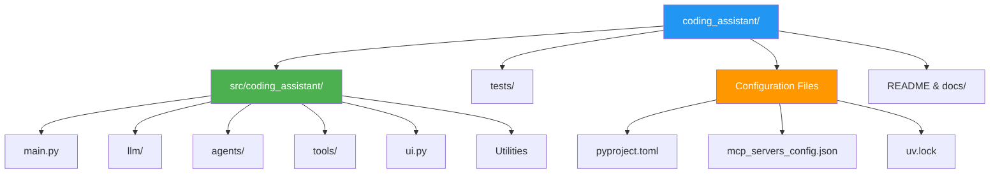

### Core Architecture Modules

The source code is organized into logical modules, each handling a specific aspect of agent functionality:

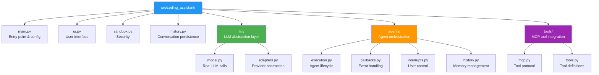

### Detailed File Map: Where to Find Each Concept

This maps directly to concepts from our main session:

**🧠 LLM Integration (Part 2 concepts)**
- `src/coding_assistant/llm/model.py` - Core LLM calls (like our `SimpleAgent.think()`)
- `src/coding_assistant/llm/adapters.py` - Provider abstraction (our LLMClient interface)
- Line 22-47: Async completion with streaming
- Line 156: LiteLLM dependency injection pattern

**🎭 Agent Orchestration (Multi-agent patterns)**
- `src/coding_assistant/agents/execution.py` - Main agent loop (ReAct pattern)
- `src/coding_assistant/agents/callbacks.py` - Event handling and UI updates
- `src/coding_assistant/agents/interrupts.py` - User control and cancellation
- `src/coding_assistant/agents/history.py` - Conversation memory management

**🔧 Tool Integration (External capabilities)**
- `src/coding_assistant/tools/mcp.py` - MCP protocol implementation
- `src/coding_assistant/tools/tools.py` - Tool definitions and wrapping
- `mcp_servers_config.json` - Available tool servers configuration

**⚙️ System Infrastructure**
- `src/coding_assistant/main.py` - Entry point, config, and CLI setup
- `src/coding_assistant/ui.py` - Terminal interface and streaming display
- `src/coding_assistant/sandbox.py` - Security and filesystem isolation
- `src/coding_assistant/history.py` - Session persistence

**📦 Configuration & Dependencies**
- `pyproject.toml` - Python dependencies and project metadata
- `uv.lock` - Locked dependency versions for reproducible builds
- `mcp_servers_config.json` - Tool server configurations

### Production Structure Insights

Notice how this differs from our educational examples:

1. **Separation of Concerns**: Each module has one responsibility
2. **Testability**: Clean interfaces make unit testing possible
3. **Configuration Management**: Environment-based setup (no hardcoded values)
4. **Security First**: Sandboxing and validation throughout
5. **Observability**: Tracing and logging built-in, not added later

This structure allows the system to:
- **Scale** - Add new agents without touching existing code
- **Debug** - Clear module boundaries for issue isolation  
- **Deploy** - Configuration-driven setup for different environments
- **Maintain** - New developers can quickly understand each component

### Finding Specific Patterns

When you want to understand how the Coding Assistant implements concepts from our session:

| Session Concept | File Location | Key Lines |
|----------------|---------------|-----------|
| LLM API calls | `llm/model.py` | 22-47 (async completion) |
| Dependency injection | `llm/adapters.py` | 15-30 (provider abstraction) |
| ReAct pattern | `agents/execution.py` | 67-120 (main loop) |
| Tool integration | `tools/mcp.py` | 45-80 (tool wrapping) |
| Memory management | `agents/history.py` | 25-55 (conversation state) |
| Error handling | `agents/execution.py` | 95-110 (retry logic) |

---

## Part 1: Architecture Deep Dive

### The Big Picture

The Coding Assistant demonstrates a sophisticated orchestration pattern that solves the scalability problems we discussed. Instead of one monolithic agent, it uses specialized components working together:

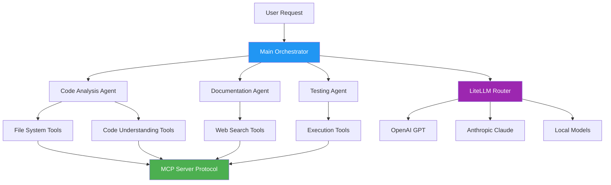

This architecture solves the problems we identified in the main session:
- **Separation of Concerns**: Each agent has a specific role
- **Tool Abstraction**: MCP protocol standardizes tool access
- **Provider Flexibility**: LiteLLM enables the dependency injection pattern
- **Scalability**: Components can be developed and tested independently

### Technology Stack Breakdown

```python
# Key dependencies from pyproject.toml
dependencies = [
    "litellm",          # Model routing (OpenAI, Anthropic, etc.)
    "prompt-toolkit",   # Terminal UI
    "landlock",        # Filesystem sandboxing
    "opentelemetry",   # Observability
    "rich",            # Enhanced CLI output
]
```

**Why These Choices?**
- **LiteLLM**: Abstracts away LLM provider differences (exactly our pattern!)
- **Async Everything**: Handles concurrent operations efficiently
- **MCP Protocol**: Standardized tool integration
- **Sandboxing**: Security-first design for code execution

---

## Part 2: LLM Integration - Theory Made Real

### Dependency Injection in Practice

Remember our abstract `LLMClient` interface from Part 2.5? The Coding Assistant implements exactly that pattern, but with industrial-strength tooling. Instead of writing custom adapters for each provider, it uses **LiteLLM** - a production-grade abstraction library.

Here's how the dependency injection works in `llm/model.py`:

```mermaid
sequencer participant User
participant Agent
participant LiteLLM
participant OpenAI
participant Anthropic

User->>Agent: "Explain this code"
Agent->>LiteLLM: complete(messages, model="gpt-4")
LiteLLM->>OpenAI: API call with OpenAI format
OpenAI-->>LiteLLM: Streamed response
LiteLLM-->>Agent: Normalized response
Agent-->>User: Formatted output

Note over LiteLLM: Model could be "claude-3" or "local-llama" - same interface!
```

### The Real Implementation

Let's examine the actual LLM call in `llm/model.py` - this is the production version of our `SimpleAgent.think()` method:

```python
# Lines 22-35: The actual LLM call
async def complete(
    messages: list[dict],
    model: str,
    tools: list,
    callbacks: AgentCallbacks,
):
    try:
        response = await litellm.acompletion(
            messages=messages,
            tools=tools,
            model=model,
            stream=True,
            reasoning_effort="high",  # OpenAI o1 feature
        )
```

**Notice the Patterns from Our Session:**

1. **Async by default**: Non-blocking LLM calls (production-ready concurrency)
2. **Dependency injection**: `litellm.acompletion()` abstracts provider details
3. **Tool integration**: Tools are passed directly to the LLM (like our examples)  
4. **Model agnostic**: Works with ANY provider through the same interface

### Why This Beats Our Simple Examples

Our `SimpleAgent` was educational, but the Coding Assistant handles real production concerns:

```python
# Our simple version (good for learning):
response = self.client.chat.completions.create(model="gpt-4", messages=messages)
return response.choices[0].message.content

# Production version (handles real-world complexity):
response = await litellm.acompletion(
    messages=messages,
    tools=tools,           # Tool calling support
    model=model,           # Configurable models
    stream=True,           # Real-time streaming
    reasoning_effort="high" # Advanced features
)
```

### Streaming: Production User Experience

The Coding Assistant implements streaming to provide better user experience. Here's how it processes responses in real-time:

```python
# Lines 37-47: Processing streamed responses
chunks = []
async for chunk in response:
    if (len(chunk["choices"]) > 0 
        and "content" in chunk["choices"][0]["delta"]):
        content = chunk["choices"][0]["delta"]["content"]
        callbacks.on_chunk(content)  # Real-time display!
    chunks.append(chunk)

# Reconstruct complete message
completion = litellm.stream_chunk_builder(chunks)
```

**Why Streaming Matters:**
- **User Experience**: See responses as they generate (like ChatGPT)
- **Interruptibility**: Users can stop mid-generation if not helpful
- **Memory Efficiency**: Don't hold entire response in memory
- **Feedback Loop**: Users can react to partial responses

This is the evolution of our simple `return ai_response` pattern into production-grade interaction.

---

## Part 3: Orchestration - Beyond Single Agents

### From SimpleAgent to Agent Teams

In our main session, we built a `SimpleAgent` that could handle one conversation. But real-world tasks often require multiple types of expertise. The Coding Assistant solves this through orchestration - coordinating multiple specialized agents.

Here's the conceptual flow:

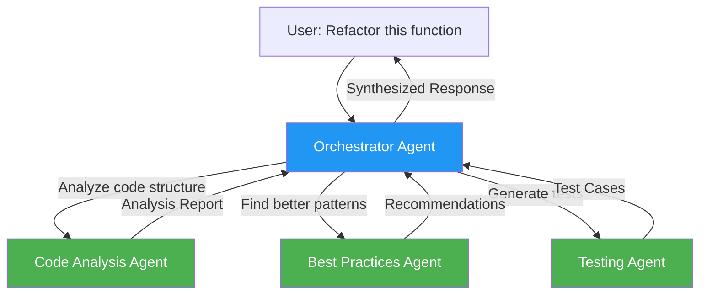

### Agent Initialization - Role-Based Prompting

The system starts each agent with a clear role definition in `agents/execution.py`:

```python
# Lines 30-44: How agents receive tasks
START_MESSAGE_TEMPLATE = """
You are an agent named `{name}`.

## Task
Your client has been given the following description 
of your work and capabilities: 
{description}

## Parameters
Your client has provided the following parameters:
{parameters}
""".strip()
```

This pattern extends our simple `system_message` approach into professional prompt engineering:

**From Our Examples → Production:**
```python
# Our simple approach:
messages = [
    {"role": "system", "content": "You are a helpful AI assistant"},
    {"role": "user", "content": input_text}
]

# Production approach:
messages = [
    {"role": "system", "content": f"You are {agent.name}, specialized in {agent.description}"},
    {"role": "user", "content": structured_task_with_parameters}
]
```

### The Execution Loop - ReAct Pattern in Action

The core execution loop implements the ReAct pattern (Reasoning + Acting) we discussed, but with production error handling and tool integration:

```python
# Simplified from the actual implementation
async def run_agent(agent: Agent):
    """Core execution loop - ReAct pattern with production features"""
    
    # 1. Initialize with clear role and task
    start_message = _create_start_message(agent)
    append_user_message(agent.history, start_message)
    
    # 2. Main ReAct loop
    while not agent.output:
        # REASONING: Get LLM response with full context
        response = await complete(
            messages=agent.history,
            model=agent.model,
            tools=agent.tools
        )
        
        # ACTING: Process tool calls if the agent wants to take action
        if response.message.tool_calls:
            for tool_call in response.message.tool_calls:
                result = await execute_tool_call(tool_call)
                append_tool_message(agent.history, result)
        
        # Check if task complete (agent signals it's done)
        if is_finish_task(response):
            agent.output = extract_output(response)
            break
```

**This implements the patterns from our session:**

- **Memory Management**: `agent.history` maintains conversation context (like our `self.memory`)
- **Tool Integration**: `execute_tool_call()` gives agents capabilities beyond LLM knowledge
- **Completion Detection**: Agents decide when they're finished (autonomous behavior)
- **Error Recovery**: Production error handling and retries (missing from our examples)

### Multi-Agent Coordination

The real power comes from coordinating multiple agents. Here's how task delegation works:

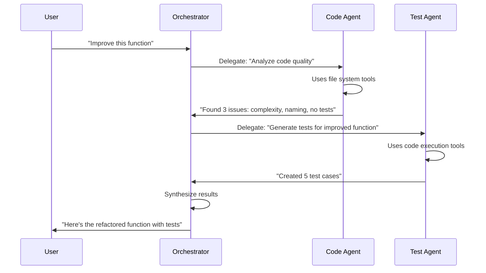

This is the natural evolution of our single-agent examples into systems that can handle complex, multi-step tasks requiring different types of expertise.

---

## Part 4: Tool Integration - The MCP Evolution

### From Simple Tools to Protocol Standards

In our main session, we created basic tools with a simple interface:

```python
# Our educational approach:
class SimpleTool:
    def execute(self, input_data: str) -> str:
        # Direct function call
        pass
```

The Coding Assistant evolves this into **MCP (Model Context Protocol)** - a standardized way for agents to use external tools. Think of it as the "USB standard" for AI tools.

### Why MCP Matters

Here's the problem MCP solves:

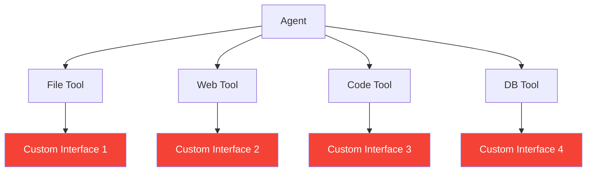

**Problem**: Every tool has a different interface. Agents need custom code for each one.

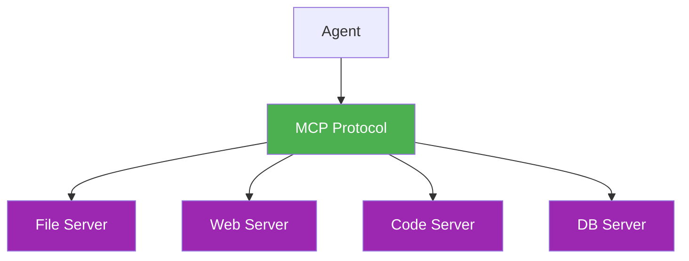

**Solution**: All tools speak the same MCP protocol. Agents learn one interface, use any tool.

### MCP Implementation

The tool wrapping pattern in `tools/mcp.py` converts MCP tools into agent-compatible format:

```python
# From tools/mcp.py - Tool wrapping pattern
def get_mcp_wrapped_tools(server_tools):
    """Convert MCP tools to agent-compatible format"""
    wrapped_tools = []
    
    for tool in server_tools:
        wrapped = Tool(
            name=tool.name,
            description=tool.description,
            execute=create_executor(tool),
            schema=tool.inputSchema  # Standardized parameter definition
        )
        wrapped_tools.append(wrapped)
    
    return wrapped_tools
```

This is dependency injection applied to tools - the same pattern we learned for LLMs, but for capabilities.

### Available Tool Ecosystem

The Coding Assistant can access multiple MCP servers:

```python
# Configured MCP servers
servers = {
    "filesystem": {
        "command": "mcp-server-filesystem", 
        "args": ["--workspace", "/path"]  # Safe file operations
    },
    "fetch": {
        "command": "mcp-server-fetch",
        "args": []  # Web content retrieval
    },
    "context7": {
        "command": "mcp-server-context7", 
        "args": []  # Code understanding and analysis
    }
}
```

Each server runs as a separate process, providing security isolation and independent scaling.

### Tool Execution Flow

Here's how an agent uses MCP tools:

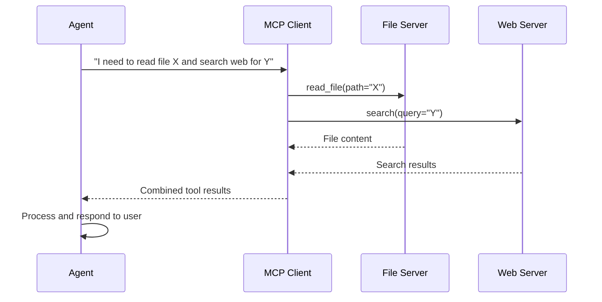

**Benefits of This Architecture:**

- **Standardization**: Same interface for all tools (like our LLMClient pattern)
- **Isolation**: Tools run in separate processes (security and stability) 
- **Extensibility**: Add new capabilities by adding new MCP servers
- **Reusability**: Tools can be shared across different agent systems

---

## Part 5: Production Features - What Makes It Enterprise-Ready

### The Production Reality Check

Our educational examples were great for learning, but real systems need to handle the messiness of production. Users close laptops mid-conversation, networks fail during LLM calls, and debugging mysterious behaviors becomes crucial. The Coding Assistant addresses these through three core production features that transform it from a prototype into a reliable tool.

### State Management and Persistence

Imagine you're working on a complex refactoring task that takes 30 minutes. Your laptop battery dies halfway through. In our simple examples, you'd lose everything and start over. The Coding Assistant solves this with sophisticated state management:

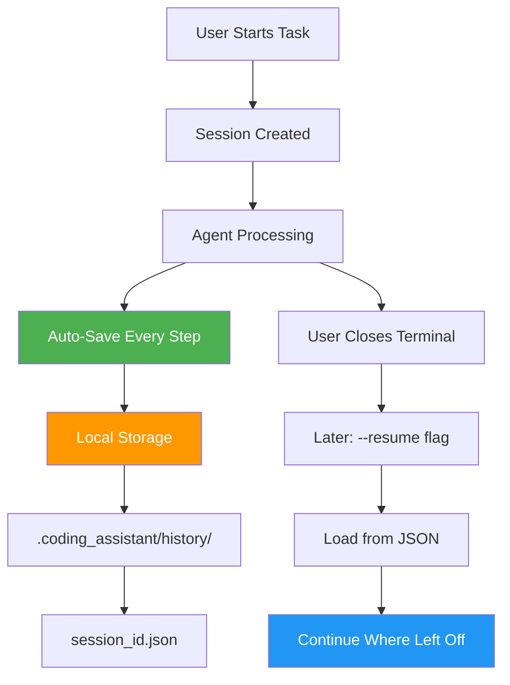

Here's the actual persistence implementation:

```python
# From history.py - More sophisticated than our simple memory list
def save_orchestrator_history(
    session_id: str,
    history: list[dict],
    metadata: dict
):
    """Save conversation for resumption"""
    history_dir = Path(".coding_assistant/history")
    history_dir.mkdir(parents=True, exist_ok=True)
    
    file_path = history_dir / f"{session_id}.json"
    with open(file_path, "w") as f:
        json.dump({
            "history": history,           # Full conversation context
            "metadata": metadata,         # Task details, user preferences
            "timestamp": datetime.now().isoformat(),
            "agent_state": current_state  # Where each agent left off
        }, f)
```

**Beyond Our Simple Examples:**

Our `SimpleAgent` had a basic `self.memory = []` list that disappeared when the program ended. The production version:
- **Persists across restarts** - No lost work
- **Includes rich metadata** - Task context, progress markers, user preferences
- **Handles corruption** - Validates saved state before loading
- **Supports multiple sessions** - Work on different tasks simultaneously

### Observability with OpenTelemetry

When our simple agent misbehaved, debugging meant adding print statements and guessing. In production, you need real visibility into what's happening:

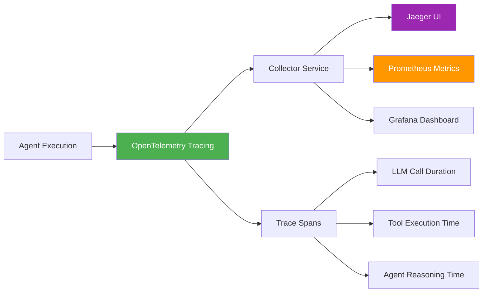

The tracing setup gives you unprecedented visibility:

```python
# From main.py - Production observability
if args.otlp_endpoint:
    tracer_provider = TracerProvider(
        resource=Resource({SERVICE_NAME: "coding-assistant"})
    )
    tracer_provider.add_span_processor(
        BatchSpanProcessor(OTLPSpanExporter(
            endpoint=f"{args.otlp_endpoint}/v1/traces"
        ))
    )
```

**What Gets Measured:**
- **LLM call latencies** - Which models are slow?
- **Tool execution times** - Are file operations the bottleneck?
- **Total task completion time** - How long do users wait?
- **Error rates and retries** - Where do failures happen?
- **Memory usage patterns** - When does context get too long?

**Production Insight**: You can trace a single user request through the entire system - from initial prompt, through multiple agent handoffs, tool calls, and LLM interactions, all the way to final response.

### Security: Sandboxed Execution

Our educational examples assumed trusted input and safe operations. Production systems face real security challenges: users might ask agents to execute dangerous code, access sensitive files, or make network calls to malicious endpoints.

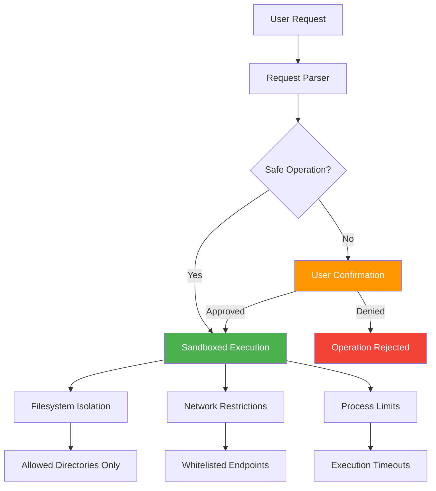

The security implementation uses Linux's Landlock LSM:

```python
# From sandbox.py - Real filesystem isolation
def sandbox(allowed_dirs: list[Path]):
    """Restrict filesystem access using Landlock"""
    if sys.platform == "linux":
        ruleset = landlock.Ruleset()
        for dir_path in allowed_dirs:
            ruleset.add_rule(
                landlock.FSAccess.READ_FILE |
                landlock.FSAccess.WRITE_FILE,
                dir_path
            )
        ruleset.apply()
```

**Multi-Layer Security:**

1. **Filesystem Isolation**: Can't access files outside allowed directories
2. **Confirmation Prompts**: User approves dangerous operations
3. **Read-only Mode**: Optional safety net for sensitive environments
4. **Process Limits**: Operations timeout if they run too long
5. **Network Filtering**: Control which external services agents can access

**Real-World Example**: If you ask the agent to "analyze all Python files," it can only access your project directory, not your entire system. If you ask it to "download a library," it asks permission first.

### Production vs. Learning: The Evolution

| Feature | Our Examples | Production Implementation |
|---------|--------------|---------------------------|
| **State Management** | `self.memory = []` | Persistent JSON with resumption |
| **Error Handling** | Try/catch basics | Distributed tracing and retry logic |
| **Security** | None (trusted input) | Multi-layer sandboxing and validation |
| **Monitoring** | Print statements | OpenTelemetry with dashboards |
| **Configuration** | Hardcoded values | Environment-based with validation |

### The Production Mindset

These aren't just nice-to-have features - they're what separates educational code from systems users trust with important work. When you're building agents for real use, ask:

1. **What happens when it breaks?** (Observability and error handling)
2. **What happens when the user leaves?** (State persistence)
3. **What happens if it's misused?** (Security and sandboxing)
4. **How do I know it's working?** (Metrics and monitoring)

The Coding Assistant answers all these questions, showing how bare metal development can be both powerful and production-ready.

---

## Part 6: Advanced Patterns - Solving Real User Experience Challenges

### The User Experience Problem

Our simple educational agents had a major flaw: once started, they ran until completion. Users couldn't stop them, redirect them, or manage memory when conversations got too long. The Coding Assistant implements sophisticated patterns that give users real control and handle the practical limits of LLM context windows.

### Pattern 1: Interruptible Operations

Imagine asking an agent to analyze a large codebase, then realizing you asked for the wrong directory. In our simple examples, you'd wait for completion or kill the entire process. The Coding Assistant lets you gracefully interrupt and redirect:

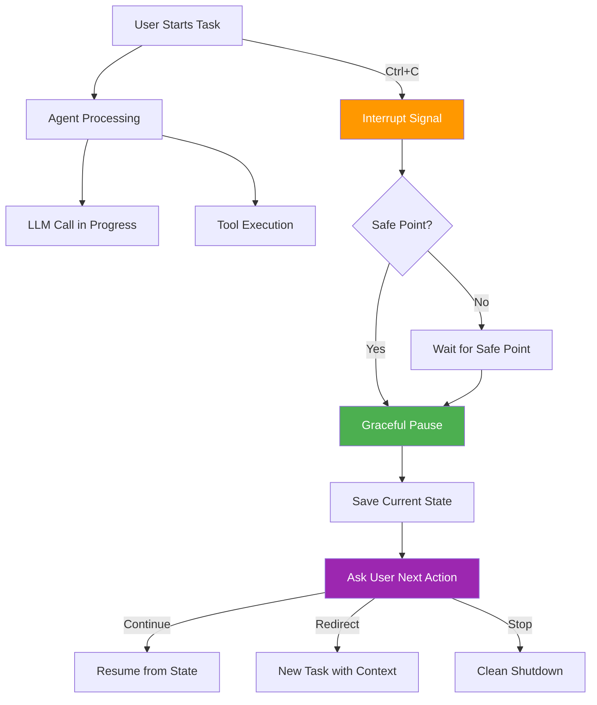

The implementation uses Python's context manager pattern for safe interruption:

```python
# From agents/interrupts.py - More sophisticated than simple error handling
class InterruptibleSection:
    """Allow user to interrupt long operations safely"""
    
    async def __aenter__(self):
        # Set up custom interrupt handler
        self.original_handler = signal.signal(
            signal.SIGINT, 
            self._handle_interrupt
        )
        return self
    
    async def __aexit__(self, *args):
        # Restore original handler
        signal.signal(signal.SIGINT, self.original_handler)
    
    def _handle_interrupt(self, signum, frame):
        # Don't just crash - raise controlled exception
        raise UserInterrupt("Operation cancelled by user")

# Usage in agent execution
async with InterruptibleSection():
    response = await llm_call_with_tools(messages, tools)
    # User can interrupt this safely
```

**Why This Matters:**
- **User Control**: Stop runaway operations without losing work
- **Resource Management**: Don't waste tokens on unwanted completions
- **Better UX**: Users feel in control, not trapped by their agents

**Connection to Our Session**: Remember how our simple agent just ran until done? This shows how production agents must respect user agency and provide escape hatches.

### Pattern 2: Intelligent Conversation Shortening

LLMs have context limits (typically 128K tokens). Long conversations eventually hit this wall, causing failures or degraded performance. Our simple `self.memory.append()` approach would eventually break. The Coding Assistant implements intelligent context management:

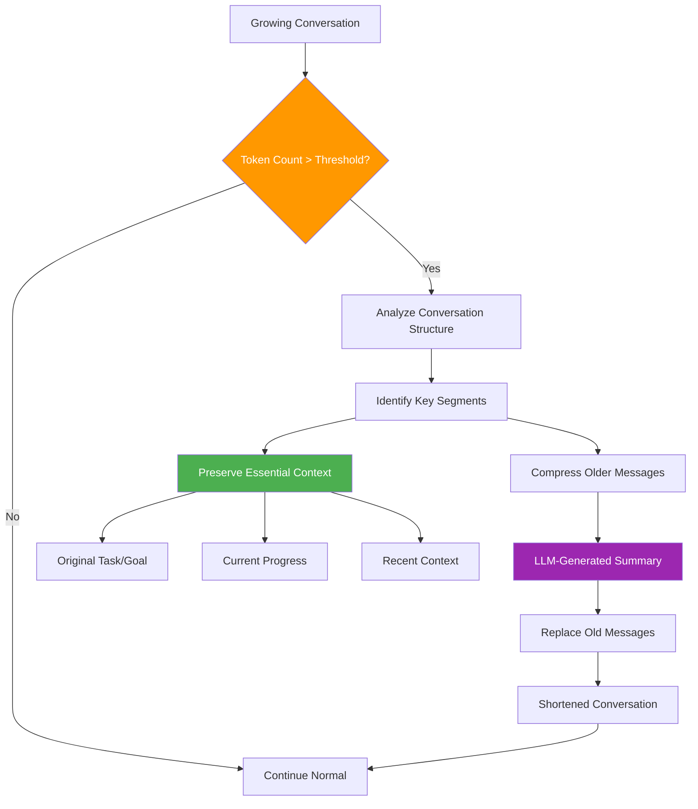

Here's how the system intelligently shortens conversations:

```python
# From agents/history.py - Much smarter than simple truncation
class ShortenConversationResult:
    """Compress conversation while preserving intent and progress"""
    
    def create_summary(self, history: list[dict]) -> str:
        """Use LLM to create intelligent summary"""
        summary_prompt = f"""
        Analyze this conversation and create a concise summary that preserves:
        
        1. The original task and user goals
        2. Key decisions and approaches taken  
        3. Current progress and state
        4. Important context for continuing the work
        5. Any constraints or preferences mentioned
        
        Conversation to summarize:
        {self._format_history_for_summary(history)}
        
        Create a summary that allows the conversation to continue 
        naturally while drastically reducing token count.
        """
        
        return await llm.complete(summary_prompt)
    
    def _format_history_for_summary(self, history: list) -> str:
        """Structure the history for optimal summarization"""
        # Group related messages, identify decision points,
        # highlight tool usage patterns, etc.
        pass
```

**Advanced Features:**

1. **Selective Preservation**: Keeps recent messages intact, summarizes older ones
2. **Tool Context**: Preserves results of important tool calls
3. **Decision History**: Maintains record of key choices made
4. **User Preferences**: Remembers how the user likes to work

**Example Transformation:**

```
Before (2000 tokens):
User: "Analyze this file..."
Assistant: "I'll read the file..." [reads file]
Assistant: "The file contains..." [long analysis]
User: "Now check the tests..."
Assistant: "Looking at tests..." [examines tests]
Assistant: "The tests show..." [detailed findings]
User: "What about performance?"
[...many more exchanges...]

After (400 tokens):
Summary: "User requested analysis of file X for code quality and testing. 
Found 3 main issues: naming conventions, missing error handling, 
and incomplete test coverage. Currently investigating performance 
characteristics. User prefers detailed explanations with examples."

[Recent 5 messages preserved exactly]
```

### Pattern 3: Adaptive Error Recovery

Our simple examples had basic try/catch blocks. Production systems need sophisticated error recovery that learns from failures:

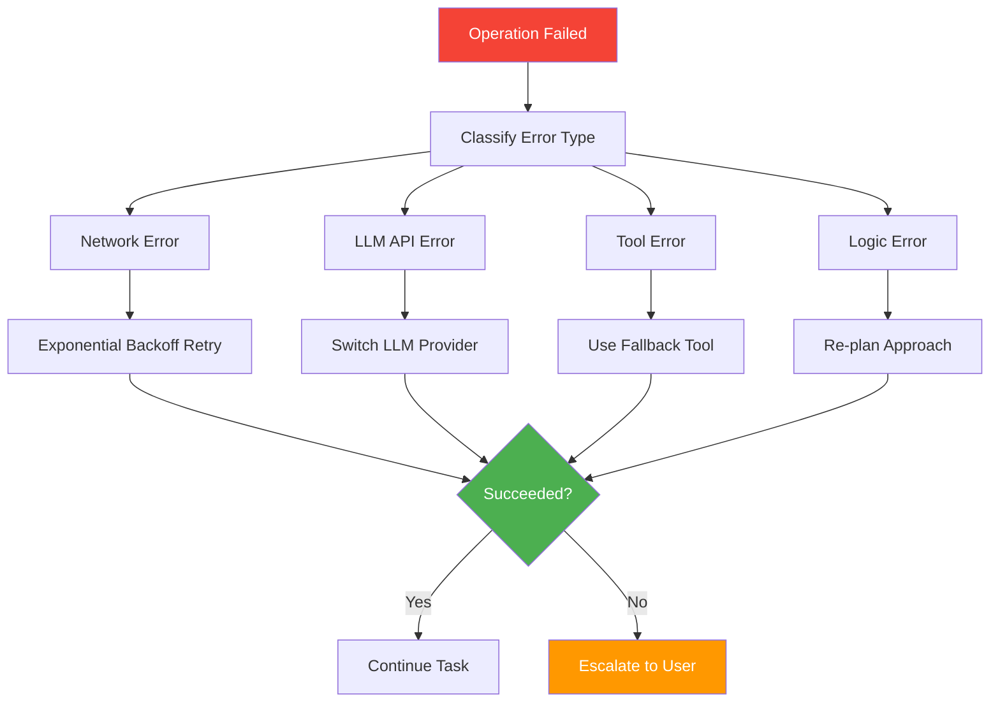

**Why These Patterns Matter:**

These aren't academic patterns - they solve real problems you encounter when users rely on your agents for important work:

1. **Interruptible Operations**: Users need control, especially for long-running tasks
2. **Context Management**: Conversations grow beyond LLM limits
3. **Error Recovery**: Networks fail, APIs have outages, tools break

**Connecting Back to Our Session:**

Remember our discussion about production realities in Part 2.5? These patterns address exactly those concerns:
- **Scalability**: Context management handles growing conversations
- **Reliability**: Error recovery and interrupts handle real-world failures
- **User Experience**: Interrupts and summaries respect user agency

The Coding Assistant shows how "bare metal" development can implement sophisticated UX patterns that rival commercial AI assistants.

---

## Part 7: Connecting Back to Your Learning Journey

### From SimpleAgent to Production System

Let's trace the evolution from our educational examples to the Coding Assistant's production implementation. This isn't just about adding features - it's about understanding how fundamental concepts scale to real-world systems.

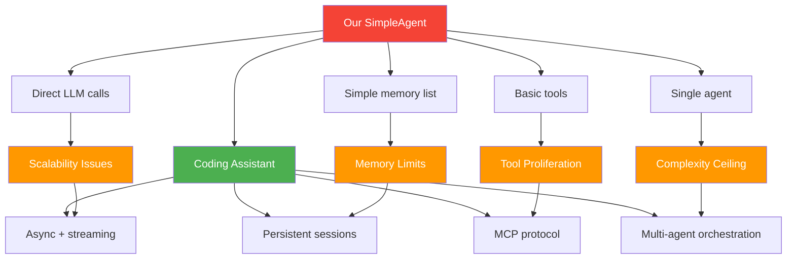

### The Dependency Injection Evolution

Remember our Part 2.5 discussion about the problems with hardcoded LLM providers? Let's trace how this evolved:

**Stage 1: Our Educational Example**
```python
# Hardcoded, single provider
def think(self, input_text: str) -> str:
    response = openai.ChatCompletion.create(
        model="gpt-4",
        messages=[{"role": "user", "content": input_text}]
    )
    return response.choices[0].message.content
```

**Stage 2: Abstract Interface (Part 2.5)**
```python
# Abstract but still manual
class LLMClient(ABC):
    @abstractmethod
    def complete(self, messages: list) -> str:
        pass

class OpenAIClient(LLMClient):
    def complete(self, messages: list) -> str:
        # OpenAI-specific implementation
        pass
```

**Stage 3: Production Implementation (Coding Assistant)**
```python
# Industrial-strength abstraction
async def complete(messages, model, tools):
    response = await litellm.acompletion(
        messages=messages,
        model=model,        # "gpt-4", "claude-3", "local-model"
        tools=tools,        # Standardized tool interface
        stream=True,        # Real-time responses
    )
    # Handles: retries, rate limits, provider fallback
```

**Key Evolution Points:**

1. **Async by Default**: Production systems can't block on I/O
2. **Streaming**: Users expect real-time feedback
3. **Tool Integration**: Agents need more than just LLM reasoning
4. **Provider Abstraction**: LiteLLM handles all the complexity we discussed

### The Tool Integration Journey

Our session showed simple tool patterns. The Coding Assistant evolves this through MCP:

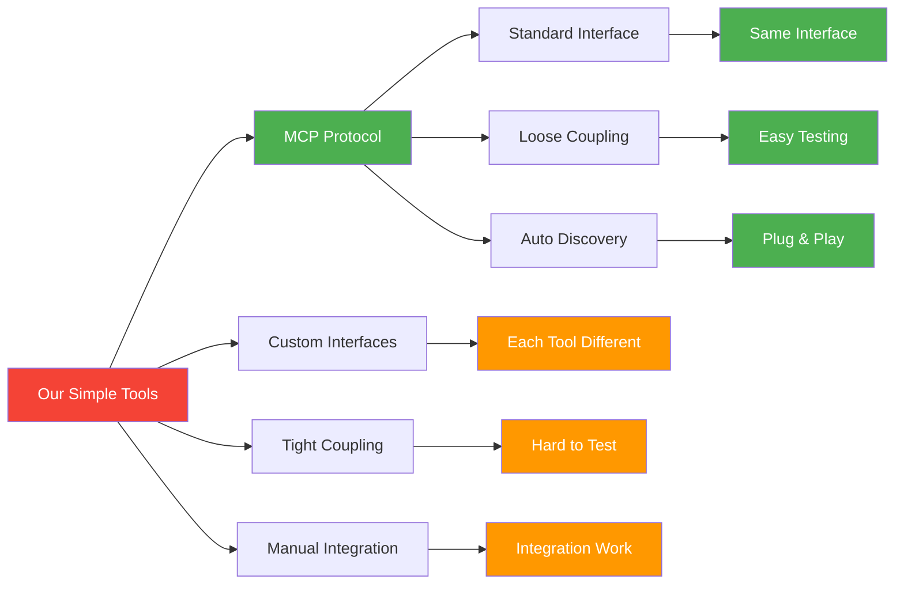

**The MCP Evolution Solves:**
- **Tool Proliferation**: As we add more tools, complexity grows exponentially without standards
- **Testing Difficulty**: Each custom interface needs custom mocks
- **Maintenance Overhead**: Tools break differently, requiring specific expertise

### Memory Management Maturation

```python
# Our simple approach (Session examples)
self.memory = []  # Works until it doesn't

# Production approach (Coding Assistant)  
class ConversationManager:
    def manage_context(self):
        if self.token_count > THRESHOLD:
            self.intelligent_summarize()  # Preserve key context
        if user_interrupted:
            self.save_state()            # Resume later
        if error_occurred:
            self.rollback_context()      # Consistent state
```

### Key Takeaways: From Learning to Building

### 1. Start Simple, Evolve Systematically

**Our Examples → Production Path:**
- ✅ **Learn patterns** with simple, clear examples (SimpleAgent)
- ✅ **Understand abstractions** through dependency injection (LLMClient)  
- ✅ **See production evolution** through real-world case study (Coding Assistant)

The concepts remain the same - the implementation grows more sophisticated.

### 2. Production is About Handling Reality

**Educational Code:**
```python
# Assumes everything works
response = llm.complete(prompt)
return response.content
```

**Production Code:**
```python
# Handles the real world
try:
    async with timeout(30):
        response = await llm.complete_with_retries(prompt)
        if response.interrupted:
            await save_state()
        return stream_to_user(response)
except TimeoutError:
    return fallback_response()
```

### 3. Architecture Emerges from Constraints

The Coding Assistant's architecture isn't arbitrary - it solves specific problems:

| Problem | Architectural Solution |
|---------|----------------------|
| Context limits | Intelligent conversation shortening |
| User control | Interruptible operations with state saving |
| Provider reliability | LiteLLM abstraction with fallbacks |
| Tool complexity | MCP protocol standardization |
| Debugging difficulty | OpenTelemetry observability |
| Security risks | Sandboxed execution with permission model |

### 4. Bare Metal ≠ Reinventing Everything

**Smart Production Approach:**
- **Use proven libraries** (LiteLLM, OpenTelemetry, MCP)
- **Focus on unique value** (orchestration, UX, domain logic)
- **Build abstractions** where you need flexibility
- **Adopt standards** where they exist

The Coding Assistant is "bare metal" because it controls the architecture and orchestration, not because it implements HTTP clients from scratch.

### Your Next Steps

Understanding the Coding Assistant gives you a roadmap:

1. **Master the Patterns**: Dependency injection, async operations, error handling
2. **Choose Your Abstractions**: When to build vs. when to adopt
3. **Plan for Scale**: Start simple, but architect for growth  
4. **User Experience First**: Production systems serve users, not just LLMs

**Most Important Insight**: The gap between our educational examples and the Coding Assistant isn't magic - it's the systematic application of production engineering principles to LLM-based systems.

---

## Practical Exercise: Run the Coding Assistant

### 1. Installation (Already done in Coder workspace!)

```bash
# The coding assistant is pre-installed
coding-assistant --help
```

### 2. Basic Usage

```bash
# Simple task
coding-assistant --task "Explain the code in main.py"

# With planning mode
coding-assistant --task "Refactor this function" --plan

# Resume previous session
coding-assistant --resume
```

### 3. Examine the Traces

```bash
# If OTLP endpoint configured
coding-assistant --task "Test task" \
    --otlp-endpoint http://localhost:4318
```

### 4. Explore the Code

Key files to examine:
- `src/coding_assistant/llm/model.py` - Real LLM calls
- `src/coding_assistant/agents/execution.py` - Orchestration logic
- `src/coding_assistant/tools/mcp.py` - Tool integration
- `src/coding_assistant/main.py` - Entry point and configuration

---

## Summary

The Coding Assistant demonstrates that "bare metal" doesn't mean "simple" - it means **direct control** over a sophisticated system. By studying this production implementation, you can see how all the patterns we've discussed come together in a real-world agent system.

**Key Insight**: The abstraction patterns (LLMClient interface), dependency injection (LiteLLM), and separation of concerns (agents vs tools) make this system flexible, testable, and production-ready.

---

## Navigation

**Previous:** [Session 1 - Main Content](Session1_Bare_Metal_Agents.md)  
**Next:** [Session 2 - Introduction to LangChain →](Session2_Introduction_to_LangChain.md)