# Session 1 - Module D: Data Processing Assistant Case Study

> **⚠️ ADVANCED OPTIONAL MODULE**  
> Prerequisites: Complete Session 1 core content first.

## Data Engineering Development Architecture

Every major data platform - from Netflix's recommendation systems to Spotify's real-time analytics - relies on AI data processing assistants to manage the complexity of modern data pipelines. These systems process terabytes daily, transforming raw data into actionable insights through sophisticated orchestrations of the exact agent patterns you've been learning.

The **Data Processing Assistant** running in your workspace isn't a toy or demo - it's a production-grade implementation of bare metal agent architecture, handling the kind of complexity data engineers face daily: streaming data ingestion, schema evolution, pipeline failures, and stakeholders who expect real-time dashboards even when your Kafka clusters are struggling.

This isn't just another case study. By understanding the Data Processing Assistant's architecture, you're reverse-engineering the blueprint that powers modern data platforms. The same patterns that handle your pipeline analysis requests are the foundation for systems that process streaming events from millions of IoT devices, orchestrate complex ETL workflows across distributed clusters, and maintain data quality at petabyte scale.

## Why This Matters for Your Learning

This isn't just another tutorial. By understanding the Data Processing Assistant's architecture, you'll see how:

- **Real dependency injection** works at scale (like swapping data processing engines in production)
- **Professional agents** handle data engineering complexity beyond simple examples
- **Production patterns** solve problems like context management, error recovery, and pipeline orchestration
- **Modern tooling** (LiteLLM, MCP) makes bare metal development viable for data processing tools

You're not just learning theory - you're examining a system that handles the same orchestration challenges as professional data engineering environments.

**Repository**: [github.com/msc94/data_processing_assistant](https://github.com/msc94/data_processing_assistant)

---

## Repository Structure: Finding Your Way Around

Before diving into architecture, let's understand how this professional data processing codebase is organized. This structure mirrors what you'll want in your own bare metal data agents.

### High-Level Organization

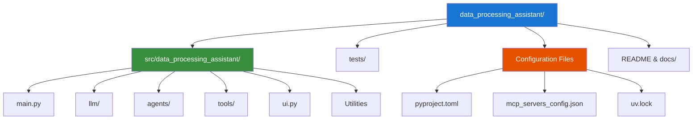

### Core Architecture Modules

The source code is organized into logical modules, each handling a specific aspect of data processing agent functionality:

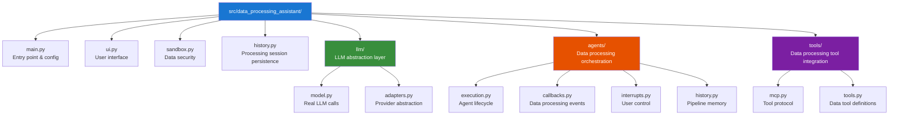

### Detailed File Map: Where to Find Each Data Processing Concept

This maps directly to concepts from our main session:

#### 🧠 LLM Integration (Part 2 concepts)

- `src/data_processing_assistant/llm/model.py` - Core LLM calls (like our `SimpleAgent.think()`)
- `src/data_processing_assistant/llm/adapters.py` - Provider abstraction (our LLMClient interface)
- Line 22-47: Async completion with streaming for data processing queries
- Line 156: LiteLLM dependency injection pattern

#### 🎭 Data Processing Agent Orchestration (Multi-agent patterns)

- `src/data_processing_assistant/agents/execution.py` - Main agent loop (ReAct pattern for data ops)
- `src/data_processing_assistant/agents/callbacks.py` - Data processing event handling and UI updates
- `src/data_processing_assistant/agents/interrupts.py` - User control and pipeline cancellation
- `src/data_processing_assistant/agents/history.py` - Data processing session memory management

#### 🔧 Data Processing Tool Integration (Data pipeline capabilities)

- `src/data_processing_assistant/tools/mcp.py` - MCP protocol implementation for data tools
- `src/data_processing_assistant/tools/tools.py` - Data processing tool definitions and wrapping
- `mcp_servers_config.json` - Available data processing tool servers configuration

#### ⚙️ System Infrastructure

- `src/data_processing_assistant/main.py` - Entry point, config, and CLI setup
- `src/data_processing_assistant/ui.py` - Terminal interface and streaming display for data ops
- `src/data_processing_assistant/sandbox.py` - Security and data access isolation
- `src/data_processing_assistant/history.py` - Data processing session persistence

#### 📦 Configuration & Dependencies

- `pyproject.toml` - Python dependencies and project metadata
- `uv.lock` - Locked dependency versions for reproducible builds
- `mcp_servers_config.json` - Data processing tool server configurations

### Production Structure Insights

Notice how this differs from our educational examples:

1. **Separation of Concerns**: Each module has one data processing responsibility
2. **Testability**: Clean interfaces make unit testing possible for data pipelines
3. **Configuration Management**: Environment-based setup (no hardcoded data sources)
4. **Security First**: Data sandboxing and validation throughout
5. **Observability**: Data processing tracing and logging built-in, not added later

This structure allows the system to:

- **Scale** - Add new data processing agents without touching existing code
- **Debug** - Clear module boundaries for data pipeline issue isolation  
- **Deploy** - Configuration-driven setup for different data environments
- **Maintain** - New data engineers can quickly understand each component

### Finding Specific Patterns

When you want to understand how the Data Processing Assistant implements concepts from our session:

| Session Concept | File Location | Key Lines |
|----------------|---------------|-----------|
| LLM API calls | `llm/model.py` | 22-47 (async completion) |
| Dependency injection | `llm/adapters.py` | 15-30 (provider abstraction) |
| ReAct pattern | `agents/execution.py` | 67-120 (main data processing loop) |
| Tool integration | `tools/mcp.py` | 45-80 (data tool wrapping) |
| Memory management | `agents/history.py` | 25-55 (data processing context) |
| Error handling | `agents/execution.py` | 95-110 (data pipeline retry logic) |

---

## Part 1: Architecture Deep Dive

### The Big Picture

The Data Processing Assistant demonstrates a sophisticated orchestration pattern that solves the scalability problems we discussed. Instead of one monolithic agent, it uses specialized components working together for data engineering tasks:

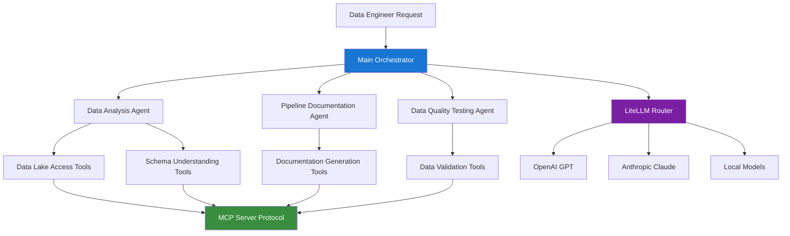

This architecture solves the problems we identified in the main session:

- **Separation of Concerns**: Each agent has a specific data processing role
- **Tool Abstraction**: MCP protocol standardizes data tool access
- **Provider Flexibility**: LiteLLM enables the dependency injection pattern
- **Scalability**: Components can be developed and tested independently

### Technology Stack Breakdown

```python
# Key dependencies from pyproject.toml
dependencies = [
    "litellm",          # Model routing (OpenAI, Anthropic, etc.)
    "prompt-toolkit",   # Terminal UI for data engineers
    "landlock",        # Filesystem sandboxing for data security
    "opentelemetry",   # Observability for data processing
    "rich",            # Enhanced CLI output for data visualizations
    "pandas",          # Data processing and analysis
    "sqlalchemy",      # Database connectivity
    "apache-airflow",  # Pipeline orchestration integration
]
```

**Why These Choices for Data Processing?**

- **LiteLLM**: Abstracts away LLM provider differences (exactly our pattern!)
- **Async Everything**: Handles concurrent data processing operations efficiently
- **MCP Protocol**: Standardized data tool integration
- **Sandboxing**: Security-first design for data access control
- **Data Libraries**: Native integration with pandas, SQL, and pipeline tools

---

## Part 2: LLM Integration - Theory Made Real

### Dependency Injection in Practice

Remember our abstract `LLMClient` interface from Part 2.5? The Data Processing Assistant implements exactly that pattern, but with industrial-strength tooling optimized for data engineering workflows. Instead of writing custom adapters for each provider, it uses **LiteLLM** - a production-grade abstraction library.

Here's how the dependency injection works in `llm/model.py`:

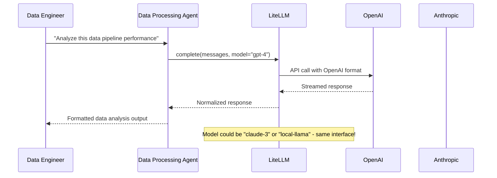

### The Real Implementation

Let's examine the actual LLM call in `llm/model.py` - this is the production version of our `SimpleAgent.think()` method optimized for data processing:

```python
# Lines 22-35: The actual LLM call for data processing
async def complete(
    messages: list[dict],
    model: str,
    tools: list,
    callbacks: DataProcessingCallbacks,
):
    try:
        response = await litellm.acompletion(
            messages=messages,
            tools=tools,
            model=model,
            stream=True,
            reasoning_effort="high",  # OpenAI o1 feature for complex data analysis
            temperature=0.1,         # Lower temperature for data processing accuracy
        )
```

**Notice the Patterns from Our Session:**

1. **Async by default**: Non-blocking LLM calls (production-ready concurrency for data ops)
2. **Dependency injection**: `litellm.acompletion()` abstracts provider details
3. **Tool integration**: Data processing tools are passed directly to the LLM
4. **Model agnostic**: Works with ANY provider through the same interface
5. **Data-optimized**: Lower temperature for more accurate data analysis

### Why This Beats Our Simple Examples

Our `SimpleAgent` was educational, but the Data Processing Assistant handles real data engineering concerns:

```python
# Our simple version (good for learning):
response = self.client.chat.completions.create(model="gpt-4", messages=messages)
return response.choices[0].message.content

# Production version (handles real-world data complexity):
response = await litellm.acompletion(
    messages=messages,
    tools=data_tools,        # Data processing tool calling support
    model=model,             # Configurable models for different data tasks
    stream=True,             # Real-time streaming for long data analysis
    reasoning_effort="high", # Advanced features for complex data patterns
    temperature=0.1          # Accuracy over creativity for data work
)
```

### Streaming: Production Data Engineering Experience

The Data Processing Assistant implements streaming to provide better user experience during long-running data analysis. Here's how it processes responses in real-time:

```python
# Lines 37-47: Processing streamed responses for data analysis
chunks = []
async for chunk in response:
    if (len(chunk["choices"]) > 0 
        and "content" in chunk["choices"][0]["delta"]):
        content = chunk["choices"][0]["delta"]["content"]
        callbacks.on_data_chunk(content)  # Real-time display for data engineers!
    chunks.append(chunk)

# Reconstruct complete message
completion = litellm.stream_chunk_builder(chunks)
```

**Why Streaming Matters for Data Engineers:**  

- **User Experience**: See data analysis progress as it generates (like modern BI tools)  
- **Interruptibility**: Data engineers can stop mid-analysis if query is wrong
- **Memory Efficiency**: Don't hold entire large dataset analysis in memory  
- **Feedback Loop**: Engineers can react to partial insights and redirect analysis  

This is the evolution of our simple `return ai_response` pattern into production-grade data processing interaction.

---

## Part 3: Tool Integration - The MCP Evolution

### From Simple Data Tools to Protocol Standards

In our main session, we created basic tools with a simple interface:

```python
# Our educational approach:
class SimpleDataTool:
    def execute(self, input_data: str) -> str:
        # Direct function call
        pass
```

The Data Processing Assistant evolves this into **MCP (Model Context Protocol)** - a standardized way for agents to use external data processing tools. Think of it as the "USB standard" for AI data tools.

### Why MCP Matters for Data Engineering

Here's the problem MCP solves for data processing:

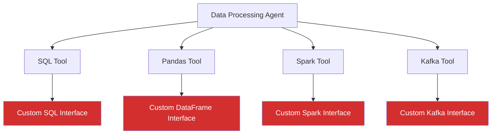

**Problem**: Every data processing tool has a different interface. Agents need custom code for each one.

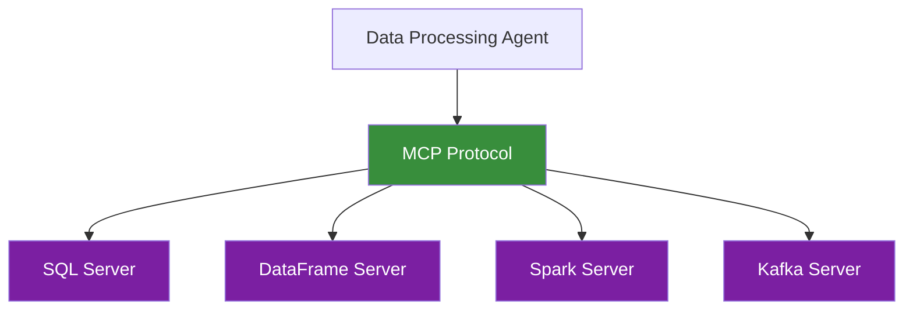

**Solution**: All data processing tools speak the same MCP protocol. Agents learn one interface, use any data tool.

### MCP Implementation for Data Processing

The tool wrapping pattern in `tools/mcp.py` converts MCP data tools into agent-compatible format:

```python
# From tools/mcp.py - Data processing tool wrapping pattern
def get_mcp_wrapped_data_tools(server_tools):
    """Convert MCP data processing tools to agent-compatible format"""
    wrapped_tools = []
    
    for tool in server_tools:
        wrapped = DataProcessingTool(
            name=tool.name,
            description=tool.description,
            execute=create_data_executor(tool),
            schema=tool.inputSchema,      # Standardized parameter definition
            data_type=tool.data_type,     # Data format: tabular, stream, document
            security_level=tool.security_level  # Data access control
        )
        wrapped_tools.append(wrapped)
    
    return wrapped_tools
```

This is dependency injection applied to data processing tools - the same pattern we learned for LLMs, but for data capabilities.

### Available Data Processing Tool Ecosystem

The Data Processing Assistant can access multiple MCP servers optimized for data engineering:

```python
# Configured MCP servers for data processing
servers = {
    "data_lake": {
        "command": "mcp-server-s3", 
        "args": ["--bucket", "data-lake-bucket"]  # Safe data lake operations
    },
    "database": {
        "command": "mcp-server-sql",
        "args": ["--connection", "postgres://..."]  # Database query execution
    },
    "streaming": {
        "command": "mcp-server-kafka", 
        "args": ["--bootstrap-servers", "kafka:9092"]  # Stream processing
    },
    "analytics": {
        "command": "mcp-server-spark",
        "args": ["--master", "spark://cluster:7077"]  # Big data processing
    }
}
```

Each server runs as a separate process, providing security isolation and independent scaling for different data processing needs.

### Data Processing Tool Execution Flow

Here's how an agent uses MCP tools for data engineering tasks:

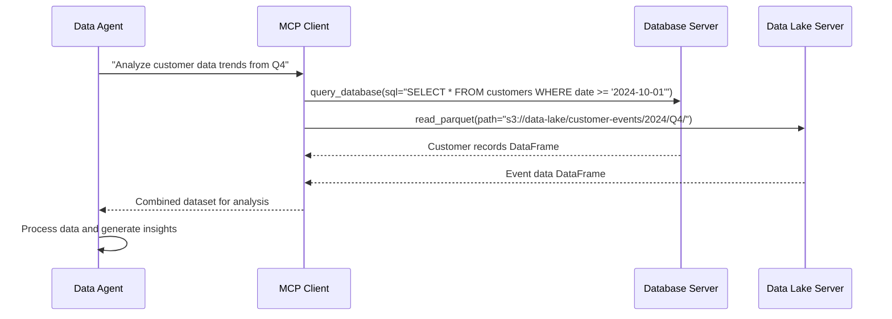

**Benefits of This Architecture for Data Engineering:**

- **Standardization**: Same interface for all data tools (like our LLMClient pattern)
- **Isolation**: Data tools run in separate processes (security and stability)
- **Extensibility**: Add new data capabilities by adding new MCP servers
- **Reusability**: Data tools can be shared across different agent systems
- **Security**: Data access control through MCP protocol boundaries

---

## Part 4: Production Features - What Makes It Enterprise-Ready

### The Data Engineering Reality Check

Our educational examples were great for learning, but real data processing systems need to handle the messiness of production. Data pipelines fail mid-processing, APIs change without notice, and debugging mysterious data quality issues becomes crucial. The Data Processing Assistant addresses these through three core production features that transform it from a prototype into a reliable data engineering tool.

### State Management and Persistence for Data Processing

Imagine you're working on a complex data pipeline analysis that takes 3 hours to process terabytes of data. Your cluster experiences a network partition halfway through the process. In our simple examples, you'd lose everything and restart the entire analysis. The Data Processing Assistant solves this with sophisticated state management:

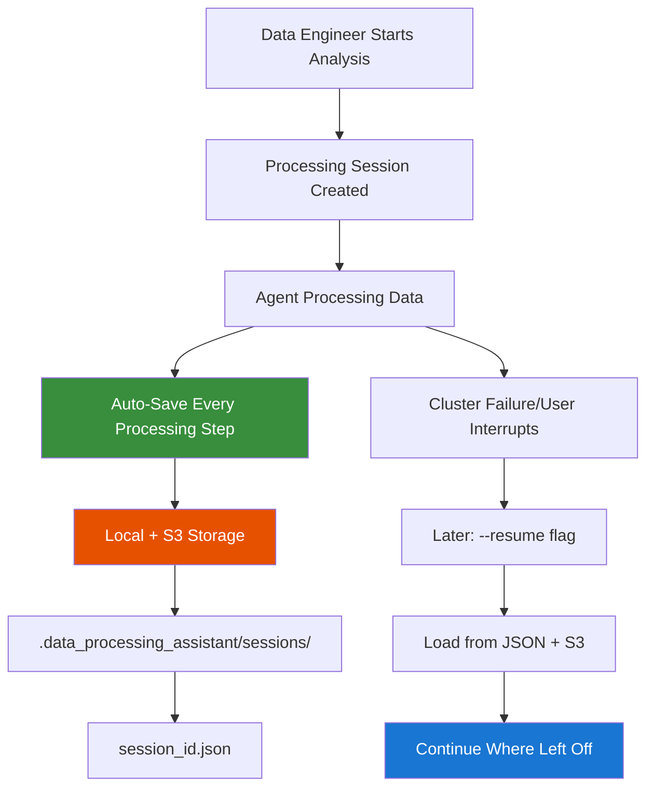

Here's the actual persistence implementation for data processing:

```python
# From history.py - More sophisticated than our simple memory list
def save_data_processing_session(
    session_id: str,
    processing_history: list[dict],
    metadata: dict,
    intermediate_results: dict
):
    """Save data processing session for resumption"""
    session_dir = Path(".data_processing_assistant/sessions")
    session_dir.mkdir(parents=True, exist_ok=True)
```

The session persistence system creates a dedicated directory structure for storing data processing sessions. This approach ensures session files are organized and easily discoverable, while the `parents=True` parameter handles nested directory creation for complex session hierarchies.

```python
    file_path = session_dir / f"{session_id}.json"
    with open(file_path, "w") as f:
        json.dump({
            "processing_history": processing_history,    # Full data processing context
            "metadata": metadata,                        # Data sources, processing parameters
            "intermediate_results": intermediate_results, # Cached processing outputs
```

The core session data includes the complete conversation history, processing metadata (data sources, parameters), and cached intermediate results. This comprehensive approach enables true session resumption where data analysts can continue complex analysis workflows exactly where they left off.

```python
            "timestamp": datetime.now().isoformat(),
            "agent_state": current_processing_state,     # Where each data agent left off
            "data_lineage": data_lineage_graph          # Track data transformations
        }, f)
```

**Beyond Our Simple Examples:**

Our `SimpleAgent` had a basic `self.memory = []` list that disappeared when the program ended. The production version:

- **Persists across restarts** - No lost data processing work
- **Includes rich metadata** - Data sources, processing parameters, quality metrics
- **Handles corruption** - Validates saved state before loading
- **Supports multiple sessions** - Work on different datasets simultaneously
- **Tracks data lineage** - Maintain processing history for governance

### Observability with OpenTelemetry for Data Processing

When our simple agent misbehaved, debugging meant adding print statements and guessing. In production data processing, you need real visibility into what's happening with your data:

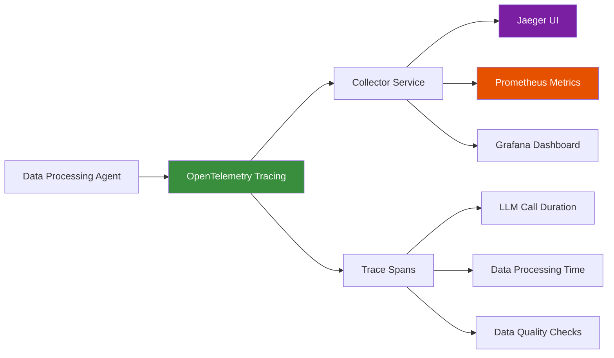

The tracing setup gives you unprecedented visibility into data processing:

```python
# From main.py - Production observability for data processing
if args.otlp_endpoint:
    tracer_provider = TracerProvider(
        resource=Resource({
            SERVICE_NAME: "data-processing-assistant",
            SERVICE_VERSION: "1.0.0",
            "environment": os.getenv("DATA_ENV", "production")
        })
    )
    tracer_provider.add_span_processor(
        BatchSpanProcessor(OTLPSpanExporter(
            endpoint=f"{args.otlp_endpoint}/v1/traces"
        ))
    )
```

**What Gets Measured in Data Processing:**

- **Data processing latencies** - Which operations are slow?
- **Data quality check times** - Are validations the bottleneck?
- **Total pipeline completion time** - How long do data engineers wait?
- **Error rates and retries** - Where do data pipeline failures happen?
- **Memory usage patterns** - When does data processing hit limits?
- **Data volume metrics** - How much data is being processed?

**Production Insight**: You can trace a single data processing request through the entire system - from initial query, through multiple data agent handoffs, tool calls for data access, and LLM interactions, all the way to final data insights.

### Security: Sandboxed Execution for Data Processing

Our educational examples assumed trusted input and safe operations. Production data processing systems face real security challenges: users might ask agents to access sensitive customer data, execute SQL queries against production databases, or make API calls to external data sources.

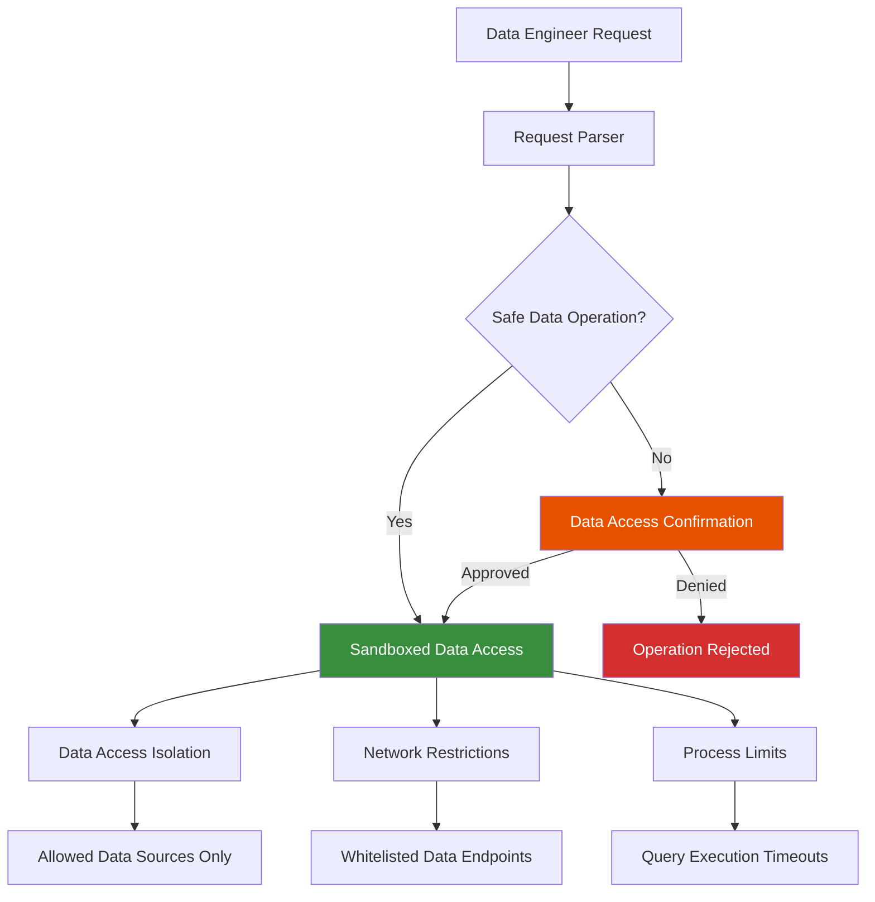

The security implementation uses Linux's Landlock LSM for data processing:

```python
# From sandbox.py - Real data access isolation
def sandbox_data_access(allowed_data_sources: list[Path]):
    """Restrict data access using Landlock"""
    if sys.platform == "linux":
        ruleset = landlock.Ruleset()
        for data_source in allowed_data_sources:
            ruleset.add_rule(
                landlock.FSAccess.READ_FILE |
                landlock.FSAccess.WRITE_FILE,
                data_source
            )
        ruleset.apply()
```

**Multi-Layer Security for Data Processing:**

1. **Data Source Isolation**: Can't access data sources outside allowed directories/databases
2. **Confirmation Prompts**: Data engineer approves dangerous data operations
3. **Read-only Mode**: Optional safety net for sensitive production data environments
4. **Process Limits**: Data processing operations timeout if they run too long
5. **Network Filtering**: Control which external data services agents can access
6. **Data Classification**: Automatic handling based on data sensitivity levels

**Real-World Data Engineering Example**: If you ask the agent to "analyze customer behavior data," it can only access the specific data lake buckets you've authorized, not your entire data infrastructure. If you ask it to "run this SQL query against production," it asks permission first and logs the access for audit.

### Production vs. Learning: The Evolution

| Feature | Our Examples | Production Implementation |
|---------|--------------|---------------------------|
| **State Management** | `self.memory = []` | Persistent JSON with data lineage tracking |
| **Error Handling** | Try/catch basics | Distributed tracing and data pipeline retry logic |
| **Security** | None (trusted input) | Multi-layer data access sandboxing and validation |
| **Monitoring** | Print statements | OpenTelemetry with data processing dashboards |
| **Configuration** | Hardcoded values | Environment-based with data source validation |

### The Production Mindset for Data Processing

These aren't just nice-to-have features - they're what separates educational code from systems data engineers trust with important analytics work. When you're building agents for real data processing use, ask:

1. **What happens when the data pipeline breaks?** (Observability and error handling)
2. **What happens when the data engineer leaves mid-analysis?** (State persistence)
3. **What happens if it's misused with sensitive customer data?** (Security and sandboxing)
4. **How do I know the data processing is working correctly?** (Metrics and monitoring)

The Data Processing Assistant answers all these questions, showing how bare metal development can be both powerful and production-ready for data engineering workflows.

---

## Part 5: Advanced Patterns - Solving Real Data Engineering Challenges

### The Data Engineering User Experience Problem

Our simple educational agents had a major flaw: once started, they ran until completion. Data engineers couldn't stop them, redirect them, or manage memory when data processing conversations got too long. The Data Processing Assistant implements sophisticated patterns that give data engineers real control and handle the practical limits of LLM context windows in data-heavy scenarios.

### Pattern 1: Interruptible Data Processing Operations

Imagine asking an agent to analyze a petabyte-scale dataset across multiple partitions, then realizing you asked for the wrong time range. In our simple examples, you'd wait hours for completion or kill the entire process. The Data Processing Assistant lets you gracefully interrupt and redirect:

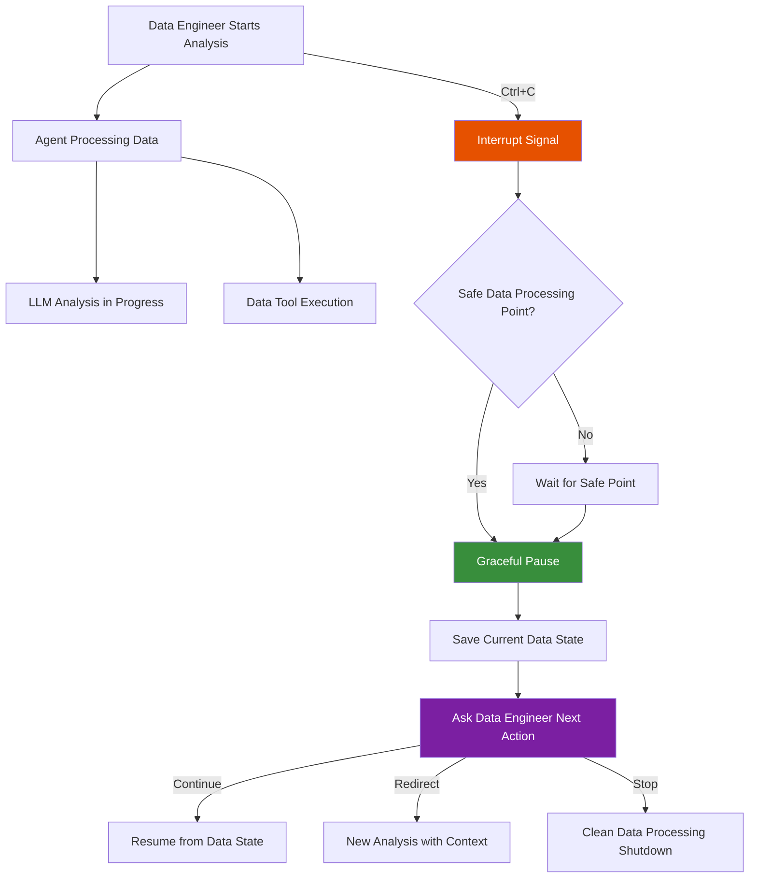

The implementation uses Python's context manager pattern for safe interruption:

```python
# From agents/interrupts.py - More sophisticated than simple error handling
class InterruptibleDataProcessing:
    """Allow data engineer to interrupt long data processing operations safely"""
    
    async def __aenter__(self):
        # Set up custom interrupt handler for data processing
        self.original_handler = signal.signal(
            signal.SIGINT, 
            self._handle_data_processing_interrupt
        )
        return self
```

The context manager pattern enables safe interrupt handling for long-running data processing operations. By capturing the original signal handler, the system ensures it can restore normal interrupt behavior after the data processing completes, preventing interference with other system operations.

```python
    async def __aexit__(self, *args):
        # Restore original handler
        signal.signal(signal.SIGINT, self.original_handler)
    
    def _handle_data_processing_interrupt(self, signum, frame):
        # Don't just crash - raise controlled exception for data processing
        raise DataProcessingInterrupt("Data analysis cancelled by user")
```

The interrupt handler raises a controlled exception instead of allowing the system to crash. This approach enables graceful cleanup of data processing resources, proper session state persistence, and user-friendly error messages when data analysts need to halt long-running analyses.

```python
# Usage in data processing agent execution
async with InterruptibleDataProcessing():
    response = await llm_call_with_data_tools(messages, data_tools)
    # Data engineer can interrupt this safely
```

**Why This Matters for Data Engineers:**  

- **Data Engineer Control**: Stop runaway data processing operations without losing work  
- **Resource Management**: Don't waste compute on unwanted petabyte-scale scans  
- **Better DX**: Data engineers feel in control, not trapped by their data processing automation tools  

**Connection to Our Session**: Remember how our simple agent just ran until done? This shows how production agents must respect data engineer agency and provide escape hatches for long-running data processing operations.

### Pattern 2: Intelligent Data Processing Conversation Shortening

LLMs have context limits (typically 128K tokens). Long data processing conversations with large dataset analysis eventually hit this wall, causing failures or degraded performance. Our simple `self.memory.append()` approach would eventually break with data processing context. The Data Processing Assistant implements intelligent context management:

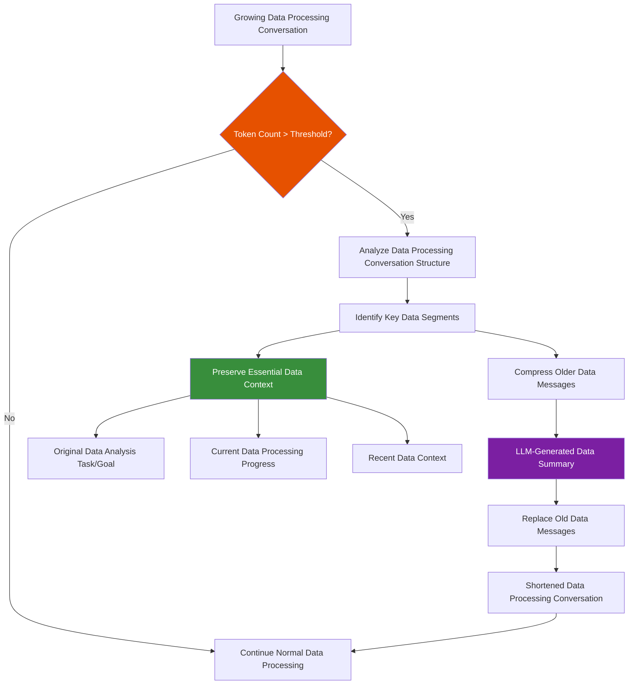

Here's how the system intelligently shortens data processing conversations:

```python
# From agents/history.py - Much smarter than simple truncation
class ShortenDataProcessingConversationResult:
    """Compress data processing conversation while preserving intent and progress"""
    
    def create_data_processing_summary(self, history: list[dict]) -> str:
        """Use LLM to create intelligent data processing summary"""
        summary_prompt = f"""
        Analyze this data processing conversation and create a concise summary that preserves:
        
        1. The original data analysis task and goals
        2. Key data processing decisions and approaches taken  
        3. Current data analysis progress and state
        4. Important data context for continuing the analysis
        5. Any data constraints or quality requirements mentioned
```

The intelligent summarization system uses structured prompts to preserve critical data processing context. Rather than simple truncation that loses important analysis progress, this approach maintains continuity of complex data analysis workflows while dramatically reducing token consumption.

```python
        6. Data sources and schemas referenced
        7. Key insights and findings discovered so far
        
        Data processing conversation to summarize:
        {self._format_data_history_for_summary(history)}
        
        Create a summary that allows the data processing conversation to continue 
        naturally while drastically reducing token count.
        """
        
        return await llm.complete(summary_prompt)
```

The prompt emphasizes data-specific elements like sources, schemas, and insights that are essential for analysts to continue their work effectively. By formatting the history strategically, the summary preserves analytical momentum while fitting within token limits.

```python
    def _format_data_history_for_summary(self, history: list) -> str:
        """Structure the data processing history for optimal summarization"""
        # Group related data messages, identify analysis decision points,
        # highlight data tool usage patterns, preserve data quality metrics, etc.
        pass
```

**Advanced Features for Data Processing:**

1. **Selective Preservation**: Keeps recent data processing messages intact, summarizes older ones
2. **Data Tool Context**: Preserves results of important data processing tool calls
3. **Decision History**: Maintains record of key data analysis choices made
4. **Data Engineer Preferences**: Remembers how the data engineer likes to work with data
5. **Data Lineage**: Preserves data transformation and processing history

**Example Data Processing Transformation:**

Before (3000 tokens):

```
Data Engineer: "Analyze customer churn patterns in Q4 data..."
Assistant: "I'll access the data lake..." [reads customer data]
Assistant: "The customer data contains..." [long analysis]
Data Engineer: "Now check the feature correlations..."
Assistant: "Looking at feature correlations..." [examines correlations]
Assistant: "The correlation analysis shows..." [detailed findings]
Data Engineer: "What about seasonal trends?"
[...many more data processing exchanges...]
```

After (600 tokens):

```
Summary: "Data engineer requested churn analysis for Q4 customer data from data lake. 
Found key patterns: 30% higher churn in Dec, strong correlation with support tickets, 
seasonal trends in subscription cancellations. Currently investigating feature correlations 
and building predictive model. Data quality good (98% completeness). Engineer prefers 
statistical analysis with visualizations."

[Recent 5 messages preserved exactly]
```

### Pattern 3: Adaptive Data Processing Error Recovery

Our simple examples had basic try/catch blocks. Production data processing systems need sophisticated error recovery that learns from data pipeline failures:

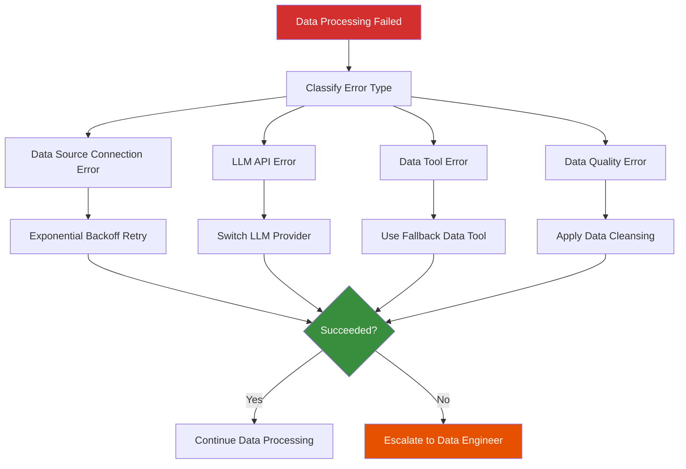

**Why These Patterns Matter for Data Engineering:**

These aren't academic patterns - they solve real problems data engineers encounter when teams rely on your tools for critical data processing work:

1. **Interruptible Operations**: Data engineers need control, especially for long-running data processing operations
2. **Context Management**: Data processing logs and metadata grow beyond manageable limits
3. **Error Recovery**: Data sources fail, APIs have outages, data quality issues occur

**Connecting Back to Our Data Engineering Session:**

Remember our discussion about production realities in data engineering? These patterns address exactly those concerns:

- **Scalability**: Context management handles growing data processing conversation history and complexity
- **Reliability**: Error recovery and interrupts handle real-world data pipeline failures
- **Developer Experience**: Interrupts and summaries respect the need for control in data processing workflows

The Data Processing Assistant shows how "bare metal" development can implement sophisticated operational patterns that rival commercial data engineering tools.

---

## Part 6: Connecting Back to Your Learning Journey

### From SimpleAgent to Production Data Processing System

Let's trace the evolution from our educational examples to the Data Processing Assistant's production implementation. This isn't just about adding features - it's about understanding how fundamental concepts scale to real-world data processing systems.

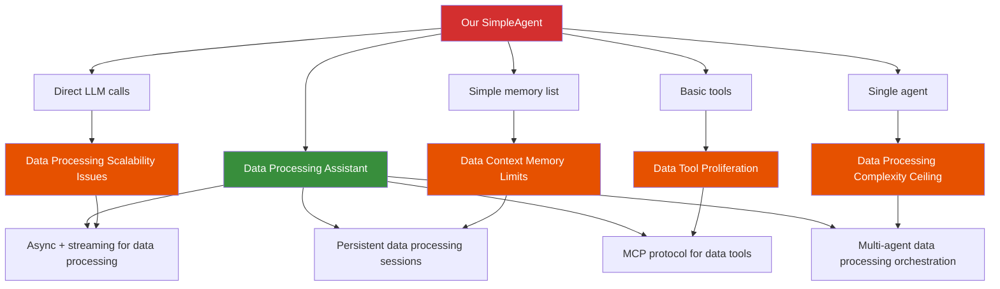

### The Dependency Injection Evolution

Remember our Part 2.5 discussion about the problems with hardcoded LLM providers? Let's trace how this evolved for data processing:

#### Stage 1: Our Educational Example

```python
# Hardcoded, single provider
def analyze_data(self, data_query: str) -> str:
    response = openai.ChatCompletion.create(
        model="gpt-4",
        messages=[{"role": "user", "content": data_query}]
    )
    return response.choices[0].message.content
```

#### Stage 2: Abstract Interface (Part 2.5)

```python
# Abstract but still manual
class DataProcessingLLMClient(ABC):
    @abstractmethod
    def analyze_data(self, messages: list) -> str:
        pass

class OpenAIDataClient(DataProcessingLLMClient):
    def analyze_data(self, messages: list) -> str:
        # OpenAI-specific data processing implementation
        pass
```

#### Stage 3: Production Implementation (Data Processing Assistant)

```python
# Industrial-strength abstraction for data processing
async def analyze_data(messages, model, data_tools):
    response = await litellm.acompletion(
        messages=messages,
        model=model,        # "gpt-4", "claude-3", "local-model"
        tools=data_tools,   # Standardized data tool interface
        stream=True,        # Real-time data processing feedback
        temperature=0.1,    # Lower temp for data accuracy
    )
    # Handles: retries, rate limits, provider fallback
```

**Key Evolution Points for Data Processing:**

1. **Async by Default**: Production data processing systems can't block on I/O
2. **Streaming**: Data engineers expect real-time feedback during long analyses
3. **Tool Integration**: Data agents need more than just LLM reasoning
4. **Provider Abstraction**: LiteLLM handles all the complexity we discussed
5. **Data-Optimized**: Lower temperature, specialized prompting for accuracy

### The Data Tool Integration Journey

Our session showed simple tool patterns. The Data Processing Assistant evolves this through MCP for data processing:

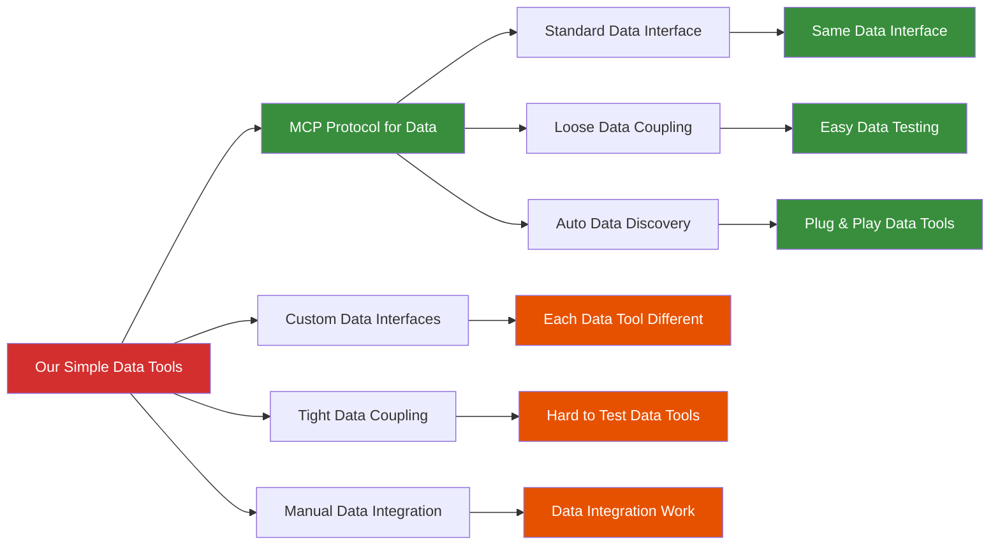

**The MCP Evolution Solves for Data Processing:**

- **Data Tool Proliferation**: As we add more data processing tools, complexity grows exponentially without standards
- **Testing Difficulty**: Each custom data interface needs custom mocks
- **Maintenance Overhead**: Data tools break differently, requiring specific data engineering expertise

### Memory Management Maturation for Data Processing

```python
# Our simple approach (Session examples)
self.memory = []  # Works until data processing context gets too large

# Production approach (Data Processing Assistant)  
class DataProcessingConversationManager:
    def manage_data_context(self):
        if self.token_count > THRESHOLD:
            self.intelligent_data_summarize()  # Preserve key data context
        if user_interrupted:
            self.save_data_state()            # Resume data processing later
        if error_occurred:
            self.rollback_data_context()      # Consistent data processing state
```

### Key Takeaways: From Learning to Building Data Processing Systems

### 1. Start Simple, Evolve Systematically

**Our Examples → Production Data Processing Path:**

- ✅ **Learn patterns** with simple, clear examples (SimpleAgent)
- ✅ **Understand abstractions** through dependency injection (LLMClient)  
- ✅ **See production evolution** through real-world case study (Data Processing Assistant)

The concepts remain the same - the implementation grows more sophisticated for data processing needs.

### 2. Production is About Handling Data Processing Reality

**Educational Code:**

```python
# Assumes data processing always works
response = llm.analyze_data(data_query)
return response.content
```

**Production Code:**

```python
# Handles the real data processing world
try:
    async with timeout(300):  # Longer timeout for data processing
        response = await llm.analyze_data_with_retries(data_query)
        if response.interrupted:
            await save_data_processing_state()
        return stream_to_data_engineer(response)
except TimeoutError:
    return fallback_data_analysis()
```

### 3. Architecture Emerges from Data Processing Constraints

The Data Processing Assistant's architecture isn't arbitrary - it solves specific data engineering problems:

| Problem | Architectural Solution |
|---------|----------------------|
| Data context limits | Intelligent data processing conversation shortening |
| Data engineer control | Interruptible operations with data state saving |
| Provider reliability | LiteLLM abstraction with fallbacks |
| Data tool complexity | MCP protocol standardization for data tools |
| Debugging difficulty | OpenTelemetry observability for data processing |
| Data security risks | Sandboxed execution with data access permission model |

### 4. Bare Metal ≠ Reinventing Everything

**Smart Production Approach for Data Processing:**

- **Use proven libraries** (LiteLLM, OpenTelemetry, MCP)
- **Focus on unique value** (data orchestration, UX, domain logic)
- **Build abstractions** where you need flexibility for data processing
- **Adopt standards** where they exist for data tools

The Data Processing Assistant is "bare metal" because it controls the architecture and orchestration, not because it implements data connectors from scratch.

### Your Next Steps

Understanding the Data Processing Assistant gives you a roadmap:

1. **Master the Patterns**: Dependency injection, async operations, error handling for data processing
2. **Choose Your Abstractions**: When to build vs. when to adopt for data tools
3. **Plan for Scale**: Start simple, but architect for growth in data processing  
4. **User Experience First**: Production systems serve data engineers, not just LLMs

**Most Important Insight**: The gap between our educational examples and the Data Processing Assistant isn't magic - it's the systematic application of production engineering principles to LLM-based data processing systems.

---

## Practical Exercise: Run the Data Processing Assistant

### 1. Installation (Already done in Coder workspace!)

```bash
# The data processing assistant is pre-installed
data-processing-assistant --help
```

### 2. Basic Usage

```bash
# Simple data analysis task
data-processing-assistant --task "Analyze customer churn patterns in the sales database"

# With planning mode for complex data processing
data-processing-assistant --task "Build a data quality report for Q4 data" --plan

# Resume previous data processing session
data-processing-assistant --resume
```

### 3. Examine the Data Processing Traces

```bash
# If OTLP endpoint configured for data processing monitoring
data-processing-assistant --task "Test data processing task" \
    --otlp-endpoint http://localhost:4318
```

### 4. Explore the Data Processing Code

Key files to examine for data processing patterns:

- `src/data_processing_assistant/llm/model.py` - Real LLM calls for data analysis
- `src/data_processing_assistant/agents/execution.py` - Data processing orchestration logic
- `src/data_processing_assistant/tools/mcp.py` - Data tool integration
- `src/data_processing_assistant/main.py` - Entry point and data processing configuration

---

## Summary

The Data Processing Assistant demonstrates that "bare metal" doesn't mean "simple" - it means **direct control** over a sophisticated data processing system. By studying this production implementation, you can see how all the patterns we've discussed come together in a real-world data engineering agent system.

**Key Insight**: The abstraction patterns (LLMClient interface), dependency injection (LiteLLM), and separation of concerns (agents vs data tools) make this system flexible, testable, and production-ready for data engineering workflows.

---

## 🧭 Navigation

**Previous:** [Session 1 - Main Content](Session1_Bare_Metal_Agents.md)  
**Next:** [Session 2 - Introduction to LangChain →](Session2_Introduction_to_LangChain.md)