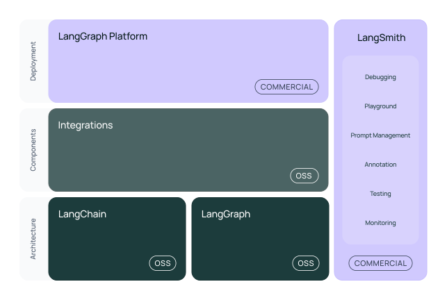

# 🎯📝⚙️ Session 2: LangChain Foundations Hub

Imagine you're architecting a massive data processing system where intelligent agents orchestrate petabyte-scale analytics - data quality monitors coordinate with pipeline validators, streaming processors adapt to real-time anomalies, and ML pipeline components make autonomous optimization decisions across distributed data infrastructure. This is exactly what LangChain enables for data engineering: a sophisticated framework that transforms isolated model calls into orchestrated, intelligent data systems that can reason about data quality, remember processing patterns, and act purposefully across complex data workflows.

## 🎯📝⚙️ Learning Path Overview

This session offers three distinct learning paths to master LangChain foundations:

### 🎯 Observer Path - Essential Concepts (40-60 min)
**Perfect for**: Quick understanding, decision makers, overview before deep dive
**Content**: Core LangChain architecture, basic chains, simple agents, memory concepts
**Files**: This main session covers all Observer Path content

### 📝 Participant Path - Practical Implementation (2-3 hours)
**Perfect for**: Hands-on learning, developers, practical application
**Content**: Complete implementations, error handling, production patterns
**Files**: All 🎯 Observer content PLUS [📝 Practical Implementation](Session2_Practical_Implementation.md)

### ⚙️ Implementer Path - Deep Architecture Mastery (6-8 hours)
**Perfect for**: Advanced developers, architects, production systems
**Content**: All Observer and Participant content PLUS advanced patterns
**Files**: Complete the above paths, then explore:
- [⚙️ Advanced Agent Architecture](Session2_Advanced_Agent_Architecture.md)
- [⚙️ Production Memory Systems](Session2_Production_Memory_Systems.md)
- [⚙️ Enterprise Tool Development](Session2_Enterprise_Tool_Development.md)

---

## 🎯 Observer Path: LangChain Architecture Foundations

**Code Repository**: [`src/session2/`](https://github.com/fwornle/agentic-ai-nano/tree/main/docs-content/01_frameworks/src/session2)
**Quick Start**: `cd src/session2 && python langchain_basics.py`

## LangChain Architecture Overview: The Data Processing Orchestrator

Building on the bare metal foundations from Session 1, LangChain operates like a master data pipeline orchestrator managing distributed analytics workloads. Each component - models, prompts, chains, and memory - handles specific data processing responsibilities, but the true power emerges when they're orchestrated together to create intelligent data systems that understand context, optimize automatically, and scale seamlessly across your data infrastructure.

### Core Components

LangChain has four essential building blocks that work together like specialized services in a modern data platform:



1. **LLMs**: These are your intelligent data analysts that provide insights and generate responses about data patterns, quality issues, and optimization strategies
2. **Tools**: External data processing functions that extend agent capabilities beyond text generation - like giving your AI direct access to data warehouses, streaming platforms, and ML pipelines
3. **Memory**: Context storage for processing continuity - the agent's ability to remember previous data insights, processing decisions, and optimization patterns
4. **Agents**: Orchestration layer that coordinates data workflows - the intelligent dispatcher that decides which data processing actions to take when

### Installation and Setup

First, we'll set up the foundation that transforms individual API calls into sophisticated data processing intelligence:

```bash
pip install langchain==0.1.0 openai==1.0.0
export OPENAI_API_KEY="your-api-key"
```

### Essential Imports

These imports provide access to LangChain's core functionality, giving you the building blocks for intelligent data applications:

```python
from langchain.chat_models import ChatOpenAI
from langchain.agents import Tool, initialize_agent
from langchain.memory import ConversationBufferMemory
from langchain.callbacks import StdOutCallbackHandler
```

### LLM Initialization

Create an LLM instance with proper configuration - this is where raw computational power becomes accessible data intelligence:

```python
def create_llm(provider="openai"):
    if provider == "openai":
        return ChatOpenAI(
            model="gpt-4",
            temperature=0.7
        )
```

The temperature parameter controls output randomness: 0 for deterministic responses (like precise data validation), 1 for creative responses (like exploring data anomaly explanations).

### Usage with Error Handling

Always include error handling when initializing LLMs - production data systems need graceful failure handling:

```python
try:
    llm = create_llm("openai")
except Exception as e:
    print(f"LLM initialization failed: {e}")
    # Implement fallback logic here
```

### Component Flow

Here's how LangChain components work together in an intelligent data processing workflow:

```text
Data Input → Agent → Tool Selection → LLM Analysis → Output
              ↑              ↓              ↑
           Memory ←→ Context Management ←→ State
```

This flow mirrors how data engineering teams solve complex problems - they ingest data, remember processing context, choose appropriate tools and methods, apply analytical reasoning, and generate actionable insights for downstream systems.

---

## Chain Patterns: Building Data Processing Pipelines

Chains are where LangChain truly excels for data engineers, transforming simple interactions into sophisticated data processing workflows. Think of chains as data pipelines where each stage adds analytical value and intelligence to your data processing results.

### Simple Chain Creation

Chains combine LLMs with prompt templates for reusable data processing workflows, solving the problem of how to make AI responses consistent and purposeful for data operations:

```python
from langchain.chains import LLMChain
from langchain.prompts import PromptTemplate
```

Create a template with variable substitution - this is like creating a data analysis blueprint that adapts to different datasets and scenarios:

```python
template = "Analyze this data quality report and provide optimization recommendations: {data_report}"
prompt = PromptTemplate(template=template, input_variables=["data_report"])
```

Variables in `{brackets}` enable dynamic content substitution - the same template works for analyzing streaming data quality, batch processing results, or ML model performance metrics.

### Chain Construction and Execution

Build the chain and execute it with data - this is where templates become living, responsive data intelligence systems:

```python
chain = LLMChain(llm=llm, prompt=prompt)
result = chain.run("Data pipeline processed 2.3TB with 99.7% success rate, detected 15 schema violations")
print(f"Analysis: {result}")
```

### Sequential Chains

Sequential chains connect multiple analytical steps for complex data workflows, like having multiple data specialists review the same processing results in sequence:

```python
from langchain.chains import SequentialChain
```

Create the first step - data summarization (like having a data analyst extract key insights from processing logs):

```python
summary_chain = LLMChain(
    llm=llm,
    prompt=PromptTemplate(
        template="Summarize key metrics from this data processing report: {data_report}",
        input_variables=["data_report"]
    ),
    output_key="summary"
)
```

Create the second step - anomaly analysis (like having a data reliability engineer interpret patterns and identify issues):

```python
anomaly_chain = LLMChain(
    llm=llm,
    prompt=PromptTemplate(
        template="Identify potential data quality issues and anomalies in: {summary}",
        input_variables=["summary"]
    ),
    output_key="anomalies"
)
```

Each step's output feeds into the next step's input, creating a processing pipeline that mirrors how data teams collaborate on complex analytical workflows.

### Pipeline Assembly and Execution

Combine the chains into a complete data analysis pipeline - this creates a system where the whole provides deeper insights than individual analyses:

```python
analysis_pipeline = SequentialChain(
    chains=[summary_chain, anomaly_chain],
    input_variables=["data_report"],
    output_variables=["summary", "anomalies"]
)
```

Execute the complete pipeline - watch as your raw processing reports transform into structured data insights:

```python
results = analysis_pipeline.run({"data_report": "Detailed data processing logs and metrics..."})
```

---

## Agent Creation & Tool Integration: Giving Data AI Hands to Work

Moving beyond text generation, we now give our agents the ability to take action in data systems. This is where AI transforms from passive analyzers to active data infrastructure partners.

### Understanding Tools

Tools extend agent capabilities beyond text generation, like giving a brilliant data scientist the ability to directly interact with your data infrastructure:

- Data Warehouse: SQL queries and analytics across petabyte-scale datasets
- Streaming Platforms: Real-time data processing and monitoring capabilities
- ML Pipeline: Model training, deployment, and performance monitoring
- Data Quality: Schema validation, anomaly detection, and quality scoring

### Basic Tool Creation

There are three ways to create tools in LangChain, each optimized for different data engineering use cases:

```python
from langchain.agents import Tool
from langchain.tools import tool
```

#### Method 1: Explicit Tool Creation

Define a function and wrap it in a Tool class - this approach gives you maximum control and clarity for data operations:

```python
def query_data_warehouse(sql_query: str) -> str:
    """Execute SQL query against data warehouse"""
    # In reality, connect to Snowflake, BigQuery, or Redshift
    return f"Query results: {sql_query} returned 1,847 rows with avg processing time 2.3s"
```

Wrap the function in a Tool - this creates a standardized interface that agents can understand and use for data analysis:

```python
warehouse_tool = Tool(
    name="DataWarehouse",
    description="Execute SQL queries against the enterprise data warehouse",
    func=query_data_warehouse
)
```

#### Method 2: Decorator Approach

Use the @tool decorator for cleaner syntax - this is like adding intelligence to standard data processing functions:

```python
@tool
def check_data_quality(dataset_path: str) -> str:
    """Analyze data quality metrics for specified dataset"""
    try:
        # Connect to data quality monitoring system
        quality_score = 94.7  # Would calculate from actual metrics
        return f"Data quality score: {quality_score}%, Schema compliance: 98.2%, Null rate: 1.3%"
    except:
        return "Cannot access data quality metrics for this dataset"
```

**Production Note**: Always use proper data connections and error handling in production environments to prevent data access issues.

### Simple Agent Creation

Agents follow the **ReAct pattern** (Reasoning + Acting) - a cycle that mirrors how data engineers approach complex data problems:

1. **Think**: Analyze the data request and understand what processing is needed
2. **Act**: Use appropriate data tools to gather information or process data
3. **Think**: Process the results and determine if additional data operations are needed
4. **Act**: Use more data tools if the analysis isn't complete
5. **Think**: Formulate final insights based on all gathered data evidence

### Setting Up Memory

First, configure conversation memory - this gives agents the ability to maintain context across multiple data analysis interactions:

```python
from langchain.agents import initialize_agent, AgentType
from langchain.memory import ConversationBufferMemory
```

Memory stores analytical context like a data scientist's working memory during extended data exploration sessions:

```python
memory = ConversationBufferMemory(
    memory_key="chat_history",
    return_messages=True
)
```

### Creating the Agent

Combine tools, LLM, and memory into an agent - this creates an intelligent data system that can reason about data, remember context, and take action:

```python
tools = [warehouse_tool, check_data_quality]
```

Initialize the agent with all components - this is where individual pieces become an intelligent, coordinated data processing system:

```python
agent = initialize_agent(
    tools=tools,
    llm=llm,
    agent_type=AgentType.CHAT_CONVERSATIONAL_REACT_DESCRIPTION,
    memory=memory,
    verbose=True  # Show reasoning process
)
```

The agent now has reasoning (LLM), capabilities (data tools), and context (memory) - everything needed for intelligent data analysis and processing.

---

## Memory & State Management: Building Persistent Data Intelligence

Memory transforms stateless interactions into coherent, context-aware data analysis conversations. Just as data engineers maintain working knowledge during complex data investigations, agents need memory systems to provide intelligent, contextual responses about ongoing data analysis workflows.

### Memory Types

LangChain offers three main memory types, each optimized for different data analysis scenarios like different types of analytical context:

- **Buffer Memory**: Stores complete analysis history (like detailed audit logs of data processing decisions)
- **Summary Memory**: Summarizes older conversations (like executive briefings that capture key data insights)
- **Window Memory**: Keeps only recent messages (like short-term focus on immediate data processing context)

### When to Use Each Type

Choose memory types based on your data application's needs and constraints:

- **Buffer**: Complex data investigations requiring exact history - perfect for compliance auditing or detailed data quality analysis
- **Summary**: Long data analysis sessions where context matters but details don't - ideal for ongoing data monitoring or trend analysis
- **Window**: Fixed memory size, focus on recent context - best for real-time data processing systems with resource constraints

### Memory Configuration

Import the memory types that will give your agents different analytical cognitive capabilities:

```python
from langchain.memory import (
    ConversationBufferMemory,
    ConversationSummaryMemory,
    ConversationBufferWindowMemory
)
```

#### Buffer Memory: Remember Everything

Perfect for situations where every data processing detail matters - like a compliance auditor capturing every data transformation decision:

```python
full_memory = ConversationBufferMemory(
    memory_key="chat_history",
    return_messages=True
)
```

#### Summary Memory: Intelligent Summarization

Uses the LLM to compress old conversations while preserving important data context - like having a data analyst who keeps you briefed on ongoing data investigations:

```python
smart_memory = ConversationSummaryMemory(
    llm=llm,  # Needs LLM to create summaries
    memory_key="chat_history",
    return_messages=True
)
```

#### Window Memory: Recent Context Only

Maintains focus on the most recent data interactions - like having a conversation where you naturally focus on current data processing challenges:

```python
recent_memory = ConversationBufferWindowMemory(
    memory_key="chat_history",
    k=5,  # Last 5 question-answer pairs
    return_messages=True
)
```

---

## 📝 Next Steps: Participant Path Implementation

**Ready for hands-on practice?** The Participant Path provides complete implementations with error handling and production patterns.

**Continue to:** [📝 Session 2 - Practical Implementation](Session2_Practical_Implementation.md)
**Time Investment:** 2-3 hours of focused implementation practice
**What you'll build:** Complete data intelligence agents with tool integration and error handling

---

## ⚙️ Advanced Architecture Options

For comprehensive deep-dive into enterprise patterns and advanced architectures:

**Advanced Learning Paths:**
- [⚙️ Advanced Agent Architecture](Session2_Advanced_Agent_Architecture.md) - Sophisticated orchestration patterns
- [⚙️ Production Memory Systems](Session2_Production_Memory_Systems.md) - State persistence and enterprise context
- [⚙️ Enterprise Tool Development](Session2_Enterprise_Tool_Development.md) - Custom tools and integrations

**Legacy Advanced Modules:**
- [LangChain Patterns](Session2_ModuleA_Advanced_LangChain_Patterns.md) - Complex workflows & optimization
- [Production Deployment](Session2_ModuleB_Production_Deployment_Strategies.md) - Enterprise deployment & monitoring
- [Tool Development](Session2_ModuleC_Custom_Tool_Development.md) - Specialized data processing tools
- [Performance Monitoring](Session2_ModuleD_Performance_Monitoring.md) - System optimization & observability

---

## 📝 Multiple Choice Test - Session 2

Test your understanding of LangChain foundations and agent patterns for data engineering:

**Question 1:** What is the primary benefit of LangChain's unified LLM interface for data systems?
A) Lower computational cost
B) Consistent API across different LLM providers for data analysis
C) Faster data processing times
D) Better data storage performance

**Question 2:** Which LangChain component is responsible for managing data analysis conversation context?
A) Chains
B) Tools
C) Memory
D) Agents

**Question 3:** How many ways can you create tools in LangChain for data processing?
A) Four - including custom data implementations
B) Two - BaseTool and @tool decorator
C) Three - BaseTool, @tool decorator, and StructuredTool
D) One - inheriting from BaseTool

**Question 4:** What is the primary purpose of Sequential Chains in data processing workflows?
A) To run multiple data agents simultaneously
B) To connect multiple processing steps where each step's output feeds the next
C) To handle data errors in parallel
D) To reduce computational costs

**Question 5:** Which memory type would be best for a long data analysis conversation where you need context but not all details?
A) ConversationBufferMemory
B) ConversationSummaryMemory
C) ConversationBufferWindowMemory
D) ConversationEntityMemory

[**🗂️ View Test Solutions →**](Session2_Test_Solutions.md)
---

## 🧭 Navigation

**Previous:** [Session 1 - Bare Metal Agents ←](Session1_Bare_Metal_Agents.md)
**Next:** [Session 3 - LangGraph Multi-Agent Workflows →](Session3_LangGraph_Multi_Agent_Workflows.md)
---
