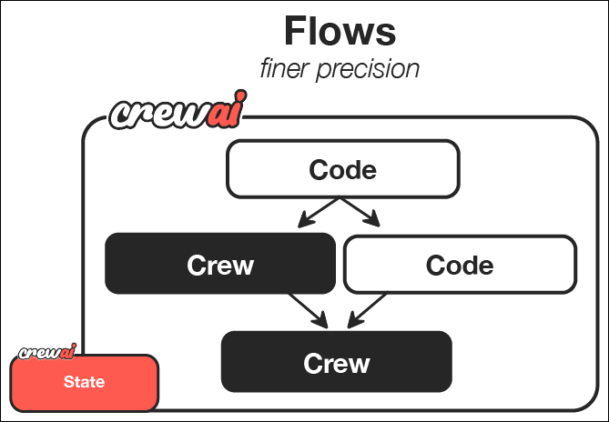

# ⚙️ Session 4: Advanced Orchestration - Complex Coordination & Performance Optimization

> **⚙️ IMPLEMENTER PATH CONTENT**  
> Prerequisites: Complete 🎯 [CrewAI Fundamentals](Session4_CrewAI_Fundamentals.md) and 📝 [Team Building Practice](Session4_Team_Building_Practice.md)  
> Time Investment: 3-4 hours  
> Outcome: Deep expertise in advanced orchestration, performance optimization, and production monitoring  

## Learning Outcomes

After completing this module, you will master:  

- Advanced task orchestration and delegation patterns  
- Performance optimization techniques for production environments  
- Comprehensive monitoring and result aggregation strategies  
- Communication patterns and memory management for complex workflows  
- Production-ready configuration and error handling  
- Enterprise-scale team coordination and resource management  

## Task Orchestration & Delegation - Advanced Team Coordination

Moving beyond simple sequential workflows to sophisticated coordination patterns that mirror how the most effective data engineering teams operate across distributed processing environments.  

### Workflow Coordination

Managing task dependencies and handoffs like an expert data engineering project manager:  



**File**: [`src/session4/hierarchical_crew.py`](https://github.com/fwornle/agentic-ai-nano/blob/main/docs-content/01_frameworks/src/session4/hierarchical_crew.py) - Advanced orchestration

Let's create a hierarchical workflow starting with the data engineering manager - the coordinator who ensures smooth operation across complex data processing pipelines:  

```python
def create_hierarchical_data_workflow():
    """Create a hierarchical data processing crew with delegation"""
    
    # Data engineering manager with delegation capabilities
    data_eng_manager = Agent(
        role='Data Engineering Manager',
        goal='Coordinate data processing activities and ensure pipeline deliverable quality',
        backstory='''Experienced data engineering manager with deep technical background
                     in distributed systems, cloud architecture, and team coordination.
                     Expert at resource allocation and pipeline optimization.''',
        allow_delegation=True,
        verbose=True
    )
```

The manager agent provides strategic oversight and dynamic task allocation based on workload and expertise requirements.  

Now we add the specialized data engineering team members - the technical experts who handle specific aspects of data processing workflows:  

```python
    # Backend data processing specialist
    data_pipeline_engineer = Agent(
        role='Data Pipeline Engineer',
        goal='Design and implement scalable data processing pipelines',
        backstory='''Senior data pipeline engineer specializing in distributed 
                     processing systems and cloud-native architectures.''',
        verbose=True
    )
    
    # Data analytics specialist
    analytics_engineer = Agent(
        role='Analytics Engineer', 
        goal='Create data models, analytics workflows, and BI solutions',
        backstory='''Analytics-focused engineer with expertise in data modeling, 
                     SQL optimization, and BI frameworks.''',
        verbose=True
    )
```

Each specialist brings deep domain expertise to the collaborative effort.  

Next, we define the complex data project task that requires coordination - the kind of multi-faceted data engineering challenge that needs expert coordination across teams:  

```python
    # Complex data project task requiring delegation
    data_project_task = Task(
        description='''Plan and coordinate development of comprehensive data processing platform
        
        Requirements:
        1. Define data architecture and processing framework
        2. Assign pipeline development tasks across processing stages
        3. Coordinate between ingestion, transformation, and analytics layers
        4. Ensure data quality validation and monitoring integration
        5. Prepare deployment and scaling strategy for cloud infrastructure
        
        Use delegation to assign specific tasks to specialized team members.''',
        agent=data_eng_manager,
        expected_output='Complete data platform plan with task assignments and timeline'
    )
```

This complex task demonstrates how hierarchical coordination enables sophisticated project management.  

Finally, we assemble the hierarchical crew with the manager in control - creating clear authority and coordination structures for complex data engineering projects:  

```python
    return Crew(
        agents=[data_eng_manager, data_pipeline_engineer, analytics_engineer],
        tasks=[data_project_task],
        process=Process.hierarchical,
        manager_llm='gpt-4',  # Manager uses advanced model for complex decisions
        verbose=True
    )
```

### Advanced Result Aggregation

Collecting and combining agent outputs into coherent, actionable results for data processing workflows:  

First, let's create a comprehensive function to process and analyze crew results - turning individual data processing contributions into collective intelligence:  

```python
def process_data_crew_results(result):
    """Process and analyze data processing crew results"""
    
    # Extract key information relevant to data processing workflows
    summary = {
        'total_tasks': len(result.tasks_output) if hasattr(result, 'tasks_output') else 0,
        'completion_status': 'completed' if result else 'failed',
        'output_length': len(str(result)),
        'data_insights': [],
        'processing_recommendations': []
    }
```

This creates a structured framework for analyzing collaborative team output.  

Next, we implement sophisticated content analysis - extracting valuable information from team collaboration focused on data engineering outcomes:  

```python
    # Analyze result content for data processing insights
    result_text = str(result).lower()
    
    # Check for data-specific recommendations
    if 'pipeline' in result_text:
        summary['data_insights'].append('Contains pipeline architecture insights')
    if 'data quality' in result_text:
        summary['data_insights'].append('Includes data quality recommendations')
    if 'scalability' in result_text:
        summary['processing_recommendations'].append('Addresses scalability considerations')
    if 'performance' in result_text:
        summary['processing_recommendations'].append('Includes performance optimization strategies')
```

This automated analysis extracts actionable insights from collaborative results.  

Now we add advanced metrics and quality scoring:  

```python
    # Calculate quality and completeness metrics
    summary['quality_score'] = min(10, len(summary['data_insights']) * 2)
    summary['completeness_score'] = min(10, summary['output_length'] / 100)
    summary['overall_rating'] = (summary['quality_score'] + summary['completeness_score']) / 2
        
    return summary
```

These metrics provide quantitative assessment of team collaboration effectiveness.  

Here's how to use the result processing function - transforming team output into actionable data processing insights:  

```python
# Usage example for advanced data processing results
def analyze_advanced_crew_results():
    crew = create_hierarchical_data_workflow()
    result = crew.kickoff()
    analysis = process_data_crew_results(result)
    
    print(f"Advanced Data Processing Analysis: {analysis}")
    
    # Generate recommendations based on analysis
    if analysis['quality_score'] < 6:
        print("⚠️ Consider improving task descriptions for better quality output")
    if analysis['completeness_score'] < 6:
        print("⚠️ Results may be incomplete - consider extending agent capabilities")
        
    return analysis
```

### Communication Patterns

How agents share information and build on each other's work - creating true collaboration rather than just sequential processing for data engineering workflows:  

First, let's create a crew with enhanced memory capabilities - enabling persistent team knowledge about data schemas, processing patterns, and quality requirements:  

```python
# Memory-enabled communication for data processing context
def create_memory_enabled_data_crew():
    """Data processing crew with enhanced memory and communication"""
    
    crew = Crew(
        agents=agents,
        tasks=tasks,
        process=Process.sequential,
        memory=True,  # Essential for maintaining data processing context
        verbose=True,
        embedder={
            "provider": "openai",
            "config": {"model": "text-embedding-3-small"}
        }
    )
    
    return crew
```

This configuration enables sophisticated memory management and context sharing.  

Now, here's how to create tasks that share information across the crew - enabling each agent to build on previous work and maintain data processing context:  

First, we create the initial discovery task that establishes the foundation:

```python
# Cross-task information sharing for data processing workflows
def create_contextual_workflow(base_topic):
    """Create workflow with sophisticated context sharing"""
    
    # Initial discovery task
    discovery_task = Task(
        description=f'''Comprehensive data discovery for: {base_topic}
        Document findings for team collaboration''',
        agent=researcher_agent,
        expected_output='Detailed discovery report with collaboration context'
    )
```

This task creates the foundational knowledge that subsequent tasks can reference and build upon.

Next, we create a context-aware validation task that leverages the discovery results:

```python
    # Context-aware validation task
    validation_task = Task(
        description='''Build upon previous data discovery findings.
        
        Context: Use schema information and quality metrics from discovery phase.
        Requirements:
        1. Reference previous analysis results explicitly
        2. Build upon existing schema and quality findings
        3. Identify gaps in coverage or processing capabilities
        4. Recommend next steps for pipeline implementation''',
        context=[discovery_task],  # Reference to earlier task
        agent=validator_agent,
        expected_output='Quality assessment building on discovery context'
    )
    
    return [discovery_task, validation_task]
```

The `context` parameter enables sophisticated information sharing between team members.  

## Performance & Optimization - Making Teams Work Efficiently

Ensuring your AI data processing teams operate with the efficiency and reliability needed for production data engineering environments handling petabyte-scale processing.  

### Performance Optimizations

CrewAI's performance enhancements that make the difference between prototype and production-ready data processing systems:  

**File**: [`src/session4/performance_optimization.py`](https://github.com/fwornle/agentic-ai-nano/blob/main/docs-content/01_frameworks/src/session4/performance_optimization.py) - Performance patterns

Here's how to create a performance-optimized crew - ensuring efficient resource usage and fast execution suitable for large-scale data processing workflows:  

```python
def create_optimized_data_crew():
    """Create performance-optimized data processing crew"""
    
    crew = Crew(
        agents=agents,
        tasks=tasks,
        process=Process.sequential,
        
        # Performance optimizations for data processing
        cache=True,           # Cache intermediate results for iterative analysis
        max_rpm=30,          # Increase rate limit for faster processing
        memory=True,         # Enable memory for data context continuity
```

These core optimizations provide the foundation for efficient data processing workflows.  

Add efficient embeddings and resource management - the technical optimizations that enable scalability for data processing workloads:  

```python
        embedder={           # Efficient embeddings for data context
            "provider": "openai",
            "config": {"model": "text-embedding-3-small"}
        },
        
        # Resource management for data processing workflows
        max_execution_time=300,  # 5 minute timeout for complex analysis
        step_callback=lambda step: print(f"Data processing step completed: {step}")
    )
    
    return crew
```

The step callback enables real-time monitoring of workflow progress.  

### Advanced Monitoring

Tracking crew performance to ensure optimal operation and identify areas for improvement in data processing workflows:  

```python
import time

def monitor_data_crew_execution(crew, data_processing_description):
    """Monitor data processing crew execution with comprehensive metrics"""
    
    start_time = time.time()
    
    print(f"🚀 Starting data processing crew: {data_processing_description}")
    result = crew.kickoff()
    
    end_time = time.time()
    execution_time = end_time - start_time
```

This establishes the timing framework for performance monitoring.  

Now we calculate comprehensive performance metrics:  

```python
    # Calculate comprehensive performance metrics
    chars_per_second = len(str(result)) / execution_time if execution_time > 0 else 0
    
    print(f"⏱️ Execution time: {execution_time:.2f} seconds")
    print(f"📊 Result length: {len(str(result))} characters")
    print(f"📈 Processing throughput: {chars_per_second:.2f} chars/second")
    print(f"✅ Data crew execution completed successfully")
    
    # Return comprehensive metrics
    return {
        'result': result,
        'execution_time': execution_time,
        'throughput': chars_per_second,
        'status': 'success'
    }
```

This provides detailed performance analytics for optimization decision-making.  

### Optimization Techniques

Best practices for crew performance that separate amateur implementations from professional data processing systems.  

Here are the key performance optimization strategies for CrewAI in data engineering contexts - proven techniques that ensure reliable, scalable operation:  

#### Agent Design Optimizations

```python
# Performance best practices for data processing crews
agent_optimization_strategies = {
    'role_definition': [
        'Use data-domain-specific, focused roles (ETL specialist, data validator)',
        'Provide clear data processing backstories and domain expertise goals',
        'Limit tool sets to essential data processing and analysis tools'
    ],
    'capability_tuning': [
        'Configure appropriate max_iter values based on task complexity',
        'Enable delegation only when hierarchical coordination is needed',
        'Use memory=True for workflows requiring context continuity'
    ]
}
```

These strategies ensure agents operate at peak efficiency for their specialized roles.  

#### Task Design Patterns

```python
task_optimization_strategies = {
    'description_quality': [
        'Write clear, data-specific task descriptions with schema requirements',
        'Set realistic expectations for data processing complexity and volume',
        'Use context parameters to connect related processing tasks'
    ],
    'output_specification': [
        'Define precise expected_output formats for consistent results',
        'Include validation criteria and success metrics',
        'Specify data format requirements and quality standards'
    ]
}
```

Well-designed tasks reduce iteration cycles and improve output quality.  

#### Crew Configuration Excellence

```python
crew_optimization_strategies = {
    'core_settings': [
        'Enable caching for repeated data analysis operations',
        'Use memory for data context continuity across processing stages',
        'Set appropriate rate limits for data processing API calls'
    ],
    'data_specific_optimizations': [
        'Pre-validate data schemas and quality before processing',
        'Implement incremental processing for large datasets',
        'Use specialized embeddings for data domain terminology'
    ]
}
```

### Production Deployment Patterns

Advanced configuration for enterprise data processing environments:  

Here's the basic crew structure for production deployment:

```python
def create_production_data_crew():
    """Create enterprise-ready data processing crew"""
    
    crew = Crew(
        agents=production_agents,
        tasks=production_tasks,
        process=Process.hierarchical,
        
        # Production optimizations
        cache=True,
        memory=True,
        max_rpm=50,  # Higher throughput for production
        max_execution_time=600,  # 10-minute timeout for complex workflows
```

This establishes the foundation with hierarchical coordination and performance optimizations.

Next, we add enterprise-grade embedding and monitoring configuration:

```python
        # Enterprise embedding configuration
        embedder={
            "provider": "openai",
            "config": {
                "model": "text-embedding-3-large",  # Higher quality for production
                "chunk_size": 1000
            }
        },
        
        # Error handling and monitoring
        step_callback=production_step_monitor,
        share_crew=False,  # Security for sensitive data
    )
    
    return crew
```

This configuration provides enterprise-grade reliability and performance.  

### Error Handling and Recovery

Robust error management for production data processing environments includes comprehensive exception handling, retry logic for transient failures, and detailed logging for debugging complex workflow issues.  

## Advanced Communication Architecture

Sophisticated patterns for information sharing and team coordination in complex data processing workflows.  

### Memory Management Strategies

Advanced memory configuration for complex workflows:  

Here's the basic crew structure with enhanced memory:

```python
def create_advanced_memory_crew():
    """Create crew with sophisticated memory management"""
    
    crew = Crew(
        agents=agents,
        tasks=tasks,
        process=Process.sequential,
        
        # Advanced memory configuration
        memory=True,
        embedder={
            "provider": "openai",
            "config": {
                "model": "text-embedding-3-large",
                "dimensions": 1536,  # Higher dimension for better context
                "chunk_size": 2000   # Larger chunks for comprehensive context
            }
        }
```

This creates the foundation for sophisticated memory management.

Finally, we add memory optimization settings:

```python
        # Memory optimization settings
        cache=True,
        verbose=True
    )
    
    return crew
```

This enables sophisticated context sharing across team members.  

### Dynamic Task Creation

Creating tasks that adapt based on previous results enables sophisticated workflow management where subsequent tasks are generated based on initial exploration findings and requirements.  

## Enterprise Integration Patterns

Advanced patterns for integrating CrewAI teams into enterprise data processing environments.  

### Multi-Crew Orchestration

For complex enterprise workflows, coordinate multiple specialized crews for comprehensive data processing across different domains and requirements.  

## Quick Start Examples

Try these advanced examples to see sophisticated CrewAI orchestration in action:  

```bash
cd src/session4
python hierarchical_crew.py          # Advanced delegation patterns  
python performance_optimization.py   # Production optimization examples
python enterprise_coordination.py    # Multi-crew orchestration patterns
```

## Navigation

[← Back to Session 4 Hub](Session4_CrewAI_Team_Orchestration.md) | [← Team Building Practice](Session4_Team_Building_Practice.md)