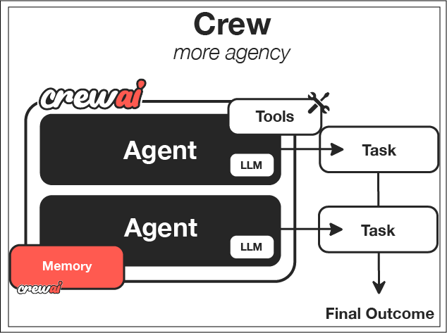

# 🎯 Session 4: CrewAI Fundamentals - Essential Team Orchestration Concepts

> **🎯 OBSERVER PATH CONTENT**
> Prerequisites: Basic understanding of AI agents
> Time Investment: 45-60 minutes
> Outcome: Understand core CrewAI principles and basic team orchestration

## Learning Outcomes

After completing this module, you will understand:

- The fundamental differences between individual agents and team-based systems  
- Core CrewAI components: Agents, Tasks, and Crews  
- Basic collaboration patterns: Sequential and Hierarchical processing  
- Role specialization principles for data processing teams  
- Essential configuration patterns for production readiness  

## Team Architecture Foundations

### Basic CrewAI Setup

CrewAI revolutionizes AI automation by modeling agent systems like proven data engineering organizational structures, solving the fundamental challenge of how to coordinate multiple AI capabilities effectively across complex data processing pipelines.



First, we import the necessary CrewAI components - the building blocks for intelligent team coordination in data processing environments:

```python
from crewai import Agent, Task, Crew, Process
from crewai_tools import SerperDevTool, FileReadTool
```

Next, we define our data research specialist with comprehensive search capabilities - like hiring a skilled data analyst who knows exactly how to find relevant datasets, schemas, and processing patterns:

```python
# Data research specialist with search tools
researcher = Agent(
    role='Data Research Specialist',
    goal='Gather comprehensive information on data sources and schemas',
    backstory='Expert data analyst with extensive knowledge of data discovery',
    tools=[SerperDevTool()],
    verbose=True
)
```

This creates a specialized agent focused on data discovery and research activities.

Then we create a data pipeline architect for designing processing workflows - a specialist who transforms requirements into scalable, efficient data processing architectures:

```python
# Data pipeline design specialist
pipeline_architect = Agent(
    role='Data Pipeline Architect',
    goal='Design efficient, scalable data processing workflows',
    backstory='Senior data engineer skilled in distributed systems',
    verbose=True
)
```

The pipeline architect focuses on architectural decisions and workflow design.

Finally, we add a data quality engineer for validation and monitoring - the quality assurance expert who ensures data integrity and processing excellence:

```python
# Data quality assurance specialist
quality_engineer = Agent(
    role='Data Quality Engineer',
    goal='Validate data quality and ensure processing reliability',
    backstory='Experienced data quality specialist with validation expertise',
    verbose=True
)
```

### Core Concepts

These principles mirror what makes successful data engineering teams effective:

1. **Role Specialization**: Each agent has specific expertise and responsibilities - like having dedicated data quality engineers, pipeline architects, and ML specialists rather than trying to make everyone handle every aspect of data processing  

2. **Goal-Oriented Design**: Agents work toward clear, defined objectives - ensuring everyone understands their contribution to overall data pipeline success and business value  

3. **Collaborative Workflow**: Agents hand off work in structured sequences - creating smooth, efficient collaboration patterns that mirror successful data engineering team structures  

### Agent Role Definitions

Creating effective agent roles that bring specialized expertise to your data processing teams:

```python
# Detailed role configuration for data processing
data_analyst = Agent(
    role='Senior Data Analyst',
    goal='Analyze large-scale datasets and extract meaningful insights',
    backstory='''You are a senior data analyst with 10 years of experience
                 in statistical analysis, data visualization, and working with
                 petabyte-scale datasets in distributed cloud environments.''',
    tools=[],  # Add analysis tools as needed
    allow_delegation=True,  # Can delegate tasks to other agents
    verbose=True,
    max_iter=3,  # Maximum iterations for complex tasks
    memory=True  # Remember previous interactions and data context
)
```

Key agent configuration options:

- **role**: Defines the agent's professional identity and specialization  
- **goal**: Clear objective that guides decision-making  
- **backstory**: Rich context that shapes agent behavior and expertise  
- **tools**: Specific capabilities and integrations available to the agent  
- **allow_delegation**: Enables hierarchical task distribution  
- **memory**: Maintains context across interactions for better collaboration  

### Collaboration Patterns

How agents work together effectively, mirroring the most successful data engineering team structures and workflow orchestration patterns.

#### Sequential Collaboration

First, let's see the sequential collaboration pattern - like a data pipeline where each stage processes and enriches the data before passing it to the next specialist:

```python
# Sequential collaboration - agents work one after another
def create_data_processing_team():
    return Crew(
        agents=[researcher, pipeline_architect, quality_engineer],
        process=Process.sequential,  # One agent at a time
        verbose=True,
        memory=True  # Maintain context across processing stages
    )
```

In sequential processing:  
- Each agent completes their work before the next agent begins  
- Results flow naturally from one specialist to the next  
- Context and knowledge accumulate through the processing chain  
- Works well for linear workflows with clear dependencies  

#### Hierarchical Pattern

Now, here's the hierarchical pattern with a data engineering manager - like having a technical lead who coordinates specialists across different data processing domains and makes high-level architectural decisions:

```python
# Hierarchical pattern requires a data engineering manager
def create_hierarchical_data_team():
    data_eng_manager = Agent(
        role='Data Engineering Manager',
        goal='Coordinate data processing activities and ensure quality',
        backstory='Experienced data engineering manager with deep technical background',
        allow_delegation=True
    )

    return Crew(
        agents=[data_eng_manager, researcher, pipeline_architect, quality_engineer],
        process=Process.hierarchical,
        manager_llm='gpt-4',  # Manager uses more capable model
        verbose=True
    )
```

In hierarchical processing:  
- A manager agent coordinates and delegates tasks  
- Specialized agents focus on their domain expertise  
- Clear authority structure for complex decision-making  
- Better suited for dynamic task allocation and oversight  

### Task Creation Fundamentals

Creating clear, actionable tasks that enable effective collaboration between data processing team members:

```python
def create_basic_data_task(topic: str):
    """Create a fundamental data processing task"""

    data_discovery_task = Task(
        description=f'''Research and analyze data sources for: {topic}

        Requirements:
        1. Identify relevant data sources with schema information
        2. Analyze data quality patterns and processing challenges
        3. Document data relationships and integration opportunities
        4. Provide data source citations and access methods

        Output: Comprehensive data discovery report''',
        agent=researcher,
        expected_output='Detailed data source analysis with specifications'
    )

    return data_discovery_task
```

Essential task components:

- **description**: Clear, detailed instructions with specific requirements  
- **agent**: The specialized agent responsible for execution  
- **expected_output**: Precise specification of deliverable format and content  
- **context**: References to previous tasks or shared information (when needed)  

### Basic Crew Assembly

Putting the team together into a functioning, coordinated unit:

```python
def assemble_basic_crew(data_topic: str):
    """Assemble a basic data processing crew"""

    # Get agents and tasks
    agents = [researcher, pipeline_architect, quality_engineer]
    task = create_basic_data_task(data_topic)

    # Create the crew with basic optimization
    crew = Crew(
        agents=agents,
        tasks=[task],
        process=Process.sequential,
        verbose=True,
        memory=True,  # Essential for maintaining data context
        cache=True,   # Cache results for efficiency
    )

    return crew
```

Essential crew configuration:

- **agents**: List of specialized team members  
- **tasks**: Ordered list of work to be completed  
- **process**: Coordination pattern (sequential or hierarchical)  
- **memory**: Enables context sharing across agents  
- **cache**: Improves performance by storing intermediate results  

### Quick Start Usage

Here's how to use your assembled crew for data processing:

```python
# Usage example
dataset_topic = "Customer behavior analytics for e-commerce"
data_crew = assemble_basic_crew(dataset_topic)
result = data_crew.kickoff()

print("Team collaboration result:")
print(result)
```

This creates a functioning data processing team that can tackle complex analytics challenges through specialized collaboration.

## Core Principles Summary

The fundamental concepts that make CrewAI effective for data processing:

1. **Specialization Over Generalization**: Create agents with deep domain expertise rather than trying to build universal processors  

2. **Clear Role Definition**: Each agent should have a distinct professional identity with specific goals and capabilities  

3. **Structured Collaboration**: Use sequential or hierarchical patterns to create predictable, efficient workflows  

4. **Context Preservation**: Enable memory and caching to maintain knowledge across team interactions  

5. **Production Readiness**: Configure crews with appropriate timeouts, error handling, and monitoring capabilities  

## Getting Started Checklist

Before building your first CrewAI team:

- [ ] Define clear roles for each team member with specific expertise  
- [ ] Identify the collaboration pattern that fits your workflow  
- [ ] Create detailed task descriptions with measurable outcomes  
- [ ] Configure appropriate tools and capabilities for each agent  
- [ ] Enable memory and caching for optimal performance  
- [ ] Plan for monitoring and error handling in production environments  

## Next Steps

Once you understand these fundamentals, you're ready to move to the next level:

- **📝 [Team Building Practice](Session4_Team_Building_Practice.md)** - Hands-on crew creation and task orchestration  
- **⚙️ [Advanced Orchestration](Session4_Advanced_Orchestration.md)** - Complex coordination patterns and performance optimization

---

## 🧭 Navigation

**Previous:** [Session 3 - Advanced Patterns →](Session3_*.md)  
**Next:** [Session 5 - Type-Safe Development →](Session5_*.md)

---
