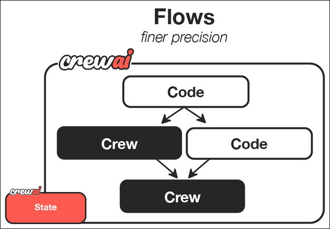

# Session 4: CrewAI Team Orchestration

## 🎯 Learning Navigation Hub
**Total Time Investment**: 75 minutes (Core) + 30-85 minutes (Optional)
**Your Learning Path**: Choose your engagement level

### Quick Start Guide

- **👀 Observer (45 min)**: Read concepts + examine team patterns
- **🙋‍♂️ Participant (75 min)**: Follow exercises + build crews
- **🛠️ Implementer (110 min)**: Create custom teams + explore advanced flows

---

## 📋 SESSION OVERVIEW DASHBOARD

### Core Learning Track (75 minutes) - REQUIRED
| Section | Concept Load | Time | Skills |
|---------|--------------|------|--------|
| 🏗️ CrewAI Architecture | 3 concepts | 20 min | Understanding |
| 🤖 Building Your First Crew | 4 concepts | 25 min | Implementation |
| 🔄 Task Orchestration | 3 concepts | 20 min | Application |
| ⚡ Performance & Optimization | 3 concepts | 10 min | Optimization |

### Optional Deep Dive Modules (Choose Your Adventure)

- 🔬 **[Module A: Advanced CrewAI Flows](Session4_ModuleA_Advanced_CrewAI_Flows.md)** (45 min) - Sophisticated workflow patterns & dynamic team formation
- 🏭 **[Module B: Enterprise Team Patterns](Session4_ModuleB_Enterprise_Team_Patterns.md)** (40 min) - Production team architectures & custom tools

**🗂️ Code Files**: All examples use files in [`src/session4/`](https://github.com/fwornle/agentic-ai-nano/tree/main/docs-content/01_frameworks/src/session4)  
**🚀 Quick Start**: Run `cd src/session4 && python crewai_basics.py` to see CrewAI teams in action

---

## 🧭 CORE SECTION (Required - 75 minutes)

### Part 1: CrewAI Architecture & Philosophy (20 minutes)
**Cognitive Load**: 3 new concepts
**Learning Mode**: Conceptual Understanding

#### Team-Based Approach (8 minutes)
CrewAI models agent systems like human teams with specialized roles:


🗂️ **File**: [`src/session4/crewai_basics.py`](https://github.com/fwornle/agentic-ai-nano/blob/main/docs-content/01_frameworks/src/session4/crewai_basics.py) - Core team setup

First, we import the necessary CrewAI components:

```python
from crewai import Agent, Task, Crew, Process
from crewai_tools import SerperDevTool, FileReadTool
```

Next, we define our research specialist with web search capabilities:

```python
# Research specialist with search tools
researcher = Agent(
    role='Research Specialist',
    goal='Gather comprehensive information on assigned topics',
    backstory='Expert researcher with access to web search capabilities',
    tools=[SerperDevTool()],
    verbose=True
)
```

Then we create a content writer for generating engaging materials:

```python
# Content creation specialist
writer = Agent(
    role='Content Writer', 
    goal='Create engaging, well-structured content',
    backstory='Professional writer skilled in various content formats',
    verbose=True
)
```

Finally, we add an editor for quality assurance:

```python
# Quality assurance editor
editor = Agent(
    role='Content Editor',
    goal='Review and refine content for quality and accuracy',
    backstory='Experienced editor with attention to detail',
    verbose=True
)
```

**Key Concepts:**

1. **Role Specialization**: Each agent has specific expertise and responsibilities
2. **Goal-Oriented Design**: Agents work toward clear, defined objectives
3. **Collaborative Workflow**: Agents hand off work in structured sequences

#### Role Definitions (7 minutes)
Creating effective agent roles:

```python
# Detailed role configuration
data_analyst = Agent(
    role='Data Analyst',
    goal='Analyze data and extract meaningful insights',
    backstory='''You are a senior data analyst with 10 years of experience 
                 in statistical analysis and data visualization. You excel at 
                 finding patterns and trends in complex datasets.''',
    tools=[],  # Add analysis tools as needed
    allow_delegation=True,  # Can delegate tasks to other agents
    verbose=True,
    max_iter=3,  # Maximum iterations for complex tasks
    memory=True  # Remember previous interactions
)
```

#### Collaboration Patterns (5 minutes)
How agents work together effectively:

First, let's see the sequential collaboration pattern:

```python
# Sequential collaboration - agents work one after another
def create_content_team():
    return Crew(
        agents=[researcher, writer, editor],
        process=Process.sequential,  # One agent at a time
        verbose=True,
        memory=True
    )
```

Now, here's the hierarchical pattern with a manager:

```python
# Hierarchical pattern requires a manager agent
def create_hierarchical_team():
    manager = Agent(
        role='Team Manager',
        goal='Coordinate team activities and ensure quality output',
        backstory='Experienced project manager with technical background',
        allow_delegation=True
    )
```

Finally, we assemble the hierarchical crew with the manager in control:

```python
    return Crew(
        agents=[manager, researcher, writer, editor],
        process=Process.hierarchical,
        manager_llm='gpt-4',  # Manager uses more capable model
        verbose=True
    )
```

---

### Part 2: Building Your First Crew (25 minutes)
**Cognitive Load**: 4 new concepts
**Learning Mode**: Hands-on Implementation

#### Agent Role Creation (8 minutes)
🗂️ **File**: [`src/session4/multi_agent_crew.py`](https://github.com/fwornle/agentic-ai-nano/blob/main/docs-content/01_frameworks/src/session4/multi_agent_crew.py) - Complete team implementations

Let's start by defining our research team with three specialized agents:

```python
def create_research_crew():
    """Create a research-focused crew"""
    
    # Primary researcher - leads the research effort
    lead_researcher = Agent(
        role='Lead Researcher',
        goal='Conduct thorough research and coordinate findings',
        backstory='''Senior researcher with expertise in multiple domains.
                     Known for comprehensive analysis and clear communication.''',
        tools=[SerperDevTool(), FileReadTool()],
        allow_delegation=True,
        verbose=True
    )
```

Next, we add a specialized fact-checker to ensure accuracy:

```python
    # Specialized fact-checker for verification
    fact_checker = Agent(
        role='Fact Checker',
        goal='Verify accuracy of research findings',
        backstory='''Detail-oriented professional specializing in fact verification
                     and source validation.''',
        tools=[SerperDevTool()],
        verbose=True
    )
```

Finally, we include a synthesizer to combine findings into coherent insights:

```python
    # Report synthesizer for final output
    synthesizer = Agent(
        role='Research Synthesizer', 
        goal='Combine research into coherent, actionable insights',
        backstory='''Expert at connecting disparate information sources and
                     creating comprehensive reports.''',
        verbose=True
    )
    
    return [lead_researcher, fact_checker, synthesizer]
```

#### Task Definition (7 minutes)
Creating clear, actionable tasks:

Now we define the tasks for our research crew. First, the primary research task:

```python
def create_research_tasks(topic: str):
    """Define tasks for research crew"""
    
    # Primary research task
    research_task = Task(
        description=f'''Research the topic: {topic}
        
        Requirements:
        1. Find at least 5 credible sources
        2. Identify key trends and patterns
        3. Note any controversial aspects
        4. Provide source citations
        
        Output: Structured research findings with sources''',
        agent=lead_researcher,
        expected_output='Comprehensive research report with citations'
    )
```

Next, we define the fact verification task that builds on the research:

```python
    # Fact verification task builds on research findings
    verification_task = Task(
        description=f'''Verify the accuracy of research findings on: {topic}
        
        Requirements:
        1. Cross-check major claims against multiple sources
        2. Flag any questionable information
        3. Assess source credibility
        4. Rate overall research quality (1-10)
        
        Output: Fact-checking report with accuracy ratings''',
        agent=fact_checker,
        expected_output='Verification report with accuracy assessment'
    )
```

Finally, the synthesis task combines everything into a final report:

```python
    # Synthesis task combines verified research into final output
    synthesis_task = Task(
        description=f'''Synthesize research and verification into final report
        
        Requirements:
        1. Combine verified research findings
        2. Highlight key insights and implications
        3. Identify areas for further investigation
        4. Create executive summary
        
        Output: Final research report with recommendations''',
        agent=synthesizer,
        expected_output='Executive summary and detailed findings report'
    )
    
    return [research_task, verification_task, synthesis_task]
```

#### Crew Assembly (5 minutes)
Putting the team together:

Now we assemble everything into a functioning crew:

```python
def assemble_research_crew(topic: str):
    """Assemble and configure the complete crew"""
    
    # Get agents and tasks
    agents = create_research_crew()
    tasks = create_research_tasks(topic)
```

Next, we create the crew with performance optimizations:

```python
    # Create the crew with optimization settings
    crew = Crew(
        agents=agents,
        tasks=tasks,
        process=Process.sequential,
        verbose=True,
        memory=True,
        cache=True,  # Cache results for efficiency
        max_rpm=10,  # Rate limiting
        share_crew=False  # Privacy setting
    )
    
    return crew
```

Finally, here's how to use the assembled crew:

```python
# Usage example
topic = "Impact of AI on software development"
research_crew = assemble_research_crew(topic)
result = research_crew.kickoff()
```

#### Basic Testing (5 minutes)
Validating crew functionality:

🗂️ **File**: [`src/session4/test_crews.py`](https://github.com/fwornle/agentic-ai-nano/blob/main/docs-content/01_frameworks/src/session4/test_crews.py) - Testing framework

```python
def test_crew_creation():
    """Test that crews are created properly"""
    crew = assemble_research_crew("test topic")
    
    assert len(crew.agents) == 3
    assert len(crew.tasks) == 3
    assert crew.process == Process.sequential
    
    print("✅ Crew creation test passed!")

def test_crew_execution():
    """Test basic crew execution"""
    crew = assemble_research_crew("Python programming")
    
    # This would normally run the actual crew
    # For testing, we just verify structure
    assert crew is not None
    assert hasattr(crew, 'kickoff')
    
    print("✅ Crew execution test passed!")
```

---

### Part 3: Task Orchestration & Delegation (20 minutes)
**Cognitive Load**: 3 new concepts
**Learning Mode**: Application & Coordination

#### Workflow Coordination (8 minutes)
Managing task dependencies and handoffs:



🗂️ **File**: [`src/session4/hierarchical_crew.py`](https://github.com/fwornle/agentic-ai-nano/blob/main/docs-content/01_frameworks/src/session4/hierarchical_crew.py) - Advanced orchestration

Let's create a hierarchical workflow starting with the team manager:

```python
def create_hierarchical_workflow():
    """Create a hierarchical crew with delegation"""
    
    # Team manager with delegation capabilities
    project_manager = Agent(
        role='Project Manager',
        goal='Coordinate team activities and ensure deliverable quality',
        backstory='''Experienced project manager with technical background.
                     Expert at resource allocation and timeline management.''',
        allow_delegation=True,
        verbose=True
    )
```

Now we add the specialized development team members:

```python
    # Backend specialist
    backend_dev = Agent(
        role='Backend Developer',
        goal='Design and implement server-side functionality',
        backstory='Senior backend developer specializing in scalable systems.',
        verbose=True
    )
    
    # Frontend specialist
    frontend_dev = Agent(
        role='Frontend Developer', 
        goal='Create user interfaces and user experiences',
        backstory='UI/UX focused developer with modern framework expertise.',
        verbose=True
    )
```

Next, we define the complex project task that requires coordination:

```python
    # Complex project task requiring delegation
    project_task = Task(
        description='''Plan and coordinate development of a web application
        
        Requirements:
        1. Define system architecture
        2. Assign development tasks
        3. Coordinate between frontend and backend
        4. Ensure integration testing
        5. Prepare deployment plan
        
        Use delegation to assign specific tasks to team members.''',
        agent=project_manager,
        expected_output='Complete project plan with task assignments'
    )
```

Finally, we assemble the hierarchical crew with the manager in control:

```python
    return Crew(
        agents=[project_manager, backend_dev, frontend_dev],
        tasks=[project_task],
        process=Process.hierarchical,
        manager_llm='gpt-4',
        verbose=True
    )
```

#### Result Aggregation (7 minutes)
Collecting and combining agent outputs:

First, let's create a function to process and analyze crew results:

```python
def process_crew_results(result):
    """Process and analyze crew results"""
    
    # Extract key information
    summary = {
        'total_tasks': len(result.tasks_output) if hasattr(result, 'tasks_output') else 0,
        'completion_status': 'completed' if result else 'failed',
        'output_length': len(str(result)),
        'key_insights': []
    }
```

Next, we analyze the result content for insights:

```python
    # Analyze result content for key insights
    result_text = str(result)
    if 'recommendation' in result_text.lower():
        summary['key_insights'].append('Contains recommendations')
    if 'analysis' in result_text.lower():
        summary['key_insights'].append('Includes analysis')
        
    return summary
```

Here's how to use the result processing function:

```python
# Usage example
crew = create_hierarchical_workflow()
result = crew.kickoff()
analysis = process_crew_results(result)
print(f"Result Analysis: {analysis}")
```

#### Communication Patterns (5 minutes)
How agents share information:

First, let's create a crew with enhanced memory capabilities:

```python
# Memory-enabled communication
def create_memory_enabled_crew():
    """Crew with enhanced memory and communication"""
    
    crew = Crew(
        agents=agents,
        tasks=tasks,
        process=Process.sequential,
        memory=True,  # Enable memory
        verbose=True,
        embedder={
            "provider": "openai",
            "config": {"model": "text-embedding-3-small"}
        }
    )
    
    return crew
```

Now, here's how to create tasks that share information across the crew:

```python
# Cross-task information sharing
task_with_context = Task(
    description='''Build upon previous research findings.
    
    Context: Use information gathered by the research team.
    Review their findings and expand upon the most promising areas.
    
    Requirements:
    1. Reference previous research explicitly
    2. Build upon existing findings
    3. Identify gaps or areas for deeper investigation''',
    context=[previous_research_task],  # Reference to earlier task
    agent=analysis_agent
)
```

---

### Part 4: Performance & Optimization (10 minutes)
**Cognitive Load**: 3 new concepts
**Learning Mode**: Optimization

#### 5.76x Performance Improvements (4 minutes)
CrewAI's performance enhancements:

🗂️ **File**: [`src/session4/performance_optimization.py`](https://github.com/fwornle/agentic-ai-nano/blob/main/docs-content/01_frameworks/src/session4/performance_optimization.py) - Performance patterns

Here's how to create a performance-optimized crew:

```python
def create_optimized_crew():
    """Create performance-optimized crew"""
    
    crew = Crew(
        agents=agents,
        tasks=tasks,
        process=Process.sequential,
        
        # Performance optimizations
        cache=True,           # Cache intermediate results
        max_rpm=30,          # Increase rate limit
        memory=True,         # Enable memory for context
```

Add efficient embeddings and resource management:

```python
        embedder={           # Efficient embeddings
            "provider": "openai",
            "config": {"model": "text-embedding-3-small"}
        },
        
        # Resource management
        max_execution_time=300,  # 5 minute timeout
        step_callback=lambda step: print(f"Step completed: {step}")
    )
    
    return crew
```

#### Basic Monitoring (3 minutes)
Tracking crew performance:

```python
import time

def monitor_crew_execution(crew, task_description):
    """Monitor crew execution with basic metrics"""
    
    start_time = time.time()
    
    print(f"🚀 Starting crew execution: {task_description}")
    result = crew.kickoff()
    
    end_time = time.time()
    execution_time = end_time - start_time
    
    print(f"⏱️ Execution time: {execution_time:.2f} seconds")
    print(f"📊 Result length: {len(str(result))} characters")
    print(f"✅ Crew execution completed")
    
    return result
```

#### Optimization Techniques (3 minutes)
Best practices for crew performance:

Here are the key performance optimization strategies for CrewAI:

```python
# Performance best practices organized by category
optimization_tips = {
    'agent_design': [
        'Use specific, focused roles',
        'Provide clear backstories and goals',
        'Limit tool sets to essentials'
    ],
    'task_design': [
        'Write clear, specific descriptions',
        'Set realistic expectations',
        'Use context to connect related tasks'
    ],
    'crew_configuration': [
        'Enable caching for repeated operations',
        'Use memory for context continuity',
        'Set appropriate rate limits'
    ]
}
```

---

## ✅ Core Section Validation (5 minutes)

### Quick Implementation Exercise
🗂️ **Exercise Files**: 
- [`src/session4/crewai_basics.py`](https://github.com/fwornle/agentic-ai-nano/blob/main/docs-content/01_frameworks/src/session4/crewai_basics.py) - Basic crew setup
- [`src/session4/multi_agent_crew.py`](https://github.com/fwornle/agentic-ai-nano/blob/main/docs-content/01_frameworks/src/session4/multi_agent_crew.py) - Complete team example

```bash
# Try the examples:
cd src/session4
python crewai_basics.py              # Basic crew functionality
python multi_agent_crew.py           # Multi-agent coordination
python hierarchical_crew.py          # Team management
```

### Self-Assessment Checklist

- [ ] I understand CrewAI's team-based approach
- [ ] I can create agents with specialized roles
- [ ] I can design tasks and coordinate workflows
- [ ] I understand performance optimization techniques
- [ ] I'm ready for advanced modules or next session

**Next Session Prerequisites**: ✅ Core Section Complete  
**Ready for**: Session 6: Agent Communication Protocols

---

### 🧭 **Choose Your Next Path:**

- **[🔬 Module A: Advanced CrewAI Flows →](Session4_ModuleA_Advanced_CrewAI_Flows.md)** - Sophisticated workflow patterns & dynamic team formation
- **[🏭 Module B: Enterprise Team Patterns →](Session4_ModuleB_Enterprise_Team_Patterns.md)** - Production team architectures & custom tools
- **[📝 Test Your Knowledge →](Session4_Test_Solutions.md)** - Comprehensive quiz
- **[📖 Next Session: Agent Communication Protocols →](Session6_Agent_Communication_Protocols.md)** - Message passing and coordination

### 🎆 Complete Learning Path Options
**Sequential Learning**: Core → Module A → Module B  
**Production Focus**: Core → Module B  
**Advanced Flows**: Core → Module A

---

## 📝 Multiple Choice Test - Session 4 (15 minutes)

Test your understanding of CrewAI team orchestration and collaborative patterns.

**Question 1:** What is CrewAI's primary strength compared to other agent frameworks?  
A) Fastest execution speed  
B) Team-based collaboration with role specialization  
C) Lowest resource usage  
D) Easiest deployment  

**Question 2:** In CrewAI, what defines an agent's behavior and capabilities?  
A) Tools only  
B) Role, goal, and backstory  
C) Memory capacity  
D) Processing speed  

**Question 3:** What is the purpose of the `expected_output` parameter in CrewAI tasks?  
A) To validate agent responses  
B) To guide task execution and set clear expectations  
C) To measure performance  
D) To handle errors  

**Question 4:** Which CrewAI process type offers the most control over task execution order?  
A) Sequential  
B) Hierarchical  
C) Parallel  
D) Random  

**Question 5:** What makes CrewAI Flows different from regular CrewAI execution?  
A) They use different agents  
B) They provide structured workflow control with conditional logic  
C) They run faster  
D) They require fewer resources  

**Question 6:** In hierarchical process, what role does the manager agent play?  
A) Executes all tasks  
B) Delegates tasks and coordinates team activities  
C) Stores team memory  
D) Handles user interface  

**Question 7:** What is the main advantage of using custom tools in CrewAI?  
A) Better performance  
B) Extending agent capabilities for specific business needs  
C) Lower costs  
D) Simpler implementation  

**Question 8:** How does CrewAI handle memory sharing between agents?  
A) Global variables  
B) Shared crew memory and individual agent memories  
C) Database storage  
D) File-based sharing  

**Question 9:** What is the purpose of the backstory in a CrewAI agent?  
A) Performance tracking  
B) Providing context and personality for better role performance  
C) Error handling  
D) Task scheduling  

**Question 10:** Which feature makes CrewAI particularly suitable for business workflows?  
A) Technical complexity  
B) Role-based specialization mimicking human team structures  
C) Programming language flexibility  
D) Cloud integration  

---

[**🗂️ View Test Solutions →**](Session4_Test_Solutions.md)

---

## 🧭 Navigation

**Previous:** [Session 3 - LangGraph Multi-Agent Workflows](Session3_LangGraph_Multi_Agent_Workflows.md)

**Optional Deep Dive Modules:**

- 🔬 **[Module A: Advanced CrewAI Flows](Session4_ModuleA_Advanced_CrewAI_Flows.md)** - Advanced workflow patterns
- 🏭 **[Module B: Enterprise Team Patterns](Session4_ModuleB_Enterprise_Team_Patterns.md)** - Production team coordination

**Next:** [Session 5 - PydanticAI Type-Safe Agents →](Session5_PydanticAI_Type_Safe_Agents.md)