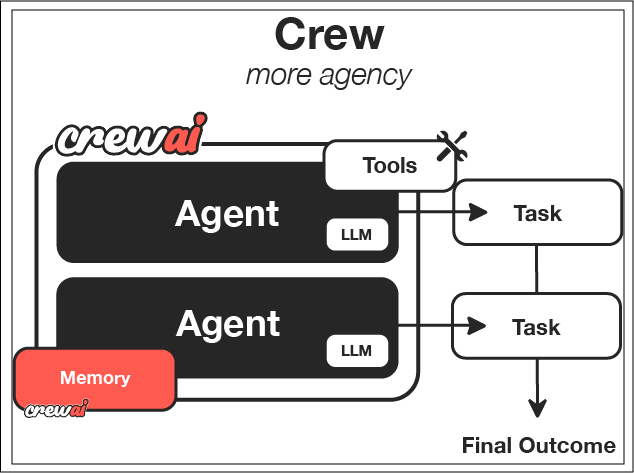

# Session 4: CrewAI Team Orchestration - Coordinated Data Processing Teams

Picture the most effective data engineering team you've worked with - maybe it was a team processing petabyte-scale datasets with incredible efficiency, or a distributed processing crew that coordinated flawlessly across multiple cloud regions. What made them special wasn't individual expertise, but how they worked together: the data validator who ensured quality across massive pipelines, the orchestrator who managed complex ETL dependencies, and the ML engineer who optimized model training workflows on distributed clusters.

Now imagine building that same coordination with AI agents - each with specialized data processing expertise, clear responsibilities, and natural collaboration patterns. This is exactly what CrewAI enables: transforming isolated data processing capabilities into coordinated teams that work together like your best engineering collaborators ever did.

In this session, you'll learn to orchestrate AI agents that don't just execute data processing tasks, but truly collaborate to handle complex data engineering workflows requiring multiple types of expertise and deep domain knowledge.

## Learning Outcomes

- Design role-based multi-agent teams with defined responsibilities for data processing workflows
- Implement CrewAI workflows using sequential and hierarchical patterns for ETL orchestration
- Build agents with specialized capabilities and collaborative behaviors for data quality and analysis
- Orchestrate complex processes using task delegation and coordination across distributed data systems
- Optimize crew performance with caching and monitoring for production data pipeline environments

## The Team Revolution: From Individual Processors to Collaborative Intelligence

CrewAI enables multi-agent collaboration through role-based team structures, solving one of the biggest limitations of single-agent systems in data engineering. Unlike individual agents working in isolation, CrewAI agents work together with defined roles, goals, and backstories to create natural team dynamics that mirror how successful data engineering organizations actually operate.

Think of it as the difference between having one monolithic data processor trying to handle ingestion, transformation, validation, and analysis versus assembling a specialized processing team where each agent brings deep domain expertise. This approach mirrors how the most effective distributed data processing systems actually work - through multiple specialized processors working in coordination, much like how Spark or Kafka teams operate across cloud infrastructure.

**Key Concepts**:

- Role specialization with clear responsibilities - like having dedicated data quality experts, pipeline architects, and ML specialists rather than generalists
- Sequential and hierarchical workflow patterns - structured collaboration that scales from terabytes to petabytes
- Task delegation and result aggregation - intelligent work distribution across data processing stages
- Memory sharing and communication between agents - persistent team knowledge about data schemas, quality rules, and processing patterns
- Performance optimization through caching and rate limiting - production-ready efficiency for enterprise data workflows

**Code Files**: Examples use files in `src/session4/`  
**Quick Start**: `cd src/session4 && python crewai_basics.py`

## Team Architecture Foundations

### Basic CrewAI Setup

CrewAI revolutionizes AI automation by modeling agent systems like proven data engineering organizational structures, solving the fundamental challenge of how to coordinate multiple AI capabilities effectively across complex data processing pipelines:



**File**: [`src/session4/crewai_basics.py`](https://github.com/fwornle/agentic-ai-nano/blob/main/docs-content/01_frameworks/src/session4/crewai_basics.py) - Core team setup

First, we import the necessary CrewAI components - the building blocks for intelligent team coordination in data processing environments:

```python
from crewai import Agent, Task, Crew, Process
from crewai_tools import SerperDevTool, FileReadTool
```

Next, we define our data research specialist with comprehensive search capabilities - like hiring a skilled data analyst who knows exactly how to find relevant datasets, schemas, and processing patterns:

```python

# Data research specialist with search tools

researcher = Agent(
    role='Data Research Specialist',
    goal='Gather comprehensive information on data sources, schemas, and processing requirements',
    backstory='Expert data analyst with extensive knowledge of data discovery and schema analysis',
    tools=[SerperDevTool()],
    verbose=True
)
```

Then we create a data pipeline architect for designing processing workflows - a specialist who transforms requirements into scalable, efficient data processing architectures:

```python

# Data pipeline design specialist

pipeline_architect = Agent(
    role='Data Pipeline Architect', 
    goal='Design efficient, scalable data processing workflows and architectures',
    backstory='Senior data engineer skilled in distributed systems and pipeline optimization',
    verbose=True
)
```

Finally, we add a data quality engineer for validation and monitoring - the quality assurance expert who ensures data integrity and processing excellence:

```python

# Data quality assurance specialist

quality_engineer = Agent(
    role='Data Quality Engineer',
    goal='Validate data quality, monitor pipeline performance, and ensure processing reliability',
    backstory='Experienced data quality specialist with deep expertise in validation frameworks',
    verbose=True
)
```

### Key Concepts

These principles mirror what makes successful data engineering teams effective:

1. **Role Specialization**: Each agent has specific expertise and responsibilities - like having dedicated data quality engineers, pipeline architects, and ML specialists rather than trying to make everyone handle every aspect of data processing
2. **Goal-Oriented Design**: Agents work toward clear, defined objectives - ensuring everyone understands their contribution to overall data pipeline success and business value
3. **Collaborative Workflow**: Agents hand off work in structured sequences - creating smooth, efficient collaboration patterns that mirror successful data engineering team structures

### Role Definitions

Creating effective agent roles that bring specialized expertise to your data processing teams:

```python

# Detailed role configuration for data processing

data_analyst = Agent(
    role='Senior Data Analyst',
    goal='Analyze large-scale datasets and extract meaningful insights for business intelligence',
    backstory='''You are a senior data analyst with 10 years of experience 
                 in statistical analysis, data visualization, and working with 
                 petabyte-scale datasets. You excel at finding patterns and trends 
                 in complex data across distributed cloud environments.''',
    tools=[],  # Add analysis tools as needed
    allow_delegation=True,  # Can delegate tasks to other agents
    verbose=True,
    max_iter=3,  # Maximum iterations for complex tasks
    memory=True  # Remember previous interactions and data context
)
```

### Collaboration Patterns

How agents work together effectively, mirroring the most successful data engineering team structures and workflow orchestration patterns:

First, let's see the sequential collaboration pattern - like a data pipeline where each stage processes and enriches the data before passing it to the next specialist:

```python

# Sequential collaboration - agents work one after another like ETL stages

def create_data_processing_team():
    return Crew(
        agents=[researcher, pipeline_architect, quality_engineer],
        process=Process.sequential,  # One agent at a time, like pipeline stages
        verbose=True,
        memory=True  # Maintain context across processing stages
    )
```

Now, here's the hierarchical pattern with a data engineering manager - like having a technical lead who coordinates specialists across different data processing domains and makes high-level architectural decisions:

```python

# Hierarchical pattern requires a data engineering manager

def create_hierarchical_data_team():
    data_eng_manager = Agent(
        role='Data Engineering Manager',
        goal='Coordinate data processing activities and ensure pipeline quality and performance',
        backstory='Experienced data engineering manager with deep technical background in distributed systems',
        allow_delegation=True
    )
```

Finally, we assemble the hierarchical crew with the manager in control - creating clear accountability and coordination for complex data processing workflows:

```python
    return Crew(
        agents=[data_eng_manager, researcher, pipeline_architect, quality_engineer],
        process=Process.hierarchical,
        manager_llm='gpt-4',  # Manager uses more capable model for complex decisions
        verbose=True
    )
```

---

## Building Your First Crew - Creating Specialized Data Processing Teams

Moving from individual agents to cohesive teams that tackle complex, multi-faceted data engineering problems requiring different types of expertise across the full data lifecycle.

### Agent Role Creation

**File**: [`src/session4/multi_agent_crew.py`](https://github.com/fwornle/agentic-ai-nano/blob/main/docs-content/01_frameworks/src/session4/multi_agent_crew.py) - Complete team implementations

Let's start by defining our data discovery team with three specialized agents - each bringing unique capabilities to the collaborative data exploration and analysis effort:

```python
def create_data_discovery_crew():
    """Create a data discovery and analysis crew"""
    
    # Lead data researcher - coordinates data discovery efforts
    lead_data_researcher = Agent(
        role='Lead Data Researcher',
        goal='Conduct thorough data source research and coordinate discovery findings',
        backstory='''Senior data researcher with expertise in multiple data domains
                     and extensive experience with data cataloging and schema analysis.
                     Known for comprehensive data discovery and clear documentation.''',
        tools=[SerperDevTool(), FileReadTool()],
        allow_delegation=True,
        verbose=True
    )
```

Next, we add a specialized data validator to ensure quality and consistency - like having a dedicated data quality engineer who catches schema issues, data anomalies, and integration problems before they impact downstream processing:

```python
    # Specialized data validator for quality assurance
    data_validator = Agent(
        role='Data Quality Validator',
        goal='Validate data quality, schema consistency, and processing integrity',
        backstory='''Detail-oriented data quality specialist focusing on data validation,
                     schema verification, and data integrity across large-scale processing pipelines.''',
        tools=[SerperDevTool()],
        verbose=True
    )
```

Finally, we include a data insights synthesizer to combine findings into actionable intelligence - the team member who sees the big picture across datasets and connects patterns for business value:

```python
    # Data insights synthesizer for comprehensive analysis
    insights_synthesizer = Agent(
        role='Data Insights Synthesizer', 
        goal='Combine data analysis into coherent, actionable business insights',
        backstory='''Expert at connecting disparate data sources and creating comprehensive
                     analytics reports with clear business value and recommendations.''',
        verbose=True
    )
    
    return [lead_data_researcher, data_validator, insights_synthesizer]
```

### Task Definition

Creating clear, actionable tasks that enable effective collaboration and hand-offs between data processing team members:

Now we define the tasks for our data discovery crew. First, the primary data discovery task that establishes the foundation for all downstream processing:

```python
def create_data_discovery_tasks(dataset_topic: str):
    """Define tasks for data discovery crew"""
    
    # Primary data discovery task
    discovery_task = Task(
        description=f'''Research and analyze data sources for: {dataset_topic}
        
        Requirements:
        1. Identify at least 5 relevant data sources with schema information
        2. Analyze data quality patterns and potential processing challenges
        3. Document data relationships and integration opportunities
        4. Assess data volume, velocity, and variety characteristics
        5. Provide data source citations and access methods
        
        Output: Comprehensive data discovery report with processing recommendations''',
        agent=lead_data_researcher,
        expected_output='Detailed data source analysis with technical specifications'
    )
```

Next, we define the data validation task that builds on the discovery findings - quality assurance that ensures reliable data processing foundations:

```python
    # Data validation task builds on discovery findings
    validation_task = Task(
        description=f'''Validate data quality and processing feasibility for: {dataset_topic}
        
        Requirements:
        1. Analyze data schema consistency across identified sources
        2. Identify potential data quality issues and processing bottlenecks
        3. Assess data integration complexity and transformation requirements
        4. Rate overall data processing feasibility (1-10 scale)
        5. Recommend data quality monitoring strategies
        
        Output: Data quality assessment report with processing risk analysis''',
        agent=data_validator,
        expected_output='Comprehensive data quality report with risk assessment'
    )
```

Finally, the insights synthesis task combines everything into actionable intelligence - the culmination that transforms individual technical findings into collective business value:

```python
    # Synthesis task combines validated data analysis into business insights
    synthesis_task = Task(
        description=f'''Synthesize data discovery and validation into business insights
        
        Requirements:
        1. Combine validated data findings into coherent analysis
        2. Highlight key business opportunities and data-driven insights
        3. Identify high-value analytics use cases and processing priorities
        4. Create executive summary with recommended data processing strategy
        5. Propose next steps for data pipeline implementation
        
        Output: Executive data strategy report with business recommendations''',
        agent=insights_synthesizer,
        expected_output='Strategic data analysis report with implementation roadmap'
    )
    
    return [discovery_task, validation_task, synthesis_task]
```

### Crew Assembly

Putting the team together into a functioning, coordinated unit optimized for data processing workflows:

Now we assemble everything into a functioning crew - like forming a cross-functional data engineering team with clear roles and objectives:

```python
def assemble_data_discovery_crew(dataset_topic: str):
    """Assemble and configure the complete data processing crew"""
    
    # Get agents and tasks
    agents = create_data_discovery_crew()
    tasks = create_data_discovery_tasks(dataset_topic)
```

Next, we create the crew with performance optimizations - ensuring efficient, reliable operation suitable for production data environments:

```python
    # Create the crew with optimization settings for data processing
    crew = Crew(
        agents=agents,
        tasks=tasks,
        process=Process.sequential,
        verbose=True,
        memory=True,  # Essential for maintaining data context
        cache=True,   # Cache results for efficiency in iterative analysis
        max_rpm=10,   # Rate limiting for stable processing
        share_crew=False  # Privacy setting for sensitive data work
    )
    
    return crew
```

Finally, here's how to use the assembled crew - launching your AI data processing team to tackle complex analytics challenges:

```python

# Usage example for data processing workflow

dataset_topic = "Customer behavior analytics for e-commerce platforms"
data_crew = assemble_data_discovery_crew(dataset_topic)
result = data_crew.kickoff()
```

### Basic Testing

Validating crew functionality to ensure your data processing team works as designed:

**File**: [`src/session4/test_crews.py`](https://github.com/fwornle/agentic-ai-nano/blob/main/docs-content/01_frameworks/src/session4/test_crews.py) - Testing framework

```python
def test_data_crew_creation():
    """Test that data processing crews are created properly"""
    crew = assemble_data_discovery_crew("test dataset analysis")
    
    assert len(crew.agents) == 3
    assert len(crew.tasks) == 3
    assert crew.process == Process.sequential
    assert crew.memory == True  # Essential for data context
    
    print("✅ Data crew creation test passed!")

def test_data_crew_execution():
    """Test basic data crew execution workflow"""
    crew = assemble_data_discovery_crew("Customer transaction data analysis")
    
    # This would normally run the actual crew
    # For testing, we just verify structure
    assert crew is not None
    assert hasattr(crew, 'kickoff')
    assert crew.cache == True  # Verify performance optimization
    
    print("✅ Data crew execution test passed!")
```

---

## Task Orchestration & Delegation - Advanced Team Coordination

Moving beyond simple sequential workflows to sophisticated coordination patterns that mirror how the most effective data engineering teams operate across distributed processing environments.

### Workflow Coordination

Managing task dependencies and handoffs like an expert data engineering project manager:


**File**: [`src/session4/hierarchical_crew.py`](https://github.com/fwornle/agentic-ai-nano/blob/main/docs-content/01_frameworks/src/session4/hierarchical_crew.py) - Advanced orchestration

Let's create a hierarchical workflow starting with the data engineering manager - the coordinator who ensures smooth operation across complex data processing pipelines:

```python
def create_hierarchical_data_workflow():
    """Create a hierarchical data processing crew with delegation"""
    
    # Data engineering manager with delegation capabilities
    data_eng_manager = Agent(
        role='Data Engineering Manager',
        goal='Coordinate data processing activities and ensure pipeline deliverable quality',
        backstory='''Experienced data engineering manager with deep technical background
                     in distributed systems, cloud architecture, and team coordination.
                     Expert at resource allocation and pipeline optimization.''',
        allow_delegation=True,
        verbose=True
    )
```

Now we add the specialized data engineering team members - the technical experts who handle specific aspects of data processing workflows:

```python
    # Backend data processing specialist
    data_pipeline_engineer = Agent(
        role='Data Pipeline Engineer',
        goal='Design and implement scalable data processing pipelines and ETL workflows',
        backstory='Senior data pipeline engineer specializing in distributed processing systems and cloud-native architectures.',
        verbose=True
    )
    
    # Data analytics specialist
    analytics_engineer = Agent(
        role='Analytics Engineer', 
        goal='Create data models, analytics workflows, and business intelligence solutions',
        backstory='Analytics-focused engineer with expertise in data modeling, SQL optimization, and BI frameworks.',
        verbose=True
    )
```

Next, we define the complex data project task that requires coordination - the kind of multi-faceted data engineering challenge that needs expert coordination across teams:

```python
    # Complex data project task requiring delegation
    data_project_task = Task(
        description='''Plan and coordinate development of a comprehensive data processing platform
        
        Requirements:
        1. Define data architecture and processing framework
        2. Assign pipeline development tasks across processing stages
        3. Coordinate between data ingestion, transformation, and analytics layers
        4. Ensure data quality validation and monitoring integration
        5. Prepare deployment and scaling strategy for cloud infrastructure
        
        Use delegation to assign specific tasks to specialized team members.''',
        agent=data_eng_manager,
        expected_output='Complete data platform plan with detailed task assignments and timeline'
    )
```

Finally, we assemble the hierarchical crew with the manager in control - creating clear authority and coordination structures for complex data engineering projects:

```python
    return Crew(
        agents=[data_eng_manager, data_pipeline_engineer, analytics_engineer],
        tasks=[data_project_task],
        process=Process.hierarchical,
        manager_llm='gpt-4',  # Manager uses advanced model for complex architectural decisions
        verbose=True
    )
```

### Result Aggregation

Collecting and combining agent outputs into coherent, actionable results for data processing workflows:

First, let's create a function to process and analyze crew results - turning individual data processing contributions into collective intelligence:

```python
def process_data_crew_results(result):
    """Process and analyze data processing crew results"""
    
    # Extract key information relevant to data processing workflows
    summary = {
        'total_tasks': len(result.tasks_output) if hasattr(result, 'tasks_output') else 0,
        'completion_status': 'completed' if result else 'failed',
        'output_length': len(str(result)),
        'data_insights': [],
        'processing_recommendations': []
    }
```

Next, we analyze the result content for data-specific insights - extracting valuable information from team collaboration focused on data engineering outcomes:

```python
    # Analyze result content for data processing insights
    result_text = str(result).lower()
    
    # Check for data-specific recommendations
    if 'pipeline' in result_text:
        summary['data_insights'].append('Contains pipeline architecture insights')
    if 'data quality' in result_text:
        summary['data_insights'].append('Includes data quality recommendations')
    if 'scalability' in result_text:
        summary['processing_recommendations'].append('Addresses scalability considerations')
    if 'performance' in result_text:
        summary['processing_recommendations'].append('Includes performance optimization strategies')
        
    return summary
```

Here's how to use the result processing function - transforming team output into actionable data processing insights:

```python

# Usage example for data processing results

crew = create_hierarchical_data_workflow()
result = crew.kickoff()
analysis = process_data_crew_results(result)
print(f"Data Processing Result Analysis: {analysis}")
```

### Communication Patterns

How agents share information and build on each other's work - creating true collaboration rather than just sequential processing for data engineering workflows:

First, let's create a crew with enhanced memory capabilities - enabling persistent team knowledge about data schemas, processing patterns, and quality requirements:

```python

# Memory-enabled communication for data processing context

def create_memory_enabled_data_crew():
    """Data processing crew with enhanced memory and communication"""
    
    crew = Crew(
        agents=agents,
        tasks=tasks,
        process=Process.sequential,
        memory=True,  # Essential for maintaining data processing context
        verbose=True,
        embedder={
            "provider": "openai",
            "config": {"model": "text-embedding-3-small"}
        }
    )
    
    return crew
```

Now, here's how to create tasks that share information across the crew - enabling each agent to build on previous work and maintain data processing context:

```python

# Cross-task information sharing for data processing workflows

task_with_data_context = Task(
    description='''Build upon previous data analysis findings and schema discoveries.
    
    Context: Use data schema information and quality metrics gathered by the data discovery team.
    Review their findings and expand upon the most promising data processing opportunities.
    
    Requirements:
    1. Reference previous data analysis results explicitly
    2. Build upon existing schema and quality findings
    3. Identify gaps in data coverage or processing capabilities
    4. Recommend next steps for data pipeline implementation''',
    context=[previous_data_discovery_task],  # Reference to earlier task
    agent=data_analysis_agent
)
```

---

## Performance & Optimization - Making Teams Work Efficiently

Ensuring your AI data processing teams operate with the efficiency and reliability needed for production data engineering environments handling petabyte-scale processing.

### Performance Optimizations

CrewAI's performance enhancements that make the difference between prototype and production-ready data processing systems:

**File**: [`src/session4/performance_optimization.py`](https://github.com/fwornle/agentic-ai-nano/blob/main/docs-content/01_frameworks/src/session4/performance_optimization.py) - Performance patterns

Here's how to create a performance-optimized crew - ensuring efficient resource usage and fast execution suitable for large-scale data processing workflows:

```python
def create_optimized_data_crew():
    """Create performance-optimized data processing crew"""
    
    crew = Crew(
        agents=agents,
        tasks=tasks,
        process=Process.sequential,
        
        # Performance optimizations for data processing
        cache=True,           # Cache intermediate results for iterative analysis
        max_rpm=30,          # Increase rate limit for faster processing
        memory=True,         # Enable memory for data context continuity
```

Add efficient embeddings and resource management - the technical optimizations that enable scalability for data processing workloads:

```python
        embedder={           # Efficient embeddings for data context
            "provider": "openai",
            "config": {"model": "text-embedding-3-small"}
        },
        
        # Resource management for data processing workflows
        max_execution_time=300,  # 5 minute timeout for complex analysis
        step_callback=lambda step: print(f"Data processing step completed: {step}")
    )
    
    return crew
```

### Basic Monitoring

Tracking crew performance to ensure optimal operation and identify areas for improvement in data processing workflows:

```python
import time

def monitor_data_crew_execution(crew, data_processing_description):
    """Monitor data processing crew execution with performance metrics"""
    
    start_time = time.time()
    
    print(f"Starting data processing crew execution: {data_processing_description}")
    result = crew.kickoff()
    
    end_time = time.time()
    execution_time = end_time - start_time
    
    print(f"⏱️ Data processing execution time: {execution_time:.2f} seconds")
    print(f"📊 Result analysis length: {len(str(result))} characters")
    print(f"📈 Processing throughput: {len(str(result))/execution_time:.2f} chars/second")
    print(f"✅ Data crew execution completed successfully")
    
    return result
```

### Optimization Techniques

Best practices for crew performance that separate amateur implementations from professional data processing systems:

Here are the key performance optimization strategies for CrewAI in data engineering contexts - proven techniques that ensure reliable, scalable operation:

```python

# Performance best practices for data processing crews

data_optimization_tips = {
    'agent_design': [
        'Use data-domain-specific, focused roles (e.g., ETL specialist, data validator)',
        'Provide clear data processing backstories and domain expertise goals',
        'Limit tool sets to essential data processing and analysis tools'
    ],
    'task_design': [
        'Write clear, data-specific task descriptions with schema requirements',
        'Set realistic expectations for data processing complexity and volume',
        'Use context to connect related data processing tasks and maintain schema awareness'
    ],
    'crew_configuration': [
        'Enable caching for repeated data analysis operations',
        'Use memory for data context continuity across processing stages',
        'Set appropriate rate limits for data processing API calls and external services'
    ],
    'data_specific_optimizations': [
        'Pre-validate data schemas and quality before processing',
        'Implement incremental processing for large datasets',
        'Use specialized embeddings for data domain terminology and concepts'
    ]
}
```

## Quick Start Examples

Try these examples to see CrewAI in action - hands-on experience with different data processing team configurations:

```bash
cd src/session4
python crewai_basics.py              # Basic data crew setup
python multi_agent_crew.py           # Data discovery team example  
python hierarchical_crew.py          # Data engineering manager delegation
python performance_optimization.py   # Optimized data processing crews
```

---

## 📝 Multiple Choice Test - Session 4

Test your understanding of CrewAI team orchestration for data processing environments:

**Question 1:** What is CrewAI's primary strength for data engineering teams compared to other agent frameworks?  
A) Fastest data processing speed  
B) Team-based collaboration with specialized data processing roles  
C) Lowest resource usage for large datasets  
D) Easiest deployment to cloud data platforms  

**Question 2:** In CrewAI for data processing, what defines an agent's behavior and capabilities?  
A) Data processing tools only  
B) Role, goal, and domain-specific backstory  
C) Memory capacity for data schemas  
D) Processing speed for large datasets  

**Question 3:** What is the purpose of the `expected_output` parameter in CrewAI data processing tasks?  
A) To validate data quality in agent responses  
B) To guide task execution and set clear data processing expectations  
C) To measure processing performance  
D) To handle data pipeline errors  

**Question 4:** Which CrewAI process type offers the most control over data processing task execution order?  
A) Sequential (like ETL pipeline stages)  
B) Hierarchical (with data engineering manager oversight)  
C) Parallel (for independent data processing)  
D) Random (for experimental data exploration)  

**Question 5:** What makes CrewAI Flows different from regular CrewAI execution in data processing contexts?  
A) They use different data processing agents  
B) They provide structured workflow control with conditional logic for complex data pipelines  
C) They process data faster  
D) They require fewer computational resources  

---

[**🗂️ View Test Solutions →**](Session4_Test_Solutions.md)

## 🧭 Navigation

**Previous:** [Session 3 - LangGraph Multi-Agent Workflows](Session3_LangGraph_Multi_Agent_Workflows.md)

**Optional Deep Dive Modules:**

- 🔬 **[Module A: Advanced CrewAI Flows](Session4_ModuleA_Advanced_CrewAI_Flows.md)** - Sophisticated workflow patterns & dynamic team formation for data processing
- 🏭 **[Module B: Enterprise Team Patterns](Session4_ModuleB_Enterprise_Team_Patterns.md)** - Production team architectures & custom tools for data engineering

**Next:** [Session 5 - PydanticAI Type-Safe Agents →](Session5_PydanticAI_Type_Safe_Agents.md)

---