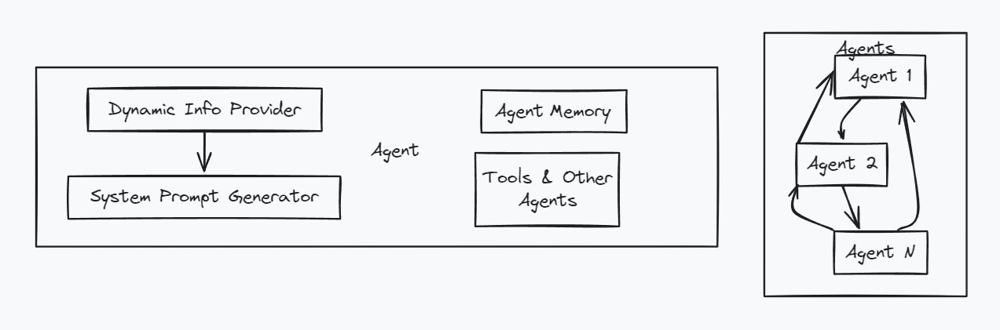

# Session 6: Atomic Agents Modular Architecture - Building Data Processing Like Microservices

Imagine if you could build data processing pipelines the way you architect distributed systems - taking small, focused components that handle specific data transformations and orchestrating them seamlessly to create anything from simple ETL workflows to complex multi-stage analytics engines. That's exactly what Atomic Agents delivers for data engineering: a microservices-inspired architecture where each component handles one data operation brilliantly and connects seamlessly with others.

While other agent frameworks create monolithic processors that try to handle all data operations, Atomic Agents breaks intelligence into its smallest useful data processing units. Need stream transformation? Grab a transformation agent. Need data validation? Add a validation agent. Need them to work in sequence? They automatically align through schema contracts - no glue code, no integration complexity.

In the world of petabyte-scale data processing, this modular approach mirrors the architectural patterns data engineers know from distributed streaming platforms like Kafka, Apache Beam, and distributed computing frameworks. Each atomic agent operates like a microservice in your data mesh, with single responsibility for data operations and minimal dependencies, making them highly reusable building blocks for composable data architectures.

Atomic Agents provides a component-based architecture for building modular data processing systems that scale like distributed stream processors but compose like building blocks. Built on Instructor and Pydantic foundations, the framework enables rapid data pipeline assembly through schema alignment and lightweight processing components. Each atomic agent handles single data responsibility with minimal dependencies, making them highly reusable building blocks for data mesh architectures.

### What You'll Learn

- Component-based agent design for modular data pipeline composition patterns
- Atomic architecture principles for distributed data processing system scalability
- Schema matching and component alignment for seamless data transformation chaining
- Production deployment strategies for atomic agent data processing systems

### Advanced Modules

- **[Module A: Advanced Composition Patterns](Session6_ModuleA_Advanced_Composition_Patterns.md)** - Pipeline orchestration & dynamic assembly for complex data workflows
- **[Module B: Enterprise Modular Systems](Session6_ModuleB_Enterprise_Modular_Systems.md)** - Production-scale atomic systems & multi-tenant data processing architectures

**Code Files**: [`src/session6/`](https://github.com/fwornle/agentic-ai-nano/tree/main/docs-content/01_frameworks/src/session6)
**Quick Start**: `cd src/session6 && python example_usage.py`

---

## Part 1: Atomic Architecture Principles for Data Engineering

### Modular Design Philosophy for Data Processing

Atomic Agents transforms data processing development through extreme modularity and component-based architecture that mirrors the patterns data engineers use in modern data mesh implementations:


*This diagram illustrates the core atomic agent structure optimized for data processing, with individual, focused components that handle specific data transformations. Each agent is designed with single responsibility for data operations and minimal dependencies, making them lightweight and highly reusable building blocks for composable data architectures.*

**File**: [`src/session6/atomic_foundation.py`](https://github.com/fwornle/agentic-ai-nano/blob/main/docs-content/01_frameworks/src/session6/atomic_foundation.py) - Core atomic patterns for data processing

```python
from atomic_agents.agents import BaseAgent
from atomic_agents.lib.components.chat_memory import ChatMemory
from atomic_agents.lib.tools.data_connector import DataConnectorTool

# Atomic data processing agent - minimal, focused data operation functionality

class AtomicDataTransformAgent(BaseAgent):
    def __init__(self, name: str):
        super().__init__(
            agent_name=name,
            system_prompt="You are a specialized data transformation processing agent focusing on specific data operations",
            memory=ChatMemory(),
            tools=[],  # Tools added as needed for data connectors
            max_tokens=500  # Lightweight by default for data processing efficiency
        )
    
    def transform_data(self, data_payload: str) -> str:
        """Single, focused data transformation responsibility"""
        return self.run(f"Transform this data payload: {data_payload}")
```

This atomic data transformation agent demonstrates how data processing components can be designed with the same principles data engineers use for stream processing: single responsibility for specific transformations, lightweight resource footprint, and clear input/output contracts that enable easy chaining in data pipelines.

### Key Concepts for Data Mesh Architecture

1. **Single Data Responsibility**: Each component handles one specific type of data transformation or validation
2. **Composition over Data Coupling**: Build data pipelines by combining processing components rather than creating tightly coupled processors
3. **Lightweight by Design**: Minimal resource footprint per component, essential for distributed data processing at scale

### Component Composition for Data Pipelines

Building data processing systems through component assembly mirrors the patterns used in Apache Beam and modern stream processing architectures:


*This visualization shows how multiple atomic agents work together in a coordinated data processing pipeline. Each agent maintains its specialized data operation role while contributing to the overall data flow, demonstrating the composition-over-coupling principle essential in distributed data systems*

**File**: [`src/session6/composition_engine.py`](https://github.com/fwornle/agentic-ai-nano/blob/main/docs-content/01_frameworks/src/session6/composition_engine.py) - Component composition patterns for data pipelines

```python
from atomic_agents.lib.components import ToolsComponent, MemoryComponent
from atomic_agents.lib.models import OpenAIModel

class DataPipelineComposer:
    """Compose data processing agents from reusable components"""
    
    @staticmethod
    def create_data_ingestion_agent():
        """Compose a data ingestion-focused agent for streaming data"""
        return BaseAgent(
            agent_name="data_ingestion_specialist",
            model=OpenAIModel(model_name="gpt-4"),
            system_prompt="Expert at ingesting and initial processing of streaming data from various sources",
            memory=ChatMemory(max_messages=20),
            tools=[
                DataConnectorTool(),
                # Add more data ingestion tools as needed
            ]
        )
    
    @staticmethod 
    def create_data_validation_agent():
        """Compose a data validation-focused agent for quality assurance"""
        return BaseAgent(
            agent_name="data_quality_validator",
            model=OpenAIModel(model_name="gpt-4"),
            system_prompt="Specialized data quality validator ensuring schema compliance and data integrity",
            memory=ChatMemory(max_messages=10),
            tools=[]  # Validation agents work with built-in validation logic
        )
```

This composition engine demonstrates how data engineers can build specialized agents for different stages of data processing pipelines, similar to how Apache Beam transforms are composed or how Kafka streams processors are chained together for complex data processing workflows.

### Lightweight Patterns for Scalable Data Processing

Optimizing for efficiency and modularity in data processing contexts:

```python

# Minimal data processing agent configuration optimized for scale

minimal_data_agent = BaseAgent(
    agent_name="minimal_data_processor",
    system_prompt="Process data inputs efficiently with minimal resource usage",
    memory=None,  # No memory for stateless data processing operations
    tools=[],     # No external tools for pure data transformation
    max_tokens=200  # Limit token usage for processing efficiency
)

# Composable tool sets for different data processing stages

ingestion_tools = [DataConnectorTool()]
transformation_tools = []  # Add transformation tools as needed
validation_tools = []     # Validation agents work with schema validation logic

def create_specialized_data_agent(data_operation: str, tools: list = None):
    """Factory for creating specialized data processing agents"""
    return BaseAgent(
        agent_name=f"{data_operation}_data_specialist",
        system_prompt=f"You are a {data_operation} specialist for data processing operations",
        tools=tools or [],
        max_tokens=300
    )
```

---

## Part 2: Building Atomic Components for Data Operations

### Component Creation for Data Processing

Building reusable atomic components that handle specific data processing operations:

**File**: [`src/session6/data_transform_agent.py`](https://github.com/fwornle/agentic-ai-nano/blob/main/docs-content/01_frameworks/src/session6/data_transform_agent.py) - Specialized data transformation processing agent

```python
from atomic_agents.agents import BaseAgent
from atomic_agents.lib.components.chat_memory import ChatMemory

class DataTransformProcessorAgent(BaseAgent):
    """Atomic agent for data transformation processing tasks"""
    
    def __init__(self):
        super().__init__(
            agent_name="data_transform_processor",
            system_prompt="""You are a data transformation processing specialist. 
            Focus on: schema transformation, data format conversion, and field mapping operations.""",
            memory=ChatMemory(max_messages=5),
            tools=[],
            max_tokens=400
        )
    
    def transform_schema(self, data_payload: str, target_schema: str) -> str:
        """Specialized schema transformation method for data processing"""
        prompt = f"Transform this data to match target schema:\nData: {data_payload}\nTarget Schema: {target_schema}"
        return self.run(prompt)
    
    def convert_format(self, data_payload: str, target_format: str) -> str:
        """Specialized format conversion for data processing pipelines"""
        prompt = f"Convert this data to {target_format} format:\n\n{data_payload}"
        return self.run(prompt)
    
    def map_fields(self, data_payload: str, field_mapping: str) -> str:
        """Map data fields according to specified mapping rules"""
        prompt = f"Apply field mapping to this data:\nData: {data_payload}\nMapping Rules: {field_mapping}"
        return self.run(prompt)

# Usage example in data processing pipeline

data_transform_agent = DataTransformProcessorAgent()
transformed_data = data_transform_agent.transform_schema("Original data payload", "target_schema_spec")
```

### Interface Design for Data Pipeline Integration

Creating clean, composable interfaces that integrate seamlessly with distributed data processing systems:

**File**: [`src/session6/data_pipeline_agent.py`](https://github.com/fwornle/agentic-ai-nano/blob/main/docs-content/01_frameworks/src/session6/data_pipeline_agent.py) - Data processing pipeline specialist

```python
from abc import ABC, abstractmethod
from typing import Dict, Any, List

class DataPipelineProcessor(ABC):
    """Abstract interface for data processing pipeline components"""
    
    @abstractmethod
    def process_data_stream(self, data_stream: Dict[str, Any]) -> Dict[str, Any]:
        """Process streaming data and return processed results"""
        pass

class AtomicDataPipelineAgent(BaseAgent, DataPipelineProcessor):
    """Atomic agent implementing data processing pipeline interface"""
    
    def __init__(self):
        super().__init__(
            agent_name="data_pipeline_processor", 
            system_prompt="You process and analyze streaming data for distributed data processing systems",
            memory=None,  # Stateless for distributed data processing
            tools=[],
            max_tokens=600
        )
    
    def process_data_stream(self, data_stream: Dict[str, Any]) -> Dict[str, Any]:
        """Implement the data processing pipeline interface"""
        stream_str = str(data_stream)
        analysis = self.run(f"Process this data stream and provide processing results: {stream_str}")
        
        return {
            "original_data_stream": data_stream,
            "processing_results": analysis,
            "processed_at": "timestamp_here",
            "processing_metadata": {
                "pipeline_stage": "atomic_processing",
                "data_quality_score": "calculated_score"
            }
        }
    
    def aggregate_stream_data(self, data_streams: List[Dict]) -> Dict:
        """Aggregate multiple data streams for batch processing"""
        combined = {"stream_items": data_streams, "stream_count": len(data_streams)}
        return self.process_data_stream(combined)
```

### Basic Composition for Data Processing Pipelines

Combining components into complete data processing systems that mirror distributed architecture patterns:

**File**: [`src/session6/data_coordinator_agent.py`](https://github.com/fwornle/agentic-ai-nano/blob/main/docs-content/01_frameworks/src/session6/data_coordinator_agent.py) - Data processing pipeline coordination

```python
class AtomicDataProcessingCoordinator:
    """Coordinate multiple atomic agents for data processing pipelines"""
    
    def __init__(self):
        # Initialize specialized data processing agents
        self.data_transform_agent = DataTransformProcessorAgent()
        self.data_pipeline_agent = AtomicDataPipelineAgent()
        
    def process_mixed_data_streams(self, raw_data: str, stream_metadata: Dict) -> Dict:
        """Coordinate processing of mixed data content types in distributed pipeline"""
        
        # Process data transformation component
        schema_transformation = self.data_transform_agent.transform_schema(raw_data, "standard_schema")
        format_conversion = self.data_transform_agent.convert_format(raw_data, "json")
        
        # Process pipeline component  
        pipeline_analysis = self.data_pipeline_agent.process_data_stream(stream_metadata)
        
        # Combine processing results for downstream systems
        return {
            "data_transformation": {
                "schema_result": schema_transformation,
                "format_result": format_conversion
            },
            "pipeline_processing": pipeline_analysis,
            "coordination_complete": True,
            "ready_for_downstream": True
        }
    
    def sequential_stream_processing(self, data_items: List[str]) -> List[str]:
        """Process data items sequentially through atomic agents pipeline"""
        processing_results = []
        
        for data_item in data_items:
            if isinstance(data_item, str):
                processed_result = self.data_transform_agent.transform_schema(data_item, "standard_format")
                processing_results.append(processed_result)
            
        return processing_results

# Usage in distributed data processing environment

coordinator = AtomicDataProcessingCoordinator()
pipeline_result = coordinator.process_mixed_data_streams(
    raw_data="Streaming data payload here...",
    stream_metadata={"source": "kafka_stream", "partition": 3, "offset": 12345}
)
```

### Testing Strategies for Data Processing Components

Validating atomic components in data processing contexts:

**File**: [`src/session6/data_test_client.py`](https://github.com/fwornle/agentic-ai-nano/blob/main/docs-content/01_frameworks/src/session6/data_test_client.py) - Testing atomic data processing systems

```python
def test_atomic_data_processing_components():
    """Test individual atomic data processing components"""
    
    # Test data transformation processing
    data_transform_agent = DataTransformProcessorAgent()
    test_data_payload = "{'user_id': 123, 'event': 'page_view', 'timestamp': '2024-01-01'}"
    
    schema_result = data_transform_agent.transform_schema(test_data_payload, "standard_event_schema")
    assert len(schema_result) > 0
    assert "user_id" in schema_result or "transformed" in schema_result.lower()
    
    # Test data pipeline processing
    data_pipeline_agent = AtomicDataPipelineAgent()
    test_stream_data = {"stream_data": [1, 2, 3], "source": "test_stream"}
    
    pipeline_result = data_pipeline_agent.process_data_stream(test_stream_data)
    assert "processing_results" in pipeline_result
    assert "original_data_stream" in pipeline_result
    
    print("✅ Atomic data processing component tests passed!")

def test_data_processing_coordination():
    """Test data processing pipeline coordination"""
    coordinator = AtomicDataProcessingCoordinator()
    
    pipeline_result = coordinator.process_mixed_data_streams(
        raw_data="Sample streaming data",
        stream_metadata={"source": "test_kafka_topic"}
    )
    
    assert "data_transformation" in pipeline_result
    assert "pipeline_processing" in pipeline_result
    assert pipeline_result["coordination_complete"] is True
    
    print("✅ Data processing coordination tests passed!")
```

---

## Part 3: System Assembly & Integration for Data Processing

### Component Integration for Distributed Data Systems

Assembling components into complete data processing systems that scale like distributed architectures:


*The Atomic Assembler helps you integrate Atomic Agents for distributed data processing pipelines*

**File**: [`src/session6/data_orchestrator.py`](https://github.com/fwornle/agentic-ai-nano/blob/main/docs-content/01_frameworks/src/session6/data_orchestrator.py) - Production data processing integration patterns

```python
from typing import Dict, List, Any, Optional
import asyncio

class AtomicDataProcessingOrchestrator:
    """Orchestrate multiple atomic agents for complex data processing workflows"""
    
    def __init__(self):
        self.agents = {
            "data_transform": DataTransformProcessorAgent(),
            "data_pipeline": AtomicDataPipelineAgent(),
            "coordinator": AtomicDataProcessingCoordinator()
        }
        
    async def parallel_data_processing(self, data_tasks: List[Dict[str, Any]]) -> List[Any]:
        """Process multiple data processing tasks in parallel for distributed processing"""
        
        async def process_data_task(task):
            task_type = task.get("type")
            data_content = task.get("content")
            
            if task_type == "transform":
                return self.agents["data_transform"].transform_schema(data_content, "standard_schema")
            elif task_type == "pipeline":
                return self.agents["data_pipeline"].process_data_stream(data_content)
            else:
                return f"Unknown data processing task type: {task_type}"
        
        # Process all data tasks concurrently for distributed performance
        processing_results = await asyncio.gather(*[process_data_task(task) for task in data_tasks])
        return processing_results
    
    def sequential_data_workflow(self, input_data_stream: Dict) -> Dict:
        """Execute a sequential data processing workflow across agents"""
        
        workflow_state = {"input": input_data_stream, "processing_results": []}
        
        # Step 1: Data transformation processing
        if "raw_data" in input_data_stream:
            transform_result = self.agents["data_transform"].transform_schema(input_data_stream["raw_data"], "standard_schema")
            workflow_state["processing_results"].append({"stage": "transform", "result": transform_result})
        
        # Step 2: Data pipeline processing
        if "stream_metadata" in input_data_stream:
            pipeline_result = self.agents["data_pipeline"].process_data_stream(input_data_stream["stream_metadata"])
            workflow_state["processing_results"].append({"stage": "pipeline", "result": pipeline_result})
        
        # Step 3: Coordination for downstream systems
        final_result = self.agents["coordinator"].process_mixed_data_streams(
            raw_data=input_data_stream.get("raw_data", ""),
            stream_metadata=input_data_stream.get("stream_metadata", {})
        )
        workflow_state["final_processing_result"] = final_result
        
        return workflow_state
```

### System Coordination for Distributed Data Processing

Managing complex multi-agent data processing systems that mirror microservices patterns:

```python
class DataProcessingSystemCoordinator:
    """High-level coordination of atomic agent data processing systems"""
    
    def __init__(self):
        self.orchestrator = AtomicDataProcessingOrchestrator()
        self.active_data_workflows = {}
        
    def start_data_workflow(self, workflow_id: str, config: Dict) -> str:
        """Start a new data processing workflow with given configuration"""
        
        self.active_data_workflows[workflow_id] = {
            "config": config,
            "status": "processing",
            "start_time": "timestamp_here"
        }
        
        return f"Data processing workflow {workflow_id} started"
    
    def get_data_workflow_status(self, workflow_id: str) -> Dict:
        """Get status of running data processing workflow"""
        return self.active_data_workflows.get(workflow_id, {"status": "workflow_not_found"})
    
    def orchestrate_complex_data_processing(self, processing_description: str) -> Dict:
        """Orchestrate a complex data processing task across multiple atomic agents"""
        
        # Break down complex data processing task into atomic operations
        subtasks = self._decompose_data_processing_task(processing_description)
        
        # Execute subtasks through appropriate data processing agents
        processing_results = []
        for subtask in subtasks:
            if subtask["type"] == "transform":
                result = self.orchestrator.agents["data_transform"].transform_schema(subtask["content"], "standard_schema")
            elif subtask["type"] == "pipeline":
                result = self.orchestrator.agents["data_pipeline"].process_data_stream(subtask["content"])
            
            processing_results.append(result)
        
        return {
            "processing_task": processing_description,
            "subtasks": subtasks,
            "processing_results": processing_results,
            "status": "completed"
        }
    
    def _decompose_data_processing_task(self, task: str) -> List[Dict]:
        """Decompose complex data processing task into atomic operations"""
        # Simplified decomposition logic for data processing operations
        return [
            {"type": "transform", "content": task},
            {"type": "pipeline", "content": {"processing_task": task}}
        ]
```

### Testing Integration for Data Processing Systems

Validating integrated data processing systems:

```python
def test_data_processing_system_integration():
    """Test complete data processing system integration"""
    
    # Test orchestrator for data processing
    orchestrator = AtomicDataProcessingOrchestrator()
    
    # Test sequential data processing workflow
    workflow_input = {
        "raw_data": "Test data payload for processing",
        "stream_metadata": {"source": "kafka", "partition": 0, "offset": 123}
    }
    
    result = orchestrator.sequential_data_workflow(workflow_input)
    assert "final_processing_result" in result
    assert "processing_results" in result
    assert len(result["processing_results"]) > 0
    
    # Test data processing system coordinator
    coordinator = DataProcessingSystemCoordinator()
    complex_result = coordinator.orchestrate_complex_data_processing("Process customer event stream data")
    
    assert "processing_results" in complex_result
    assert complex_result["status"] == "completed"
    
    print("✅ Data processing system integration tests passed!")
```

---

## Part 4: Deployment & Scaling for Data Processing

### Deployment Patterns for Distributed Data Processing

**File**: [`src/session6/data_bootstrap.py`](https://github.com/fwornle/agentic-ai-nano/blob/main/docs-content/01_frameworks/src/session6/data_bootstrap.py) - Deployment configuration for data processing systems

```python
def deploy_atomic_data_processing_system():
    """Deploy atomic agent data processing system"""
    
    # Initialize data processing system components
    orchestrator = AtomicDataProcessingOrchestrator()
    coordinator = DataProcessingSystemCoordinator()
    
    print("Atomic agent data processing system deployed")
    print(f"Available data processing agents: {list(orchestrator.agents.keys())}")
    
    return {"orchestrator": orchestrator, "coordinator": coordinator}

# Quick deployment for distributed data processing

data_processing_system = deploy_atomic_data_processing_system()
```

### Scaling Considerations for Distributed Data Processing

```python

# Scaling patterns for atomic agents in data processing contexts

data_processing_scaling_config = {
    "horizontal_scaling": "Add more agent instances for increased data throughput",
    "vertical_scaling": "Increase agent processing capabilities for complex data operations",
    "load_balancing": "Distribute data processing requests across agent instances",
    "caching": "Cache frequent data processing operations and transformations"
}
```

---

## Quick Implementation Exercise

🗂️ **Exercise Files**:

- `src/session6/example_usage.py` - Complete working data processing example
- `src/session6/data_test_client.py` - Test your data processing understanding

```bash

# Try the data processing examples:

cd src/session6
python example_usage.py           # See atomic data processing agents in action
python data_bootstrap.py          # Deploy atomic data processing system
python -m pytest data_test_client.py  # Validate your data processing understanding
```

### Self-Assessment Checklist

- [ ] I understand atomic agent architecture principles for data processing systems
- [ ] I can build modular, composable data processing components
- [ ] I can assemble components into integrated data processing pipelines
- [ ] I understand deployment and scaling patterns for distributed data processing systems
- [ ] I'm ready for advanced modules or next session

**Next Session Prerequisites**: ✅ Core Section Complete
**Ready for**: Session 7: ADK Enterprise Agent Development

---

### **Choose Your Next Path:**

- **[Module A: Advanced Composition Patterns →](Session6_ModuleA_Advanced_Composition_Patterns.md)** - Sophisticated data pipeline orchestration & dynamic assembly for complex data workflows
- **[Module B: Enterprise Modular Systems →](Session6_ModuleB_Enterprise_Modular_Systems.md)** - Production-scale atomic systems & multi-tenant data processing architectures
- **[📝 Test Your Knowledge →](Session6_Test_Solutions.md)** - Comprehensive quiz
- **[📖 Next Session: First ADK Agent →](Session7_First_ADK_Agent.md)** - Enterprise agent development

### Complete Learning Path Options

**Sequential Learning**: Core → Module A → Module B  
**Production Focus**: Core → Module B  
**Advanced Patterns**: Core → Module A

---

## Multiple Choice Test - Session 6 (15 minutes)

Test your understanding of atomic agent architecture and modular composition for data processing systems.

**Question 1:** What is the core principle behind Atomic Agents architecture for data processing?  
A) Maximum data throughput optimization  
B) Single-purpose, composable data processing components with clear schema interfaces  
C) Minimal resource usage  
D) Complex integrated data processing systems  

**Question 2:** How do atomic data processing agents communicate with each other?  
A) Direct method calls  
B) Standardized data schemas and context providers for seamless data flow  
C) Shared global data variables  
D) Database transactions  

**Question 3:** What makes a data processing agent "atomic" in this architecture?  
A) Small code size  
B) Fast data processing  
C) Single, focused data processing responsibility with well-defined data interfaces  
D) Low memory usage  

**Question 4:** What is the role of Context Providers in atomic data processing agent systems?  
A) Execute agent logic  
B) Manage shared data state and coordination between data processing agents  
C) Handle user interface  
D) Store persistent data  

**Question 5:** How does the Composition Engine work in atomic data processing systems?  
A) Compiles agents into single executable  
B) Dynamically assembles data processing agents based on pipeline requirements  
C) Optimizes agent performance  
D) Manages agent memory  

**Question 6:** What is the primary benefit of modular data processing agent composition?  
A) Faster data processing execution  
B) Flexibility to assemble different data processing workflows from same components  
C) Lower development costs  
D) Better user interface  

**Question 7:** How do atomic data processing agents handle failure isolation?  
A) Global error handling  
B) Individual agent failures don't cascade to other data processing components  
C) Automatic restart mechanisms  
D) Backup agent systems  

**Question 8:** What makes atomic data processing agents suitable for distributed processing architectures?  
A) Built-in API gateways  
B) Single-responsibility principle and loose coupling, similar to microservices patterns  
C) Automatic scaling features  
D) Built-in monitoring  

**Question 9:** How do you scale atomic data processing agent systems?  
A) Vertical scaling only  
B) Horizontal scaling by replicating individual data processing agents  
C) Cloud deployment only  
D) Container orchestration required  

**Question 10:** What is the main advantage of the Coordinator Agent pattern in data processing?  
A) Centralized control of data processing agent interactions and workflow orchestration  
B) Faster agent execution  
C) Lower resource usage  
D) Better error handling  

---

[**🗂️ View Test Solutions →**](Session6_Test_Solutions.md)

---

## 🧭 Navigation

**Previous:** [Session 5 - PydanticAI Type-Safe Agents](Session5_PydanticAI_Type_Safe_Agents.md)

### Optional Deep Dive Modules

- 🔬 **[Module A: Advanced Composition Patterns](Session6_ModuleA_Advanced_Composition_Patterns.md)** - Advanced data processing patterns
- 🏭 **[Module B: Enterprise Modular Systems](Session6_ModuleB_Enterprise_Modular_Systems.md)** - Production data processing systems

**Next:** [Session 7 - First ADK Agent →](Session7_First_ADK_Agent.md)