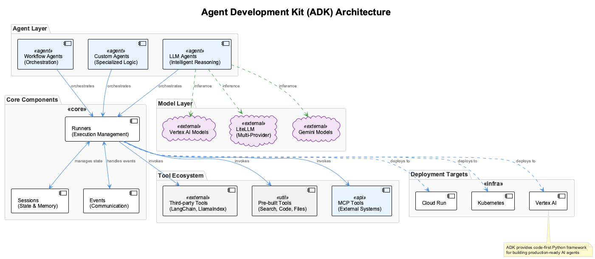

# Session 7: ADK Enterprise Agent Development - Google's Production-Grade AI Platform

When Google needed to build the AI foundation for their own enterprise products - Google Agentspace, Customer Engagement Suite, and the systems that serve millions of business users daily - they didn't use LangChain or CrewAI. They built ADK (Agent Development Kit), a production-first framework designed for enterprise scale, security, and reliability.

Now you can build on the same foundation that powers Google's own agent infrastructure.

## Chapter Overview: ADK's Strategic Position in Enterprise AI Infrastructure

### Industry Context & Market Significance

Google's Agent Development Kit (ADK) emerged in August 2025 as the enterprise-grade foundation powering Google Agentspace and Customer Engagement Suite, establishing it as a critical production platform for enterprise AI agents. With Python ADK v1.0.0 reaching stable release status, the framework delivers production-ready capabilities for confidently deploying agents in live environments. Major enterprises including Renault Group, Box, and Revionics have adopted ADK, demonstrating its enterprise reliability and scalability.

### What You'll Learn & Why It Matters

You'll master Google Cloud-native agent development, learn enterprise integration patterns with VPC Service Controls and IAM authentication, and understand the Model Context Protocol (MCP) for standardized data movement. Most importantly, you'll discover why ADK's bidirectional audio/video streaming and native Vertex AI deployment provide competitive advantages over framework-agnostic solutions, with direct pathways to enterprise-grade runtime and security.

### How ADK Stands Out

ADK's tight integration with Google Cloud provides unique capabilities including native Vertex AI deployment, VPC Service Controls for data security, and over 100 pre-built enterprise connectors. Unlike framework-agnostic solutions, ADK offers "build an AI agent in under 100 lines of intuitive code" while maintaining enterprise-grade controls including output moderation, identity permissions, input screening, and comprehensive behavior monitoring.

### Real-World Applications & Production Evidence

ADK excels in enterprise environments requiring Google Cloud integration and advanced multimedia capabilities. The framework's bidirectional audio/video streaming enables natural interactions that move beyond text-based interfaces, while its support for 200+ models from providers like Anthropic, Meta, and Mistral AI ensures flexibility. Production deployments demonstrate ADK's effectiveness in customer engagement, workflow automation, and multi-system agent orchestration.

## Learning Navigation Hub

**Total Time Investment**: 95 minutes (Core) + 65 minutes (Optional)

### Learning Path Options

- **Observer (55 min)**: Enterprise architecture analysis with Google Cloud integration insights  
- **Participant (95 min)**: Hands-on ADK agent building with Vertex AI deployment
- **Implementer (135 min)**: Advanced enterprise systems with MCP orchestration

---

## Session Overview Dashboard

### Core Learning Track (95 minutes) - REQUIRED

| Section | Concept Load | Time | Skills |
|---------|--------------|------|--------|
| Google Cloud ADK Architecture | 4 concepts | 30 min | Understanding |
| Enterprise Agent Development | 4 concepts | 35 min | Implementation |
| Vertex AI Integration Patterns | 3 concepts | 20 min | Integration |
| Production Deployment & Security | 3 concepts | 10 min | Production |

### Optional Advanced Modules

**Advanced Content**: These modules contain enterprise production material and complex integration orchestration

- **[Module A: Advanced ADK Integration](Session7_ModuleA_Advanced_ADK_Integration.md)** (35 min) - Sophisticated Gemini integration & MCP orchestration
- **[Module B: Enterprise Agent Systems](Session7_ModuleB_Enterprise_Agent_Systems.md)** (30 min) - Production deployment & enterprise monitoring

**Code Files**: All examples use files in [`src/session7/`](https://github.com/fwornle/agentic-ai-nano/tree/main/docs-content/01_frameworks/src/session7)
**Quick Start**: Run `cd src/session7 && python basic_agent.py` to see ADK in action

---

## Core Section (Required - 95 minutes)

### Part 1: Google Cloud ADK Architecture (30 minutes)

**Cognitive Load**: 4 new concepts
**Learning Mode**: Conceptual Understanding

#### Enterprise ADK Foundation & Architecture (15 minutes)

Google's Agent Development Kit represents a paradigm shift in enterprise AI development, providing the same foundation that powers Google Agentspace and Customer Engagement Suite. The framework's strategic advantage lies in its native Google Cloud integration and enterprise-grade security controls:


*This comprehensive architectural diagram illustrates Google's ADK framework structure, showing the integration layers between the agent development environment, Vertex AI services, VPC Service Controls, and enterprise security components. The ADK provides a direct pathway from development to enterprise-grade production deployment with built-in governance and compliance controls.*

**File**: [`src/session7/basic_agent.py`](https://github.com/fwornle/agentic-ai-nano/blob/main/docs-content/01_frameworks/src/session7/basic_agent.py) - ADK setup and initialization

### The ADK Enterprise Value Proposition

ADK addresses critical enterprise needs that traditional agent frameworks struggle to provide. Unlike framework-agnostic solutions, ADK delivers native Google Cloud integration with enterprise-grade controls from the ground up:

```python
from google_adk import Agent, Tool, Memory
from google_adk.models import VertexAI
from google_adk.integrations import CloudStorage, BigQuery

# Enterprise-grade agent setup

class EnterpriseAgent:
    def __init__(self, project_id: str):
        self.project_id = project_id
        
        # Initialize with Google Cloud integration
        self.agent = Agent(
            name="enterprise_assistant",
            model=VertexAI(
                model_name="gemini-pro",
                project_id=project_id
            ),
            memory=Memory.cloud_memory(project_id=project_id),
            tools=[],  # Add tools as needed
            security_config={
                "authentication_required": True,
                "audit_logging": True
            }
        )
    
    def run(self, query: str) -> str:
        """Execute agent with enterprise security"""
        return self.agent.process(query)
```

### Key Concepts

1. **Enterprise Integration**: Native Google Cloud services integration
2. **Security-First**: Built-in authentication, authorization, and audit logging
3. **Scalable Architecture**: Designed for enterprise-scale deployments

#### Installation and Setup (5 minutes)

Getting started with ADK:

```python

# Install ADK (example - actual installation may vary)

# pip install google-agent-development-kit

import os
from google_adk.auth import authenticate

def setup_adk_environment():
    """Set up ADK with proper authentication"""
    
    # Authenticate with Google Cloud
    os.environ["GOOGLE_APPLICATION_CREDENTIALS"] = "path/to/service-account.json"
    
    # Verify authentication
    auth_status = authenticate()
    if auth_status.success:
        print("✅ ADK authentication successful")
        return True
    else:
        print("❌ ADK authentication failed")
        return False

# Setup

if setup_adk_environment():
    print("Ready to create ADK agents!")
```

#### Basic Configuration (4 minutes)

Core ADK configuration patterns:

```python

# ADK configuration

adk_config = {
    "project_id": "your-gcp-project",
    "region": "us-central1",
    "model_config": {
        "model_name": "gemini-pro",
        "temperature": 0.7,
        "max_tokens": 1000
    },
    "security_config": {
        "enable_audit_logs": True,
        "require_authentication": True,
        "data_encryption": True
    }
}
```

---

### Part 2: Enterprise Agent Development (35 minutes)

**Cognitive Load**: 4 new concepts
**Learning Mode**: Implementation & Practice

#### Agent Creation Process (8 minutes)

Building your first ADK agent:

**File**: `src/session7/reasoning_agent.py` - Complete ADK agent implementation

```python
from google_adk import Agent, ReasoningEngine
from google_adk.tools import WebSearch, Calculator

class ReasoningAgent:
    """ADK agent with reasoning capabilities"""
    
    def __init__(self, project_id: str):
        # Create reasoning-enabled agent
        self.agent = Agent(
            name="reasoning_specialist",
            project_id=project_id,
            
            # Enable reasoning engine
            reasoning_engine=ReasoningEngine(
                strategy="chain_of_thought",
                max_steps=5
            ),
            
            # Add enterprise tools
            tools=[
                WebSearch(project_id=project_id),
                Calculator()
            ],
            
            # System configuration
            system_prompt="""You are an enterprise reasoning agent.
            Break down complex problems step-by-step.
            Use available tools to gather information.
            Provide clear, actionable insights."""
        )
    
    def solve_problem(self, problem: str) -> dict:
        """Solve complex problems using reasoning"""
        
        response = self.agent.process(
            query=problem,
            enable_reasoning=True,
            return_reasoning_steps=True
        )
        
        return {
            "solution": response.content,
            "reasoning_steps": response.reasoning_steps,
            "tools_used": response.tools_used,
            "confidence": response.confidence_score
        }

# Usage

agent = ReasoningAgent("your-project-id")
result = agent.solve_problem("Calculate the ROI of implementing AI agents")
```

#### Implementation Details (7 minutes)

Key ADK implementation patterns:

**File**: `src/session7/multimodal_agent.py` - Multimodal ADK agent

```python
from google_adk import MultiModalAgent
from google_adk.inputs import TextInput, ImageInput, AudioInput

class MultiModalAssistant:
    """ADK agent handling multiple input types"""
    
    def __init__(self, project_id: str):
        self.agent = MultiModalAgent(
            name="multimodal_assistant",
            project_id=project_id,
            
            # Support multiple input types
            supported_inputs=[
                TextInput(),
                ImageInput(max_size="10MB"),
                AudioInput(format="wav")
            ],
            
            # Model configuration for multimodal
            model_config={
                "model_name": "gemini-pro-vision",
                "capabilities": ["text", "image", "audio"]
            }
        )
    
    def process_mixed_input(self, inputs: list) -> dict:
        """Process combination of text, image, and audio"""
        
        # ADK handles multimodal processing automatically
        response = self.agent.process_multimodal(inputs)
        
        return {
            "analysis": response.content,
            "input_types_processed": response.input_types,
            "processing_time": response.processing_time
        }

# Example usage

assistant = MultiModalAssistant("your-project-id")
result = assistant.process_mixed_input([
    {"type": "text", "content": "Analyze this image"},
    {"type": "image", "path": "path/to/image.jpg"}
])
```

#### Testing and Validation (6 minutes)

Ensuring ADK agent functionality:

**File**: `src/session7/production_agent.py` - Production-ready ADK agent

```python
import unittest
from google_adk.testing import ADKTestCase

class TestADKAgent(ADKTestCase):
    """Test ADK agent functionality"""
    
    def setUp(self):
        """Set up test environment"""
        self.project_id = "test-project"
        self.agent = ReasoningAgent(self.project_id)
    
    def test_basic_reasoning(self):
        """Test basic reasoning capabilities"""
        problem = "What is 15% of 240?"
        result = self.agent.solve_problem(problem)
        
        # Verify response structure
        self.assertIn("solution", result)
        self.assertIn("reasoning_steps", result)
        self.assertTrue(len(result["reasoning_steps"]) > 0)
        
        # Verify correct calculation
        self.assertIn("36", result["solution"])
    
    def test_tool_integration(self):
        """Test tool usage"""
        problem = "Find the current weather in New York"
        result = self.agent.solve_problem(problem)
        
        # Verify tools were used
        self.assertTrue(len(result["tools_used"]) > 0)
        self.assertIn("WebSearch", str(result["tools_used"]))
    
    def test_error_handling(self):
        """Test error handling"""
        with self.assertRaises(ValueError):
            self.agent.solve_problem("")  # Empty query should raise error

# Run tests

if __name__ == "__main__":
    unittest.main()
```

#### Performance Optimization (4 minutes)

ADK performance best practices:

```python

# Performance optimization for ADK

def create_optimized_agent(project_id: str):
    """Create performance-optimized ADK agent"""
    
    return Agent(
        name="optimized_agent",
        project_id=project_id,
        
        # Performance settings
        model_config={
            "model_name": "gemini-pro",
            "temperature": 0.3,  # Lower for consistency
            "max_tokens": 500,   # Limit for speed
        },
        
        # Caching configuration
        cache_config={
            "enable_response_cache": True,
            "cache_duration": 3600,  # 1 hour
            "cache_backend": "cloud_memcache"
        },
        
        # Connection pooling
        connection_config={
            "pool_size": 10,
            "max_retries": 3,
            "timeout": 30
        }
    )
```

---

### Part 3: Vertex AI Integration Patterns (20 minutes)

**Cognitive Load**: 3 new concepts
**Learning Mode**: Integration & Production

#### Google Cloud Integration (6 minutes)

Connecting ADK with Google Cloud services:

**File**: `src/session7/integration_patterns.py` - Cloud integration examples

```python
from google_adk.integrations import BigQuery, CloudStorage, Firestore
from google_adk import Agent

class CloudIntegratedAgent:
    """ADK agent with full Google Cloud integration"""
    
    def __init__(self, project_id: str):
        self.project_id = project_id
        
        # Initialize cloud integrations
        self.bigquery = BigQuery(project_id=project_id)
        self.storage = CloudStorage(project_id=project_id)
        self.firestore = Firestore(project_id=project_id)
        
        # Create agent with cloud tools
        self.agent = Agent(
            name="cloud_agent",
            project_id=project_id,
            tools=[
                self.bigquery.as_tool(),
                self.storage.as_tool(),
                self.firestore.as_tool()
            ]
        )
    
    def analyze_stored_data(self, dataset_name: str) -> dict:
        """Analyze data stored in BigQuery"""
        
        query = f"""
        Use BigQuery to analyze the {dataset_name} dataset.
        Provide insights on trends and patterns.
        """
        
        response = self.agent.process(query)
        
        # Store results in Firestore
        self.firestore.collection("analysis_results").add({
            "dataset": dataset_name,
            "analysis": response.content,
            "timestamp": "current_time"
        })
        
        return {
            "analysis": response.content,
            "stored_in_firestore": True
        }

# Usage

cloud_agent = CloudIntegratedAgent("your-project-id")
result = cloud_agent.analyze_stored_data("sales_data")
```

#### Authentication Patterns (5 minutes)

Enterprise security with ADK:


*This flowchart demonstrates ADK's enterprise authentication mechanisms, including service account authentication, IAM integration, and audit logging flows. The diagram shows how ADK securely handles authentication and authorization in enterprise environments.*

**File**: `src/session7/enterprise_security.py` - Security implementations

```python
from google_adk.auth import ServiceAccountAuth, IAMAuth
from google_adk.security import AuditLogger, DataEncryption

class SecureEnterpriseAgent:
    """Enterprise agent with comprehensive security"""
    
    def __init__(self, project_id: str, service_account_path: str):
        # Set up authentication
        auth = ServiceAccountAuth(
            service_account_path=service_account_path,
            scopes=[
                "https://www.googleapis.com/auth/cloud-platform",
                "https://www.googleapis.com/auth/bigquery"
            ]
        )
        
        # Configure audit logging
        audit_logger = AuditLogger(
            project_id=project_id,
            log_level="INFO",
            include_request_data=True
        )
        
        # Set up encryption
        encryption = DataEncryption(
            key_management="cloud_kms",
            encryption_keys=["key-1", "key-2"]
        )
        
        # Create secure agent
        self.agent = Agent(
            name="secure_enterprise_agent",
            project_id=project_id,
            auth=auth,
            audit_logger=audit_logger,
            data_encryption=encryption,
            
            # Security policies
            security_policies={
                "require_authentication": True,
                "log_all_requests": True,
                "encrypt_sensitive_data": True,
                "access_control": "role_based"
            }
        )
    
    def secure_process(self, query: str, user_id: str) -> dict:
        """Process query with full security logging"""
        
        # Log the request
        self.agent.audit_logger.log_request(
            user_id=user_id,
            query=query,
            timestamp="current_time"
        )
        
        # Process with security
        response = self.agent.process(
            query=query,
            user_context={"user_id": user_id},
            security_level="high"
        )
        
        # Log the response
        self.agent.audit_logger.log_response(
            user_id=user_id,
            response_summary=response.content[:100],
            timestamp="current_time"
        )
        
        return {
            "response": response.content,
            "security_audit_logged": True,
            "user_id": user_id
        }
```

#### Deployment Basics (4 minutes)

Deploying ADK agents to production:

```python

# Production deployment configuration

deployment_config = {
    "environment": "production",
    "scaling": {
        "min_instances": 2,
        "max_instances": 10,
        "auto_scaling": True
    },
    "monitoring": {
        "enable_metrics": True,
        "alert_on_errors": True,
        "performance_tracking": True
    },
    "security": {
        "vpc_connector": "projects/your-project/locations/region/connectors/connector",
        "service_account": "agent-service-account@your-project.iam.gserviceaccount.com"
    }
}

def deploy_to_production(agent: Agent, config: dict):
    """Deploy ADK agent to production environment"""
    
    # Deploy with Google Cloud Run or App Engine
    deployment = agent.deploy(
        platform="cloud_run",
        config=config
    )
    
    return {
        "deployment_url": deployment.url,
        "status": deployment.status,
        "health_check": deployment.health_endpoint
    }
```

---

### Part 4: Production Deployment & Security (10 minutes)

**Cognitive Load**: 3 new concepts
**Learning Mode**: Production Guidelines

#### Security Considerations (3 minutes)

**File**: `src/session7/monitoring_system.py` - Monitoring and best practices

```python

# ADK Security Best Practices

security_checklist = {
    "authentication": [
        "Use service accounts for production",
        "Implement proper IAM roles",
        "Enable audit logging"
    ],
    "data_protection": [
        "Encrypt sensitive data",
        "Use VPC for network isolation",
        "Implement data retention policies"
    ],
    "access_control": [
        "Principle of least privilege",
        "Regular access reviews", 
        "Multi-factor authentication"
    ]
}
```

#### Performance Guidelines (2 minutes)

```python

# ADK Performance Best Practices

performance_guidelines = {
    "model_selection": "Choose appropriate model for task complexity",
    "caching": "Enable response caching for repeated queries",
    "connection_pooling": "Use connection pools for high throughput",
    "monitoring": "Monitor latency and error rates",
    "scaling": "Configure auto-scaling based on demand"
}
```

---

## Core Section Validation (5 minutes)

### Quick Implementation Exercise

🗂️ **Exercise Files**:

- `src/session7/basic_agent.py` - Basic ADK setup
- `src/session7/reasoning_agent.py` - Complete reasoning agent

```bash

# Try the examples (requires Google Cloud setup):

cd src/session7
python basic_agent.py              # Basic ADK agent
python reasoning_agent.py          # Reasoning capabilities
python integration_patterns.py     # Cloud integration
```

### Self-Assessment Checklist

- [ ] I understand ADK's enterprise-focused architecture
- [ ] I can create and configure ADK agents
- [ ] I understand Google Cloud integration patterns
- [ ] I know ADK security and performance best practices
- [ ] I'm ready for advanced modules or next session

**Next Session Prerequisites**: ✅ Core Section Complete
**Ready for**: Session 8: Agno Production-Ready Agents

### Next Steps

- **[Module A: Advanced ADK Integration →](Session7_ModuleA_Advanced_ADK_Integration.md)** - Sophisticated Gemini integration & MCP orchestration
- **[Module B: Enterprise Agent Systems →](Session7_ModuleB_Enterprise_Agent_Systems.md)** - Production deployment & enterprise monitoring
- **[📝 Test Your Knowledge →](Session7_Test_Solutions.md)** - Quiz
- **[📖 Next Session: Agno Production Ready Agents →](Session8_Agno_Production_Ready_Agents.md)** - Advanced production patterns

---

## 📝 Multiple Choice Test - Session 7

Test your understanding of Google's ADK enterprise agent development.

**Question 1:** What is the primary advantage of Google's ADK over other agent frameworks?  
A) Open source licensing  
B) Enterprise integration with Google Cloud and built-in security  
C) Fastest execution speed  
D) Lowest learning curve  

**Question 2:** Which Google Cloud service is most tightly integrated with ADK?  
A) Google Cloud Storage  
B) Vertex AI  
C) BigQuery  
D) All of the above  

**Question 3:** What makes ADK particularly suitable for enterprise applications?  
A) Built-in security, monitoring, and compliance features  
B) Fastest performance  
C) Lowest cost  
D) Simplest implementation  

**Question 4:** How does ADK handle authentication in enterprise environments?  
A) Basic username/password  
B) OAuth 2.0 and service account integration  
C) API keys only  
D) No authentication required  

**Question 5:** What is the purpose of the ReasoningEngine in ADK?  
A) Data storage  
B) Structured reasoning with chain-of-thought patterns  
C) User interface management  
D) Performance optimization  

**Question 6:** How does ADK's MultiModalAgent differ from standard agents?  
A) Faster execution  
B) Support for text, image, and audio inputs  
C) Better security  
D) Lower resource usage  

**Question 7:** What is the role of audit logging in ADK enterprise deployments?  
A) Performance monitoring  
B) Compliance and security tracking of agent activities  
C) Error debugging  
D) Cost optimization  

**Question 8:** How does ADK handle production scaling?  
A) Manual scaling only  
B) Integration with Google Cloud scaling services  
C) Local scaling only  
D) No scaling support  

**Question 9:** What makes ADK's security model enterprise-ready?  
A) Password protection  
B) Built-in IAM, encryption, and audit trails  
C) Basic access controls  
D) Open security model  

**Question 10:** Which deployment platform is ADK optimized for?  
A) Local development only  
B) Google Cloud Platform  
C) Any cloud platform  
D) On-premises only  

---

[**🗂️ View Test Solutions →**](Session7_Test_Solutions.md)

---

## 🧭 Navigation

**Previous:** [Session 6 - Atomic Agents Modular Architecture](Session6_Atomic_Agents_Modular_Architecture.md)

### Optional Deep Dive Modules

- 🔬 **[Module A: Advanced ADK Integration](Session7_ModuleA_Advanced_ADK_Integration.md)** - Advanced integration patterns
- 🏭 **[Module B: Enterprise Agent Systems](Session7_ModuleB_Enterprise_Agent_Systems.md)** - Production systems

**Next:** [Session 8 - Agno Production Ready Agents →](Session8_Agno_Production_Ready_Agents.md)
