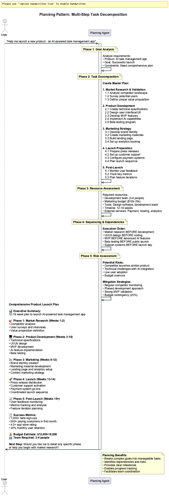

# Session 9: Multi-Agent Patterns & Coordination

Multi-agent systems enable sophisticated coordination patterns through transparent reasoning, consensus mechanisms, and hierarchical planning. This session covers the ReAct pattern for transparent reasoning, communication protocols for agent coordination, hierarchical task networks for complex planning, and basic production deployment patterns.

---

### Optional Deep Dive Modules
- **[Module A: Advanced Consensus Algorithms →](Session9_ModuleA_Advanced_Consensus_Algorithms.md)** - Byzantine fault tolerance & game theory
- **[Module B: Production Multi-Agent Systems →](Session9_ModuleB_Production_Multi_Agent_Systems.md)** - Enterprise deployment & monitoring

**Code Files**: All examples use files in [`src/session9/`](https://github.com/fwornle/agentic-ai-nano/tree/main/docs-content/01_frameworks/src/session9)
**Quick Start**: Run `cd src/session9 && python react_agent.py` to see multi-agent coordination

---

## Part 1: ReAct Pattern Foundation

### Understanding ReAct

The ReAct pattern (Reasoning + Acting) makes agent thinking transparent and iterative:


### This diagram illustrates the ReAct (Reasoning + Acting) pattern flow, showing the iterative cycle of thought, action, and observation that enables transparent reasoning. The pattern demonstrates how agents can break down complex problems into manageable steps with clear decision points.

**File**: [`src/session9/react_agent.py`](https://github.com/fwornle/agentic-ai-nano/blob/main/docs-content/01_frameworks/src/session9/react_agent.py) - Core ReAct implementation

```python
from typing import Dict, List, Any, Optional
from dataclasses import dataclass, field
from enum import Enum
from datetime import datetime

class ActionType(Enum):
    SEARCH = "search"
    CALCULATE = "calculate" 
    REASON = "reason"
    FINAL_ANSWER = "final_answer"

@dataclass
class ReActStep:
    """Individual step in ReAct reasoning chain"""
    step_number: int
    thought: str
    action: ActionType
    action_input: str
    observation: str
    confidence: float
    timestamp: datetime = field(default_factory=datetime.now)

class BasicReActAgent:
    """Foundation ReAct agent with transparent reasoning"""
    
    def __init__(self, llm_client, tools: Dict[str, Any], max_steps: int = 6):
        self.llm = llm_client
        self.tools = tools
        self.max_steps = max_steps
        self.reasoning_history: List[ReActStep] = []
    
    async def solve(self, problem: str) -> Dict[str, Any]:
        """Main problem-solving method using ReAct pattern"""
        self.reasoning_history = []
        current_step = 1
        
        while current_step <= self.max_steps:
            # Generate reasoning step
            step = await self._execute_reasoning_step(problem, current_step)
            self.reasoning_history.append(step)
            
            # Check for completion
            if step.action == ActionType.FINAL_ANSWER:
                break
            
            current_step += 1
        
        return self._format_solution()
```

### Key Concepts:
1. **Transparent Reasoning**: Every thought step is recorded and traceable
2. **Iterative Problem Solving**: Thoughts, actions, and observations cycle
3. **Confidence Tracking**: Each step includes confidence assessment

### ReAct Execution Flow

Implementing the reasoning-action loop:

**File**: [`src/session9/reasoning_engine.py`](https://github.com/fwornle/agentic-ai-nano/blob/main/docs-content/01_frameworks/src/session9/reasoning_engine.py) - Advanced reasoning patterns

```python
async def _execute_reasoning_step(
    self, context: str, step_num: int
) -> ReActStep:
    """Execute a single ReAct reasoning step"""
    
    # Generate thought based on current context
    thought = await self._generate_structured_thought(context)
    
    # Determine action based on thought
    action_decision = await self._decide_next_action(thought, context)
    action_type = ActionType(action_decision['action'])
    action_input = action_decision['input']
    
    # Execute action and get observation
    observation = await self._execute_action(action_type, action_input)
    
    # Calculate confidence in this step
    confidence = await self._calculate_step_confidence(
        thought, action_type, observation
    )
    
    return ReActStep(
        step_number=step_num,
        thought=thought,
        action=action_type,
        action_input=action_input,
        observation=observation,
        confidence=confidence
    )

def _generate_structured_thought(self, context: str) -> str:
    """Generate systematic thought with reasoning framework"""
    prompt = f"""
    Current context: {context}
    Recent history: {self._get_recent_history_summary()}
    
    Think systematically:
    1. What do I understand so far?
    2. What information gaps remain?
    3. What's the most productive next action?
    4. What risks should I consider?
    
    Provide clear reasoning for the next step:
    """
    return await self.llm.generate(prompt)
```

### Meta-Reasoning Quality Assessment

Evaluating reasoning quality:

```python
class MetaReActAnalyzer:
    """Analyzes and improves ReAct reasoning quality"""
    
    def __init__(self, llm_client):
        self.llm = llm_client
    
    async def analyze_reasoning_quality(
        self, reasoning_history: List[ReActStep]
    ) -> Dict[str, Any]:
        """Analyze reasoning chain quality"""
        
        if len(reasoning_history) < 2:
            return {'quality_score': 0.5, 'issues': []}
        
        # Detect circular reasoning
        circular_analysis = await self._detect_circular_reasoning(reasoning_history)
        
        # Assess progress quality
        progress_analysis = await self._assess_progress_quality(reasoning_history)
        
        # Evaluate confidence patterns
        confidence_analysis = await self._analyze_confidence_patterns(reasoning_history)
        
        return {
            'quality_score': self._calculate_overall_quality(
                circular_analysis, progress_analysis, confidence_analysis
            ),
            'circular_reasoning': circular_analysis,
            'progress_quality': progress_analysis,
            'confidence_patterns': confidence_analysis,
            'recommendations': await self._generate_improvement_recommendations(
                reasoning_history
            )
        }
    
    async def _detect_circular_reasoning(
        self, history: List[ReActStep]
    ) -> Dict[str, Any]:
        """Detect if agent is stuck in reasoning loops"""
        recent_steps = history[-4:]  # Examine last 4 steps
        action_sequence = [step.action for step in recent_steps]
        
        # Check for repeated action patterns
        if len(set(action_sequence)) <= 2 and len(action_sequence) >= 3:
            return {
                'has_circular_reasoning': True,
                'pattern': action_sequence,
                'severity': 'high'
            }
        
        return {'has_circular_reasoning': False}
```

---

## Part 2: Multi-Agent Coordination

### Agent Communication Patterns

Structured communication for multi-agent systems:


### This diagram depicts various multi-agent coordination patterns including hierarchical delegation, consensus voting, and peer-to-peer communication. The visualization shows how agents collaborate through structured message passing and coordination protocols.

**File**: [`src/session9/multi_agent_coordination.py`](https://github.com/fwornle/agentic-ai-nano/blob/main/docs-content/01_frameworks/src/session9/multi_agent_coordination.py) - Communication framework

```python
from typing import Dict, List, Any, Optional, Set
from dataclasses import dataclass, field
from enum import Enum
import asyncio
import uuid
from datetime import datetime

class MessageType(Enum):
    REQUEST = "request"
    RESPONSE = "response"
    PROPOSAL = "proposal"
    VOTE = "vote"
    CONSENSUS = "consensus"
    STATUS_UPDATE = "status_update"

@dataclass
class AgentMessage:
    """Structured message for inter-agent communication"""
    message_id: str = field(default_factory=lambda: str(uuid.uuid4()))
    sender_id: str = ""
    recipient_id: str = ""
    message_type: MessageType = MessageType.REQUEST
    content: Dict[str, Any] = field(default_factory=dict)
    timestamp: datetime = field(default_factory=datetime.now)
    requires_response: bool = True
    conversation_id: Optional[str] = None

class CommunicationHub:
    """Central coordination hub for multi-agent communication"""
    
    def __init__(self):
        self.agents: Dict[str, 'BaseAgent'] = {}
        self.message_queue: List[AgentMessage] = []
        self.active_conversations: Dict[str, List[AgentMessage]] = {}
        
    async def register_agent(self, agent: 'BaseAgent'):
        """Register agent with communication hub"""
        self.agents[agent.agent_id] = agent
        await agent.set_communication_hub(self)
    
    async def send_message(self, message: AgentMessage) -> bool:
        """Send message with delivery confirmation"""
        
        # Validate recipient exists
        if message.recipient_id not in self.agents:
            return False
        
        # Add to conversation thread
        if message.conversation_id:
            if message.conversation_id not in self.active_conversations:
                self.active_conversations[message.conversation_id] = []
            self.active_conversations[message.conversation_id].append(message)
        
        # Deliver message
        recipient = self.agents[message.recipient_id]
        success = await recipient.receive_message(message)
        
        return success
```

### Basic Consensus Mechanisms

Simple voting and agreement patterns:

**File**: [`src/session9/consensus_algorithms.py`](https://github.com/fwornle/agentic-ai-nano/blob/main/docs-content/01_frameworks/src/session9/consensus_algorithms.py) - Basic consensus implementation

```python
class SimpleConsensusManager:
    """Basic consensus mechanisms for multi-agent decisions"""
    
    def __init__(self, agents: List['BaseAgent'], threshold: float = 0.67):
        self.agents = agents
        self.consensus_threshold = threshold
        self.voting_history: List[Dict[str, Any]] = []
    
    async def simple_majority_consensus(
        self, decision_point: str, context: Dict[str, Any]
    ) -> Dict[str, Any]:
        """Simple majority voting consensus"""
        
        # Collect proposals from all agents
        proposals = await self._collect_agent_proposals(decision_point, context)
        
        # Conduct voting round
        votes = await self._conduct_voting_round(proposals, context)
        
        # Count votes and determine winner
        vote_counts = self._count_votes(votes)
        winner = max(vote_counts.items(), key=lambda x: x[1])
        
        # Check if threshold met
        total_votes = sum(vote_counts.values())
        if winner[1] / total_votes >= self.consensus_threshold:
            return {
                'consensus_reached': True,
                'decision': winner[0],
                'vote_counts': vote_counts,
                'confidence': winner[1] / total_votes
            }
        else:
            return {
                'consensus_reached': False,
                'vote_counts': vote_counts,
                'reason': 'Threshold not met'
            }
    
    async def _collect_agent_proposals(
        self, decision_point: str, context: Dict[str, Any]
    ) -> List[Dict[str, Any]]:
        """Collect initial proposals from all agents"""
        proposal_tasks = []
        for agent in self.agents:
            task = self._get_agent_proposal(agent, decision_point, context)
            proposal_tasks.append(task)
        
        proposals = await asyncio.gather(*proposal_tasks, return_exceptions=True)
        
        # Filter out failed proposals
        valid_proposals = []
        for i, proposal in enumerate(proposals):
            if not isinstance(proposal, Exception):
                valid_proposals.append({
                    'agent_id': self.agents[i].agent_id,
                    'proposal': proposal,
                    'timestamp': datetime.now()
                })
        
        return valid_proposals
```

### Hierarchical Coordination

Coordinator-worker patterns:

```python
class HierarchicalCoordinator:
    """Implements hierarchical multi-agent coordination patterns"""
    
    def __init__(self):
        self.coordinator_agents: Dict[str, 'CoordinatorAgent'] = {}
        self.worker_agents: Dict[str, 'WorkerAgent'] = {}
        self.delegation_rules: Dict[str, List[str]] = {}
    
    async def create_coordination_hierarchy(
        self, task: str, complexity_analysis: Dict[str, Any]
    ) -> Dict[str, Any]:
        """Create hierarchical coordination structure"""
        
        # Analyze task decomposition requirements
        decomposition = await self._analyze_task_decomposition(task, complexity_analysis)
        
        # Create coordinator for high-level planning
        coordinator = await self._create_task_coordinator(decomposition)
        
        # Create workers for execution
        workers = await self._create_worker_agents(decomposition)
        
        # Establish delegation relationships
        delegation_map = await self._establish_delegation_hierarchy(
            coordinator, workers, decomposition
        )
        
        return {
            'coordinator': coordinator,
            'workers': workers,
            'delegation_map': delegation_map,
            'hierarchy_depth': decomposition['required_levels']
        }
    
    async def execute_hierarchical_task(
        self, task: str, hierarchy: Dict[str, Any]
    ) -> Dict[str, Any]:
        """Execute task using hierarchical coordination"""
        
        # Phase 1: High-level planning
        high_level_plan = await self._create_high_level_plan(
            task, hierarchy['coordinator']
        )
        
        # Phase 2: Task delegation and parallel execution
        delegation_results = await self._execute_delegated_tasks(
            high_level_plan, hierarchy['delegation_map']
        )
        
        # Phase 3: Result aggregation
        final_result = await self._aggregate_hierarchical_results(
            delegation_results, hierarchy['coordinator']
        )
        
        return {
            'task': task,
            'result': final_result,
            'execution_success': True
        }
```

### Auction-Based Coordination

Market-based task allocation:

**File**: [`src/session9/auction_mechanisms.py`](https://github.com/fwornle/agentic-ai-nano/blob/main/docs-content/01_frameworks/src/session9/auction_mechanisms.py) - Competitive coordination

```python
class SimpleAuctionCoordinator:
    """Basic auction-based task allocation"""
    
    def __init__(self, agents: List['BaseAgent']):
        self.agents = agents
        self.auction_history: List[Dict[str, Any]] = []
    
    async def conduct_simple_auction(
        self, task: str, requirements: Dict[str, Any]
    ) -> Dict[str, Any]:
        """Conduct sealed-bid auction for task allocation"""
        
        # Phase 1: Assess agent capabilities
        capability_assessments = await self._assess_agent_capabilities(
            task, requirements
        )
        
        # Filter eligible agents
        eligible_agents = [
            agent for agent, assessment in capability_assessments.items()
            if assessment['meets_requirements']
        ]
        
        if not eligible_agents:
            return {'success': False, 'reason': 'No eligible agents'}
        
        # Phase 2: Collect bids
        bids = await self._collect_sealed_bids(task, eligible_agents, requirements)
        
        # Phase 3: Select winner (lowest cost, highest capability)
        winner = await self._select_auction_winner(bids, requirements)
        
        if winner:
            return {
                'success': True,
                'winner': winner['agent_id'],
                'winning_bid': winner['bid'],
                'task': task
            }
        else:
            return {'success': False, 'reason': 'No valid bids received'}
```

---

## Part 3: Planning & Reflection

### Hierarchical Task Network Planning

Breaking complex tasks into manageable hierarchies:


### This diagram illustrates Hierarchical Task Network (HTN) planning methodology, showing how complex tasks are decomposed into smaller, manageable subtasks. The visualization demonstrates the hierarchical breakdown from abstract goals to concrete, executable actions.

**File**: [`src/session9/planning_systems.py`](https://github.com/fwornle/agentic-ai-nano/blob/main/docs-content/01_frameworks/src/session9/planning_systems.py) - HTN planning implementation

```python
from typing import Dict, List, Any, Optional, Tuple
from dataclasses import dataclass, field
from enum import Enum
from datetime import datetime, timedelta

class TaskType(Enum):
    PRIMITIVE = "primitive"      # Directly executable
    COMPOUND = "compound"        # Requires decomposition
    ABSTRACT = "abstract"        # High-level goal

@dataclass
class Task:
    """Represents a task in the HTN hierarchy"""
    task_id: str
    name: str
    task_type: TaskType
    parameters: Dict[str, Any] = field(default_factory=dict)
    preconditions: List[str] = field(default_factory=list)
    effects: List[str] = field(default_factory=list)
    estimated_duration: Optional[timedelta] = None
    priority: int = 1

@dataclass
class TaskDecomposition:
    """Represents a way to decompose a compound task"""
    decomposition_id: str
    subtasks: List[Task]
    ordering_constraints: List[Tuple[str, str]] = field(default_factory=list)
    success_probability: float = 1.0

class HTNPlanner:
    """Hierarchical Task Network planner"""
    
    def __init__(self, agent, domain_knowledge: Dict[str, Any]):
        self.agent = agent
        self.domain = domain_knowledge
        self.current_plan: Optional[List[Task]] = None
        self.planning_history: List[Dict[str, Any]] = []
    
    async def create_hierarchical_plan(
        self, goal: str, initial_state: Dict[str, Any]
    ) -> Dict[str, Any]:
        """Create hierarchical plan using HTN methodology"""
        
        # Phase 1: Goal analysis and task creation
        root_task = await self._create_root_task(goal, initial_state)
        
        # Phase 2: Hierarchical decomposition
        decomposition_result = await self._decompose_task_hierarchy(
            root_task, initial_state
        )
        
        # Phase 3: Plan optimization
        optimized_plan = await self._optimize_plan(
            decomposition_result['plan'], initial_state
        )
        
        # Phase 4: Risk assessment
        risk_analysis = await self._analyze_plan_risks(
            optimized_plan, initial_state
        )
        
        return {
            'plan': optimized_plan,
            'risk_analysis': risk_analysis,
            'confidence': decomposition_result['confidence'],
            'estimated_duration': sum(
                t.estimated_duration or timedelta(0) for t in optimized_plan
            )
        }
```

### Dynamic Replanning

Adaptive planning during execution:

**File**: [`src/session9/dynamic_planning.py`](https://github.com/fwornle/agentic-ai-nano/blob/main/docs-content/01_frameworks/src/session9/dynamic_planning.py) - Adaptive replanning systems

```python
class DynamicReplanner:
    """Handles dynamic replanning during plan execution"""
    
    def __init__(self, htn_planner: HTNPlanner):
        self.planner = htn_planner
        self.monitoring_active = False
        self.replanning_history: List[Dict[str, Any]] = []
    
    async def execute_with_replanning(
        self, plan: List[Task], initial_state: Dict[str, Any]
    ) -> Dict[str, Any]:
        """Execute plan with continuous monitoring and replanning"""
        
        current_state = initial_state.copy()
        remaining_tasks = plan.copy()
        completed_tasks = []
        execution_trace = []
        
        self.monitoring_active = True
        
        while remaining_tasks and self.monitoring_active:
            current_task = remaining_tasks[0]
            
            # Pre-execution validation
            validation_result = await self._validate_task_execution(
                current_task, current_state
            )
            
            if not validation_result['can_execute']:
                # Trigger replanning
                replanning_result = await self._trigger_replanning(
                    current_task, remaining_tasks, current_state,
                    validation_result['reason']
                )
                
                if replanning_result['success']:
                    remaining_tasks = replanning_result['new_plan']
                    execution_trace.append(('replan', replanning_result))
                    continue
                else:
                    execution_trace.append(('failure', replanning_result))
                    break
            
            # Execute task
            execution_result = await self._execute_monitored_task(
                current_task, current_state
            )
            
            execution_trace.append(('execute', execution_result))
            
            if execution_result['success']:
                # Update state and continue
                current_state = self._apply_task_effects(
                    current_task, current_state, execution_result
                )
                completed_tasks.append(current_task)
                remaining_tasks.pop(0)
            else:
                # Handle execution failure
                failure_analysis = await self._analyze_execution_failure(
                    current_task, execution_result
                )
                
                if failure_analysis['should_replan']:
                    replanning_result = await self._trigger_replanning(
                        current_task, remaining_tasks, current_state,
                        execution_result['error']
                    )
                    
                    if replanning_result['success']:
                        remaining_tasks = replanning_result['new_plan']
                        continue
                
                execution_trace.append(('abort', failure_analysis))
                break
        
        return {
            'completed_tasks': completed_tasks,
            'remaining_tasks': remaining_tasks,
            'final_state': current_state,
            'execution_trace': execution_trace,
            'success': len(remaining_tasks) == 0
        }
```

### Reflection and Learning

Continuous improvement through experience:


### This visualization shows the reflection and learning cycle where agents analyze their execution experiences, identify patterns, assess performance trends, and adapt their strategies. The diagram demonstrates how continuous learning improves agent performance over time.

**File**: [`src/session9/reflection_engine.py`](https://github.com/fwornle/agentic-ai-nano/blob/main/docs-content/01_frameworks/src/session9/reflection_engine.py) - Learning from execution

```python
class ReflectionEngine:
    """Implements reflection patterns for continuous improvement"""
    
    def __init__(self, agent):
        self.agent = agent
        self.experience_buffer: List[Dict[str, Any]] = []
        self.learned_patterns: Dict[str, Any] = {}
        self.performance_metrics: Dict[str, List[float]] = {}
    
    async def reflect_on_execution(
        self, execution_result: Dict[str, Any]
    ) -> Dict[str, Any]:
        """Conduct comprehensive reflection on execution experience"""
        
        # Phase 1: Experience analysis
        experience_analysis = await self._analyze_execution_experience(
            execution_result
        )
        
        # Phase 2: Pattern identification
        patterns = await self._identify_learning_patterns(
            experience_analysis, self.experience_buffer
        )
        
        # Phase 3: Performance assessment
        performance_assessment = await self._assess_performance_trends(
            execution_result, patterns
        )
        
        # Phase 4: Strategy adaptation
        adaptations = await self._generate_strategy_adaptations(
            patterns, performance_assessment
        )
        
        # Phase 5: Knowledge integration
        integration_result = await self._integrate_learned_knowledge(
            patterns, adaptations
        )
        
        # Store experience for future learning
        self.experience_buffer.append({
            'execution_result': execution_result,
            'reflection': {
                'analysis': experience_analysis,
                'patterns': patterns,
                'performance': performance_assessment,
                'adaptations': adaptations
            },
            'timestamp': datetime.now()
        })
        
        # Prune old experiences if buffer is too large
        if len(self.experience_buffer) > 500:
            self.experience_buffer = self.experience_buffer[-400:]
        
        return {
            'reflection_summary': experience_analysis['summary'],
            'identified_patterns': patterns,
            'performance_insights': performance_assessment,
            'recommended_adaptations': adaptations,
            'integration_success': integration_result
        }
```

---

## Part 4: Basic Production Patterns

### Production Configuration

Basic production setup for multi-agent systems:

**File**: [`src/session9/production_deployment.py`](https://github.com/fwornle/agentic-ai-nano/blob/main/docs-content/01_frameworks/src/session9/production_deployment.py) - Production patterns

```python
from dataclasses import dataclass
from typing import Dict, List, Any
from datetime import timedelta
import logging

@dataclass
class BasicProductionConfig:
    """Basic configuration for production multi-agent systems"""
    max_agents: int = 20
    consensus_timeout: timedelta = timedelta(seconds=15)
    health_check_interval: timedelta = timedelta(seconds=5)
    enable_monitoring: bool = True
    log_level: str = "INFO"

class BasicProductionSystem:
    """Basic production multi-agent system"""
    
    def __init__(self, config: BasicProductionConfig):
        self.config = config
        self.agents: Dict[str, 'BaseAgent'] = {}
        self._setup_logging()
    
    def _setup_logging(self):
        """Setup production logging"""
        logging.basicConfig(
            level=getattr(logging, self.config.log_level),
            format='%(asctime)s - %(name)s - %(levelname)s - %(message)s'
        )
    
    async def deploy_agent(self, agent: 'BaseAgent') -> Dict[str, Any]:
        """Deploy agent with basic validation"""
        
        # Basic validation
        if len(self.agents) >= self.config.max_agents:
            return {'success': False, 'error': 'Maximum agents reached'}
        
        if agent.agent_id in self.agents:
            return {'success': False, 'error': 'Agent ID already exists'}
        
        # Register agent
        self.agents[agent.agent_id] = agent
        
        # Basic health check
        health = await self._basic_health_check(agent)
        if not health['healthy']:
            del self.agents[agent.agent_id]
            return {'success': False, 'error': 'Agent failed health check'}
        
        logging.info(f"Agent {agent.agent_id} deployed successfully")
        
        return {
            'success': True,
            'agent_id': agent.agent_id,
            'deployment_time': datetime.now()
        }
    
    async def _basic_health_check(self, agent: 'BaseAgent') -> Dict[str, Any]:
        """Perform basic agent health check"""
        try:
            # Test basic functionality
            test_response = await agent.process_simple_request("health check")
            
            return {
                'healthy': bool(test_response),
                'response_time': 'measured_time_here'
            }
        except Exception as e:
            return {
                'healthy': False,
                'error': str(e)
            }
```

### Basic Monitoring

Essential monitoring for multi-agent systems:

```python
class BasicSystemMonitor:
    """Basic monitoring for multi-agent systems"""
    
    def __init__(self, system: BasicProductionSystem):
        self.system = system
        self.metrics: Dict[str, List[Any]] = {
            'agent_health': [],
            'message_count': [],
            'error_count': []
        }
    
    async def collect_basic_metrics(self) -> Dict[str, Any]:
        """Collect basic system metrics"""
        
        # Agent health metrics
        healthy_agents = 0
        for agent_id, agent in self.system.agents.items():
            health = await self.system._basic_health_check(agent)
            if health['healthy']:
                healthy_agents += 1
        
        return {
            'timestamp': datetime.now(),
            'total_agents': len(self.system.agents),
            'healthy_agents': healthy_agents,
            'system_health': healthy_agents / len(self.system.agents) if self.system.agents else 0
        }
    
    async def generate_basic_report(self) -> str:
        """Generate basic system status report"""
        metrics = await self.collect_basic_metrics()
        
        return f"""
Basic Multi-Agent System Report
================================
Time: {metrics['timestamp']}
Total Agents: {metrics['total_agents']}
Healthy Agents: {metrics['healthy_agents']}
System Health: {metrics['system_health']:.2%}
"""
```

---

## Quick Implementation Exercise

🗂️ **Exercise Files**:

- [`src/session9/react_agent.py`](https://github.com/fwornle/agentic-ai-nano/blob/main/docs-content/01_frameworks/src/session9/react_agent.py) - ReAct pattern implementation
- [`src/session9/multi_agent_coordination.py`](https://github.com/fwornle/agentic-ai-nano/blob/main/docs-content/01_frameworks/src/session9/multi_agent_coordination.py) - Multi-agent coordination

```bash

# Try the examples:

cd src/session9
python react_agent.py                    # ReAct reasoning
python multi_agent_coordination.py       # Agent coordination
python planning_systems.py               # HTN planning
```

### Self-Assessment Checklist
- [ ] I understand the ReAct pattern and transparent reasoning
- [ ] I can implement basic multi-agent communication
- [ ] I understand hierarchical planning concepts
- [ ] I know basic production patterns for multi-agent systems
- [ ] I'm ready for advanced modules or next session

**Next Session Prerequisites**: ✅ Core Section Complete
**Ready for**: Session 10: Enterprise Integration & Production Deployment

---

# Optional Deep Dive Modules

- **[Module A: Advanced Consensus Algorithms →](Session9_ModuleA_Advanced_Consensus_Algorithms.md)** - Byzantine fault tolerance & game theory
- **[Module B: Production Multi-Agent Systems →](Session9_ModuleB_Production_Multi_Agent_Systems.md)** - Enterprise deployment & monitoring

**Code Examples**: Available in [`src/session9/`](https://github.com/fwornle/agentic-ai-nano/tree/main/docs-content/01_frameworks/src/session9) - 12 Python files with complete multi-agent implementations

---

## Multiple Choice Test - Session 9

Test your understanding of multi-agent patterns and coordination strategies.

### Question 1

### What does "ReAct" stand for in the ReAct pattern?

A) Read and Act  
B) Reasoning and Acting  
C) Reflect and Act  
D) Retrieve and Act  

### Question 2

### What is the primary benefit of the ReAct pattern over direct prompting?

A) Faster execution  
B) Transparent reasoning with step-by-step thought processes  
C) Lower cost  
D) Simpler implementation  

### Question 3

### In multi-agent systems, what is the purpose of a Communication Hub?

A) Store data  
B) Coordinate message passing between agents  
C) Execute agent logic  
D) Manage user interface  

### Question 4

### What determines when the ReAct reasoning loop terminates?

A) Fixed number of steps  
B) When final_answer action is reached or max steps exceeded  
C) User intervention  
D) Random timing  

### Question 5

### How do agents typically reach consensus in multi-agent systems?

A) First agent decides  
B) Voting mechanisms and consensus algorithms  
C) Random selection  
D) Manager override  

### Question 6

### What is the main advantage of hierarchical coordination patterns?

A) Faster execution  
B) Clear command structure with specialized delegation  
C) Lower resource usage  
D) Simpler implementation  

### Question 7

### In auction-based coordination, how are tasks typically allocated?

A) Random assignment  
B) Based on agent capabilities and bid evaluation  
C) First-come first-served  
D) Manager assignment  

### Question 8

### What is the purpose of Hierarchical Task Network (HTN) planning?

A) Simple task execution  
B) Breaking complex tasks into manageable hierarchies  
C) Agent communication  
D) Error handling  

### Question 9

### How does dynamic replanning differ from static planning?

A) No difference  
B) Adapts plans during execution based on changing conditions  
C) Plans are created faster  
D) Uses different algorithms  

### Question 10

### What is the main benefit of reflection patterns in multi-agent systems?

A) Faster execution  
B) Continuous learning and improvement from experience  
C) Lower costs  
D) Simpler deployment  

---

[**🗂️ View Test Solutions →**](Session9_Test_Solutions.md)

## Navigation

**Previous:** [Session 8 - Agno Production Ready Agents](Session8_Agno_Production_Ready_Agents.md)

### Optional Deep Dive Modules:

- 🔬 **[Module A: Advanced Consensus Algorithms](Session9_ModuleA_Advanced_Consensus_Algorithms.md)** - Advanced coordination patterns
- 🏭 **[Module B: Production Multi-Agent Systems](Session9_ModuleB_Production_Multi_Agent_Systems.md)** - Enterprise deployment

**Next:** [Session 10 - Enterprise Integration & Production Deployment →](Session10_Enterprise_Integration_Production_Deployment.md)