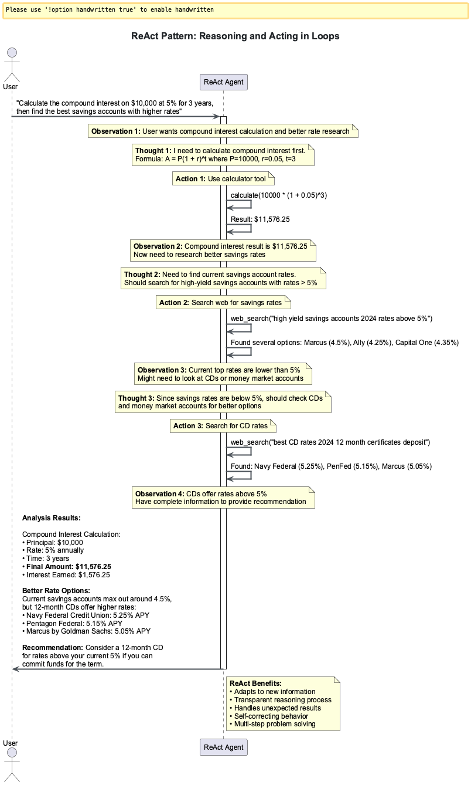

# Session 9: Multi-Agent Patterns & Coordination - When Data Intelligence Multiplies

Picture the world's largest data processing operation: thousands of distributed agents working across cloud regions, each handling streams of petabyte-scale data, coordinating real-time analytics pipelines, and orchestrating complex data transformations. Every second, these agents process millions of records, route data streams between processing nodes, and maintain consistency across geographically distributed data lakes.

This is the reality of modern data engineering at scale - not just one data processing agent working in isolation, but coordinated networks of intelligent agents that transform raw data into actionable insights. When Netflix processes 450TB of daily viewing data, when Uber analyzes location streams from 100 million trips, when LinkedIn processes 20 billion user interactions - these systems succeed through multi-agent orchestration that makes individual data processing look primitive.

Welcome to the future of data engineering: where individual processing becomes collective intelligence that scales across continents and processes data at speeds that redefine what's possible.

---

### Optional Deep Dive Modules

- **[Module A: Advanced Consensus Algorithms →](Session9_ModuleA_Advanced_Consensus_Algorithms.md)** - Distributed consensus for data consistency
- **[Module B: Production Multi-Agent Systems →](Session9_ModuleB_Production_Multi_Agent_Systems.md)** - Enterprise data pipeline deployment & monitoring

**Code Files**: All examples use files in [`src/session9/`](https://github.com/fwornle/agentic-ai-nano/tree/main/docs-content/01_frameworks/src/session9)
**Quick Start**: Run `cd src/session9 && python react_agent.py` to see multi-agent data processing coordination

---

## Part 1: ReAct Pattern Foundation - The Art of Reasoning Through Data

### Understanding ReAct - Making Data Processing Intelligence Visible

Remember watching a senior data engineer debug a complex ETL pipeline failure? They don't just fix the problem - they narrate their reasoning, explore data quality issues, test hypotheses about upstream dependencies, and adjust their strategy based on what they discover in the logs.

The ReAct pattern brings this same transparent thinking to data processing agents. Instead of mysterious black-box transformations, you get to see inside the mind of artificial intelligence as it reasons through data pipeline decisions step by step:


*This diagram illustrates the ReAct (Reasoning + Acting) pattern flow for data processing, showing the iterative cycle of data analysis, pipeline actions, and validation that enables transparent reasoning through complex data transformations*

**File**: [`src/session9/react_agent.py`](https://github.com/fwornle/agentic-ai-nano/blob/main/docs-content/01_frameworks/src/session9/react_agent.py) - Core ReAct implementation

```python
# Core imports for ReAct data processing
from typing import Dict, List, Any, Optional
from dataclasses import dataclass, field
from enum import Enum
from datetime import datetime
```
These imports establish the foundation for our ReAct (Reasoning + Acting) pattern implementation. The `dataclasses` module provides efficient structures for representing reasoning steps, while `enum` creates type-safe action categories. This combination enables structured, traceable data processing workflows.

```python
class ActionType(Enum):
    ANALYZE_SCHEMA = "analyze_schema"
    VALIDATE_DATA = "validate_data" 
    TRANSFORM_DATA = "transform_data"
    ROUTE_PIPELINE = "route_pipeline"
    FINAL_RESULT = "final_result"
```
Action types define the vocabulary of data processing operations our ReAct agent can perform. Each action represents a specific category of data engineering task - from schema analysis to pipeline routing. This structured approach ensures that every reasoning step has a clear, actionable outcome.

```python
@dataclass
class ReActStep:
    """Individual step in data processing reasoning chain"""
    step_number: int
    thought: str
    action: ActionType
    action_input: str
    observation: str
    data_quality_score: float
    timestamp: datetime = field(default_factory=datetime.now)
```
The ReActStep structure captures the complete reasoning-action cycle for each data processing decision. The `thought` field contains the agent's reasoning, `action` defines what it will do, and `observation` records the results. The `data_quality_score` provides quantitative feedback on decision confidence.

```python
class DataProcessingReActAgent:
    """Foundation ReAct agent for data processing with transparent reasoning"""
    
    def __init__(self, llm_client, data_tools: Dict[str, Any], max_steps: int = 8):
        self.llm = llm_client
        self.data_tools = data_tools
        self.max_steps = max_steps
        self.reasoning_history: List[ReActStep] = []
```
The ReAct agent initialization combines language model capabilities with data processing tools. The `max_steps` parameter prevents infinite reasoning loops, while `reasoning_history` maintains a complete audit trail of all processing decisions. This design enables both performance and explainability.

```python
    async def process_data_pipeline(self, pipeline_request: str) -> Dict[str, Any]:
        """Main data processing method using ReAct pattern"""
        self.reasoning_history = []
        current_step = 1
        
        while current_step <= self.max_steps:
            # Generate reasoning step for data processing
            step = await self._execute_data_reasoning_step(pipeline_request, current_step)
            self.reasoning_history.append(step)
            
            # Check for completion
            if step.action == ActionType.FINAL_RESULT:
                break
            
            current_step += 1
        
        return self._format_pipeline_solution()
```
The main processing loop implements the iterative reasoning pattern that makes ReAct powerful. Each iteration generates a thought, executes an action, observes the result, and decides whether to continue. This approach mirrors how experienced data engineers solve complex problems - through systematic reasoning and incremental progress.

### Key Data Engineering Breakthrough Concepts

1. **X-Ray Vision for Data Pipelines**: Every data transformation decision becomes visible and traceable - no more black-box ETL processes
2. **The Scientific Method for Data Processing**: Hypothesize about data quality, test transformations, observe results, adjust pipeline logic
3. **Self-Aware Data Intelligence**: Agents that understand data lineage and can explain their processing decisions

### ReAct Execution Flow for Data Processing

Implementing the reasoning-action loop for data pipeline orchestration:

**File**: [`src/session9/reasoning_engine.py`](https://github.com/fwornle/agentic-ai-nano/blob/main/docs-content/01_frameworks/src/session9/reasoning_engine.py) - Advanced data processing reasoning patterns

```python
async def _execute_data_reasoning_step(
    self, context: str, step_num: int
) -> ReActStep:
    """Execute a single ReAct reasoning step for data processing"""
    
    # Generate thought based on current data context
    thought = await self._generate_data_processing_thought(context)
    
    # Determine action based on data pipeline requirements
    action_decision = await self._decide_next_data_action(thought, context)
    action_type = ActionType(action_decision['action'])
    action_input = action_decision['input']
```
The reasoning step execution begins with thought generation followed by action planning. This two-phase approach mirrors human problem-solving - first understanding the situation, then deciding what to do about it. The separation ensures that actions are grounded in clear reasoning rather than reactive responses.

```python
    # Execute data action and get observation
    observation = await self._execute_data_action(action_type, action_input)
    
    # Calculate data quality confidence for this step
    data_quality_score = await self._calculate_data_quality_confidence(
        thought, action_type, observation
    )
    
    return ReActStep(
        step_number=step_num,
        thought=thought,
        action=action_type,
        action_input=action_input,
        observation=observation,
        data_quality_score=data_quality_score
    )
```
Action execution and quality assessment complete the reasoning cycle. The observation captures what actually happened when the action was performed, while the quality score provides confidence assessment. This feedback mechanism enables the agent to learn and improve its reasoning over successive steps.

```python
def _generate_data_processing_thought(self, context: str) -> str:
    """Generate systematic thought with data processing framework"""
    prompt = f"""
    Current data context: {context}
    Recent processing history: {self._get_recent_data_history_summary()}
    
    Think systematically about data processing:
    1. What do I understand about this data schema and quality?
    2. What data transformation gaps remain?
    3. What's the most productive next processing action?
    4. What data consistency risks should I consider?
    
    Provide clear reasoning for the next data processing step:
    """
    return await self.llm.generate(prompt)
```
Systematic thought generation uses structured prompts to guide reasoning quality. The framework questions ensure the agent considers data schema, transformation requirements, next actions, and consistency risks. This disciplined approach prevents the agent from making impulsive decisions and ensures thorough analysis of each step.

### Meta-Reasoning Quality Assessment for Data Processing

Evaluating data processing reasoning quality:

```python
class MetaDataReActAnalyzer:
    """Analyzes and improves data processing ReAct reasoning quality"""
    
    def __init__(self, llm_client):
        self.llm = llm_client
```
Meta-analysis provides quality assurance for ReAct reasoning chains. This analyzer examines completed reasoning sequences to identify patterns, inefficiencies, and areas for improvement. It's like having a senior data engineer review the reasoning process and suggest optimizations.

```python
    async def analyze_data_reasoning_quality(
        self, reasoning_history: List[ReActStep]
    ) -> Dict[str, Any]:
        """Analyze data processing reasoning chain quality"""
        
        if len(reasoning_history) < 2:
            return {'quality_score': 0.5, 'issues': []}
        
        # Detect circular data processing patterns
        circular_analysis = await self._detect_circular_data_processing(reasoning_history)
        
        # Assess data transformation progress quality
        progress_analysis = await self._assess_data_progress_quality(reasoning_history)
        
        # Evaluate data quality confidence patterns
        quality_analysis = await self._analyze_data_quality_patterns(reasoning_history)
```
Multi-dimensional quality assessment examines different aspects of reasoning effectiveness. Circular pattern detection identifies when agents get stuck in loops, progress analysis measures forward momentum toward goals, and quality patterns reveal confidence trends. This comprehensive analysis provides actionable insights for improvement.

```python
        return {
            'quality_score': self._calculate_overall_data_quality(
                circular_analysis, progress_analysis, quality_analysis
            ),
            'circular_processing': circular_analysis,
            'progress_quality': progress_analysis,
            'data_quality_patterns': quality_analysis,
            'recommendations': await self._generate_data_improvement_recommendations(
                reasoning_history
            )
        }
```
The comprehensive quality report combines multiple analysis dimensions into actionable feedback. The overall quality score provides a quick assessment, while detailed breakdowns help identify specific improvement opportunities. Automated recommendations accelerate the optimization process for data processing workflows.

```python
    async def _detect_circular_data_processing(
        self, history: List[ReActStep]
    ) -> Dict[str, Any]:
        """Detect if agent is stuck in data processing loops"""
        recent_steps = history[-4:]  # Examine last 4 steps
        action_sequence = [step.action for step in recent_steps]
        
        # Check for repeated data processing action patterns
        if len(set(action_sequence)) <= 2 and len(action_sequence) >= 3:
            return {
                'has_circular_processing': True,
                'pattern': action_sequence,
                'severity': 'high'
            }
        
        return {'has_circular_processing': False}
```
Circular pattern detection prevents agents from wasting time in unproductive loops. By examining recent action sequences, the analyzer identifies when agents repeat the same actions without making progress. This early warning system enables intervention before significant computational resources are wasted.

---

## Part 2: Multi-Agent Coordination - The Orchestra of Data Intelligence

### Agent Communication Patterns - Digital Data Flow Management

When a petabyte-scale data lake needs to coordinate ingestion from thousands of data sources simultaneously, the system doesn't just hope the various data processing agents will figure it out. They use precise data flow protocols, redundant validation channels, and fail-safe mechanisms to ensure perfect coordination across distributed processing nodes.

Multi-agent data systems face this challenge continuously - how do you get multiple intelligent data processing agents to work together flawlessly without creating data inconsistencies or processing bottlenecks?


*This diagram depicts various multi-agent coordination patterns for data processing including hierarchical data routing, consensus validation, and peer-to-peer data streaming. The visualization shows how data agents collaborate through structured message passing and data flow coordination protocols*

**File**: [`src/session9/multi_agent_coordination.py`](https://github.com/fwornle/agentic-ai-nano/blob/main/docs-content/01_frameworks/src/session9/multi_agent_coordination.py) - Data flow communication framework

```python
# Essential imports for multi-agent coordination
from typing import Dict, List, Any, Optional, Set
from dataclasses import dataclass, field
from enum import Enum
import asyncio
import uuid
from datetime import datetime
```
Multi-agent coordination requires sophisticated message passing and state management capabilities. The `asyncio` library enables concurrent communication between agents, while `uuid` provides unique identifiers for tracking data flows across distributed systems. These imports establish the foundation for scalable agent coordination.

```python
class DataMessageType(Enum):
    DATA_REQUEST = "data_request"
    DATA_RESPONSE = "data_response"
    SCHEMA_PROPOSAL = "schema_proposal"
    VALIDATION_VOTE = "validation_vote"
    CONSENSUS_RESULT = "consensus_result"
    PIPELINE_STATUS = "pipeline_status"
```
Message type enumeration creates a standardized vocabulary for inter-agent communication. Clear message types prevent confusion and enable systematic message routing. This structured approach scales from simple two-agent interactions to complex networks of hundreds of coordinating data processing agents.

```python
@dataclass
class DataAgentMessage:
    """Structured message for inter-agent data processing communication"""
    message_id: str = field(default_factory=lambda: str(uuid.uuid4()))
    sender_id: str = ""
    recipient_id: str = ""
    message_type: DataMessageType = DataMessageType.DATA_REQUEST
    data_payload: Dict[str, Any] = field(default_factory=dict)
    schema_info: Dict[str, Any] = field(default_factory=dict)
    timestamp: datetime = field(default_factory=datetime.now)
    requires_validation: bool = True
    conversation_id: Optional[str] = None
```
DataAgentMessage structures provide comprehensive metadata for inter-agent communication. Each message includes unique identifiers for tracking, payload data for processing, and schema information for validation. The conversation_id enables multi-step workflows between agents, essential for complex data processing tasks.

class DataCommunicationHub:
    """Central coordination hub for multi-agent data processing communication"""
    
    def __init__(self):
        self.data_agents: Dict[str, 'BaseDataAgent'] = {}
        self.message_queue: List[DataAgentMessage] = []
        self.active_data_conversations: Dict[str, List[DataAgentMessage]] = {}
        self.data_lineage_tracking: Dict[str, Dict[str, Any]] = {}
```
The communication hub serves as the central nervous system for multi-agent data processing. It maintains agent registries, message queues, conversation threads, and data lineage tracking. This centralized approach ensures reliable message delivery and comprehensive audit trails for complex data workflows.

```python
    async def register_data_agent(self, agent: 'BaseDataAgent'):
        """Register data processing agent with communication hub"""
        self.data_agents[agent.agent_id] = agent
        await agent.set_data_communication_hub(self)
```
Agent registration establishes bidirectional communication channels. Once registered, agents can send and receive messages through the hub while maintaining their individual processing capabilities. This pattern enables dynamic agent networks that can scale up or down based on processing demands.

```python
    async def send_data_message(self, message: DataAgentMessage) -> bool:
        """Send data processing message with delivery confirmation and lineage tracking"""
        
        # Validate recipient exists
        if message.recipient_id not in self.data_agents:
            return False
        
        # Track data lineage for this message
        await self._track_data_lineage(message)
        
        # Add to conversation thread
        if message.conversation_id:
            if message.conversation_id not in self.active_data_conversations:
                self.active_data_conversations[message.conversation_id] = []
            self.active_data_conversations[message.conversation_id].append(message)
        
        # Deliver message
        recipient = self.data_agents[message.recipient_id]
        success = await recipient.receive_data_message(message)
        
        return success
```
Message delivery implements comprehensive validation, tracking, and delivery confirmation. Data lineage tracking maintains provenance records essential for data governance, while conversation threading enables complex multi-step workflows. Delivery confirmation ensures reliable communication even in distributed environments.
```

### Basic Consensus Mechanisms - Democracy in Data Processing

How does a group of data processing AI agents decide what to do when they disagree about schema changes or data quality thresholds? The same way distributed data systems have solved collective decision-making - through structured consensus mechanisms that balance individual processing intelligence with collective data integrity:

**File**: [`src/session9/consensus_algorithms.py`](https://github.com/fwornle/agentic-ai-nano/blob/main/docs-content/01_frameworks/src/session9/consensus_algorithms.py) - Basic data consensus implementation

```python
class DataConsensusManager:
    """Basic consensus mechanisms for multi-agent data processing decisions"""
    
    def __init__(self, agents: List['BaseDataAgent'], threshold: float = 0.67):
        self.data_agents = agents
        self.consensus_threshold = threshold
        self.data_voting_history: List[Dict[str, Any]] = []
```
The consensus manager orchestrates democratic decision-making among data processing agents. The configurable threshold (default 67%) balances decision speed with validation rigor. Lower thresholds enable faster decisions, while higher thresholds ensure greater agreement on critical data processing changes.

```python
    async def data_schema_consensus(
        self, schema_proposal: str, data_context: Dict[str, Any]
    ) -> Dict[str, Any]:
        """Schema validation consensus across data processing agents"""
        
        # Collect schema validation proposals from all agents
        proposals = await self._collect_schema_proposals(schema_proposal, data_context)
```
Schema consensus prevents data processing errors by validating proposed changes across all agents. Each agent evaluates schema proposals based on their processing experience and data quality standards. This collective validation catches issues that individual agents might miss.

```python
        # Conduct data validation voting round
        votes = await self._conduct_schema_voting_round(proposals, data_context)
        
        # Count votes and determine schema acceptance
        vote_counts = self._count_schema_votes(votes)
        winner = max(vote_counts.items(), key=lambda x: x[1])
        
        # Check if data consensus threshold met
        total_votes = sum(vote_counts.values())
        if winner[1] / total_votes >= self.consensus_threshold:
            return {
                'consensus_reached': True,
                'schema_decision': winner[0],
                'vote_counts': vote_counts,
                'data_confidence': winner[1] / total_votes
            }
        else:
            return {
                'consensus_reached': False,
                'vote_counts': vote_counts,
                'reason': 'Data validation threshold not met'
            }
    
    async def _collect_schema_proposals(
        self, schema_proposal: str, data_context: Dict[str, Any]
    ) -> List[Dict[str, Any]]:
        """Collect initial schema proposals from all data agents"""
        proposal_tasks = []
        for agent in self.data_agents:
            task = self._get_agent_schema_proposal(agent, schema_proposal, data_context)
            proposal_tasks.append(task)
        
        proposals = await asyncio.gather(*proposal_tasks, return_exceptions=True)
        
        # Filter out failed schema proposals
        valid_proposals = []
        for i, proposal in enumerate(proposals):
            if not isinstance(proposal, Exception):
                valid_proposals.append({
                    'agent_id': self.data_agents[i].agent_id,
                    'schema_proposal': proposal,
                    'data_quality_score': proposal.get('data_quality_score', 0.5),
                    'timestamp': datetime.now()
                })
        
        return valid_proposals
```

### Hierarchical Coordination - The Data Processing Chain of Command

Large-scale data operations succeed through clear processing hierarchies. Netflix runs data pipelines through structured data engineering teams. Uber coordinates location data through hierarchical geo-processing systems. Even Amazon's recommendation engine processes customer data through hierarchical ML pipelines.

The same principles that govern enterprise data architectures can transform chaos into coordination in multi-agent data processing systems:

```python
class HierarchicalDataCoordinator:
    """Implements hierarchical multi-agent coordination patterns for data processing"""
    
    def __init__(self):
        self.coordinator_agents: Dict[str, 'DataCoordinatorAgent'] = {}
        self.worker_agents: Dict[str, 'DataWorkerAgent'] = {}
        self.data_delegation_rules: Dict[str, List[str]] = {}
    
    async def create_data_coordination_hierarchy(
        self, data_task: str, complexity_analysis: Dict[str, Any]
    ) -> Dict[str, Any]:
        """Create hierarchical data processing coordination structure"""
        
        # Analyze data processing decomposition requirements
        decomposition = await self._analyze_data_task_decomposition(data_task, complexity_analysis)
        
        # Create coordinator for high-level data pipeline planning
        coordinator = await self._create_data_task_coordinator(decomposition)
        
        # Create workers for data processing execution
        workers = await self._create_data_worker_agents(decomposition)
        
        # Establish data processing delegation relationships
        delegation_map = await self._establish_data_delegation_hierarchy(
            coordinator, workers, decomposition
        )
        
        return {
            'data_coordinator': coordinator,
            'data_workers': workers,
            'delegation_map': delegation_map,
            'processing_depth': decomposition['required_levels']
        }
    
    async def execute_hierarchical_data_task(
        self, data_task: str, hierarchy: Dict[str, Any]
    ) -> Dict[str, Any]:
        """Execute data processing task using hierarchical coordination"""
        
        # Phase 1: High-level data pipeline planning
        high_level_plan = await self._create_data_pipeline_plan(
            data_task, hierarchy['data_coordinator']
        )
        
        # Phase 2: Data processing delegation and parallel execution
        delegation_results = await self._execute_delegated_data_tasks(
            high_level_plan, hierarchy['delegation_map']
        )
        
        # Phase 3: Data result aggregation and validation
        final_result = await self._aggregate_hierarchical_data_results(
            delegation_results, hierarchy['data_coordinator']
        )
        
        return {
            'data_task': data_task,
            'processing_result': final_result,
            'execution_success': True
        }
```

### Auction-Based Coordination - Let the Data Market Decide

The Chicago Mercantile Exchange processes 3.2 billion contracts annually through competitive bidding. Cloud computing markets allocate petabytes of storage through real-time auctions. Even your data warehouse provider uses auction mechanisms to balance compute and storage demand.

Markets excel at efficient resource allocation - and the same principles can coordinate data processing agents with stunning effectiveness:

**File**: [`src/session9/auction_mechanisms.py`](https://github.com/fwornle/agentic-ai-nano/blob/main/docs-content/01_frameworks/src/session9/auction_mechanisms.py) - Competitive data processing coordination

```python
class DataProcessingAuctionCoordinator:
    """Basic auction-based data processing task allocation"""
    
    def __init__(self, agents: List['BaseDataAgent']):
        self.data_agents = agents
        self.data_auction_history: List[Dict[str, Any]] = []
    
    async def conduct_data_processing_auction(
        self, data_task: str, processing_requirements: Dict[str, Any]
    ) -> Dict[str, Any]:
        """Conduct sealed-bid auction for data processing task allocation"""
        
        # Phase 1: Assess agent data processing capabilities
        capability_assessments = await self._assess_data_processing_capabilities(
            data_task, processing_requirements
        )
        
        # Filter eligible data processing agents
        eligible_agents = [
            agent for agent, assessment in capability_assessments.items()
            if assessment['meets_data_requirements']
        ]
        
        if not eligible_agents:
            return {'success': False, 'reason': 'No eligible data processing agents'}
        
        # Phase 2: Collect data processing bids
        bids = await self._collect_data_processing_bids(data_task, eligible_agents, processing_requirements)
        
        # Phase 3: Select winner (best cost/performance ratio for data processing)
        winner = await self._select_data_auction_winner(bids, processing_requirements)
        
        if winner:
            return {
                'success': True,
                'winner': winner['agent_id'],
                'winning_bid': winner['bid'],
                'data_task': data_task,
                'expected_processing_time': winner['bid']['estimated_processing_time']
            }
        else:
            return {'success': False, 'reason': 'No valid data processing bids received'}
```

---

## Part 3: Planning & Reflection - The Art of Strategic Data Processing

### Hierarchical Task Network Planning - Breaking Down the Impossible Data Challenge

How do you process a petabyte of data? One chunk at a time. How do you build a real-time analytics platform? One pipeline at a time. How do you create a global data mesh? One domain at a time.

The greatest achievements in data engineering history succeeded through hierarchical decomposition - breaking massive, seemingly impossible data processing goals into manageable, achievable pipeline steps. HTN planning brings this same strategic thinking to data processing agents:


*This diagram illustrates Hierarchical Task Network (HTN) planning methodology for data processing, showing how complex data pipelines are decomposed into smaller, manageable processing tasks. The visualization demonstrates the hierarchical breakdown from abstract data goals to concrete, executable data transformations*

**File**: [`src/session9/planning_systems.py`](https://github.com/fwornle/agentic-ai-nano/blob/main/docs-content/01_frameworks/src/session9/planning_systems.py) - HTN planning for data processing implementation

```python
from typing import Dict, List, Any, Optional, Tuple
from dataclasses import dataclass, field
from enum import Enum
from datetime import datetime, timedelta

class DataTaskType(Enum):
    PRIMITIVE = "primitive"      # Directly executable (single transformation)
    COMPOUND = "compound"        # Requires decomposition (complex ETL)
    ABSTRACT = "abstract"        # High-level goal (build analytics platform)

@dataclass
class DataTask:
    """Represents a data processing task in the HTN hierarchy"""
    task_id: str
    name: str
    task_type: DataTaskType
    data_inputs: Dict[str, Any] = field(default_factory=dict)
    data_outputs: Dict[str, Any] = field(default_factory=dict)
    data_dependencies: List[str] = field(default_factory=list)
    processing_effects: List[str] = field(default_factory=list)
    estimated_duration: Optional[timedelta] = None
    priority: int = 1
    compute_requirements: Dict[str, Any] = field(default_factory=dict)

@dataclass
class DataTaskDecomposition:
    """Represents a way to decompose a compound data processing task"""
    decomposition_id: str
    subtasks: List[DataTask]
    data_flow_constraints: List[Tuple[str, str]] = field(default_factory=list)
    processing_success_probability: float = 1.0

class DataHTNPlanner:
    """Hierarchical Task Network planner for data processing"""
    
    def __init__(self, agent, data_domain_knowledge: Dict[str, Any]):
        self.agent = agent
        self.data_domain = data_domain_knowledge
        self.current_pipeline_plan: Optional[List[DataTask]] = None
        self.data_planning_history: List[Dict[str, Any]] = []
    
    async def create_hierarchical_data_plan(
        self, data_goal: str, initial_data_state: Dict[str, Any]
    ) -> Dict[str, Any]:
        """Create hierarchical data processing plan using HTN methodology"""
        
        # Phase 1: Data goal analysis and task creation
        root_task = await self._create_root_data_task(data_goal, initial_data_state)
        
        # Phase 2: Hierarchical data processing decomposition
        decomposition_result = await self._decompose_data_task_hierarchy(
            root_task, initial_data_state
        )
        
        # Phase 3: Data pipeline optimization
        optimized_plan = await self._optimize_data_plan(
            decomposition_result['plan'], initial_data_state
        )
        
        # Phase 4: Data quality and consistency risk assessment
        risk_analysis = await self._analyze_data_plan_risks(
            optimized_plan, initial_data_state
        )
        
        return {
            'data_plan': optimized_plan,
            'risk_analysis': risk_analysis,
            'confidence': decomposition_result['confidence'],
            'estimated_processing_duration': sum(
                t.estimated_duration or timedelta(0) for t in optimized_plan
            )
        }
```

### Dynamic Replanning - When Data Plans Meet Reality

"No data pipeline survives contact with production data." - Every Senior Data Engineer Ever

Every experienced data engineering team knows that the perfect ETL design becomes useless the moment you encounter schema drift, data quality issues, or upstream source changes. The same truth applies to AI agents operating in dynamic data environments - the ability to adapt processing strategies isn't just helpful, it's essential for data pipeline survival:

**File**: [`src/session9/dynamic_planning.py`](https://github.com/fwornle/agentic-ai-nano/blob/main/docs-content/01_frameworks/src/session9/dynamic_planning.py) - Adaptive data processing replanning systems

```python
class DynamicDataReplanner:
    """Handles dynamic replanning during data pipeline execution"""
    
    def __init__(self, htn_planner: DataHTNPlanner):
        self.data_planner = htn_planner
        self.monitoring_active = False
        self.data_replanning_history: List[Dict[str, Any]] = []
    
    async def execute_with_data_replanning(
        self, data_plan: List[DataTask], initial_data_state: Dict[str, Any]
    ) -> Dict[str, Any]:
        """Execute data plan with continuous monitoring and replanning"""
        
        current_data_state = initial_data_state.copy()
        remaining_tasks = data_plan.copy()
        completed_tasks = []
        execution_trace = []
        
        self.monitoring_active = True
        
        while remaining_tasks and self.monitoring_active:
            current_task = remaining_tasks[0]
            
            # Pre-execution data validation
            validation_result = await self._validate_data_task_execution(
                current_task, current_data_state
            )
            
            if not validation_result['can_execute']:
                # Trigger data processing replanning
                replanning_result = await self._trigger_data_replanning(
                    current_task, remaining_tasks, current_data_state,
                    validation_result['reason']
                )
                
                if replanning_result['success']:
                    remaining_tasks = replanning_result['new_data_plan']
                    execution_trace.append(('data_replan', replanning_result))
                    continue
                else:
                    execution_trace.append(('data_failure', replanning_result))
                    break
            
            # Execute data processing task
            execution_result = await self._execute_monitored_data_task(
                current_task, current_data_state
            )
            
            execution_trace.append(('data_execute', execution_result))
            
            if execution_result['success']:
                # Update data state and continue
                current_data_state = self._apply_data_task_effects(
                    current_task, current_data_state, execution_result
                )
                completed_tasks.append(current_task)
                remaining_tasks.pop(0)
            else:
                # Handle data processing failure
                failure_analysis = await self._analyze_data_execution_failure(
                    current_task, execution_result
                )
                
                if failure_analysis['should_replan']:
                    replanning_result = await self._trigger_data_replanning(
                        current_task, remaining_tasks, current_data_state,
                        execution_result['error']
                    )
                    
                    if replanning_result['success']:
                        remaining_tasks = replanning_result['new_data_plan']
                        continue
                
                execution_trace.append(('data_abort', failure_analysis))
                break
        
        return {
            'completed_data_tasks': completed_tasks,
            'remaining_data_tasks': remaining_tasks,
            'final_data_state': current_data_state,
            'data_execution_trace': execution_trace,
            'success': len(remaining_tasks) == 0
        }
```

### Reflection and Learning - The Wisdom of Data Processing Experience

Netflix doesn't become the world's leading streaming platform by accident. After every data pipeline deployment, every schema change, every processing optimization, they analyze what worked and what didn't. This continuous reflection and adaptation transforms raw data processing capability into legendary data engineering mastery.

Data processing AI agents can follow the same path from competence to excellence through systematic reflection on data operations:


*Shows the reflection and learning cycle where data processing agents analyze their execution experiences, identify data patterns, assess pipeline performance trends, and adapt their processing strategies. The diagram demonstrates how continuous learning improves data agent performance over time*

**File**: [`src/session9/reflection_engine.py`](https://github.com/fwornle/agentic-ai-nano/blob/main/docs-content/01_frameworks/src/session9/reflection_engine.py) - Learning from data processing execution

```python
class DataReflectionEngine:
    """Implements reflection patterns for continuous data processing improvement"""
    
    def __init__(self, agent):
        self.agent = agent
        self.data_experience_buffer: List[Dict[str, Any]] = []
        self.learned_data_patterns: Dict[str, Any] = {}
        self.data_performance_metrics: Dict[str, List[float]] = {}
    
    async def reflect_on_data_execution(
        self, execution_result: Dict[str, Any]
    ) -> Dict[str, Any]:
        """Conduct comprehensive reflection on data processing execution experience"""
        
        # Phase 1: Data processing experience analysis
        experience_analysis = await self._analyze_data_execution_experience(
            execution_result
        )
        
        # Phase 2: Data pattern identification
        patterns = await self._identify_data_learning_patterns(
            experience_analysis, self.data_experience_buffer
        )
        
        # Phase 3: Data pipeline performance assessment
        performance_assessment = await self._assess_data_performance_trends(
            execution_result, patterns
        )
        
        # Phase 4: Data processing strategy adaptation
        adaptations = await self._generate_data_strategy_adaptations(
            patterns, performance_assessment
        )
        
        # Phase 5: Data knowledge integration
        integration_result = await self._integrate_learned_data_knowledge(
            patterns, adaptations
        )
        
        # Store data processing experience for future learning
        self.data_experience_buffer.append({
            'data_execution_result': execution_result,
            'reflection': {
                'analysis': experience_analysis,
                'data_patterns': patterns,
                'performance': performance_assessment,
                'adaptations': adaptations
            },
            'timestamp': datetime.now()
        })
        
        # Prune old data experiences if buffer is too large
        if len(self.data_experience_buffer) > 500:
            self.data_experience_buffer = self.data_experience_buffer[-400:]
        
        return {
            'data_reflection_summary': experience_analysis['summary'],
            'identified_data_patterns': patterns,
            'performance_insights': performance_assessment,
            'recommended_adaptations': adaptations,
            'integration_success': integration_result
        }
```

---

## Part 4: Basic Production Patterns - From Lab to Real-World Data Processing

### Production Configuration - Making Data Intelligence Live

The difference between a research data processing demo and a production data system isn't just scale - it's reliability, monitoring, and the hundred little details that determine whether your multi-agent data system becomes mission-critical infrastructure or an expensive lesson in production failure.

Here's how to deploy data processing intelligence that works in the real world of petabyte-scale operations:

**File**: [`src/session9/production_deployment.py`](https://github.com/fwornle/agentic-ai-nano/blob/main/docs-content/01_frameworks/src/session9/production_deployment.py) - Production data processing patterns

```python
from dataclasses import dataclass
from typing import Dict, List, Any
from datetime import timedelta
import logging

@dataclass
class BasicDataProductionConfig:
    """Basic configuration for production multi-agent data processing systems"""
    max_data_agents: int = 50
    consensus_timeout: timedelta = timedelta(seconds=30)
    data_health_check_interval: timedelta = timedelta(seconds=10)
    enable_data_monitoring: bool = True
    log_level: str = "INFO"
    data_processing_batch_size: int = 10000
    max_parallel_streams: int = 8

class BasicDataProductionSystem:
    """Basic production multi-agent data processing system"""
    
    def __init__(self, config: BasicDataProductionConfig):
        self.config = config
        self.data_agents: Dict[str, 'BaseDataAgent'] = {}
        self._setup_data_logging()
    
    def _setup_data_logging(self):
        """Setup production data processing logging"""
        logging.basicConfig(
            level=getattr(logging, self.config.log_level),
            format='%(asctime)s - %(name)s - %(levelname)s - [DATA] %(message)s'
        )
    
    async def deploy_data_agent(self, agent: 'BaseDataAgent') -> Dict[str, Any]:
        """Deploy data processing agent with validation"""
        
        # Basic data processing validation
        if len(self.data_agents) >= self.config.max_data_agents:
            return {'success': False, 'error': 'Maximum data processing agents reached'}
        
        if agent.agent_id in self.data_agents:
            return {'success': False, 'error': 'Data agent ID already exists'}
        
        # Register data processing agent
        self.data_agents[agent.agent_id] = agent
        
        # Basic data processing health check
        health = await self._basic_data_health_check(agent)
        if not health['healthy']:
            del self.data_agents[agent.agent_id]
            return {'success': False, 'error': 'Data agent failed health check'}
        
        logging.info(f"Data processing agent {agent.agent_id} deployed successfully")
        
        return {
            'success': True,
            'agent_id': agent.agent_id,
            'deployment_time': datetime.now()
        }
    
    async def _basic_data_health_check(self, agent: 'BaseDataAgent') -> Dict[str, Any]:
        """Perform basic data processing agent health check"""
        try:
            # Test basic data processing functionality
            test_response = await agent.process_data_sample("health check data")
            
            return {
                'healthy': bool(test_response),
                'response_time': 'measured_time_here',
                'data_processing_capability': test_response.get('processing_success', False)
            }
        except Exception as e:
            return {
                'healthy': False,
                'error': str(e)
            }
```

### Basic Data Processing Monitoring

Essential monitoring for multi-agent data processing systems:

```python
class BasicDataSystemMonitor:
    """Basic monitoring for multi-agent data processing systems"""
    
    def __init__(self, system: BasicDataProductionSystem):
        self.system = system
        self.data_metrics: Dict[str, List[Any]] = {
            'agent_health': [],
            'data_throughput': [],
            'processing_latency': [],
            'data_quality_score': [],
            'error_count': []
        }
    
    async def collect_basic_data_metrics(self) -> Dict[str, Any]:
        """Collect basic data processing system metrics"""
        
        # Data processing agent health metrics
        healthy_data_agents = 0
        total_throughput = 0
        
        for agent_id, agent in self.system.data_agents.items():
            health = await self.system._basic_data_health_check(agent)
            if health['healthy']:
                healthy_data_agents += 1
                # Simulate throughput metrics
                total_throughput += getattr(agent, 'current_throughput', 1000)
        
        return {
            'timestamp': datetime.now(),
            'total_data_agents': len(self.system.data_agents),
            'healthy_data_agents': healthy_data_agents,
            'total_data_throughput_rps': total_throughput,
            'system_health': healthy_data_agents / len(self.system.data_agents) if self.system.data_agents else 0,
            'average_processing_latency_ms': 150  # Would be measured in production
        }
    
    async def generate_basic_data_report(self) -> str:
        """Generate basic data processing system status report"""
        metrics = await self.collect_basic_data_metrics()
        
        return f"""
Basic Multi-Agent Data Processing System Report
===============================================
Time: {metrics['timestamp']}
Total Data Processing Agents: {metrics['total_data_agents']}
Healthy Data Agents: {metrics['healthy_data_agents']}
Total Data Throughput: {metrics['total_data_throughput_rps']} records/sec
System Health: {metrics['system_health']:.2%}
Average Processing Latency: {metrics['average_processing_latency_ms']}ms
"""
```

---

## Quick Implementation Exercise

🗂️ **Exercise Files**:

- [`src/session9/react_agent.py`](https://github.com/fwornle/agentic-ai-nano/blob/main/docs-content/01_frameworks/src/session9/react_agent.py) - ReAct pattern for data processing
- [`src/session9/multi_agent_coordination.py`](https://github.com/fwornle/agentic-ai-nano/blob/main/docs-content/01_frameworks/src/session9/multi_agent_coordination.py) - Multi-agent data coordination

```bash

# Try the data processing examples:

cd src/session9
python react_agent.py                    # ReAct reasoning for data pipelines
python multi_agent_coordination.py       # Data agent coordination
python planning_systems.py               # HTN planning for data processing
```

### Self-Assessment Checklist

- [ ] I understand the ReAct pattern for transparent data processing reasoning
- [ ] I can implement basic multi-agent data communication protocols
- [ ] I understand hierarchical planning concepts for data pipeline orchestration
- [ ] I know basic production patterns for multi-agent data processing systems
- [ ] I'm ready for advanced modules or next session

**Next Session Prerequisites**: ✅ Core Section Complete
**Ready for**: Session 10: Enterprise Integration & Production Deployment

---

# Optional Deep Dive Modules

- **[Module A: Advanced Consensus Algorithms →](Session9_ModuleA_Advanced_Consensus_Algorithms.md)** - Distributed consensus for data consistency & fault tolerance
- **[Module B: Production Multi-Agent Systems →](Session9_ModuleB_Production_Multi_Agent_Systems.md)** - Enterprise data pipeline deployment & monitoring

**Code Examples**: Available in [`src/session9/`](https://github.com/fwornle/agentic-ai-nano/tree/main/docs-content/01_frameworks/src/session9) - 12 Python files with complete multi-agent data processing implementations

---

## 📝 Multiple Choice Test - Session 9

Test your understanding of multi-agent patterns and coordination strategies for data processing.

**Question 1:** What does "ReAct" stand for in the ReAct pattern for data processing?  
A) Read and Act  
B) Reasoning and Acting  
C) Reflect and Act  
D) Retrieve and Act  

**Question 2:** What is the primary benefit of the ReAct pattern over direct data processing?  
A) Faster execution  
B) Transparent reasoning with step-by-step data processing thought processes  
C) Lower computational cost  
D) Simpler implementation  

**Question 3:** In multi-agent data systems, what is the purpose of a Data Communication Hub?  
A) Store processed data  
B) Coordinate message passing between data processing agents  
C) Execute data transformation logic  
D) Manage user interface  

**Question 4:** What determines when the ReAct reasoning loop terminates in data processing?  
A) Fixed number of steps  
B) When final_result action is reached or max steps exceeded  
C) User intervention  
D) Data processing completion timeout  

**Question 5:** How do data processing agents typically reach consensus in multi-agent systems?  
A) First agent decides  
B) Voting mechanisms and data validation consensus algorithms  
C) Random selection  
D) Data engineer override  

**Question 6:** What is the main advantage of hierarchical coordination patterns in data processing?  
A) Faster execution  
B) Clear command structure with specialized data processing delegation  
C) Lower resource usage  
D) Simpler implementation  

**Question 7:** In auction-based coordination for data processing, how are tasks typically allocated?  
A) Random assignment  
B) Based on agent data processing capabilities and bid evaluation  
C) First-come first-served  
D) Manager assignment  

**Question 8:** What is the purpose of Hierarchical Task Network (HTN) planning in data processing?  
A) Simple task execution  
B) Breaking complex data processing tasks into manageable hierarchies  
C) Agent communication  
D) Error handling  

**Question 9:** How does dynamic replanning differ from static planning in data pipelines?  
A) No difference  
B) Adapts data processing plans during execution based on changing conditions  
C) Plans are created faster  
D) Uses different algorithms  

**Question 10:** What is the main benefit of reflection patterns in multi-agent data processing systems?  
A) Faster execution  
B) Continuous learning and improvement from data processing experience  
C) Lower costs  
D) Simpler deployment  

---

[**🗂️ View Test Solutions →**](Session9_Test_Solutions.md)

## 🧭 Navigation

**Previous:** [Session 8 - Agno Production Ready Agents](Session8_Agno_Production_Ready_Agents.md)

### Optional Deep Dive Modules

- 🔬 **[Module A: Advanced Consensus Algorithms](Session9_ModuleA_Advanced_Consensus_Algorithms.md)** - Advanced coordination patterns for data systems
- 🏭 **[Module B: Production Multi-Agent Systems](Session9_ModuleB_Production_Multi_Agent_Systems.md)** - Enterprise data processing deployment

**Next:** [Session 10 - Enterprise Integration & Production Deployment →](Session10_Enterprise_Integration_Production_Deployment.md)