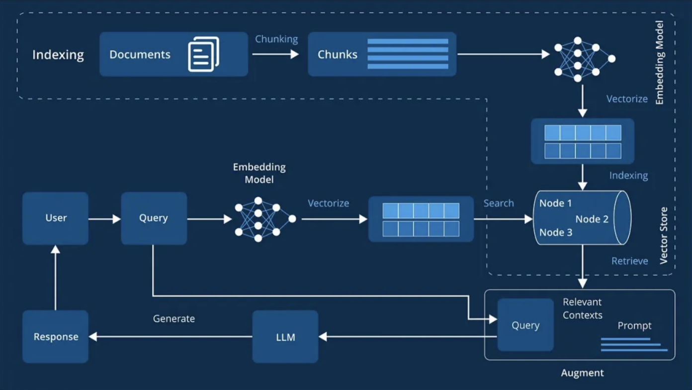
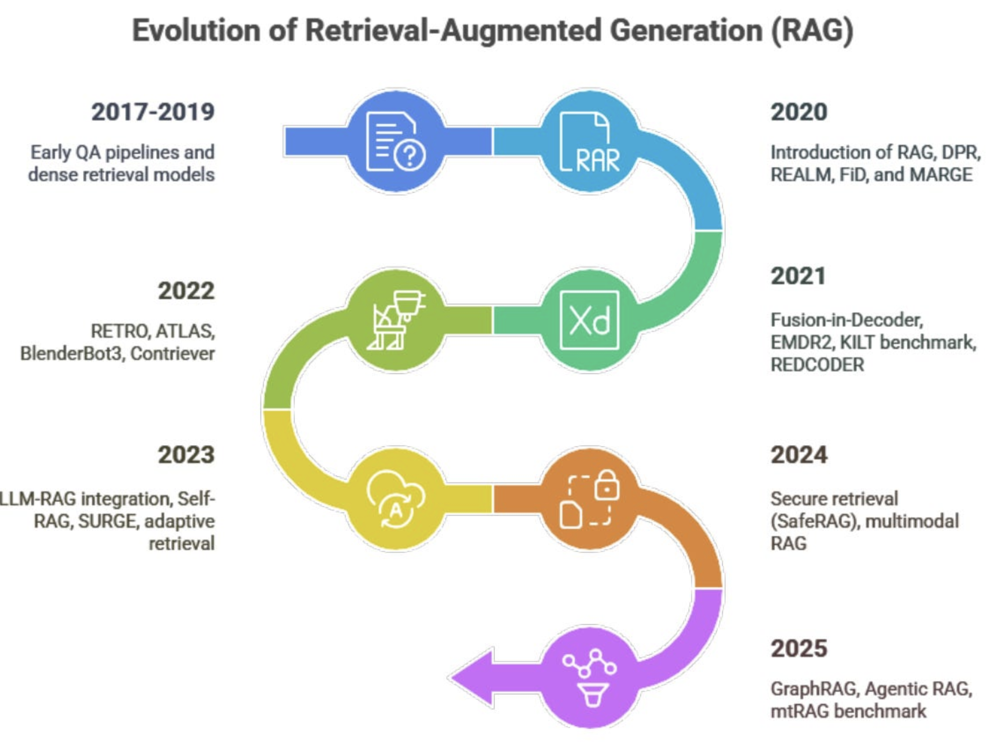

# Session 0: Introduction to RAG Architecture

Every seasoned engineer has faced the fundamental problem: LLMs are brilliant at reasoning but limited by their training cutoff. They hallucinate facts, can't access real-time information, and struggle with domain-specific knowledge that wasn't well-represented in their training data. RAG (Retrieval-Augmented Generation) emerged as the architectural solution that preserves the reasoning capabilities of LLMs while grounding them in factual, up-to-date information.

This session walks you through RAG's three-stage architecture, traces its evolution from simple keyword search to sophisticated multi-agent systems, and provides engineering decision frameworks for when RAG is the right choice versus alternatives like fine-tuning or function calling.


*Figure 1: The RAG architecture that revolutionized AI knowledge systems - combining the reasoning power of LLMs with precise information retrieval*

---

## Part 1: RAG Architecture Fundamentals

Understanding RAG means understanding how to architect systems that connect the reasoning capabilities of LLMs with external knowledge sources in a scalable, maintainable way.

### The Three-Stage RAG Pipeline

Every RAG system follows a consistent three-stage architecture that transforms static knowledge into dynamic, queryable intelligence:

### 1. Indexing Stage (Offline Preparation)

The indexing stage determines the quality ceiling of your entire RAG system. Poor indexing creates problems that no amount of sophisticated retrieval can fix:

```python
# RAG Indexer - Simple Implementation

class RAGIndexer:
    def __init__(self, embedding_model, vector_store):
        self.embedding_model = embedding_model  # Converts text to vectors
        self.vector_store = vector_store        # Stores and searches vectors
    
    def process_documents(self, documents):
        # Clean and split documents into chunks
        chunks = self.chunk_documents(documents)
        
        # Convert text to searchable vectors
        embeddings = self.embedding_model.embed(chunks)
        
        # Store for fast retrieval
        self.vector_store.add(chunks, embeddings)
```

This implementation handles the critical transformation from unstructured documents to searchable vectors. The embedding model choice determines semantic understanding quality - models trained on domain-specific data perform significantly better than general-purpose embeddings.

#### Code Explanation

- **Line 3-4**: Initialize with an embedding model (like OpenAI's text-embedding-ada-002) and vector database (like Pinecone or Chroma)
- **Line 7**: Split documents into manageable chunks (typically 500-1000 tokens each)
- **Line 10**: Convert text chunks into dense vector representations that capture semantic meaning
- **Line 13**: Store vectors in a database optimized for similarity search

### Key Indexing Operations

- **Document Parsing**: Extract text from PDFs, HTML, Word docs
- **Text Chunking**: Split into retrievable segments while preserving context
- **Vector Embedding**: Transform text into dense numerical representations
- **Database Storage**: Index vectors for efficient similarity search

### 2. Retrieval Stage (Real-time Query Processing)

The retrieval stage must balance speed and accuracy - returning relevant context quickly enough for real-time applications:

```python
# RAG Retriever - Query Processing

class RAGRetriever:
    def __init__(self, embedding_model, vector_store, top_k=5):
        self.embedding_model = embedding_model  # Same model as indexing
        self.vector_store = vector_store        # Our indexed knowledge
        self.top_k = top_k                      # Number of chunks to retrieve
    
    def retrieve_context(self, user_query):
        # Convert user question to vector
        query_vector = self.embedding_model.embed(user_query)
        
        # Find most similar document chunks
        relevant_chunks = self.vector_store.similarity_search(
            query_vector, k=self.top_k
        )
        
        # Return best matching content
        return self.rank_and_filter(relevant_chunks)
```

Critical design decision: using the same embedding model for both indexing and retrieval ensures vector compatibility. Different models create incompatible vector spaces, leading to poor retrieval performance.

#### Code Explanation

- **Line 3-5**: Configure retriever with same embedding model as indexing (critical for compatibility)
- **Line 9**: Convert user's natural language query into the same vector space as stored documents
- **Line 12-15**: Search vector database for chunks with highest semantic similarity
- **Line 18**: Apply additional ranking and quality filtering to improve results

### Key Retrieval Operations

- **Query Embedding**: Transform user questions into searchable vectors
- **Similarity Search**: Find semantically related content using cosine similarity
- **Relevance Ranking**: Order results by relevance scores
- **Quality Filtering**: Remove low-quality or off-topic chunks

### 3. Generation Stage (Response Synthesis)

The generation stage requires careful prompt engineering to ensure LLMs stay grounded in retrieved context rather than relying on potentially outdated training data:

```python
# RAG Generator - Response Synthesis

class RAGGenerator:
    def __init__(self, llm_model):
        self.llm_model = llm_model  # GPT-4, Claude, etc.
    
    def generate_response(self, user_query, context_chunks):
        # Build context-enhanced prompt
        augmented_prompt = f"""
        Context: {self.format_context(context_chunks)}
        
        Question: {user_query}
        
        Answer based only on the provided context:
        """
        
        # Generate grounded response
        response = self.llm_model.generate(augmented_prompt)
        return self.validate_response(response, context_chunks)
```

The prompt structure is crucial - explicitly instructing the LLM to base answers on provided context prevents it from hallucinating information from training data that may be incorrect or outdated.

#### Code Explanation

- **Line 3**: Initialize with chosen LLM (GPT-4, Claude, Llama, etc.)
- **Line 7-13**: Create prompt that combines user question with retrieved context
- **Line 16**: Generate response using the enhanced prompt that grounds the LLM in factual content
- **Line 17**: Validate that the response actually uses the provided context

### Critical Generation Principles

- **Context Grounding**: LLM must base answers on retrieved information, not training data
- **Prompt Engineering**: Well-designed prompts ensure focus on provided context
- **Response Validation**: Check that outputs are actually grounded in retrieved content
- **Source Attribution**: Include references to original documents when possible

### **PARTICIPANT PATH**: Implementing a Complete RAG Pipeline

Building on the three-stage foundation, here's how these components integrate into a functioning system:

```python
# Complete RAG System Integration

class BasicRAGSystem:
    def __init__(self, embedding_model, vector_store, llm):
        self.indexer = RAGIndexer(embedding_model, vector_store)
        self.retriever = RAGRetriever(embedding_model, vector_store)
        self.generator = RAGGenerator(llm)
    
    def process_documents(self, documents):
        """Index documents for retrieval"""
        return self.indexer.process_documents(documents)
    
    def query(self, user_question):
        """Complete RAG pipeline: retrieve + generate"""
        # Retrieve relevant context
        context = self.retriever.retrieve_context(user_question)
        
        # Generate grounded response
        return self.generator.generate_response(user_question, context)
```

This architecture ensures consistent embedding models across indexing and retrieval while providing a clean interface for both document processing and querying.

### **IMPLEMENTER PATH**: Advanced Architecture Patterns

Enterprise RAG systems require additional considerations around scalability, monitoring, and multi-tenancy. See optional modules below for production-grade architectures.

---

## Part 2: RAG Evolution Timeline (2017-2025)

Understanding RAG's evolution helps engineers appreciate why current architectures exist and where the field is heading. Each phase solved specific technical limitations of the previous generation.


*Figure 2: The evolution of RAG from simple keyword search to sophisticated agentic systems*

### Phase 1: Early Dense Retrieval (2017-2019)

The foundational shift from keyword matching to semantic understanding using dense vector embeddings addressed the brittleness of traditional search systems.

### Key Developments

- **DrQA (2017)**: Exposed limitations of keyword-based search
- **ORQA (2019)**: Proved dense retrieval outperformed traditional methods
- **FAISS**: Made large-scale vector search practical

Dense embeddings solved the vocabulary mismatch problem - understanding that "car" and "automobile" refer to the same concept, something keyword search couldn't handle.

### Technical Foundation

```python
# Early Dense Retrieval (2017-2019)

class EarlyDenseRetrieval:
    def __init__(self, bi_encoder):
        self.encoder = bi_encoder  # Separate encoding for queries and documents
    
    def retrieve(self, query, documents):
        # Simple two-stage process
        query_vector = self.encoder.encode_query(query)
        doc_vectors = self.encoder.encode_documents(documents)
        
        # Basic cosine similarity
        return self.cosine_similarity_search(query_vector, doc_vectors)
```

This bi-encoder approach provided the foundation for all modern RAG systems, though early implementations lacked the sophistication needed for production use.

### Phase 2: RAG Foundation (2020)

2020 established RAG as the standard architecture for knowledge-grounded generation, moving from research prototype to practical implementation.

### Key Papers

- **DPR (Dense Passage Retrieval)**: Created the dual-encoder framework still used today
- **RAG Paper**: Formalized the three-stage architecture (Index→Retrieve→Generate)
- **REALM**: Integrated retrieval during model training
- **FiD (Fusion-in-Decoder)**: Combined information from multiple sources effectively

This phase proved that RAG-enhanced models could match larger model performance while improving accuracy and providing better transparency.

**2020 RAG Architecture:**

```python
# Foundational RAG (2020)

class FoundationalRAG:
    def __init__(self, retriever, generator):
        self.retriever = retriever    # DPR-style dual encoder
        self.generator = generator    # BART/T5 with cross-attention
    
    def generate(self, query):
        # Retrieve multiple relevant passages
        passages = self.retriever.retrieve(query, k=5)
        
        # Fuse information from all passages
        return self.generator.fuse_and_generate(query, passages)
```

The separation of retrieval and generation components allowed independent optimization of each stage, setting the architectural pattern still used in modern systems.

#### Code Explanation

- **Line 3-4**: Separate components for retrieval and generation, allowing optimization of each
- **Line 8**: Retrieve multiple passages to get diverse perspectives on the question
- **Line 11**: Fusion-in-Decoder approach combines information from all passages intelligently

### Phase 3: Enhanced Fusion (2021-2022)

RAG transitioned from research to production with the widespread availability of powerful LLMs like GPT-3.5 and GPT-4.

### Key Innovations

- **RAG-Fusion**: Generated multiple query variations to improve recall
- **HyDE (Hypothetical Document Embeddings)**: Created hypothetical answers to bridge query-document gaps
- **Reciprocal Rank Fusion**: Combined results from multiple search strategies
- **Hallucination Reduction**: Achieved 30-50% reduction in factual errors

### Enhanced RAG Architecture

```python
# Enhanced RAG (2021-2022)

class EnhancedRAG:
    def __init__(self, llm, vector_store):
        self.llm = llm              # GPT-4, Claude, etc.
        self.vector_store = vector_store
    
    def fusion_generate(self, user_query):
        # Generate multiple query variants
        query_variants = [
            user_query,
            self.llm.rephrase(user_query),
            self.llm.expand_with_context(user_query)
        ]
        
        # Retrieve for each variant
        all_contexts = []
        for variant in query_variants:
            contexts = self.vector_store.search(variant)
            all_contexts.extend(contexts)
        
        # Combine using Reciprocal Rank Fusion
        fused_context = self.reciprocal_rank_fusion(all_contexts)
        
        # Generate with enhanced context
        return self.llm.generate_with_context(user_query, fused_context)
```

This multi-query approach dramatically improved retrieval coverage by addressing the inherent ambiguity in how users phrase questions versus how information is written in documents.

### Phase 4: Adaptive Systems (2023)

RAG systems gained self-evaluation capabilities, moving from static pipelines to adaptive systems that could assess and improve their own performance.

### Key Concepts

- **Self-RAG**: Systems that critique their own outputs and decide when to retrieve more
- **Corrective RAG (CRAG)**: Quality assessment before using retrieved information
- **Adaptive Retrieval**: Intelligent decisions about when retrieval is actually needed
- **Critique Tokens**: Confidence and relevance indicators

The paradigm shifted from "always retrieve" to "intelligently decide when and how to retrieve based on query characteristics and confidence levels".

### Adaptive RAG Architecture

```python
# Adaptive RAG (2023) - Self-Correcting Systems

class AdaptiveRAG:
    def __init__(self, llm, retriever, critic):
        self.llm = llm
        self.retriever = retriever
        self.critic = critic      # Quality assessment model
    
    def smart_generate(self, query):
        # Step 1: Decide if retrieval is needed
        if self.critic.needs_retrieval(query):
            context = self.retriever.retrieve(query)
            
            # Step 2: Assess context quality
            quality_score = self.critic.assess_relevance(query, context)
            
            # Step 3: Corrective retrieval if needed
            if quality_score < 0.7:  # Threshold for quality
                context = self.corrective_retrieve(query, context)
        else:
            context = None  # Use parametric knowledge only
        
        # Step 4: Generate with self-reflection
        response = self.llm.generate_with_critique(query, context)
        
        # Step 5: Refine if necessary
        if self.critic.needs_improvement(response):
            return self.refine_response(query, context, response)
        
        return response
```

This self-correcting architecture represents a significant evolution toward autonomous quality management, reducing the need for human oversight in production systems.

### Phase 5: Graph-Based and Agentic (2024-2025)

Current state-of-the-art systems orchestrate multiple specialized AI agents with knowledge graphs to handle complex, multi-step reasoning tasks.

### Key Capabilities

- **Agent Orchestration**: Specialized agents for query planning, retrieval, reasoning, and synthesis
- **Knowledge Graph Integration**: Relationship-aware retrieval that follows entity connections
- **Multi-Hop Reasoning**: Connect information across multiple logical steps
- **Parallel Processing**: Multiple agents working simultaneously on different aspects

Systems like Microsoft's GraphRAG demonstrate how complex questions requiring multi-step information synthesis can be handled automatically.

### **PARTICIPANT PATH**: Understanding Agentic RAG Architecture

Modern multi-agent systems represent the current frontier in RAG development:

```python
# Agentic RAG (2024-2025) - Multi-Agent Coordination

class AgenticRAG:
    def __init__(self, knowledge_graph, vector_store):
        self.kg = knowledge_graph
        self.vector_store = vector_store
        
        # Specialized agent team
        self.query_planner = QueryPlanningAgent()
        self.retriever = AdaptiveRetrievalAgent()
        self.reasoner = MultiHopReasoningAgent()
        self.synthesizer = ResponseSynthesisAgent()
    
    async def complex_query(self, user_question):
        # Step 1: Break down complex question
        plan = await self.query_planner.analyze(user_question)
        
        # Step 2: Parallel information gathering
        retrieval_tasks = []
        for sub_query in plan.sub_questions:
            # Each sub-query searches both vectors and graph
            task = self.retriever.search_both(
                sub_query, self.vector_store, self.kg
            )
            retrieval_tasks.append(task)
        
        # Step 3: Collect all information
        all_contexts = await asyncio.gather(*retrieval_tasks)
        
        # Step 4: Connect information logically
        reasoning = await self.reasoner.connect_information(
            user_question, all_contexts, self.kg
        )
        
        # Step 5: Synthesize comprehensive answer
        return await self.synthesizer.create_response(
            user_question, reasoning
        )
```

This architecture handles complex queries that require understanding relationships between entities, temporal reasoning, and multi-step logical inference.

#### Code Explanation

- **Line 5-9**: Four specialized agents handle different aspects of complex reasoning
- **Line 12**: Query planning breaks complex questions into manageable sub-questions
- **Line 15-22**: Parallel retrieval from both vector databases and knowledge graphs
- **Line 27-30**: Multi-hop reasoning connects related pieces of information
- **Line 32-35**: Response synthesis creates coherent, comprehensive answers

This represents the cutting edge of RAG technology, enabling systems to handle questions that previously required human expertise and manual research.

---

## Part 3: Common RAG Problems & Solutions

Even well-implemented RAG systems face predictable challenges. Understanding these problems and their engineering solutions is crucial for building production-ready systems.


*Figure 3: The five most common RAG implementation problems and their proven solutions*

### RAG Limitations in 2024

RAG significantly reduces but doesn't eliminate hallucinations, and can introduce new error types while solving others. Production systems must account for these limitations.

### Problem 1: Ineffective Chunking - The Foundation Issue

Poor chunking strategies undermine the entire RAG pipeline by destroying document structure and semantic coherence.

**The Problem**: Arbitrary character or token-based splitting cuts through sentences, paragraphs, and logical sections, losing context that makes chunks meaningful.

### Common Issues

- Character-based splitting cuts through sentences and paragraphs
- Loss of document structure (headers, tables, lists)
- Context boundaries broken across chunks
- No metadata preservation

**The Solution**: Structure-aware chunking that preserves semantic boundaries and document hierarchy:

```python
# Intelligent Chunking Solution

class SmartChunker:
    def __init__(self, chunk_size=512, overlap=50):
        self.chunk_size = chunk_size    # Target size in tokens
        self.overlap = overlap          # Maintain context between chunks
    
    def chunk_document(self, document):
        # Step 1: Preserve document structure
        sections = self.extract_structure(document)  # Headers, paragraphs, etc.
        
        chunks = []
        for section in sections:
            # Step 2: Split at semantic boundaries
            section_chunks = self.semantic_split(section)
            
            # Step 3: Add rich metadata
            for chunk in section_chunks:
                chunk.metadata = {
                    'section': section.title,
                    'document': document.title,
                    'type': section.type  # paragraph, table, list, etc.
                }
            
            chunks.extend(section_chunks)
        
        return chunks
```

This approach preserves logical document structure while adding metadata that helps the retrieval system understand context and relevance. The metadata enables more sophisticated filtering and ranking during retrieval.

**Why This Works**: Instead of arbitrary splitting, we preserve logical document structure and add metadata that helps retrieval understand context.

### Problem 2: Poor Semantic Matching - The Query-Document Gap

Users and document authors express the same concepts differently, creating a semantic gap that simple vector similarity can't bridge.

**The Problem**: User queries rarely match the language style and vocabulary used in documents, leading to poor retrieval despite relevant information existing in the knowledge base.

**Real Example**: User asks "How do I fix my car?" but document says "Automobile repair procedures" - traditional embedding similarity may miss this connection.

**The Solution**: Query enhancement techniques that transform user queries into forms more likely to match document content:

```python
# Query Enhancement Solution

class QueryEnhancer:
    def __init__(self, llm):
        self.llm = llm
    
    def enhance_query(self, user_query):
        # Strategy 1: HyDE (Hypothetical Document Embeddings)
        hypothetical_answer = self.llm.generate(
            f"Write a detailed answer to: {user_query}"
        )
        
        # Strategy 2: Query expansion with context
        expanded_query = self.llm.generate(
            f"Rephrase with technical terms: {user_query}"
        )
        
        # Strategy 3: Multiple perspectives
        alternative_phrasings = self.llm.generate(
            f"Generate 3 different ways to ask: {user_query}"
        )
        
        return {
            'original': user_query,
            'hypothetical': hypothetical_answer,
            'expanded': expanded_query,
            'alternatives': alternative_phrasings
        }
```

HyDE works by generating hypothetical answers that are semantically closer to actual document content than questions are, dramatically improving retrieval accuracy.

**Why HyDE Works**: Hypothetical answers use similar language patterns to actual documents, bridging the linguistic gap between how users ask questions and how information is written.

### Problem 3: Ambiguous User Queries - The Clarity Challenge

Users often ask vague questions that could have multiple valid interpretations, leading to irrelevant or incomplete responses.

**The Problem**: Natural user queries lack the precision needed for effective information retrieval.

**Example**: "How do I set this up?" (Set up what? In what context? For what purpose?)

**The Solution**: Intelligent query analysis and clarification before attempting retrieval:

```python
# Query Clarification Solution

class QueryClarifier:
    def __init__(self, llm):
        self.llm = llm
    
    def clarify_if_needed(self, user_query, conversation_history=None):
        # Analyze query clarity
        analysis = self.llm.generate(
            f"Is this query clear and specific enough? '{user_query}'"
        )
        
        if "unclear" in analysis.lower() or "ambiguous" in analysis.lower():
            # Generate clarifying questions
            clarifications = self.llm.generate(
                f"What clarifying questions would help understand: '{user_query}'?"
            )
            return {
                'needs_clarification': True,
                'questions': clarifications,
                'original_query': user_query
            }
        
        # Query is clear enough to proceed
        return {
            'needs_clarification': False,
            'enhanced_query': self.add_context(user_query, conversation_history)
        }
```

This proactive clarification prevents wasted retrieval cycles and improves user satisfaction by ensuring they get relevant answers.

### Problem 4: Poor Index Organization - The Structure Challenge

Flat, unorganized indexes make retrieval inefficient and fail to leverage document structure and metadata for better relevance.

**The Problem**: Traditional vector databases store embeddings without sufficient metadata or organizational structure, making it difficult to filter and rank results effectively.

### Issues

- No metadata filtering capabilities
- Poor organization by document type, date, or category
- Inefficient search that can't leverage document structure
- No hierarchy for different types of content

**The Solution**: Hierarchical indexing with rich metadata that enables sophisticated filtering and ranking:

```python
# Optimized Index Solution

class HierarchicalIndex:
    def __init__(self, vector_store):
        self.vector_store = vector_store
    
    def index_with_hierarchy(self, documents):
        for document in documents:
            # Extract rich metadata
            metadata = {
                'document_type': document.type,        # PDF, webpage, etc.
                'creation_date': document.date,
                'department': document.department,
                'topics': self.extract_topics(document),
                'language': document.language
            }
            
            # Create multiple index levels
            self.create_document_summary(document, metadata)
            self.index_sections(document.sections, metadata)
            self.index_chunks(document.chunks, metadata)
    
    def filtered_search(self, query, filters=None):
        # Step 1: Filter by metadata first
        if filters:
            candidates = self.vector_store.filter(
                department=filters.get('department'),
                date_range=filters.get('date_range'),
                document_type=filters.get('type')
            )
        else:
            candidates = self.vector_store.get_all()
        
        # Step 2: Semantic search within filtered results
        return self.vector_store.similarity_search(query, candidates)
```

This approach dramatically improves both search speed and relevance by combining metadata filtering with semantic search.

**Why This Works**: Metadata filtering narrows candidates before expensive semantic search, improving both speed and relevance while leveraging document structure.

### Problem 5: Low-Quality Retrieved Context - The Relevance Challenge

Vector similarity doesn't guarantee relevance or completeness - retrieved chunks may be factually correct but unhelpful for answering the specific question.

**The Problem**: Retrieved chunks are often irrelevant, redundant, contain incomplete information, or provide context that leads to misinterpretation.

**The Solution**: Multi-stage context optimization that validates and improves retrieved content quality:

```python
# Context Quality Optimization Solution

class ContextOptimizer:
    def __init__(self, llm):
        self.llm = llm
    
    def optimize_retrieved_context(self, user_query, raw_chunks):
        # Stage 1: Relevance scoring with LLM
        scored_chunks = []
        for chunk in raw_chunks:
            relevance_score = self.llm.generate(
                f"Rate relevance 1-10 for query '{user_query}' and text '{chunk}'"
            )
            scored_chunks.append((chunk, float(relevance_score)))
        
        # Stage 2: Remove low-quality chunks
        quality_threshold = 7.0
        high_quality = [
            chunk for chunk, score in scored_chunks 
            if score >= quality_threshold
        ]
        
        # Stage 3: Diversity filtering to avoid redundancy
        diverse_chunks = self.remove_redundant_information(high_quality)
        
        # Stage 4: Final validation
        validated_context = self.validate_completeness(
            user_query, diverse_chunks
        )
        
        return validated_context
    
    def validate_completeness(self, query, context_chunks):
        # Check if context is sufficient to answer the query
        assessment = self.llm.generate(
            f"Can this context fully answer '{query}'? Context: {context_chunks}"
        )
        
        if "insufficient" in assessment.lower():
            # Trigger additional retrieval or flag incomplete context
            return self.request_additional_context(query, context_chunks)
        
        return context_chunks
```

LLM-based quality assessment catches relevance issues that cosine similarity misses, significantly improving response quality.

This multi-stage approach ensures that only high-quality, relevant context reaches the generation stage, dramatically improving response accuracy.

---

## Part 4: RAG vs. Alternative Approaches

Engineering decisions require understanding when RAG is the optimal choice versus alternatives like fine-tuning, function calling, or hybrid approaches.

### When to Choose RAG

RAG excels in specific scenarios where its strengths align with system requirements.

### RAG Excels When

- Information changes frequently (daily/weekly updates needed)
- Source attribution and transparency are requirements
- Working with large, diverse knowledge bases
- Budget constraints prevent frequent model retraining
- Accuracy and hallucination reduction are critical priorities
- Need to maintain separation between model and knowledge

### RAG Success Examples

- Healthcare clinical decision support systems requiring up-to-date research
- Legal case law retrieval needing precise citations
- Customer support systems with evolving product documentation
- Enterprise document intelligence for internal knowledge bases

```python
# RAG Decision Framework

class RAGDecisionHelper:
    def should_use_rag(self, use_case):
        rag_score = 0
        
        # Dynamic data (+3 points)
        if use_case.data_changes_frequency in ['daily', 'weekly']:
            rag_score += 3
        
        # Need transparency (+2 points)
        if use_case.requires_source_attribution:
            rag_score += 2
        
        # Large knowledge base (+2 points)
        if use_case.knowledge_base_size > '1M documents':
            rag_score += 2
        
        # Limited retraining budget (+2 points)
        if use_case.retraining_budget == 'limited':
            rag_score += 2
        
        return rag_score >= 5  # Recommend RAG if score >= 5
```

This scoring framework helps systematize the decision between RAG and alternative approaches based on quantifiable requirements.

### Alternative Approaches: When NOT to Use RAG

Understanding RAG limitations helps identify scenarios where other approaches are more appropriate.

### Fine-Tuning vs. RAG

### Choose Fine-Tuning When

- Domain knowledge is relatively stable (changes yearly or less)
- Need consistent output formatting and style
- Low-latency responses are critical (no retrieval overhead)
- Data privacy requires embedding knowledge in model weights
- Working with smaller, specialized models where retraining is feasible

### Function Calling vs. RAG

### Choose Function Calling When

- Need real-time data (weather, stock prices, live calculations)
- Task automation and workflow execution are primary needs
- Structured API interactions rather than knowledge synthesis
- Computational tasks rather than information retrieval and reasoning

**Cost-Benefit Analysis Framework:**

```python
# Cost-Benefit Decision Framework

class ApproachSelector:
    def recommend_approach(self, requirements):
        if requirements.data_freshness == 'real_time':
            return "Function Calling - Live API access required"
        
        elif requirements.knowledge_stability == 'stable' and requirements.budget == 'high':
            return "Fine-tuning - Embedded domain expertise"
        
        elif requirements.transparency == 'required' and requirements.data_size == 'large':
            return "RAG - Scalable knowledge with attribution"
        
        elif requirements.complexity == 'high':
            return "Hybrid - Combine RAG + Fine-tuning + Function Calling"
        
        else:
            return "Start with RAG - Most flexible foundation"
```

This decision tree provides engineering guidance based on concrete system requirements rather than theoretical preferences.

### Hybrid Approaches

Production systems increasingly combine multiple techniques to leverage the strengths of each approach:

- Fine-tuned models for consistent domain-specific reasoning patterns
- RAG for dynamic knowledge updates and factual grounding
- Function calling for real-time data access and computational tasks

### **PARTICIPANT PATH**: Building a Hybrid System

Real-world enterprise systems often combine RAG with complementary approaches:

```python
# Hybrid System Architecture

class IntelligentHybridSystem:
    def __init__(self, rag_system, fine_tuned_model, function_registry):
        self.rag = rag_system              # For knowledge retrieval
        self.specialist = fine_tuned_model  # For domain expertise
        self.functions = function_registry  # For computations
    
    def route_query(self, user_query):
        # Analyze query type and requirements
        query_type = self.analyze_query_intent(user_query)
        
        if query_type == 'factual_lookup':
            # Use RAG for knowledge retrieval
            return self.rag.query(user_query)
        
        elif query_type == 'domain_specific':
            # Use fine-tuned model for specialized reasoning
            return self.specialist.generate(user_query)
        
        elif query_type == 'computation':
            # Use function calling for calculations
            return self.functions.execute(user_query)
        
        else:
            # Complex query - orchestrate multiple approaches
            knowledge = self.rag.retrieve(user_query)
            computation = self.functions.compute_if_needed(user_query)
            return self.specialist.synthesize(user_query, knowledge, computation)
```

This intelligent routing ensures each query type gets handled by the most appropriate technique, optimizing both performance and accuracy.

---

## Interactive Exercise: RAG Architecture Design

Engineering judgment develops through applying architectural principles to concrete scenarios. This exercise builds decision-making skills for real-world RAG implementations.

### Scenario: Legal Document Assistant

**Challenge**: Design a RAG system for lawyers needing to find relevant case law, statutes, and legal precedents with extreme accuracy requirements.

### Critical Requirements

- Extreme accuracy (legal consequences for errors)
- Proper citation formatting and verification
- Multi-jurisdictional search capabilities
- Precedent-aware retrieval (understanding legal hierarchy)
- Integration with legal research workflows

### **PARTICIPANT PATH**: Legal RAG Solution Design

```python
# Legal RAG - Specialized System

class LegalRAGSystem:
    def __init__(self):
        # Domain-specific components
        self.embedder = LegalBERTEmbedder()        # Legal-trained embeddings
        self.citation_parser = CitationParser()    # Understand legal citations
        self.jurisdiction_filter = JurisdictionFilter()
        self.precedent_analyzer = PrecedentAnalyzer()
    
    def process_legal_query(self, query, jurisdiction='federal'):
        # Step 1: Parse legal concepts and entities
        legal_entities = self.extract_legal_entities(query)
        
        # Step 2: Jurisdiction-aware search
        relevant_cases = self.jurisdiction_filter.search(
            query, legal_entities, jurisdiction
        )
        
        # Step 3: Precedent analysis
        precedent_chain = self.precedent_analyzer.build_chain(
            relevant_cases
        )
        
        # Step 4: Generate response with proper citations
        response = self.generate_legal_response(
            query, precedent_chain, jurisdiction
        )
        
        # Step 5: Validation and disclaimers
        return self.add_legal_disclaimers(response)
```

This specialized architecture demonstrates how domain requirements drive technical decisions in RAG system design.

### Key Design Decisions

1. **Legal-specific embeddings** trained on case law and statutes rather than general text
2. **Citation-aware retrieval** that understands legal document references and hierarchy
3. **Jurisdiction filtering** to ensure relevant legal authority and avoid conflicts
4. **Precedent analysis** to understand case law relationships and binding authority
5. **Mandatory validation** and disclaimers for legal compliance and risk management

**Why This Approach Works**: Legal documents require domain-specific understanding that general embeddings can't provide. The specialized components ensure both accuracy and legal compliance while maintaining the flexibility RAG provides for handling diverse legal questions.

---

## Chapter Summary

### Key Technical Takeaways

1. **RAG Architecture**: Three-stage pipeline (Index → Retrieve → Generate) provides a scalable framework for connecting LLMs to external knowledge while preserving reasoning capabilities.

2. **Evolution Understanding**: From keyword search (2017) to multi-agent systems with knowledge graphs (2024-2025), each phase solved specific limitations of the previous generation.

3. **Production Problems & Solutions**:
   - Ineffective chunking → Structure-aware processing with metadata
   - Poor semantic matching → Query enhancement techniques (HyDE)
   - Ambiguous queries → Intelligent clarification systems
   - Poor index organization → Hierarchical metadata indexing
   - Low-quality context → Multi-stage optimization and validation

4. **Engineering Decision Framework**: Choose RAG vs. Fine-tuning vs. Function Calling based on data freshness requirements, transparency needs, knowledge base characteristics, and budget constraints.

### Critical Success Factors for Production RAG Systems

- **Quality-First Indexing**: Structure-aware chunking with rich metadata preservation
- **Enhanced Retrieval**: Query enhancement and semantic gap bridging techniques
- **Context Optimization**: Multi-stage filtering and quality validation before generation
- **Continuous Monitoring**: Real-world evaluation and performance tracking systems
- **Hybrid Architecture**: Combine RAG with other techniques based on use case requirements

The next session builds on these foundations with hands-on implementation of a complete RAG system, moving from architectural understanding to practical development skills.

---

## Optional Deep-Dive Modules

**⚠️ OPTIONAL CONTENT - Choose based on your goals:**

- **Module A: Advanced RAG Patterns** - Complex workflow coordination & dynamic agent generation
- **Module B: Enterprise RAG Architectures** - Production state handling & sophisticated routing

---

## 📝 Multiple Choice Test - Session 0

Test your understanding of RAG architecture fundamentals:

**Question 1:** What are the three main stages of a RAG system?  
A) Store, Find, Answer  
B) Index, Retrieve, Generate  
C) Parse, Search, Respond  
D) Chunk, Embed, Query  

**Question 2:** Which industry benefits from RAG-powered clinical decision support?  
A) Legal services  
B) Healthcare  
C) Customer support  
D) Financial services  

**Question 3:** What is the primary advantage of HyDE (Hypothetical Document Embeddings)?  
A) Reduces computational cost  
B) Improves query-document semantic alignment  
C) Eliminates need for vector databases  
D) Simplifies system architecture  

**Question 4:** Which RAG evolution phase introduced self-correcting mechanisms?  
A) 2020 - RAG Foundation  
B) 2021-2022 - Enhanced Fusion  
C) 2023 - Adaptive Systems  
D) 2024-2025 - Graph-Based and Agentic  

**Question 5:** When should you choose RAG over fine-tuning?  
A) When the domain knowledge is static  
B) When you need frequent knowledge updates  
C) When computational resources are unlimited  
D) When source attribution is not needed  

**Question 6:** What is structure-aware chunking designed to solve?  
A) Reducing computational costs  
B) Preserving document meaning and context boundaries  
C) Increasing chunk size limits  
D) Eliminating metadata requirements  

**Question 7:** Which technique bridges the semantic gap between user queries and documents?  
A) Reciprocal Rank Fusion  
B) Query expansion with synonyms  
C) HyDE (Hypothetical Document Embeddings)  
D) Metadata filtering  

**Question 8:** What is the key benefit of Agentic RAG systems?  
A) Simpler system architecture  
B) Multi-agent coordination for complex reasoning  
C) Lower computational requirements  
D) Faster retrieval speed  

**Question 9:** What is a critical limitation of RAG systems?  
A) They completely eliminate hallucinations  
B) They can introduce new types of errors while solving others  
C) They only work with small knowledge bases  
D) They require constant human supervision  

**Question 10:** What characterizes the "Graph-Based and Agentic" RAG phase?  
A) Simple two-stage pipelines  
B) LLM integration with existing models  
C) Multi-agent systems with knowledge graph integration  
D) Basic similarity matching with cosine distance  

[**🗂️ View Test Solutions →**](Session0_Test_Solutions.md)

---

## 🧭 Navigation

**Previous:** [Module 2: RAG Architecture](index.md) (Introduction)  
**Next:** [Session 1 - Basic RAG Implementation →](Session1_Basic_RAG_Implementation.md)

---
