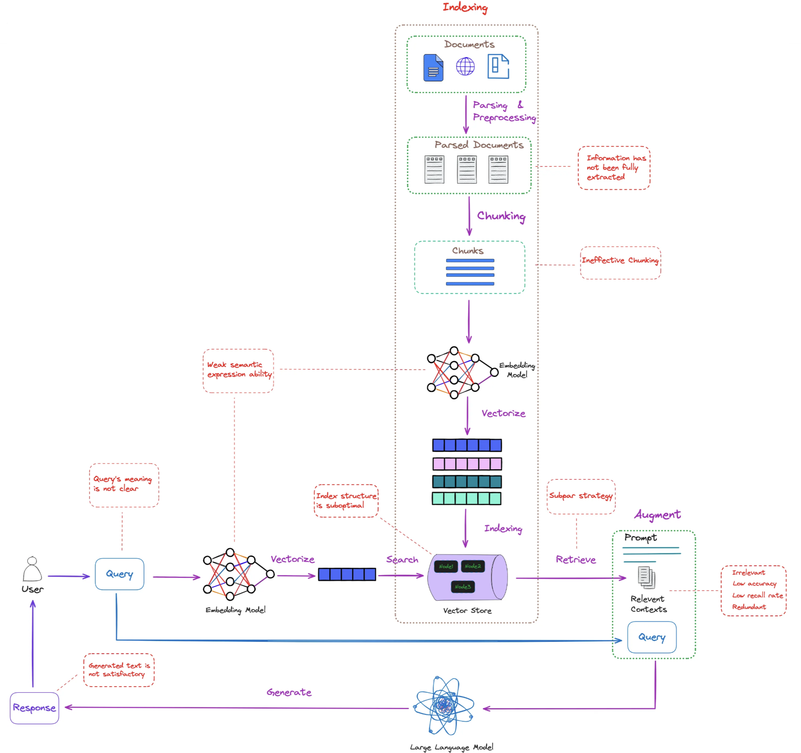

# 🎯 Session 5: RAG Evaluation Essentials

> **🎯 OBSERVER PATH - Essential Concepts**
> Time Investment: 30-45 minutes
> Outcome: Understand core RAG evaluation principles

## Learning Outcomes

By completing this section, you will:

- Understand why RAG evaluation is critical for system success  
- Master the three essential evaluation dimensions  
- Learn fundamental metrics for measuring RAG performance  
- Recognize when evaluation frameworks are necessary  

## The RAG Evaluation Challenge

In Sessions 1-4, you built sophisticated RAG systems with intelligent chunking, optimized indexing, hybrid search, and query enhancement. But when stakeholders ask "How do we know if these enhancements actually work?", you realize a critical gap: without proper evaluation, all your technical sophistication is just educated guesswork.



RAG systems present unique evaluation challenges because failures cascade through multiple stages. A poorly performing retrieval component can mask an excellent generation model, while perfect retrieval with poor generation creates misleading metrics. Traditional ML evaluation assumes single-stage models – RAG requires holistic assessment across retrieval quality, generation faithfulness, and end-to-end utility.

The complexity multiplies in production where edge cases, domain shifts, and user behavior changes affect performance in ways that offline evaluation can't predict.

## 🎯 Core Evaluation Framework Design

### The Three Essential Dimensions

The key insight is that RAG systems fail in interconnected ways that single metrics can't capture. You need evaluation frameworks that assess multiple dimensions simultaneously:

1. **Retrieval Quality**: Are your Session 3 indexing optimizations actually finding better documents?  
2. **Generation Quality**: Do your Session 4 query enhancements lead to more accurate responses?  
3. **End-to-End Utility**: Does the complete system deliver better user experiences?  

This multi-dimensional approach reveals hidden trade-offs and guides optimization priorities.

### Essential RAG Evaluation Structure

```python
from typing import List, Dict, Any, Optional
from dataclasses import dataclass

@dataclass
class RAGEvaluationResult:
    """Structured result for RAG evaluation."""
    query: str
    retrieved_contexts: List[str]
    generated_answer: str
    reference_answer: Optional[str] = None
    retrieval_scores: Dict[str, float] = None
    generation_scores: Dict[str, float] = None
    end_to_end_scores: Dict[str, float] = None
    metadata: Dict[str, Any] = None
```

This data structure captures all the essential information needed for comprehensive evaluation while keeping the structure simple and extensible.

### Core Metrics Categories

**Retrieval Metrics:**  
- **Precision@K**: How many of the top-K retrieved documents are relevant?  
- **Recall@K**: What percentage of all relevant documents are in top-K results?  
- **MRR (Mean Reciprocal Rank)**: How quickly do relevant results appear?  

**Generation Metrics:**  
- **Faithfulness**: Is the response factually consistent with retrieved contexts?  
- **Relevance**: Does the response directly address the query?  
- **Completeness**: Does the response fully answer all aspects of the question?  

**End-to-End Metrics:**  
- **Answer Correctness**: How accurate is the final response compared to ground truth?  
- **User Satisfaction**: Would users find this response helpful?  
- **Task Completion**: Can users accomplish their goals with this response?  

## 🎯 RAGAS Framework Basics

RAGAS (RAG Assessment) provides standardized evaluation metrics for RAG systems. The framework focuses on four core dimensions:

### Essential RAGAS Metrics

```python
from ragas.metrics import (
    faithfulness,        # Factual consistency
    answer_relevancy,    # Answer relevance to question
    context_precision,   # Precision of retrieved context
    context_recall       # Recall of retrieved context
)
```

**Faithfulness**: Measures how factually accurate the generated response is relative to the retrieved context. A high faithfulness score means the response doesn't hallucinate information not present in the contexts.

**Answer Relevancy**: Evaluates how well the response addresses the specific query. This catches cases where the response is factually correct but doesn't actually answer what was asked.

**Context Precision**: Assesses the quality of retrieved contexts - are the top-ranked contexts actually the most relevant to the query?

**Context Recall**: Measures whether all relevant information needed to answer the query was successfully retrieved.

### RAGAS Dataset Structure

```python
# Simple RAGAS dataset format
dataset_dict = {
    'question': ['What is machine learning?'],
    'answer': ['Machine learning is a subset of AI...'],
    'contexts': [['ML is a field of AI that uses...', 'Statistical models are used...']],
    'ground_truths': [['Machine learning is a branch of AI...']]
}
```

RAGAS requires your evaluation data in this specific structure, making it easy to plug into existing workflows while providing standardized metrics that enable comparison across different RAG implementations.

## 🎯 When Evaluation is Critical

### Development Phase Evaluation

Use evaluation frameworks when:

- **Comparing Enhancement Strategies**: Which Session 4 techniques actually improve performance?  
- **Component Optimization**: Does better chunking from Session 2 improve end-to-end results?  
- **Architecture Decisions**: Should you use dense retrieval, hybrid search, or knowledge graphs?  

### Production Monitoring Needs

Continuous evaluation becomes essential for:

- **Quality Assurance**: Maintain consistent response quality at scale  
- **Drift Detection**: Identify when performance degrades over time  
- **User Experience**: Ensure your system meets real-world user needs  

## 🎯 Quick Evaluation Setup

For immediate RAG evaluation, follow this essential pattern:

```python
class SimpleRAGEvaluator:
    """Minimal RAG evaluation for quick assessments."""

    def __init__(self, embedding_model):
        self.embedding_model = embedding_model

    def evaluate_retrieval(self, query, retrieved_docs):
        """Quick retrieval quality check."""
        query_embedding = self.embedding_model.encode([query])[0]
        similarities = []

        for doc in retrieved_docs:
            doc_embedding = self.embedding_model.encode([doc])[0]
            similarity = self.calculate_cosine_similarity(
                query_embedding, doc_embedding
            )
            similarities.append(similarity)

        return {
            'avg_similarity': sum(similarities) / len(similarities),
            'max_similarity': max(similarities),
            'relevance_score': sum(s > 0.7 for s in similarities) / len(similarities)
        }
```

This simple evaluator gives you immediate feedback on whether your retrieval system is finding relevant documents, providing a foundation for more sophisticated evaluation as your system matures.

## 🎯 Essential Quality Indicators

### Red Flags in RAG Performance

Watch for these critical warning signs:

- **Low Semantic Similarity**: Query and retrieved documents have little semantic overlap  
- **Response Contradictions**: Generated answers contradict information in contexts  
- **Empty or Generic Responses**: System fails to utilize retrieved information  
- **Inconsistent Performance**: Quality varies dramatically across similar queries  

### Success Indicators

Your evaluation should show:

- **High Context Utilization**: Responses effectively use retrieved information  
- **Factual Consistency**: Generated content aligns with source documents  
- **Query Relevance**: Responses directly address what users asked  
- **Appropriate Detail Level**: Neither too brief nor excessively verbose  

## Learning Path Summary

**🎯 Observer Path Complete**: You now understand why RAG evaluation is critical, the three essential evaluation dimensions, and fundamental metrics for measuring performance. You can recognize when evaluation frameworks are necessary and understand the basic structure of quality assessment.

**Next Steps for Deeper Learning:**

- **📝 Participant Path**: [RAG Implementation Practice →](Session5_RAGAS_Implementation_Practice.md) - Hands-on RAGAS setup and usage  
- **⚙️ Implementer Path**: [Advanced Custom Metrics →](Session5_Advanced_Custom_Metrics.md) - Build sophisticated domain-specific evaluators  

---

**Next:** [Session 6 - Graph-Based RAG →](Session6_Graph_Based_RAG.md)

---
