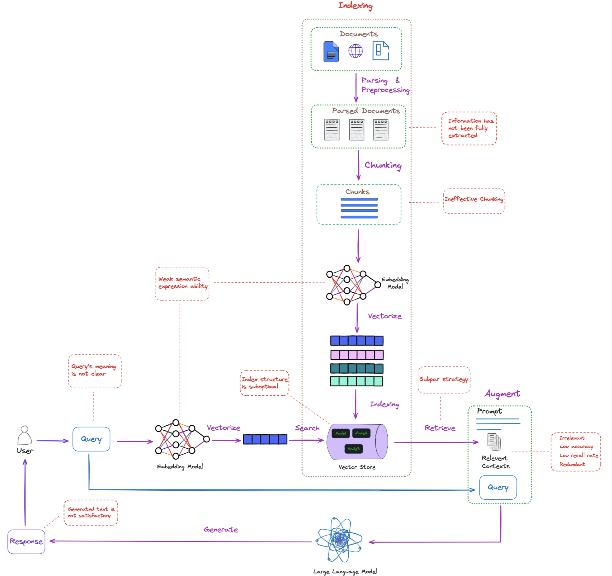

# Session 5: RAG Evaluation & Quality Assessment

## 🎯📝⚙️ Learning Path Overview

This session transforms RAG development from intuition-driven to evidence-driven through comprehensive evaluation frameworks. Choose your learning path:

### 🎯 Observer Path - Essential Concepts (1-2 hours)
**Outcome**: Understand core RAG evaluation principles and when evaluation is critical

Key files to read:  
- 🎯 [RAG Evaluation Essentials](Session5_RAG_Evaluation_Essentials.md)  
- 🎯 [Quality Assessment Basics](Session5_Quality_Assessment_Basics.md)  

### 📝 Participant Path - Practical Application (4-6 hours)
**Outcome**: Implement RAGAS evaluation and A/B testing for RAG optimization

Key files to read:  
- All 🎯 Observer files above  
- 📝 [RAGAS Implementation Practice](Session5_RAGAS_Implementation_Practice.md)  
- 📝 [Automated Testing Practice](Session5_Automated_Testing_Practice.md)  

### ⚙️ Implementer Path - Complete Mastery (8-12 hours)
**Outcome**: Build enterprise-grade evaluation and monitoring systems

Key files to read:  
- All 🎯 Observer and 📝 Participant files above  
- ⚙️ [Advanced Custom Metrics](Session5_Advanced_Custom_Metrics.md)  
- ⚙️ [Enterprise Monitoring Systems](Session5_Enterprise_Monitoring_Systems.md)  

### Optional Deep Dive Modules

- **[Module A: Advanced Evaluation Metrics](Session5_ModuleA_Advanced_Metrics.md)** - Custom metrics and domain-specific evaluation  
- **[Module B: Enterprise Monitoring](Session5_ModuleB_Enterprise_Monitoring.md)** - Production-scale monitoring and alerting  

## The Evaluation Challenge

In Sessions 1-4, you built sophisticated RAG systems with intelligent chunking, optimized indexing, hybrid search, and query enhancement. But when stakeholders ask "How do we know if these enhancements actually work?", you realize a critical gap: without proper evaluation, all your technical sophistication is just educated guesswork.



RAG systems present unique evaluation challenges because failures cascade through multiple stages. A poorly performing retrieval component can mask an excellent generation model, while perfect retrieval with poor generation creates misleading metrics. The key challenges include:

- **Multi-Stage Complexity**: Traditional ML evaluation assumes single-stage models – RAG requires holistic assessment  
- **Cascading Failures**: Poor retrieval can mask excellent generation, and vice versa  
- **Production Variability**: Edge cases, domain shifts, and user behavior changes affect performance unpredictably  
- **Enhancement Attribution**: Which specific improvements actually drive quality gains?  

This session transforms your approach from "it seems better" to "it performs 23% better on factual accuracy with 95% confidence."

---

## Session Structure and Learning Paths

### Core Evaluation Framework Principles

The key insight is that RAG systems fail in interconnected ways that single metrics can't capture. You need evaluation frameworks that assess multiple dimensions simultaneously:

1. **Retrieval Quality**: Are your Session 3 indexing optimizations actually finding better documents?  
2. **Generation Quality**: Do your Session 4 query enhancements lead to more accurate responses?  
3. **End-to-End Utility**: Does the complete system deliver better user experiences?  
4. **Enhancement Attribution**: Which specific improvements from Sessions 1-4 drive the biggest quality gains?  

This multi-dimensional approach reveals hidden trade-offs and guides optimization priorities.

### Quick Start Implementation

For immediate RAG evaluation, here's a minimal implementation pattern:

```python
from dataclasses import dataclass
from typing import List, Dict, Any, Optional

@dataclass
class RAGEvaluationResult:
    """Essential result structure for RAG evaluation."""
    query: str
    retrieved_contexts: List[str]
    generated_answer: str
    reference_answer: Optional[str] = None
    scores: Dict[str, float] = None
```

This minimal structure captures the essential evaluation information while remaining extensible for more sophisticated assessment needs.

For comprehensive evaluation, implement this framework pattern:

```python
class SimpleRAGEvaluator:
    """Basic RAG evaluation framework."""

    def __init__(self, llm_judge, embedding_model):
        self.llm_judge = llm_judge
        self.embedding_model = embedding_model

    def evaluate_response(self, query, response, contexts):
        """Quick evaluation of RAG response."""
        return {
            'relevance': self._assess_relevance(query, response),
            'context_usage': self._assess_context_usage(response, contexts),
            'overall_score': 0.0  # Calculate based on components
        }
```

Essential metrics for RAG evaluation include:

- **Retrieval Metrics**: Precision@K, Recall@K, MRR, NDCG  
- **Generation Metrics**: Faithfulness, Answer Relevance, Context Precision  
- **End-to-End Metrics**: Overall Accuracy, User Satisfaction  

The evaluation process follows this pattern:

```python
def evaluate_rag_system(test_dataset, rag_system):
    """Evaluate RAG system on test dataset."""
    results = []

    for test_case in test_dataset:
        # Generate RAG response
        rag_result = rag_system.query(test_case['query'])

        # Evaluate response
        evaluation = evaluate_response(
            test_case['query'],
            rag_result['answer'],
            rag_result['contexts']
        )

        results.append(evaluation)

    return results
```

This approach provides systematic evaluation across your test dataset, enabling data-driven optimization decisions.

## 🎯 Essential Evaluation Approaches

Before diving into implementation details, understand these fundamental evaluation approaches:

### 1. RAGAS Framework
Standardized metrics for RAG assessment:  
- **Faithfulness**: Factual consistency with retrieved context  
- **Answer Relevancy**: Response relevance to the original query  
- **Context Precision**: Quality of retrieved context ranking  
- **Context Recall**: Completeness of context retrieval  

### 2. LLM-as-a-Judge
Automated quality assessment using language models:  
- **Scalable**: Evaluate thousands of responses automatically  
- **Consistent**: Apply uniform evaluation criteria  
- **Flexible**: Customize evaluation prompts for specific needs  

### 3. A/B Testing
Scientific comparison of different RAG configurations:  
- **Statistical Rigor**: Determine if improvements are significant  
- **Real-World Validation**: Test with actual user scenarios  
- **Enhancement Attribution**: Identify which changes actually help  

## 📝 Production Implementation Guide

### Setting Up RAGAS Evaluation

RAGAS provides standardized evaluation metrics for production systems:

```python
from ragas import evaluate
from ragas.metrics import (
    faithfulness,      # Factual consistency
    answer_relevancy,   # Query relevance
    context_precision,  # Context quality
    context_recall     # Context completeness
)
```

For detailed RAGAS implementation with complete code examples, see:

📝 **[RAGAS Implementation Practice](Session5_RAGAS_Implementation_Practice.md)** - Complete setup guide with practical examples

### Data Preparation for RAGAS

RAGAS requires specific data formatting:

```python
# RAGAS dataset format
dataset_format = {
    'question': ['What is machine learning?'],
    'answer': ['Machine learning is a subset of AI...'],
    'contexts': [['ML is a field...', 'Statistical models...']],
    'ground_truths': [['Machine learning is a branch of AI...']]
}
```

For complete data preparation examples and troubleshooting, see the implementation guide.

### Custom Evaluation Metrics

Beyond standard metrics, you may need domain-specific evaluation. Basic custom metric example:

```python
class CustomRAGMetrics:
    """Domain-specific evaluation metrics."""

    def evaluate_domain_accuracy(self, response, domain_context):
        """Evaluate accuracy for specific domain."""
        # Custom evaluation logic here
        return score
```

For advanced custom metrics including domain-specific evaluators for legal, medical, and technical domains, see:

⚙️ **[Advanced Custom Metrics](Session5_Advanced_Custom_Metrics.md)** - Sophisticated evaluation frameworks

## ⚙️ Advanced Implementation Topics

### LLM-as-a-Judge Evaluation
For sophisticated automated evaluation using language models as judges:

⚙️ **[Advanced Custom Metrics](Session5_Advanced_Custom_Metrics.md)** - Multi-perspective LLM evaluation systems

### A/B Testing Implementation
For scientific comparison of RAG system variants:

📝 **[Automated Testing Practice](Session5_Automated_Testing_Practice.md)** - Complete A/B testing framework

### Production Monitoring
For enterprise-scale monitoring and alerting:

⚙️ **[Enterprise Monitoring Systems](Session5_Enterprise_Monitoring_Systems.md)** - Production monitoring architecture

## Quick Start Evaluation Checklist

Before implementing comprehensive evaluation, ensure you have:

### Essential Components  
- [ ] Test dataset with query-response pairs  
- [ ] Ground truth answers (if available)  
- [ ] RAG system that can process test queries  
- [ ] Evaluation metrics selection (start with RAGAS)  
- [ ] Success criteria definition  

### Evaluation Process  
1. **Choose Learning Path**: Start with 🎯 Observer for concepts, 📝 Participant for implementation  
2. **Setup RAGAS**: Follow the implementation guide for standardized metrics  
3. **Run Baseline**: Evaluate current system performance  
4. **Identify Issues**: Use evaluation results to find improvement areas  
5. **Test Enhancements**: Use A/B testing to validate improvements  

### When to Use Each Approach

**Observer Path (🎯)**: When you need to understand evaluation principles and determine if systematic evaluation is worth the investment.

**Participant Path (📝)**: When you need to implement evaluation for a production RAG system and validate enhancement effectiveness.

**Implementer Path (⚙️)**: When you need enterprise-grade evaluation with custom metrics, advanced monitoring, and specialized domain requirements.

## Session Learning Outcomes

After completing the appropriate learning path for your needs, you will have achieved:

### 🎯 Observer Path Outcomes  
- Understanding of why RAG evaluation is critical  
- Knowledge of the three essential evaluation dimensions  
- Ability to recognize when evaluation frameworks are needed  
- Foundation for making informed evaluation decisions  

### 📝 Participant Path Outcomes  
- Working RAGAS evaluation implementation  
- A/B testing framework for enhancement validation  
- Automated benchmarking pipelines  
- Production-ready monitoring dashboards  

### ⚙️ Implementer Path Outcomes  
- Custom evaluation metrics for specialized domains  
- Enterprise-scale monitoring and alerting systems  
- Advanced anomaly detection for quality degradation  
- Multi-perspective LLM-as-a-Judge evaluation systems  

## Integration with Existing Systems

Evaluation should integrate seamlessly with your existing RAG pipeline:

### Development Integration
```python
class RAGSystemWithEvaluation:
    def __init__(self, rag_system, evaluator):
        self.rag_system = rag_system
        self.evaluator = evaluator

    def query_with_evaluation(self, query):
        result = self.rag_system.query(query)
        evaluation = self.evaluator.evaluate(query, result)
        return {**result, 'evaluation': evaluation}
```

### Production Monitoring
For production systems, implement sampling-based evaluation to balance performance with quality monitoring. See the enterprise monitoring guide for scalable approaches.

## 📚 Complete Multiple Choice Test

Test your comprehensive understanding of RAG evaluation across all learning paths:

**Question 1:** Which metric is most important for evaluating retrieval quality in RAG systems?  
A) Response time  
B) Recall@K (how many relevant documents are in top-K results)  
C) Token count  
D) Database size  

**Question 2:** What does the RAGAS faithfulness metric measure?  
A) How fast the system responds  
B) How well retrieved documents match the query  
C) How factually accurate the generated response is relative to retrieved context  
D) How many sources are cited  

**Question 3:** In A/B testing for RAG systems, what is the most reliable success metric?  
A) System latency  
B) Cost per query  
C) User satisfaction and task completion rates  
D) Number of retrieved documents  

**Question 4:** When should you use automated LLM-as-a-judge evaluation over human evaluation?  
A) When you need perfect accuracy  
B) When you need to evaluate at scale with consistent criteria  
C) When the stakes are very high  
D) Never, human evaluation is always better  

**Question 5:** What is the primary purpose of regression testing in RAG evaluation?  
A) To test system speed  
B) To ensure new changes don't decrease quality on established benchmarks  
C) To measure user satisfaction  
D) To optimize costs  

**Question 6:** Which RAG component failure mode is hardest to detect with automated metrics?  
A) Slow retrieval speed  
B) Empty results from vector search  
C) Subtle hallucinations in generated responses  
D) Database connection errors  

**Question 7:** What is the key advantage of multi-dimensional RAG evaluation over single-metric assessment?  
A) Faster evaluation  
B) Lower computational cost  
C) Captures different failure modes that single metrics might miss  
D) Easier to implement  

**Question 8:** In production RAG monitoring, what threshold approach is most effective for quality alerts?  
A) Fixed absolute thresholds for all metrics  
B) Adaptive thresholds based on historical performance patterns  
C) No thresholds, manual monitoring only  
D) Random threshold selection  

**[View Solutions →](Session5_Test_Solutions.md)

---**

---

class RAGABTestFramework:
    """A/B testing framework for RAG system optimization."""

    def __init__(self, evaluation_framework):
        self.evaluation_framework = evaluation_framework
        self.active_tests = {}
        self.test_history = []
```

The test setup method configures experiments for comparing different RAG component variants:

```python
    def setup_ab_test(self, test_name: str,
                     component_variants: Dict[str, Any],
                     test_dataset: List[Dict],
                     test_config: Dict) -> Dict[str, Any]:
        """Setup A/B test for RAG component comparison."""

        test_setup = {
            'test_name': test_name,
            'variants': component_variants,
            'dataset': test_dataset,
            'config': test_config,
            'start_time': time.time(),
            'status': 'setup'
        }

        # Validate test setup
        validation_result = self._validate_test_setup(test_setup)
        if not validation_result['valid']:
            raise ValueError(f"Invalid test setup: {validation_result['errors']}")

        self.active_tests[test_name] = test_setup

        print(f"A/B test '{test_name}' setup complete with {len(component_variants)} variants")
        return test_setup
```

The execution method runs the test across all variants and collects performance data:

```python
    def run_ab_test(self, test_name: str) -> Dict[str, Any]:
        """Execute A/B test and collect results."""

        if test_name not in self.active_tests:
            raise ValueError(f"Test '{test_name}' not found in active tests")

        test_setup = self.active_tests[test_name]
        test_setup['status'] = 'running'

        print(f"Running A/B test: {test_name}")

        variant_results = {}

        # Test each variant
        for variant_name, variant_config in test_setup['variants'].items():
            print(f"  Testing variant: {variant_name}")

            # Create RAG system with variant configuration
            rag_system = self._create_rag_variant(variant_config)

            # Evaluate variant
            variant_result = self.evaluation_framework.evaluate_rag_system(
                test_setup['dataset'],
                rag_system,
                test_setup['config']
            )

            variant_results[variant_name] = variant_result
```

Finally, we analyze results and complete the test with comprehensive reporting:

```python
        # Analyze results
        analysis_result = self._analyze_ab_results(variant_results, test_setup)

        # Complete test
        test_result = {
            'test_name': test_name,
            'test_setup': test_setup,
            'variant_results': variant_results,
            'analysis': analysis_result,
            'completion_time': time.time(),
            'duration': time.time() - test_setup['start_time']
        }

        # Update test status
        test_setup['status'] = 'completed'
        self.test_history.append(test_result)

        return test_result
```

#### Step 5: Statistical Significance Testing

This method provides rigorous statistical analysis of A/B test results. We begin by setting up the analysis structure:

```python
    def _analyze_ab_results(self, variant_results: Dict,
                          test_setup: Dict) -> Dict[str, Any]:
        """Analyze A/B test results with statistical significance testing."""

        from scipy import stats

        analysis = {
            'winner': None,
            'statistical_significance': {},
            'effect_sizes': {},
            'recommendations': [],
            'detailed_comparison': {}
        }

        # Extract key metrics for comparison
        metric_comparisons = defaultdict(dict)

        for variant_name, result in variant_results.items():
            for metric_name, metric_value in result['aggregate_metrics'].items():
                metric_comparisons[metric_name][variant_name] = metric_value
```

We perform pairwise comparisons between all variants for each metric:

```python
        # Perform pairwise comparisons
        variant_names = list(variant_results.keys())

        for metric_name, metric_data in metric_comparisons.items():
            analysis['detailed_comparison'][metric_name] = {}

            for i, variant_a in enumerate(variant_names):
                for variant_b in variant_names[i+1:]:

                    score_a = metric_data[variant_a]
                    score_b = metric_data[variant_b]
```

We calculate effect sizes and statistical significance:

```python
                    # Calculate effect size (Cohen's d approximation)
                    effect_size = abs(score_a - score_b) / max(
                        np.std([score_a, score_b]), 0.01
                    )

                    # Simple significance test (would need individual scores for proper test)
                    difference = abs(score_a - score_b)
                    is_significant = difference > 0.05  # Simple threshold
```

We compile detailed comparison results:

```python
                    comparison_key = f"{variant_a}_vs_{variant_b}"
                    analysis['detailed_comparison'][metric_name][comparison_key] = {
                        'variant_a_score': score_a,
                        'variant_b_score': score_b,
                        'difference': score_a - score_b,
                        'effect_size': effect_size,
                        'is_significant': is_significant,
                        'better_variant': variant_a if score_a > score_b else variant_b
                    }
```

Finally, we determine the overall winner and generate actionable recommendations:

```python
        # Determine overall winner
        analysis['winner'] = self._determine_overall_winner(
            variant_results, analysis['detailed_comparison']
        )

        # Generate recommendations
        analysis['recommendations'] = self._generate_test_recommendations(analysis)

        return analysis
```

### Multi-Armed Bandit Testing

Implement adaptive testing strategies that learn from user interactions. First, we initialize the bandit with exploration parameters:

```python

# Multi-armed bandit for RAG optimization

class RAGMultiArmedBandit:
    """Multi-armed bandit for adaptive RAG system optimization."""

    def __init__(self, variants: List[str], exploration_rate: float = 0.1):
        self.variants = variants
        self.exploration_rate = exploration_rate

        # Initialize bandit arms
        self.arm_counts = {variant: 0 for variant in variants}
        self.arm_rewards = {variant: 0.0 for variant in variants}
        self.arm_avg_rewards = {variant: 0.0 for variant in variants}

        self.total_trials = 0
        self.trial_history = []
```

The selection algorithm balances exploration of new variants with exploitation of known good ones:

```python
    def select_variant(self) -> str:
        """Select variant using epsilon-greedy strategy."""

        # Exploration: random selection
        if np.random.random() < self.exploration_rate:
            selected_variant = np.random.choice(self.variants)
            selection_reason = "exploration"
        else:
            # Exploitation: select best performing variant
            if self.total_trials == 0:
                selected_variant = np.random.choice(self.variants)
                selection_reason = "random_initial"
            else:
                best_variant = max(self.arm_avg_rewards.items(), key=lambda x: x[1])[0]
                selected_variant = best_variant
                selection_reason = "exploitation"

        return selected_variant
```

We update rewards based on actual performance feedback:

```python
    def update_reward(self, variant: str, reward: float):
        """Update reward for selected variant."""

        self.arm_counts[variant] += 1
        self.arm_rewards[variant] += reward
        self.arm_avg_rewards[variant] = self.arm_rewards[variant] / self.arm_counts[variant]

        self.total_trials += 1
```

We maintain detailed trial history for analysis:

```python
        # Record trial
        self.trial_history.append({
            'trial': self.total_trials,
            'variant': variant,
            'reward': reward,
            'avg_reward': self.arm_avg_rewards[variant],
            'timestamp': time.time()
        })
```

Finally, we provide comprehensive performance summaries:

```python
    def get_performance_summary(self) -> Dict[str, Any]:
        """Get current performance summary."""

        return {
            'total_trials': self.total_trials,
            'variant_performance': {
                variant: {
                    'trials': self.arm_counts[variant],
                    'total_reward': self.arm_rewards[variant],
                    'average_reward': self.arm_avg_rewards[variant],
                    'selection_rate': self.arm_counts[variant] / max(self.total_trials, 1)
                }
                for variant in self.variants
            },
            'best_variant': max(self.arm_avg_rewards.items(), key=lambda x: x[1])[0] if self.total_trials > 0 else None,
            'exploration_rate': self.exploration_rate
        }
```

---

## Part 4: Continuous Monitoring and Quality Assurance - Maintaining Excellence at Scale

### Production RAG Monitoring

Offline evaluation tells you how well your system performs on test data. Production monitoring tells you how well it performs for real users under real conditions. The gap between these two often reveals the difference between systems that work in development and systems that thrive in production.

Production monitoring requires real-time quality assessment, anomaly detection, and automated alerting to maintain the quality standards you've achieved through careful evaluation.

```python

# Production monitoring system

class RAGProductionMonitor:
    """Continuous monitoring system for production RAG deployments."""

    def __init__(self, evaluation_framework, alert_thresholds: Dict):
        self.evaluation_framework = evaluation_framework
        self.alert_thresholds = alert_thresholds

        # Monitoring components
        self.performance_tracker = PerformanceTracker()
        self.quality_monitor = QualityMonitor()
        self.anomaly_detector = AnomalyDetector()

        # Monitoring data storage
        self.monitoring_data = {
            'performance_metrics': [],
            'quality_samples': [],
            'alerts': [],
            'system_health': []
        }
```

The main monitoring method captures and analyzes each RAG interaction:

```python
    def monitor_rag_interaction(self, query: str, response: str,
                              contexts: List[str], metadata: Dict) -> Dict[str, Any]:
        """Monitor individual RAG interaction."""

        monitoring_result = {
            'timestamp': time.time(),
            'query': query,
            'response': response,
            'contexts': contexts,
            'metadata': metadata
        }

        # Performance monitoring
        performance_metrics = self.performance_tracker.track_performance(
            query, response, contexts, metadata
        )
        monitoring_result['performance'] = performance_metrics

        # Quality assessment
        quality_scores = self.quality_monitor.assess_quality(
            query, response, contexts
        )
        monitoring_result['quality'] = quality_scores
```

We detect anomalies and trigger alerts when quality thresholds are exceeded:

```python
        # Anomaly detection
        anomaly_flags = self.anomaly_detector.detect_anomalies(
            performance_metrics, quality_scores
        )
        monitoring_result['anomalies'] = anomaly_flags

        # Store monitoring data
        self._store_monitoring_data(monitoring_result)

        # Check alert conditions
        alerts = self._check_alert_conditions(monitoring_result)
        if alerts:
            self._trigger_alerts(alerts)

        return monitoring_result
```

#### Step 6: Quality Monitoring Implementation

Real-time quality assessment for production RAG responses. We start by establishing the quality monitoring framework:

```python
class QualityMonitor:
    """Real-time quality monitoring for RAG responses."""

    def __init__(self, llm_judge=None):
        self.llm_judge = llm_judge

        # Quality assessment strategies
        self.quality_assessments = {
            'response_length': self._assess_response_length,
            'context_utilization': self._assess_context_utilization,
            'factual_consistency': self._assess_factual_consistency,
            'relevance_score': self._assess_relevance,
            'citation_quality': self._assess_citation_quality
        }

        # Quality baselines (would be learned from data)
        self.quality_baselines = {
            'response_length': {'min': 50, 'max': 500, 'optimal': 200},
            'context_utilization': {'min': 0.3, 'optimal': 0.7},
            'relevance_score': {'min': 0.6, 'optimal': 0.8},
            'citation_quality': {'min': 0.4, 'optimal': 0.7}
        }
```

The main assessment method runs multiple quality checks and flags potential issues:

```python
    def assess_quality(self, query: str, response: str,
                      contexts: List[str]) -> Dict[str, Any]:
        """Assess quality of RAG response."""

        quality_scores = {}
        quality_flags = []

        # Run all quality assessments
        for assessment_name, assessment_func in self.quality_assessments.items():
            try:
                score = assessment_func(query, response, contexts)
                quality_scores[assessment_name] = score

                # Check against baselines
                baseline = self.quality_baselines.get(assessment_name)
                if baseline and 'min' in baseline:
                    if score < baseline['min']:
                        quality_flags.append({
                            'type': 'quality_below_threshold',
                            'assessment': assessment_name,
                            'score': score,
                            'threshold': baseline['min']
                        })

            except Exception as e:
                print(f"Quality assessment error for {assessment_name}: {e}")
                quality_scores[assessment_name] = None
```

We calculate overall quality and return comprehensive assessment results:

```python
        # Calculate overall quality score
        valid_scores = [score for score in quality_scores.values() if score is not None]
        overall_quality = np.mean(valid_scores) if valid_scores else 0.0

        return {
            'individual_scores': quality_scores,
            'overall_quality': overall_quality,
            'quality_flags': quality_flags,
            'assessment_timestamp': time.time()
        }
```

We implement response length assessment to ensure appropriate detail level:

```python
    def _assess_response_length(self, query: str, response: str,
                              contexts: List[str]) -> float:
        """Assess if response length is appropriate."""

        response_length = len(response.split())
        baseline = self.quality_baselines['response_length']

        if response_length < baseline['min']:
            return response_length / baseline['min']  # Penalize too short
        elif response_length > baseline['max']:
            return baseline['max'] / response_length  # Penalize too long
        else:
            # Optimal range - score based on proximity to optimal
            distance_from_optimal = abs(response_length - baseline['optimal'])
            max_distance = max(baseline['optimal'] - baseline['min'],
                             baseline['max'] - baseline['optimal'])
            return 1.0 - (distance_from_optimal / max_distance)
```

We assess context utilization by calculating word overlap:

```python
    def _assess_context_utilization(self, query: str, response: str,
                                  contexts: List[str]) -> float:
        """Assess how well the response utilizes provided contexts."""

        if not contexts:
            return 0.0

        # Simple word overlap assessment
        response_words = set(response.lower().split())

        utilization_scores = []
        for context in contexts:
            context_words = set(context.lower().split())
            overlap = len(response_words.intersection(context_words))
            context_utilization = overlap / len(context_words) if context_words else 0
            utilization_scores.append(context_utilization)
```

Finally, we return the average utilization across all contexts:

```python
        # Return average utilization across all contexts
        return np.mean(utilization_scores) if utilization_scores else 0.0
```

### Alerting and Incident Response

Implement alerting for quality degradation. First, we establish the alerting system with severity levels:

```python

# Alerting system for RAG monitoring

class RAGAlertingSystem:
    """Alerting system for RAG quality degradation and anomalies."""

    def __init__(self, alert_config: Dict):
        self.alert_config = alert_config
        self.alert_history = []
        self.active_alerts = {}

        # Alert severity levels
        self.severity_levels = {
            'low': {'threshold_multiplier': 1.2, 'cooldown': 300},
            'medium': {'threshold_multiplier': 1.5, 'cooldown': 180},
            'high': {'threshold_multiplier': 2.0, 'cooldown': 60},
            'critical': {'threshold_multiplier': 3.0, 'cooldown': 0}
        }
```

The main evaluation method checks multiple alert conditions and manages cooldown periods:

```python
    def evaluate_alert_conditions(self, monitoring_data: Dict) -> List[Dict]:
        """Evaluate if any alert conditions are met."""

        alerts_to_trigger = []
        current_time = time.time()

        # Check quality degradation alerts
        quality_alerts = self._check_quality_alerts(monitoring_data)
        alerts_to_trigger.extend(quality_alerts)

        # Check performance alerts
        performance_alerts = self._check_performance_alerts(monitoring_data)
        alerts_to_trigger.extend(performance_alerts)

        # Check anomaly alerts
        anomaly_alerts = self._check_anomaly_alerts(monitoring_data)
        alerts_to_trigger.extend(anomaly_alerts)
```

We filter alerts based on cooldown periods to prevent alert fatigue:

```python
        # Filter out alerts in cooldown
        filtered_alerts = []
        for alert in alerts_to_trigger:
            alert_key = f"{alert['type']}_{alert['metric']}"

            if alert_key in self.active_alerts:
                last_triggered = self.active_alerts[alert_key]['last_triggered']
                cooldown = self.severity_levels[alert['severity']]['cooldown']

                if current_time - last_triggered < cooldown:
                    continue  # Skip alert in cooldown

            filtered_alerts.append(alert)

            # Update active alerts
            self.active_alerts[alert_key] = {
                'alert': alert,
                'last_triggered': current_time,
                'trigger_count': self.active_alerts.get(alert_key, {}).get('trigger_count', 0) + 1
            }

        return filtered_alerts
```

We implement quality-specific alert checking for both overall and individual metrics:

```python
    def _check_quality_alerts(self, monitoring_data: Dict) -> List[Dict]:
        """Check for quality degradation alerts."""

        alerts = []

        if 'quality' in monitoring_data:
            quality_data = monitoring_data['quality']

            # Overall quality threshold
            if 'overall_quality' in quality_data:
                overall_score = quality_data['overall_quality']

                if overall_score < self.alert_config.get('min_quality_score', 0.6):
                    alerts.append({
                        'type': 'quality_degradation',
                        'metric': 'overall_quality',
                        'severity': self._determine_severity('quality', overall_score),
                        'current_value': overall_score,
                        'threshold': self.alert_config.get('min_quality_score', 0.6),
                        'message': f"Overall quality score {overall_score:.3f} below threshold",
                        'timestamp': time.time()
                    })
```

Finally, we check individual quality metrics against their specific thresholds:

```python
            # Individual quality metric alerts
            individual_scores = quality_data.get('individual_scores', {})
            for metric, score in individual_scores.items():
                if score is not None:
                    threshold_key = f'min_{metric}_score'
                    if threshold_key in self.alert_config:
                        if score < self.alert_config[threshold_key]:
                            alerts.append({
                                'type': 'quality_metric_low',
                                'metric': metric,
                                'severity': self._determine_severity(metric, score),
                                'current_value': score,
                                'threshold': self.alert_config[threshold_key],
                                'message': f"{metric} score {score:.3f} below threshold",
                                'timestamp': time.time()
                            })

        return alerts
```

---

## Hands-On Exercise: Build Comprehensive RAG Evaluation System

### Requirements

1. Multi-dimensional evaluation with RAGAS integration and custom metrics
2. Automated benchmarking with regression detection
3. A/B testing framework with statistical analysis
4. Production monitoring with real-time quality assessment and alerting
5. Continuous quality assurance and improvement recommendations

### Implementation Framework

#### Implementation Framework

The complete RAG evaluation ecosystem brings together all components. We initialize the comprehensive system:

```python

# Complete RAG evaluation ecosystem

class RAGEvaluationEcosystem:
    """Comprehensive RAG evaluation and monitoring ecosystem."""

    def __init__(self, llm_judge, embedding_model, config: Dict):
        # Initialize all evaluation components
        self.evaluation_framework = RAGEvaluationFramework(llm_judge, embedding_model)
        self.ragas_evaluator = RAGASEvaluator(llm_judge, embedding_model)
        self.benchmark_system = AutomatedRAGBenchmark(
            self.evaluation_framework, config['test_datasets']
        )
        self.ab_testing = RAGABTestFramework(self.evaluation_framework)
        self.production_monitor = RAGProductionMonitor(
            self.evaluation_framework, config['alert_thresholds']
        )

        # Evaluation dashboard data
        self.dashboard_data = {
            'current_performance': {},
            'historical_trends': [],
            'active_tests': {},
            'quality_metrics': {}
        }
```

The comprehensive evaluation method orchestrates different evaluation suites based on your needs:

```python
    def run_comprehensive_evaluation(self, rag_system,
                                   evaluation_suite: str = 'full') -> Dict[str, Any]:
        """Run comprehensive evaluation suite."""

        results = {
            'evaluation_suite': evaluation_suite,
            'timestamp': time.time(),
            'components': {}
        }
```

We conditionally run different evaluation components:

```python
        if evaluation_suite in ['full', 'benchmark']:
            # Run automated benchmark
            benchmark_results = self.benchmark_system.run_comprehensive_benchmark(
                rag_system, {'include_ragas': True, 'include_custom': True}
            )
            results['components']['benchmark'] = benchmark_results

        if evaluation_suite in ['full', 'quality']:
            # Quality assessment on sample data
            quality_results = self._run_quality_assessment(rag_system)
            results['components']['quality_assessment'] = quality_results

        if evaluation_suite in ['full', 'monitoring']:
            # Setup production monitoring
            monitoring_setup = self._setup_production_monitoring(rag_system)
            results['components']['monitoring_setup'] = monitoring_setup
```

Finally, we generate comprehensive evaluation reports:

```python
        # Generate evaluation report
        evaluation_report = self._generate_comprehensive_report(results)
        results['evaluation_report'] = evaluation_report

        return results
```

---

## Chapter Summary

### What You've Built

- Comprehensive RAG evaluation framework with RAGAS integration
- Automated benchmarking system with regression detection
- A/B testing framework for component optimization
- Production monitoring with real-time quality assessment
- Alerting system for quality degradation and anomaly detection

**Key Technical Skills Learned:**

1. Multi-dimensional evaluation (retrieval, generation, end-to-end performance)
2. Automated assessment (LLM-as-a-judge, statistical testing, benchmark automation)
3. Experimental design (A/B testing, multi-armed bandits, significance testing)
4. Production monitoring (real-time quality tracking, alerting, incident response)
5. Quality assurance (continuous improvement, regression detection, performance optimization)

**Evaluation Metrics Mastered:**

- **Retrieval**: Precision@K, Recall@K, MRR, NDCG, semantic relevance
- **Generation**: Faithfulness, relevance, completeness, coherence, citation quality
- **End-to-End**: Answer correctness, user satisfaction, task completion rate
- **Production**: Response time, throughput, error rates, quality consistency

---

## 📝 Multiple Choice Test - Session 5

Test your understanding of RAG evaluation and quality assessment techniques:

**Question 1:** Which metric is most important for evaluating retrieval quality in RAG systems?  
A) Response time  
B) Recall@K (how many relevant documents are in top-K results)  
C) Token count  
D) Database size  

**Question 2:** What does the RAGAS faithfulness metric measure?  
A) How fast the system responds  
B) How well retrieved documents match the query  
C) How factually accurate the generated response is relative to retrieved context  
D) How many sources are cited  

**Question 3:** In A/B testing for RAG systems, what is the most reliable success metric?  
A) System latency  
B) Cost per query  
C) User satisfaction and task completion rates  
D) Number of retrieved documents  

**Question 4:** When should you use automated LLM-as-a-judge evaluation over human evaluation?  
A) When you need perfect accuracy  
B) When you need to evaluate at scale with consistent criteria  
C) When the stakes are very high  
D) Never, human evaluation is always better  

**Question 5:** What is the primary purpose of regression testing in RAG evaluation?  
A) To test system speed  
B) To ensure new changes don't decrease quality on established benchmarks  
C) To measure user satisfaction  
D) To optimize costs  

**Question 6:** Which RAG component failure mode is hardest to detect with automated metrics?  
A) Slow retrieval speed  
B) Empty results from vector search  
C) Subtle hallucinations in generated responses  
D) Database connection errors  

**Question 7:** What is the key advantage of multi-dimensional RAG evaluation over single-metric assessment?  
A) Faster evaluation  
B) Lower computational cost  
C) Captures different failure modes that single metrics might miss  
D) Easier to implement  

**Question 8:** In production RAG monitoring, what threshold approach is most effective for quality alerts?  
A) Fixed absolute thresholds for all metrics  
B) Adaptive thresholds based on historical performance patterns  
C) No thresholds, manual monitoring only  
D) Random threshold selection  

[View Solutions →](Session5_Test_Solutions.md)

---

## Session 5 Mastery Summary

**What You've Built:**

You've transformed RAG evaluation from guesswork to science:

- Multi-dimensional assessment with comprehensive quality measurement
- Enhancement validation through scientific comparison
- Production monitoring with real-time quality tracking
- A/B testing frameworks for rigorous optimization
- Domain-specific benchmarks tailored to your use case

**Stepping Beyond Traditional RAG:**

Traditional vector RAG finds documents similar to queries. GraphRAG enables multi-hop reasoning, entity understanding, and complex relationship traversal. The evaluation frameworks you've mastered will prove whether graph-based enhancements improve upon your optimized vector system.

**Preparation for Graph Intelligence:**

1. Establish GraphRAG baselines using your evaluation framework
2. Design relationship-aware test cases requiring multi-hop reasoning
3. Plan hybrid evaluation (pure vector vs. pure graph vs. hybrid approaches)
4. Document current performance for entity/relationship queries

---

**Next:** [Session 6 - Graph-Based RAG →](Session6_Graph_Based_RAG.md)

---

**Next:** [Session 6 - Atomic Agents Modular Architecture →](Session6_Atomic_Agents_Modular_Architecture.md)

---
