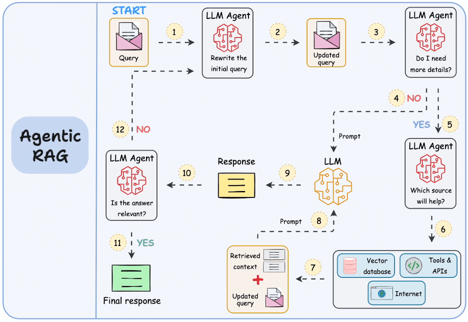
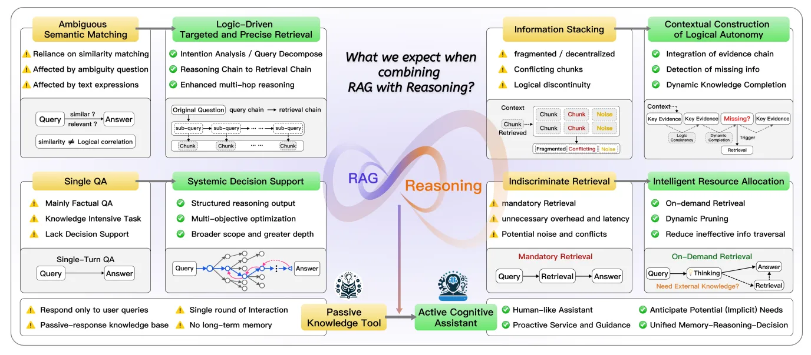
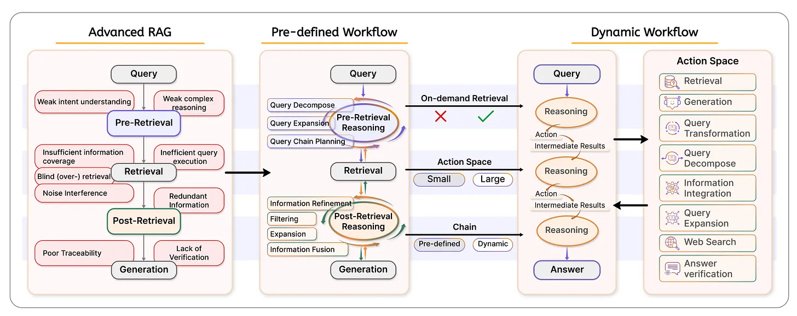

# 🎯 Session 7: Agentic RAG Systems

In Sessions 1-6, you built sophisticated RAG systems that can chunk intelligently, search optimally, enhance queries semantically, evaluate scientifically, and reason through knowledge graphs. But when users ask questions requiring complex multi-step reasoning, tool usage, or self-correction, you discover that even GraphRAG has limitations: it can retrieve and connect information, but can't actively plan, execute actions, or validate its own reasoning.

This session transforms your RAG system from passive responder to active reasoner. You'll implement agentic architectures that can plan multi-step research strategies, execute complex information-gathering workflows, validate their own responses, and self-correct when initial approaches fail.

## 🎯📝⚙️ Learning Path Overview

This session offers three distinct learning paths:

### 🎯 Observer Path - Essential Concepts
**Time Investment**: 45-60 minutes
**Outcome**: Understand core agentic RAG principles and cognitive architecture

Key concepts to master:  
- Cognitive leap from retrieval to reasoning  
- Three pillars of reasoning-RAG integration  
- Basic agentic architecture patterns  

### 📝 Participant Path - Practical Implementation
**Time Investment**: 3-4 hours
**Outcome**: Build functional agentic RAG systems with reasoning capabilities

Additional concepts and implementations:  
- Complete Observer Path content above  
- Hands-on reasoning agent implementation  
- Self-correction system development  
- Tool integration patterns  

### ⚙️ Implementer Path - Complete Mastery
**Time Investment**: 8-12 hours
**Outcome**: Deep expertise in production agentic RAG systems

Complete implementation coverage:  
- All Observer and Participant content  
- ⚙️ [Advanced Agent Reasoning](Session7_Advanced_Agent_Reasoning.md)  
- ⚙️ [Production Agent Deployment](Session7_Production_Agent_Systems.md)  
- ⚙️ [Multi-Agent Orchestration](Session7_Multi_Agent_Orchestration.md)  





## 🎯 Observer Path: Essential Concepts

### Understanding the Cognitive Leap: From Retrieval to Reasoning


The leap from traditional RAG to agentic RAG isn't just about adding more components – it's about fundamentally changing how the system approaches information challenges. Instead of fixed query-response patterns, agentic RAG develops reasoning strategies tailored to each information need.

Consider the difference: when asked "Should we acquire Company X?", traditional RAG retrieves documents about Company X and generates a summary. Agentic RAG plans a research strategy: analyze financials, assess market position, identify risks, evaluate synergies, then synthesize a reasoned recommendation.

### Traditional RAG vs Reasoning-Augmented RAG

**Traditional RAG Workflow:**
```
Query → Retrieve Documents → Generate Response
```

**Reasoning-Augmented RAG Workflow:**
```
Query → Analyze Reasoning Requirements → Plan Cognitive Strategy →
Reasoning-Guided Retrieval → Chain-of-Thought Synthesis →
Meta-Cognitive Validation → Logically Coherent Response
```

The fundamental shift is from reactive to proactive intelligence. Traditional RAG systems respond to queries with fixed patterns, while agentic RAG systems can plan research strategies, execute multi-step investigations, and autonomously course-correct to find better solutions.



### The Three Pillars of Reasoning-RAG Integration

#### 1. Reasoning-Augmented Retrieval (RAR)
**Core Principle**: "Let reasoning guide what information to find and how to connect it"

Instead of simple similarity search, this approach analyzes what type of reasoning is needed and uses that to guide information gathering.

```python
class ReasoningAugmentedRetrieval:
    """RAG system where reasoning frameworks guide retrieval strategies."""

    def __init__(self, vector_store, knowledge_graph, reasoning_engine):
        self.vector_store = vector_store
        self.knowledge_graph = knowledge_graph
        self.reasoning_engine = reasoning_engine
```

This system uses different reasoning strategies to intelligently guide information retrieval. The reasoning engine analyzes the query type and selects appropriate retrieval strategies.

```python
        # Map reasoning types to specific retrieval strategies
        self.reasoning_strategies = {
            'deductive': self._deductive_reasoning_retrieval,
            'inductive': self._inductive_reasoning_retrieval,
            'abductive': self._abductive_reasoning_retrieval,
            'analogical': self._analogical_reasoning_retrieval,
            'causal': self._causal_reasoning_retrieval
        }
```

Each reasoning type requires different information gathering approaches. Deductive reasoning needs premises and logical rules, while causal reasoning requires temporal sequences and cause-effect relationships.

#### 2. Retrieval-Augmented Reasoning (RAR)
**Core Principle**: "Let external knowledge fill logical reasoning gaps"

This approach identifies gaps in reasoning chains and uses targeted retrieval to fill missing information.

```python
class RetrievalAugmentedReasoning:
    """Reasoning system enhanced by strategic information retrieval."""

    def __init__(self, reasoning_framework, vector_store):
        self.reasoning_framework = reasoning_framework
        self.vector_store = vector_store
```

The system detects when reasoning chains have missing information and strategically retrieves specific knowledge to complete logical arguments.

```python
        self.gap_detection_strategies = {
            'premise_gap': self._detect_missing_premises,
            'evidence_gap': self._detect_insufficient_evidence,
            'logical_step_gap': self._detect_missing_logical_steps,
            'context_gap': self._detect_missing_context
        }
```

#### 3. Chain-of-Thought RAG Integration
**Core Principle**: "Structured reasoning paths that guide both retrieval and synthesis"

This combines structured reasoning with retrieval at each step of the thought process.

```python
class ChainOfThoughtRAG:
    """RAG system with integrated chain-of-thought reasoning."""

    def __init__(self, llm_model, vector_store, reasoning_framework):
        self.llm_model = llm_model
        self.vector_store = vector_store
        self.reasoning_framework = reasoning_framework
```

Each step in the reasoning chain can trigger retrieval to gather supporting information before proceeding to the next logical step.

## 📝 Participant Path: Practical Implementation

*Prerequisites: Complete Observer Path sections above*

### Building Your First Agentic RAG System

Let's implement a practical reasoning-driven RAG system that can handle complex queries requiring multi-step analysis.

#### Basic Reasoning Agent Implementation

```python
from typing import List, Dict, Any, Optional
import json
import asyncio

class BasicReasoningRAGAgent:
    """Simple agentic RAG system with reasoning capabilities."""

    def __init__(self, llm_model, vector_store):
        self.llm_model = llm_model
        self.vector_store = vector_store
        self.reasoning_history = []
```

This basic agent provides the foundation for agentic RAG functionality. The reasoning_history tracks the agent's thought processes for transparency and learning.

```python
    async def analyze_reasoning_requirements(self, query: str) -> Dict[str, Any]:
        """Analyze what type of reasoning the query requires."""

        analysis_prompt = f"""
        Analyze this query's reasoning requirements:
        Query: "{query}"

        Determine:
        1. Primary reasoning type (deductive, inductive, abductive, causal, analogical)
        2. Complexity level (simple, moderate, complex)
        3. Information requirements (facts, relationships, evidence, context)

        Return analysis as JSON with these fields.
        """

        response = await self.llm_model.generate(analysis_prompt, temperature=0.1)
        return json.loads(self._extract_json(response))
```

The reasoning requirements analysis is crucial for selecting appropriate strategies. Low temperature (0.1) ensures consistent analytical responses rather than creative interpretations.

```python
    async def plan_reasoning_strategy(self, query: str,
                                    analysis: Dict[str, Any]) -> List[str]:
        """Create step-by-step reasoning plan based on analysis."""

        planning_prompt = f"""
        Create a reasoning plan for this query:
        Query: "{query}"
        Analysis: {json.dumps(analysis)}

        Generate 3-5 logical steps that will lead to a complete answer.
        Format as JSON list of step descriptions.
        """

        response = await self.llm_model.generate(planning_prompt, temperature=0.2)
        return json.loads(self._extract_json(response))
```

The planning phase creates a structured approach to complex queries. Slightly higher temperature (0.2) allows for creative problem-solving while maintaining logical consistency.

#### Self-Correction Implementation

```python
    async def validate_reasoning_quality(self, response: str,
                                       original_query: str) -> Dict[str, Any]:
        """Validate the logical quality of the generated response."""

        validation_prompt = f"""
        Evaluate this response for logical quality:

        Original Query: "{original_query}"
        Response: "{response}"

        Check for:
        1. Logical consistency
        2. Evidence support
        3. Reasoning gaps
        4. Conclusion validity

        Return evaluation as JSON with scores (0-1) and explanations.
        """

        response = await self.llm_model.generate(validation_prompt, temperature=0.1)
        return json.loads(self._extract_json(response))
```

This validation method acts as an internal critic, evaluating response quality before returning to users. The structured evaluation ensures consistent quality assessment.

```python
    async def self_correct(self, original_response: str, validation: Dict[str, Any],
                          query: str) -> str:
        """Improve response based on validation feedback."""

        if validation.get('overall_score', 1.0) < 0.7:
            correction_prompt = f"""
            Improve this response based on validation feedback:

            Original Response: "{original_response}"
            Issues Identified: {validation}
            Original Query: "{query}"

            Generate an improved response that addresses these issues.
            """

            improved_response = await self.llm_model.generate(correction_prompt)
            return improved_response

        return original_response
```

The self-correction mechanism only activates when quality falls below threshold (0.7), preventing unnecessary processing while ensuring quality standards.

#### Tool Integration Pattern

For advanced capabilities, agentic RAG systems often need external tools:

```python
class ToolIntegratedRAG:
    """RAG agent with external tool integration capabilities."""

    def __init__(self, llm_model, vector_store, available_tools):
        self.llm_model = llm_model
        self.vector_store = vector_store
        self.available_tools = available_tools
```

Tool integration enables RAG systems to go beyond document retrieval to access real-time data, perform calculations, or execute actions.

```python
    async def determine_tool_usage(self, query: str) -> List[str]:
        """Determine which tools are needed for this query."""

        tool_analysis_prompt = f"""
        Analyze if this query requires external tools:
        Query: "{query}"

        Available tools: {list(self.available_tools.keys())}

        Return list of needed tools or empty list if only document retrieval needed.
        """

        response = await self.llm_model.generate(tool_analysis_prompt)
        return json.loads(self._extract_json(response))
```

Smart tool selection prevents overuse while ensuring necessary capabilities are available when needed.

### Practice Exercise: Implementing Basic Agent

Try implementing a reasoning agent that can:

1. Analyze query complexity  
2. Plan multi-step reasoning  
3. Execute retrieval-guided reasoning  
4. Validate and self-correct responses  

**Implementation Challenge:**
Build an agent that can answer: "What are the potential risks and benefits of implementing AI in healthcare, and what regulatory considerations should be addressed?"

This query requires:  
- Multi-perspective analysis (risks and benefits)  
- Domain expertise (healthcare AI)  
- Regulatory knowledge  
- Balanced reasoning  

## Advanced Topics for Implementer Path

The complete agentic RAG implementation requires additional advanced components:

### ⚙️ Advanced Components (Implementer Path Only):

- **Production-Grade Reasoning Systems**: Enterprise deployment patterns  
- **Multi-Agent Orchestration**: Collaborative agent architectures  
- **Advanced Tool Integration**: Complex external system integration  
- **Performance Optimization**: Scaling agentic systems  

*Complete coverage available in:*  
- ⚙️ [Advanced Agent Reasoning](Session7_Advanced_Agent_Reasoning.md)  
- ⚙️ [Production Agent Systems](Session7_Production_Agent_Systems.md)  
- ⚙️ [Multi-Agent Orchestration](Session7_Multi_Agent_Orchestration.md)  

## Chapter Summary

### What You've Built

**🎯 Observer Path Completed:**  
- Understanding of cognitive leap from retrieval to reasoning  
- Knowledge of three pillars of reasoning-RAG integration  
- Conceptual grasp of agentic architecture principles  

**📝 Participant Path Completed:**  
- Functional reasoning agent implementation  
- Self-correction and validation systems  
- Basic tool integration patterns  
- Practical problem-solving capabilities  

### Key Skills Learned

**🎯 Observer Level:**  
1. **Cognitive Architecture Understanding**: Reasoning-augmented vs traditional RAG  
2. **Strategic Framework Knowledge**: Three pillars of integration  

**📝 Participant Level:**  
3. **Reasoning Agent Development**: Planning and execution capabilities  
4. **Self-Correction Implementation**: Validation and improvement systems  
5. **Tool Integration**: External capability integration patterns  

## Session 7 Complete

You've built the foundation of agentic RAG systems that combine autonomous reasoning with retrieval-augmented generation. These systems can plan queries, self-correct responses, and integrate external tools.

**For complete mastery, explore the Implementer Path modules:**  
- ⚙️ [Advanced Agent Reasoning](Session7_Advanced_Agent_Reasoning.md)  
- ⚙️ [Production Agent Systems](Session7_Production_Agent_Systems.md)  
- ⚙️ [Multi-Agent Orchestration](Session7_Multi_Agent_Orchestration.md)  

## 
Session 8 expands agentic intelligence to handle multiple modalities - text, images, audio, and video - for comprehensive knowledge processing.

---

## 📝 Multiple Choice Test - Session 7

Test your understanding of agentic RAG systems and intelligent automation techniques.

**Question 1:** What is the primary advantage of query planning in agentic RAG systems?  
A) Faster response times  
B) Strategic analysis of queries to determine optimal retrieval and generation approaches  
C) Reduced computational costs  
D) Simpler system architecture  

**Question 2:** In self-correcting RAG systems, what is the most effective approach for error detection?  
A) Random response sampling  
B) LLM-as-a-judge evaluation with factual consistency checking  
C) Simple keyword matching  
D) Response length validation  

**Question 3:** When should agentic RAG systems use external tools rather than just document retrieval?  
A) Always, for every query  
B) Never, document retrieval is always sufficient  
C) When queries require real-time data, calculations, or specialized functionality  
D) Only for simple questions  

**Question 4:** What is the key benefit of multi-agent collaboration in RAG systems?  
A) Faster processing through parallel execution  
B) Specialized expertise and comprehensive analysis through role-based collaboration  
C) Reduced memory usage  
D) Simpler error handling  

**Question 5:** In iterative self-correction, what criterion should determine when to stop refinement?  
A) Fixed number of iterations regardless of quality  
B) Quality threshold achievement or diminishing improvement returns  
C) Time limits only  
D) User interruption  

**Question 6:** Which agent role is most critical for ensuring factual accuracy in multi-agent RAG systems?  
A) Researcher agent  
B) Synthesizer agent  
C) Validator agent  
D) Coordinator agent  

**Question 7:** What is the primary challenge in production deployment of agentic RAG systems?  
A) High computational costs  
B) Balancing system complexity with reliability and performance  
C) Lack of suitable frameworks  
D) Limited use cases  

**Question 8:** When designing agentic RAG validation, what aspect is most important to assess?  
A) Response length  
B) Processing speed  
C) Factual accuracy and logical consistency  
D) Token usage  

[View Solutions →](Session7_Test_Solutions.md)

---

## 🧭 Navigation

**Previous:** [Session 6 - Modular Architecture →](Session6_*.md)  
**Next:** [Session 8 - Production Ready →](Session8_*.md)

---
