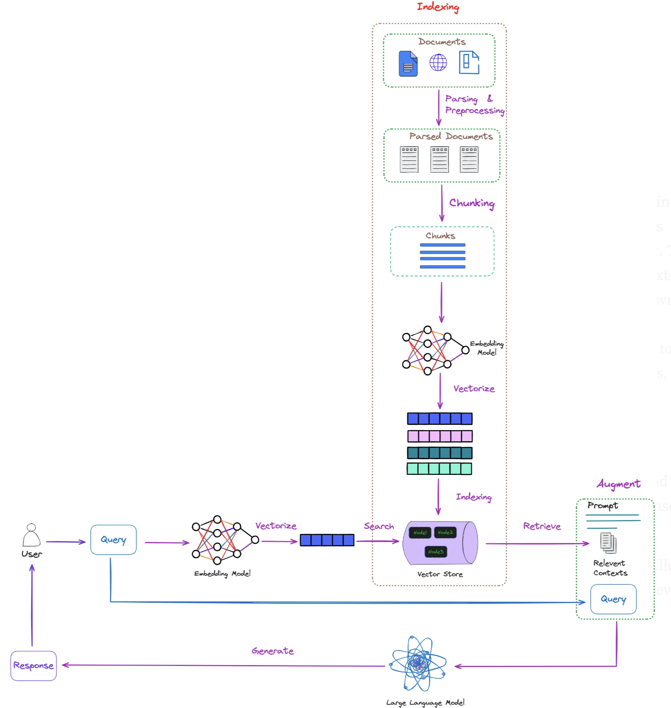

# 🎯📝⚙️ Session 8: Multi-Modal & Advanced RAG

## 🎯📝⚙️ Learning Path Overview

This session offers three distinct learning paths for mastering multimodal RAG systems:  

### 🎯 Observer Path - Essential Concepts (45-60 minutes)
**Outcome**: Understand multimodal RAG evolution and core principles  

Focus on sections marked with 🎯 below for conceptual understanding of:  
- MRAG evolution from 1.0 to 3.0  
- Information loss problems in pseudo-multimodal systems  
- True multimodal processing advantages  
- Basic multimodal architecture patterns  

### 📝 Participant Path - Practical Implementation (3-4 hours)
**Outcome**: Implement multimodal RAG systems in practice  

Complete 🎯 Observer sections above, then focus on 📝 sections:  
- Hands-on multimodal processing implementation  
- Advanced fusion strategies  
- Domain-specific optimizations  
- Integration with existing RAG systems  

### ⚙️ Implementer Path - Complete Mastery (8-12 hours)
**Outcome**: Expert-level multimodal RAG system development  

Complete all 🎯 Observer and 📝 Participant content, then explore advanced modules:  
- ⚙️ [MRAG Evolution Deep Dive](Session8_MRAG_Evolution.md)  
- ⚙️ [Advanced Techniques & Domain Specialization](Session8_Advanced_Techniques.md)  
- ⚙️ [Cutting-Edge Research Implementation](Session8_Cutting_Edge_Research.md)  
- ⚙️ [Complete Implementation Practice](Session8_Implementation_Practice.md)  

---

## 🎯 The MRAG Challenge: Beyond Text-Only Intelligence

In Sessions 1-7, you built sophisticated RAG systems that can process text intelligently, reason through complex queries, and even make autonomous decisions. But when users start uploading images, videos, audio files, or asking questions that require understanding visual content, you discover a fundamental limitation: your text-based RAG systems are blind to the rich information encoded in non-textual media.

This session transforms your RAG system from text-only to truly multi-modal intelligence. You'll implement systems that can understand images directly, process audio content without lossy transcription, analyze video for temporal patterns, and most importantly, reason across multiple modalities simultaneously.



The challenge isn't just technical – it's cognitive. Human knowledge isn't purely textual. We learn from diagrams, understand through images, communicate with gestures, and reason across multiple sensory inputs simultaneously. Multi-modal RAG bridges this gap by enabling systems to understand information the way humans naturally do: through integrated perception across all communication modalities.

## 🎯 The MRAG Evolution - From Text Blindness to Unified Perception


The evolution from text-only to truly multi-modal RAG represents three distinct paradigm shifts, each addressing fundamental limitations of the previous approach:  

### The Three Evolutionary Paradigms of Multimodal RAG (MRAG)

#### 🎯 MRAG 1.0 - Pseudo-Multimodal Era (Lossy Translation)

**Core Problem**: Force everything through text conversion, losing crucial information  

- **Approach**: Convert images to captions, audio to transcripts, videos to summaries  
- **Fatal Flaw**: Massive information loss during translation (70-90% typical)  
- **Example**: Technical diagram → text description (loses spatial relationships, precise measurements, visual context)  

The first attempt at "multimodal" RAG simply converted everything to text. This approach destroys the very information that makes non-textual content valuable. A technical diagram loses its spatial relationships, a music file loses its emotional tone, and a video loses its temporal dynamics.

#### 🎯 MRAG 2.0 - True Multimodality (Breakthrough Era)

**Core Innovation**: Preserve original modalities using specialized models  

- **Approach**: Process images as images, audio as audio, maintaining semantic integrity  
- **Breakthrough**: Vision-language models "see" directly, audio models "hear" patterns  
- **Advantage**: A technical diagram remains spatial-visual; video retains temporal sequences  

MRAG 2.0 solves the information loss problem by using models that can understand content in its native format without forced conversion. This preserves the rich information that makes multimodal content valuable.

#### 🎯 MRAG 3.0 - Intelligent Autonomous Control (Current Frontier)

**Core Revolution**: Combine Session 7's agentic reasoning with multimodal perception  

- **Approach**: Systems that think across modalities with autonomous intelligence  
- **Intelligence**: "This architecture question needs visual examples, but my initial search found only text. Let me search specifically for diagrams."  
- **Capability**: Dynamic strategy adjustment based on content analysis  

MRAG 3.0 merges agentic reasoning with multimodal understanding, creating systems that reason about which modalities contain relevant information and adapt their search strategies accordingly.

### 🎯 Evolution Timeline and Impact

```
MRAG 1.0 → MRAG 2.0 → MRAG 3.0

Lossy        True           Autonomous
Translation  Multimodality  Intelligence

↓            ↓              ↓
Information  Semantic       Cognitive
Loss         Integrity      Intelligence
```


---

## 📝 Understanding MRAG 1.0 Limitations Through Implementation

*Prerequisites: Complete 🎯 Observer sections above*

To truly understand why MRAG 2.0 and 3.0 are necessary, let's implement MRAG 1.0 and observe its failures firsthand. This experiential learning guides better architectural decisions.

### 📝 MRAG 1.0 Architecture Pattern

Here's the basic structure that demonstrates the lossy translation problem:

```python
# MRAG 1.0: Pseudo-Multimodal System
class MRAG_1_0_System:
    """Demonstrates text-centric multimodal processing limitations."""
    
    def __init__(self, image_captioner, text_rag_system):
        self.image_captioner = image_captioner
        self.text_rag_system = text_rag_system
```

This system forces all content through text conversion, creating information bottlenecks that destroy the valuable aspects of non-textual content.

```python
    def process_content(self, content_items):
        """Convert all content to text, then process with traditional RAG."""
        text_representations = []
        
        for item in content_items:
            if item['type'] == 'text':
                text_representations.append(item['content'])
            elif item['type'] == 'image':
                # LOSSY: Image → Text Caption
                caption = self.image_captioner.caption(item['content'])
                text_representations.append(caption)
```

The image processing step demonstrates the core problem: rich visual information (spatial relationships, colors, precise measurements) gets compressed into limited text descriptions, losing 70-90% of the original information.

```python
        # Process through traditional text-only RAG
        return self.text_rag_system.process(text_representations)
```

### 📝 MRAG 1.0 Failure Analysis

When you run MRAG 1.0 on real content, you'll observe systematic failures:  

- **Technical Diagrams**: Lose spatial relationships and precise measurements  
- **Audio Content**: Lose emotional tone, acoustic cues, and music characteristics  
- **Video Sequences**: Lose temporal dynamics and visual progression  
- **Charts/Graphs**: Lose quantitative relationships and visual patterns  

These failures teach us what true multimodal understanding requires: preserving information in its original form.

---

## 📝 MRAG 2.0: True Multimodal Implementation

*Prerequisites: Understanding MRAG 1.0 limitations*

MRAG 2.0 solves the information loss problem by processing content in its native format:

### 📝 MRAG 2.0 Architecture Pattern

```python
# MRAG 2.0: True Multimodal System
class MRAG_2_0_System:
    """Preserves original modalities using specialized models."""
    
    def __init__(self, vision_model, audio_model, text_model):
        self.vision_model = vision_model    # Direct image understanding
        self.audio_model = audio_model      # Direct audio processing
        self.text_model = text_model        # Traditional text processing
        self.multimodal_fusion = MultiModalFusion()
```

Instead of converting to text, MRAG 2.0 uses specialized models for each content type, preserving the semantic integrity of the original information.

```python
    def process_multimodal_content(self, content_items):
        """Process each modality with specialized models."""
        modality_results = []
        
        for item in content_items:
            if item['type'] == 'image':
                # Process image directly with vision model
                result = self.vision_model.understand(item['content'])
                modality_results.append({
                    'type': 'visual',
                    'content': result,
                    'embedding': self.vision_model.embed(item['content'])
                })
```

This approach maintains the rich visual information that image captioning would destroy, enabling precise understanding of technical diagrams, spatial relationships, and visual patterns.

### 📝 Multimodal Fusion Strategy

```python
        # Fuse results from different modalities
        return self.multimodal_fusion.combine(
            modality_results, 
            fusion_strategy='attention_weighted'
        )
```

The fusion component intelligently combines information from different modalities without forcing lossy conversions, preserving the unique strengths of each content type.

---

## ⚙️ Advanced Multimodal RAG Implementation

*For complete mastery, explore these advanced topics through dedicated modules:*

### ⚙️ Advanced Implementation Topics

**Complete MRAG Evolution** → [Session8_MRAG_Evolution.md](Session8_MRAG_Evolution.md)  
- Detailed MRAG 1.0, 2.0, 3.0 implementations  
- Advanced failure analysis and solutions  
- Complete autonomous intelligence architecture  

**Advanced Techniques** → [Session8_Advanced_Techniques.md](Session8_Advanced_Techniques.md)  
- Multimodal RAG-Fusion strategies  
- Domain-specific optimizations (Legal, Medical)  
- Ensemble methods and weighted fusion  

**Cutting-Edge Research** → [Session8_Cutting_Edge_Research.md](Session8_Cutting_Edge_Research.md)  
- Neural reranking and dense-sparse hybrids  
- Self-improving RAG systems  
- Latest research implementations  

**Implementation Practice** → [Session8_Implementation_Practice.md](Session8_Implementation_Practice.md)  
- Hands-on MRAG 3.0 system building  
- Complete implementation exercises  
- Production deployment patterns  

---

## 📝 Basic Multimodal Processing Implementation

*Prerequisites: Understanding MRAG evolution concepts*

Let's implement a basic multimodal processor that demonstrates MRAG 2.0 principles:

### 📝 Setting Up Multimodal Components

```python
from transformers import BlipProcessor, BlipForConditionalGeneration
import torch
from sentence_transformers import SentenceTransformer

class BasicMultimodalRAG:
    """Basic implementation demonstrating MRAG 2.0 principles."""
    
    def __init__(self):
        # Vision-language model for direct image understanding
        self.vision_processor = BlipProcessor.from_pretrained(
            "Salesforce/blip-image-captioning-base"
        )
        self.vision_model = BlipForConditionalGeneration.from_pretrained(
            "Salesforce/blip-image-captioning-base"
        )
        
        # Text embedding model
        self.text_embedder = SentenceTransformer(
            'all-MiniLM-L6-v2'
        )
```

This setup demonstrates the MRAG 2.0 principle: use specialized models for each modality rather than forcing everything through text conversion.

### 📝 Direct Image Processing

```python
    def process_image_directly(self, image):
        """Process image without lossy text conversion."""
        # Get direct visual understanding
        inputs = self.vision_processor(image, return_tensors="pt")
        
        with torch.no_grad():
            # Generate contextual understanding
            visual_features = self.vision_model.generate(**inputs, max_length=50)
            visual_understanding = self.vision_processor.decode(
                visual_features[0], skip_special_tokens=True
            )
        
        return {
            'modality': 'visual',
            'understanding': visual_understanding,
            'features': visual_features,
            'information_preserved': True
        }
```

Notice how this preserves visual information in its original form rather than converting to limited text descriptions.

### 📝 Multimodal Query Processing

```python
    def query_multimodal_content(self, query, content_items):
        """Query across multiple modalities intelligently."""
        results = []
        
        for item in content_items:
            if item['type'] == 'image':
                # Process image directly with context
                image_result = self.process_image_directly(item['content'])
                
                # Calculate relevance to query
                relevance = self._calculate_multimodal_relevance(
                    query, image_result
                )
```

The first step processes each multimodal item using specialized models rather than forcing text conversion. This preserves the semantic richness of visual content.

```python
                results.append({
                    'content': image_result,
                    'relevance': relevance,
                    'modality': 'visual'
                })
        
        return sorted(results, key=lambda x: x['relevance'], reverse=True)
```

This demonstrates how MRAG 2.0 maintains modality-specific processing while enabling cross-modal query understanding.

---

## 📝 Practice Exercise: Build Your First Multimodal RAG

### 📝 Exercise Requirements

Build a basic multimodal RAG system that can:  

1. **Process Images Directly**: Without lossy text conversion  
2. **Handle Text Content**: Using traditional embedding approaches  
3. **Cross-Modal Querying**: Answer questions that span both modalities  
4. **Compare MRAG Approaches**: Demonstrate MRAG 1.0 vs 2.0 differences  

### 📝 Implementation Steps

**Step 1: Set up multimodal models**
```python
# Your implementation here
# Use the patterns shown above as guidance
```

**Step 2: Create MRAG 1.0 baseline for comparison**
```python
# Implement text-conversion approach to demonstrate limitations
```

**Step 3: Implement MRAG 2.0 direct processing**
```python
# Process images and text in their native formats
```

**Step 4: Test with diverse content types**
```python
# Test with technical diagrams, photos, and text documents
```

### 📝 Success Criteria

Your implementation should demonstrate:  
- Clear information preservation advantages in MRAG 2.0  
- Ability to answer visual questions accurately  
- Integration with existing text-based RAG systems  
- Understanding of multimodal fusion principles  

---

## 🎯 Chapter Summary

### 🎯 Key Concepts Mastered

**MRAG Evolution Understanding**:  
- MRAG 1.0 lossy translation problems  
- MRAG 2.0 semantic preservation benefits  
- MRAG 3.0 autonomous intelligence potential  

**Technical Implementation Principles**:  
- Direct modality processing vs. text conversion  
- Multimodal fusion strategies  
- Information preservation techniques  

**Practical Applications**:  
- Basic multimodal RAG system implementation  
- Cross-modal query processing  
- Integration with existing RAG architectures  

### 🎯 Next Session Preview

**Session 9: Production RAG & Enterprise Integration**  
- Scaling multimodal RAG systems for production  
- Enterprise deployment patterns  
- Performance optimization strategies  
- Security and compliance considerations  

---

## 📝 Session 8 Practice Test

**Question 1**: What is the primary limitation of MRAG 1.0 systems?  
A) Computational complexity  
B) Information loss through modality conversion  
C) Lack of AI models  
D) Storage requirements  

**Question 2**: MRAG 2.0 solves information loss by:  
A) Using better text conversion algorithms  
B) Processing content in native formats with specialized models  
C) Increasing storage capacity  
D) Using faster computers  

**Question 3**: What does MRAG 3.0 add beyond MRAG 2.0?  
A) Better image processing  
B) Autonomous reasoning and dynamic strategy selection  
C) More storage space  
D) Faster processing speed  

**Answers**: 1-B, 2-B, 3-B

---

## 🧭 Navigation

[← Session 7: Agentic RAG](Session7_Agentic_RAG_Systems.md) | [Session 9: Production RAG →](Session9_Production_RAG_Enterprise_Integration.md)

**Advanced Learning Paths**:  
- ⚙️ [Complete MRAG Evolution](Session8_MRAG_Evolution.md)  
- ⚙️ [Advanced Techniques](Session8_Advanced_Techniques.md)  
- ⚙️ [Cutting-Edge Research](Session8_Cutting_Edge_Research.md)  
- ⚙️ [Implementation Practice](Session8_Implementation_Practice.md)  

**Module Navigation**: [🎯 Module Overview](index.md) | [🎯 Next Session Preview](Session9_Production_RAG_Enterprise_Integration.md)