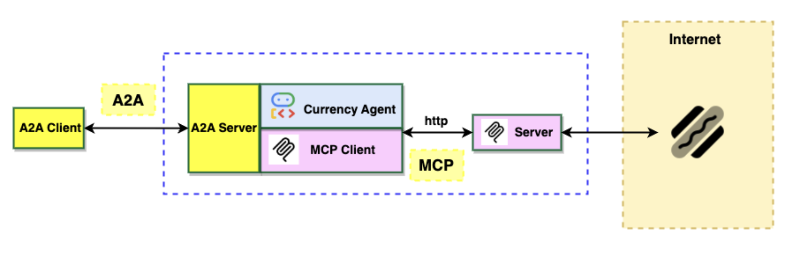

# Agentic AI Protocols: MCP, ACP & A2A

## 2-Week Nanodegree Module

### **Module Overview**

This self-paced 2-week module provides comprehensive instruction on building production-ready agent communication systems using the Model Context Protocol (MCP), Agent Communication Protocol (ACP), and Agent-to-Agent (A2A) protocols. Through hands-on tutorials and practical examples, you'll develop skills to create interoperable, distributed agent architectures.



### **Prerequisites**

- Completed Agent Frameworks module  
- Completed RAG module  
- Python programming experience (intermediate level)  
- Basic understanding of HTTP/REST APIs  
- Familiarity with LLM APIs and JSON-RPC protocols  
- Experience with virtual environments and package management  

---

## **Week 1: MCP Fundamentals & Implementation**

### **Session 0: Introduction to MCP, ACP, and A2A (Self-Study)**

**Content:** Understanding the agent communication ecosystem, M×N integration problem, and protocol overview
**Materials:** Session0_Introduction_to_MCP_ACP_A2A.md
**Self-Check:** 15-question multiple choice quiz covering core concepts

### **Session 1: Building Your First MCP Server**

**Content:** Hands-on creation of weather information MCP server with tools, resources, and prompts
**Materials:** Session1_Basic_MCP_Server.md + Session1_Basic_MCP_Server-solution.md
**Self-Check:** Multiple choice quiz covering MCP server development concepts

### **Session 2: File System MCP Server**

**Content:** Building advanced MCP server with file operations, error handling, and security
**Materials:** Session2_FileSystem_MCP_Server.md + Session2_FileSystem_MCP_Server-solution.md
**Self-Check:** Multiple choice quiz covering file system integration and security

### **Session 3: LangChain MCP Integration**

**Content:** Client development patterns, tool discovery, and framework integration
**Materials:** Session3_LangChain_MCP_Integration.md + Session3_LangChain_MCP_Integration-solution.md
**Self-Check:** Multiple choice quiz covering client integration patterns

### **Session 4: Production MCP Deployment**

**Content:** Containerization, cloud deployment, authentication, and monitoring
**Materials:** Session4_Production_MCP_Deployment.md + Session4_Production_MCP_Deployment-solution.md
**Self-Check:** Multiple choice quiz covering deployment and production concerns

### **Session 5: Secure MCP Server**

**Content:** Authentication strategies, input validation, rate limiting, and security best practices
**Materials:** Session5_Secure_MCP_Server.md + Session5_Secure_MCP_Server-solution.md
**Self-Check:** Multiple choice quiz covering security implementation

---

## **Week 2: ACP & A2A Agent Communication**

### **Session 6: Agent Communication Protocol (ACP) Fundamentals**

**Content:** ACP architecture, local agent discovery, edge deployment, and framework integration
**Materials:** Session6_ACP_Fundamentals.md + Session6_ACP_Fundamentals-solution.md
**Self-Check:** Multiple choice quiz covering ACP concepts and local coordination

### **Session 7: Agent-to-Agent Communication (A2A)**

**Content:** A2A protocol fundamentals, agent discovery, communication patterns, and multi-agent coordination
**Materials:** Session7_Agent_to_Agent_Communication.md + Session7_Agent_to_Agent_Communication-solution.md
**Self-Check:** Multiple choice quiz covering A2A protocol and agent communication

### **Session 8: Advanced Agent Workflows**

**Content:** Complex multi-agent orchestration, workflow patterns, and advanced coordination techniques
**Materials:** Session8_Advanced_Agent_Workflows.md + Session8_Advanced_Agent_Workflows-solution.md
**Self-Check:** Multiple choice quiz covering advanced workflow patterns

### **Session 9: Production Agent Deployment**

**Content:** Deploying distributed agent networks with fault tolerance, scaling, and monitoring
**Materials:** Session9_Production_Agent_Deployment.md + Session9_Production_Agent_Deployment-solution.md
**Self-Check:** Multiple choice quiz covering production deployment strategies

## **Capstone Project: Distributed Agent Ecosystem**

**Project Overview:** Build a comprehensive multi-agent system demonstrating MCP, ACP, and A2A integration

### Requirements

- Implement local agent coordination using ACP  
- Create MCP servers for data access and tool integration  
- Enable A2A communication for cross-platform collaboration  
- Deploy to production environment with monitoring  

### Deliverables

- Complete source code with documentation  
- Working deployment with monitoring dashboard  
- Architecture documentation and API specifications  

---

## **Comprehensive Resource Library**

### **Core Documentation**

- [MCP Official Specification](https://modelcontextprotocol.io/)  
- [A2A Protocol Documentation](https://a2aprotocol.ai/)  
- [Anthropic MCP Guide](https://www.anthropic.com/news/model-context-protocol)  

### **Video Tutorials**

- [MCP Introduction Video](https://www.youtube.com/watch?v=FLpS7OfD5-s)  
- [Building Your First MCP Server](https://www.youtube.com/results?search_query=MCP+server+tutorial)  

### **Hands-on Tutorials**

- [Currency Agent Codelab](https://codelabs.developers.google.com/codelabs/currency-agent#0)  
- [DataCamp MCP Tutorial](https://www.datacamp.com/tutorial/mcp-model-context-protocol)  
- [TowardsDataScience MCP Guide](https://towardsdatascience.com/model-context-protocol-mcp-tutorial-build-your-first-mcp-server-in-6-steps/)  

### **Advanced Reading**

- [Agent Interoperability Survey](https://arxiv.org/html/2505.02279v1)  
- [RAG + MCP Integration](https://medium.com/@bravekjh/rag-mcp-supercharging-ai-agents-with-retrieval-augmented-generation-and-model-context-protocol-775ff5a7206f)  
- [MCP Security Analysis](https://medium.com/data-science-collective/mcp-is-a-security-nightmare-heres-how-the-agent-security-framework-fixes-it-fd419fdfaf4e)  

### **Code Repositories**

- [LangChain MCP Adapters](https://github.com/langchain-ai/langchain-mcp-adapters)  
- [FastAPI MCP Server](https://github.com/tadata-org/fastapi_mcp)  
- [A2A Python SDK](https://github.com/a2aproject/A2A)  

---

## **Learning Outcomes**

By completion, students will be able to:

### **Technical Skills**

1. **Design and implement MCP servers** with tools, resources, and prompts  
2. **Create MCP clients** that integrate with multiple servers  
3. **Implement ACP coordination** for local agent orchestration  
4. **Enable A2A protocol** for cross-platform agent communication  
5. **Deploy distributed agent systems** to cloud and edge platforms  
6. **Secure agent communications** with authentication and validation  

### **Architectural Understanding**

1. **Differentiate between MCP, ACP, and A2A** use cases and environments  
2. **Design interoperable agent ecosystems** for cloud and edge deployment  
3. **Implement proper separation of concerns** between protocols and agents  
4. **Plan for scalability and fault tolerance** in distributed and offline systems  

### **Industry Readiness**

1. **Follow protocol specifications** and best practices  
2. **Debug multi-agent communication** issues  
3. **Monitor and maintain** production agent systems  
4. **Evaluate trade-offs** between different architectural approaches  

---

## **Self-Assessment Structure**

### **Knowledge Checks**

Each session includes multiple choice quizzes to verify understanding of key concepts:

- **Session 0**: 15 questions covering MCP, ACP, and A2A fundamentals  
- **Sessions 1-9**: 8-12 questions per session covering specific implementation topics  
- **Capstone Project**: Self-evaluation checklist for project completeness  

### **Practical Validation**

- **Code Examples**: Each session provides working code examples with solutions  
- **Hands-on Tutorials**: Step-by-step implementation guides for all major concepts  
- **Self-Check Activities**: Verify your implementations work as expected  

### **Progress Tracking**

- Complete all session materials and quizzes to demonstrate mastery  
- Successfully implement and test all code examples  
- Build and deploy the capstone project following provided specifications  

---

## **Development Environment Setup**

### **Required Software**

```bash
# Python environment
python3.11+
pip install fastmcp langchain-mcp-adapters a2a-python-sdk

# Node.js (for TypeScript MCP development)
node18+
npm install @modelcontextprotocol/sdk

# Cloud tools
gcloud CLI
docker
```

### **Recommended Tools**

- **IDE**: VS Code with MCP extension  
- **API Testing**: Postman or curl  
- **Monitoring**: Prometheus + Grafana  
- **Version Control**: Git with GitHub/GitLab  

### **Development Workflow**

1. **Local Development**: Use stdio transport for rapid iteration  
2. **Integration Testing**: Deploy to local containers  
3. **Production Deployment**: Cloud platforms with proper monitoring  

---

## **Completion Requirements**

To successfully complete this nanodegree module:

1. Study all session materials (Sessions 0-9)  
2. Complete all multiple choice quizzes with satisfactory scores  
3. Successfully implement all code examples and tutorials  
4. Build and deploy the capstone project demonstrating integration of all three technologies  

**Completion Recognition:** "MCP, ACP & A2A Nanodegree Module Certificate"

---

## **Self-Study Support**

### **Available Resources**

- **Comprehensive Documentation**: Each session includes detailed explanations and examples  
- **Solution Code**: Complete implementations provided for all exercises  
- **External References**: Curated links to official documentation and tutorials  
- **Community Resources**: Links to relevant GitHub repositories and developer communities  

### **Learning Path**

1. **Week 1**: Master MCP fundamentals through hands-on server and client development  
2. **Week 2**: Explore ACP coordination patterns and A2A protocol implementation  
3. **Capstone**: Integrate all technologies in a production-ready distributed system  

This module provides comprehensive, self-paced instruction on the cutting-edge protocols shaping the future of agentic AI systems. You'll gain practical experience building interoperable agent architectures that work in cloud, edge, and offline environments.
