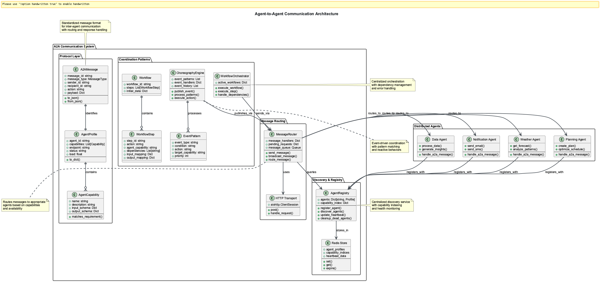

# 🎯 Session 0: Introduction to MCP, ACP, and A2A

This comprehensive introduction covers three revolutionary protocols transforming AI communication: Model Context Protocol (MCP), Agent Communication Protocol (ACP), and Agent-to-Agent (A2A). You'll understand how these standards eliminate integration complexity while enabling universal AI connectivity.


*Figure 1: Model Context Protocol ecosystem showing standardized connections between AI models and external data sources*

## 🎯 Observer Path: Essential Communication Protocols

### The Communication Revolution Overview

Imagine a world where every AI agent speaks the same language. Where your Claude agent can seamlessly access your company's database, coordinate with your GPT-4 assistant, and collaborate with your partner's AI systems—all without a single custom integration.

**Welcome to the era of standardized AI communication.** Three revolutionary protocols are transforming how AI systems communicate:

- **MCP (Model Context Protocol)**: AI-to-tool standardization
- **ACP (Agent Communication Protocol)**: Local agent coordination
- **A2A (Agent-to-Agent)**: Cross-organizational collaboration

These protocols eliminate the integration nightmare that has plagued AI development, forming the foundation of truly scalable AI ecosystems.

### Understanding MCP: The Universal AI Interface

**The Integration Problem**: Before MCP, building AI applications required custom integration code for every data source. The result was exponentially complex, brittle, and expensive connections.

**MCP's Solution**: Think of it as the "USB-C moment" for AI—one protocol connecting any AI model to any data source through a standardized interface.

**The Impact**: Instead of N×M custom integrations (5 AI systems × 10 data sources = 50 integrations), MCP reduces this to N+M connections (5+10 = 15). That's a 70% reduction in complexity.

### MCP Integration Examples

**Traditional Approach Problems**:

```python
# Custom integration for each AI system
class CustomDatabaseConnector:
    def connect_to_claude(self):
        # 50+ lines of custom integration code
        pass
```

Traditional approach requires separate connectors for each AI system with different APIs, authentication, and data formats.

**MCP Solution**:

```python
# Single standard interface
@mcp_server.tool()
async def query_database(query: str) -> dict:
    """Execute database query - works with any MCP client"""
    results = await db.execute(query)
    return {"data": results, "schema": schema}
```

Single tool definition works with all MCP-compatible AI systems. Standard response format ensures consistency while MCP protocol handles authentication and transport.


*Figure 2: MCP transforms the M×N integration problem into a manageable M+N pattern*

**MCP Adoption**: Major tech companies including OpenAI, Google DeepMind, and Microsoft have adopted MCP for standardized tool connectivity.

### Understanding ACP: Local Agent Coordination

**The Local Coordination Challenge**: Smart factory agents managing quality control, inventory, and scheduling need real-time coordination without cloud dependencies due to security and latency requirements.

**ACP's Solution**: IBM's REST-based standard enables agents to discover and coordinate within shared local environments—from factory floors to autonomous vehicles—without internet dependency.

**Impact**: ACP transforms isolated AI agents into collaborative teams working in secure, air-gapped environments. It's the foundation of IBM's BeeAI platform and the emerging standard for edge AI coordination.

### ACP Local Discovery Example

ACP enables agents to find and coordinate automatically without cloud dependencies:

```python
# Simple local agent registration
class ProcessingAgent:
    def __init__(self):
        self.capabilities = ["data_processing", "file_analysis"]
        self.endpoint = "http://localhost:8080/agent"
```

Processing agents initialize with defined capabilities and local endpoints for communication.

```python
    async def register_with_local_runtime(self):
        await local_registry.register(self.capabilities, self.endpoint)
```

Agents register capabilities without external dependencies using standard HTTP. The local-first design enables offline operation with no specialized libraries required.


*Figure 3: ACP enables local-first agent communication without cloud dependencies*

**ACP Characteristics**:

- **vs MCP**: Agent coordination instead of tool integration
- **vs A2A**: Local-first instead of cross-organization
- **vs Custom**: Standardized REST interface

**Key Use Cases**: Factory automation, edge AI on IoT devices, emergency systems requiring offline operation.

### Understanding A2A: Cross-Organizational Agent Collaboration

**The Agent Economy Vision**: Travel booking agents negotiating with airline agents, supply chain AI coordinating with supplier systems, and customer service bots seamlessly handing off to partner specialists—all automatically and securely.

**A2A's Promise**: Google's open standard enables AI agents to discover and collaborate across organizational boundaries, turning the internet into a vast ecosystem of cooperating AI services.

**Transformation Impact**: A2A enables the "agent economy" where companies monetize AI capabilities as discoverable services, creating new business models and partnership opportunities.

### A2A Cross-Organizational Discovery

A2A's simplicity enables automatic agent discovery across organizations:

```json
{
  "agent": {
    "name": "flight_search_agent",
    "organization": "airline-corp.com"
  },
  "capabilities": [
    {
      "name": "search_flights",
      "input_schema": {
        "origin": "string",
        "destination": "string"
      }
    }
  ]
}
```

Standard JSON format for agent capability advertisement, published at `.well-known/agent.json` for automatic discovery. Cross-organizational communication uses HTTPS with authentication.


*Figure 4: A2A enables secure agent collaboration across organizational boundaries*

**Enterprise A2A Examples**:

**Travel Industry**: Platform agents discover airline agents, establish secure handshakes, handle specialized flight searches, and integrate results into comprehensive itineraries.

**Supply Chain**: Manufacturing agents coordinate with suppliers, inventory systems communicate across boundaries, and real-time demand signals flow between partners.

---

## 📝 Participant Path: Practical Applications

*Prerequisites: Complete Observer Path sections above*

### Protocol Integration Patterns

When combined, these protocols create complete enterprise AI ecosystems:

**Protocol Comparison**:

| Protocol | Scope | Environment | Best for |
|----------|-------|-------------|----------|
| **MCP** | AI ↔ Tools | Cloud/Server | Data integration |
| **ACP** | Agent ↔ Agent | Local/Edge | Offline coordination |
| **A2A** | Agent ↔ Agent | Cross-org | Business partnerships |

### Multi-Protocol Integration Example

```python
# Step 1: MCP - Access customer preferences
preferences = await mcp_client.call_tool("get_customer_prefs", user_id)
```

MCP retrieves data from internal systems using standardized tool calls.

```python
# Step 2: ACP - Local processing coordination
processed_data = await acp_registry.find("processor").process(preferences)
```

ACP coordinates with local processing agents for data transformation.

```python
# Step 3: A2A - External flight search
flights = await a2a_client.request("airline-corp.com", "search_flights", params)
```

A2A communicates with external partner agents for specialized services.

### MCP Inspector: Essential Development Tool

**MCP Inspector** is the essential debugging and testing tool for MCP servers—think "Postman for MCP". It provides interactive testing, schema validation, and real-time debugging capabilities.

**Development Impact**: Enables test-driven development, reduces debugging time by 40%, and ensures protocol compliance before deployment.

### Inspector Workflow

**Installation and Startup**:

```bash
# Install and start inspector
npx @modelcontextprotocol/inspector
# Launches on http://localhost:6274
```

**Server Connection**:

```bash
# Example server connection
stdio://python weather_server.py
```

**Interactive Testing Features**:

- Browse available tools, resources, and prompts
- Execute tools with auto-generated forms
- View real-time responses with syntax highlighting


*Figure 5: MCP Inspector provides interactive testing with auto-generated forms and real-time feedback*

**Production Development Pattern**:

1. **Develop**: Write MCP server tools
2. **Test**: Use Inspector to validate functionality
3. **Debug**: Inspector shows detailed error messages
4. **Deploy**: Export configuration for production

**Team Features**: Schema validation, performance monitoring, configuration export to Claude Desktop/Cursor IDE, and complete JSON-RPC message logging.

---

## ⚙️ Implementer Path: Advanced Topics

*Prerequisites: Complete Observer and Participant paths*

For comprehensive coverage of advanced protocol implementations, enterprise patterns, and production deployments:

- ⚙️ [Advanced MCP Patterns](Session4_Advanced_Server_Architecture.md)
- ⚙️ [Enterprise Security](Session5_Advanced_OAuth.md)
- ⚙️ [Production Monitoring](Session4_Production_Monitoring_Systems.md)

---

## Getting Started and Next Steps

### Your Learning Journey

**Phase 1: Master MCP (Sessions 1-5)**:

- Build your first MCP server with practical tools
- Integrate with file systems and databases securely
- Deploy production-ready MCP servers with monitoring
- Connect MCP servers to LangChain agents for complex workflows

**Phase 2: Agent Communication (Sessions 6-7)**:

- Implement ACP for local agent coordination patterns
- Build A2A-enabled agents for cross-organizational collaboration
- Create multi-agent orchestration systems

**Phase 3: Enterprise Deployment (Sessions 8-9)**:

- Advanced agent workflows with error handling and resilience
- Production deployment with monitoring and scaling
- End-to-end enterprise agent ecosystems

### Development Environment Setup

**Before Session 1**:

1. Install Node.js and Python 3.8+
2. Set up development environment with VSCode
3. Install MCP Inspector: `npx @modelcontextprotocol/inspector`

### Enterprise Planning Checklist

**Architecture Considerations**:

- Which systems need MCP server integration?
- Where will agent coordination benefit from ACP?
- What external partnerships could leverage A2A?

**Security Planning**:

- Authentication and authorization strategies
- Network security and API access controls
- Data privacy and compliance requirements

**Deployment Strategy**:

- Development and testing environments
- Production monitoring and alerting
- Scaling and performance optimization

## Key Takeaways

**Technical Foundation**:

- **MCP**: Standardizes AI-to-tool communication, eliminating N×M integration complexity
- **ACP**: Enables efficient local agent coordination for edge environments
- **A2A**: Facilitates cross-organizational agent collaboration and the "agent economy"

**Integration Power**: Combined protocols create comprehensive enterprise AI ecosystems where systems communicate naturally and efficiently.

**Next Steps**: Build these protocols from the ground up, starting with your first MCP server and progressing to complex multi-protocol applications.

---

## Additional Resources

- [Model Context Protocol Official Site](https://modelcontextprotocol.io/) - Complete MCP specification and examples
- [Agent Communication Protocol](https://agentcommunicationprotocol.dev/) - ACP documentation and tutorials
- [A2A Protocol GitHub](https://github.com/a2a-protocol) - Agent-to-Agent protocol implementations
- [MCP Inspector](https://github.com/modelcontextprotocol/inspector) - Essential tool for MCP development
- [Enterprise AI Integration Patterns](https://enterprise-ai-patterns.org/) - Best practices for production deployments

---

## Practical Exercise

**Challenge:** Set up your development environment and explore the protocol ecosystem.

### Tasks

1. **Install MCP Inspector** and connect to a sample MCP server
2. **Explore protocol differences** by comparing MCP, ACP, and A2A use cases
3. **Plan your integration** by identifying which protocols your projects need
4. **Set up development tools** including VSCode, Python, and Node.js

### Expected Outcomes

- Working MCP Inspector installation
- Understanding of when to use each protocol
- Development environment ready for hands-on sessions
- Clear plan for your learning journey through the nanodegree

**Hint:** Start with MCP Inspector to see the protocols in action before diving into implementation.

---

## 📝 Multiple Choice Test - Session 0

**Question 1:** What is the primary purpose of the Model Context Protocol (MCP)?  
A) To enable direct communication between AI agents
B) To manage agent discovery across organizations
C) To standardize how LLMs interact with external data sources and tools
D) To provide a framework for building AI agents

**Question 2:** Which protocol is designed for local-first agent coordination with minimal overhead?  
A) A2A (Agent-to-Agent)
B) MCP (Model Context Protocol)
C) ADK (Agent Development Kit)
D) ACP (Agent Communication Protocol)

**Question 3:** How do agents discover each other in the A2A protocol?  
A) Through manual configuration files
B) Using centralized agent registries only
C) Via `.well-known/agent.json` files and discovery services
D) Through direct IP address connections

**Question 4:** What is the primary function of MCP Inspector?  
A) To deploy MCP servers to production
B) To test, debug, and validate MCP servers
C) To create new MCP protocols
D) To monitor agent-to-agent communication

**Question 5:** When should you use A2A protocol instead of MCP?  
A) When you need to access local databases
B) When you need agents to communicate across organizational boundaries
C) When you need to expose tools to LLMs
D) When you need to manage prompt templates

**Question 6:** What transport mechanism does MCP typically use for communication?  
A) HTTP REST only
B) WebSocket only
C) stdio (standard input/output) and other transports
D) gRPC only

**Question 7:** In ACP, how do agents discover each other in offline environments?  
A) Through cloud-based registries only
B) Using local runtime discovery and embedded metadata
C) They cannot discover each other offline
D) Through manual configuration files

**Question 8:** Which of the following is NOT a key problem that A2A solves?  
A) Model training optimization
B) Cross-organization collaboration
C) Agent discovery
D) Communication standards

**Question 9:** What is the recommended development path for mastering these protocols?  
A) Learn all three simultaneously
B) Start with ACP, then MCP, then A2A
C) Start with MCP, then ACP, then A2A
D) Start with A2A, then ACP, then MCP

**Question 10:** Which major companies adopted MCP in 2024-2025?  
A) Only Anthropic and small startups
B) Microsoft, Google, OpenAI, and major tech leaders
C) Primarily academic institutions
D) Only cloud service providers

[**🗂️ View Test Solutions →**](Session0_Test_Solutions.md)
---

## 🧭 Navigation

**Next:** [Session 1 - Basic MCP Server →](Session1_Basic_MCP_Server.md)
---
