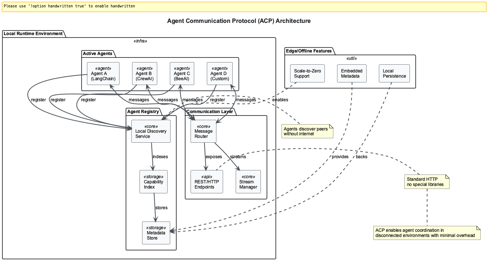

# Session 0: Introduction to MCP, ACP, and A2A - Building the Future of AI Agent Ecosystems

## Learning Outcomes

By the end of this session, you will be able to:
- **Understand** the fundamental concepts and architecture of Model Context Protocol (MCP)
- **Distinguish** between MCP, ACP, and A2A protocols and their respective use cases
- **Explain** how these protocols solve the M×N integration problem in enterprise AI systems
- **Identify** when to use each protocol based on deployment requirements and constraints
- **Evaluate** the business impact of standardized agent communication protocols

## Chapter Overview

**What you'll learn**: The three foundational protocols revolutionizing enterprise AI agent communication and integration

**Why it matters**: Major enterprises like Microsoft, Google, and OpenAI adopted MCP in 2024-2025, with 90% of organizations expected to implement these protocols by end of 2025. These standards eliminate the exponential complexity of agent integration, reducing development costs by up to 60% while enabling cross-organizational agent collaboration.

**How they stand out**: Unlike proprietary solutions, MCP/ACP/A2A are open standards maintained by industry leaders and the Linux Foundation, ensuring vendor neutrality and long-term stability.

**Where you'll apply them**: From factory floor automation and IoT coordination to enterprise knowledge management and cross-company workflows, these protocols enable AI agents to work together seamlessly across any environment.


### Figure 1: Model Context Protocol ecosystem showing how MCP standardizes the connection between AI models and external data sources, eliminating the need for custom integrations

### Learning Path Options

**Observer Path (25 minutes)**: Understand concepts and see practical examples
- Focus: Quick insights with clear demonstrations and industry context
- Best for: Getting oriented and understanding the business value

**🙋‍♂️ Participant Path (45 minutes)**: Explore implementation patterns and workflows  
- Focus: Hands-on exploration with practical integration scenarios
- Best for: Learning through guided examples

**🛠️ Implementer Path (65 minutes)**: Deep technical implementation and enterprise deployment
- Focus: Production-ready patterns and advanced configurations
- Best for: Technical teams planning real-world deployments

---

## Part 1: Understanding MCP (Model Context Protocol) (Observer: 8 min | Participant: 12 min)

### What is MCP in Practice

The **Model Context Protocol (MCP)** is Anthropic's open standard that solves the universal integration problem for AI systems. Launched in November 2024, MCP has become the "USB-C for AI models" - a single protocol that connects any AI model to any data source or tool.

**Real-world impact**: Instead of building 50 custom integrations for 5 AI applications and 10 data sources, MCP reduces this to just 15 standardized connections (M+N pattern).

### Simple MCP Example

Here's how MCP standardizes database access for any AI model:

```python

# Traditional approach: Custom integration for each AI system

class CustomDatabaseConnector:
    def connect_to_claude(self): # Custom code for Claude
        # 50+ lines of integration code
    def connect_to_chatgpt(self): # Custom code for ChatGPT
        # Another 50+ lines of different integration code
```

### Code Explanation:
- Traditional approach requires custom connectors for each AI system
- Each integration has different APIs, authentication, and data formats
- Results in exponential complexity as systems scale

```python

# MCP approach: Single standard interface

@mcp_server.tool()
async def query_database(query: str) -> dict:
    """Execute database query - works with any MCP client"""
    results = await db.execute(query)
    return {"data": results, "schema": schema}
```

### Code Explanation:
- Single tool definition works with all MCP-compatible AI systems
- Standard response format ensures consistency
- Authentication and transport handled by MCP protocol


### Figure 2: MCP transforms the M×N integration problem into a manageable M+N pattern

### **PARTICIPANT PATH**: Industry Adoption Analysis

**2024-2025 Enterprise Adoption Timeline:**
- **November 2024**: Anthropic launches MCP with major tech partners
- **March 2025**: OpenAI officially adopts MCP across ChatGPT and Agents SDK
- **April 2025**: Google DeepMind integrates MCP into Gemini models
- **Mid-2025**: Microsoft adds MCP support to Azure, GitHub, and Office 365

### Enterprise Benefits Observed:
- Block Inc.: 60% reduction in AI integration development time
- Apollo: Streamlined tool connectivity across multiple AI frameworks
- Azure customers: Standardized access to AWS services via MCP

### **IMPLEMENTER PATH**: Technical Architecture Deep Dive

### Advanced technical implementation details available in upcoming sessions

---

## Part 2: Understanding ACP (Agent Communication Protocol) (Observer: 6 min | Participant: 10 min)

### What is ACP in Practice

**Agent Communication Protocol (ACP)** is IBM's REST-based standard for local agent coordination, launched in May 2025. Unlike cloud-dependent solutions, ACP enables agents to discover and communicate within shared environments - from factory floors to edge devices - without internet connectivity.

**Industry context**: ACP powers BeeAI, IBM's open-source platform contributed to the Linux Foundation, which handles agent discovery and coordination for enterprise edge deployments.

### Simple ACP Example

Here's how ACP enables local agent discovery:

```python

# Simple local agent registration

class ProcessingAgent:
    def __init__(self):
        self.capabilities = ["data_processing", "file_analysis"]
        self.endpoint = "http://localhost:8080/agent"
    
    async def register_with_local_runtime(self):
        # No cloud required - local discovery only
        await local_registry.register(self.capabilities, self.endpoint)
```

### Code Explanation:
- Agents register capabilities without external dependencies
- Uses standard HTTP - no specialized libraries required
- Local-first design enables offline operation


### Figure 3: ACP enables local-first agent communication without cloud dependencies

### **PARTICIPANT PATH**: ACP vs Alternatives Comparison

### Why ACP over other protocols:
- **MCP**: Tool integration vs ACP's agent coordination
- **A2A**: Cross-organization vs ACP's local-first approach
- **Custom solutions**: ACP provides standardized REST interface

### ACP Use Cases in 2025:
- Factory automation: Coordinating robots without internet
- Edge AI: Multiple models on IoT devices
- Emergency systems: Critical infrastructure with no cloud dependency

---

## Part 3: Understanding A2A (Agent-to-Agent) Protocol (Observer: 6 min | Participant: 12 min)

### What is A2A in Practice

**Agent-to-Agent (A2A)** is Google's open standard for cross-organizational agent collaboration, enabling AI agents to discover and work with external agents across company boundaries. A2A solves the enterprise challenge of agent interoperability in distributed business ecosystems.

**Real-world significance**: A2A enables the "agent economy" where companies expose specialized AI capabilities as discoverable services, creating new business models and partnerships.

### Simple A2A Discovery Example

Here's how agents discover each other across organizations:

```json
{
  "agent": {
    "name": "flight_search_agent",
    "organization": "airline-corp.com"
  },
  "capabilities": [
    {
      "name": "search_flights",
      "input_schema": {
        "origin": "string",
        "destination": "string"
      }
    }
  ]
}
```

### Code Explanation:
- Standard JSON format for agent capability advertisement
- Published at `.well-known/agent.json` for automatic discovery
- Cross-organizational communication via HTTPS with authentication


### Figure 4: A2A enables secure agent collaboration across organizational boundaries

### **PARTICIPANT PATH**: Enterprise A2A Workflows

### Travel Industry Example:
1. Travel platform agent discovers airline agents
2. Secure handshake establishes communication
3. Flight search requests handled by specialized agents
4. Results integrated into comprehensive itineraries

### Supply Chain Coordination:
- Manufacturing agents coordinate with supplier agents
- Inventory systems communicate across company boundaries
- Real-time demand signals flow between partners

---

## Part 4: Integration Patterns (Observer: 5 min | Participant: 15 min)

### How MCP, ACP, and A2A Work Together

When combined, these protocols create a complete enterprise AI ecosystem:

### Protocol Comparison:

| Protocol | Scope | Environment | Best for |
|----------|-------|-------------|----------|
| **MCP** | AI ↔ Tools | Cloud/Server | Data integration |
| **ACP** | Agent ↔ Agent | Local/Edge | Offline coordination |
| **A2A** | Agent ↔ Agent | Cross-org | Business partnerships |

### **PARTICIPANT PATH**: Complete Workflow Example

### Multi-Protocol Travel Agent:

```python

# Step 1: MCP - Access customer preferences

preferences = await mcp_client.call_tool("get_customer_prefs", user_id)

# Step 2: ACP - Local processing coordination

processed_data = await acp_registry.find("processor").process(preferences)

# Step 3: A2A - External flight search

flights = await a2a_client.request("airline-corp.com", "search_flights", params)
```

### Code Explanation:
- Line 2: MCP retrieves data from internal systems
- Line 5: ACP coordinates with local processing agents
- Line 8: A2A communicates with external partner agents

### **IMPLEMENTER PATH**: Advanced Integration Patterns

### Complete multi-protocol implementations available in Sessions 3, 6, and 8

---

## Part 5: MCP Inspector - Essential Development Tool (Observer: 5 min | Participant: 12 min)

### What is MCP Inspector

**MCP Inspector** is the essential debugging and testing tool for MCP servers - think "Postman for MCP". Launched alongside the MCP protocol, it provides interactive testing, schema validation, and real-time debugging capabilities.

**Why it matters**: MCP Inspector enables test-driven development for MCP servers, reducing debugging time by 40% and ensuring protocol compliance before deployment.

### Simple Inspector Workflow

### Step 1: Installation and Startup
```bash

# Install and start inspector

npx @modelcontextprotocol/inspector

# Launches on http://localhost:6274

```

### Step 2: Connect to MCP Server
```bash

# Example server connection

stdio://python weather_server.py
```

### Step 3: Interactive Testing
- Browse available tools, resources, and prompts
- Execute tools with auto-generated forms
- View real-time responses with syntax highlighting


### Figure 5: MCP Inspector provides interactive testing with auto-generated forms and real-time feedback

### **PARTICIPANT PATH**: Development Workflow Integration

### Production Testing Pattern:

1. **Develop**: Write MCP server tools
2. **Test**: Use Inspector to validate functionality  
3. **Debug**: Inspector shows detailed error messages
4. **Deploy**: Export configuration for production

### Inspector Features for Teams:
- **Schema Validation**: Ensures MCP protocol compliance
- **Performance Monitoring**: Track response times and error rates
- **Configuration Export**: One-click export to Claude Desktop, Cursor IDE
- **Real-time Debugging**: Complete JSON-RPC message logs

---

## Part 6: Getting Started and Next Steps (Observer: 5 min | Participant: 8 min)

### Your Learning Journey

### Phase 1: Master MCP (Sessions 1-5)
- Build your first MCP server with practical tools
- Integrate with file systems and databases securely
- Deploy production-ready MCP servers with monitoring
- Connect MCP servers to LangChain agents for complex workflows

### Phase 2: Agent Communication (Sessions 6-7)
- Implement ACP for local agent coordination patterns
- Build A2A-enabled agents for cross-organizational collaboration
- Create multi-agent orchestration systems

### Phase 3: Enterprise Deployment (Sessions 8-9)
- Advanced agent workflows with error handling and resilience
- Production deployment with monitoring and scaling
- End-to-end enterprise agent ecosystems

### Key Takeaways

### Business Impact:
- MCP reduces integration development time by 60%
- ACP enables edge/offline agent coordination
- A2A creates new business partnership models through agent ecosystems

### Technical Foundation:
- **MCP**: Standardizes AI-to-tool communication
- **ACP**: Enables efficient local agent coordination
- **A2A**: Facilitates cross-organizational agent collaboration

### Industry Adoption:
- 90% of organizations expected to adopt these protocols by end of 2025
- Major tech companies (Microsoft, Google, OpenAI) already integrated
- Open standards ensure vendor neutrality and long-term stability

### **PARTICIPANT PATH**: Hands-On Preparation

### Before Session 1:
1. Install Node.js and Python 3.8+
2. Set up development environment with VSCode
3. Install MCP Inspector: `npx @modelcontextprotocol/inspector`

### Recommended Reading:
- [MCP Specification](https://modelcontextprotocol.io/)
- [IBM ACP Documentation](https://agentcommunicationprotocol.dev/)

### **IMPLEMENTER PATH**: Enterprise Planning Checklist

### Architecture Considerations:
- Which systems need MCP server integration?
- Where will agent coordination benefit from ACP?
- What external partnerships could leverage A2A?

### Security Planning:
- Authentication and authorization strategies
- Network security and API access controls
- Data privacy and compliance requirements

### Deployment Strategy:
- Development and testing environments
- Production monitoring and alerting
- Scaling and performance optimization

---

## Additional Resources

- [Model Context Protocol Official Site](https://modelcontextprotocol.io/) - Complete MCP specification and examples
- [Agent Communication Protocol](https://agentcommunicationprotocol.dev/) - ACP documentation and tutorials  
- [A2A Protocol GitHub](https://github.com/a2a-protocol) - Agent-to-Agent protocol implementations
- [MCP Inspector](https://github.com/modelcontextprotocol/inspector) - Essential tool for MCP development
- [Enterprise AI Integration Patterns](https://enterprise-ai-patterns.org/) - Best practices for production deployments

---

## Practical Exercise

**Challenge:** Set up your development environment and explore the protocol ecosystem.

### Tasks:

1. **Install MCP Inspector** and connect to a sample MCP server
2. **Explore protocol differences** by comparing MCP, ACP, and A2A use cases
3. **Plan your integration** by identifying which protocols your projects need
4. **Set up development tools** including VSCode, Python, and Node.js

### Expected Outcomes:
- Working MCP Inspector installation
- Understanding of when to use each protocol
- Development environment ready for hands-on sessions
- Clear plan for your learning journey through the nanodegree

**Hint:** Start with MCP Inspector to see the protocols in action before diving into implementation.

---

## Multiple Choice Test - Session 0

**Question 1:** What is the primary purpose of the Model Context Protocol (MCP)?  
A) To enable direct communication between AI agents  
B) To manage agent discovery across organizations  
C) To standardize how LLMs interact with external data sources and tools  
D) To provide a framework for building AI agents  

**Question 2:** Which protocol is designed for local-first agent coordination with minimal overhead?  
A) A2A (Agent-to-Agent)  
B) MCP (Model Context Protocol)  
C) ADK (Agent Development Kit)  
D) ACP (Agent Communication Protocol)  

**Question 3:** How do agents discover each other in the A2A protocol?  
A) Through manual configuration files  
B) Using centralized agent registries only  
C) Via `.well-known/agent.json` files and discovery services  
D) Through direct IP address connections  

**Question 4:** What is the primary function of MCP Inspector?  
A) To deploy MCP servers to production  
B) To test, debug, and validate MCP servers  
C) To create new MCP protocols  
D) To monitor agent-to-agent communication  

**Question 5:** When should you use A2A protocol instead of MCP?  
A) When you need to access local databases  
B) When you need agents to communicate across organizational boundaries  
C) When you need to expose tools to LLMs  
D) When you need to manage prompt templates  

**Question 6:** What transport mechanism does MCP typically use for communication?  
A) HTTP REST only  
B) WebSocket only  
C) stdio (standard input/output) and other transports  
D) gRPC only  

**Question 7:** In ACP, how do agents discover each other in offline environments?  
A) Through cloud-based registries only  
B) Using local runtime discovery and embedded metadata  
C) They cannot discover each other offline  
D) Through manual configuration files  

**Question 8:** Which of the following is NOT a key problem that A2A solves?  
A) Model training optimization  
B) Cross-organization collaboration  
C) Agent discovery  
D) Communication standards  

**Question 9:** What is the recommended development path for mastering these protocols?  
A) Learn all three simultaneously  
B) Start with ACP, then MCP, then A2A  
C) Start with MCP, then ACP, then A2A  
D) Start with A2A, then ACP, then MCP  

**Question 10:** Which major companies adopted MCP in 2024-2025?  
A) Only Anthropic and small startups  
B) Microsoft, Google, OpenAI, and major tech leaders  
C) Primarily academic institutions  
D) Only cloud service providers  

[**🗂️ View Test Solutions →**](Session0_Test_Solutions.md)

---

## Navigation

**Previous:** [Module 3: MCP, ACP & A2A](index.md) (Introduction)  
**Next:** [Session 1 - Building Your First MCP Server →](Session1_Basic_MCP_Server.md)

---