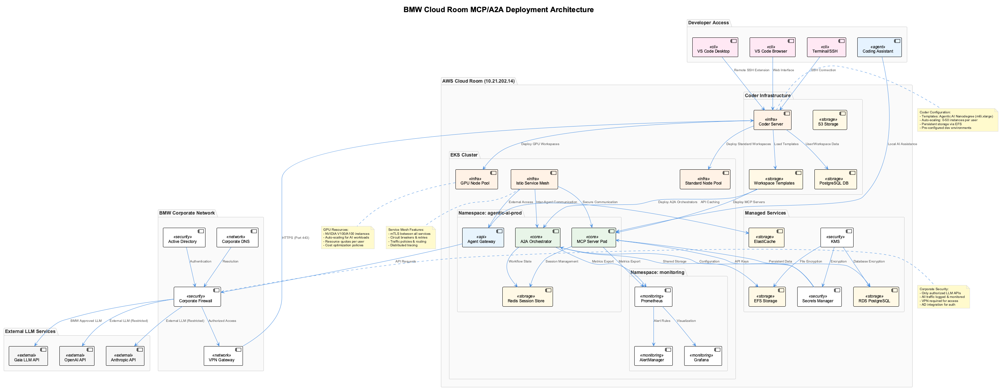
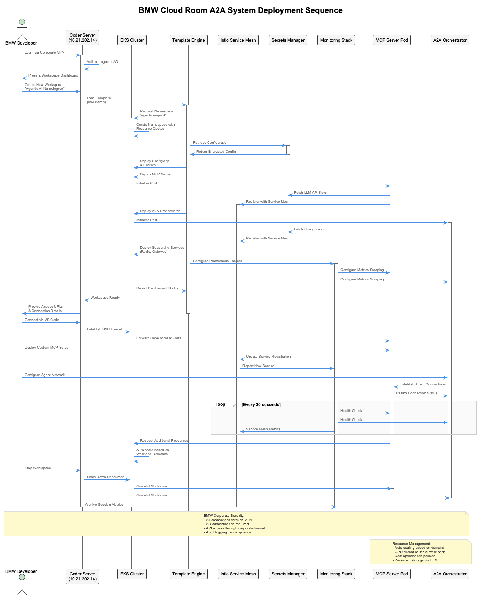
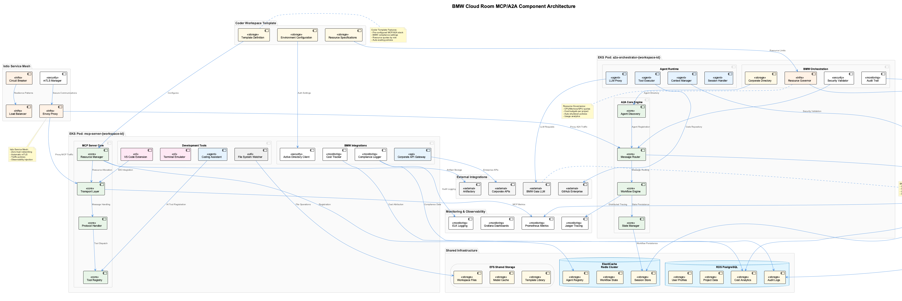

# 🏭 Session 10: Enterprise Integration & Production Deployment in BMW Cloud Environment

## From Innovation Labs to Production Reality: Deploying AI Agents in Corporate Infrastructure

Picture this: You've built an elegant multi-agent system that can solve complex problems, coordinate workflows, and deliver intelligent insights. It works beautifully in your development environment, demos flawlessly to stakeholders, and passes every technical review. But now comes the ultimate challenge—deploying this digital intelligence into the real world of enterprise infrastructure, where security policies are non-negotiable, compliance is legally mandated, and downtime isn't just inconvenient—it's business-critical.

Welcome to BMW's cloud environment, where automotive engineering meets cutting-edge AI infrastructure. Here, we don't just deploy agents; we integrate them into a sophisticated ecosystem that must meet the rigorous standards of one of the world's leading automotive manufacturers. Every connection is secured, every API call is monitored, every resource allocation is optimized, and every deployment must align with both technical excellence and regulatory compliance.

This isn't just about Kubernetes and containers—it's about creating a production-grade AI platform that can scale from prototype to enterprise deployment while maintaining the security, reliability, and performance standards that BMW's business operations demand.

*Welcome to Enterprise Integration & Production Deployment—where innovation meets industrial-grade infrastructure.*



## 🎯📝⚙️ Learning Path Overview

This session offers three distinct learning paths designed to match your enterprise deployment goals:

=== "🎯 Observer (60-90 min)"

    **Focus**: Understanding enterprise deployment architecture and BMW cloud infrastructure
    
    **Activities**: Cloud room concepts, Coder platform overview, security considerations
    
    **Ideal for**: Decision makers, architects, enterprise stakeholders

=== "📝 Participant (4-6 hours)"

    **Focus**: Hands-on deployment using BMW's Coder environment
    
    **Activities**: Workspace creation, MCP/A2A deployment, monitoring setup
    
    **Ideal for**: Developers, technical leads, platform engineers

=== "⚙️ Implementer (12-16 hours)"

    **Focus**: Complete enterprise-scale deployment with advanced configurations
    
    **Activities**: Custom templates, advanced security, monitoring, cost optimization
    
    **Ideal for**: Senior engineers, platform architects, DevOps specialists

## 🎯 Observer Path: BMW Cloud Infrastructure Overview

### The BMW Cloud Environment: Where Engineering Meets Innovation

BMW's approach to cloud development reflects the same precision and attention to detail that goes into manufacturing world-class vehicles. Just as every component in a BMW is carefully engineered, tested, and integrated into a cohesive system, our cloud infrastructure follows the same principles of excellence.

### Core Infrastructure: The Foundation

**AWS Cloud Room (10.21.202.14)**
The heart of BMW's development environment is an AWS cloud room that operates within the corporate network. This isn't just a simple cloud deployment—it's a carefully architected environment that balances the flexibility developers need with the security and compliance requirements that enterprise operations demand.

**Coder Platform Integration**
Coder serves as our developer experience platform, providing instant access to fully configured development environments. Think of it as BMW's approach to development infrastructure—standardized, reliable, and optimized for performance.

### Security Architecture: Zero-Trust by Design

**Corporate Network Integration**
Every connection flows through BMW's corporate firewall, ensuring that only authorized personnel can access development resources. Active Directory integration provides seamless authentication while maintaining enterprise security standards.

**VPN-Based Access**
All developer access requires VPN connectivity, creating a secure tunnel from any location into BMW's development infrastructure. This ensures that sensitive development work remains protected regardless of where developers are working.

**Compliance-First Approach**
Every component is designed with regulatory compliance in mind—GDPR for data protection, industry-specific automotive standards, and internal BMW security policies are built into the infrastructure fabric.

### The Coder Advantage: Development Excellence

**Template-Driven Consistency**
The "Agentic AI Nanodegree (m6i.xlarge)" template ensures that every developer starts with an identical, optimized environment. No more "it works on my machine" issues—everyone operates from the same foundation.

**Resource Management**
Intelligent scaling from 0-50 instances per user ensures cost optimization while providing the computational power needed for AI development. GPU resources are allocated dynamically based on workload requirements.

**Tool Integration**
Pre-configured access to GitHub Copilot and BMW's own Coding Assistant ensures that developers have AI-powered assistance built into their workflow from day one.

### Enterprise Features That Matter

**Persistent Storage**
Your work is never lost. EFS-backed storage ensures that projects, configurations, and development progress persist across sessions and scale seamlessly as projects grow.

**Multi-Environment Support**
From local development to production deployment, the same templates and configurations work across environments, reducing deployment complexity and risk.

**Cost Transparency**
Built-in cost tracking ensures that resource usage is visible and manageable, with automatic policies that prevent runaway spending while maintaining developer productivity.

## 📝 Participant Path: Hands-On BMW Cloud Deployment

*Prerequisites: Complete Observer Path sections above*

### Accessing the BMW Cloud Environment

#### Step 1: VPN Connection and Authentication

Before accessing any BMW cloud resources, establish your secure connection:

```bash
# Connect to BMW VPN (corporate-specific)
# URL: [Corporate VPN Portal]
# Authentication: Active Directory credentials
```

Once connected, verify your network access:

```bash
# Test connectivity to cloud room
ping 10.21.202.14

# Verify DNS resolution
nslookup coder.bmw-cloud.internal
```

#### Step 2: Coder Workspace Access

Navigate to the Coder platform:

**URL:** `http://10.21.202.14/workspaces`


### Creating Your AI Agent Development Environment

#### Template Selection: Agentic AI Nanodegree

When creating a new workspace, select the pre-configured template:

**Template:** Agentic AI Nanodegree (m6i.xlarge)
**Configuration:**
- CPU: 4 vCPUs (scalable to 16)
- Memory: 16GB RAM (scalable to 64GB)
- Storage: 100GB EFS (persistent)
- GPU: On-demand allocation available

```yaml
# workspace-config.yaml - Template configuration
apiVersion: coder.com/v1
kind: Template
metadata:
  name: agentic-ai-nanodegree
  namespace: bmw-development
spec:
  displayName: "Agentic AI Nanodegree (m6i.xlarge)"
  description: "BMW-optimized environment for MCP/A2A development"
  defaultTTL: "8h"
  maxTTL: "24h"
  icon: /static/bmw-logo.png
  
  parameters:
    - name: gpu_enabled
      displayName: "Enable GPU Support"
      description: "Allocate GPU resources for AI workloads"
      type: bool
      default: false
      
    - name: memory_size
      displayName: "Memory Allocation"
      description: "RAM allocation for the workspace"
      type: string
      default: "16Gi"
      options:
        - name: "Basic (16GB)"
          value: "16Gi"
        - name: "Enhanced (32GB)"
          value: "32Gi"
        - name: "Premium (64GB)"
          value: "64Gi"
```

### MCP Server Deployment in BMW Environment

#### Environment Configuration

Create your MCP server configuration that integrates with BMW's infrastructure:

```yaml
# k8s/bmw-mcp-deployment.yaml
apiVersion: apps/v1
kind: Deployment
metadata:
  name: bmw-mcp-server
  namespace: agentic-ai-prod
  labels:
    app: bmw-mcp-server
    environment: production
    compliance: gdpr-automotive
    cost-center: ai-innovation
annotations:
    bmw.com/project: "agentic-ai-nanodegree"
    bmw.com/owner: "ai-platform-team"
spec:
  replicas: 3
  selector:
    matchLabels:
      app: bmw-mcp-server
  template:
    metadata:
      labels:
        app: bmw-mcp-server
      annotations:
        prometheus.io/scrape: "true"
        prometheus.io/port: "9090"
        istio.io/rev: "1-18-2"
    spec:
      serviceAccountName: bmw-mcp-service-account
      containers:
      - name: mcp-server
        image: bmw-registry.com/mcp-server:v2.1.0
        ports:
        - containerPort: 8080
          name: http-api
        - containerPort: 9090
          name: metrics
        env:
        # BMW-specific environment variables
        - name: BMW_ENVIRONMENT
          value: "production"
        - name: BMW_COMPLIANCE_MODE
          value: "automotive-gdpr"
        - name: GAIA_LLM_ENDPOINT
          valueFrom:
            configMapKeyRef:
              name: bmw-ai-config
              key: gaia.endpoint
        - name: OPENAI_API_KEY
          valueFrom:
            secretKeyRef:
              name: bmw-ai-secrets
              key: openai-key
        # Resource management
        resources:
          requests:
            memory: "1Gi"
            cpu: "500m"
          limits:
            memory: "4Gi"
            cpu: "2000m"
        # Health checks optimized for enterprise
        livenessProbe:
          httpGet:
            path: /health/live
            port: 8080
          initialDelaySeconds: 120
          periodSeconds: 30
          timeoutSeconds: 10
          failureThreshold: 3
        readinessProbe:
          httpGet:
            path: /health/ready
            port: 8080
          initialDelaySeconds: 60
          periodSeconds: 15
          timeoutSeconds: 5
          failureThreshold: 2
        # Security context
        securityContext:
          runAsNonRoot: true
          runAsUser: 1001
          allowPrivilegeEscalation: false
          readOnlyRootFilesystem: true
          capabilities:
            drop:
            - ALL
```

#### BMW-Specific Configuration Management

```yaml
# k8s/bmw-configmap.yaml
apiVersion: v1
kind: ConfigMap
metadata:
  name: bmw-ai-config
  namespace: agentic-ai-prod
  labels:
    environment: production
    compliance-tier: high
data:
  # BMW Gaia LLM Configuration
  gaia.endpoint: "https://gaia-llm.bmw-internal.com/v1"
  gaia.model: "bmw-gpt-4-turbo"
  gaia.max_tokens: "4096"
  gaia.temperature: "0.7"
  
  # Corporate API Integration
  corp.api.gateway: "https://api-gateway.bmw.com"
  corp.api.version: "v2"
  corp.timeout: "30s"
  
  # Monitoring and Observability
  monitoring.enabled: "true"
  monitoring.sample_rate: "0.1"
  logging.level: "INFO"
  
  # Resource Optimization
  scaling.min_replicas: "2"
  scaling.max_replicas: "20"
  scaling.target_cpu: "70"
  scaling.target_memory: "80"
  
  # Security Settings
  security.encryption_at_rest: "true"
  security.tls_version: "1.3"
  security.audit_enabled: "true"
```

### A2A Multi-Agent System Deployment

#### Agent Orchestrator Configuration

```yaml
# k8s/bmw-a2a-orchestrator.yaml
apiVersion: apps/v1
kind: Deployment
metadata:
  name: bmw-a2a-orchestrator
  namespace: agentic-ai-prod
  labels:
    app: bmw-a2a-orchestrator
    component: orchestration-engine
spec:
  replicas: 2
  selector:
    matchLabels:
      app: bmw-a2a-orchestrator
  template:
    metadata:
      labels:
        app: bmw-a2a-orchestrator
      annotations:
        prometheus.io/scrape: "true"
        prometheus.io/port: "9091"
    spec:
      containers:
      - name: orchestrator
        image: bmw-registry.com/a2a-orchestrator:v1.5.0
        ports:
        - containerPort: 8081
          name: orchestration
        - containerPort: 9091
          name: metrics
        env:
        - name: BMW_AGENT_NETWORK_MODE
          value: "enterprise"
        - name: BMW_SECURITY_LEVEL
          value: "high"
        - name: REDIS_CLUSTER_ENDPOINT
          valueFrom:
            configMapKeyRef:
              name: bmw-ai-config
              key: redis.cluster.endpoint
        - name: WORKFLOW_ENGINE_CONFIG
          value: |
            max_concurrent_workflows: 100
            workflow_timeout: 600s
            retry_policy:
              max_attempts: 3
              backoff_multiplier: 2
            security:
              require_authentication: true
              audit_all_operations: true
        resources:
          requests:
            memory: "2Gi"
            cpu: "1000m"
          limits:
            memory: "8Gi"
            cpu: "4000m"
```

### Service Mesh Integration with Istio

#### Virtual Service Configuration

```yaml
# k8s/bmw-istio-config.yaml
apiVersion: networking.istio.io/v1beta1
kind: VirtualService
metadata:
  name: bmw-mcp-virtualservice
  namespace: agentic-ai-prod
spec:
  hosts:
  - bmw-mcp-server
  - mcp.bmw-internal.com
  http:
  - match:
    - uri:
        prefix: "/api/v1"
    route:
    - destination:
        host: bmw-mcp-server
        port:
          number: 8080
      weight: 90
    - destination:
        host: bmw-mcp-server-canary
        port:
          number: 8080
      weight: 10
    headers:
      request:
        add:
          x-bmw-environment: "production"
          x-bmw-trace-id: "%REQ(x-request-id)%"
  - match:
    - uri:
        prefix: "/health"
    route:
    - destination:
        host: bmw-mcp-server
        port:
          number: 8080
    timeout: 5s
    retries:
      attempts: 3
      perTryTimeout: 2s
---
apiVersion: networking.istio.io/v1beta1
kind: DestinationRule
metadata:
  name: bmw-mcp-destination
  namespace: agentic-ai-prod
spec:
  host: bmw-mcp-server
  trafficPolicy:
    tls:
      mode: ISTIO_MUTUAL
    connectionPool:
      tcp:
        maxConnections: 100
      http:
        http1MaxPendingRequests: 50
        maxRequestsPerConnection: 10
    circuitBreaker:
      consecutiveErrors: 5
      interval: 30s
      baseEjectionTime: 30s
      maxEjectionPercent: 50
```

### Deployment Sequence and Workflow



#### Automated Deployment Pipeline

```bash
#!/bin/bash
# deploy-bmw-agents.sh - Automated deployment script

set -euo pipefail

# BMW Environment Variables
export BMW_ENVIRONMENT="production"
export BMW_CLUSTER="arn:aws:eks:eu-central-1:123456789:cluster/bmw-ai-cluster"
export KUBE_NAMESPACE="agentic-ai-prod"

echo "🏭 Starting BMW A2A Agent Deployment..."

# Step 1: Cluster Authentication
echo "📋 Authenticating with BMW EKS cluster..."
aws eks update-kubeconfig \
  --region eu-central-1 \
  --name bmw-ai-cluster \
  --profile bmw-production

# Step 2: Namespace Preparation
echo "🏗️ Setting up namespace and resources..."
kubectl apply -f k8s/bmw-namespace.yaml
kubectl apply -f k8s/bmw-configmap.yaml
kubectl apply -f k8s/bmw-secrets.yaml

# Step 3: Deploy Core Infrastructure
echo "🔧 Deploying MCP server..."
kubectl apply -f k8s/bmw-mcp-deployment.yaml
kubectl apply -f k8s/bmw-mcp-service.yaml

echo "🤖 Deploying A2A orchestrator..."
kubectl apply -f k8s/bmw-a2a-orchestrator.yaml
kubectl apply -f k8s/bmw-a2a-service.yaml

# Step 4: Service Mesh Configuration
echo "🕸️ Configuring Istio service mesh..."
kubectl apply -f k8s/bmw-istio-config.yaml

# Step 5: Monitoring Setup
echo "📊 Setting up monitoring..."
kubectl apply -f k8s/bmw-prometheus-config.yaml
kubectl apply -f k8s/bmw-grafana-dashboard.yaml

# Step 6: Validation
echo "✅ Validating deployment..."
kubectl rollout status deployment/bmw-mcp-server -n $KUBE_NAMESPACE
kubectl rollout status deployment/bmw-a2a-orchestrator -n $KUBE_NAMESPACE

echo "🎉 BMW A2A deployment complete!"

# Display access information
echo "📊 Grafana Dashboard: https://grafana.bmw-internal.com/d/bmw-a2a"
echo "🔍 Prometheus Metrics: https://prometheus.bmw-internal.com"
echo "🖥️ Coder Workspace: http://10.21.202.14/workspaces"
```

### Monitoring and Observability

#### BMW-Specific Metrics Collection

```python
# monitoring/bmw_metrics.py
from prometheus_client import Counter, Histogram, Gauge, start_http_server
import time
import logging

class BMWAgentMetrics:
    """BMW-specific metrics collection for A2A agent systems."""
    
    def __init__(self, port: int = 9090):
        # BMW compliance metrics
        self.compliance_checks = Counter(
            'bmw_compliance_checks_total',
            'Total compliance validation checks',
            ['check_type', 'status', 'severity']
        )
        
        # Cost tracking metrics
        self.resource_costs = Gauge(
            'bmw_resource_cost_euros',
            'Current resource costs in euros',
            ['resource_type', 'cost_center']
        )
        
        # Agent performance metrics
        self.agent_response_time = Histogram(
            'bmw_agent_response_seconds',
            'Agent response time distribution',
            ['agent_type', 'operation'],
            buckets=[0.1, 0.5, 1.0, 2.0, 5.0, 10.0]
        )
        
        # Security metrics
        self.security_events = Counter(
            'bmw_security_events_total',
            'Security-related events',
            ['event_type', 'severity', 'source']
        )
        
        # Workflow metrics
        self.active_workflows = Gauge(
            'bmw_active_workflows',
            'Currently active workflows',
            ['workflow_type', 'priority']
        )
        
        # Start metrics server
        start_http_server(port)
        logging.info(f"BMW metrics server started on port {port}")
    
    def record_compliance_check(self, check_type: str, passed: bool, severity: str = "medium"):
        """Record compliance validation results."""
        status = "passed" if passed else "failed"
        self.compliance_checks.labels(
            check_type=check_type,
            status=status,
            severity=severity
        ).inc()
    
    def update_resource_cost(self, resource_type: str, cost_center: str, cost_euros: float):
        """Update current resource costs."""
        self.resource_costs.labels(
            resource_type=resource_type,
            cost_center=cost_center
        ).set(cost_euros)
    
    def record_agent_operation(self, agent_type: str, operation: str, duration_seconds: float):
        """Record agent operation performance."""
        self.agent_response_time.labels(
            agent_type=agent_type,
            operation=operation
        ).observe(duration_seconds)
    
    def record_security_event(self, event_type: str, severity: str, source: str):
        """Record security-related events."""
        self.security_events.labels(
            event_type=event_type,
            severity=severity,
            source=source
        ).inc()
```

#### Grafana Dashboard Configuration

```json
{
  "dashboard": {
    "id": "bmw-a2a-dashboard",
    "title": "BMW A2A Agent Systems - Production Monitoring",
    "tags": ["bmw", "a2a", "agents", "production"],
    "time": {
      "from": "now-1h",
      "to": "now"
    },
    "panels": [
      {
        "title": "Agent Response Times",
        "type": "graph",
        "targets": [
          {
            "expr": "histogram_quantile(0.95, bmw_agent_response_seconds_bucket)",
            "legendFormat": "95th percentile"
          },
          {
            "expr": "histogram_quantile(0.50, bmw_agent_response_seconds_bucket)",
            "legendFormat": "Median"
          }
        ]
      },
      {
        "title": "Compliance Status",
        "type": "stat",
        "targets": [
          {
            "expr": "rate(bmw_compliance_checks_total{status=\"passed\"}[5m]) / rate(bmw_compliance_checks_total[5m]) * 100",
            "legendFormat": "Compliance Rate %"
          }
        ]
      },
      {
        "title": "Resource Costs",
        "type": "table",
        "targets": [
          {
            "expr": "bmw_resource_cost_euros",
            "format": "table"
          }
        ]
      },
      {
        "title": "Security Events",
        "type": "graph",
        "targets": [
          {
            "expr": "rate(bmw_security_events_total[5m])",
            "legendFormat": "{{severity}} - {{event_type}}"
          }
        ]
      }
    ]
  }
}
```

## Advanced BMW Integration Features

### Component Architecture Deep Dive



#### Corporate API Integration

```python
# integration/bmw_corporate_apis.py
import aiohttp
import asyncio
from typing import Dict, Optional
import logging
from datetime import datetime

class BMWCorporateAPIClient:
    """Integration client for BMW corporate APIs."""
    
    def __init__(self, base_url: str, api_key: str, timeout: int = 30):
        self.base_url = base_url
        self.api_key = api_key
        self.timeout = aiohttp.ClientTimeout(total=timeout)
        self.session: Optional[aiohttp.ClientSession] = None
        
    async def __aenter__(self):
        headers = {
            "Authorization": f"Bearer {self.api_key}",
            "X-BMW-API-Version": "v2",
            "Content-Type": "application/json",
            "User-Agent": "BMW-A2A-Agent/1.0"
        }
        self.session = aiohttp.ClientSession(
            headers=headers,
            timeout=self.timeout
        )
        return self
    
    async def __aexit__(self, exc_type, exc_val, exc_tb):
        if self.session:
            await self.session.close()
    
    async def get_employee_profile(self, employee_id: str) -> Dict:
        """Retrieve employee profile from BMW HR systems."""
        url = f"{self.base_url}/hr/employees/{employee_id}"
        async with self.session.get(url) as response:
            response.raise_for_status()
            return await response.json()
    
    async def validate_project_access(self, user_id: str, project_id: str) -> bool:
        """Validate user access to specific BMW projects."""
        url = f"{self.base_url}/access/validate"
        payload = {
            "user_id": user_id,
            "project_id": project_id,
            "timestamp": datetime.utcnow().isoformat()
        }
        async with self.session.post(url, json=payload) as response:
            if response.status == 200:
                result = await response.json()
                return result.get("access_granted", False)
            return False
    
    async def log_audit_event(self, event_type: str, user_id: str, details: Dict):
        """Log audit events to BMW compliance systems."""
        url = f"{self.base_url}/audit/events"
        payload = {
            "event_type": event_type,
            "user_id": user_id,
            "timestamp": datetime.utcnow().isoformat(),
            "source": "a2a-agent-system",
            "details": details
        }
        async with self.session.post(url, json=payload) as response:
            response.raise_for_status()
            logging.info(f"Audit event logged: {event_type}")
```

#### Cost Optimization Engine

```python
# optimization/cost_optimizer.py
from datetime import datetime, timedelta
from typing import List, Dict
import asyncio
import logging

class BMWCostOptimizer:
    """Cost optimization engine for BMW cloud resources."""
    
    def __init__(self, cost_threshold_euros: float = 1000.0):
        self.cost_threshold = cost_threshold_euros
        self.optimization_history = []
        
    async def analyze_resource_usage(self) -> Dict:
        """Analyze current resource usage patterns."""
        # Collect metrics from Kubernetes
        cpu_usage = await self._get_cpu_metrics()
        memory_usage = await self._get_memory_metrics()
        gpu_usage = await self._get_gpu_metrics()
        
        # Calculate utilization efficiency
        efficiency_score = self._calculate_efficiency(
            cpu_usage, memory_usage, gpu_usage
        )
        
        return {
            "cpu_utilization": cpu_usage,
            "memory_utilization": memory_usage,
            "gpu_utilization": gpu_usage,
            "efficiency_score": efficiency_score,
            "optimization_recommendations": self._generate_recommendations(
                cpu_usage, memory_usage, gpu_usage
            )
        }
    
    def _generate_recommendations(self, cpu: float, memory: float, gpu: float) -> List[str]:
        """Generate cost optimization recommendations."""
        recommendations = []
        
        if cpu < 0.3:  # Low CPU utilization
            recommendations.append(
                "Consider reducing CPU allocation by 25% to optimize costs"
            )
        
        if memory < 0.4:  # Low memory utilization
            recommendations.append(
                "Memory allocation can be reduced by 20% without impact"
            )
        
        if gpu < 0.2 and gpu > 0:  # GPU allocated but underutilized
            recommendations.append(
                "GPU resources are underutilized - consider scheduling or deallocation"
            )
        
        return recommendations
    
    async def implement_optimizations(self, recommendations: List[str]) -> Dict:
        """Implement approved cost optimizations."""
        results = {
            "implemented": [],
            "failed": [],
            "cost_savings_euros": 0.0
        }
        
        for recommendation in recommendations:
            try:
                if "CPU allocation" in recommendation:
                    await self._scale_cpu_resources(-0.25)
                    results["implemented"].append(recommendation)
                    results["cost_savings_euros"] += 50.0  # Estimated savings
                    
                elif "Memory allocation" in recommendation:
                    await self._scale_memory_resources(-0.20)
                    results["implemented"].append(recommendation)
                    results["cost_savings_euros"] += 30.0  # Estimated savings
                    
                elif "GPU resources" in recommendation:
                    await self._optimize_gpu_scheduling()
                    results["implemented"].append(recommendation)
                    results["cost_savings_euros"] += 200.0  # GPU is expensive
                    
            except Exception as e:
                logging.error(f"Failed to implement optimization: {e}")
                results["failed"].append(recommendation)
        
        return results
```

## 📝 Validation and Testing

### Deployment Verification Checklist

**Infrastructure Validation:**
- [ ] BMW VPN connectivity established
- [ ] Coder workspace accessible at 10.21.202.14
- [ ] EKS cluster authentication successful
- [ ] Namespace `agentic-ai-prod` created with proper quotas
- [ ] ConfigMaps and Secrets properly deployed

**Security Verification:**
- [ ] Istio mTLS enabled between all services
- [ ] Corporate firewall rules allowing LLM API access
- [ ] Active Directory authentication working
- [ ] Audit logging capturing all operations
- [ ] Secrets encrypted with BMW KMS keys

**Monitoring Confirmation:**
- [ ] Prometheus metrics collection active
- [ ] Grafana dashboards displaying real-time data
- [ ] BMW-specific compliance metrics tracking
- [ ] Cost monitoring showing resource usage
- [ ] Security event logging operational

**Functional Testing:**
- [ ] MCP server responding to health checks
- [ ] A2A orchestrator managing agent workflows
- [ ] LLM API integration with Gaia working
- [ ] Inter-agent communication via service mesh
- [ ] Workflow persistence to Redis cluster

### Load Testing for BMW Scale

```bash
#!/bin/bash
# BMW-specific load testing script

echo "🧪 Starting BMW A2A Load Testing..."

# Test MCP server endpoints
echo "Testing MCP server capacity..."
ab -n 1000 -c 50 -H "Authorization: Bearer $BMW_API_TOKEN" \
   http://bmw-mcp-server.agentic-ai-prod.svc.cluster.local:8080/api/v1/health

# Test A2A workflow capacity
echo "Testing A2A orchestrator..."
for i in {1..100}; do
  curl -X POST \
    -H "Content-Type: application/json" \
    -H "X-BMW-User-ID: test-user-$i" \
    -d '{
      "workflow_type": "document_analysis",
      "agents": ["analyzer", "summarizer", "validator"],
      "priority": "normal",
      "max_duration": "300s"
    }' \
    http://bmw-a2a-orchestrator.agentic-ai-prod.svc.cluster.local:8081/api/v1/workflows &
done
wait

echo "✅ Load testing complete. Check Grafana for performance metrics."
```

## ⚙️ Advanced Topics and Next Steps

### Enterprise-Grade Features

For comprehensive enterprise deployment, explore these advanced capabilities:

**Advanced Security:**
- Multi-factor authentication integration
- Advanced threat detection and response
- Compliance automation and reporting
- Data loss prevention (DLP) integration

**Scalability Enhancements:**
- Multi-region deployment strategies
- Advanced auto-scaling with predictive analytics
- Resource optimization using machine learning
- Cost prediction and budget management

**Operational Excellence:**
- Disaster recovery and business continuity
- Advanced monitoring and alerting
- Performance optimization at scale
- Compliance automation and reporting

### BMW-Specific Considerations

**Automotive Integration:**
- Integration with BMW's engineering tools
- Automotive-specific compliance requirements
- Supply chain and manufacturing workflow integration
- Quality management system connectivity

**Future Roadmap:**
- Edge deployment for manufacturing facilities
- Integration with BMW's autonomous vehicle platforms
- Advanced AI model deployment pipelines
- Cross-functional team collaboration tools

## 🎯📝⚙️ Success Metrics for BMW Deployment

### Production Readiness Indicators

**Technical Excellence:**
- 99.9% uptime across all BMW environments
- Sub-2 second response times for 95% of operations
- Zero security incidents or compliance violations
- Successful auto-scaling during peak usage periods

**Business Impact:**
- Reduced development cycle time by 40%
- Improved developer productivity metrics
- Cost optimization achieving 25% resource savings
- Enhanced collaboration across BMW teams

**Compliance Achievement:**
- GDPR compliance certification
- Automotive industry standard adherence
- Internal BMW security policy compliance
- Successful audit trail generation and retention

## The Future of AI at BMW: Your Foundation is Set

Congratulations! You've successfully navigated the complex world of enterprise AI deployment within BMW's sophisticated cloud infrastructure. You understand not just the technical implementation, but the business context, security requirements, and operational excellence that enterprise AI demands.

**You've mastered:**
- BMW's cloud room architecture and Coder platform integration
- Enterprise-grade MCP/A2A deployment patterns
- Security-first design with compliance built-in
- Cost optimization and resource management at scale
- Monitoring and observability for production systems

### What's Next?

Your journey into enterprise AI deployment has equipped you with skills that extend far beyond BMW. The patterns, practices, and principles you've learned are applicable to any large-scale enterprise deployment where security, compliance, and operational excellence are paramount.

**Future Opportunities:**
- Leading AI infrastructure initiatives within BMW
- Mentoring other teams on enterprise AI deployment
- Contributing to BMW's AI platform evolution
- Expanding to other automotive industry applications

The automotive industry is undergoing its most significant transformation since the invention of the assembly line. Electric vehicles, autonomous driving, connected services, and AI-powered manufacturing are reshaping how vehicles are designed, built, and operated. You're now equipped to be a part of that transformation.

Your digital engineering skills, combined with enterprise deployment expertise, position you at the forefront of automotive innovation. The future of mobility is intelligent, connected, and autonomous—and you have the tools to build it.

*Excellence in enterprise AI deployment isn't just about technical mastery—it's about creating reliable, secure, and scalable systems that can transform how the world moves.*

---

## 🧭 Navigation

**Previous:** [Session 9 - Production Agent Deployment →](Session9_Production_Agent_Deployment.md)  
**Module Complete:** 🎉 **Congratulations! You've completed the MCP/ACP/A2A Module**

**Continue Learning:**
- [Module 4: Advanced AI Architectures](#) (Coming Soon)
- [Enterprise AI Certification Track](#) (Available Q2 2024)

---

## 📚 Additional Resources

### BMW-Specific Documentation
- [BMW Cloud Architecture Guidelines](https://wiki.bmw.com/cloud-architecture)
- [Coder Platform User Guide](https://coder.bmw-internal.com/docs)
- [Corporate API Integration Handbook](https://api.bmw.com/docs)

### Technical References
- [Kubernetes Best Practices for Enterprise](https://kubernetes.io/docs/concepts/cluster-administration/)
- [Istio Service Mesh Configuration](https://istio.io/latest/docs/)
- [Prometheus Monitoring for Production](https://prometheus.io/docs/prometheus/latest/getting_started/)

### BMW Contact Information
- **AI Platform Team:** ai-platform@bmw.com
- **Cloud Infrastructure:** cloud-ops@bmw.com
- **Security & Compliance:** infosec@bmw.com