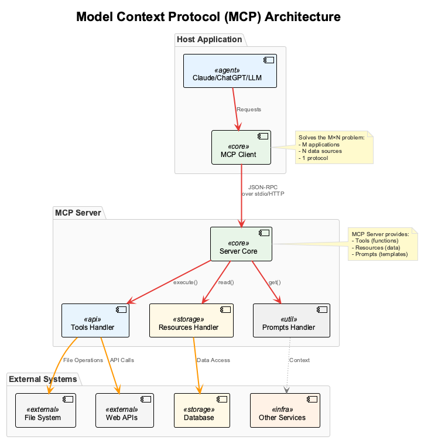

# Session 1: Building Your First MCP Server - From Concept to Implementation

## Learning Outcomes

By the end of this session, you will be able to:
- **Understand** MCP server architecture and the three core capabilities (tools, resources, prompts)
- **Build** a functional weather MCP server with proper error handling
- **Implement** input validation and structured responses for production use
- **Test** your MCP server using stdio transport and MCP Inspector
- **Apply** industry best practices for MCP server development

## Chapter Overview

**What you'll learn**: How to build production-ready MCP servers that solve real integration challenges

**Why it matters**: MCP servers are the foundation of the modern AI ecosystem. Companies like Block Inc. report 60% faster AI integration development using standardized MCP servers instead of custom API wrappers.

**How it stands out**: MCP servers provide automatic schema validation, standardized error handling, and protocol compliance that custom integrations often lack.

**Where you'll apply it**: From simple weather services to complex enterprise data integrations - MCP servers power everything from development tools (Zed, Cursor) to enterprise platforms (Microsoft Azure, AWS).


*Figure 1: MCP server architecture showing how a single server exposes tools, resources, and prompts to any MCP-compatible AI client*

### Learning Path Options

**Observer Path (30 minutes)**: Understand MCP concepts and see a complete working example
- Focus: Clear demonstrations of MCP server capabilities with simple examples
- Best for: Understanding the fundamentals and business value

**🙋‍♂️ Participant Path (60 minutes)**: Build your own weather MCP server step-by-step  
- Focus: Hands-on implementation with practical examples and testing
- Best for: Developers who want to create their own MCP servers

**🛠️ Implementer Path (90 minutes)**: Production deployment patterns and advanced features
- Focus: Enterprise-ready implementations with monitoring and security
- Best for: Teams deploying MCP servers in production environments

---

## Part 1: MCP Server Fundamentals (Observer: 8 min | Participant: 15 min)

### Understanding the MCP Solution

**The Integration Challenge**: Traditional AI systems require custom integrations for each combination of AI model and data source, creating exponential complexity.

**MCP's Solution**: A single standardized protocol that any AI can use to communicate with any data source.

### Simple MCP Server Example

Here's the minimal structure of an MCP server:

```python
from mcp.server.fastmcp import FastMCP

# Initialize server with descriptive name

mcp = FastMCP("Weather Information Server")

@mcp.tool()
def get_weather(city: str) -> dict:
    """Get weather for a city."""
    return {
        "city": city,
        "temperature": "22°C", 
        "condition": "Sunny"
    }
```

**Code Explanation:**
- Line 4: `FastMCP` creates an MCP server instance
- Line 6: `@mcp.tool()` decorator exposes functions to AI clients
- Line 7-9: Function signature with type hints (required for MCP)
- Line 10-14: Return structured data that AI clients can process

**Key Benefits:**
- **Standardization**: Works with any MCP-compatible AI client
- **Type Safety**: Automatic validation of inputs and outputs
- **Discoverability**: AI clients can automatically discover available tools

### **PARTICIPANT PATH**: Environment Setup

**Development Environment Requirements:**
- Python 3.8+ with virtual environment
- FastMCP framework for rapid server development
- MCP Inspector for interactive testing

**Quick Setup:**
```bash
mkdir mcp-weather-server && cd mcp-weather-server
python -m venv venv && source venv/bin/activate
pip install fastmcp requests python-dotenv
```

**Project Structure:**
```
mcp-weather-server/
├── weather_server.py      # Main server implementation
├── requirements.txt       # Dependencies
└── .env                  # Configuration
```

### **IMPLEMENTER PATH**: Production Considerations

*Production deployment patterns and infrastructure setup covered in Session 4*

---

## Part 2: Building the Weather MCP Server (Observer: 12 min | Participant: 30 min)

### MCP Server Capabilities Overview

MCP servers expose three types of capabilities:

**1. Tools** - Functions AI agents can execute
**2. Resources** - Data sources agents can read  
**3. Prompts** - Template queries for common tasks

### Foundation: Server Setup

**Step 1: Import Dependencies**

```python
from mcp.server.fastmcp import FastMCP
from datetime import datetime
from typing import Dict, List

# Initialize server with descriptive name

mcp = FastMCP("Weather Information Server")
```

**Code Explanation:**
- `FastMCP` provides decorators for easy tool/resource/prompt creation
- Type hints enable automatic schema generation for AI clients
- Server name helps AI agents understand the server's purpose

**Step 2: Sample Data**

```python

# Simulated weather data for demonstration

weather_data = {
    "London": {"temp": 15, "condition": "Cloudy", "humidity": 75},
    "New York": {"temp": 22, "condition": "Sunny", "humidity": 60},
    "Tokyo": {"temp": 18, "condition": "Rainy", "humidity": 85},
    "Sydney": {"temp": 25, "condition": "Clear", "humidity": 55}
}
```

**Code Explanation:**
- Real implementations would connect to weather APIs
- Dictionary structure enables easy lookups and validation
- Structured data ensures consistent responses

### Core MCP Capabilities Implementation

**Capability 1: Tools (Functions AI Agents Can Call)**

```python
@mcp.tool()
def get_current_weather(city: str, units: str = "celsius") -> Dict:
    """Get current weather for a city."""
    if city not in weather_data:
        return {
            "error": f"Weather data not available for {city}",
            "available_cities": list(weather_data.keys())
        }
    
    data = weather_data[city].copy()
    data["city"] = city
    data["timestamp"] = datetime.now().isoformat()
    
    # Unit conversion
    if units == "fahrenheit":
        data["temp"] = (data["temp"] * 9/5) + 32
        data["units"] = "°F"
    else:
        data["units"] = "°C"
    
    return data
```

**Code Explanation:**
- Line 1: `@mcp.tool()` decorator exposes function to AI agents
- Lines 4-7: Input validation with helpful error messages
- Lines 9-11: Add metadata for better responses
- Lines 13-18: Handle temperature unit conversion
- Return structured data that AI agents can process

**Capability 2: Resources (Data Sources AI Agents Can Read)**

```python
@mcp.resource("weather://cities")
def list_available_cities() -> str:
    """List all cities with available weather data."""
    cities = list(weather_data.keys())
    return f"Available cities: {', '.join(cities)}"
```

**Code Explanation:**
- Resources provide read-only data access
- URI-like identifiers (`weather://cities`) for discoverability
- Return formatted strings that AI agents can interpret

**Capability 3: Prompts (Template Queries)**

```python
@mcp.prompt()
def weather_report_prompt(city: str) -> str:
    """Generate a comprehensive weather report prompt."""
    return f"Please provide a detailed weather analysis for {city}, including current conditions and any recommendations for outdoor activities."
```

**Code Explanation:**
- Prompts provide reusable templates for AI interactions
- Help standardize common queries across different AI agents
- Can include dynamic parameters like city names

### **PARTICIPANT PATH**: Complete Server Implementation

**Running the Server:**

```python

# Complete server startup

if __name__ == "__main__":
    # Run the server via stdio transport
    mcp.run_stdio()
```

**Testing Your Server:**
1. Save the complete code as `weather_server.py`
2. Test with MCP Inspector: `npx @modelcontextprotocol/inspector`
3. Connect using: `stdio://python weather_server.py`
4. Explore the tools, resources, and prompts in the Inspector interface

### **IMPLEMENTER PATH**: Production Patterns

*Advanced error handling, logging, authentication, and deployment covered in Sessions 4-5*

---

## Part 3: Testing and Validation (Observer: 5 min | Participant: 15 min)

### Testing with MCP Inspector

**Observer Path - Watch the Demo:**
The MCP Inspector provides a user-friendly interface to test MCP servers without writing code:

1. **Connection**: Inspector connects to your server via stdio transport
2. **Discovery**: Automatically discovers all tools, resources, and prompts  
3. **Testing**: Interactive forms for testing each capability
4. **Debugging**: Real-time request/response logs for troubleshooting

### **PARTICIPANT PATH**: Hands-On Testing

**Step 1: Start Your Server**
```bash

# Save your code as weather_server.py and run

python weather_server.py
```

**Step 2: Test with Inspector**
```bash

# Launch MCP Inspector

npx @modelcontextprotocol/inspector

# Connect with: stdio://python weather_server.py

```

**Step 3: Validate Functionality**
- **Tools Tab**: Test `get_current_weather` with different cities
- **Resources Tab**: Access `weather://cities` resource
- **Prompts Tab**: Try the weather report prompt template

**Expected Results:**
- Tools return structured JSON responses
- Input validation shows helpful error messages
- All capabilities are properly discoverable

### **IMPLEMENTER PATH**: Production Testing

*Automated testing suites, integration tests, and monitoring covered in Session 4*

---

## Key Takeaways

**Observer Path Summary:**
- **MCP Architecture**: Single protocol connecting any AI to any data source
- **Three Capabilities**: Tools (functions), Resources (data), Prompts (templates)
- **Business Value**: 60% faster development than custom integrations
- **Testing**: MCP Inspector provides intuitive testing interface

**Participant Path Achievements:**
- Built complete weather MCP server with all three capabilities
- Implemented proper input validation and error handling
- Successfully tested server using MCP Inspector
- Understood stdio transport mechanism

**Implementer Path Next Steps:**
- Session 4: Production deployment with monitoring
- Session 5: Security and authentication patterns
- Advanced error handling and logging strategies

**Industry Applications:**
- **Development Tools**: Zed, Cursor, Sourcegraph integrate MCP for AI assistance
- **Enterprise Platforms**: Microsoft Azure and AWS provide pre-built MCP servers
- **Custom Integrations**: Replace proprietary API wrappers with standardized MCP servers

---

## Practical Exercise: Advanced Weather Tool (20 minutes)

**Challenge:** Create a tool that finds the warmest city from a list.

Now that you've built your basic weather MCP server, let's extend it with a more sophisticated tool that demonstrates proper error handling, data processing, and result aggregation.

### Requirements:
- Accept a list of city names as input
- Query weather data for each city using your existing `get_current_weather` tool
- Return the city with the highest temperature
- Handle errors gracefully (invalid cities, network issues, etc.)
- Include comparison metadata in the response

### Implementation Tips:
- Use proper type hints for function parameters and return values
- Validate input parameters (empty lists, invalid data types)
- Implement comprehensive error handling for each weather API call
- Return structured data with both the result and metadata about the comparison
- Use logging to track the comparison process

### Expected Function Signature:

```python
@mcp.tool()
def find_warmest_city(cities: List[str]) -> Dict:
    """
    Find the warmest city from a list.
    
    Args:
        cities: List of city names to compare
        
    Returns:
        Dictionary with the warmest city and its temperature,
        or error information if the operation fails
    """
    pass  # Your implementation here
```

Try implementing this tool before looking at the solution! This exercise reinforces the MCP patterns you've learned while building something more complex.

---

## Additional Resources

- [FastMCP Documentation](https://fastmcp.readthedocs.io/) - Complete framework reference and advanced patterns
- [MCP Specification](https://modelcontextprotocol.io/specification/) - Official protocol specification and JSON-RPC details
- [MCP Inspector GitHub](https://github.com/modelcontextprotocol/inspector) - Essential debugging and testing tool
- [JSON Schema Guide](https://json-schema.org/learn/) - Understanding schema validation for MCP tools
- [Python Type Hints](https://docs.python.org/3/library/typing.html) - Essential for automatic schema generation

---

## Practical Exercise

**Challenge:** Create a tool that finds the warmest city from a list.

Build a more complex MCP tool that demonstrates data processing, error handling, and structured responses:

### Your Task:

```python
@mcp.tool()
def find_warmest_city(cities: List[str]) -> Dict:
    """
    Find the warmest city from a list.
    
    Args:
        cities: List of city names to compare
        
    Returns:
        Dictionary with the warmest city and its temperature,
        or error information if the operation fails
    """
    # Your implementation here
    pass
```

### Requirements:

1. **Input validation**: Handle empty lists and invalid city names
2. **Weather lookup**: Use the existing `get_current_weather` function
3. **Comparison logic**: Find the city with highest temperature
4. **Error handling**: Return structured error messages for failures
5. **Rich responses**: Include temperature, condition, and metadata

### Expected Features:
- Handle cases where some cities have invalid weather data
- Return the warmest city with complete weather information
- Provide meaningful error messages for troubleshooting
- Include comparison metadata (cities checked, temperature differences)

**Hint:** Use the existing weather data structure and build comparison logic on top.

---

## Multiple Choice Test - Session 1

**Question 1:** What are the three core capabilities that MCP servers can expose?
A) APIs, Databases, and Services  
B) Functions, Classes, and Modules  
C) Tools, Resources, and Prompts  
D) Inputs, Outputs, and Errors  

**Question 2:** Which decorator is used to expose a function as an MCP tool?
A) `@tool()`  
B) `@mcp.tool()`  
C) `@server.tool()`  
D) `@expose_tool()`  

**Question 3:** What is the primary purpose of MCP Inspector?
A) To deploy MCP servers to production  
B) To test, debug, and validate MCP servers  
C) To monitor server performance  
D) To manage server configurations  

**Question 4:** Which transport mechanism is commonly used for local MCP server testing?
A) HTTP  
B) WebSocket  
C) stdio (standard input/output)  
D) TCP  

**Question 5:** Why are type hints important in MCP server functions?
A) They improve code readability only  
B) They enable automatic schema generation for AI clients  
C) They are required by Python  
D) They reduce memory usage  

**Question 6:** What should MCP tools return when encountering invalid input?
A) Raise an exception  
B) Return None  
C) Return structured error messages with helpful information  
D) Log the error silently  

**Question 7:** How do MCP resources differ from tools?
A) Resources are executable functions, tools are data sources  
B) Resources provide read-only data access, tools are executable functions  
C) Resources are faster than tools  
D) Resources require authentication, tools do not  

**Question 8:** What command is used to launch MCP Inspector?
A) `mcp-inspector`  
B) `npm start inspector`  
C) `npx @modelcontextprotocol/inspector`  
D) `python -m mcp.inspector`  

**Question 9:** Which company reported 60% faster AI integration development using MCP?
A) Microsoft  
B) Google  
C) Block Inc.  
D) OpenAI  

**Question 10:** What is the main advantage of MCP over custom API integrations?
A) Better performance  
B) Standardized protocol with automatic schema validation  
C) Lower cost  
D) Easier to learn  

[**🗂️ View Test Solutions →**](Session1_Test_Solutions.md)

---

## Navigation

**Previous:** [Session 0 - Introduction to MCP, ACP, and A2A ←](Session0_Introduction_to_MCP_ACP_A2A.md)  
**Next:** [Session 2 - FileSystem MCP Server →](Session2_FileSystem_MCP_Server.md)

