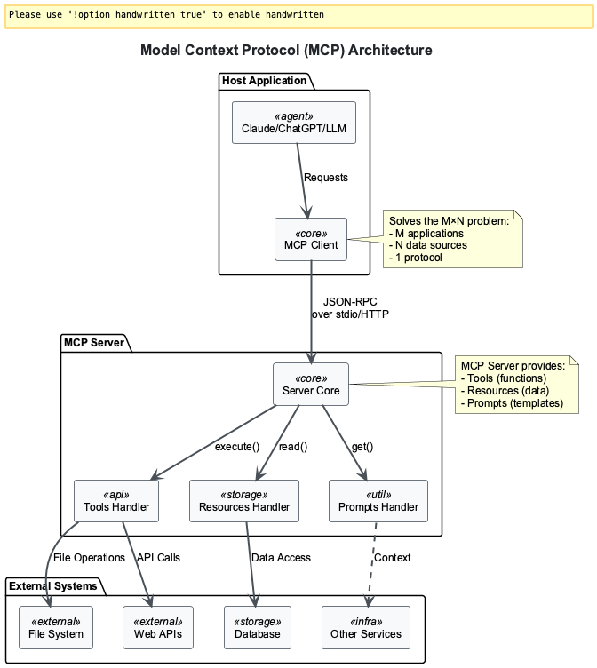

# 🎯 Session 1: Building Your First MCP Server

Build a production-ready MCP weather server demonstrating the three core MCP capabilities: tools, resources, and prompts. You'll create a foundation server that transforms isolated AI models into connected assistants capable of real-world interaction.


*MCP server architecture showing how a single server exposes capabilities to any MCP-compatible AI client*

## 🎯 Observer Path: Essential MCP Server Concepts

### Your First Real MCP Server

Remember Session 0's introduction to Model Context Protocol? Today, theory becomes reality. You're building a genuine weather intelligence system demonstrating MCP's transformative power.  

This isn't just fetching weather data—you're creating the foundation for connected AI assistants that interact with the real world.

### The Integration Revolution

**The Challenge**: Multiple AI assistants (Claude, ChatGPT, Gemini) each need weather data. Traditional approach requires three different integrations, three code bases, three authentication methods—exhausting and unscalable.  

**MCP's Solution**: Write ONE server that ALL AI systems instantly understand and use. That's what you're building today.

### Understanding MCP's Elegant Solution

**The Integration Nightmare**: Every AI-to-service connection required custom code. Ten AI models connecting to ten services meant 100 different integrations—unsustainable, error-prone, and expensive.  

**MCP's Breakthrough**: One protocol for universal AI communication. Your MCP server speaks a language any AI understands. Write once, connect everywhere.

### The Minimal MCP Server

This simple code demonstrates MCP's revolutionary power:  

```python
from mcp.server.fastmcp import FastMCP

# Initialize server with descriptive name
mcp = FastMCP("Weather Information Server")

@mcp.tool()
def get_weather(city: str) -> dict:
    """Get weather for a city."""
    return {
        "city": city,
        "temperature": "22°C", 
        "condition": "Sunny"
    }
```

**Code Power Explained**:  

- **FastMCP import**: Framework making MCP server creation effortless  
- **Server identity**: Name helps AI understand server purpose  
- **@mcp.tool() decorator**: Automatically exposes function to ANY AI system  
- **Type hints**: Enable automatic schema generation and validation  
- **Structured data**: AI clients immediately understand and use results  

### Revolutionary Benefits Unlocked

- **Universal Compatibility**: Works with Claude, ChatGPT, Gemini, and any future MCP-compatible AI  
- **Automatic Validation**: Type hints create bulletproof interfaces with zero extra code  
- **Self-Documenting**: AI clients automatically understand tool purposes and usage  

### Development Environment Setup

**Essential Tools**:  

- **Python 3.8+**: Primary language for MCP server development  
- **FastMCP**: Framework making complex servers simple  
- **MCP Inspector**: Essential debugging and testing tool  

**Quick Setup**:  

```bash
mkdir mcp-weather-server && cd mcp-weather-server
python -m venv venv && source venv/bin/activate
pip install fastmcp requests python-dotenv
```

This creates your project directory, virtual environment, and installs core dependencies for MCP development.

### Scalable Project Architecture

```
mcp-weather-server/
├── weather_server.py      # Core server implementation
├── requirements.txt       # Dependency manifest
└── .env                  # Configuration and secrets
```

This simple structure supports growth—additional modules, tests, and configurations can be added without breaking existing functionality.  

**Production Note**: Your server is production-capable. Session 4 covers deployment patterns for enterprise-scale operation.

### The Three Pillars of MCP Power

Every MCP server provides three capability types that transform AI from chatbots into capable assistants:  

**1. Tools**: Active capabilities that DO things (execute functions, call APIs, process data)  
**2. Resources**: Information sources that PROVIDE data (read-only knowledge access)  
**3. Prompts**: Intelligent templates that GUIDE interactions (standardized query patterns)  

---

## 📝 Participant Path: Practical Implementation

*Prerequisites: Complete Observer Path sections above*  

### Building Your Weather Server Foundation

**Essential Imports and Setup**:  

```python
from mcp.server.fastmcp import FastMCP
from datetime import datetime
from typing import Dict, List

# Initialize server with descriptive name
mcp = FastMCP("Weather Information Server")
```

**Import Significance**:  

- **FastMCP**: Gateway to effortless MCP server creation, handling all protocol complexity  
- **datetime**: Adds temporal context—AI needs to know WHEN data was fetched  
- **typing**: Creates contracts between server and AI clients through automatic schema generation  
- **Server naming**: Helps AI understand server purpose and capabilities  

### Creating the Data Foundation

We use simulated data for learning, but these patterns apply directly to real API integrations:  

```python
# Simulated weather data for demonstration
weather_data = {
    "London": {"temp": 15, "condition": "Cloudy", "humidity": 75},
    "New York": {"temp": 22, "condition": "Sunny", "humidity": 60},
    "Tokyo": {"temp": 18, "condition": "Rainy", "humidity": 85},
    "Sydney": {"temp": 25, "condition": "Clear", "humidity": 55}
}
```

**Architectural Benefits**:  

- **Dictionary structure**: Lightning-fast O(1) lookups for responsive AI interactions  
- **Consistent schema**: Predictable data structure across all cities  
- **Production-ready**: Replace with API calls for instant production capability  

### Implementing MCP's Three Capabilities

**Capability 1: Tools - Giving AI Action Powers**:  

```python
@mcp.tool()
def get_current_weather(city: str, units: str = "celsius") -> Dict:
    """Get current weather for a city."""
    if city not in weather_data:
        return {
            "error": f"Weather data not available for {city}",
            "available_cities": list(weather_data.keys())
        }
```

The tool decorator automatically generates schemas and validates inputs. Smart error handling guides AI toward valid inputs rather than crashing.  

```python
    data = weather_data[city].copy()
    data["city"] = city
    data["timestamp"] = datetime.now().isoformat()
    
    # Unit conversion for flexibility
    if units == "fahrenheit":
        data["temp"] = (data["temp"] * 9/5) + 32
        data["units"] = "°F"
    else:
        data["units"] = "°C"
    
    return data
```

Metadata enrichment (timestamps, city names) provides context. Built-in unit conversion shows how tools adapt to user preferences.

**Capability 2: Resources - Creating Knowledge Sources**:  

```python
@mcp.resource("weather://cities")
def list_available_cities() -> str:
    """List all cities with available weather data."""
    cities = list(weather_data.keys())
    return f"Available cities: {', '.join(cities)}"
```

**Resource Benefits**:  

- **Read-only access**: Safe by design—AI can read but never modify  
- **URI scheme**: `weather://cities` creates organized namespaces for hundreds of resources  
- **Human-readable**: String format aids debugging while remaining AI-parseable  

**Capability 3: Prompts - Teaching Better AI Questions**:  

```python
@mcp.prompt()
def weather_report_prompt(city: str) -> str:
    """Generate a comprehensive weather report prompt."""
    return f"Please provide a detailed weather analysis for {city}, including current conditions and any recommendations for outdoor activities."
```

**Prompt Value**:  

- **Consistency at scale**: Every AI agent asks for weather reports identically  
- **Dynamic intelligence**: Parameters make prompts adaptable to any situation  
- **Reduced errors**: Pre-defined prompts eliminate ambiguity in AI requests  

### Complete Server Implementation

**Server Startup**:  

```python
# Complete server startup
if __name__ == "__main__":
    # Run the server via stdio transport
    mcp.run_stdio()
```

**Testing Your Server**:  

1. Save your implementation as `weather_server.py`  
2. Launch MCP Inspector: `npx @modelcontextprotocol/inspector`  
3. Connect to server: `stdio://python weather_server.py`  
4. Watch Inspector automatically discover all capabilities  

**Advanced Topics**: Error handling, logging, authentication, and deployment covered in Sessions 4-5.

---

## ⚙️ Implementer Path: Advanced Server Development

*Prerequisites: Complete Observer and Participant paths*  

For comprehensive coverage of advanced MCP server patterns and enterprise deployment:  

- ⚙️ [Advanced Error Handling](Session2_Advanced_Security_Patterns.md)  
- ⚙️ [Production Deployment](Session4_Production_MCP_Deployment.md)  
- ⚙️ [Enterprise Monitoring](Session4_Production_Monitoring_Systems.md)  

---

## Testing and Validation

### MCP Inspector: Your Development Companion

MCP Inspector shows exactly how AI sees your server through four key capabilities:  

1. **Instant Connection**: Live link to server via stdio  
2. **Automatic Discovery**: Finds every capability with zero configuration  
3. **Interactive Testing**: Click-to-test interfaces showing AI agent responses  
4. **Deep Debugging**: View actual JSON-RPC messages for protocol understanding  

### Testing Workflow

**Server Startup**:  

```bash
# Save and run your server
python weather_server.py
```

**Inspector Connection**:  

```bash
# Launch MCP Inspector
npx @modelcontextprotocol/inspector
# Connect with: stdio://python weather_server.py
```

**Validation Steps**:  

- **Tools Tab**: Test `get_current_weather` with different cities  
- **Resources Tab**: Access `weather://cities` resource  
- **Prompts Tab**: Try weather report prompt template  

**Success Indicators**: Tools return structured JSON, errors provide helpful guidance, all capabilities appear automatically.

---

## Key Achievement Summary

### What You've Really Built

You've created a bridge between isolated AI models and the real world—proof of understanding the fundamental shift from closed chatbots to open, capable AI systems interacting with any data source.  

### Critical Insights Gained

- **MCP Architecture Mastery**: Understanding how one protocol eliminates N×M integration problems  
- **Three Pillars Expertise**: Tools that act, Resources that inform, Prompts that guide  
- **Production Readiness**: Your server approaches real-world deployment capability  
- **Testing Proficiency**: Professional MCP server validation and debugging skills  
- **Future-Proof Knowledge**: Skills applicable to any MCP server development  

### Real-World Impact

- **Development Revolution**: Zed, Cursor, Sourcegraph use MCP for AI-enhanced development  
- **Enterprise Adoption**: Microsoft Azure and AWS invest heavily in MCP integration  
- **API Transformation**: Companies replace hundreds of custom integrations with single MCP servers  

---

## 📝 Practical Exercise

**Challenge**: Create a tool finding the warmest city from a list.  

Extend your weather MCP server with sophisticated functionality demonstrating error handling, data processing, and result aggregation.  

### Requirements

- Accept list of city names as input  
- Query weather data for each city using existing tools  
- Return city with highest temperature  
- Handle errors gracefully (invalid cities, network issues)  
- Include comparison metadata in response  

### Implementation Guidelines

- Use proper type hints for parameters and returns  
- Validate input parameters (empty lists, invalid types)  
- Implement comprehensive error handling for each weather call  
- Return structured data with results and metadata  
- Use logging to track comparison process  

### Function Template

```python
@mcp.tool()
def find_warmest_city(cities: List[str]) -> Dict:
    """
    Find the warmest city from a list.
    
    Args:
        cities: List of city names to compare
        
    Returns:
        Dictionary with warmest city and temperature,
        or error information if operation fails
    """
    pass  # Your implementation here
```

Implement this tool to reinforce MCP patterns while building advanced functionality.

---

## Additional Resources

- [FastMCP Documentation](https://fastmcp.readthedocs.io/) - Complete framework reference and advanced patterns  
- [MCP Specification](https://modelcontextprotocol.io/specification/) - Official protocol specification and JSON-RPC details  
- [MCP Inspector GitHub](https://github.com/modelcontextprotocol/inspector) - Essential debugging and testing tool  
- [JSON Schema Guide](https://json-schema.org/learn/) - Understanding schema validation for MCP tools  
- [Python Type Hints](https://docs.python.org/3/library/typing.html) - Essential for automatic schema generation  

---

## 📝 Multiple Choice Test - Session 1

**Question 1:** What are the three core capabilities that MCP servers can expose?  
A) APIs, Databases, and Services  
B) Functions, Classes, and Modules  
C) Tools, Resources, and Prompts  
D) Inputs, Outputs, and Errors  

**Question 2:** Which decorator is used to expose a function as an MCP tool?  
A) `@tool()`  
B) `@mcp.tool()`  
C) `@server.tool()`  
D) `@expose_tool()`  

**Question 3:** What is the primary purpose of MCP Inspector?  
A) To deploy MCP servers to production  
B) To test, debug, and validate MCP servers  
C) To monitor server performance  
D) To manage server configurations  

**Question 4:** Which transport mechanism is commonly used for local MCP server testing?  
A) HTTP  
B) WebSocket  
C) stdio (standard input/output)  
D) TCP  

**Question 5:** Why are type hints important in MCP server functions?  
A) They improve code readability only  
B) They enable automatic schema generation for AI clients  
C) They are required by Python  
D) They reduce memory usage  

**Question 6:** What should MCP tools return when encountering invalid input?  
A) Raise an exception  
B) Return None  
C) Return structured error messages with helpful information  
D) Log the error silently  

**Question 7:** How do MCP resources differ from tools?  
A) Resources are executable functions, tools are data sources  
B) Resources provide read-only data access, tools are executable functions  
C) Resources are faster than tools  
D) Resources require authentication, tools do not  

**Question 8:** What command is used to launch MCP Inspector?  
A) `mcp-inspector`  
B) `npm start inspector`  
C) `npx @modelcontextprotocol/inspector`  
D) `python -m mcp.inspector`  

**Question 9:** What is the main benefit of MCP servers over custom API integrations?  
A) Lower development cost  
B) Better runtime performance  
C) Standardized protocol with automatic validation  
D) Easier deployment process  

**Question 10:** What file extension is required for MCP server implementations?  
A) `.mcp`  
B) `.py` (Python files)  
C) `.json`  
D) `.server`  

[**🗂️ View Test Solutions →**](Session1_Test_Solutions.md)

---

## 🧭 Navigation

**Previous:** [Session 0 - Introduction to MCP, ACP, and A2A ←](Session0_Introduction_to_MCP_ACP_A2A.md)  
**Next:** [Session 2 - FileSystem MCP Server →](Session2_FileSystem_MCP_Server.md)
