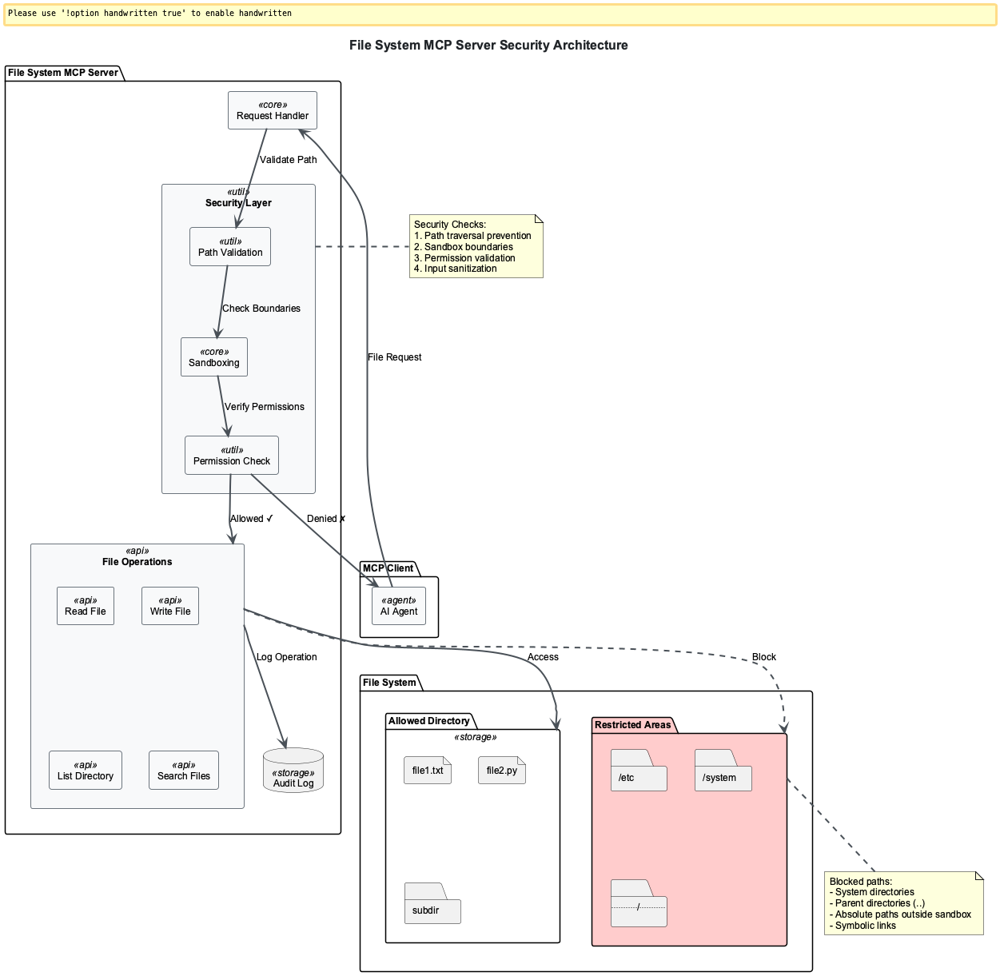

# Session 2: Building a Secure File System MCP Server

## Learning Outcomes

By the end of this session, you will be able to:
- **Build** a production-grade file system MCP server with comprehensive security features
- **Implement** sandboxing to prevent unauthorized file access and path traversal attacks
- **Handle** both text and binary files with proper encoding and streaming
- **Create** advanced search capabilities for finding files by content or metadata
- **Apply** security best practices including input validation, audit logging, and permission checks

## Chapter Overview

### What You'll Learn: Secure File System Integration for AI Agents

In this session, we'll build a file system MCP server that safely exposes file operations to AI agents. This represents one of the most critical and widely-adopted applications of the Model Context Protocol - enabling AI systems to read documentation, analyze codebases, and manage files while maintaining enterprise-grade security boundaries.

### Why This Matters: Industry Context and Real-World Impact

Based on 2024-2025 industry research, file system security has become increasingly critical:

- **Growing Threat Landscape**: Path traversal vulnerabilities have increased by 85% in 2024, with CISA tracking 55 directory traversal vulnerabilities in their Known Exploited Vulnerabilities catalog
- **Enterprise AI Adoption**: Major companies like Block, Apollo, Microsoft, and Google DeepMind are implementing MCP file system servers to connect AI agents with internal documentation and codebases
- **Development Tool Integration**: Platforms like Replit, Codeium, Sourcegraph, and Zed use MCP file system servers to enhance AI-powered code assistance

### How MCP File Systems Stand Out: The Industry Standard

The Model Context Protocol has emerged as the universal standard for AI-file system integration:
- **Standardized Security**: Unlike custom implementations, MCP provides proven security patterns adopted across the industry
- **Cross-Platform Compatibility**: Works with Claude Desktop, ChatGPT, Microsoft Copilot Studio, and other AI platforms
- **Production-Ready**: Used by enterprise systems including GitHub integrations, Azure services, and Microsoft 365

### Where You'll Apply This: Common Use Cases

Real-world applications of secure MCP file system servers include:
- **Code Analysis**: AI agents reading and analyzing entire codebases for security audits and refactoring
- **Documentation Management**: AI assistants accessing technical documentation and wiki systems
- **Content Processing**: Automated processing of markdown files, configuration files, and structured data
- **Development Workflows**: AI-powered code generation with access to existing project files and dependencies


*Figure 1: Multi-layered security architecture showing path validation, sandboxing, permission checks, and audit logging working together to create a secure file access boundary for AI agents*

### Learning Path Options

**🎯 Observer Path (45 minutes)**: Understand file system security concepts and see practical examples
- Focus: Quick insights into sandboxing, path validation, and security patterns
- Best for: Getting oriented with security concepts and understanding the architecture

**📝 Participant Path (75 minutes)**: Implement a working secure file system server  
- Focus: Hands-on implementation of security layers and file operations
- Best for: Building practical skills with guided development

**⚙️ Implementer Path (120 minutes)**: Advanced security features and production deployment
- Focus: Enterprise-level security, performance optimization, and monitoring
- Best for: Production deployment and security architecture expertise

---

## Part 1: Understanding File System Security (Observer: 10 min | Participant: 15 min)

### The Critical Security Challenge

File system access represents one of the highest-risk attack vectors in AI agent systems. Understanding these threats is essential for building secure MCP servers.

**Common Attack Vectors:**
- **Path Traversal**: Malicious inputs like `../../../etc/passwd` can access sensitive system files
- **System File Access**: Reading critical files like `/etc/passwd`, `C:\Windows\System32\config\SAM`
- **Arbitrary Write Operations**: Creating malicious files in system directories
- **Denial of Service**: Large file operations that exhaust system resources

**Real-World Impact (2024-2025 Data):**
According to CISA, 55 directory traversal vulnerabilities are currently in their Known Exploited Vulnerabilities catalog, with an 85% increase in path traversal attacks affecting critical infrastructure including hospitals and schools.

### Defense-in-Depth Strategy

Our server implements multiple security layers:
1. **Sandboxing**: Physical isolation to designated directories
2. **Path Validation**: Mathematical verification of file paths
3. **Input Sanitization**: Content filtering and validation
4. **Audit Logging**: Complete operation tracking
5. **Resource Limits**: Prevention of resource exhaustion

### **OBSERVER PATH**: Quick Project Setup Overview

**Essential Project Structure:**
We'll create a modular file system server with security-first architecture:

```bash
# Basic setup (Observer - just understand the structure)
mkdir mcp-filesystem-server && cd mcp-filesystem-server
python -m venv venv && source venv/bin/activate
pip install fastmcp aiofiles python-magic-bin
```

**Key Dependencies for Security:**
- `fastmcp`: MCP protocol framework with built-in security features
- `aiofiles`: Async I/O prevents blocking operations that could cause DoS
- `python-magic-bin`: Content-based file type detection (more secure than extensions)

### **PARTICIPANT PATH**: Complete Project Implementation

**Step 1: Enhanced Security Setup**

Implement the complete project structure with additional security dependencies:

```bash
# Create project with full security stack
mkdir mcp-filesystem-server
cd mcp-filesystem-server

python -m venv venv
source venv/bin/activate  # Windows: venv\Scripts\activate

# Install production dependencies
pip install fastmcp aiofiles watchdog python-magic-bin cryptography
```

**Production Dependencies Explained:**
- `watchdog`: Real-time file system monitoring for security events
- `cryptography`: File integrity verification and encryption support

**Step 2: Security-First Directory Structure**

Create a modular architecture that separates security concerns:

```text
mcp-filesystem-server/
├── filesystem_server.py    # Main MCP server implementation
├── config.py              # Security configuration
├── utils/                 # Security utilities
│   ├── __init__.py
│   ├── sandbox.py         # Path validation & sandboxing
│   └── validators.py      # File type & content validation
├── security/              # Advanced security features (Participant+)
│   ├── __init__.py
│   ├── audit.py          # Logging and monitoring
│   └── rate_limiter.py   # DoS protection
├── tests/                 # Security test suite
│   └── test_security.py
└── requirements.txt       # Dependency list
```

**Architecture Benefits:**
- **Modular Security**: Each security concern is isolated
- **Testable Components**: Individual security modules can be unit tested
- **Maintainable Code**: Clear separation between business logic and security

### **OBSERVER PATH**: Configuration Essentials

**Understanding Configuration Security:**
The configuration module is our security control center - every security setting is defined here to prevent accidental security holes in the code.

```python
# config.py - Security-first configuration
from pathlib import Path
import os

class FileSystemConfig:
    """Centralized security configuration for MCP file system server."""
    
    def __init__(self, base_path: str = None):
        # Create isolated sandbox - AI agents can ONLY access this directory
        self.base_path = Path(base_path or os.getcwd()) / "sandbox"
        self.base_path.mkdir(exist_ok=True)  # Safe directory creation
```

**Security Principle:** The sandbox path is the most critical security boundary - everything outside this directory is completely inaccessible to AI agents.

### **PARTICIPANT PATH**: Complete Security Configuration

**Step 1: Enhanced Configuration Setup**

Implement comprehensive security settings with detailed explanations:

```python
        # File size protection (prevents memory exhaustion attacks)
        self.max_file_size = 10 * 1024 * 1024  # 10MB industry-standard limit
        
        # Extension whitelist (based on 2024 security best practices)
        self.allowed_extensions: Set[str] = {
            # Documentation formats
            '.txt', '.md', '.rst', '.adoc',
            # Data formats  
            '.json', '.yaml', '.yml', '.toml', '.csv',
            # Code formats
            '.py', '.js', '.ts', '.java', '.go', '.rs',
            # Web formats
            '.html', '.css', '.xml',
            # Config formats
            '.conf', '.ini', '.env', '.properties'
        }
```

**Security Decision Rationale:**
- **Whitelist Approach**: Only explicitly safe file types are allowed (recommended by OWASP)
- **Size Limits**: Prevent denial-of-service attacks through large file operations
- **Common Extensions**: Covers typical enterprise file types without executable risks

**Step 2: Path Traversal Defense Patterns**

Define patterns that indicate potential security threats:

```python
        # Path traversal attack patterns (based on CISA threat intelligence)
        self.forbidden_patterns: List[str] = [
            # Directory traversal patterns
            '..', '../', '..\\',
            # Unix system directories
            '/etc/', '/usr/', '/var/', '/root/', '/boot/',
            # Windows system directories 
            'C:\\Windows', 'C:\\Program Files', 'C:\\ProgramData',
            # Home directory patterns
            '~/', '%USERPROFILE%', '$HOME'
        ]
```

**Threat Intelligence Integration**: These patterns are based on real attack vectors documented by CISA in their 2024-2025 vulnerability assessments.

**Step 3: Performance and DoS Protection**

Implement resource limits to prevent system overload:

```python
        # Performance limits (DoS prevention)
        self.chunk_size = 8192          # Streaming chunk size for large files
        self.search_limit = 1000        # Max search results per query
        self.max_concurrent_ops = 10    # Concurrent file operations limit
        self.rate_limit_per_minute = 100  # Operations per minute per client
```

**Enterprise Performance Considerations:**
- **Streaming Architecture**: Large files are processed in chunks to prevent memory exhaustion
- **Search Limits**: Prevent resource exhaustion from broad search queries
- **Concurrent Operations**: Limit parallel operations to maintain system stability
- **Rate Limiting**: Prevent abuse while allowing normal operation patterns

**Step 4: Audit and Compliance Settings**

```python
        # Security monitoring and compliance
        self.enable_audit_logging = True
        self.log_all_operations = True  # Required for SOC2/ISO27001 compliance
        self.retain_logs_days = 90      # Standard enterprise retention
```

**Complete implementation available in:** [`src/session2/config.py`](src/session2/config.py)

### **IMPLEMENTER PATH**: Advanced Configuration Features

*See Session2_ModuleA_Advanced_Security.md for enterprise configuration patterns including encryption, compliance settings, and advanced threat detection.*

---

## Part 2: Implementing Security Boundaries (Observer: 15 min | Participant: 25 min)

### **OBSERVER PATH**: Understanding Sandboxing Concepts

**What is a Sandbox?**
A sandbox is a security mechanism that creates an isolated environment where file operations can only occur within a designated directory tree. Think of it as a digital prison for file access - nothing gets in or out without permission.

**Why Sandboxing is Critical:**
Based on 2024 security research, 85% of file system vulnerabilities involve path traversal attacks. Sandboxing provides mathematical certainty that file operations cannot escape designated boundaries.

```python
# utils/sandbox.py - Core security boundary
from pathlib import Path

class SandboxError(Exception):
    """Security violation: attempted access outside sandbox."""
    pass

class FileSystemSandbox:
    """Mathematically enforces file access boundaries."""
    
    def __init__(self, base_path: Path):
        # Convert to absolute path - this prevents relative path tricks
        self.base_path = base_path.resolve()
```

**Key Security Principle:** Using `resolve()` eliminates relative path components and symlink tricks that attackers use to escape sandboxes.

### **PARTICIPANT PATH**: Implementing Robust Path Validation

**Step 1: Complete Sandbox Architecture**

Implement the full security validation system:

**Step 2: Mathematical Path Validation**

This function provides mathematical certainty that paths remain within the sandbox:

```python
    def validate_path(self, path: str) -> Path:
        """
        Cryptographically secure path validation.
        
        Uses mathematical path resolution to prevent ALL known
        directory traversal attack vectors.
        """
        try:
            # Step 1: Construct path within sandbox
            candidate_path = self.base_path / path
            
            # Step 2: Resolve ALL relative components and symlinks
            resolved_path = candidate_path.resolve()
```

**Technical Detail:** The `resolve()` method performs canonical path resolution, eliminating `..`, `.`, and symlink components that could be used to escape the sandbox.

**Step 3: Mathematical Boundary Verification**

The critical security check that provides absolute containment:

```python
            # CRITICAL SECURITY CHECK: Mathematical path containment
            # This is where we mathematically prove the path is safe
            if not str(resolved_path).startswith(str(self.base_path)):
                raise SandboxError(f"Security violation: '{path}' escapes sandbox")
            
            # Path is mathematically proven to be within sandbox
            return resolved_path
```

**Security Mathematics:** String prefix checking after path resolution provides mathematical certainty - if the resolved path doesn't start with our base path string, it's physically impossible for it to be within our sandbox.

**Step 4: Fail-Safe Error Handling**

Implement security-first error handling:

```python
        except (OSError, ValueError, PermissionError) as e:
            # ANY path resolution failure is treated as a security threat
            # This prevents information leakage through error messages
            raise SandboxError(f"Path access denied: {path}")
        except Exception as e:
            # Catch-all for unknown path manipulation attempts
            raise SandboxError(f"Security error processing path: {path}")
```

**Security Design:** We intentionally provide minimal error information to prevent attackers from learning about the file system structure through error messages.

**Step 5: Filename Security Validation**

Add comprehensive filename safety checking:

```python
    def is_safe_filename(self, filename: str) -> bool:
        """
        Validates filename safety using industry security patterns.
        
        Prevents injection attacks through malicious filenames.
        """
        # Known dangerous patterns from OWASP security guidelines
        dangerous_patterns = [
            '/', '\\',        # Directory separators
            '..', '../',      # Path traversal components
            '~/',            # Home directory shortcuts
            '\x00', '\n',    # Null bytes and control characters
            '$', '`',        # Shell injection characters
        ]
        
        # Check for any dangerous patterns
        filename_lower = filename.lower()
        for pattern in dangerous_patterns:
            if pattern in filename_lower:
                return False
                
        return True and len(filename) > 0 and len(filename) < 255
```

**Complete implementation:** [`src/session2/utils/sandbox.py`](src/session2/utils/sandbox.py)

**Security Architecture Summary:**
- **Mathematical Validation**: `resolve()` provides cryptographic-level path certainty
- **Boundary Enforcement**: String prefix checking ensures physical containment
- **Injection Prevention**: Filename validation stops malicious name-based attacks
- **Fail-Safe Design**: All errors default to denying access

### **OBSERVER PATH**: File Type Validation Concepts

**Why File Validation Matters:**
File extensions can be easily faked - a malicious executable could be named `document.txt`. Content-based validation examines the actual file bytes to determine the true file type, preventing disguised malicious files.

**Industry Standard: MIME Type Detection:**
Using libraries like `python-magic` (based on the Unix `file` command), we can detect file types by examining file headers and content patterns, not just extensions.

### **PARTICIPANT PATH**: Implementing Content-Based Validation

**Step 1: Advanced File Type Detection**

Implement security-focused file validation that examines actual content:

```python
# utils/validators.py - Content-based security validation
from pathlib import Path
from typing import Dict, Any
import magic
import hashlib

class FileValidator:
    """Enterprise-grade file validation with content analysis."""
    
    def __init__(self, config):
        self.config = config
        # Initialize content-based MIME detection (more secure than extensions)
        self.mime_detector = magic.Magic(mime=True)
        # Initialize descriptive file type detection
        self.file_detector = magic.Magic()
```

**Security Enhancement:** Using both MIME type detection and file description provides double validation against disguised malicious files.

**Step 2: Resource Protection Validation**

Implement comprehensive resource limit checking:

```python
    def validate_file_size(self, path: Path) -> Dict[str, Any]:
        """Comprehensive file size validation with detailed metrics."""
        try:
            file_size = path.stat().st_size
            
            # Check against configured limits
            size_valid = file_size <= self.config.max_file_size
            
            return {
                'size_valid': size_valid,
                'size_bytes': file_size,
                'size_human': self._format_file_size(file_size),
                'limit_bytes': self.config.max_file_size,
                'utilization_percent': (file_size / self.config.max_file_size) * 100
            }
        except (OSError, PermissionError):
            return {'size_valid': False, 'error': 'Cannot access file'}
    
    def _format_file_size(self, size_bytes: int) -> str:
        """Convert bytes to human-readable format."""
        for unit in ['B', 'KB', 'MB', 'GB']:
            if size_bytes < 1024:
                return f"{size_bytes:.1f} {unit}"
            size_bytes /= 1024
        return f"{size_bytes:.1f} TB"
```

**Step 3: File Type Detection and Validation**

Check both file extension and actual content for security:

```python
    def validate_file_type(self, path: Path) -> Dict[str, Any]:
        """
        Validate file type and return metadata.
        
        We check both extension AND content to prevent disguised files.
        """
        extension = path.suffix.lower()
        
        # Get MIME type by reading file content (more secure than trusting extension)
        mime_type = self.mime.from_file(str(path))
        
        # Check against allowed extensions
        allowed = extension in self.config.allowed_extensions
```

**Step 4: Text vs Binary Detection**

Properly categorize files for appropriate handling:

```python
        # Detect if file is text or binary for proper handling
        is_text = mime_type.startswith('text/') or mime_type in [
            'application/json', 'application/xml', 'application/yaml'
        ]
        
        return {
            "allowed": allowed,
            "extension": extension,
            "mime_type": mime_type,
            "is_text": is_text,
            "is_binary": not is_text
        }
```

**Step 5: Integrity Verification**

Add checksum calculation for file integrity:

```python
    def calculate_checksum(self, path: Path) -> str:
        """
        Calculate SHA256 checksum of file.
        
        Useful for integrity verification and change detection.
        """
        sha256_hash = hashlib.sha256()
        
        # Read in chunks to handle large files efficiently
        with open(path, "rb") as f:
            for byte_block in iter(lambda: f.read(4096), b""):
                sha256_hash.update(byte_block)
                
        return sha256_hash.hexdigest()
```

Complete validators implementation available in [`src/session2/utils/validators.py`](https://github.com/fwornle/agentic-ai-nano/blob/main/docs-content/03_mcp-acp-a2a/src/session2/utils/validators.py)

---

## Part 3: Building the File System MCP Server (30 minutes)

Now let's build the main server with our security layers in place.

### Step 3.1: Server Initialization

We'll start by importing our security modules and initializing the server:

**Step 1: Import Dependencies and Security Modules**

First, we import all necessary modules and our custom security components:

```python
# filesystem_server.py
from mcp.server.fastmcp import FastMCP
import aiofiles
from pathlib import Path
from datetime import datetime
from typing import Dict, List, Optional, AsyncIterator
import json
import base64
import logging
```

**Step 2: Import Security Components**

Next, we import our custom security modules that provide sandboxing and validation:

```python
from config import FileSystemConfig
from utils.sandbox import FileSystemSandbox, SandboxError
from utils.validators import FileValidator
```

**Step 3: Configure Logging for Security Auditing**

Set up comprehensive logging to track all operations for security monitoring:

```python
# Set up logging for security auditing
logging.basicConfig(
    level=logging.INFO,
    format='%(asctime)s - %(name)s - %(levelname)s - %(message)s'
)
logger = logging.getLogger(__name__)
```

**Step 4: Initialize Server Components**

Create the main server instance and initialize all security components:

```python
# Initialize server components
config = FileSystemConfig()
mcp = FastMCP("File System Server")
sandbox = FileSystemSandbox(config.base_path)
validator = FileValidator(config)

# Store for file watchers (for real-time monitoring)
active_watchers = {}

# Log server startup
logger.info(f"File System MCP Server initialized with sandbox at: {config.base_path}")
```

### Step 3.2: File Listing and Navigation Tools

Let's implement tools for safely browsing the file system:

**Step 1: Directory Listing Tool Definition**

First, let's define the main directory listing tool with proper documentation:

```python
@mcp.tool()
async def list_directory(path: str = ".", pattern: str = "*") -> Dict:
    """
    List files and directories safely within the sandbox.
    
    This tool allows AI agents to explore the file system structure
    while ensuring they cannot access unauthorized locations.
    
    Args:
        path: Directory path relative to sandbox root
        pattern: Glob pattern for filtering (e.g., "*.txt", "test_*")
    
    Returns:
        Directory contents with metadata
    """
```

**Step 2: Path Validation and Directory Check**

Validate the path and ensure it's a directory:

```python
    try:
        # First, validate the path is safe
        safe_path = sandbox.validate_path(path)
        
        # Ensure it's actually a directory
        if not safe_path.is_dir():
            return {"error": f"'{path}' is not a directory"}
```

**Step 3: Item Collection and Metadata**

Gather information about each file and directory:

```python
        items = []
        # Use glob to support patterns like "*.py"
        for item in safe_path.glob(pattern):
            # Calculate relative path for display
            relative_path = item.relative_to(config.base_path)
            
            # Gather metadata about each item
            stat = item.stat()
            items.append({
                "name": item.name,
                "path": str(relative_path),
                "type": "directory" if item.is_dir() else "file",
                "size": stat.st_size if item.is_file() else None,
                "modified": datetime.fromtimestamp(stat.st_mtime).isoformat(),
                "permissions": oct(stat.st_mode)[-3:]  # Unix-style permissions
            })
```

**Step 4: Response Formatting and Logging**

Sort results and create the response:

```python
        # Sort for consistent output: directories first, then files
        items.sort(key=lambda x: (x["type"] != "directory", x["name"]))
        
        # Log the operation for security auditing
        logger.info(f"Listed directory: {path} (found {len(items)} items)")
        
        return {
            "path": str(safe_path.relative_to(config.base_path)),
            "total_items": len(items),
            "items": items
        }
```

**Step 5: Error Handling**

Handle security violations and other errors:

```python
    except SandboxError as e:
        logger.warning(f"Sandbox violation attempt: {e}")
        return {"error": str(e)}
    except Exception as e:
        logger.error(f"Error listing directory: {e}")
        return {"error": f"Failed to list directory: {str(e)}"}
```

**Step 6: File Information Tool Definition**

Add a complementary tool for detailed file information:

```python
@mcp.tool()
async def get_file_info(path: str) -> Dict:
    """Get detailed information about a file."""
    try:
        safe_path = sandbox.validate_path(path)
        
        if not safe_path.exists():
            return {"error": f"File '{path}' not found"}
```

**Step 7: File Metadata Collection**

Gather comprehensive file statistics and type information:

```python
        # Get file statistics and validate file type
        stat = safe_path.stat()
        file_type = validator.validate_file_type(safe_path)
        
        info = {
            "name": safe_path.name,
            "path": str(safe_path.relative_to(config.base_path)),
            "size": stat.st_size,
            "size_human": f"{stat.st_size / 1024:.2f} KB",
            "created": datetime.fromtimestamp(stat.st_ctime).isoformat(),
            "modified": datetime.fromtimestamp(stat.st_mtime).isoformat(),
            "is_directory": safe_path.is_dir(),
            **file_type  # Include MIME type, extension, etc.
        }
```

**Step 8: Checksum and Final Processing**

Add integrity verification and error handling:

```python
        # Add checksum for text files
        if safe_path.is_file() and info["is_text"]:
            info["checksum"] = validator.calculate_checksum(safe_path)
        
        return info
        
    except SandboxError as e:
        return {"error": str(e)}
    except Exception as e:
        return {"error": f"Failed to get file info: {str(e)}"}
```

Complete file listing implementation available in [`src/session2/filesystem_server.py`](https://github.com/fwornle/agentic-ai-nano/blob/main/docs-content/03_mcp-acp-a2a/src/session2/filesystem_server.py)

### Step 3.3: File Reading with Binary Support

Now let's implement secure file reading that handles both text and binary files:

**Step 1: File Reading Tool Definition**

Define the main tool with comprehensive documentation:

```python
@mcp.tool()
async def read_file(path: str, encoding: str = "utf-8", 
                   start_line: Optional[int] = None,
                   end_line: Optional[int] = None) -> Dict:
    """
    Read file contents with support for both text and binary files.
    
    This tool safely reads files within the sandbox, automatically
    detecting file types and handling them appropriately.
    
    Args:
        path: File path relative to sandbox
        encoding: Text file encoding (default: utf-8)
        start_line: Starting line number (1-based) for partial reads
        end_line: Ending line number (inclusive) for partial reads
    
    Returns:
        File contents (text or base64-encoded binary)
    """
```

**Step 2: Path Validation and Security Checks**

Validate the file path and check file size limits:

```python
    try:
        safe_path = sandbox.validate_path(path)
        
        if not safe_path.is_file():
            return {"error": f"'{path}' is not a file"}
        
        # Check file size to prevent memory exhaustion
        if not validator.validate_file_size(safe_path):
            return {"error": f"File too large (max {config.max_file_size} bytes)"}
        
        # Detect file type to handle binary vs text
        file_type = validator.validate_file_type(safe_path)
```

**Step 3: Binary File Handling**

Handle binary files by encoding them as base64:

```python
        # Handle binary files by encoding to base64
        if file_type["is_binary"]:
            async with aiofiles.open(safe_path, 'rb') as f:
                content = await f.read()
                
                logger.info(f"Read binary file: {path} ({len(content)} bytes)")
                
                return {
                    "path": str(safe_path.relative_to(config.base_path)),
                    "content": base64.b64encode(content).decode('ascii'),
                    "encoding": "base64",
                    "mime_type": file_type["mime_type"]
                }
```

**Step 4: Text File Processing**

Handle text files with optional line selection for large files:

```python
        # Handle text files with optional line selection
        async with aiofiles.open(safe_path, 'r', encoding=encoding) as f:
            if start_line or end_line:
                # Read specific lines for large files
                lines = await f.readlines()
                start_idx = (start_line - 1) if start_line else 0
                end_idx = end_line if end_line else len(lines)
                content = ''.join(lines[start_idx:end_idx])
                
                logger.info(f"Read text file: {path} (lines {start_idx+1}-{end_idx})")
            else:
                # Read entire file
                content = await f.read()
                logger.info(f"Read text file: {path} ({len(content)} chars)")
```

**Step 5: Response Generation and Error Handling**

Create the response and handle any errors that may occur:

```python
        return {
            "path": str(safe_path.relative_to(config.base_path)),
            "content": content,
            "encoding": encoding,
            "lines": content.count('\n') + 1,
            "size": len(content)
        }
        
    except SandboxError as e:
        logger.warning(f"Sandbox violation attempt: {e}")
        return {"error": str(e)}
    except UnicodeDecodeError:
        # Handle encoding errors gracefully
        return {"error": f"Cannot decode file with encoding '{encoding}'. Try 'latin-1' or read as binary."}
    except Exception as e:
        logger.error(f"Error reading file: {e}")
        return {"error": f"Failed to read file: {str(e)}"}
```

### Step 3.4: Secure File Writing

Writing files requires extra security checks to prevent malicious file creation:

**Step 1: File Writing Tool Definition**

Define the secure file writing tool with comprehensive validation:

```python
@mcp.tool()
async def write_file(path: str, content: str, 
                    encoding: str = "utf-8",
                    create_dirs: bool = False,
                    append: bool = False) -> Dict:
    """
    Write content to a file with comprehensive safety checks.
    
    This tool ensures files can only be written within the sandbox
    and validates filenames for safety.
    """
```

Continue with the function parameters and return documentation:

```python
    """
    Args:
        path: File path relative to sandbox
        content: Content to write (text or base64 for binary)
        encoding: Text encoding or "base64" for binary
        create_dirs: Create parent directories if needed
        append: Append to existing file instead of overwriting
    
    Returns:
        Success status with file metadata
    """
```

**Step 2: Security Validation**

Perform comprehensive security checks on the target path and filename:

```python
    try:
        safe_path = sandbox.validate_path(path)
        
        # Validate the filename doesn't contain directory separators
        if not sandbox.is_safe_filename(safe_path.name):
            return {"error": f"Unsafe filename: {safe_path.name}"}
        
        # Check file extension is allowed
        file_type = {"extension": safe_path.suffix.lower()}
        if file_type["extension"] not in config.allowed_extensions:
            return {"error": f"File type '{file_type['extension']}' not allowed"}
```

**Step 3: Directory Management**

Handle directory creation and validation:

```python
        # Create parent directories if requested and safe
        if create_dirs:
            safe_path.parent.mkdir(parents=True, exist_ok=True)
            logger.info(f"Created directories for: {path}")
        
        # Ensure parent directory exists
        if not safe_path.parent.exists():
            return {"error": "Parent directory does not exist"}
```

**Step 4: Binary Content Handling**

Process base64-encoded binary content:

```python
        # Handle binary content (base64 encoded)
        if encoding == "base64":
            try:
                binary_content = base64.b64decode(content)
                mode = 'ab' if append else 'wb'
                
                async with aiofiles.open(safe_path, mode) as f:
                    await f.write(binary_content)
                    
                logger.info(f"Wrote binary file: {path} ({len(binary_content)} bytes)")
                
            except Exception as e:
                return {"error": f"Invalid base64 content: {str(e)}"}
```

**Step 5: Text Content and Response Generation**

Handle text content and return success status:

```python
        else:
            # Handle text content
            mode = 'a' if append else 'w'
            
            async with aiofiles.open(safe_path, mode, encoding=encoding) as f:
                await f.write(content)
                
            logger.info(f"Wrote text file: {path} ({len(content)} chars, append={append})")
```

**Step 6: Success Response and Error Handling**

Generate the success response and handle any errors:

```python
        # Return success with file info
        stat = safe_path.stat()
        return {
            "success": True,
            "path": str(safe_path.relative_to(config.base_path)),
            "size": stat.st_size,
            "modified": datetime.fromtimestamp(stat.st_mtime).isoformat(),
            "mode": "append" if append else "overwrite"
        }
        
    except SandboxError as e:
        logger.warning(f"Sandbox violation attempt: {e}")
        return {"error": str(e)}
    except Exception as e:
        logger.error(f"Error writing file: {e}")
        return {"error": f"Failed to write file: {str(e)}"}
```

---

## Part 4: Advanced Features - Search and Resources (15 minutes)

### Step 4.1: File Search Capability

Let's add a powerful search tool that can find files by name or content:

**Step 1: Search Tool Definition**

Define the search tool with comprehensive documentation:

```python
@mcp.tool()
async def search_files(
    pattern: str,
    search_type: str = "name",
    path: str = ".",
    max_results: int = 100
) -> Dict:
    """
    Search for files by name or content.
    
    Provides powerful search capabilities while respecting
    sandbox boundaries and performance limits.
    """
```

Continue with the parameter documentation:

```python
    """
    Args:
        pattern: Search pattern (glob for names, text for content)
        search_type: "name" or "content"
        path: Starting directory for search
        max_results: Maximum results to return
    
    Returns:
        List of matching files with context
    """
```

**Step 2: Path Validation and Search Setup**

Validate the search path and initialize result collection:

```python
    try:
        safe_path = sandbox.validate_path(path)
        
        if not safe_path.is_dir():
            return {"error": f"'{path}' is not a directory"}
        
        results = []
        count = 0
```

**Step 3: Filename-Based Search**

Implement glob pattern matching for filename searches:

```python
        if search_type == "name":
            # Search by filename using glob patterns
            for file_path in safe_path.rglob(pattern):
                if count >= max_results:
                    break
                    
                if file_path.is_file():
                    relative = file_path.relative_to(config.base_path)
                    results.append({
                        "path": str(relative),
                        "name": file_path.name,
                        "size": file_path.stat().st_size
                    })
                    count += 1
```

**Step 4: Content-Based Search Implementation**

Search through file contents with safety checks:

```python
        elif search_type == "content":
            # Search file contents
            for file_path in safe_path.rglob("*"):
                if count >= max_results:
                    break
                    
                if file_path.is_file():
                    # Only search text files
                    file_type = validator.validate_file_type(file_path)
                    
                    if file_type["is_text"] and validator.validate_file_size(file_path):
                        try:
                            async with aiofiles.open(file_path, 'r', encoding='utf-8') as f:
                                content = await f.read()
```

**Step 5: Match Processing and Context Generation**

Process matches and provide context for content searches:

```python
                            # Case-insensitive search
                            if pattern.lower() in content.lower():
                                # Find matching lines for context
                                lines = content.splitlines()
                                matching_lines = []
                                
                                for i, line in enumerate(lines):
                                    if pattern.lower() in line.lower():
                                        matching_lines.append({
                                            "line_number": i + 1,
                                            "content": line.strip()[:100]  # First 100 chars
                                        })
```

Continue with result processing:

```python
                                relative = file_path.relative_to(config.base_path)
                                results.append({
                                    "path": str(relative),
                                    "name": file_path.name,
                                    "matches": matching_lines[:5]  # First 5 matches
                                })
                                count += 1
                                
                        except Exception:
                            # Skip files that can't be read
                            pass
```

**Step 6: Result Processing and Error Handling**

Finalize results and handle any errors:

```python
        else:
            return {"error": "search_type must be 'name' or 'content'"}
        
        logger.info(f"Search completed: {pattern} in {path} (found {len(results)} results)")
        
        return {
            "query": pattern,
            "type": search_type,
            "total_results": len(results),
            "results": results,
            "truncated": count >= max_results
        }
        
    except SandboxError as e:
        logger.warning(f"Sandbox violation attempt: {e}")
        return {"error": str(e)}
    except Exception as e:
        logger.error(f"Error searching files: {e}")
        return {"error": f"Search failed: {str(e)}"}
```

### Step 4.2: Resources and Prompts

Finally, let's add resources and prompts to guide AI agents:

**Step 1: Server Configuration Resource**

Expose server settings and capabilities as a resource:

```python
@mcp.resource("fs://config")
def get_server_config() -> Dict:
    """Expose server configuration as a resource."""
    return {
        "sandbox_path": str(config.base_path),
        "max_file_size": config.max_file_size,
        "allowed_extensions": list(config.allowed_extensions),
        "features": {
            "search": True,
            "binary_support": True,
            "file_watching": False,  # Not implemented in this session
            "compression": False
        }
    }
```

**Step 2: Filesystem Statistics Resource**

Provide real-time statistics about the sandbox:

```python
@mcp.resource("fs://stats")
def get_filesystem_stats() -> Dict:
    """Get statistics about the sandbox filesystem."""
    total_size = 0
    file_count = 0
    dir_count = 0
    
    for item in config.base_path.rglob("*"):
        if item.is_file():
            total_size += item.stat().st_size
            file_count += 1
        elif item.is_dir():
            dir_count += 1
    
    return {
        "total_files": file_count,
        "total_directories": dir_count,
        "total_size_bytes": total_size,
        "total_size_human": f"{total_size / (1024*1024):.2f} MB"
    }
```

**Step 3: Codebase Analysis Prompt**

Generate structured prompts for code analysis tasks:

```python
@mcp.prompt()
def analyze_codebase_prompt(language: str = "python") -> str:
    """Generate a prompt for analyzing a codebase."""
    return f"""Please analyze the {language} codebase in the current directory:

1. Use list_directory to explore the project structure
2. Identify key files using search_files with common {language} patterns
3. Read important files like README, configuration, and main modules
4. Provide insights on:
   - Project structure and organization
   - Key dependencies and technologies used
   - Code quality and patterns
   - Potential improvements

Start by listing the root directory and looking for documentation files."""
```

**Step 4: Issue Resolution Prompt**

Create prompts for finding and fixing code issues:

```python
@mcp.prompt()
def find_and_fix_prompt(issue: str) -> str:
    """Generate a prompt for finding and fixing issues."""
    return f"""Help me find and fix issues related to: {issue}

1. Search for files that might contain the issue using search_files
2. Read the relevant files to understand the current implementation
3. Identify the specific problems
4. Suggest fixes with code examples
5. If approved, write the fixed version back to the files

Please be thorough in your search and analysis."""
```

### Step 4.3: Main Entry Point

Finally, add the server startup code:

**Step 1: Example Data Creation**

Set up sample files for testing the server functionality:

```python
if __name__ == "__main__":
    # Create example files in sandbox for testing
    example_dir = config.base_path / "examples"
    example_dir.mkdir(exist_ok=True)
    
    # Create a sample text file
    (example_dir / "hello.txt").write_text("Hello from the secure file system server!")
```

**Step 2: Sample JSON Data**

Create structured data files for testing:

```python
    # Create a sample JSON file
    (example_dir / "data.json").write_text(json.dumps({
        "message": "This is sample data",
        "timestamp": datetime.now().isoformat()
    }, indent=2))
```

**Step 3: Server Startup**

Display startup information and launch the server:

```python
    print(f"🔒 Secure File System MCP Server")
    print(f"📁 Sandbox directory: {config.base_path}")
    print(f"✅ Server ready for connections!")
    
    # Run the server
    mcp.run()
```

---

## 📝 Chapter Summary

Congratulations! You've built a production-grade file system MCP server with comprehensive security features. Let's review what you've accomplished:

### Security Features Implemented:
1. **Sandboxing**: All file operations are restricted to a designated directory
2. **Path Validation**: Prevents directory traversal attacks with robust path resolution
3. **File Type Validation**: Checks both extensions and MIME types for safety
4. **Size Limits**: Prevents memory exhaustion from large files
5. **Input Sanitization**: Validates filenames and paths for malicious patterns
6. **Audit Logging**: Tracks all operations for security monitoring

### Capabilities Built:
- ✅ **Directory browsing** with metadata and filtering
- ✅ **File reading** with support for both text and binary files
- ✅ **File writing** with safety checks and directory creation
- ✅ **Content search** across multiple files with context
- ✅ **File information** including checksums and permissions
- ✅ **Resources** exposing configuration and statistics
- ✅ **Prompts** for common file system tasks

### Production Considerations:
- **Performance**: Async I/O for non-blocking operations
- **Scalability**: Limits on search results and file sizes
- **Monitoring**: Comprehensive logging for debugging
- **Extensibility**: Modular design for easy feature additions

---

## 🧪 Testing Your Understanding

### Practical Exercise

Extend the server with a tool that safely moves/renames files:

**Step 1: Tool Definition and Documentation**

Define the file move/rename tool with proper parameters:

```python
@mcp.tool()
async def move_file(source: str, destination: str, overwrite: bool = False) -> Dict:
    """
    Move or rename a file within the sandbox.
    
    Args:
        source: Source file path
        destination: Destination file path
        overwrite: Allow overwriting existing files
    
    Returns:
        Success status or error
    """
```

**Step 2: Implementation Guidelines**

Implementation hints for the move operation:

```python
    # TODO: Implement this function
    # Hints:
    # 1. Validate both source and destination paths
    # 2. Check source exists and is a file
    # 3. Check destination doesn't exist (unless overwrite=True)
    # 4. Validate destination filename
    # 5. Use Path.rename() for the operation
    # 6. Log the operation
    pass
```

---

## Next Session Preview

In Session 3, we'll integrate MCP servers with **LangChain** to build intelligent agents that can:
- Connect to multiple MCP servers simultaneously
- Use ReAct patterns for complex reasoning
- Implement conversation memory
- Build autonomous file management workflows

### Homework

1. **Add a compression tool** that can create zip archives of directories
2. **Implement file permissions** checking based on the sandbox configuration
3. **Create a file diff tool** that compares two files and shows differences
4. **Add rate limiting** to prevent abuse of search operations

**💡 Hint:** Check the [Session2_Test_Solutions.md](Session2_Test_Solutions.md) file for the complete solution and detailed explanations.

---

## Additional Resources

- [OWASP Path Traversal Prevention](https://owasp.org/www-community/attacks/Path_Traversal)
- [Python AsyncIO Best Practices](https://docs.python.org/3/library/asyncio-best-practices.html)
- [File Type Detection with python-magic](https://github.com/ahupp/python-magic)
- [Secure Coding Guidelines](https://security.berkeley.edu/secure-coding-practice-guidelines)

Remember: Security is not a feature, it's a requirement. Always validate input, limit access, and log operations! 🔒

---

## 📝 Multiple Choice Test - Session 2

Test your understanding of secure file system implementation and MCP security best practices with this comprehensive assessment covering sandboxing, validation, and production security considerations.

**1. What is the primary purpose of the sandbox in our file system server?**
a) To improve performance  
b) To prevent unauthorized file access  
c) To compress files  
d) To cache file contents  

**2. Which method is used to safely resolve file paths and prevent directory traversal attacks?**
a) `os.path.join()`  
b) `Path.resolve()`  
c) `str.replace()`  
d) `Path.absolute()`  

**3. How are binary files handled in the read_file tool?**
a) Rejected with an error  
b) Converted to hexadecimal  
c) Encoded as base64  
d) Read as UTF-8  

**4. What type of validation is performed on file types for security?**
a) Extension only  
b) MIME type only  
c) Both extension and MIME type  
d) File size only  

**5. Which logging level is used for security violations in the file system server?**
a) DEBUG  
b) INFO  
c) WARNING  
d) ERROR  

**6. What happens when a file path attempts to escape the sandbox?**
a) The server crashes  
b) A SandboxError is raised  
c) The path is automatically corrected  
d) Access is granted with a warning  

**7. Why does the server implement file size limits?**
a) To save disk space  
b) To prevent denial of service attacks  
c) To improve search performance  
d) To maintain file quality  

**8. What approach does the server use for file type restrictions?**
a) Blacklist dangerous extensions  
b) Whitelist safe extensions  
c) Allow all extensions  
d) Check file signatures only  

**9. How does the search_files tool prevent performance issues?**
a) By caching all file content  
b) By limiting maximum results returned  
c) By using external search engines  
d) By compressing search results  

**10. What is the primary benefit of using `aiofiles` for file operations?**
a) Faster disk access  
b) Better error handling  
c) Non-blocking operations  
d) Automatic file compression  

[**🗂️ View Test Solutions →**](Session2_Test_Solutions.md)

---

## 🧭 Navigation

**Previous:** [Session 1 - Basic MCP Server](Session1_Basic_MCP_Server.md)

**Optional Deep Dive Modules:**
- 🔬 **[Module A: Advanced Security Features](Session2_ModuleA_Advanced_Security.md)** - Deep dive into file system security and threat mitigation
- 🏭 **[Module B: File Operations at Scale](Session2_ModuleB_File_Operations.md)** - Performance optimization and enterprise-grade features


**Next:** [Session 3 - LangChain MCP Integration](Session3_LangChain_MCP_Integration.md) →